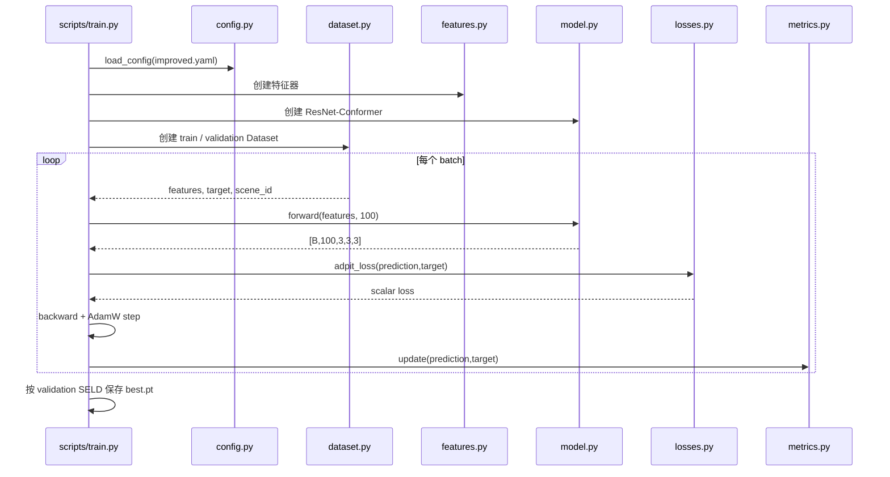

---
category:
  - 杂记
---

# 06 代码地图与运行步骤

## 1. 项目目录地图

```text
work/
├── configs/                       # 实验配置
│   ├── default.yaml               # 完整生产配置
│   ├── improved.yaml              # 改进训练覆盖项
│   ├── logmel_only.yaml           # 去掉 SALSA-Lite 的消融配置
│   └── smoke.yaml                 # 极小流程测试配置
├── scripts/                       # 可直接运行的命令入口
├── src/chicken_seld/              # 可复用的核心实现
├── tests/test_core.py             # 几何、标签、loss、模型单测
├── data/simulated_static/         # 已生成数据和特征
├── checkpoints/                   # 模型权重和训练历史
├── runs/                          # 评估、阈值、推理和图片结果
├── docs/model_code_guide/         # 本说明目录
├── README.md                      # 项目快速说明
├── RESULTS.md                     # 已完成实验结果
└── pyproject.toml                 # Python 依赖与工具配置
```

## 2. 核心库文件职责

| 文件 | 主要职责 | 建议先读的符号 |
|---|---|---|
| `config.py` | YAML 继承、深度合并、项目路径解析 | `load_config` |
| `splits.py` | 扫描原 WAV、验证源文件划分、选取场景声源 | `load_source_split`, `choose_sources` |
| `geometry.py` | 欧拉旋转、正四面体阵列、方向与角度转换 | `tetrahedral_positions` |
| `simulator.py` | 随机房间、事件、RIR、四通道音频和元数据 | `simulate_scene`, `generate_dataset` |
| `labels.py` | 事件转逐帧 CSV 与 Multi-ACCDOA target | `encode_multi_accdoa` |
| `features.py` | STFT、log-mel、SALSA-Lite | `LogMelSalsaLite.forward` |
| `dataset.py` | 缓存读取、在线特征、标准化、SpecAugment | `ChickenSeldDataset.__getitem__` |
| `model.py` | ResNet、Conformer、Multi-ACCDOA 输出头 | `ResNetConformerMultiAccdoa.forward` |
| `losses.py` | 三轨 ADPIT 和活动模长辅助损失 | `adpit_loss` |
| `metrics.py` | 活动筛选、方向去重、匹配和 SELD 指标 | `SeldAccumulator` |

## 3. 入口脚本职责

| 脚本 | 输入 | 输出 |
|---|---|---|
| `generate_dataset.py` | YAML、原始 WAV、源划分 | 音频、标签、target、元数据 |
| `inspect_dataset.py` | 生成数据根目录 | `quality_report.json` |
| `prepare_features.py` | 生成音频和配置 | float16 特征缓存 |
| `compute_feature_stats.py` | 训练特征缓存 | 训练集均值/标准差 |
| `train.py` | 配置、数据、可选 resume checkpoint | `best.pt`、`last.pt`、history |
| `tune_threshold.py` | checkpoint、验证集 | 阈值扫描 JSON |
| `evaluate.py` | checkpoint、验证/测试集 | 指标和场景诊断 JSON |
| `infer.py` | 一个四通道 WAV、checkpoint | 逐帧预测 JSON |
| `visualize_scene.py` | 数据根目录、scene id | 波形/事件/房间 PNG |

## 4. 配置文件怎样工作

`default.yaml` 是完整配置。其他配置可写：

```yaml
extends: default.yaml
```

`load_config()` 会先读取父配置，再递归覆盖子配置中的字典字段。例如 improved 只写 40 轮、
batch 16 等差异，其余数据、特征和模型参数来自 default。

相对输出路径以项目根目录解析；源数据路径和源划分当前写成绝对路径。

## 5. 从零到结果的标准顺序

以下命令都在项目根目录执行。

### 步骤 0：指定 Python

```powershell
$python = "C:\Users\chenwenda\AppData\Local\Programs\Python\Python312\python.exe"
```

若换机器，可在兼容 Python 3.11+ 的环境中按 `pyproject.toml` 安装依赖。

### 步骤 1：只估算数据大小

```powershell
& $python scripts/generate_dataset.py --config configs/default.yaml --estimate-only
```

这一步不写音频。估算只包含 PCM 音频，并给标签、元数据、文件系统预留 5%；它不包含
后来生成的特征缓存，所以最终目录通常会比估算值大。

### 步骤 2：先做 smoke 测试

```powershell
& $python scripts/generate_dataset.py --config configs/smoke.yaml
& $python scripts/inspect_dataset.py data/smoke_static
```

确认小样本流程正常后再生成完整数据，可更早发现路径或依赖问题。

### 步骤 3：生成正式静止声源数据

```powershell
& $python scripts/generate_dataset.py --config configs/default.yaml --resume
```

`--resume` 会跳过 JSONL 清单中已有的 scene id，适合长时间生成被中断后续跑。

### 步骤 4：质量检查

```powershell
& $python scripts/inspect_dataset.py data/simulated_static
```

只有 `valid=true`、无 source leak 且源文件覆盖完整时，才建议进入训练。

### 步骤 5：预计算特征

```powershell
& $python scripts/prepare_features.py --config configs/default.yaml
```

已有同名缓存默认跳过；需要强制重算时使用 `--overwrite`。改变 FFT、mel 或 SALSA 参数后
必须重算缓存，否则可能继续读取旧特征。

### 步骤 6：只用训练集计算标准化统计

```powershell
& $python scripts/compute_feature_stats.py data/simulated_static
```

应在特征缓存准备完成后执行。改变特征定义后也必须重新计算。

### 步骤 7：训练改进模型

```powershell
& $python scripts/train.py --config configs/improved.yaml
```

恢复中断训练：

```powershell
& $python scripts/train.py --config configs/improved.yaml `
  --resume checkpoints/improved/last.pt
```

命令行 `--epochs` 可覆盖总 epoch 数，但续训时调度器状态和新的总 epoch 目标需要谨慎核对。

### 步骤 8：在验证集选阈值

```powershell
& $python scripts/tune_threshold.py checkpoints/improved/best.pt `
  --config configs/improved.yaml `
  --output runs/improved_threshold_tuning.json
```

当前选择结果为 0.60。不要在 test 上扫描阈值。

### 步骤 9：测试集只做一次冻结评估

```powershell
& $python scripts/evaluate.py checkpoints/improved/best.pt `
  --config configs/improved.yaml `
  --split test `
  --activity-threshold 0.60 `
  --output runs/improved_test_evaluation.json
```

### 步骤 10：对单个音频推理

```powershell
& $python scripts/infer.py `
  data/simulated_static/audio/test/test_000000.wav `
  checkpoints/improved/best.pt `
  --config configs/improved.yaml `
  --output runs/inference.json
```

当前推理脚本使用配置阈值；若需要严格复现校准结果，要在部署配置中把阈值设为 0.60。

### 步骤 11：运行回归测试

```powershell
& $python -m compileall -q src scripts tests
& $python -m unittest discover -s tests -v
```

当前 8 项测试覆盖：

- 正四面体边长；
- 角度转换；
- 房间到阵列坐标变换；
- 标签帧对齐；
- ADPIT 轨道排列不变性；
- 活动模长辅助损失；
- 辅助轨道方向去重；
- 模型输出形状。

## 6. 一次训练调用关系



## 7. 输出文件去哪找

| 需要查什么 | 文件位置 |
|---|---|
| 数据质量 | `data/simulated_static/quality_report.json` |
| 一场景全部仿真参数 | `data/simulated_static/scenes/<split>/<scene>.json` |
| 训练特征统计 | `data/simulated_static/feature_normalization.json/.npz` |
| 最佳模型 | `checkpoints/improved/best.pt` |
| 最后一轮模型 | `checkpoints/improved/last.pt` |
| 每轮曲线原始数据 | `checkpoints/improved/history.json` |
| 阈值扫描 | `runs/improved_threshold_tuning.json` |
| 测试结果 | `runs/improved_test_evaluation.json` |
| 项目结果摘要 | `RESULTS.md` |

## 8. 建议的代码阅读路线

第一次阅读按由短到长：

```text
config.py
→ geometry.py
→ labels.py
→ features.py
→ model.py
→ losses.py
→ dataset.py
→ train.py
→ metrics.py
→ simulator.py
```

不要按文件名首字母读。先理解训练主线，再回头看数据如何生产，会更容易建立整体图景。
