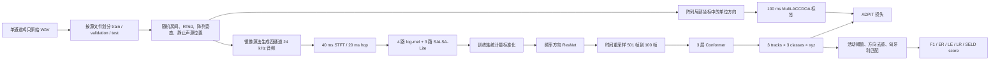

# 鸡只声音定位基线：模型与代码结构说明

本文档对应当前工作区中的 **ResNet-Conformer + Multi-ACCDOA（含 SALSA-Lite）**
静止声源基线。目标是解释一条音频从原始鸡只录音开始，经过空间仿真、特征提取、
模型训练，最终变成类别与三维方向预测的完整路径。

## 阅读顺序

1. [第一次写模型：30 分钟快速入门](00_beginner_quickstart.md)：先跑通、看形状，再读原理。
2. [数据集与空间仿真](01_dataset_simulation.md)：原始音频如何被放进随机鸡舍，生成四通道音频。
3. [特征与标签](02_features_and_labels.md)：log-mel、SALSA-Lite 和 Multi-ACCDOA 的含义及形状。
4. [模型结构](03_model_architecture.md)：ResNet、Conformer、输出头逐层做了什么。
5. [损失与训练](04_training_and_loss.md)：ADPIT、活动权重、训练循环、保存规则。
6. [评估与推理](05_evaluation_and_inference.md)：阈值、去重、匈牙利匹配和 SELD 指标。
7. [代码地图与运行步骤](06_code_map_and_commands.md)：每个文件的职责和从零运行命令。
8. [实现假设与扩展建议](07_assumptions_and_extensions.md)：当前边界、容易踩坑的地方和后续方向。

## 一张图看完整流程



## 当前基线的关键事实

| 项目 | 当前值 |
|---|---|
| 任务 | 鸡只声音事件检测与三维方向估计 |
| 类别 | `Healthy`、`Noise`、`Unhealthy` |
| 声源运动 | 静止点声源 |
| 麦克风 | 随机旋转的四通道正四面体阵列 |
| 场景数 | 972：训练 720、验证 108、测试 144 |
| 单场景长度 | 10 s |
| 音频格式 | 24 kHz、4 通道、PCM-16 |
| 输入特征 | 4 路 log-mel + 3 路 SALSA-Lite，共 7 通道 |
| 标签步长 | 0.1 s，共 100 帧 |
| 最大同类声源数 | 3 tracks |
| 模型参数量 | 1,467,291 |
| 改进模型配置 | 40 epochs、batch 16、初始学习率 7e-4、dropout 0.15 |
| 校准阈值 | 验证集选出的活动阈值 0.60 |
| 改进测试结果 | Macro F1 0.3488、LE 20.94°、SELD score 0.4624 |

训练、验证、测试比例分别约为 **74.07% / 11.11% / 14.81%**。划分隔离的是
原始源文件，不只是生成后的场景，因此同一个原始 WAV 不会跨集合出现。

## 张量主线

以一个 10 秒场景为例：

```text
四通道波形                  [4, 240000]
STFT                        [4, 481, 501]
log-mel + SALSA-Lite        [7, 64, 501]
批次输入                    [B, 7, 64, 501]
ResNet 输出                 [B, 128, 8, 501]
频率平均                    [B, 501, 128]
对齐标签时间轴              [B, 100, 128]
Conformer 输出              [B, 100, 128]
Multi-ACCDOA 输出/标签      [B, 100, 3, 3, 3]
                           [批次, 时间, 轨道, 类别, xyz]
```

最后一个三维向量同时携带活动性和方向：零向量表示无事件；非零向量的模长表示
活动强度，归一化后的方向表示声源的 `(x, y, z)` 单位方向。

## 文档对应范围

本文档按当前仓库代码解释，而不是泛泛介绍论文模型。完整实验数字见项目根目录的
[`RESULTS.md`](../../RESULTS.md)，有效配置以 [`configs/default.yaml`](../../configs/default.yaml)
和 [`configs/improved.yaml`](../../configs/improved.yaml) 为准。
