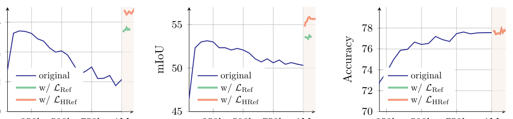
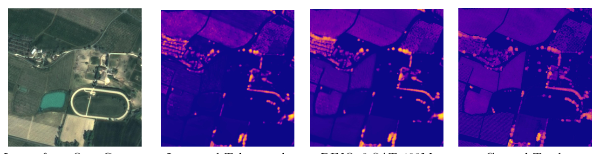

---
category:
  - 深度学习
  - dino
---

# DINOv3 创新点报告

> 主题：Meta AI **DINOv3** 视觉基础模型（技术报告 arXiv:2508.10104v1，2025-08-13，**全文 67 页**：正文 §1–§10 至 **p.37**、References 自 **p.38** 起、附录至 p.67）。
> 目标读者：想理解「DINOv3 为什么强、每个设计选择背后的道理」的研究者。
> 组织原则：每个创新点都按 **动机（解决什么问题）→ 机制（为什么这样做有效）→ 具体做法 → 实验证据（精确数字）→ 消融结论 → 局限** 展开。
>
> **页数出处**：`dinov3_paper_clean.txt` 的 PDF 页标为 `PAGE 1`–`PAGE 67`；§10 Conclusion（clean L3305）落在 `PAGE 37`（该页页脚为 `37`），`PAGE 38` 起为 `References`（clean L3334）。**「14 页」在资料中查不到**，系把 arXiv 页面的文件体积 `14,591 KB`（`dinov3_arxiv_abs.txt` L29）误当页数（`sources/MANIFEST.md` 第 9 行沿用了同一错数；`notes/round1_review.md` 第 16 行已指出其为错）。

> **本版（v2）修订要点速览**（便于对照上一版复核）：
> 1. **事实更正 10 处**：§7.1「7B impractical」来源改 [BLOG]；§7.2 `broadcast_to_subgroups` 归属改到 `SSLMetaArch`；§3.3.1 `img_level` 构造无效、改述生效链路；§3.9 第 3 条「推理开销」改述为「训练期成本、推理零开销」；§1.5 Fig.1 面板 (b) 与三任务配对更正；§10.2 第 10 项删除无依据的 `global_ignore_diagonal` 表述；§3.4.1 `only_teacher` build 无条件执行；§3.6.1 第 4 条来源改 §4.3 正文；§10.7 更正 value gating 对 outlier 的作用方向；§1.6 更正 0.278 RMSE 属 KITTI 非 NYU。
> 2. **行号更正**：`patch_embed_lr_mult` L118→**L119**、`OFFICIAL_EPOCH_LENGTH` L46→**L47**、`periods` 定义 L122-137→**L108-121**；并**全文改为以符号名定位**（§0.2 纪律 5）。
> 3. **新增实质内容**：§1.6 旗舰结果集中表（Tab.3 全行 + 检测/分割/跟踪）、§2.7 feature dimension outliers 完整一节、§3.10 Gram 训练期专用/推理零开销、§5.2 stochastic depth 0.4、§7.7 各 ViT 规模架构清单、§10.7「4 Registers 最优」的数字张力。
> 4. **可读性修复**：「资料未给出」清单统一收口到 §12.4；曲线「逐点未给」声明收口到 §0.2 与 §12.4；关键英文引句补中文释义；iBOT head 冲突从脚注移入表内；删除多处自疑标记。

> **本版（v3）修订要点速览**（第二轮增补，便于对照 v2 复核）：
> 1. **新增一节 §13「许可证与风险」**：依 `notes/license.md` 写清研究/商用/再分发边界、领域限制与专利终止、地理公平性与偏见（含 Table 26 量化数字）。
> 2. **新增一节 §7.8「『七个 ViT 规格』的设计逻辑」**：用 HF 官方模型卡的维度/头数/FFN 对比表，论证 ViT-S+ / ViT-H+ 的 custom 落在哪（原「局限」顺延为 §7.9）。
> 3. **§1.6 旗舰集中表补入 HF 官方模型卡口径的 ViT-7B/16 全行与卫星 GEO-Bench 结果**，并把它与论文口径的差异（ObjectNet/IN-R 同为 91.1）就地标注。
> 4. **配图 15 幅**：按 `notes/figures.md` 的配图方案，在 §1.5/§1.6/§2.2/§2.3/§3.4/§3.5/§3.6/§4.4/§6.4/§7.2/§7.4/§10.6 插入论证性插图（相对路径 `sources/figs/*.png`），每图配中文图注并点明「这张图说明了什么」。
> 5. **可读性再修**：把残留的曲线「逐点数值」重复声明合并为单一处（§0.2 + §12.4），§2.2/§3.6/§3.8/§6.4 不再逐处重复。
> 6. **本轮不动 v2 已核实的事实**；§2.7（feature dimension outliers）与 §5.2（stochastic depth）经回核论文 App.A.2 与 App.C，内容与原文一致，原文保留。

> **本版（v4）修订要点速览**（第二轮事实核验后的更正 + 补全，便于对照 v3 复核）：
> 1. **事实更正 5 处**：① 页数由「正文 14 页」更正为「全文 67 页（正文至 p.37、References 自 p.38 起）」；② §1.5 配图 1 图注 (c)(d) 由「自然/医学域与遥感域」更正为「自然图像 (c) 与航拍图像 (d)」（与论文 Fig.1 caption 及本报告前文一致）；③ §10.6「ViT-22B 等大规模有监督」一行按 [P §6.2.1] 原文重写归属（原文说的是 IN-R/-Sketch 上 comparable、IN-A/ObjectNet 上 closely behind PE，而非「追平 ViT-22B」）；④ §7.6 读表结论补上四档实际差值（T −0.7 / S −1.0 / B −0.8 / L −0.7，**非随规模单调缩小**）；⑤ §13.1 许可证标题行由「第 2–3 行」更正为「第 3 行」。
> 2. **新增实质内容**：§1.6 补入 **表 F（实例检索 Tab.9）**、**表 G（3D 对应 Tab.4，Probe3D/NAVI/SPair）**、**表 H（单目深度系统级 Tab.12，DAv2/DPT）** 三块系统级结果；§1.5 增加 Fig.1(a) 逐年数值明细表 **Tab.21** 的定位；§12.3 补登 3 条资料内部不一致（VOC07 CorLoc、Objects365@2048 epochs、Tab.10 EVA-02 Co-DETR 行）。
> 3. **配图处理**：§1.5 配图 1 中文图注删去「医学域」并注明论文原文；§3.4 配图 5（Fig.7）加「论证见 §3.6.2」的位置说明（图与图注本身无误，仅位置偏题）。
> 4. **对核验意见的复核（两条不采纳）**：对「§8.4『4 节点 × 8 GPU = 32 GPU』属推断」与「`dinov3_train_multidist_meta_arch.py` 实为 166 行」两条，回一手资料后确认**核验有误**（README 原文即 "4 nodes with 8 gpus each (32 gpus in total)"；该文件实测 165 行），正文已就地加固出处，详见 §8.4 / §7.2。

---

## 0. 阅读与引用约定

### 0.1 来源标注格式

本文所有事实均来自资料文件，逐条标注。约定：

- 论文（首选文本源 `D:/Workspace/research/dino-v3/sources/dinov3_paper_clean.txt`，双栏重排，表格完整）：`[P §4.2]`、`[P Fig.9b]`、`[P Tab.2]`、`[P App.A]`、`[P C]`（C = 附录 C Implementation Details）、`[P D.9]`。
- 备选全文（`dinov3_paper.txt`，pdftotext -layout 原版，个别表格更整齐）：`[P-raw]`。
- 官方仓库源码/配置（`D:/Workspace/research/dino-v3/sources/repo/` 下）：`[CODE: 文件路径 + 类名/函数名/配置键]`。**本报告优先用「符号名」定位代码（类名 / 方法名 / 配置键），仅在确有歧义时补行号**——因为行号会随仓库版本漂移（本报告的修订正是为修正一批行号偏差）。
- 仓库文档：`[MC]`（`repo/MODEL_CARD.md`）、`[RM]`（`dinov3_github_readme.md`）、`[HFCARD]`（`hf_model_cards.md`，HF 官方模型卡合并版）、`[BLOG]`（Meta 官方博客）、`[HF]`（HF Transformers 文档）、`[DATASETS]`（`repo/DATASETS.md`）、`[LIC]`（`dinov3_license.txt`，DINOv3 License 全文；其要点另见 `notes/license.md`）。
- **第二轮新增的独立来源笔记**（均已逐条核对到上述一手文件）：`notes/hf_cards.md`（HF 官方模型卡逐模型规格 + 全家族评测表，补 [HFCARD] 的取数）、`notes/license.md`（许可证与偏见，本章 §13 的依据）、`notes/figures.md`（论文插图中文索引与配图方案，本报告配图的依据）。
- **不可引用**：`D:/Workspace/research/dino-v3/sources/hf_facebook_dinov3-*_config.json` 是 gated 模型返回的 401 错误页（每份仅 148–156 字节），不是真实配置；本文未从中引用任何数值。

### 0.2 五条写作纪律

1. **数字必须来自资料**。查不到的一律写「资料未给出」，不做推断补全。
2. **曲线图（Fig.5b/5c、Fig.6、Fig.7、Fig.8、Fig.11）的逐点读数论文未以文字给出**，只能引用论文的文字描述；本文不会伪造曲线上的读数。**这一声明在全文只出现这一次与 §12.4 末尾的统一清单处**，其余小节涉及这些图时不再重复「逐点未给」。
3. **笔记与原文冲突时以原文为准**，并在正文显式标注。资料内部本身存在的冲突（如 learning rate、EMA momentum 在不同文件不一致）会原样并列，不擅自裁决。
4. **英文原句必给中文释义**（可读性纪律）：本文大量关键论断直接引自论文英文原文；凡**承载结论**的英文引句，均在其后以「中文释义：……」补一句中文，避免出现「读者只能看残句英文、无法判断语义」的情况。尤其注意：`dinov3_paper_clean.txt` 是**双栏重排**产物，个别英文引句可能被拆成残句——凡遇此类，本文改用 `dinov3_paper.txt`（layout 版）校正后再引（已修正的典型：§4.1 的数据策展句）。
5. **代码引用以「符号」为主**：优先用「文件 + 类名/函数名/配置键」定位，行号仅作辅助（且给出时经逐行核对）。本报告的修订正是为纠正一批行号偏差。

### 0.3 术语表（贯穿全文）

| 术语 | 含义 |
|---|---|
| dense features / feature map | backbone 输出的逐 patch 特征图，分割、深度、对应关系等稠密任务的基础 |
| patch-level consistency | 一张图内不同 patch 特征之间的相似度结构是否「干净、局部化」 |
| Gram matrix | 一张图内全部 patch 特征两两点积组成的矩阵，刻画「特征之间的相似度几何」 |
| Gram anchoring | 用早期 teacher 的 Gram 矩阵当锚，约束 student 的相似度结构（本文核心创新） |
| EMA teacher | 学生权重的指数滑动平均得到的教师网络（DINO 系列传统做法） |
| LVD-1689M / SAT-493M | 网页域 / 卫星域两个预训练数据集 |
| RoPE | Rotary Positional Embeddings，旋转位置编码（Su et al. 2024） |
| register tokens | 额外的「存储 token」，用于吸收全局通信、抑制离群 patch |
| log-FLOPs | 横轴为推理算力对数的性能曲线图（Fig.2） |

---

## 1. 一页总结：DINOv3 的三条主线创新

论文在 Introduction 的「Overview of Contributions」小节（仍在 §1 内，p.4）用 (i)–(iv) 列出四条贡献 [P §1]；把它们归纳为**三条主线**，其相互关系是理解全篇的钥匙：

### 1.1 主线一：Scaling（数据 + 模型 + 训练时长）

- **数据 scaling**：基于 Vo et al. (2024) 的自动数据策展，构建超大「背景」训练集，并混入少量专用数据（ImageNet-1k）[P §1 (i)、P §3.1]。
- **模型 scaling**：把 teacher 从 DINOv2 的 **1.1B（ViT-giant）** 扩到 **6.7B（ViT-7B）**；采用自定义 ViT 变体：现代位置编码（axial RoPE）+ 正则化技术避免伪影 [P §1 (ii)、P Tab.2]。
- **训练时长 scaling**：**抛弃 DINOv2 的多段 cosine schedule，改用 constant 超参训练 1M iterations** [P §1 (ii)、P §3.2]。

### 1.2 主线二：Gram anchoring（本文核心）

大模型长训练会让**全局指标持续变好、但 dense 特征退化**。论文提出 **Gram anchoring** 训练阶段，用早期 teacher 的 patch 相似度矩阵当锚，清理特征图中的噪声 [P §1 (iii)、P §4]。这是本文最硬、最有原创性的贡献。

### 1.3 主线三：Post-hoc strategies（后处理策略）

pipeline 末段三件套 = **高分辨率 post-training（§5.1）+ 高效单教师多学生蒸馏（§5.2）+ 文本对齐（§5.3）** [P §1 (iv)]。它们把已经变强的 backbone 变成「覆盖全算力预算的一族可开箱即用模型」。

### 1.4 三条主线的相互关系（用一句话讲清闭环）

```
数据/模型/训练时长 scaling  ──►  逼出 dense 退化问题  ──►  Gram anchoring 修复它
        (主线一)                      (新问题)                  (主线二)
                                                                   │
                                                                   ▼
                                              post-hoc 三件套把成果落地成模型家族
                                                          (主线三)
```

- **Because of scaling, the degradation appears**：作者明确说，这个退化现象在 DINOv2 训练中就曾（较小程度地）被观察到，在 Fan et al. (2025) 的 scaling 工作中也被讨论过，但**在此之前未被解决** [P §4.1]。
- **Gram anchoring is the enabler of scaling**：论文结论原话——**「Gram anchoring 有效缓解了长训练下 dense feature map 的退化」** [P §10 Conclusion]。
- **Post-hoc 把 backbone 变成产品**：高分辨率适配**必须配 Gram anchoring**（否则 dense 性能显著退化）[P §5.1]；蒸馏阶段**不再需要 Gram**（因为没观察到 patch-level consistency 问题）[P §5.2]——这条对比本身就说明 Gram 解决的是「长训练」特有的病。

### 1.5 论文主结果承诺（供后面各创新点对照）

- 冻结 backbone，**COCO detection mAP 66.1**；**ADE20k 语义分割 mIoU 63.0**，超过专用微调流水线 [P §1]。
- 官方博客的规模对比：**比 DINOv2 大 7 倍的模型，训练在 12 倍大的数据集上**；覆盖 **15 个视觉任务、60+ benchmark** [BLOG]。
- 相对提升（[P Fig.1(b)] 柱状标注）：**Δ33% / Δ34% / Δ22%**，与三个任务**按位置一一配对**为 **Δ33% → Depth（深度）、Δ34% → Tracking（视频分割跟踪）、Δ22% → Segm.（语义分割）**。原始版式的柱状图把百分比标在柱子顶端、三个任务名标在同一组的柱下（clean 文本 L113-123 可见 `∆33% ∆34% ∆22%` 与 `Depth Tracking Segm.` 两条紧邻的标签行），因此配对关系是资料明确给出的，本报告据此确定。
  - 该面板是 **Fig.1(b)**（不是 (d)）：caption 原文为「…the relative performance of **the best-in-class WSL models to DINOv3 (b)**」，即展示「最优弱监督模型 → DINOv3」在三类 dense 任务上的相对性能提升；同图 (a) 是 IN1k 线性探针的历年曲线，(c)/(d) 分别是自然图与航拍图的 PCA 特征可视化。

**对照用的一句话结论**：DINOv3 的收益呈「dense 大、全局稳」的形态——dense 三类任务相对最优 WSL 提升 22%–34%，而全局分类只是追平弱监督强模型（IN1k 88.4 vs SigLIP 2 / PE 同档）。下节的旗舰结果集中表给出绝对数值。

**配图 1｜SSL 大势与跨任务增益（[P Fig.1]，`sources/figs/fig1_p2.png`）**


*中文图注*：(a) 2015–2025 年 ImageNet-1k 线性探针准确率的逐年曲线，三条路线 SL（监督）/WSL（弱监督）/SSL（自监督）——SSL 起步晚但已追平近年 ImageNet 平台期；(b) DINOv3 相对最强 WSL 模型在三个稠密任务上的柱状对比，即 **Δ33% → Depth、Δ34% → Tracking、Δ22% → Segm.**；(c)(d) 高分辨率稠密特征可视化——**(c) 是自然图像（画面中为狗与猫），(d) 是航拍/遥感图像**（论文 Fig.1 caption 原文：trained on **natural (c) and aerial images (d)**）。**⚠️ 修订**：旧图注把 (c)(d) 写成「自然/医学域与遥感域」，其中「医学域」与图为 (c) 的画面（狗、猫等自然图像）及论文原文均不符，本次删去。**溯源**：`notes/figures.md` 第 30/33 行的旧表述把 **§1 正文里的领域列表**——「domains like **histopathology** (Vorontsov et al., 2024) … **medical imaging** (Pérez-García et al., 2025), **remote sensing** (Cong et al., 2022; …)」（`dinov3_paper_clean.txt` **L132–134**）——误当成了 Fig.1 的图注；**Fig.1 caption 本身只写 "trained on natural (c) and aerial images (d)"**。本报告 §1.5 前文「(c)/(d) 分别是自然图与航拍图的 PCA 特征可视化」本就正确。
**这张图说明了什么**：它把本报告的选题理由一次说清——**SSL 已到平台期，而 DINOv3 的增量几乎全部落在稠密任务上**（深度 +33%、跟踪 +34%、分割 +22%），而不是再去刷 ImageNet 分类。这正是后文全部创新点（Gram anchoring、高分辨率适配、蒸馏家族）要服务的靶心。
*裁切提示*：(a) 的纵轴刻度与标题被左缘裁掉，(b)/(d) 的面板标记被裁；图中纵轴数值**以论文正文/表格为准**，不照图读数。来源：[INDEX.md Figure 1 图注]；[P Fig.1]。

**Fig.1(a) 的逐年数值去哪里查——论文确有专门明细表 Tab.21**：论文用 **Tab.21** 逐行给出三条路线各年的 top-1 与对应文献，caption 原文为「**Details of year of publication, performance, and reference of the numbers used in Fig. 1.**」，并说明「对每篇论文报其在 ImageNet 上**最大模型**的 top-1；弱监督与自监督模型报**线性探针**性能；年份取该工作首次出现在 arXiv 的年份」（[P Tab.21 caption]，`dinov3_paper.txt` 起于 L3044；`dinov3_paper_clean.txt` 位于 `PAGE 55`，clean L4859 起）。该表按 **Supervised / Weakly-Supervised / Self-Supervised** 三轨组织，年份覆盖 2012–2025。**⚠️ 取数提示**：两种重排文本（clean 与 raw）对 Tab.21 的「年号 ↔ 数值」行列对齐不一致（例如 78.6/He et al. (2016) 一行在两种文本里分属 2015 与 2014），故本报告**不照重排文本逐点转录**，需要精确读数时请以论文原表（PDF p.55）为准。

### 1.6 旗舰模型 DINOv3 ViT-7B/16 结果集中表

> **为什么要单独建这一张表**：原报告的 7B 旗舰数字散落在 §6.4（ADE20k 55.9）、§7.4（IN1k 88.4 / Cityscapes 81.1）、§1.5（COCO mAP 66.1 / ADE20k 63.0）等多处，读者要跨五六个小节才能拼齐一台旗舰模型的成绩。本节把**冻结 backbone 的所有旗舰结果**集中在一处，全部照录一手资料，不做推断。

**协议提醒**：所有「linear」结果都是**冻结 7B backbone、只训练线性探针**（或用轻量/重型 decoder），因此可与任何「冻结特征」方案公平对比，但不是端到端微调数字。

#### 表 A. 稠密线性探针（Tab.3，冻结 backbone）

| 方法 | ViT | ADE20k ↑ | Cityscapes ↑ | VOC ↑ | NYUv2 ↓ | KITTI ↓ |
|---|---|---|---|---|---|---|
| AM-RADIOv2.5 | g/14 | 53.0 | 78.4 | 85.4 | 0.340 | 2.918 |
| PEspatial | G/14 | 49.3 | 73.2 | 82.7 | 0.362 | 3.082 |
| SigLIP 2 | g/16 | 42.7 | 64.8 | 72.7 | 0.494 | 3.273 |
| PEcore | G/14 | 38.9 | 61.1 | 69.2 | 0.590 | 4.119 |
| Franca | g/14 | 46.3 | 68.7 | 82.9 | 0.445 | 3.140 |
| DINOv2 | g/14 | 49.5 | 75.6 | 83.1 | 0.372 | 2.624 |
| Web-DINO | 7B/14 | 42.7 | 68.3 | 76.1 | 0.466 | 3.158 |
| **DINOv3** | **7B/16** | **55.9** | **81.1** | **86.6** | **0.309** | **2.346** |

来源：[P Tab.3] 逐值照录（分割为 mIoU、深度为 RMSE↓）。评测把所有模型的对齐到 **1024 patch tokens**（patch14 → 448×448、patch16 → 512×512）[P Tab.3 caption]。

读表要点（论文原话级结论）[P §6]：ADE20k 上 DINOv3 比自监督 baseline 高 **6 mIoU 以上**、比弱监督 baseline 高 **13 点以上**，比 PEspatial 高 **6 点以上**、比 AM-RADIOv2.5 高 **近 3 点**；Cityscapes **81.1** 超 AM-RADIOv2.5 **2.5 点**、超其余所有 backbone **至少 5.5 点**；深度上论文原话为「Even there（指 KITTI），DINOv3 outperforms its predecessor DINOv2 by **0.278 RMSE**」——这是 **KITTI** 口径（表 A：2.624 − 2.346 = **0.278**，逐位吻合），**不是 NYUv2**（NYU 上差距为 0.372 − 0.309 = 0.063）。此处特地点明，是因为原报告的读者容易把 0.278 误当成 NYU 数字。

#### 表 B. 重型 decoder 的「系统级」旗舰成绩（冻结 backbone）

| 任务 | 设定 | DINOv3 7B/16 | 最强对手 | 来源 |
|---|---|---|---|---|
| COCO 目标检测 (mAP) | **Plain-DETR** decoder（transformer 编码器与 backbone 分离，**backbone 全程冻结**），多尺度 + TTA（短边 1536–2880） | **66.1**（simple 65.6；可训 decoder 仅 **100M**） | EVA-02 Co-DETR 65.9、PEspatial DETA 66.0、InternImage-G 65.3 | [P Tab.10] |
| COCO-O 目标检测 (mAP / ER) | 同上 | **66.4 / 36.8** | EVA-02 Co-DETR 63.7 / 34.3、PEspatial DETA 64.0 / 34.7 | [P Tab.10] |
| ADE20k 语义分割 (mIoU) | ViT-Adapter + Mask2Former，**冻结 backbone**，896 分辨率，多尺度 | **63.0**（simple 62.6） | ONE-PEACE 63.0（simple 62.0）、BEIT-3 62.8、InternImage-H 62.9 | [P Tab.11] |
| 无监督目标发现 (CorLoc) | 三尺度 | **66.1 / 69.5 / 55.1** | DINO S/16 61.1/66.0/48.7、DINOv2 g/14 55.6/60.4/45.4 | [P Fig.14] |

**关键口径**：这两项 SOTA 都在**骨干完全冻结**的前提下取得——检测 decoder 可训参数仅 **100M**、分割 decoder 可训参数仅 **927M**（见 [P Tab.10] / [P Tab.11] 的 Trainable 列），这正是「a single frozen vision backbone outperforms specialized solutions」这句旗舰卖点的量化依据。检测的对手最强的 Co-DETR/PEspatial 也各自需要 **≥300M** 可训参数。

#### 表 C. 分类与全局任务（7B）

| 指标 | 值 | 来源 |
|---|---|---|
| IN1k（对比图，含 7B） | **88.4** | [P Fig.16b] |
| ObjectNet | 78.9 | [P Fig.16b] |
| IN-ReAL | 90.3 | [P Fig.16b] |
| 视频分割跟踪 DAVIS J&F（S/M/L，短边 480/960/1440） | **71.1 / 79.7 / 83.3** | [P Tab.5]（论文称 DAVIS-L 超 DINOv2 6.7 点） |
| YouTube-VOS J&F（S/M/L） | 74.1 / 80.2 / 80.7 | [P Tab.5] |
| MOSE J&F（S/M/L） | 46.0 / 53.9 / 55.6 | [P Tab.5] |
| Something-Something V2（注意力探针，Single/TTA） | 70.1 / 70.8 | [P Tab.6] |

#### 表 D. **全家族**（各 ViT 规格）在 global / dense 上的评测（HF 官方模型卡口径）

> 表 A–C 给的是 **ViT-7B 旗舰**；但「各规格在 global/dense 上分别是什么水平」此前散在 §7.5（Tab.14，含 DINOv2/SigLIP 2 对照）。这里补一张**只列 DINOv3 自家 6 个 ViT 规格**的全行表，数据源为 HF 官方模型卡（`notes/hf_cards.md` §3，四张卡正文一致），可与 §7.5 的 Tab.14 交叉核对（两表数值逐格相同）。

| 规格 | IN-ReaL | IN-R | Obj.Net | Ox.-H | ADE20k | NYU↓ | DAVIS | NAVI | SPair |
|---|---|---|---|---|---|---|---|---|---|
| ViT-S/16 | 87.0 | 60.4 | 50.9 | 49.5 | 47.0 | 0.403 | 72.7 | 56.3 | 50.4 |
| ViT-S+/16 | 88.0 | 68.8 | 54.6 | 50.0 | 48.8 | 0.399 | 75.5 | 57.1 | 55.2 |
| ViT-B/16 | 89.3 | 76.7 | 64.1 | 58.5 | 51.8 | 0.373 | 77.2 | 58.8 | 57.2 |
| ViT-L/16 | 90.2 | 88.1 | 74.8 | 63.1 | 54.9 | 0.352 | 79.9 | 62.3 | 61.3 |
| ViT-H+/16 | 90.3 | 90.0 | 78.6 | 64.5 | 54.8 | 0.352 | 79.3 | 63.3 | 56.3 |
| **ViT-7B/16** | **90.4** | **91.1** | **91.1** | **72.8** | **55.9** | **0.309** | 79.7 | **64.4** | 58.7 |

来源：[HFCARD]（`sources/hf_model_cards.md` 各卡「Evaluation → Results for ViT backbones pretrained (or distilled) on web (LVD-1689M)」表）；列分组为 **Global Tasks**（IN-ReaL / IN-R / Obj.Net / Ox.-H）与 **Dense Tasks**（ADE20k / NYU↓ / DAVIS / NAVI / SPair）。**NYU↓ 越低越好**。

**读表时必须带上的两个限定**：

1. **必须与 §7.5 的 Tab.14 同协议阅读**：这张表的数值与 Tab.14 逐格一致（如 ViT-L ADE20k 54.9、ViT-B 51.8），因此**同样依赖「统一 token 数协议」**（patch16→512²、patch14→448²）[P §7.1]。
2. **⚠️ ViT-7B 那一行的 Obj.Net 与 IN-R 同为 91.1，且 Ox.-H 72.8 明显高于 Tab.14 的 63.1 一档**——HF 卡该行与论文 Tab.7（ObjectNet 79.0）/ Tab.9（Oxford-H 60.7）、Fig.16b（ObjectNet 78.9）**不一致**，本报告**以论文为准**，并把该冲突登记在 §12.3 第 8 项。引用 7B 的 global 数值时请优先用 §1.6 表 C 的论文口径。

**这张表说明了什么**：DINOv3 的**规模阶梯大体单调递增**——从 21M 的 ViT-S 到 6.7B 的 7B，多数指标随规模提升，且全局四项（IN-ReaL / IN-R / Obj.Net / Ox.-H）逐档递增、无例外。**但 H+ 相对 L 并非全面占优**：ADE20k 54.8 vs 54.9、DAVIS 79.3 vs 79.9、SPair 56.3 vs 61.3 **三处略低或明显低**（这与 §7.4 的观察一致——加大规模并不保证每个 dense 指标都涨，检索/对应类任务对小模型的偏好往往更强）。**这也为 §7.8「为什么要在标准规格之外加 ViT-S+ / ViT-H+」提供了基准：S+ 相对 S、H+ 相对 L，正是要在这条阶梯上补两档更划算的中间点，而不是简单地把规模堆到最大。**

#### 表 E. 卫星域（SAT-493M）旗舰队：GEO-Bench 分类与分割

卫星域只发布 2 个模型（ViT-7B 从零训练 + ViT-L 蒸馏）[MC]、[HFCARD 第 6 节]。

| 任务 | Model | m-BEnet | m-brick-kiln | m-eurosat | m-forestnet | m-pv4ger | m-so2sat | mean |
|---|---|---|---|---|---|---|---|---|
| 分类 | ViT-L/16 | 73.0 | 96.5 | 94.1 | 60.6 | 96.0 | 57.4 | 79.6 |
| 分类 | **ViT-7B/16** | 74.0 | 97.2 | 94.8 | 62.3 | 96.1 | 62.1 | **81.1** |

| 任务 | Model | m-cashew | m-chesapeake | m-NeonTree | m-nz-cattle | m-pv4ger-seg | m-SA-crop | mean |
|---|---|---|---|---|---|---|---|---|
| 分割 | ViT-L/16 | 94.2 | 75.6 | 61.8 | 83.7 | 95.2 | 36.8 | 74.5 |
| 分割 | **ViT-7B/16** | 94.1 | 76.6 | 62.6 | 83.4 | 95.5 | 37.6 | **75.0** |

来源：[HFCARD]（各卡「Evaluation → Results for ViT backbones pretrained (or distilled) on satellite (SAT-493M)」两表）。注意 **m-cashew 在 7B 上略降**（94.2→94.1，非单调），但 mean 仍升（74.5→75.0）——即**卫星域的蒸馏同样「小模型逼近大模型」**（ViT-L 的 79.6 / 74.5 已接近 7B 的 81.1 / 75.0）。

#### 表 F. 实例检索 / landmark 识别（Tab.9，冻结 backbone，非参数协议）

> **为什么补**：本章表 A–E 覆盖了分割/深度/检测/分类，却漏了论文 §6.2.2 的**实例检索**（此前只在 §10.6 顺带引了 Oxford-H 一列），读者看不到完整的 Tab.9。

**任务设定**：实例级检索（instance recognition）——把 query 与数据库图像按 **CLS token 的余弦相似度**排序，检查冻结特征在「地标 / 艺术品 / 历史照片」这类细粒度实例任务上的可用性。协议 [P §6.2.2 + P App.D.8]：Oxford/Paris 报 **mAP（Hard）**、Met 报 **GAP**、AmsterTime 报 **mAP**；Oxford/Paris 图像长边缩到 224px 后取整幅中心裁剪，AmsterTime 短边缩到 256px 再中心裁剪到 224×224，Met 缩到 patch size 的最近整数倍（patch14 → 508、patch16 → 512）；相似度用**纯非参数**的余弦最近邻。论文明确这是「图像模型不专门调参、直接量 CLS token 检索能力」的检验 [P §6.2.2]。

| Method | ViT | Oxford-H | Paris-H | Met (GAP) | AmsterTime |
|---|---|---|---|---|---|
| AM-RADIOv2.5 | g/14 | 47.5 | 85.7 | 30.5 | 23.1 |
| SigLIP 2 | g/16 | 25.1 | 60.9 | 13.9 | 15.5 |
| PEcore | G/14 | 32.7 | 68.9 | 10.6 | 23.1 |
| AIMv2 | 3B/14 | 28.8 | 71.4 | 29.5 | 14.6 |
| EVA CLIP | 18B/14 | 27.1 | 65.6 | 0.5 | 18.9 |
| Franca | g/14 | 14.3 | 51.6 | 27.2 | 21.1 |
| DINOv2 | g/14 | 58.2 | 84.6 | 44.6 | 48.9 |
| Web-DINO | 7B/14 | 31.2 | 80.3 | 35.2 | 30.6 |
| **DINOv3** | **7B/16** | **60.7** | **87.1** | **55.4** | **56.5** |

来源：[P Tab.9]（另见 `notes/downstream.md` §5.1）。**论文结论** [P §6.2.2]：DINOv3 在**全部** benchmark 上领先，**比次强的 DINOv2 高 +10.8 分 on Met、+7.6 分 on AmsterTime**；弱监督模型大幅落后（原文唯一例外是从 DINOv2 特征蒸馏来的 AM-RADIO）。
**这张表说明了什么**：这是「DINOv3 的 CLS token 不只是分类器，还能直接当检索索引」的证据——**冻结特征、零训练、纯余弦相似度**即可在艺术/历史图像这类困难域上把对比学习强基线（SigLIP 2）拉开一倍以上（Oxford-H 60.7 vs 25.1），这也是 §1.6 表 D 里 Oxford-H 一列的完整出处背景。

#### 表 G. 3D 关键点对应（Tab.4，Probe3D 协议，冻结 backbone，非参数）

> **为什么补**：§1.6 表 D 与 §7.5 只列了 NAVI/SPair 两列的数值，从未交代这两列**是什么任务、怎么评测**。本节补齐任务设定与完整对照。

**任务设定**：3D 对应关系（3D correspondence）检验的是**同一物体不同视角之间 patch 特征是否一致**——即 backbone 是否给出「3D 感知」的稠密特征。论文按 **Probe3D**（Banani et al. 2024）协议区分两类：**几何对应（geometric）**要匹配**同一实例**的关键点（在 **NAVI** 数据集上评），**语义对应（semantic）**要匹配**同一类别的不同实例**（在 **SPair-71k** 上评）[P §6.1.3]。指标为 **correspondence recall**（落在指定 3D 距离阈值内的对应比例）；特征取最后一层，并在「加 / 不加 final layer norm」两种情形下取最大值。App.D.3 细节：NAVI 短边缩放到 448/512（patch14/16）、SPair 缩放到 896/1024；每个源视图只在 **1/4** 的目标视图中采样、最大旋转 **120°**；每个 patch 取余弦相似度最高的 **top-1000** 匹配，阈值取 **1cm/2cm/5cm** 并平均。

| Method | ViT | Geometric (NAVI) | Semantic (SPair) |
|---|---|---|---|
| AM-RADIOv2.5 | g/14 | 59.4 | 56.8 |
| PEspatial | G/14 | 53.8 | 49.6 |
| SigLIP 2 | g/16 | 49.4 | 42.6 |
| PEcore | G/14 | 39.9 | 23.1 |
| Franca | g/14 | 54.6 | 51.0 |
| DINOv2 | g/14 | 60.1 | 56.1 |
| Web-DINO | 7B/14 | 55.0 | 32.2 |
| **DINOv3** | **7B/16** | **64.4** | **58.7** |

来源：[P Tab.4]（另见 `notes/downstream.md` §6.1）。**论文结论** [P §6.1.3]：DINOv3 **优于所有其他模型**——几何上比次强的 DINOv2 高 **+4.3 recall**，语义上比 DINOv2 高 **+2.6**、比 AM-RADIO 高 **+1.9**。
**这张表说明了什么**：它回答「DINOv3 的特征能不能支撑 3D / 跨视角任务」。**不训练任何东西**、纯靠 patch 特征的跨视图一致性就超过专门做 3D 感知的方案，因此 DINOv3 可直接当作 3D 系统的 backbone——论文 §6.3.4 把 **VGGT** 的 DINOv2 backbone 换成 **DINOv3 ViT-L** 后，相机位姿（Re10K AUC@30 86.3 vs VGGT 85.3）、DTU 多视角（Overall 0.375 vs 0.389）、ScanNet-1500 视图匹配（AUC@5 35.2 vs 33.9）**三项全面提升** [P Tab.13]。

#### 表 H. 单目深度估计的系统级 SOTA（Tab.12，DAv2/DPT 管线，冻结 backbone）

> **为什么补**：表 A 的深度只是**线性探针**（NYU 0.309 / KITTI 2.346），§3.6 的 Gram 消融是 Fig.9b；论文还有一个**系统级**深度结果板块（§6.3.3），此前完全未纳入。

**任务设定**：把 **Depth Anything V2（DAv2）** 管线里的 DINOv2 换成 DINOv3，用 **DPT 头**、取 4 个等距中间层特征，在 DAv2 的合成数据上训练，训练分辨率提到 **1024×768** [P §6.3.3 + App.D.11]。**关键差异**：**backbone 全程冻结**（DAv2 会微调 backbone），只放大 DPT 头以匹配 7B 的更大特征。指标为 scale-invariant 深度下的 **ARel↓** 与 **δ1↑**，在 5 个真实数据集上**零样本**评测（NYUv2 / KITTI / ETH3D / ScanNet / DIODE）。

| Method | NYUv2 ARel↓ | NYUv2 δ1↑ | KITTI ARel↓ | KITTI δ1↑ | ETH3D ARel↓ | ETH3D δ1↑ | ScanNet ARel↓ | ScanNet δ1↑ | DIODE ARel↓ | DIODE δ1↑ |
|---|---|---|---|---|---|---|---|---|---|---|
| MiDaS | 11.1 | 88.5 | 23.6 | 63.0 | 18.4 | 75.2 | 12.1 | 84.6 | 33.2 | 71.5 |
| LeReS | 9.0 | 91.6 | 14.9 | 78.4 | 17.1 | 77.7 | 9.1 | 91.7 | 27.1 | 76.6 |
| Omnidata | 7.4 | 94.5 | 14.9 | 83.5 | 16.6 | 77.8 | 7.5 | 93.6 | 33.9 | 74.2 |
| DPT | 9.8 | 90.3 | 10.0 | 90.1 | 7.8 | 94.6 | 8.2 | 93.4 | **18.2** | 75.8 |
| Marigold | 5.5 | 96.4 | 9.9 | 91.6 | 6.5 | 96.0 | 6.4 | 95.1 | 30.8 | 77.3 |
| DAv2 (ViT-g) | 4.4 | 97.9 | 7.5 | 94.7 | 13.1 | 86.5 | — | — | — | — |
| **DINOv3 (7B)** | **4.3** | **98.0** | **7.3** | **96.7** | **5.4** | **97.5** | **4.4** | **98.1** | 25.6 | **82.2** |

来源：[P Tab.12]（另见 `notes/downstream.md` §3.2）。**论文结论** [P §6.3.3]：DINOv3 在**全部数据集**上达到新的 SOTA，**唯一在 DIODE 的 ARel 上落后于 DPT**；且这是在**冻结 backbone** 下取得——所有 baseline 都需要微调 backbone。
**这张表说明了什么**：它证明 DINOv3 继承并强化了 DINOv2 的 **sim-to-real** 能力（合成数据训练、零样本迁移到真实深度），并把「冻结特征」做到**系统级 SOTA**——这是 §1.6 表 B「冻结 backbone + 专用 decoder 就能超过专用系统」这一卖点在深度任务上的第三个实例（前两个是检测与分割）。

**配图 2｜零标注的目标发现（[P Fig.14]，`sources/figs/fig14_p21.png`）**


*中文图注*：在 DINOv3 输出的 patch 特征上跑 TokenCut，红色/橙色叠层即预测掩码（1024 分辨率、**无任何标注、无任何后处理**）；四例分别是大象、木栅栏后的动物、盆栽、树上的猴。
**这张图说明了什么**：它是表 B「无监督目标发现」那一行（CorLoc 66.1/69.5/55.1，超过 DINO S/16 与 DINOv2 g/14）的视觉证据——**"冻结骨干 + 一个非参数算法"就能框准物体**，说明 DINOv3 的 patch 特征本身已经把物体边界编码得很干净，不需要训练任何 head。来源：[INDEX.md Figure 14 图注]；[P Fig.14]。

> **汇总的一句话**：DINOv3 7B/16 是「**冻结骨干、单次前向、指哪打哪**」的旗舰——稠密线性探针（表 A）已全面领先，配上重型 decoder（表 B）更在检测/分割两项超越专用系统，而全局分类（表 C）只求与弱监督强模型同档。**表 D 证明这条能力阶梯在 21M→6.7B 的每个规格上都成立（§7.8 专门解释 S+/H+ 两档怎么补上去），表 E 证明换到卫星域依然成立，表 F/G/H 把旗舰成绩再补齐到实例检索、3D 对应与系统级深度（三者同样在冻结 backbone 下取得）。后续全部章节都在解释这台旗舰为什么强、以及如何把它压成小模型。**

---

## 2. 长训练下 dense 特征退化问题（Gram anchoring 的动机）

这一节要写透，因为 Gram anchoring 的所有设计选择都是从这里的现象反推出来的。

### 2.1 现象描述（论文原文级）

**核心陈述**：[P §4 开头] 明确写道——作者想把 7B 模型训得久一些，甚至设想它可以「无限训下去」（"with the notion that it could potentially train indefinitely"）。

> "As expected, prolonged training leads to improvements on global benchmarks. **However, as training progresses, the performance degrades on dense tasks** (Figs. 5b and 5c)."

即：**全局 benchmark 持续变好，dense 任务性能却在掉**。论文把这个现象归因为 **patch-level inconsistencies（patch 级不一致性）的出现**：

> "This phenomenon, which is due to the emergence of **patch-level inconsistencies** in feature representations, undermines the interest behind extended training." [P §4]

**与已有工作的关系**：[P §4.1] 明确说，这个行为此前**在 DINOv2 训练中就已（较小程度地）被观察到**，**Fan et al. (2025)** 的 scaling 工作也讨论过：

> "This behavior was previously observed, to a lesser extent, during the training of DINOv2, and also discussed in the scaling effort of Fan et al. (2025). **However, to the best of our knowledge, it remains unresolved to date.**"

**这句话是整篇论文的动机支点**：现象不新，但「未被解决」是新的；DINOv3 的贡献是给出一个可用的解法。

### 2.2 可核查的量化描述（分类先升后降、mIoU 下降）

评估协议 [P §4.1]：

- **分类**：在 ImageNet-1k 上训练线性分类器，用 **CLS token**，报 top-1。
- **分割**：在 **Pascal VOC** 的 patch 特征上训练线性层，报 **mIoU**。

结论 [P §4.1]：

> "We observe that both [ViT-g and ViT-7B] ... the **classification accuracy monotonically improves** throughout training. However, **segmentation performance declines in both cases after approximately 200k iterations, falling below its early levels in the case of the ViT-7B**."

逐条拆开：

1. **ViT-g 与 ViT-7B 两者，分类精度随训练单调上升**；
2. **分割性能在大约 200k iterations 之后都开始下降**；
3. **ViT-7B 甚至跌到低于其早期水平**（越训越差，退化比 ViT-g 更严重）。

Fig.5 的横轴/纵轴信息 [P Fig.5]：

- **Fig.5(a)** = CLS 与 output patch 之间余弦相似度图，对比 **200k vs 1M** iterations；
- **Fig.5(b)** = ViT-g 的 IN1k linear 与 VOC mIoU 两条曲线；
- **Fig.5(c)** = ViT-7B 的同两项，横轴 **250k → 1M** iterations。

**配图 3｜dense 退化：分类升、分割跌（[P Fig.5]，`sources/figs/fig5_p10.png`）**


*中文图注*：(a) 两行（羊群、黄花）的原图与其在 **200k、1M** 迭代时的 CLS↔patch 余弦相似度图（随训练由局部化变得弥散、含噪）；(b) ViT-g、(c) ViT-7B 上 **IN1k 线性分类**与 **VOC 分割 mIoU** 两条曲线，横轴训练迭代（到 1M）。
**这张图说明了什么**：这是 Gram anchoring（§3）**要解决的问题本身**——(b)(c) 两幅里 **IN1k 单调上升、VOC 却在约 200k 迭代后掉头向下**，两条曲线明显背离；ViT-7B（c）比 ViT-g（b）跌得更狠，甚至跌破早期水平。**"全局指标一直变好、dense 却在悄悄烂掉"**这一反直觉现象，就是全篇动机的图证。(a) 则给出这个退化的"长相"：patch 特征越来越像 CLS、局部性消失。
*裁切提示*：(c) 的横轴标题「Training iterations」被下缘轻微裁掉，曲线与图例完整；**曲线逐点数值论文未给**（统一见 §0.2 第 2 条与 §12.4）。来源：[INDEX.md Figure 5 图注]；[P Fig.5]。

### 2.3 退化机理的进一步刻画（Fig.6 的相似度图）

Fig.6 显示「被标记为红色的参考 patch」与其他所有 patch 的余弦相似度图 [P §4.1 + Fig.6 caption]：

> "At **200k iterations, the similarity maps are smooth and well-localized** ... However, **by 600k iterations and beyond, the maps degrade substantially, with an increasing number of irrelevant patches with high similarity to the reference patch.**"

即：200k 时相似度图「平滑、定位良好」；到 600k 及以后「明显退化，出现越来越多与参考 patch 高相似的无关 patch」。**这就是 patch-level consistency 丢失的可视化**。

**配图 4｜相似度图随训练变噪（[P Fig.6]，`sources/figs/fig6_p11.png`）**


*中文图注*：两行（羊群、黄花）各 6 列——原图，以及 **200k / 400k / 600k / 800k / 1M** 迭代时的余弦相似度图；红点标注被查询的参考 patch，亮区为与其高相似的 patch。
**这张图说明了什么**：把 §2.2 的"曲线背离"落成**肉眼可见的机理**——200k 时亮区还聚焦在参考 patch 所在的同一物体/纹理上（局部化良好），从 600k 起亮区逐渐扩散、变噪，到 1M 已经弥散到大量无关区域。**"相似度结构被污染"不是抽象说法，而是同一张图上逐年可见的退化过程**；这正是 Gram anchoring 要直接作用在 Gram 矩阵（=相似度结构）上的理由。
*裁切提示*：底部列标题（Image / 200k / … / 1M）被下缘裁掉，各列迭代数按上述顺序文字补齐；来源：[INDEX.md Figure 6 图注]；[P Fig.6]。

### 2.4 关键：退化 ≠ high-norm patch outlier

Darcet et al. (2024) 指出过 **high-norm patch outlier**（高范数离群 patch，常出现在天空等低信息背景区）。DINOv3 明确把这个现象与长训练退化区分开 [P §4.1]：

> "These patch-level irregularities **differ from the high-norm patch outliers** described in Darcet et al. (2024). Specifically, **with the integration of register tokens, patch norms remain stable throughout training. However, we notice that the cosine similarity between the CLS token and the patch outputs gradually increases during training.** This is expected, yet it means that **the locality of the patch features diminishes.**"

拆开成两条：

1. **patch norms 在 register tokens 加持下全程稳定**——所以退化不是「高范数离群」；
2. **CLS token 与 patch 输出之间的余弦相似度随训练逐渐升高**——意味着 **patch 特征越来越像 CLS（全局）特征，locality 变弱**。

论文用 Fig.5(a) 可视化该现象：200k vs 1M 的 cosine map [P §4.1 + Fig.5a]。

论文另给一个脚注：在 7B 训练的后期还观察到**其他类型的 outlier**，细节见 [P App.A]（[P §4.1 footnote 1]）。这是一个「退化不止一种」的提示——7B 训练里同时存在**两类**互不相同的 outlier：① Darcet 式的 **high-norm patch outlier**（跨 patch 的离群，被 4 个 register tokens 解决，见 App.A.1 / 本报告 §10.7）；② **feature dimension outlier**（跨 patch 稳定、沿特征维度的离群，register 解决不了，是 7B 训练的独立发现）。**本报告 §2.7 首次把第 ② 类完整写清**，这也是原报告缺失的一块。

### 2.5 为什么会退化？——global/local 学习信号失衡

Gram anchoring 机制解释的关键一句在 [P §4.2]：

> "Throughout our experiments, we have identified a relative independence between learning strong discriminative global features and maintaining local consistency... While combining the global DINO loss with the local iBOT loss has begun to address this issue, **we observe that the balance is unstable, with global representation dominating as training progresses.**"

翻译成因果关系：

- **两支损失的目标并不一致**：DINO loss（image-level）把整图压成一个全局判别表征；iBOT loss（patch-level）要求逐 patch 的局部一致性。
- **DINOv2 把两者简单相加**（`L_DINO + L_iBOT`）只是「部分缓解」失衡。
- 训练越久，**全局表征逐渐主导** → 局部几何被牺牲 → 相似度结构被污染 → dense 任务掉分。
- 作者由此推断：**global 与 local 之间存在「独立性」**，可以**显式利用这种独立性**来做一个专门的局部约束——这就是 Gram anchoring 的立论基础。

### 2.6 长训练的完整现象学（把本节与 §3 的结论整合）

| 观察 | 内容 | 来源 |
|---|---|---|
| 全局收益 | IN1k 线性分类**单调上升** | [P §4.1]、[P Fig.5b/c] |
| dense 代价 | 分割在 **~200k iterations 后开始下降**；**7B 甚至跌破早期水平** | [P §4.1] |
| 形态变化 1 | Fig.5(a) 的 CLS↔patch 余弦相似度**随训练升高** → patch locality 变弱 | [P §4.1] |
| 形态变化 2 | Fig.6 的 patch 相似度图**从 200k 的清晰局部化，退化为 600k+ 的噪声图** | [P §4.1] |
| 与 outlier 的区别 | patch norms 在 register tokens 加持下**全程稳定** → 退化是**相似度结构的破坏**，不是高范数离群 | [P §4.1] |
| 机理 | global DINO loss 与 local iBOT loss 的**平衡不稳定**，全局逐渐主导 | [P §4.2] |
| 论文结论 | **「extended training」必须配合 Gram anchoring 才能兑现其收益** | [P §4 开头、§2] |

> 一句话记住动机：**长训练让模型越来越擅长「把整图认成什么」，却越来越不擅长「把每个 patch 放对位置」。Gram anchoring 就是那个把位置感重新锚回去的正则项。**

### 2.7 7B 的第二种 outlier：feature dimension outliers（App.A.2，原报告缺失的关键一节）

> **为什么必须补这一节**：这是 DINOv3 在 7B 训练中发现的**独立于 Gram anchoring 的另一类病**，也是从业者拿 7B 特征做下游时最容易被坑的地方——它的处理方式与 Gram 完全不同，且论文给出了明确的使用建议。原报告只在旧 §2.4 脚注与「精确通道数资料未给出」一笔带过，没有描述现象、成因与处理，本节补齐。

**一句话概括**：register tokens 治好的是「**跨 patch** 的高范数离群」，但 7B 训练中**又出现了第二种离群——它不发生在 patch 之间，而发生在特征（通道）维度上**。

#### 2.7.1 现象（逐句翻译自 [P App.A.2]）

观察原文：

> "during the training of **7B models**, we observe a **distinct type of outlier that emerges not across patches, but within the feature (channel) dimension** of the learned representations. Specifically, analysis of patch activations across transformer layers and training iterations reveals that **a small subset of feature dimensions attain exceptionally large magnitudes, even as the norms across patches remain stable**."

拆成可核对的五条属性：

1. **发生在特征维度，不在 patch 维度**：不是「某几个 patch 很大」，而是「**某几个通道（维度）在整张图的每个 patch 上都是大值**」。论文原话：these feature dimension outliers **exhibit consistently high values across different patches and images**。
2. **与已有文献相反**：这种「跨 patch、跨图像都稳定偏高」的行为，与 An et al. (2025) 报告的观察**相矛盾**（"a behavior that contrasts with observations reported in (An et al., 2025)"）。
3. **随深度单调增强**：these outlier dimensions **consistently persist across the layers** of a given model, **increasing in magnitude with depth and reaching their maximum values in the output layer**（即**越深的层越严重，输出层最严重**）。
4. **随训练增强**：**progressively increase in magnitude throughout the course of training**（训练越久越大）。
5. **至少可见于 150k 迭代起的 7B 训练**：App.A.1 的配套实验基于 7B、150k 迭代（"7B models trained for 150k iterations"）——**精确的出现时刻论文未给出**（资料未给出）。

**与 §2.1–§2.4 的退化是两回事**：§2 讲的退化是「patch 相似度结构被污染」（Gram 治的就是它，且诊断量是 CLS↔patch 余弦相似度升高）；本节讲的是「少数特征通道数值异常大」。两者都与 register tokens 无关（register 只能压制跨 patch 的 high-norm token）。

#### 2.7.2 成因与作用（论文的实验结论）

论文做了「训练期压制」与「推理期删除」两类实验：

- **这些维度在训练期是有用的**：applying **L2-regularization to suppress them results in a performance drop**（训练期强行压制 → 掉点）。
- **推理期删掉却无所谓**：**removing these dimensions at inference time does not lead to significant performance changes**, suggesting that they **primarily carry trivial or non-informative signals**（推理期删除这些维度 → 性能无明显变化，说明它们主要承载**无用/无信息信号**）。
- **最后一层 LayerNorm 已经在自动压制它**：the **final layer normalization is trained to substantially scale down these outlier dimensions**（末层 LN 学会了把这些离群维度大幅缩小）。

👉 换句话说，7B 训练里模型**自发长出了一组「占位维度」**：训练期它们参与优化、压制会掉点；但推理时它们不提供信息，删掉无害，而且末层 LN 已经替你把它们压下去了。这解释了为什么**下游直接取末层特征一般没事**。

#### 2.7.3 处理建议（论文给出两条可用方案）

**对末层特征（下游最常用）**：

1. **推荐**：直接**应用末层 LayerNorm** 到最后一层的特征上（"we recommend to apply the final layer norm to the features of the final layer for downstream use"）——这正是 [P App.C] 描述的线性探针协议（"features ... after **layer normalization**"），也是官方 linear probe 的标准做法。
2. **替代**：**batch normalization 也能压制**（"applying batch normalization can also suppress these feature dimension outliers, as their elevated values are consistent across patches and images"）——之所以有效，正是因为这些离群值在 patch 与图像之间**稳定**，BN 的统计量能稳定地把它们归一化。

**对中间层特征（用多层特征的下游要当心）**：

> "A word of caution applies to using features from earlier layers. As discussed above, these earlier layers are also affected by feature dimension outliers which can lead to **ill-conditioned features**. While the final layer normalization is well-suited to normalize the distribution of the final features, its learned parameters may be **suboptimal for applying it to the features of earlier layers**. Indeed, we observe **performance decreases for some tasks from doing so**."

即：**末层 LN 的参数对中间层不适用**，硬套会掉点。对这类情形，论文建议用**标准特征缩放技术**（"standard feature scaling techniques (e.g. normalization with **batch norm** or **principal component analysis**)"）来对付中间层的 feature dimension outlier。

#### 2.7.4 与 Gram anchoring 的关系（为什么两者要分开记）

| 维度 | high-norm patch outlier (App.A.1) | **feature dimension outlier (App.A.2)** | patch 相似度退化 (§2.1–2.4) |
|---|---|---|---|
| 离群沿哪个轴 | 跨 **patch** | 跨 **特征通道**（patch 间稳定） | 不是离群，是**相似度结构**被污染 |
| register tokens 能治吗 | **能**（4 registers 最优） | **不能**（"effectively resolves the issue of high-norm patch outliers. However, … a distinct type of outlier that emerges"） | 不能 |
| Gram anchoring 能治吗 | 不能 | 不能 | **能**（本文核心） |
| 推荐处理 | 4 registers | 末层 LN / BN；中间层用 BN 或 PCA | Gram anchoring（`L_Ref` / `L_HRef`） |
| 对推理的影响 | 无（训练即解决） | 末层可删；中间层需处理 | 无（Gram 仅训练期） |

**从业者启示（可直接抄）**：拿 DINOv3 特征前，**先确认你取的是哪一层**。取末层 → 用官方 linear probe 的 LN 协议即可。取中间层做密集预测/特征拼接 → 因为这些维度会让特征**病态（ill-conditioned）**，需自行加 BN 或 PCA 做缩放，**不要把末层 LN 直接套上去**。**精确的离群通道数、占比、各层幅度论文均未给出 → 资料未给出**（见 §12.4 第 ㉘ 项）。

---

## 3. Gram anchoring 深度剖析（本文核心）

### 3.1 直觉解释：Gram 矩阵是什么，为什么它刻画「局部特征的几何结构」

#### 3.1.1 Gram 矩阵的定义与它刻画的东西

设一张图被切成 `P` 个 patch，backbone 在维度 `d` 上为每个 patch 产出一个特征向量。把所有 patch 特征堆成矩阵 `X ∈ R^{P×d}`。**Gram 矩阵**就是：

```
G = X · Xᵀ   ∈ R^{P×P}
```

`G` 的第 `(i,j)` 项 = **第 i 个 patch 与第 j 个 patch 特征的点积**（论文措辞："the matrix of all pairwise dot products of patch features in an image" [P §4.2]）。

**为什么它刻画「几何结构」**：如果先把每个 patch 特征 L2 归一化（代码里 `GramLoss.forward` 中 `apply_norm=True` 分支的 `F.normalize(feats, dim=-1)` 就是干这个的），那么点积 = **余弦相似度**。于是 `G` 就退化成一幅「**任意两个 patch 有多像**」的全图关系图：

- `G[i,j]` 高 → patch i 与 patch j 在语义上相似（比如都在草地里）；
- `G[i,j]` 低 → 两个 patch 不相关（一个天空、一个车轮）；
- 对角元 `G[i,i] = 1`（归一化后自相似）——这一项无论 teacher 还是 student 都恒为 1，不携带梯度信息。

换句话说，**Gram 矩阵丢掉了「每个 patch 特征具体是什么数值」，只保留了「patch 之间两两的相似度结构」**。这正是它作为「锚」的资格：它刻画的不是特征的绝对取值，而是**特征空间的几何形状**。

#### 3.1.2 为什么「锚定几何结构」能阻止退化

回到 §2 的退化：退化表现为「相似度图从干净局部化变成噪声」——**病在 `G`，不在 `X` 本身**。因此修复也应当直接作用在 `G` 上。

论文给出的两条设计洞察 [P §4.2]：

1. **只约束 Gram 矩阵，不约束特征本身**：

> "By operating on the Gram matrix rather than the feature themselves, **the local features are free to move, provided the structure of similarities remains the same.**"

   ——这是 Gram anchoring 与「直接做 feature 蒸馏（feature KD）」的**本质区别**。用 feature KD，student 必须逐维度逼近 teacher 的输出数值，等于把特征「焊死」在某个坐标系里；用 Gram anchoring，只要相似度关系不变，**特征可以自由移动**，模型仍能继续学习新表征、继续提升全局指标。

2. **用「早期 iteration 的 teacher」当锚**：

> "We select the Gram teacher by taking an **early iteration of the teacher network, which exhibits superior dense properties.**"

   ——早期模型还没退化，它的 `G` 就是「健康的几何结构」；拿它当参照，等于把 student 的几何往健康态拉，而不是往同样病了的当前 EMA teacher 拉。

3. **类比风格迁移的 Gram 目标**：论文在 Related Work 中明确指出，这个思想与风格迁移（Gatys et al. 2016; Johnson et al. 2016）里的 Gram 目标同源——都是在「特征维度的矩阵」上做约束 [P §2 Related Work / Dense Transformer Features]。

4. **图级约束使 patch 之间相互牵制**：`G` 是对**整张图所有 patch 两两**的关系，没有对任何单个 patch 的直接目标。若某个 patch 漂移，它会同时破坏自己与其余所有 patch 的相似度；梯度是「分布式」的，比逐 patch 回归更难被 shortcut。**⚠️ 这是对 [P §4.2] 与代码的机制解读，论文未以这种措辞明说。**

#### 3.1.3 为什么「很晚才加」也能修复

论文有一个反直觉但极重要的观察 [P §4.2]：

> "Interestingly, we observe that the **late application of L_Gram still manages to "repair" very degraded local features.**"

这与「不锁死特征」的设计互为印证：既然约束只落在相似度结构上，那么即便局部特征已经严重退化，只要给一个正确的几何目标，梯度就能把结构重新拉回去，**不需要回滚训练**。

### 3.2 数学定义与损失公式（逐项解释）

#### 3.2.1 记号

设图像由 patch 组成，网络在维度 `d` 上工作。记：

- `X_S ∈ R^{P×d}` = **student 的 L2 归一化局部特征矩阵**（`P` 个 patch，每个 `d` 维）；
- `X_G ∈ R^{P×d}` = **Gram teacher 的对应特征矩阵**。

**⚠️ 双栏重排说明**：`dinov3_paper_clean.txt` 按双栏重排后，Eq.2 的范数下标被拆到上下行（原文残片为 `2` / `(2)` / `−XG · X⊤` / `S G F`），本文结合代码实现交叉验证还原。

#### 3.2.2 Gram 损失（Eq. 2）

```
L_Gram = ‖ X_S · X_Sᵀ − X_G · X_Gᵀ ‖²_F          (Eq. 2)
```

逐项解释：

- `X_S · X_Sᵀ`：student 的 Gram 矩阵（`P×P`），归一化后即 student 的 patch 相似度结构；
- `X_G · X_Gᵀ`：Gram teacher 的 Gram 矩阵（`P×P`），即「健康的」相似度结构；
- `· − ·`：两个 Gram 矩阵逐元素相减；
- `‖·‖²_F`：**Frobenius 范数平方**，等价于「所有元素平方误差之和」，也等价于 MSE（乘一个常数）。

**交叉验证**：代码 `GramLoss` 在 `__init__` 里建了 `self.mse_loss = torch.nn.MSELoss()`，并在 `forward` 末尾 `return self.mse_loss(student_sim, target_sim)`，直接作用在两个归一化后的相似度矩阵上，与 Eq.2 的「平方误差之和」一致。这就是为什么代码里不需要手写 Frobenius 范数——`MSELoss` 的 mean 已经把「平方和」和「除以元素个数」一起完成了。

#### 3.2.3 refinement 阶段的总损失（Eq. 3）

论文把加入 Gram 的阶段命名为 **refinement step**（精修步）[P §4.2："We call this second step of training the refinement step, which optimizes the objective L_Ref"]。总损失：

```
L_Ref = w_D · L_DINO + L_iBOT + w_DK · L_Koleo + w_Gram · L_Gram     (Eq. 3)
```

[P §4.2] 原文残片为 `= + + LRef wDLDINO LiBOT ... + (3) wDKLDKoleo wGramLGram.`（重排导致符号被拆散）。

逐项：

| 项 | 含义 | 权重 | 来源 |
|---|---|---|---|
| `w_D · L_DINO` | 全局 image-level DINO 损失（对照 §2 的「全局主导」问题） | `w_D`（官方配置 `dino.loss_weight=1.0`） | [P Eq.3]、[CODE] |
| `L_iBOT` | patch-level masked image modeling 损失（系数为 1） | 1 | [P Eq.3] |
| `w_DK · L_Koleo` | KoLeo 正则（让 batch 内特征均匀散布） | `w_DK`（官方配置 0.1） | [P Eq.3]、[P §3.2] |
| `w_Gram · L_Gram` | **本文新增的 Gram anchoring 项** | `w_Gram`（论文取 **2**） | [P Eq.3]、[P C] |

对照预训练阶段的总损失 `L_Pre = L_DINO + L_iBOT + 0.1 · L_Koleo`（Eq.1）[P §3.2]，可以看到 Gram 项是**纯新增**，其余结构不变。

#### 3.2.4 高分辨率 Gram（L_HRef，§4.3 的增强版）

§3.6 会详细讲；这里先给公式层的改动：把 Eq.2 里的 `X_G` 换成一个「更平滑的目标」——**先用 2× 正常分辨率跑 Gram teacher，再把得到的高分辨率特征图用双三次插值 2× 下采样**，得到与 student 同尺寸但更平滑的目标 [P §4.3]。新目标记为 `L_HRef`。

### 3.3 代码实现细节（`repo/dinov3_loss_gram_loss.py`）

源码定位：`class GramLoss(nn.Module)`（文件 `repo/dinov3_loss_gram_loss.py`；下文按「符号名 + 行号」双标注，行号仅供快速跳转）。

#### 3.3.1 构造项与生效路径（**含一处容易踩的坑**）

`GramLoss.__init__(self, apply_norm=True, img_level=True, remove_neg=True, remove_only_teacher_neg=False)` —— 它**接收 4 个形参**，但只把其中 **3 个**存成成员：

| 构造形参 | 默认值 | 是否存为 `self.*` | 作用 / 生效方式 |
|---|---|---|---|
| `apply_norm` | `True` | **是**（`self.apply_norm`） | 对 teacher 与 student 特征先做 `F.normalize(..., dim=-1)`（**L2 归一化**），归一化后才算相似度矩阵 |
| `img_level` | `True` | **否** ⚠️ | **构造传入无效**：`__init__` 里没有任何 `self.img_level = img_level`，只存了 `apply_norm` / `remove_neg` / `remove_only_teacher_neg`。**真正生效的是 `forward(self, output_feats, target_feats, img_level=True)` 的形参** |
| `remove_neg` | `True` | **是**（`self.remove_neg`） | 把 teacher 与 student 相似度矩阵中的**负值置 0**；与 `remove_only_teacher_neg` 互斥（有 `assert self.remove_neg != self.remove_only_teacher_neg`） |
| `remove_only_teacher_neg` | `False` | **是** | 只把 **teacher 的负值置 0**；student 仅在「student 与 teacher 同时为负」处置 0 |
| 损失函数 | — | `self.mse_loss` | `torch.nn.MSELoss()`（默认 `reduction='mean'`） |

> **⚠️ 这是本报告修订前的一处事实错误**：旧版 §3.3.1 把 `img_level` 当成「与 `apply_norm` 同级、构造即生效」的配置项（默认 `True`）。核对源码（`repo/dinov3_loss_gram_loss.py` 的 `GramLoss.__init__`）后确认：**`img_level` 只存在于 `forward` 的签名里，构造参数从未被赋值给任何成员变量，因此构造侧传入对行为没有任何影响。**
>
> **实际的控制链路**：训练主循环从配置读 `cfg.gram.img_level` → 存进 `SSLMetaArch.gram_img_level`（`repo/dinov3_train_ssl_meta_arch.py`）→ 调用时显式传给 `forward`：`self.gram_loss(student_patches, teacher_patches, img_level=self.gram_img_level)`。所以官方 7B 配置里的 `gram.img_level: true` **确实生效**，但走的是 **forward 形参**这条链，**不是** `GramLoss(...)` 构造参数。本报告的配置项引用一律以这个链路为准。
>
> 另外，调用侧对 `img_level` 与 `tokens_used` 有耦合断言：`tokens_used != "all"` 时必须 `img_level=False`（见 §3.3.3）。

#### 3.3.2 前向流程（按 `forward` 的代码顺序）

1. `output_feats` / `target_feats` 先 `.float()` —— **强制 fp32**。这是刻意的：Gram 矩阵是 `P×P` 的逐元素积与求和，在 bf16 下精度不够，会引入噪声；把这一步抬到 fp32 是稳定性的必要条件。
2. `apply_norm=True` 时，**teacher 先归一化** → `target_sim = target_feats @ target_feats.T`；若 `img_level=False`，先把 `(B,N,D)` flatten 成 `(B*N,D)` 再算相似度矩阵。
3. **再归一化 student** → `student_sim = output_feats @ output_feats.T`（同样按 `img_level` 决定是否先 flatten）。
4. 按 `remove_neg` / `remove_only_teacher_neg` 置零。
5. `return self.mse_loss(student_sim, target_sim)`（**不除 patch 数，由 MSE 的 mean 完成**）。

注意第 2、3 步的**顺序**：teacher 先算，再算 student；这在实际数值上没有影响（两者独立），但读代码时容易看混。

#### 3.3.3 关于采样与 mask（重要细节）

`GramLoss` 本身 **不做任何 patch 采样、不使用 mask**——它在**传入的全部 patch** 上算 Gram。

是否只用某类 patch 由**调用方**决定：`SSLMetaArch.get_gram_teacher_output` 按 `cfg.gram.tokens_used ∈ {"all","masked","unmasked"}` 决定传入哪些 patch（`repo/dinov3_train_ssl_meta_arch.py` 的 `get_gram_teacher_output`，另见其初始化处的 `self.gram_img_level = self.cfg.gram.img_level` 与耦合断言）：

- `"masked"` → 只用被 iBOT 打码的 patch；
- `"unmasked"` → 只用可见 patch；
- `"all"` → 全员；
- 且 `tokens_used != "all"` 时**必须** `img_level=False`（源码里有 `assert self.gram_img_level is False`）。

DINOv3 官方 7B 配置中 `tokens_used: all`、`img_level: true`。

### 3.4 接入方式与超参（训练主循环）

#### 3.4.1 类与构造

- 类注释（`SSLMetaArchCompilable` 的 docstring）直接说明：`Gram loss is used only if gram.use_loss is set to true`（源码：`repo/dinov3_train_ssl_meta_arch.py` 顶部类注释）。
- **构造（一处容易写错的地方）**：`__init__` 里 **无条件**调用 `gram_backbone, _ = build_model_from_cfg(cfg, only_teacher=True)`，把结果放进 `gram_model_dict["backbone"]`——**这一行与 `gram.use_loss` 无关**，任何一次构建 `SSLMetaArch` 都会执行它。
  - **受 `gram.use_loss` 约束的只是它的后续封装**：`self.gram_use_loss = self.cfg.gram.use_loss`，只有为 `True` 时才把 `gram_model_dict` 包成 `self.gram_teacher = nn.ModuleDict(...)`、`requires_grad_(False)`、并在初始化阶段 `.eval()`；`False` 时 `self.gram_teacher = None`。
  - 也就是说，Gram teacher **默认不是 EMA teacher，而是一个冻结的独立副本**（除非显式设 `gram.ema_teacher=True`，此时 `has_gram_teacher=False`、直接复用 EMA teacher）。
  - > **⚠️ 修订说明**：旧版称「当 `gram.use_loss=True` 时，额外用 `build_model_from_cfg(cfg, only_teacher=True)` 建一份独立的 Gram teacher」。核对源码后修正为：**该 build 调用在 `__init__` 内无条件执行（`repo/dinov3_train_ssl_meta_arch.py` 中 `gram_backbone, _ = build_model_from_cfg(cfg, only_teacher=True)`，约 L55）；只有 gram_teacher 的封装/初始化受 `gram.use_loss` 开关约束。** 实际训练中 `gram.use_loss=False` 的配置会在初始化后用 SGD wrapper 把未使用的 gram 分支剔除，因此无谓开销可忽略，但「无条件构建」这一事实本身应写对。

#### 3.4.2 每步前向

`forward_backward` 里先算 teacher/student 输出，再调 `get_gram_teacher_output(...)` 取 Gram teacher 特征。

**Gram teacher 的 patch 来源**（源码函数 `SSLMetaArch.get_gram_teacher_output`）：

- student patch 直接取 `student_global["patch_pre_head"]` —— **head 之前的 backbone patch 输出**。这一点很重要：Gram 约束的是 **backbone 特征**，不是 DINO/iBOT head 之后的投影特征。
- 若 `gram.ema_teacher=True`，teacher patch = `teacher_global["patch_pre_head"]`；否则对**独立的 gram_teacher backbone** 跑一次 `torch.no_grad()` 前向，取 `x_norm_patchtokens`（**注意：teacher 侧用的是 x_norm 之后的 patch token**）。
- **当 teacher/student 的 patch 数不同时，对 teacher 特征做双三次插值下采样**（把 `[N,D]` reshape 成 `[D,N,N]` → `F.interpolate(size=(N_student,N_student), mode=bicubic, antialias=...)` → flatten 回去），使 teacher 特征图对齐到 student 的分辨率。**这就是高分辨率 Gram 在代码里的实现方式**。

**损失组合**：`gram_loss = self.gram_loss(student_patches, teacher_patches, img_level=self.gram_img_level)`（注意：`img_level` 由**这里**传入，而非 `GramLoss` 构造，见 §3.3.1）；权重 `gram_loss_weight` 可来自 `cfg.gram.loss_weight` 或 `linear_warmup_cosine_decay(...)` 生成的 schedule，然后 `loss_accumulator += gram_loss * gram_loss_weight`。

**可选统计**：`gram.compute_stats=True` 时额外计算 masked / unmasked 的 gram loss 仅用于日志。官方 7B 配置为 `false`。

**多学生蒸馏路径**：`MultiDistillationMetaArch.forward_backward` 调 `compute_losses(..., gram_global=None, ...)`，即**蒸馏阶段不启用 Gram**（与 [P §5.2] 的说明一致，源码：`repo/dinov3_train_multidist_meta_arch.py`）。

#### 3.4.3 启用时机与 Gram teacher 的更新策略

**论文侧** [P §4.2、§4.3、P C]：

| 事项 | 内容 |
|---|---|
| 作用范围 | Gram loss **只作用于 global crops**（"We only compute this loss on the global crops."） |
| 起始时机 | 虽然理论上可以很早启用，但**出于效率，只在 1M iterations 之后才启动**（"Even though it can be applied early on during the training, for efficiency, we start only after 1M iterations."） |
| 关键发现 | **即使很晚才加 Gram，它仍然能「修复」已经严重退化的局部特征** |
| Gram teacher 更新 | **每 10k iterations 用当前 EMA teacher 更新一次 Gram teacher**，直到 Gram teacher 与主 EMA teacher 完全一致 |
| 精确超参（App.C） | `w_Gram = 2`；每 10k 步更新 Gram teacher，**最多更新 3 次** |

**代码/配置侧（完全对应）** [CODE: `repo/dinov3_configs_train_dinov3_vit7b16_gram_anchor.yaml` 的 `gram:` 段]：

```yaml
gram:
  use_loss: true
  loss_weight: 1.0                 # 被下面的 schedule 覆盖
  rep_update: true                 # 周期性从 EMA teacher 更新 Gram teacher
  update_frequency: 10000          # 每 10k step
  it_first_update: 1010000         # 从第 1,010,000 步起开始更新（即 1M 预训练之后）
  max_updates: 3                   # 最多更新 3 次
  normalized: true                 # 归一化（对应 apply_norm）
  img_level: true                  # 图级 Gram（经 forward 形参生效）
  remove_neg: false
  remove_only_teacher_neg: false
  tokens_used: all
  global_teacher_resize_method: bicubic
  global_teacher_resize_antialias: false
  loss_weight_schedule:
    start: 0
    peak: 0
    end: 2.0                       # 对齐论文 w_Gram = 2
    warmup_epochs: 1000
    cosine_epochs: 1
```

- 该阶段训练长度 `optim.epochs: 1200`、`OFFICIAL_EPOCH_LENGTH: 1000`（= 1.2M iterations），学习率 **constant 3e-5**（`schedules.lr: start 0 / peak 3e-5 / end 3e-5`，warmup 100 epochs）。
- **更新逻辑在训练脚本**（`repo/dinov3_train_train.py`，主循环中 `model.update_ema(mom)` 之后的那段 `if`）：判断条件为 `cfg.gram.use_loss and model.gram_rep_update and (it + 1) >= model.gram_it_first_update and (it + 1) % model.gram_update_frequency == 0 and (cfg.gram.max_updates is None or num_gram_updates < cfg.gram.max_updates)`，成立则执行 `model.update_gram()` 并 `num_gram_updates += 1`。
  - > **行号说明**：本次修订逐行核对后，该 `if` 块连同上一行的 `# [GRAM] Update gram teacher ...` 注释位于 `repo/dinov3_train_train.py` **L534–L544**（`model.update_gram()` 在 L543）。**本文此后一律以配置键 / 函数名定位这段逻辑，不再依赖行号**——旧版曾标为 L534-544，审阅意见认为是 L541-549，两种数字都随仓库版本漂移，读者应直接搜索 `update_gram` / `gram_rep_update` 这两个符号定位。
- `update_gram(m=0)` 的实现是**把 EMA teacher 的权重整体拷贝进 Gram teacher**（`torch._foreach_mul_(gram, 0)` + `add_(teacher, alpha=1-0)`，源码 `repo/dinov3_train_ssl_meta_arch.py` 的 `SSLMetaArch.update_gram`）。**「m=0 的 EMA」= 硬拷贝**，这就是「Gram teacher 变得与 EMA teacher 完全一致」的实现。
- 另一个入口：配置键 `gram.it_load_ema_teacher = N` 表示**在第 N 步把 EMA teacher 直接加载成 Gram teacher**，训练循环里判断 `if cfg.gram.use_loss and model.gram_it_load_ema_teacher == it: model.gram_load_ema_teacher()`；该函数会**跳过 `dino_head.` 与 `ibot_head.`**（即 Gram teacher 只用 backbone）（源码：`dinov3_train_train.py` 的 `gram_load_ema_teacher` 调用点、`dinov3_train_ssl_meta_arch.py` 的 `SSLMetaArch.gram_load_ema_teacher`）。
- 互斥约束（源码 assert，均在 `SSLMetaArch.__init__` 的 gram 分支内）：`gram.ema_teacher=True` 不能与 `gram.ckpt` 同用；`gram.ema_teacher=True` 时不能 `rep_update=True`；`gram_teacher_crops_size` 必须非空（用独立 teacher 时）/必须为空（用 EMA teacher 时）。

#### 3.4.4 Gram teacher 的输入 crop 单独做增强

配置键 `crops.gram_teacher_crops_size: 512`（7B 预训练阶段 global crop 只有 256），且 `crops.gram_teacher_no_distortions: true`（源码：`repo/dinov3_configs_train_dinov3_vit7b16_gram_anchor.yaml` 的 `crops:` 段）。

含义：**Gram teacher 看到的是「未经颜色/模糊等失真、只做几何裁剪再 Resize 的 512×512 图」**（源码：`repo/dinov3_data_augmentations.py` 中处理 gram teacher crop 的分支）。

**为什么这样设计**：teacher 的职责是提供「干净的几何目标」，如果它自己也过一遍强色彩抖动与模糊，`X_G` 就被噪声污染了，锚就不准了。让 teacher 在无失真、更高分辨率下前向，等于给 student 一个「更清晰、更平滑」的参照系。

**配图 5｜三条损失曲线与 L_Ref 精修区间（[P Fig.7]，`sources/figs/fig7_p12.png`）**


*中文图注*：三个面板依次为 **(a) patch 级 iBOT loss、(b) 全局 DINO loss、(c) 新引入的 Gram loss**；横轴到 1M/1.05M 迭代，右侧绿色阴影即启用 Gram 的**精修（refinement）阶段**。
**这张图说明了什么**：它是「Gram 接进训练主循环后确实在起作用、而且只作用在该作用的地方」的机制证据——(a) 加入 `L_Ref` 后 **iBOT loss 下降明显更快**（说明 Gram 的稳定性正向影响了 patch 级目标），(b) **DINO 全局 loss 几乎不受影响**（说明 Gram 没有去干扰全局目标——这正是 §3.6.1 里 IN1k 基本不动的深层原因），(c) Gram loss 在精修区间快速收敛（说明锚目标本身是可达的）。三者合起来印证了论文的推断：**Gram 与 iBOT 以相似方式影响特征，而 DINO 损失影响方式不同** [P §4.2]。
*裁切提示*：左子图纵轴标题/刻度被左缘裁掉；**曲线逐点数值论文未给**（统一见 §0.2 第 2 条与 §12.4）。来源：[INDEX.md Figure 7 图注]；[P Fig.7]。
**位置说明**：本图放在 §3.4（接入方式与超参），是为了就近展示「Gram 是如何接进训练主循环的」；但本图承载的**论证**（iBOT 下降更快、DINO 不受影响）在 **§3.6.2「加入 Gram 后的即时效果与损失曲线」** 展开——**阅读本图时请对照 §3.6.2**。（图与图注本身与论文一致，仅位置偏题。）

### 3.5 高分辨率 Gram（L_HRef）：把「更平滑的一致性」蒸馏进 student

**动机与做法** [P §4.3]，出发点两条已有观察：

1. **patch 特征的加权平均**可平滑 outlier patch、提升 patch-level 一致性（Wysoczańska et al., 2024）；
2. **把更高分辨率图像喂进 backbone** 能得到更细、更 detailed 的 feature map。

把两者结合 [P §4.3]：

> "we first **input images at twice the normal resolution into the Gram teacher**, then **2× down-sample the resulting feature maps with the bicubic interpolation** to achieve the desired smooth feature maps that match the size of the student output."

即：**2× 分辨率进 teacher → 双三次 2× 下采样 → 与 student 同尺寸的平滑目标**，用它替换 Eq.2 里的 `X_G`。新目标记为 `L_HRef`。

**定性证据**：Fig.9a 对比了 256 / 512 / 2× 下采样（标 "downsamp."）三档输入下 Gram 矩阵的形态，**512 分辨率特征里的优质 patch-level 一致性在下采样后仍被保留** [P §4.3 + Fig.9a caption]。

**副产品（也是重要的一句话）**：论文顺带指出模型**无需适配即可在任意分辨率下工作**，因为用了 RoPE [P §4.3 side note]（详见 §6）。

**论文对增益幅度的表述** [P §4.3]：`L_HRef` 把高分辨率平滑特征的一致性蒸馏进 student，**在 `L_Ref` 的基础上再带来约 +2 mIoU 的 ADE20k 增益**（原文行是 `yielding additional gains on top of the benefit brought by LRef by (+2 mIoU on ADE20k)`）。

**交叉验证（已核实）**：Fig.9b 中「×2 vs ×1」正好是 **55.7 − 53.6 = +2.1 mIoU**，与正文的「+2 mIoU」吻合，故可确认这里的 +2 mIoU 就是高分辨率 Gram（`L_HRef`）相对 `L_Ref` 的净增益。**该结论已确定，不再保留旧版「重排导致对应关系不完整」的存疑标记。**

**代码实现**：`L_HRef` 在代码中就是配置里 `gram_teacher_crops_size` 大于 `global_crops_size` 并做 bicubic 下采样；在 7B high-res adapt 配置中二者分别是 `[768,1152,1152,1152,1152]` 与 `[512,768,768,768,768]`（源码：`repo/dinov3_configs_train_dinov3_vit7b16_high_res_adapt.yaml` 的 `crops:` 段）。

**配图 6｜高分辨率 Gram 的定量消融 + 定性对照（[P Fig.9 + Fig.10]，`sources/figs/fig10_p14.png`）**


*中文图注*：上半 = **Figure 9**：(a) 三档教师输入（Input / 256 / Downsam. / 512）下余弦图更干净；(b) **消融表**（Method / Teacher Iteration / Res. / IN1k Linear / ADE mIoU / NYU RMSE，基线 88.2/50.3/0.307，GRAM 200k ×2 达 88.0/55.7/0.281）；下半 = **Figure 10**：1024×1024 输入下 `wo/ L_HRef` 与 `w/ L_HRef` 两行的余弦图对照。
**这张图说明了什么**：**一张图同时给出"高分辨率 Gram 更好"的定量与定性双重证据**——(b) 表把 ADE20k 从基线 **50.3 → 55.7**、NYU RMSE 从 **0.307 → 0.281** 摆在同一张表里（这就是 §3.6.1 的原始数据）；下半的余弦图则显示**加了 `L_HRef` 后目标 patch 的相似度图明显更聚焦、更干净**（"更平滑的一致性被蒸馏进 student"的直接可视化）。它是 §3.5 的主证据图。
*说明*：表内数字取自该 PNG 的图内印刷文字，与论文 Fig.9b 逐格一致；本图为 Fig.9 与 Fig.10 的合页裁切（Fig.10 图注未收入），引用时以论文图注为准。来源：[INDEX.md Figure 9 图注]、[INDEX.md Figure 10 图注]；[P Fig.9]、[P Fig.10]。

### 3.6 全部消融实验数字

#### 3.6.1 Fig.9b —— Gram anchoring 最硬的数字证据（逐值照录）

| Method | Iteration | Teacher Res. | IN1k Linear | ADE mIoU | NYU RMSE↓ |
|---|---|---|---|---|---|
| Baseline | — | — | 88.2 | 50.3 | 0.307 |
| GRAM | 200k | ×1 | 88.0 | 53.6 | 0.285 |
| GRAM | 200k | ×2 | 88.0 | **55.7** | **0.281** |
| GRAM | 100k | ×2 | 87.9 | **55.7** | 0.284 |
| GRAM | 1M | ×2 | 88.1 | 54.9 | 0.290 |

来源：[P Fig.9b]。这张表可以直接读出 5 条结论：

1. **相对 Baseline，任一 Gram 配置都把 ADE20k 从 50.3 提到 53.6–55.7（+3.3 ~ +5.4 mIoU）**，把 **NYU RMSE 从 0.307 降到 0.281–0.290**。这是 Gram anchoring 的核心收益。
2. **Gram teacher 用 ×2 高分辨率比 ×1 更好**：ADE **53.6 → 55.7（+2.1）**，NYU 0.285 → 0.281。这就是 `L_HRef` 的价值。
3. **Gram teacher 取 100k 还是 200k 差别很小**（ADE 都是 55.7；NYU 0.284 vs 0.281）——论文原话：「choosing the Gram teacher from 100k or 200k does not significantly impact the results」[P §4.3]。
4. **取 1M 的 Gram teacher 反而更差**（ADE 55.7 → 54.9，NYU 0.281 → 0.290）——原因是「这么晚的 teacher 自身 patch-level consistency 已经变差」。该判断的原文是 **§4.3 的正文**（不是图注）："using a much later Gram teacher (1M iterations) is detrimental because the patch-level consistency of such a teacher is inferior." [P §4.3 正文]。**这一条直接证明了「用早期 teacher 当锚」的必要性**。
   - > **归属修订**：旧版把这句话标为 [P Fig.9b caption]。经全文检索，该句在论文中出现**仅一处**，即 §4.3 正文；Fig.9b 的图注只交代坐标/协议，**没有**这句话。来源据此改为 [P §4.3 正文]。
5. **IN1k Linear 基本不动**（87.9–88.2，Baseline 88.2 甚至最高）——这正是 Gram anchoring 的设计意图：**只修 dense，不牺牲 global**。

#### 3.6.2 加入 Gram 后的即时效果与损失曲线

**论文正文对增益时机的表述** [P §4.2]：

> "the impact of the new loss is almost immediate. As shown in Fig. 8, incorporating Gram anchoring leads to **significant improvements on dense tasks within the first 10k iterations**. We also see notable gains on the ADE20k benchmark following the Gram teacher updates."

即：**dense 提升几乎立刻出现，在最初 10k iterations 内**；Gram teacher 每次更新后还有额外增益。

**Fig.7 的损失曲线（机制侧证据）** [P §4.2 + Fig.7(a)(b)(c)]：

- 加入 `L_Ref` 后 **iBOT loss 显著下降更快**；
- **Gram loss 对 DINO 全局 loss 没有显著影响**；
- 作者由此推断：**「Gram 目标的稳定性正向影响 iBOT 目标」**（"the stability introduced by the stable Gram teacher positively impacts the iBOT objective"），并进一步得出：**Gram 与 iBOT 以相似方式影响特征，而 DINO 损失影响方式不同**（"the Gram and iBOT objectives impact the features in a similar way, whereas the DINO losses affect them differently."）。

> Fig.7 的三面板是 (a) iBOT loss、(b) DINO global loss、(c) Gram loss，横轴到 1M/1.05M，纵轴刻度可见。

**Fig.8（VOC / ADE20k / ObjectNet 三面板）** [P §4.2-§4.3 + Fig.8]：展示继续原始训练（original）vs 加 `L_Ref` vs 加 `L_HRef` 三条曲线。定性结论：长期训练进一步利好 ObjectNet 等全局 benchmark、对新损失只有轻微影响；dense 上 `L_HRef` 优于 `L_Ref` 优于 original。

**配图 7｜三种 Gram 变体的消融曲线（[P Fig.8]，`sources/figs/fig8_p13.png`）**



*中文图注*：三张曲线图分别对应 **VOC**、**ADE20k（纵轴 mIoU）**、**ObjectNet（纵轴 Accuracy）**，用 original（蓝）/ `w/ L_Ref`（绿）/ `w/ L_HRef`（橙红）三组曲线比较；末段高亮区间即 Gram 精修迭代。
**这张图说明了什么**：它回答「**Gram 的两个变体分别在什么任务上兑现收益**」——dense 面板（VOC / ADE20k）上 `L_HRef` > `L_Ref` > original，说明高分辨率 Gram 的增益是真实的、可叠加的；而全局面板（ObjectNet）上三条曲线几乎重合，再次印证 Gram **只修 dense、不牺牲 global**（与 §3.6.1 表里 IN1k 基本不动互为旁证）。
*裁切提示*：左子图纵轴标题与三张图的底部横轴刻度被裁；**曲线逐点数值论文未给**（统一见 §0.2 第 2 条与 §12.4）。来源：[INDEX.md Figure 8 图注]；[P Fig.8]。

#### 3.6.3 消融的边界（论文给了什么、没给什么）

**给了的**：Gram teacher 的迭代点（100k / 200k / 1M）× 分辨率（×1 / ×2）的 2×3 交叉表（Fig.9b）、`w_Gram = 2` 的取值、更新频率 10k / 最多 3 次、以及 §3.6.2 的定性损失/指标曲线。

**没给的**：`w_Gram` 扫描表、Gram 启动时机（0 vs 1M）对照、各开关（`remove_neg` / `remove_only_teacher_neg` / `tokens_used` / `normalized`）消融、Gram 对 tracking / 3D correspondence 的单独消融、Gram 计算开销、`update_frequency` / `max_updates` 消融、各曲线逐点数值。**为避免重复，这些「资料未给出」项统一收在 §12.4「资料未给出的完整清单」（Gram anchoring 主题第 ①–⑦ 项），本节不再逐条展开。**

> **一处值得替读者点明的定性判断**（论文未量化，但可从代码推出）：Gram 的**训练**开销是「每步多一次 teacher 前向 + 一个 `P×P` 的 fp32 Gram 矩阵」，而 `P×P` 随 token 数**平方**增长——这解释了论文「为效率只在 1M 之后启动」的动机，也解释了它只作用在 global crops（2 个 256² crop）而非 8 个 local crop 上。详见 §3.10。

### 3.7 为什么有效（机制解释，逐条标注）

把 §3.1 的直觉与论文证据合并，Gram anchoring 有效的机制可以拆成 5 条：

1. **解耦 global 与 local 的学习信号**：论文指出 DINO（全局）与 iBOT（局部）两支损失的平衡随训练漂移、全局逐渐主导；Gram 只约束相似度结构，故能在不压制全局目标的前提下「拉回」局部几何 [P §4.2]。Fig.7(a) 的「iBOT loss 下降更快、DINO loss 不变」是这条的直接证据。
2. **不锁死特征本身**：因为约束在 Gram 矩阵上，特征的绝对位置可自由移动，模型仍能继续学习新表征——这解释了为何「很晚才加」也能修复，而不需要回滚训练 [P §4.2]。
3. **用「早期 teacher」当锚**：早期 iteration 的模型 dense 属性最好（尚未退化），所以用它当参照 [P §4.2]；Fig.9b 里用 1M teacher 变差，反证了这一条。
4. **图级 Gram 使 patch 之间相互约束**：对单个 student patch 没有直接目标，而是要求整张图的 patch 相似度矩阵匹配 teacher——梯度是「分布式」的约束，比逐 patch 回归更难被 shortcut（**论文未以这种措辞明说，为机制解读**）。
5. **高分辨率 + 无失真 teacher 提供更干净的锚**：teacher 在 512×512（甚至 2×）无色彩失真输入下前向，`X_G` 更平滑、更细（[P §4.3]、[CODE: `gram_anchor.yaml` 的 `crops.gram_teacher_crops_size` / `gram_teacher_no_distortions` 键]）。

### 3.8 对各任务的收益（跨任务汇总）

| 任务 / 指标 | 无 Gram（Baseline） | 有 Gram（最佳配置） | 来源 |
|---|---|---|---|
| ADE20k 线性分割 mIoU | 50.3 | **55.7**（+5.4） | [P Fig.9b] |
| NYUv2 深度 RMSE↓ | 0.307 | **0.281** | [P Fig.9b] |
| IN1k 线性分类 | 88.2 | 88.0（基本不变） | [P Fig.9b] |
| VOC 分割（延续训练曲线） | original 曲线 | w/ LRef、w/ LHRef 更好 | [P Fig.8a] |
| ObjectNet（全局 OOD） | original 曲线 | 仅轻微影响 | [P Fig.8c] |
| iBOT loss 收敛速度 | — | 显著更快 | [P Fig.7a] |
| 高分辨率适配阶段（必需） | 去掉 Gram「dense 性能显著退化」 | 保留 Gram | [P §5.1]（退化幅度：**资料未给出**） |

（本表涉及曲线图的逐项，其逐点数值论文均未给出——统一见 §0.2 第 2 条与 §12.4。）

**跨任务结论**：

- **dense 任务（分割、深度）收益最显著**；
- **global 任务基本不受影响**（这正是设计目标）；
- **训练过程本身被稳定化**（iBOT 收敛更快）；
- **在后续的高分辨率适配阶段，Gram 变成「必需项」**——论文说这一阶段的关键组件就是用 7B teacher 当 Gram teacher，**没有它 dense 性能显著退化** [P §5.1]。

### 3.9 局限与适用条件

**资料明确指出或可从资料推出的适用条件**：

1. **它治的是「长训练导致的局部几何退化」**，不是万能的 dense 提升器：DINOv2 级别的短训练、或蒸馏阶段（论文说没观察到 patch-level consistency 问题）**不需要它** [P §5.2]。
2. **依赖一个「健康的早期 teacher」**：若数据/配方本身很差、早期 teacher 的 Gram 就不干净，锚的价值会下降（Fig.9b 的 1M teacher 变差是间接证据）。
3. **训练期有额外的 teacher 前向成本——但推理期开销为零**（**这一条是本次修订的重点更正，见 §3.10**）：Gram teacher 以 512（高分辨率适配阶段甚至 1152）分辨率在无失真图像上多做一次前向，因此**训练**吞吐受影响；这正是「为效率只在 1M 后启动」的原因之一 [P §4.2]。但**这一切只发生在训练期**：Gram teacher 及其前向完全不进入推理路径，部署时**不产生任何额外推理开销**。
4. **有 `tokens_used` 与 `img_level` 的耦合约束**：非 all 模式必须关掉 img_level（源码 assert）。

> **⚠️ 关键更正**：旧版此处写「**推理开销高于主 teacher**」，措辞会让读者误判部署成本。Gram teacher 只在训练期存在（`SSLMetaArch` 的 `get_gram_teacher_output` 走 `torch.no_grad()` 的 teacher 分支，且只在 `forward_backward` 里被调用），**推理阶段根本不加载这份副本**。完整论证见 §3.10。

**资料未给出的完整清单（Gram anchoring 部分）**：见 §12.4 第 ①–⑦ 项（本节与 §3.6.3 不再重复）。

### 3.10 Gram anchoring 只在训练期存在：对部署是零推理开销（从业者最关心的一点）

> **为什么单列这一节**：原报告把它写成「推理开销高于主 teacher」（§3.9 旧版），这是对从业者最有害的一处误导——会让团队误以为用了 DINOv3 就要为 Gram teacher 付推理账单。事实相反。本节给出一手证据链。

**结论先行**：**Gram anchoring 是一个纯训练期的正则技术。用 DINOv3 做推理时，加载的只有 backbone（外加下游 head），Gram teacher 不会被构建、不会被加载、不会参与任何一次前向。**

**证据链（逐条可核）**：

1. **Gram teacher 只存在于训练 meta-arch 里**：构建 Gram teacher 的 `build_model_from_cfg(cfg, only_teacher=True)` 与 `self.gram_teacher = nn.ModuleDict(...)` 都写在**训练类 `SSLMetaArch`**（`repo/dinov3_train_ssl_meta_arch.py`）中，这是自监督**训练**模块，不是推理模块。
2. **它只被训练前向调用一次**：Gram teacher 的 patch 在 `SSLMetaArch.forward_backward` → `get_gram_teacher_output` 里产生，且走 `torch.no_grad()` 分支（teacher 无需梯度）。推理代码里没有任何 `forward_backward`。
3. **发布/推理入口完全不引用 gram**：官方推理入口 `repo/hubconf.py` 与 `repo/dinov3_hub_backbones.py`（以及 `dinov3_hub_classifiers.py` / `depthers.py` / `detectors.py` / `segmentors.py`）中，**检索 `gram` 零命中**——即从 checkpoint 到推理的整条官方路径里根本没有 Gram 相关代码。
4. **蒸馏阶段也不启用 Gram**：论文明确说蒸馏时「没有观察到 patch-level consistency 问题，因此不应用 Gram anchoring」[P §5.2]；代码里 `MultiDistillationMetaArch` 以 `gram_global=None` 调 `compute_losses`，即学生训练头也不带 Gram。
5. **Gram 的产物=更强的 backbone 权重，仅此而已**：Gram anchoring 阶段结束时的输出就是一份被「修好 dense」的 backbone checkpoint；它与推理时的计算图无关联。

**训练期成本到底花在哪**（与 §3.9 第 3 条呼应）：每步**多做一次 teacher 前向**（输入是更高分辨率、无失真的 gram teacher crop，如 512×512；高分辨率适配阶段可到 1152），再算两个 `P×P` 的 Gram 矩阵并做 fp32 的逐元素比较。相比之下，student/EMA teacher 的主前向仍照常。该开销**随 token 数平方**增长（`P×P` 矩阵），这也是论文选择「只在 2 个 global crop 上算、且 1M 之后才启动」的原因 [P §4.2]。

**迁移到自己的管线时的实用判断**：

| 场景 | 是否需要 Gram | 推理成本 |
|---|---|---|
| 长训练（如 1M 迭代）的 7B 级 SSL，dense 指标开始退化 | **需要**（`L_Ref` / `L_HRef`） | **推理零额外成本**（只影响训练） |
| 蒸馏小模型（如 7B→ViT-L） | 不需要（论文未观察到该问题） | 无 |
| 短训练 / 小模型 | 不需要 | 无 |
| 高分辨率适配阶段 | **必需**（论文称去掉后 dense 显著退化） | **推理零额外成本** |

> **一句话**：**「训练时多花一次 teacher 前向，换来部署时一个不用动任何推理逻辑、不增加任何推理开销的更强 backbone。」** 这正是 Gram anchoring 相对于「直接对特征做蒸馏/加权平均」等后处理的一大优势——后者往往要给推理路径加东西。

---

---

## 4. 数据侧的创新：LVD-1689M 与 SAT-493M

### 4.1 动机

数据 scaling 是大模型成功的关键驱动之一，但论文指出一个关键张力：**朴素地增大数据量不一定带来更好性能**——数据策展管线各有取向，有的追求**多样性（diversity）**，有的追求对下游任务的**相关性/有用性（usefulness）** [P §3.1]。DINOv3 的目标是**同时兼顾两者**：

> 原文（已按 layout 版校正，双栏重排的 clean 文本此处被拆成残句）："These algorithms may have different objectives: either focusing on **improving data diversity and balance**, or **data usefulness—its relevance to common practical applications**. For the development of DINOv3, we combine two complementary approaches ... **striking a balance between the two objectives**." [P §3.1]
>
> 中文释义：**策展算法两派各执一端——一派提升「数据多样性与平衡」，一派提升「数据有用性（即与常见实际应用的相关度）」；DINOv3 把两派方法组合起来，在二者之间取得平衡。** 这也是下文 LVD-1689M 三段式（聚类取多样性 + 检索取相关性 + 公开数据集对齐）的立论基础。
>
> > **修订说明**：旧版直接引用了重排后的残句 `striking a balance between improving data and balance, or data usefulness...`，语义残缺。本次以 `dinov3_paper.txt` 的 layout 版补齐为完整句并给出中文释义。

### 4.2 LVD-1689M 的三段式构建

**原始池**：从 Instagram 公开帖子收集的 web 图片池，**约 17 billions（170 亿）张**，图片本身已过平台级内容审核 [P §3.1："a large data pool of web images collected from public posts on Instagram ... approximately 17 billions of images"；[MC] 同]。

**三段拼装** [P §3.1] + [MC]：

| 段 | 做法 | 产出 | 取向 |
|---|---|---|---|
| ① 自动策展（主力） | 用 **DINOv2 的图像 embedding** + **层级化 k-means**（Vo et al. 2024），聚类层级从低到高，簇数依次为 **200M, 8M, 800k, 100k, 25k**；再套用 balanced sampling 算法 | **1,689 million（16.89 亿）张** = LVD-1689M | 覆盖 web 上出现的所有视觉概念（多样性） |
| ② retrieval-based curation | 采用 Oquab et al. (2024)（DINOv2）的检索式策展，从数据池里检索与**选定 seed 数据集**相似的图片 | 覆盖对下游任务有用的视觉概念 | 相关性 |
| ③ raw 公开数据集 | 直接用公开 CV 数据集：**ImageNet1k、ImageNet22k、Mapillary Street-level Sequences** | 专用数据 | 相关性 + 对齐 |

**关于「平衡」机制**：层级 k-means 让每个簇等量采样（balanced sampling），因此**小簇（稀有概念）也拿到足够配额**——这是「多样性」的技术实现。检索段则把「和下游任务像」的图拉进来——这是「相关性」的实现。

**数据采样策略** [P §3.1]：

- 训练时用采样器在几个数据成分之间混合，有两种方案：(a) 每个 iteration 用**单一成分的 homogeneous batch**；(b) 用**异构 batch**，按一定比例从所有成分里选。
- 论文引用 Charton and Kempe (2024)：**高质量小数据集组成的 homogeneous batch 很有益**。
- 最终 DINOv3 的做法：**每轮随机取一个成分组成同质 batch，但异构 batch 混合所有成分**；其中 **`ImageNet1k` 的同质 batch 占总训练的 10%** [P §3.1："homogeneous batches from ImageNet1k account for 10% of training."]。
- 混入 ImageNet-1k 的目的：用极少量专用（curated）数据**提升/对齐模型性能** [P §1 (i)]。

### 4.3 实验证据：数据策展方式的消融（Tab.1）

消融设置：为效率，用**更短的 200k iterations** schedule（而非 1M）[P §3.1 "Data Ablation"]。四类数据在同一模型上训练，评估 5 个 benchmark：

| Dataset | IN1k k-NN | IN1k Linear | ObjectNet | iNaturalist 2021 | Paris Retrieval |
|---|---|---|---|---|---|
| Raw | 80.1 | 84.8 | 70.3 | 70.1 | 63.3 |
| Clustering | 79.4 | 85.4 | 72.3 | 81.3 | 85.2 |
| Retrieval | 84.0 | 86.7 | 70.7 | 86.0 | 82.7 |
| **LVD-1689M (ours)** | **84.6** | **87.2** | **72.8** | **87.0** | **85.9** |

来源：[P Tab.1]。

**结论（论文原话）**：

> "**no single curation technique works best across all benchmarks**, and that our full pipeline allows us to obtain **the best of both worlds**." [P §3.1]

逐项拆开：

- **Retrieval 在 iNat21（86.0）强于 Clustering（81.3）**，且在 IN1k k-NN（84.0）远强于 Clustering（79.4）；
- **Clustering 在 Paris（85.2）强于 Retrieval（82.7）**；
- **两者各有胜负 → 印证「多样性 vs 相关性」不可兼得**；
- **LVD-1689M 在五个指标上全部最优或并列最优**（IN1k k-NN 84.6、Linear 87.2、ObjectNet 72.8、iNat21 87.0、Paris 85.9），确实「取两者之长」。

### 4.4 SAT-493M（卫星域扩展）

- **规模**：**493 million 张 512×512 图像**，从 **Maxar RGB 正射校正影像**随机采样，**0.6 米分辨率** [P §8.1；MC]。
- **训练配方**：**与 web 版 DINOv3 7B 完全相同的超参**，只改 **RGB 均值/方差**（适配卫星图）与训练长度 [P §8.1]。
- **流程（与 web 版对应）**：**100k iterations 初始预训练（global crops 256×256）→ 10k iterations Gram anchoring → 8k steps 高分辨率微调（resolution 512）** [P §8.1]。
- **蒸馏**：与 web 版一样，把 **7B 蒸馏成 ViT-Large**，便于低预算使用 [P §8.1；MC]。
- **官方提供的卫星图标准化参数**：`mean=(0.430, 0.411, 0.296)`，`std=(0.213, 0.156, 0.143)`（[RM "Image transforms"]），与 web 版标准 ImageNet 值不同。

**配图 8｜卫星域「一个模型通吃多任务」（[P Fig.18]，`sources/figs/fig18_p35.png`）**


*中文图注*：五列依次为原图、PCA(DINOv2)、PCA(DINOv3)、分割图、冠层高度图；分割只用 GEO-Bench 的 chesapeake 标签；冠层高度解码器在 Open-Canopy 上用 4 通道（RGB+红外）训练、但推理只用 RGB。
**这张图说明了什么**：它证明卫星域的收益**不是只体现在一个指标上**——同一份 SAT-493M 权重，(1) PCA 特征比 DINOv2 更细腻，(2) 能直接支撑分割，(3) 还能支撑度量型的冠层高度回归。这与 §4.5 的结论（**语义型任务上 web 预训练更强、度量型任务上卫星预训练更强**）互补：**"同配方换数据域"给出的是一个能覆盖遥感多任务家族的骨干**。
*裁切提示*：底部 5 个列标题被下缘裁掉，列含义按上图文字补齐。来源：[INDEX.md Figure 18 图注]；[P Fig.18]。

**配图 9｜冠层高度上与既有方法的直接较量（[P Fig.19]，`sources/figs/fig19_p36.png`）**



*中文图注*：四列——原图 + 3 张不同模型/设置的冠层高度预测热力图（黄=高、紫=低）；两模型解码器均在 448×448 输入上训练。
**这张图说明了什么**：这是 §4.5 冠层高度数字（Sat 7B 的 MAE **2.2 / 3.2 / 2.02** 优于 Web 7B 的 2.4 / 3.6 / 2.17）的定性补充——**在度量型遥感任务上，域内预训练确实更准**（例如田地上树木的高度更贴近真值）。它同时说明 DINOv3 的卫星权重可以直接接上第三方解码器用于真实遥感产品。
*裁切提示*：底部列标题被下缘裁掉，各列对应模型需按论文图注文字补齐。来源：[INDEX.md Figure 19 图注]；[P Fig.19]。

### 4.5 数据规模对结果的影响（可核查的证据）

- **web → 卫星的领域迁移**：同一配方换数据域即得一类新模型，说明管线可迁移 [P §8.1]。
- **领域性结论**：**domain-specific 预训练在度量型任务（canopy height）上更好；而通用 web 预训练模型在语义型任务（分割/检测）上反而更强** [P §8.3]。例如 LoveDA（分割）上 DINOv3 Web 7B = **56.2** > DINOv3 Sat 7B = 55.3；而冠层高度上 Sat 7B 的 MAE（**2.2 / 3.2 / 2.02**）优于 Web 7B（2.4 / 3.6 / 2.17）[P Tab.17、Tab.19]。
- **数据规模 + 模型的联合 scaling**：BLOG 的口径是「**比 DINOv2 大 7 倍的模型、训练在 12 倍大的数据集上**」[BLOG]。

### 4.6 局限

- 原始 170 亿图片池**不公开**（Instagram 帖子的私有池），因此 LVD-1689M 的第 1、2 段**无法被社区复现**；只有检索式策展与公开数据集部分可仿。[P §3.1] 未承诺释放数据；[RM] 说明 ViT-7B 训练在私有数据集上："DINOv3 ViT-7B/16 is trained on a private dataset."
- 论文**未给出数据去重的具体算法与去重比例** → **资料未给出**（核查 [P §3.1]、[MC]、[BLOG]，均无去重描述的量化指标）。
- 论文**未给出「17B → 1.689B 的保留率/筛选准则」的量化表**；层级 k-means 各层簇数已给出（200M/8M/800k/100k/25k），但**每层裁剪多少图未给** → **资料未给出**。
- **数据规模本身的 scaling 曲线**（1.689B 是一开始就定下，还是逐步扩到）：论文未给 → **资料未给出**。
- SAT-493M 的**数据平衡与去重策略**论文未单列 → **资料未给出**（仅说明「随机采样」）。

---

## 5. 训练稳定性创新：constant learning rate 与多阶段流程

### 5.1 动机

论文给出两条动机 [P §1、§3.2]：

1. **cosine schedule 需要预知优化地平线**：常规训练实践用 cosine schedule，意味着必须事先知道 horizon，而「在大数据集上训练时这很难先验确定」：

> "Because the interplay between model capacity and training data complexity is hard to assess a priori, **it is impossible to guess the right optimization horizon**." [P §3.2 "Optimization"]

2. **大模型 SSL 训练存在不稳定与崩溃的历史**：DINOv2 的启发式只是部分缓解；继续 scaling 会冒出更多问题 [P §1："While model instabilities and collapse are mitigated by the heuristics proposed by Oquab et al. (2024), more problems emerge from scaling further."；P §3.2 开头："While previous attempts at scaling SSL models have been hindered by issues of instability..."]

### 5.2 做法：取消所有超参 schedule

**核心做法** [P §3.2 "Optimization"]：**get rid of all parameter schedules**，改为 **constant learning rate + constant weight decay + constant teacher EMA momentum** 训练。

论文给出的两条收益：

1. 只要下游指标还在涨，**就可以一直训下去**（不必事先定 horizon）；
2. **优化超参数的数量减少，更容易选对**。

**保留的两处 warmup**：学习率的 linear warmup 与 teacher temperature 的 warmup（因为「训练要正确启动」）[P §3.2："For the training to start properly, we still use a linear warmup for learning rate and teacher temperature."]。

**其余关键设定** [P §3.2]：

- 优化器：**AdamW**（Loshchilov and Hutter, 2017）；
- **总 batch size 4096 张图，分布在 256 张 GPU 上**（[RM] 的复现命令也是 `--nodes 32` = 256 GPUs）；
- 多裁剪：**2 个 global crop（256×256）+ 8 个 local crop（112×112）**，配合 patch size 16，**总序列长度 3.7M tokens per batch** [P §3.2；P App.C]。

**官方 7B 预训练配置中的具体数值** [CODE: `repo/dinov3_configs_train_dinov3_vit7b16_pretrain.yaml`]：

| 配置键 | 值 | 备注 |
|---|---|---|
| `optim.epochs` | 1000（×`train.OFFICIAL_EPOCH_LENGTH: 1000` = **1M iterations**） | — |
| `schedules.lr` | start 0 / peak **5.0e-5** / end **5.0e-5**（**constant**），warmup **100** epochs | → 经 `scaling_rule: sqrt_wrt_1024` 缩放 ×8 后 = 4.0e-4（见下文 LR 冲突） |
| `schedules.weight_decay` | start/peak/end 全 **0.04**（constant），warmup 0 | — |
| `schedules.teacher_temp` | start 0.04 → peak/end **0.07**（warmup 100 epochs 后恒定） | — |
| `schedules.momentum` | start/peak/end 全 **0.994**（constant） | 与论文 App.C 的 0.999 不一致（见下文） |
| `optim.clip_grad` | 30.0 | — |
| `optim.layerwise_decay` | 0.98（param groups 的层间 lr 衰减率；**不是**随训练变化的 schedule） | — |
| `optim.patch_embed_lr_mult` | 0.2 | — |
| `optim.scaling_rule` | `sqrt_wrt_1024` | 决定 LR 缩放 ×8 |
| `compute_precision` | param **bf16** / reduce **fp32** / `SHARD_GRAD_OP` | — |

> **行号修订**：旧版表把 `patch_embed_lr_mult` 标为 L118、`OFFICIAL_EPOCH_LENGTH` 标为 L46。逐行核对后正确位置是：`train.OFFICIAL_EPOCH_LENGTH` 在 **L47**，`optim.patch_embed_lr_mult` 在 **L119**（L118 是其上一行的 `optim.scaling_rule`）。本表改为**以配置键定位**，行号仅作辅助，避免此类偏差。

**7B 规模特有的正则项：stochastic depth（layer dropout）= 0.4**（原报告缺失，本次补齐）

这是 7B 训练里一个**强度很高、且与小模型/蒸馏学生截然不同**的正则设定，值得单独点出：

- **论文 App.C 原文**："we train for 1M iterations ... We use a constant learning rate of 0.0004 with a warmup of 100k iterations, a weight decay of 0.04, a learning rate decay factor of 0.98 per layer, **a stochastic depth (layer dropout) value of 0.4** and an EMA factor of 0.999 for the teacher." [P C]
- **代码对应**：三个 7B 阶段的配置**全部**是 `student.drop_path_rate: 0.4`（预训练 / gram anchoring / 高分辨率适配，源码：三个 `dinov3_configs_train_dinov3_vit7b16_*.yaml` 的 `student` 段）。
- **对照：蒸馏学生是 0.0**：ViT-L 蒸馏配置 `student.drop_path_rate: 0.0`（源码：`repo/dinov3_configs_train_dinov3_vitl16_lvd1689m_distilled.yaml`）。
- **怎么读这组数字**：`drop_path_rate: 0.4` 意味着训练时**每个 transformer block 有 40% 的概率被整层跳过**（stochastic depth / layer dropout），是所有已发布配置里**最激进**的正则强度——只有 7B 那三阶段用 0.4，蒸馏小模型用 0。这与 §7.1 的观察一致：模型越大、越容易过拟合长训练，越需要强正则；而蒸馏学生（规模小、且目标是模仿教师，不追求从头学到很深）反而不需要。
- **注意区分**：`drop_path_rate` 是 **stochastic depth**，与 §3.4.4 的 crop 增强、§6.3 的 RoPE 坐标抖动是三件不同的事，不要混为一谈。
- > **配套的缺失清单**：论文**未给 stochastic depth 的消融**（0 vs 0.4 vs 其他值的对照）→ **资料未给出**（可归入 §12.4）。

**对照**：`dinov3_configs_ssl_default_config.yaml` 是**传统 cosine 配方**（lr 1e-3 → min_lr 1e-6、wd 0.04 → 0.4、epochs 100），说明 **constant-schedule 是 DINOv3 大模型阶段才启用的变化**。

**后续阶段的 schedule**：

- Gram anchoring 阶段：lr peak=end=**3.0e-5**，wd 0.04 恒定，momentum 0.999 恒定，epochs 1200（=1.2M iterations）（源码：`repo/dinov3_configs_train_dinov3_vit7b16_gram_anchor.yaml` 的 `optim` / `schedules` 段）；
- 高分辨率适配阶段：lr 由 0 经 **cosine（cosine_epochs: 10）** 升到 **1.25e-5**，wd/momentum 恒定（源码：`repo/dinov3_configs_train_dinov3_vit7b16_high_res_adapt.yaml` 的 `schedules.lr` 段）—— **只有在最后的短阶段才恢复 cosine**。

**关于 LR 的一个资料内部冲突（重要，逐条并列）**：

- 论文 App.C 说预训练用「a **constant learning rate of 0.0004** with a warmup of 100k iterations」[P C]；
- 官方 7B 预训练 yaml 的 `schedules.lr.peak` 是 **5.0e-5**（源码：`dinov3_configs_train_dinov3_vit7b16_pretrain.yaml` 的 `schedules.lr` 键）；
- 而该 yaml 的 `optim.scaling_rule` 是 **`sqrt_wrt_1024`**：`lr *= 4·sqrt(batch_per_gpu·world_size/1024)` = `4·sqrt(16·256/1024)` = `4·sqrt(4)` = **×8**；**5.0e-5 × 8 = 4.0e-4**，**正好等于论文的 0.0004**（源码：`dinov3_configs_train_dinov3_vit7b16_pretrain.yaml` 的 `optim.scaling_rule` 键、`dinov3_train_train.py` 中应用 scaling rule 的 `adjust_learning_rate`/`init_optimizer` 逻辑）。
- **结论**：这个「冲突」在考虑缩放规则后**可以调和**——论文报的是缩放后的有效 LR，yaml 报的是缩放前的 base LR。本文按此理解呈现；但请注意笔记中曾把它记为「未裁决的冲突」，此处以「缩放规则使二者自洽」为准。

**关于 EMA momentum 的冲突（未调和）**：论文 App.C 说 EMA factor = **0.999** [P C]，而 7B 预训练 yaml 的 `schedules.momentum` 是 **0.994**（源码：`dinov3_configs_train_dinov3_vit7b16_pretrain.yaml` 的 `schedules.momentum`）；而 gram_anchor 与 high_res_adapt 两个配置又是 0.999。**三者不一致，原样并列，不做裁决**。

### 5.3 多阶段训练流程（pretrain → gram anchor → high-res adapt → distill）

论文与代码给出的完整流程：

| 阶段 | 论文依据 | 官方配置/命令 | 关键点 |
|---|---|---|---|
| ① Pretraining | [P §3.2] | `dinov3_vit7b16_pretrain.yaml`；[RM] `--nodes 32` | 1M iterations，constant lr 5e-5（×8 → 4e-4），DINO+iBOT+KoLeo |
| ② Gram anchoring | [P §4] | `dinov3_vit7b16_gram_anchor.yaml`；[RM] 需传 `gram.ckpt=<预训练得到的 GRAM_TEACHER>` | 从 1,010,000 步起，每 10k 更新 Gram teacher、最多 3 次，`w_Gram=2` |
| ③ High-resolution adaptation | [P §5.1] | `dinov3_vit7b16_high_res_adapt.yaml`；[RM] 需传 `gram.ckpt` + `student.resume_from_teacher_chkpt` | 论文 10k iterations，global crop {512,768}、local {112,168,224,336}，**仍带 Gram** |
| ④ Distillation | [P §5.2] | `dinov3_vitl16_lvd1689m_distilled.yaml`（+ 多学生 `multidistillation`） | 教师固定为 7B；**不启用 Gram**；1M iterations + 250k LR cooldown |
| ⑤（可选）文本对齐 | [P §5.3] | `dinov3_hub_dinotxt.py` / [RM] `dinov3/eval/text/train_dinotxt.py` | 冻结视觉、训文本编码器 + 2 层 head |

**各阶段的目标（一句话）**：

- **① 预训练**：用海量无标注数据学通用表征（同时有 global 与 local 目标）；
- **② Gram anchoring**：修复长训练导致的局部几何退化，把 dense 能力拉回来（**只修 dense，不动 global**）；
- **③ 高分辨率适配**：把模型从 256 训练分辨率扩到能稳定处理 512–768（乃至 >4k），**必须配 Gram**；
- **④ 蒸馏**：把 7B 压成覆盖各算力预算的一族模型；
- **⑤ 文本对齐**：给视觉 backbone 接上开放词表能力。

### 5.4 损失尖峰（loss spikes）与 NaN 处理

**论文正文没有专门讨论 loss spikes**。对 [P] 全文检索 `spike / instabilit / divergen / collapse` 后，只有两处相关表述：

1. §1 泛述「model instabilities and collapse are mitigated by the heuristics of Oquab et al. (2024)」；
2. §3.2 开头「previous attempts at scaling SSL models have been hindered by issues of instability」。

**没有任何关于 loss spike 的观察、幅度、出现时刻或处理手段的描述** → **资料未给出（论文正文未讨论 loss spikes）**。

**代码里有明确的 NaN-loss 处理机制**（可视为工程侧的稳定性保障）（源码：`repo/dinov3_train_train.py` 训练循环中的 NaN 计数与中止逻辑）：

- 每步把各 rank 的 `total_loss` all-gather，若**任一 rank 为 NaN** 就累加 `consecutive_nan_count`，并打印各 rank 的 NaN 位置与全部 all-reduce 后的指标；
- **连续 NaN 超过 2 次（`consecutive_nan_count > 2`）且非多学生蒸馏时，抛 `RuntimeError("Too many consecutive nans detected in loss, aborting...")` 中止训练**；
- 一旦该步无 NaN，计数归零；
- 另外每步对所有 student 子模块做 `clip_grad_norm_(max_norm=cfg.optim.clip_grad)`（7B 阶段 = 30.0）并记录 grad norm（同一训练循环内）。

**注意**：这是「发现连续 NaN 就中止」的**安全阀**，**不是**「stabilize 尖峰」的手段；论文也没有把它当作稳定性创新来写。

### 5.5 局限

- **constant LR 的消融数字**：论文只给理由（horizon 未知、超参更少），**未给「constant vs cosine」的对照实验表** → **资料未给出**。
- **loss spike 的出现时刻/幅度/处理** → **资料未给出**（论文未讨论；代码仅有 NaN 中止逻辑）。
- **1M iterations 的训练时长/单步耗时**：论文未给 → **资料未给出**（仅给了碳足迹相关的总 GPU-hours）。

---

## 6. 高分辨率适配创新：RoPE 的分辨率外推

### 6.1 动机

- 主训练分辨率偏低：**256**（patch 16 → 与 DINOv2 patch 14 + 224 输入的有效序列长度相同），这是速度与效果的折中 [P §5.1："We train our model at a relatively small resolution of 256, which gives us a good trade-off between speed and effectiveness. For a patch size of 16, this setup leads to the same input sequence length as DINOv2 ... with resolution 224 and patch size 14."]。
- 但大量现代 CV 应用需要 **512×512 或更高**分辨率的输入（检测、分割、tracking 都要精细空间信息）；且推理分辨率在实践中并不固定 [P §5.1]。

### 6.2 做法

- 增加一个 **high-resolution adaptation 阶段**（Touvron et al. 2019 式），在原来训练之后再加 **10k iterations** [P §5.1]。
- 为保证各分辨率下训练稳定，**采样不同尺寸的 global/local crop 对**：global crop 从 **{512, 768}** 取，local crop 从 **{112, 168, 224, 336}** 取 [P §5.1]。
- **该阶段仍加 Gram anchoring，并用 7B teacher 当 Gram teacher**；论文称这一项是 **essential**：

> "a key component of this high-resolution adaptation phase is the addition of Gram anchoring, using the 7B teacher as Gram teacher. We found this component to be **essential: without it, the model performance on dense prediction tasks degrades significantly.**" [P §5.1]

**代码中高分辨率适配阶段的精确配置** [CODE: `repo/dinov3_configs_train_dinov3_vit7b16_high_res_adapt.yaml` 的 `crops` / `gram` / `optim` / `schedules` 段]：

| 项 | 值 |
|---|---|
| `global_crops_size` | `[512, 768, 768, 768, 768]` |
| `local_crops_size` | `[112, 112, 168, 224, 336]` |
| `gram_teacher_crops_size` | `[768, 1152, 1152, 1152, 1152]` |
| `global_local_crop_pairs_ratios` | `[0.3, 0.3, 0.3, 0.05, 0.05]` |
| `gram.use_loss` | true；`loss_weight_schedule` 恒为 **1.5**（start/peak/end = 1.5） |
| `gram.rep_update` | **false**（该阶段不再滚动更新 Gram teacher） |
| `optim.epochs` / `OFFICIAL_EPOCH_LENGTH` | 30 / 1000 |
| `schedules.lr` | start 0 → end **1.25e-5**，`cosine_epochs: 10`，warmup 0 |
| `batch_size_per_gpu` | 8（预训练阶段是 16） |

与论文 §C 给出的概率表完全一致：`(512,112,768) p=0.3`、`(768,112,1152) p=0.3`、`(768,168,1152) p=0.3`、`(768,224,1152) p=0.05`、`(768,336,1152) p=0.05`（格式为 global, local, gram-teacher）[P C]。

**注意一个资料内部的数值出入**：论文 §5.1 说该阶段训 **10k additional iterations**，而配置 `optim.epochs: 30`（×1000 = 30k iterations，源码：`high_res_adapt.yaml` 的 `optim.epochs` 键）；但 LR 的 `cosine_epochs: 10`（=10k iterations）与论文一致。**两者并列报告，不做裁决**。

### 6.3 RoPE 分辨率外推的作用（为什么不需要重新插值位置编码）

- 论文明确指出模型**无需适配即可处理任意分辨率**，得益于 **RoPE（Su et al. 2024）** [P §4.3 side note]。

- **机制（源码级）**：RoPE 是**无参数、无学习权重**的位置编码，坐标归一化到 `[-1,1]`，且是**轴向的（axial，H 与 W 分别编码、不混合坐标）**（源码：`repo/dinov3_layers_rope_position_encoding.py` 的 `RopePositionEmbedding` 类注释："RoPE positional embedding with no mixing of coordinates (axial) and no learnable weights"）。

  为什么这样就能外推？关键在 [CODE: forward(H,W)] 的三点：

  1. **坐标即时归一化**：以默认 `normalize_coords="separate"` 为例，`coords_h = arange(0.5,H)/H`、`coords_w = arange(0.5,W)/W`，再 `×2−1` 映射到 `[-1,+1]`。**无论 H、W 多大，坐标范围始终是 `[-1,1]`**——分辨率变化只改变坐标密度，**不改变参数、不引入 OOD 的绝对坐标**。
  2. **频率表 `periods` 是与分辨率无关的固定 buffer**：`periods[i] = base^(2i/(D_head/2))`，`base=100`（源码：`RopePositionEmbedding._init_weights`，位于 `repo/dinov3_layers_rope_position_encoding.py` 的 L108–121；旧版误标为 L122-137）。sin/cos 在 forward 时按当前 `H,W` 现算。
  3. **源码里没有任何 `interpolate`/`resize` 位置编码表的逻辑**（对比可学习 pos embed 必须插值）[CODE: 全文件无插值调用]。

- **`pos_embed_rope_base=100`** 是全部发布 ViT 的取值（非 10000）[CODE: hub 各 `dinov3_vit*` 函数；HF `rope_theta=100.0`]，本文不做「DINOv2 用 10000」之类的类比（资料未给出该说法）。

- **RoPE 的注入点是「只旋转 patch token，不旋转 CLS/register」** [CODE: repo/dinov3_layers_attention.py `apply_rope`]：`prefix = N - sin.shape[-2]`，前 `prefix` 个 token（CLS + register）原样保留，只对 patch 段旋转——这保证前缀 token 保持与位置无关的表示。

- **DINOv3 的两个自带正则化/增强**（避免位置伪影、提升对分辨率/尺度/长宽比的鲁棒性）[P §3.2 "Updated Model Architecture"]：

  1. **坐标抖动 jittering（论文称 RoPE-box jittering）**：把 `[-1,1]` box 随机缩放到 `[-s, s]`，`s ∈ [0.5, 2]` [P §3.2 原文："the coordinate box [−1, 1] is randomly scaled to [−s, s], where s ∈ [0.5, 2]"]。代码对应配置键 `student.pos_embed_rope_rescale_coords: 2`（log-uniform ∈ [1/2, 2]）（源码：`RopePositionEmbedding.forward` 的 `rescale_coords` 分支 + `dinov3_configs_train_dinov3_vit7b16_pretrain.yaml`）。
  2. 代码还实现了 `shift_coords`（加性平移）与 `jitter_coords`（乘性 log-uniform），7B 配置中这两项为 `null`（只在训练期生效）（源码：`repo/dinov3_layers_rope_position_encoding.py` 的 `RopePositionEmbedding.forward` 中 `rescale_coords` / `shift_coords` / `jitter_coords` 分支；7B 配置对应键值见 `dinov3_configs_train_dinov3_vit7b16_pretrain.yaml` 的 `student.pos_embed_*`）。

- **轴向编码的意义**：H 与 W 分别编码，与「改变有效序列长度」的可扩展性直接相关；[P Tab.2] 把 `Pos. Embeddings: Learnable → RoPE` 明确列为 DINOv2 → DINOv3 的架构差异之一。

### 6.4 实验证据：适配前后跨分辨率对比（Fig.11）

Fig.11 的任务与坐标 [P Fig.11 caption]：

| 面板 | 任务 | 横轴（分辨率） |
|---|---|---|
| (a) | IN1k 线性分类 | 256 / 512 / 768 |
| (b) | ObjectNet | 256 / 512 / 768 |
| (c) | ADE20k 线性分割 | 512 / 1024 / 1536 |
| (d) | DAVIS 分割 tracking 的 J&F | 480 / 960 / 1440 |

两条曲线分别是 **Pre-HR**（适配前）与 **Post-HR**（适配后）。

论文从 Fig.11 读出的定性结论 [P §5.1]：

1. **IN1k 分类：适配带来小幅增益，且随分辨率变化相对平稳**（(a)）；
2. **ObjectNet（OOD 迁移）：适配后在低分辨率略显下降，但在高分辨率变好**（(b)）——原文："in ObjectNet OOD transfer ... we observe that the performance tends to degrade slightly for lower resolutions, while improving for higher resolutions"；
3. **ADE20k 分割呈正向趋势**（(c)）；
4. **DAVIS tracking：适配让高分辨率下的局部特征质量提升**（(d)）。
5. 适配后模型**支持远超最大训练分辨率 768 的推理**：论文报告在 **>4k** 分辨率下仍观察到稳定 feature map [P §5.1："the adapted model supports resolutions way beyond the maximum training resolution of 768—we visually observe stable feature maps at resolutions above 4k (c.f. Fig. 4)."]。

> （Fig.11 各曲线逐点数值论文未给出——统一见 §0.2 第 2 条与 §12.4。）

**配图 10｜高分辨率适配前后、跨评测分辨率（[P Fig.11]，`sources/figs/fig11_p15.png`）**


*中文图注*：四张曲线图均含 **Pre-HR（橙，适配前）** 与 **Post-HR（蓝，适配后）** 两组——(a) IN1k 线性分类、(b) ObjectNet、(c) ADE20k 语义分割、(d) DAVIS 分割跟踪；横轴均为评测分辨率。
**这张图说明了什么**：它是「**高分辨率适配要不要做**」这个工程问题的直接答案——Post-HR 曲线在**高分辨率区间全面优于** Pre-HR：分类小幅稳升（(a)）、OOD 迁移在高分辨率变好（(b)）、分割正向趋势（(c)）、跟踪的局部特征质量提升（(d)）。**换句话说，RoPE 让模型"能"处理任意分辨率（§6.3），而这一阶段让它"处理得好"**；论文更报告适配后模型在 **>4k** 分辨率下仍给出稳定 feature map [P §5.1]。
来源：[INDEX.md Figure 11 图注]；[P Fig.11]。

**其他与分辨率相关的定量证据**：

- **Fig.17（模型家族的分辨率稳定性）**：对 ViT-S/S+/B/L/H+，在 `896×512 → 1792×1024 → 3584×2048 → 7168×4096` 上做 PCA 并投影到同一主成分（用 1792×1024 图、112×64 图像 token 拟合 PCA，取主成分 5–7 映射到 RGB）。结论：**ViT-S+ 在 `896×512` 与 `3584×2048` 之间保持稳定；ViT-L 在最大的 `7168×4096` 上才开始漂移；ViT-H+ 在整个测试范围内保持稳定** [P Fig.17 caption]。
- **ViT-7B 的绝对性能** [P Tab.3]：DINOv3 7B/16 在 ADE20k 线性探针上 **55.9 mIoU**，是全表最高（AM-RADIOv2.5 53.0、DINOv2 49.5、Web-DINO 42.7）。
- **作者对 16px patch 的自评局限** [P §6.3.2]：16 像素 patch 使预测粒度**相对粗糙**，这也是需要 ViT-Adapter 这类结构的原因；但靠高分辨率特征（512-token 宽的特征图）仍能达到 SOTA [P §6.3.2："the 16 pixel-wide input patches make the granularity of the prediction relatively coarse—encouraging solutions like ViT-Adapter ... we can obtain high-quality feature maps, even at very high resolutions (c.f. Figs. 3 and 4); this corresponds to dense feature maps 512-tokens wide."]。

**配图 11｜分辨率越高，PCA 特征图越清晰（[P Fig.4]，`sources/figs/fig4_p7.png`）**


*中文图注*：最左为原图，右侧四张是把特征空间**前三个 PCA 主成分映射为 RGB** 的特征图（用背景相减把 PCA 聚焦到主体），输入分辨率逐张提高。
**这张图说明了什么**：这是「**为什么值得上高分辨率**」的一页式证据——同一张图、同一个 DINOv3，**分辨率越高，稠密特征图越锐利、物体边界越清楚，且语义不散**。它解释了检测/分割为何普遍用 512+ 输入，也解释了 §6.4 里 Post-HR 在高分辨率区间更优的原因。
来源：[INDEX.md Figure 4 图注]；[P Fig.4]。

**配图 12｜跨模型 × 跨分辨率的特征稳定性（[P Fig.17]，`sources/figs/fig17_p31.png`）**


*中文图注*：5 行自上而下对应 **ViT-S / S+ / B / L / H+**，4 列对应不同分辨率（`896×512 … 7168×4096`）；每格是对 1792×1024 图像（112×64 个 token）做 PCA、取**第 5–7 主成分**映射为 RGB 的结果。
**这张图说明了什么**：它回答「**换分辨率后特征会不会乱**」——同一行（同一模型）跨列着色基本一致，说明特征随分辨率稳定；**ViT-S+ 在 896×512 与 3584×2048 之间保持稳定、ViT-L 到最大的 7168×4096 才开始漂移、ViT-H+ 在整个测试范围内稳定** [P Fig.17 caption]。**这正是 RoPE"无参数、坐标归一化到 [-1,1]"外推能力的家族级可视化验证**，也是 §6.5 那张对比表的实证。
*裁切提示*：左缘行标签（ViT-S…H+）与底部列标签被裁，行列含义按上图文字补齐。来源：[INDEX.md Figure 17 图注]；[P Fig.17]。

### 6.5 「为什么不需要重新插值位置编码」的完整答案

| 位置编码类型 | 分辨率变化时的处理 | DINOv3 情况 |
|---|---|---|
| 可学习绝对 pos embed（DINOv2） | 必须**插值/重采样**位置表，否则尺寸不匹配；插值引入分布偏移 | 不适用 |
| RoPE（DINOv3） | **无需插值**：坐标每次 forward 按当前 H,W 现算，归一化到 `[-1,1]`；频率表与分辨率无关 | 采用 |

因此 DINOv3 的 high-resolution adapt 不是「把位置编码改大」，而是「用混合分辨率的 crop 让模型见过更宽的尺度范围」，外加 RoPE 天然外推 + `rescale_coords=2` 的尺度抖动增强。

### 6.6 局限

- **Fig.11 的逐分辨率数字未给**；只有方向性结论 → **资料未给出**。
- **高分辨率适配的 iterations 数**（论文 10k / 配置 30k）与 lr（1.25e-5）已给，但**「适配 vs 不适配」在其他 dense benchmark 上的完整表**未给 → 除 ObjectNet/ADE20k/DAVIS 外：**资料未给出**。
- **去掉 Gram anchoring 的 high-res adapt 的精确退化幅度**：论文只说 "degrades significantly"，**无数字** → **资料未给出**。
- **「above 4k 稳定」是视觉观察，不是量化指标**（原文用 "we visually observe"）→ 量化：**资料未给出**。

---

## 7. 蒸馏家族创新：1 个 7B → 5 个 ViT + 4 个 ConvNeXt

### 7.1 动机

- 7B 模型训练/部署成本高，是「practical applications」的障碍。**两条措辞来自两处不同资料，务必分开标注**：
  - 论文 §1 的说法是：**"such a large model requires significant resources to run"**（如此大的模型运行需要大量资源）——来源 **[P §1]**。
  - 「**a 7B model is impractical for many downstream applications**」（7B 模型对许多下游应用并不实用）这句**出自 Meta 官方博客，不是论文**——来源 **[BLOG]**（博客 "A family of deployment-friendly models" 段：「Scaling DINOv3 to 7B parameters shows SSL's full potential. **However, a 7B model is impractical for many downstream applications.**」）。
  - > **⚠️ 归属修订**：旧版把后半句标为 [P §5.2]。对 `dinov3_paper_clean.txt` 与 `dinov3_paper.txt` 全文检索 `impractic*` **零命中**（论文从未使用该词），唯一命中在 `meta_blog.txt`。因此来源由 [P §5.2] 更正为 **[BLOG]**。
- 论文想要的是：**把 7B 的知识压缩成一族覆盖各种算力预算的模型**，同时保持 dense 与 global 双优 [P §5.2]。
- 参考经验：**DINOv2 中较小的模型与 teacher 的差距较大** [P §5.2]——这也是引入 custom **ViT-H+** 来缩小差距的原因 [P §5.2："along with a custom ViT-S+ (29M) and a custom ViT-H+ (0.8B) model to close the performance gap with the self-distilled 7B teacher."（中文释义：并引入自研的 ViT-S+（29M）与自研的 ViT-H+（0.8B），以缩小与自蒸馏 7B teacher 的性能差距。）]。

### 7.2 做法

**基本配方** [P §5.2]：

- 蒸馏使用**与第一阶段（预训练）相同的训练目标**，保证学习信号一致；
- 但**教师不是 EMA，而是直接用固定的 7B 模型**（"instead of relying on an exponential moving average (EMA) of model weights, we use the 7B model directly as the teacher to guide the smaller student models. In this case, the teacher model is fixed."）；
- **学生侧不启用 Gram anchoring**，因为作者**没有观察到 patch-level 一致性问题**（"We do not observe patch-level consistency issues and therefore do not apply the Gram anchoring technique."）；
- 蒸馏阶段长度：**先训 1M iterations，再做 250k iterations 的 learning-rate cooldown（cosine schedule）**，之后接 §6 的高分辨率阶段（但**不带 Gram**）[P §5.2]。

> **⚠️ 数值出入**：配置文件的 LR `cosine_epochs: 10`（=10k）与论文的 250k cooldown 不一致，**两者并列报告**。

**高效单教师多学生蒸馏** [P §5.2 "Efficient Multi-Student Distillation" + P Fig.12]：

- 观察到 **teacher 的推理成本比 student 高数个量级**（"the inference cost for a large teacher can be orders of magnitude higher than for students (see Fig. 16a)"），因此设计并行蒸馏管线，让**多个 student 同时训练、共享同一次 teacher 推理**。
- 流程（Fig.12）：① 所有 `N_T` 个 GPU 组成全局推理组，对 `B/N_T` 个样本跑一次 teacher 推理；② 用 **all-gather** 把输入与推理结果广播到所有参与节点；③ 各 student 组（分到 `N_Si` 个 GPU）各自训练。
- **收益的成本模型**（论文的数学论证）[P §5.2]：每 GPU 的 teacher 推理成本 `B/N_T × C_T`；**新增一个 student（1）降低每 GPU 的推理成本（提高蒸馏速度）、（2）只按新 student 的训练成本 `B/N_Si × C_Si` 增加总计算**，因为 teacher 推理成本被固定共享。
- 实现要求：精心设置 process groups、适配 data-loader、用 **NCCL collectives 同步**；并**调整各 student 的 GPU 数以对齐迭代时间**，减少在同步屏障上的空等 [P Fig.12 caption]。

**代码实现**：

- `MultiDistillationMetaArch`（继承 `SSLMetaArch`），类注释列出其"硬化"假设：DINO / KOLEO / IBOT 权重内建、始终 global+local crops、DINO 与 iBOT 始终分离 head、始终 Sinkhorn-Knopp、KOLEO 始终**单 GPU（非分布式）**计算、且 **DINO/IBOT/KOLEO 即使权重为 0 也照样计算**（源码：`repo/dinov3_train_multidist_meta_arch.py` 顶部类 docstring）。
- 通信原语：`broadcast_to_subgroups(tensor, over_dim, global_batch_size)` —— 「从 default process group 取一个张量，gather 后 stack，再 scatter 到更小的 subgroup」。
  - > **归属修订（重要）**：该函数**定义在 `repo/dinov3_train_ssl_meta_arch.py` 的 `SSLMetaArch.broadcast_to_subgroups`**（函数体约 L807–820，`def` 在 L807），**不是** `dinov3_train_multidist_meta_arch.py`——后者**全文仅 165 行**（实测：文件 6,975 字节、165 个换行符、末行以换行结尾，故确为 **165 行**；核验意见提出的「166 行」经回核不成立），根本不存在 L807，旧版标为「L807-819」属归属错误。`MultiDistillationMetaArch` 作为 `SSLMetaArch` 的子类**继承并调用**它（在 `dinov3_train_multidist_meta_arch.py` 内可见其调用点，但定义不在该文件）。本文此后以**类名.方法名**定位此原语，行号仅作辅助。
- teacher 侧为了省显存/算力，**把 head 拆成两段调用**：先对全量 patch 跑 `dino_head(..., no_last_layer=True)` / `ibot_head(..., no_last_layer=True)`，**只在完成 subgroup 广播后，才对被选中的 token 跑 `only_last_layer=True`**（源码：`MultiDistillationMetaArch` 内的 teacher head 调用序列）——这是多学生共享 teacher 时的关键优化。
- 官方多学生配置示例 [CODE: `repo/dinov3_configs_train_dinov3_vitl16_lvd1689m_distilled.yaml` 的 `multidistillation` / `distillation` / `student` 段]：
  - `multidistillation.enabled: true`，**`global_batch_size: 1920`**；
  - **4 个 student**：`vits_mlp4_4`（ranks 0–48）、`vitsp_swiglu6_1`（48–96）、`vitb_mlp4_3`（96–176）、`vitl_mlp4_1`（176–296）；
  - `distillation.enabled: true`，`full_cfg_path` 指向 teacher 配置、`checkpoint_path` 指向 teacher checkpoint；
  - `student.arch: vit_large`，`resume_from_teacher_chkpt: <PATH/TO/HRFT/TEACHER>`；
  - 学生侧 `fp8_enabled: false`、`pos_embed_type: ropenew`、`ffn_layer: mlp`、`drop_path_rate: 0.0`、`optim.lr: 2e-4`、`clip_grad: 3.0`、`layerwise_decay: 0.99`、momentum 0.994→1.0。
- ConvNeXt 蒸馏配置（示例）[CODE: repo/dinov3_configs_train_distillation_convnext_convnext_large_p16.yaml]：`arch: convnext_large`、`block_chunks: 4`、`optim.epochs: 500`、lr `1e-6 → 1e-4 → 1e-6`（warmup 80 epochs）、wd `0.04 → 0.2`（warmup 500）、momentum `0.994 → 1.0`、`teacher_temp: 0.04 → 0.07`、`layerwise_decay: 1.0`、`drop_path_rate: 0.0`。（另有 `convnext_tiny_p16` 同结构配置，lr peak 为 2e-4。）

> **与本报告 §5.2 的呼应**：蒸馏学生两侧（ViT-L 与 ConvNeXt）的 `drop_path_rate` 都是 **0.0**，而 7B 训练是 **0.4**——这条对比是 §5.2「规模越大越需要强正则」的直接佐证。

**配图 13｜一教师多学生：并行蒸馏流程（[P Fig.12]，`sources/figs/fig12_p16.png`）**


*中文图注*：上方 `Load B/N_T samples` 与 `Teacher inference` 横跨所有 GPU；中间 `All-gather samples and teacher inference results`、`Synchronize model`、`Synchronization barrier`；下方并行训练 **Student S1/S2/S3**，并有 `Wait` 区间。
**这张图说明了什么**：它把 §7.2 的成本模型讲成一张可执行的流程图——**教师只推理一次，结果 all-gather 给所有学生组**；每新增一个学生只增加该学生的训练成本，而教师推理成本被"摊薄"。图中特意画出各学生组的 `Wait` 区间，说明实操中要**调整各学生组的 GPU 数使单步耗时对齐**，否则大家会在同步屏障上空等。这是「1 个 7B 一次训出 9 个学生」在工程上可行的关键。
来源：[INDEX.md Figure 12 图注]；[P Fig.12]。

### 7.3 蒸馏产物：家族全清单

**官方模型卡给出的 12 个模型** [MC]、[HFCARD]：

- **web（LVD-1689M）共 10 个**：1 个 ViT-7B 从零训练 + **5 个 ViT-S/S+/B/L/H+ 由 ViT-7B 蒸馏** + **4 个 ConvNeXt-{T/S/B/L} 由 ViT-7B 蒸馏**；
- **satellite（SAT-493M）共 2 个**：1 个 ViT-7B 从零训练 + 1 个 ViT-L 由 ViT-7B 蒸馏。

**参数量与推理 FLOPs** [P Fig.16a]：

| Model | #Params | GFLOPs @256 | GFLOPs @512 |
|---|---|---|---|
| CNX-Tiny | 29M | 5 | 20 |
| CNX-Small | 50M | 11 | 46 |
| CNX-Base | 89M | 20 | 81 |
| CNX-Large | 198M | 38 | 152 |
| ViT-S | 21M | 12 | 63 |
| ViT-S+ | 29M | 16 | 79 |
| ViT-B | 86M | 47 | 216 |
| ViT-L | 300M | 163 | 721 |
| ViT-H+ | 840M | 450 | 1903 |
| ViT-7B | 6716M | 3550 | 14515 |

（CNX = ConvNeXt；FLOPs 按 256×256 与 512×512 图像估计 [P Fig.16 caption]。**对于 7B，这个 3550 GFLOPs@256 正是「teacher 推理成本比 student 高数个量级」的量化依据**——比 ViT-S 的 12 GFLOPs 高约 296 倍。）

### 7.4 实验证据：ViT-H+ vs 7B teacher（Fig.16b）

论文专门做了「最大的 student 能继承多少 teacher 知识」的对照 [P §7.1："we want to also validate if the largest models that we distill capture all the information from the teacher"]。

| 指标 | ViT-H+ (840M) | ViT-7B (6716M) |
|---|---|---|
| IN1k | 87.9 | 88.4 |
| ObjectNet | 78.6 | 78.9 |
| IN-ReAL | 90.3 | 90.3 |
| ADE20k | 54.8 | 55.9 |
| Cityscapes | 80.6 | 81.1 |

来源：[P Fig.16b]（**每组左柱 = 浅色 = ViT-H+，右柱 = 深色 = ViT-7B**；已用 `sources/figs/fig16_p30.png` 高清渲染直接目视核对左/右柱归属）。

- 交叉验证：ViT-H+ 的 ReAL 90.3 / Obj. 78.6 / ADE20k 54.8 与 [P Tab.14] 的 H+ 行逐一吻合；ViT-7B 的 ADE20k 55.9 / Cityscapes 81.1 与 [P Tab.3] 的 DINOv3 7B/16 行吻合。
- **注意：ViT-H+ 在全部五项指标上均 ≤ ViT-7B**（Cityscapes 80.6 < 81.1），因此**不存在「最大学生反超 7B 教师」的异常**。
- 论文结论原话：**ViT-H+ 在参数少约 10×（"almost 10× less parameters"）的情况下，性能与 8 倍大的 ViT-7B 相当（"on par with the 8 times larger ViT-7B model"）** [P §7.1]。

**配图 14｜小模型追平大教师（[P Fig.16b]，`sources/figs/fig16_p30.png`）**


*中文图注*：浅蓝 = **ViT-H+（840M）**，深蓝 = **ViT-7B（6716M）**，成对柱状图；图中可读成对数值如 **78.6/78.9、80.6/81.1、54.8/55.9**（分别对应 ObjectNet、Cityscapes、ADE20k）。
**这张图说明了什么**：它是「**蒸馏有没有把教师的知识榨干**」这一问题的答案——ViT-H+ 参数不到 7B 的 **1/10**，五项指标却**全部 ≤ 7B 但极其接近**（且不存在"学生反超教师"的反常）。因此**蒸馏家族的上界是可靠的**：想要接近 7B 的效果，用 ViT-H+ 就够了，不必部署 6.7B。
*裁切提示*：**本图只截到 Fig.16 的 (b) 面板**（Fig.16a 的模型特性表未收录），顶部柱值与左侧类目名被裁；**不要照图猜被裁的基准名**——上表列名与数字以论文 Fig.16b / 正文为准（已与 [P Tab.14] 交叉核对）。来源：[INDEX.md Figure 16 图注]；[P Fig.16]。

### 7.5 实验证据：ViT 家族 vs 开源同类（Tab.14）

**统一 token 数评测协议（先读，再读表）**：为保证不同 patch size 的模型可比，论文把输入序列长度对齐——**patch size 16 的模型输入 512×512，patch size 14 的模型输入 448×448**（即都到 1024 patch tokens）[P §7.1、P Tab.14 caption]。

**全局任务（IN-ReaL / IN-R / Obj / Oxford-H）**：

| Size | Model | IN-ReaL | IN-R | Obj. | Ox.-H |
|---|---|---|---|---|---|
| S | DINOv2 | 87.3 | 54.0 | 47.8 | 39.5 |
| S | **DINOv3** | 87.0 | **60.4** | **50.9** | **49.5** |
| S+ | **DINOv3** | 88.0 | 68.8 | 54.6 | 50.0 |
| B | DINOv2 | 89.0 | 68.4 | 57.3 | 51.0 |
| B | SigLIP 2 | 89.3 | 80.6 | 66.9 | 20.2 |
| B | **DINOv3** | 89.3 | 76.7 | 64.1 | **58.5** |
| L | DINOv2 | 89.7 | 79.1 | 64.7 | 55.7 |
| L | SigLIP 2 | 90.1 | 89.2 | 75.0 | 21.4 |
| L | **DINOv3** | 90.2 | 88.1 | 74.8 | **63.1** |
| H+ | **DINOv3** | 90.3 | 90.0 | 78.6 | **64.5** |

**Dense 任务（ADE20k / NYU↓ / DAVIS / NAVI / SPair）**：

| Size | Model | ADE20k | NYU↓ | DAVIS | NAVI | SPair |
|---|---|---|---|---|---|---|
| S | DINOv2 | 45.5 | 0.446 | 73.6 | 53.4 | 51.6 |
| S | **DINOv3** | 47.0 | 0.403 | 72.7 | 56.3 | 50.4 |
| S+ | **DINOv3** | 48.8 | 0.399 | 75.5 | 57.1 | 55.2 |
| B | DINOv2 | 48.4 | 0.416 | 72.9 | 56.9 | 57.1 |
| B | SigLIP 2 | 41.6 | 0.512 | 63.2 | 45.4 | 32.8 |
| B | **DINOv3** | 51.8 | 0.373 | 77.2 | 58.8 | 57.2 |
| L | DINOv2 | 48.8 | 0.394 | 73.4 | 59.9 | 57.0 |
| L | SigLIP 2 | 43.6 | 0.484 | 66.3 | 47.8 | 41.9 |
| L | **DINOv3** | 54.9 | 0.352 | 79.9 | 62.3 | 61.2 |
| H+ | **DINOv3** | 54.8 | 0.352 | 79.3 | 63.3 | 56.3 |

来源：[P Tab.14]。

论文的读表结论 [P §7.1]：

- **ViT-L 版本在 ADE20k 上比最强对手 DINOv2 高 6 mIoU 以上**（54.9 vs 48.8）；
- **ViT-B 相对「同规模的次优对手」有约 +3 mIoU**（51.8 vs DINOv2 ViT-B **48.4** = **+3.4**；论文原话为 "a gain of approximately 3 mIoU points against the next best competitor"）；
- 全局任务上 DINOv3 与 SigLIP 2 / PEcore **同档竞争**，同时在 ObjectNet / IN-ReAL 等上不吃亏 —— 说明「**dense 的大幅提升不以牺牲 global 为代价**」（"This indicates that the enhanced dense task performance does not come at the expense of global task accuracy."）。

### 7.6 实验证据：跨架构蒸馏 → ConvNeXt（Tab.15）

**为什么值得强调**：ViT-7B 是基于 transformer block 的架构、带 CLS token；**ConvNeXt 没有 CLS token、纯卷积**，因此「把 7B 的知识转移过去并非平凡（non-trivial）」[P §7.2："While ViT-7B is based on transformer blocks with a CLS token, ConvNeXt relies on convolutional operations without a CLS token, making this transfer of knowledge non-trivial."]。对比对象是**在 ImageNet-22k 上有监督训练的官方 ConvNeXt**（Liu et al. 2022）[P §7.2]。

| Task 组 | 指标 | 分辨率 | Sup. (T/S/B/L) | **DINOv3 (T/S/B/L)** |
|---|---|---|---|---|
| Global | IN-ReAL | 256 | 87.3 / 88.9 / 89.3 / 89.6 | 86.6 / 87.9 / 88.5 / 88.9 |
| Global | IN-ReAL | 512 | 83.0 / 86.8 / 87.8 / 88.1 | **87.7 / 88.7 / 89.2 / 89.4** |
| Global | IN-R | 256 | 45.0 / 52.8 / 57.3 / 58.4 | **73.7 / 73.7 / 77.2 / 81.3** |
| Global | IN-R | 512 | 33.0 / 39.1 / 46.2 / 46.6 | **74.1 / 74.1 / 78.2 / 82.4** |
| Global | Obj. | 256 | 44.5 / 50.8 / 53.6 / 55.0 | 52.6 / 52.6 / 56.2 / 59.3 |
| Global | Obj. | 512 | 27.1 / 40.0 / 46.5 / 47.7 | **58.7 / 58.7 / 61.3 / 65.2** |
| Dense | ADE20k | 512 | 24.8 / 22.6 / 26.5 / 33.3 | **42.7 / 44.8 / 46.3 / 47.8** |
| Dense | NYU↓ | 640 | 0.666 / 0.630 / 0.596 / 0.567 | **0.448 / 0.432 / 0.420 / 0.403** |

来源：[P Tab.15] 逐值照录。

论文读表结论 [P §7.2]：

- **in-distribution（IN-ReAL）**：256 分辨率下 DINOv3 略落后，**四档差值依次为 T −0.7 / S −1.0 / B −0.8 / L −0.7**（即 86.6−87.3、87.9−88.9、88.5−89.3、88.9−89.6），**并非随规模单调缩小**——论文原文也只举了 CNX-T 一例：「slightly lag behind the supervised ones at resolution 256 (e.g. **-0.7** IN-ReAL for CNX-T)」[P §7.2]；但 **512 分辨率下反超**，且有监督 ConvNeXt **显著退化**，DINOv3 反而**随分辨率提升而提升**；
- **out-of-distribution（IN-R、ObjectNet）**：所有尺寸都有**显著差距**；
- **dense**：CNX-T 的 ADE20k **+17.9 mIoU**（**42.7 vs 24.8**）；CNX-L 的 ADE20k **+14.5 mIoU**（**47.8 vs 33.3**）。

**跨架构蒸馏为什么可行、有何意义**：

- **可行**：蒸馏用的是与预训练相同的训练目标（DINO global + iBOT patch + KoLeo），这些目标**不依赖 CLS token 的存在**——iBOT 作用于 patch 级 masked feature 重建，DINO 作用于池化后的表征；ConvNeXt 通过全局池化提供「类 CLS」表征即可对齐。教师侧固定为 7B 且只提供「目标分布」而非「逐维特征」，因此架构差异不构成障碍。
- **意义**（可核查）：
  1. **省算力**：在 512 分辨率下 DINOv3 ConvNeXt-{T,S,B,L} 全面超过 ImageNet-22k 有监督训练的同架构（IN-ReAL/T 87.7 vs 83.0、Obj./T 58.7 vs 27.1、ADE20k/T 42.7 vs 24.8）；
  2. **鲁棒性**：有监督 ConvNeXt 在 512 下明显退化，DINOv3 反而**随分辨率上升而上升**；
  3. **覆盖「卷积偏好」的下游**：给不想要 transformer 的部署场景留出选项。

### 7.7 各 ViT 规模的完整架构清单（原报告缺失，本次补齐）

> **为什么要补**：旧版只在「局限」里单点提到「ViT-H+ 为何是 1280 维 / 32 层资料未给出」，却没有给出**任何一个规模的实际层数/维度**，导致「custom ViT-S+/H+ 到底 custom 在哪」失去了可对照的基准。本节把官方 hub 源码与模型卡里的**逐模型架构规格**整理成表，读者可自行核对「custom」二字落在哪个字段上。

| 模型 | 参数量 | patch | embed dim | depth（层） | heads | head dim | FFN 类型 | ffn_ratio | register | pos. embed |
|---|---|---|---|---|---|---|---|---|---|---|
| ViT-S/16 | 21M | 16 | 384 | 12 | 6 | 64 | MLP | 4 | 4 | RoPE |
| **ViT-S+/16** | 29M | 16 | 384 | 12 | 6 | 64 | **SwiGLU** | **6** | 4 | RoPE |
| ViT-B/16 | 86M | 16 | 768 | 12 | 12 | 64 | MLP | 4 | 4 | RoPE |
| ViT-L/16 | 300M | 16 | 1024 | 24 | 16 | 64 | MLP | 4 | 4 | RoPE |
| **ViT-H+/16** | 840M | 16 | 1280 | 32 | 20 | 64 | **SwiGLU** | **6** | 4 | RoPE |
| ViT-7B/16 | 6716M | 16 | 4096 | 40 | 32 | **128** | **SwiGLU64** | 3 | 4 | RoPE |

来源：[CODE: `repo/dinov3_hub_backbones.py` 中 `dinov3_vits16` / `dinov3_vits16plus` / `dinov3_vitb16` / `dinov3_vitl16` / `dinov3_vith16plus` / `dinov3_vit7b16` 各函数的默认参数] + [MC]（模型卡「Model architecture」列表，含参数量与 head 数）+ [P Fig.16a]（参数量）。**7B 的三个 7B 配置对应 `dinov3_vit7b16`。**

**读表得出的四条事实（均可核）**：

1. **head_dim 在除 7B 外的所有规模上都是 64**（384/6、768/12、1024/16、1280/20 全等于 64），只有 7B 是 **128**（4096/32）。这与 [P Tab.2] 给的「Attn. Head Dim. 64 → 128」恰好对应 DINOv2-g → DINOv3-7B 的变化。
2. **custom ViT-S+ = 在 ViT-S 骨架上换 FFN**：embed dim / depth / heads / head_dim **与 ViT-S 完全相同**（384/12/6/64），只把 **FFN 从 MLP（ratio 4）换成 SwiGLU（ratio 6）**，参数量 21M → 29M（+8M 全在 FFN 上）。
3. **custom ViT-H+ = 一个不落在任何标准前缀上的规格**：1280 维 / 32 层 / 20 heads / SwiGLU(6)——既非 ViT-H（通常 1280 维但 32 层 16 heads）也非 ViT-g，是官方自定义的「介于 ViT-L(300M) 与 7B(6.7B) 之间」的档位（840M），并同样用 SwiGLU。
4. **7B 用 `SwiGLU64` 而非普通 SwiGLU**：`ffn_ratio: 3`（不是 6）——结合 §9.2(a)，这是为了满足 FP8 线性层「`in_features` / `out_features` 必须是 64 的倍数」的硬约束（`swiglu64` 的隐藏维度对齐到 64）。

**token 几何（便于算序列长度）** [MC]：在 **224×224** 输入、patch 16 下，每张图 = **1 CLS + 4 register + 196 patch = 201 tokens**；DINOv2（patch 14、224 输入、带 register）是 1 + 4 + 256 = 261 tokens——DINOv3 改用 patch 16、主训练用 256 输入，正是为了把有效序列长度拉回与 DINOv2 相当（见 §6.1、§10.2 第 3 条）。

> **仍然「资料未给出」的部分**：论文**没有给 ViT-S+ / ViT-H+ 的设计消融**——即「为什么是 SwiGLU ratio 6」「为什么 H+ 选 1280/32/20 而不是其他」没有对照实验，论文只称其为 "custom ViT-S+ (29M) and a custom ViT-H+ (0.8B) model to close the performance gap with the self-distilled 7B teacher" [P §5.2]。**上表给的是它们「长什么样」，不是「为什么长这样」。**（归入 §12.4 第 ㉒ 项）

### 7.8 「七个 ViT 规格」的设计逻辑（ViT-S+ / ViT-H+ 为什么这样设计）

> **本节要回答的问题**：§7.7 只回答了「每个规格**长什么样**」，并把「**为什么长这样**」判为资料未给出。本节把已有的一手材料摆到一起，给出**可以说清的部分**（哪些字段改了、改的方向是什么）与**仍说不清的部分**（论文未做设计消融），并在两者之间明确划线。
>
> **「七个规格」怎么数**：官方推理入口 `repo/dinov3_hub_backbones.py` 里恰好定义了 **7 个 ViT 构造函数**——`dinov3_vits16` / `dinov3_vits16plus` / `dinov3_vitb16` / `dinov3_vitl16` / `dinov3_vitl16plus` / `dinov3_vith16plus` / `dinov3_vit7b16`。其中 **`dinov3_vitl16plus` 有代码、无公开权重**（§7.3 的 12 模型清单里没有它；详参《模型参数报告》§3.14），因此**发布的 ViT 权重是 8 份，落在 7 个代码规格中的 6 个上**。

#### 7.8.1 七个规格的架构对照表

| 规格 | 参数量 | patch | embed dim | heads | depth | head dim | FFN 类型 | ffn_ratio | register | pos. embed |
|---|---|---|---|---|---|---|---|---|---|---|
| ViT-S/16 | 21M | 16 | **384** | **6** | 12 | 64 | **MLP** | 4 | 4 | RoPE |
| **ViT-S+/16** | 29M | 16 | **384** | **6** | 12 | 64 | **SwiGLU** | **6** | 4 | RoPE |
| ViT-B/16 | 86M | 16 | 768 | 12 | 12 | 64 | **MLP** | 4 | 4 | RoPE |
| ViT-L/16 | 300M | 16 | 1024 | 16 | 24 | 64 | **MLP** | 4 | 4 | RoPE |
| **ViT-L+/16**（有代码、无公开权重） | *资料未给出* | 16 | **1024** | **16** | 24 | 64 | **SwiGLU** | **6** | 4 | RoPE |
| **ViT-H+/16** | 840M | 16 | **1280** | **20** | 32 | 64 | **SwiGLU** | **6** | 4 | RoPE |
| ViT-7B/16 | 6716M | 16 | 4096 | 32 | 40 | **128** | **SwiGLU64** | **3** | 4 | RoPE |

来源：**参数量 / embed dim / heads / FFN 类型 / patch 16 / 4 registers / RoPE** 取自 [HFCARD] 各卡「Technical Specifications → Model Architecture and Objective → Vision Transformer models」段（四张卡正文一致，`notes/hf_cards.md` §1）；**depth / head_dim / ffn_ratio** 取自 [CODE] `repo/dinov3_hub_backbones.py` 各 `dinov3_vit*` 函数的默认参数，并与 [MC] 核对。**ViT-L+ 一行全部取自 [CODE]**（`dinov3_vitl16plus`：`patch_size=16`、`embed_dim=1024`、`depth=24`、`num_heads=16`、`ffn_ratio=6.0`、`ffn_layer="swiglu"`、`n_storage_tokens=4`）——它**不在 HF 模型卡的架构清单里**；因未发布权重、论文 Fig.16a 未列，其**参数量与 GFLOPs 为资料未给出**（详参《模型参数报告》§3.14）。

#### 7.8.2 读表看出的三条硬事实（可核）

1. **ViT-S 与 ViT-S+ 的差别只在 FFN**：两者 **embed dim 同为 384、heads 同为 6**（[HFCARD]），patch/register/位置编码也完全一致；唯一变化是 **FFN 由 MLP（ratio 4）换成 SwiGLU（ratio 6）**，参数量随之 **21M → 29M**（+8M）。**"custom"二字就落在 FFN 这一个字段上。** 同样的"只换 FFN"模式在代码里还有一个未发布的对照：**ViT-L+ 就是 ViT-L（1024 维 / 16 头 / 24 层 / head_dim 64）把 FFN 换成 SwiGLU(6)**（源码：`dinov3_vitl16plus` 的 `embed_dim=1024`、`num_heads=16`、`depth=24`、`ffn_layer="swiglu"`、`ffn_ratio=6.0`）——**两次都是"骨架不动、只升级 FFN"**，因此这不是 S+ 一处的偶然，而是一条贯穿 "+" 系列的设计模式。
2. **SwiGLU 只出现在「custom 规格 + 7B 教师」上**：按 [HFCARD] 的 FFN 分界，**MLP FFN = ViT-S / ViT-B / ViT-L（三个标准规格）**；**SwiGLU FFN = ViT-S+ / ViT-H+ / ViT-7B**（7B 在卡里记作 SwiGLU，代码里是 `swiglu64`）。再加上代码里未发布的 **ViT-L+ 也是 SwiGLU**，规律非常清楚：**"+" 系列与 7B 教师同用 SwiGLU，标准规格一律 MLP。**
3. **除 7B 外，所有规格的 head_dim 都是 64**：384/6、768/12、1024/16、1280/20 全部等于 64，只有 7B 是 **128**（4096/32）。这说明**加宽模型时"加头"与"加维度"是配套的**（保持 head_dim 恒定），只有到 7B 这一档才把 head_dim 翻倍（与 [P Tab.2] 的「Attn. Head Dim. 64 → 128」一致）。

#### 7.8.3 官方给了的「设计目的」（有原文）

论文对这两个 custom 规格的唯一直接说明是 **目的**，不是机制 [P §5.2]：

> "along with a custom **ViT-S+ (29M)** and a custom **ViT-H+ (0.8B)** model to **close the performance gap with the self-distilled 7B teacher**."
>
> 中文释义：**引入自研的 ViT-S+（29M）与自研的 ViT-H+（0.8B），以缩小与自蒸馏 7B teacher 的性能差距。**

动机链条（论文原话级）：**DINOv2 中较小的模型与 teacher 差距较大** [P §5.2] → 蒸馏家族需要一个"更划算的中间档" → 于是有了 S+ 与 H+。§7.4 的 Fig.16b 正是对这个目的的验收：ViT-H+ 在参数少约 10× 的情况下逼近 7B。

#### 7.8.4 机制层的解读（**论文未明说，属本文推断，请按"待验证假说"对待**）

把 §7.8.2 的三条硬事实与 §7.8.3 的目的放在一起，可以解释「为什么 custom 偏偏动 FFN」——以下三条是**工程解读，不是论文结论**：

1. **FFN 是"加容量最便宜的字段"**：改 embed dim 会同时改 token 投影、attention 的 q/k/v 维度与 RoPE 的 head 布局；改 depth 会改层数与显存峰值；**只改 FFN 则序列长度、attention 几何、位置编码全部不变**——训练超参（lr、drop_path、batch 形状）几乎不用重调，这是"在同一骨架上升级"的最低风险做法。
2. **保持 head_dim=64 让跨规格部署统一**：所有非 7B 规格 head_dim 一致，attention 的 kernel/tile 选择、量化与编译策略可以跨规格复用。
3. **让学生与教师的 FFN 同族（SwiGLU），可能更易继承知识**：S+ / L+ / H+ 与 7B 教师同用 SwiGLU，而标准规格用 MLP。**这只是从"哪些规格用了 SwiGLU"反推的相关性，论文没有做"MLP student vs SwiGLU student"的对照**，因此不能当作因果。

关于 7B 为什么是 `swiglu64(ratio 3)` 而非普通 `swiglu(ratio 6)`，**这一条有硬出处**：FP8 线性层要求 `in_features`/`out_features` 必须是 **64 的倍数**，否则会提示改用 `swiglu64 or higher`（源码：`repo/dinov3_layers_fp8_linear.py` 的 `convert_linears_to_fp8`）。**即 7B 的 FFN 选择是被 FP8 工程约束反向决定的**（§9.2(a)、§7.7 第 4 条）。

#### 7.8.5 仍然「资料未给出」的部分（本节不能替你编的部分）

- **为什么是 SwiGLU、为什么是 ratio 6**：论文没有 MLP vs SwiGLU 的 student 对照实验 → **资料未给出**（§12.4 第 ㉒ 项）。
- **为什么 ViT-H+ 选 1280 维 / 32 层 / 20 heads**：没有"其他中间配置"的扫描 → **资料未给出**（§12.4 第 ㉒ 项）。论文只把它称为 "custom ViT-H+ (0.8B) model to close the performance gap"。
- **ViT-L+ 的参数量与 GFLOPs、以及它为何未发布权重** → **资料未给出**（其处理详参《模型参数报告》§3.14）。
- **S+ / H+ 相对 S / L 的净增益量化表**：只有 §7.5 Tab.14 / §1.6 表 D 的横向对比（如 ADE20k：S 47.0 → S+ 48.8、L 54.9 → H+ 54.8），**论文未给出"加 S+/H+ 的边际收益"专门消融** → **资料未给出**。

> **一句话**：**S+ / H+ 的"custom" = 保持标准规格的骨架不动，只把 FFN 升级成与 7B 教师同族的 SwiGLU**；这与"H+ 补在 L 与 7B 之间、S+ 补在 S 之上"的定位一致，而"为什么是这几个具体数字"论文未做消融。

### 7.9 局限

- **蒸馏学生与 teacher 在「全部」benchmark 上的差距**：只给了 Fig.16b 的 5 个指标 → 其余：**资料未给出**。
- **跨架构蒸馏的消融**（例如「不用 feature distillation 只用 DINO loss」的对照）：论文未给 → **资料未给出**。
- **多学生蒸馏相对「逐个单独蒸馏」的加速比**：论文给了成本模型（推理成本仍为 `B/N_T × C_T`、总计算只按新 student 增加），但**没有给出实测 wall-clock 加速数字** → **资料未给出**。
- **ViT-S+ 为什么用 SwiGLU + ffn_ratio 6、ViT-H+ 为什么是 1280 维/32 层**：论文只把它称为 "custom ViT-H+ (0.8B) model to close the performance gap"，**没有设计消融** → **资料未给出**（其**架构规格**已在 §7.7、**可核的设计逻辑**已在 §7.8 补齐，缺的只是「为何选这几个具体数字」这一层）。

---

## 8. DINOtxt 文本对齐创新

### 8.1 动机与做法

- 出发点：CLIP 式的 image-text alignment 很有价值，但**CLIP 只学全局对齐，捕捉细粒度、局部对应关系的能力有限** [P §5.3："its focus on global features limits its ability to capture fine-grained, localized correspondences"]。
- 已有工作（Zhai et al. 2022b，LiT 范式）证明：**可以用预先训好的自监督视觉 backbone 来做有效的图文对齐**，好处是视觉编码已经学好，可降低成本、并得到超出纯 text-to-image 关联的能力 [P §5.3]。
- DINOv3 的做法：**沿用 Jose et al. (2025) 的 dino.txt 训练策略** [P §5.3]：
  1. **冻结视觉 encoder**，**从头训练一个文本 encoder**，用对比目标把图像和 caption 匹配（LiT 式）；
  2. 为保留视觉侧灵活性，**在冻结视觉 backbone 之上加 2 层 transformer**；
  3. **关键增强：把「平均池化后的 patch embedding」与「CLS token」拼接（concatenation）后再与文本对齐** —— 这样能同时对齐**全局与局部视觉特征**，因此在 dense 预测任务上表现更好，且**不需要额外启发式或技巧** [P §5.3]；
  4. 数据策展协议也沿用 Jose et al. (2025) 以保证一致性。

**训练目标**：CLIP 式对比损失（image-text contrastive），温度可学习（`init_logit_scale = log(1/0.07)`，`freeze_logit_scale=False`）[CODE: repo/dinov3_hub_dinotxt.py]。

### 8.2 代码实现（`repo/dinov3_hub_dinotxt.py`）

源码 `repo/dinov3_hub_dinotxt.py`（`DINOTxt` / `DINOTxtConfig`）与 [P §5.3] 逐项对应：

| 配置项 | 值 | 对应论文描述 |
|---|---|---|
| `DINOTxtConfig.embed_dim` | **2048** | 视觉 head 输出维度 |
| `vision_model_freeze_backbone` | **True** | 「冻结视觉 encoder」 |
| `vision_model_train_img_size` | 224 | — |
| `vision_model_use_class_token` | **True** | 用 CLS token |
| `vision_model_use_patch_tokens` | **True** | 用 patch token |
| `vision_model_num_head_blocks` | **2** | 「视觉侧加 2 层 transformer」 |
| `vision_model_head_blocks_drop_path` | 0.3 | — |
| `vision_model_patch_tokens_pooler_type` | **"mean"** | 「mean-pooled patch embeddings」 |
| `vision_model_patch_token_layer` | **1**（1=最后一层） | patch token 取自最后一层 |
| `text_model_freeze_backbone` | **False** | 「从头训练文本 encoder」 |
| `text_model_tokens_pooler_type` | **"argmax"** | — |
| `init_logit_scale` | `log(1/0.07)` | CLIP 式可学习温度初值 |
| 文本 backbone | `TextTransformer(context_length=77, vocab_size=49408, dim=1280, num_heads=20, num_layers=24, is_causal=True)` | 函数名 `tet1280d20h24l` 即此 |
| 视觉 backbone | `dinov3_vitl16`（默认 `BackboneWeights.LVD1689M`） | 「用 DINOv3 ViT-L 蒸馏模型」 |
| 权重枚举 | `DINOTxtWeights.LVTD2300M` | 训练数据规模命名（LVTD2300M，**论文未解释该缩写**） |
| 分词器 | `bpe_simple_vocab_16e6.txt.gz` | CLIP 词表 |

**与 `repo/dinov3_loss*` 的关系**：`DINOTxt` 属于 **`dinov3.eval.text`** 包，**不是** `dinov3.loss.*` 里的东西。仓库中 `dinov3_loss_gram_loss.py / dino_clstoken_loss.py / ibot_patch_loss.py / koleo_loss.py` 只服务**自监督预训练**；文本对齐是独立的下游训练路径。因此**「dinov3_hub_dinotxt.py 与 repo/dinov3_loss 的关系」= 无直接调用关系**（这是**代码核查得出的否定性结论**，论文未涉及；源码：`repo/dinov3_hub_dinotxt.py` 顶部 import 段不含任何 `dinov3.loss` 导入）。

**权重命名**：`dinov3_vitl16_dinotxt_vision_head_and_text_encoder-a442d8f5.pth`（源码：`repo/dinov3_hub_dinotxt.py` 的 `DINOTxtWeights` 枚举）→ 印证「只训 vision head + text encoder，backbone 冻结」。

### 8.3 实验证据：全局与 dense 表现（Tab.16）

对比对象：原版 CLIP、EVA-02-CLIP、DINOv2-based dino.txt（Jose et al. 2025）、SigLIP 2、PE。所有对比模型**同为 ViT-L 规模、同一序列长度 576** [P Tab.16 caption]。

| 组别 | 指标 | CLIP | EVA-02-CLIP | dino.txt (DINOv2) | SigLIP 2 | PE | **DINOv3 dino.txt** |
|---|---|---|---|---|---|---|---|
| Classification | IN1k | 76.6 | 80.4 | 81.6 | 83.1 | 83.5 | **82.3** |
| Classification | IN-A | 77.5 | 82.9 | 83.2 | 84.3 | 89.0 | **85.4** |
| Classification | IN-R | 89.0 | 93.2 | 88.8 | 95.7 | 95.2 | **93.0** |
| Classification | ObjectNet | 72.3 | 78.5 | 74.5 | 84.4 | 84.7 | **80.5** |
| Retrieval | COCO I→T | 57.9 | 64.1 | 62.5 | 71.4 | 75.9 | **63.7** |
| Retrieval | COCO T→I | 37.1 | 47.9 | 45.0 | 55.3 | 57.1 | **45.6** |
| Segmentation | ADE20k (zero-shot) | 6.0 | 10.9 | **19.2** | 10.8 | 17.6 | **24.7** |
| Segmentation | Cityscapes (zero-shot) | 11.5 | 14.1 | **27.4** | 16.3 | 21.4 | **36.9** |

论文读表结论 [P §7.3]：

- **相对 Jose et al. (2025)（即用 DINOv2 做 dino.txt）在「所有 benchmark」上全面更好**；
- **全局对齐任务**：能与原版 CLIP 及 EVA-02-CLIP 等强 baseline 竞争，但**略落后于 SigLIP2 与 Perception Encoder**（如 IN1k 82.3 vs PE 83.5 = **−1.2**）；
- **dense 对齐任务**：在 **ADE20k 与 Cityscapes 两个 challenge benchmark 上表现优异**，**归功于 DINOv3 干净的 feature map**（"thanks to clean feature maps of DINOv3"）[P §7.3]；
- **量化增量**：ADE20k **24.7 vs 19.2（+5.5 mIoU）**；Cityscapes **36.9 vs 27.4（+9.5 mIoU）**（相对 DINOv2-based dino.txt，由 Tab.16 直接相减得出）。相对 PE 的 zero-shot 分割：ADE20k 24.7 vs 17.6（**+7.1**）、Cityscapes 36.9 vs 21.4（**+15.5**）。

**能力**：开放词表的**分类**（IN1k/A/R/ObjectNet）、**检索**（COCO I↔T）、**分割**（ADE20k/Cityscapes zero-shot）三类；论文未在 Tab.16 里给开放词表**检测**的数字 → 开放词表检测：**资料未给出**。

### 8.4 训练规模与命令

- 论文所用文本对齐模型**训练在私有数据集**上；仓库给出的示例配置用 **`CocoCaptions`** 仅作 illustration [RM："Please note that the text alignment model in the DINOv3 paper was trained on a private dataset and here we have given an example config ... using CocoCaptions dataset for illustration purposes."]。
- 训练命令：`python -m dinov3.run.submit dinov3/eval/text/train_dinotxt.py --nodes 4`，配置样例 `dinov3/eval/text/configs/dinov3_vitl_text.yaml`，**4 节点 × 8 GPU = 32 GPU**——[RM] 该段原文即：「Launching the above trains text alignment on **4 nodes with 8 gpus each (32 gpus in total)**.」（`dinov3_github_readme.md` **L794**；命令行 `--nodes 4` 在 **L788-789**）。**注**：这不是从别处类推，README 已直接给出节点数、每节点 GPU 数与总数。

### 8.5 局限

- **文本对齐训练数据规模、batch size、训练步数**：论文未给 → **资料未给出**（权重名 `LVTD2300M` 暗示 2.3B 量级，但**论文与仓库均未解释该缩写**，故不作为事实引用；§5.3 也未给文本编码器的 LR / warmup——请注意 **0.0004 + 100k warmup 属 App.C 的 ViT-7B 主预训练，与文本对齐无关**，勿张冠李戴）。
- **zero-shot 分割的 prompt/词表构造细节**：论文只说用 "the common benchmarks ADE20k and Cityscapes"，细节未给 → **资料未给出**。
- **dino.txt 与视觉侧 loss 的耦合**（是否用 iBOT/DINO loss 正则文本对齐）：**论文未提**；代码走独立路径 → **资料未给出**。
- **相对 SigLIP2/PE 在全局任务上的差距量**：Tab.16 可直接相减，但**论文未给出解释** → **资料未给出**。

---

## 9. 工程创新：FP8 / FSDP / activation checkpointing / torch.compile

### 9.1 论文侧能拿到的数字

论文附录 C 对工程配置只有一句话的总结：

> "We train for 1M iterations using a **fully-sharded data-parallel** setup in Pytorch, using **bfloat16** and **8-bit floating-point matrix multiplications**." [P C]

也就是说论文**只声明了用了 FSDP + bf16 + FP8 matmul，没有给出 FP8 的加速比、FSDP 的显存节省或吞吐数字** → **「FP8 在训练上带来的实际收益数字」：资料未给出**。对 [P] 全文检索 `speedup / faster / throughput / it/s` 后，**没有找到任何训练加速的量化数字**。

**与环境相关的可引用数字** [P Tab.20、§9]：

| Model | Arch. | GPU | Power (W) | Steps | GPU hours | PUE | Total power (MWh) | Emission (tCO2eq) |
|---|---|---|---|---|---|---|---|---|
| MetaCLIP | ViT-G | A100-40GB | 400W | 390k | 368,640 | 1.1 | 160 | 62 |
| DINOv2 | ViT-g | A100-40GB | 400W | 625k | 22,016 | 1.1 | 9.7 | 3.7 |
| **DINOv3** | **ViT-7B** | **H100-SXM5** | **700W** | **1,000k** | **61,440** | **1.1** | **47** | **18** |

（[P Tab.20] 逐值照录。碳强度取 **0.385 kg CO2eq/KWh**（US 均值），与 Touvron et al. (2023) 一致。[MC] 亦记：H100、**61,440 小时**、**18t CO2eq**、PyTorch 2.7。）

- **整项目**：论文用 **~9M GPU hours** 的粗略估计得到总足迹 **~2600 tCO2eq**；作为参照，「一轮巴黎–纽约波音 777 往返航班约 560 tCO2eq，若每天 12 班，则本项目相当于两市一天**全部航班的一半（half）**的环境影响」[P §9："the environmental impact of our project represents **half** of all flights between these two cities for one day."]。
- 单模型训练能耗的直观换算：**47 MWh ≈ 电动车行驶 240,000 km** [P §9]。
- 该估算**只计 GPU 电力，不含冷却、制造、报废** [P §9]。
- **注意**：[P Tab.20] 中 DINOv2 的 22,016 GPU-hours 与 625k steps 放在一起在物理上偏低，但**这是论文原样给出的数值**，本文不做修正，仅原样转录。

### 9.2 代码侧可核查的工程做法

**(a) FP8 线性层** [CODE: repo/dinov3_layers_fp8_linear.py]：

- 用 `torch._scaled_mm` + `torch.float8_e4m3fn`；**注释明确说明为什么不用 PyTorch 的 row-wise scaled matmul**：其 CUTLASS 实现「quite slow」，因此退回**无 scale 的 cuBLAS matmul，手动后乘 scale**。
- 自定义 `torch.autograd.Function Fp8LinearFn`，**带 `@torch.compiler.allow_in_graph`**（为了能在 torch.compile 图里内联）；反传里 `grad_b = grad_out.t() @ a` 用普通精度。
- 通过 `convert_linears_to_fp8(root_module, filter=...)` 按模块路径正则替换；**限制**：`in_features` 与 `out_features` 必须是 **64 的倍数**（H100 TensorCore fp8 的 tile 是 64），否则报错并提示「consider using ffn_layer=swiglu64 or higher」。**这直接解释了 7B 配置为什么用 `ffn_layer: swiglu64`**（对齐到 64，与 §7.7 第 4 条一致）。
- 转换后强制重新编译：`torch._dynamo.reset_code_caches()` + `reset_cudagraph_trees()`。
- 开启逻辑：`init_fp8(model, args)`；还会设 `torch._inductor.config.triton.multi_kernel = 1`（注释：fp8 有多趟步骤，persistent kernel 表现更好）（源码：`repo/dinov3_models___init__.py`）。
- **7B 三阶段配置均 `fp8_enabled: true`、学生 `fp8_filter: "blocks"`**；默认小模型配置与蒸馏配置为 `false`（源码：pretrain / gram_anchor / high_res_adapt / vitl16_distilled 四个配置的 `fp8_enabled` / `fp8_filter` 键）。

**(b) FSDP2 + activation checkpointing + torch.compile 的顺序与粒度** [CODE: repo/dinov3_fsdp_ac_compile_parallelize.py]：

- 文件顶部注释写明包装顺序：**1/ Activation checkpointing on blocks → 2/ Compile blocks → 3/ FSDP blocks + global model**（源码：`repo/dinov3_fsdp_ac_compile_parallelize.py` 顶部注释）。
- FSDP 采用 **PyTorch 的 `fully_shard`（FSDP2 API）+ `MixedPrecisionPolicy`**，参数 dtype 由 `compute_precision.param_dtype`（bf16）与 `reduce_dtype`（fp32）决定。
- **逐 block 分片**，并配置**前向/反向 prefetch**：`prev_block.set_modules_to_forward_prefetch([next_block])`、`next_block.set_modules_to_backward_prefetch([prev_block])`。
- ConvNeXt 走另一条路径：**按 stage 分片** + downsample 层与 stage 交叉 prefetch。
- **distill/teacher 等 inference-only 模型用不同的 process group**，并且在 forward 之后**立即 reshard**（`post_forward_mesh_info`）——这是多学生蒸馏省显存的关键。
- **activation checkpointing 两档**（源码：同文件中的 selective checkpoint policy 定义）：
  - `checkpointing_full: true` → 用完整 `checkpoint_wrapper`（full checkpointing policy）；
  - `checkpointing_full: false` → 用**选择性 checkpoint**，只保存 `mm`、`_scaled_mm`、两种 SDPA flash/efficient attention、`reduce_scatter_tensor` 这 5 类算子（selective policy）。
  - 7B pretrain 用 full = **false**（选择性），gram_anchor 与 high_res_adapt 用 full = **true**（源码：三个 yaml 的 `train.checkpointing_full` 键）。**这个切换很值得注意**：FP8 阶段（pretrain）用选择性 AC 以保住 `_scaled_mm` 的重算收益；后两阶段改用全量 AC 以省显存。
- **torch.compile 的粒度**：对 backbone **逐 block**（transformer）/ 逐 stage（convnext）编译，**非 backbone 模块整体编译**；`cudagraphs: true` 时才用 `fullgraph=True, dynamic=False, triton.cudagraphs=True`。三个 7B 配置均 `compile: true`、`cudagraphs: false`。
- 训练主循环里**手动 GC**（`gc.disable()` 后每 150 步 `gc.collect()`，且强制所有 rank 同步触发）（源码：`repo/dinov3_train_train.py` 的训练循环）。

### 9.3 局限

- **FP8 的具体收益（吞吐/token/s、显存、相对 bf16 的加速比）**：论文与仓库文档均**未给数字** → **资料未给出**。
- **FSDP/AC/compile 各自的消融收益**：未给 → **资料未给出**。
- **7B 训练的 wall-clock 时长**：未给 → **资料未给出**（只给了 GPU-hours 61,440）。
- 可核查的**间接信号**：[RM] 给出 ViT-L/16 在 ImageNet-1k 上「4 nodes × 32 GPUs，训练约 **14 小时**，达 **82.0% k-NN / 83.5% linear**」；另有配置文件注释称该配方「runs with a total batch size of 2048（64/gpu，4 nodes）、**0.57s/iter**、给 **82.2 im1k-knn / 83.3 im1k-linear**」（源码：`repo/dinov3_configs_train_vitl_im1k_lin834.yaml` 顶部注释）。**⚠️ README 说 82.0/83.5，config 注释说 82.2/83.3——资料内部不一致，两条都原样记录**（这是 4×8=32 GPU 的 ViT-L 配方，非 7B）。

---

## 10. 与 DINOv2 / DINOv1 / iBOT / 其他 SSL 方法的系统对比

### 10.1 架构与训练配方层面（Tab.2 是最硬的来源）

论文专门用 **Tab.2** 对比「DINOv2 的 teacher（ViT-giant） vs DINOv3 的 teacher（ViT-7B）」。逐项照录，并把旧版含糊的「↑ / 同 / 替换」列改成**可一眼读懂的变化类型**：

| 项目 | DINOv2 (ViT-giant) | DINOv3 (ViT-7B) | 变化类型 | 说明 |
|---|---|---|---|---|
| Backbone | ViT-giant | ViT-7B | **规模整体扩大** | 参数量约 6× |
| #Params | **1.1B** | **6.7B** | **规模增大** | — |
| #Blocks | 40 | 40 | **保持不变** | 层数不动，只加宽 |
| Patch Size | **14** | **16** | **改大** | 为在 256 输入下对齐 DINOv2 的有效序列长度 |
| Pos. Embeddings | **Learnable** | **RoPE** | **类型替换**（可学习绝对位置 → 无参数旋转位置） | 支持分辨率外推（§6.3） |
| Registers | 4 | 4 | **保持不变** | 数量不变（不进一步消融，见 §10.7） |
| Embed. Dim. | 1536 | **4096** | **规模增大** | 宽度约 2.7× |
| FFN Type | SwiGLU | SwiGLU | **保持不变** | — |
| FFN Hidden Dim. | 4096 | **8192** | **规模增大** | — |
| Attn. Heads | 24 | **32** | **规模增大** | — |
| Attn. Head Dim. | 64 | **128** | **规模增大** | head_dim 翻倍（与 §7.7 的 7B 规格一致） |
| DINO Head | MLP 4096-4096-256 | **MLP 8192-8192-512** | **规模增大**（hidden 与 bottleneck 都变宽） | — |
| DINO Prototypes | **128k** | **256k** | **规模增大** | — |
| iBOT Head | MLP 4096-4096-256 | **MLP 8192-8192-384**（论文 Tab.2） | **改宽 + 瓶颈加宽** | ⚠️ **hidden dim 存在资料内部冲突**：论文 Tab.2 记 **8192**，而官方 7B 配置 `ibot.head_hidden_dim` 为 **4096**（`dino.head_hidden_dim` 才是 8192）。**两值并列，不做裁决**；引用时必须说明取哪一个 |
| iBOT Prototypes | **128k** | **96k** | **反向减少** | 唯一「不增反减」的项 |

（汇总来源：[P Tab.2] 逐值；最后一行的冲突来自 [CODE: `repo/dinov3_configs_train_dinov3_vit7b16_pretrain.yaml` 的 `dino.head_hidden_dim: 8192` / `ibot.head_hidden_dim: 4096`]。论文 §3.2 "Updated Model Architecture" 的表述为："we increase the size of the model to 7B parameters, and provide in Tab. 2 a comparison of the corresponding hyperparameters with the 1.1B parameter model trained in the DINOv2 work."）

> **可读性修订说明**：旧版把 iBOT head 的冲突做成**表下脚注**，读者只扫表时容易把它当成单一确定值（8192）而漏看冲突。本次把它**直接写进对应的表格行**并加 ⚠️，确保读表即见冲突。

### 10.2 逐条列出「DINOv3 相对 DINOv2 改了什么、为什么改」

| # | 变化 | 来源 | 为什么改 |
|---|---|---|---|
| 1 | **Gram anchoring**（全新） | [P §4] | DINOv2/v1 都没有；修复长训练导致的 dense 退化（§2–§3） |
| 2 | **RoPE 取代 learnable 位置编码** | [P Tab.2]、[P §3.2] | 支持分辨率外推（§6.3）；带坐标 jittering（`s∈[0.5,2]`）避免伪影 |
| 3 | **Patch size 14 → 16** | [P Tab.2] | 使 256 输入的 token 数与 DINOv2 的 224/14 相同（速度/效果折中）[P §5.1] |
| 4 | **模型规模 1.1B → 6.7B** | [P Tab.2] | 直接 scaling；40 层不变，宽度 1536→4096 |
| 5 | **Constant LR（抛弃 cosine schedule）** | [P §3.2] | 摆脱「必须预知 horizon」（§5.1） |
| 6 | **训练长度 1M iterations** | [P §3.2] | 「train with constant hyperparameter schedules for 1M iterations」 |
| 7 | **Register tokens 数量不变（4）** | [P Tab.2]、[P App.A.1]、[MC] | 论文明确「用 4 registers，因实验成本高不再 ablate」 |
| 8 | **Sinkhorn-Knopp 取代 DINO 的 centering** | [P §3.2]："We also replace the centering from DINO with the Sinkhorn-Knopp from SwAV (Caron et al., 2020) in both objectives." | **DINO 与 iBOT 两支损失都换成 Sinkhorn-Knopp**（稳定性） |
| 9 | **backbone 输出后、loss 前加独立 layer normalization** | [P §3.2]："we use a dedicated layer normalization applied to the backbone outputs of the local and global crops. Empirically, we found this change to **stabilize ImageNet kNN-classification late in training (+0.2 accuracy)** and **improve dense performance (e.g. +1 mIoU on ADE20k segmentation, −0.02 RMSE on NYUv2 depth estimation)**." | **可量化的稳定性改进** |
| 10 | **对 DINO 局部 loss 做重加权 + 权重 schedule**（后期降低 local loss 权重） | [CODE: `gram_anchor.yaml` / `high_res_adapt.yaml` 的 `dino.reweight_dino_local_loss: true` + `dino.local_loss_weight_schedule`]：`start 1 / peak 1 / end 0.5 / warmup 1000` | 默认配置（`ssl_default_config.yaml`）里 `reweight_dino_local_loss: false`，即这是**7B 后两阶段才打开**的改动；训练后期把 local loss 权重降到 0.5，让 Gram 接管局部一致性 |
| 11 | **蒸馏家族规模** | [P §5.2] | 从 7B 蒸馏出 **5 ViT + 4 ConvNeXt**，并引入 custom **ViT-S+ / ViT-H+**；DINOv2 只有 ViT-S/B/L/g |
| 12 | **单教师多学生并行蒸馏** | [P §5.2] | 共享 teacher 推理（DINOv2 未描述此机制） |
| 13 | **文本对齐（DINOtxt）** | [P §5.3] | DINOv2 原报告无；用 dino.txt 范式给 ViT-L 接文本编码器 |
| 14 | **FP8 训练** | [P C]、[MC] | bf16 + **8-bit 浮点矩阵乘**；DINOv2 只用 bf16 |
| 15 | **卫星域扩展 SAT-493M** | [P §8] | 同配方迁移到卫星影像 |
| 16 | **register 之外还试了 attention bias / value gating** | [P App.A.1] | 最终仍**采用 registers**（Fig.20b 中 4 Registers 的 IN1k=86.6 最高、且消除了 high-norm outlier；**但 ADE20k=53.0 略低于 ∅ 的 53.2**——完整张力见 §10.7） |

> **第 10 项的一处更正（重要）**：旧版该行写「**对称 loss 中 global loss 去掉自配对的忽略**、并把 local loss 权重做 schedule」，前半句**含混且缺乏依据**。逐文件核对后：
> - `global_ignore_diagonal`（是否忽略 A-A / B-B 同图全局对的损失项）在**默认配置与三个 7B 配置中一律为 `true`**；且默认配置的注释明写「**default as in DINOv2**」——**这是沿用 DINOv2 的既有设定，不是 DINOv3 相对 DINOv2 的改动**，把它列为「DINOv3 改了什么」是错的。
> - 该项**真正有配置支撑的改动**只有：`reweight_dino_local_loss` 由默认 `false` 改为 7B 后两阶段 `true`，并配 `local_loss_weight_schedule`（后期 local loss 权重 1 → 0.5）。上表已据此重写，并删除原前半句。

### 10.3 相对 DINOv1 的继承与改变

- **继承**：DINO 的核心（**self-distillation、多裁剪、teacher 用 EMA、CLS-token 的 DINO loss**）完整保留 [P §3.2："Following DINOv2 (Oquab et al., 2024), we use an image-level objective (Caron et al., 2021) [即 L_DINO], and balance it with a patch-level latent reconstruction objective (Zhou et al., 2021) [即 L_iBOT]."]。
- **改变**：DINOv1 的 **centering 被 Sinkhorn-Knopp 取代** [P §3.2]；DINOv1 的 teacher_temp/centering 那套启发式不再是重点。
- **继承的元结构**：multi-crop 由 Caron et al. (2020) 引入，DINOv3 用 **2 global + 8 local** [P §3.2、P App.C]。
- **负面继承（作为对照点）**：DINO 在 unsupervised object discovery 上仍是最强 baseline（DINO S/16 = 61.1 / 66.0 / 48.7），DINOv3 才把它超过（66.1 / 69.5 / 55.1）[P Fig.14]。

### 10.4 相对 iBOT 的继承与差异

- **继承**：**masked image modeling 的 patch-level 目标（L_iBOT）保留**，且是 patch-level 一致性的主要来源 [P §3.2]。
- **mask 细节**：`mask_sample_probability: 0.5`，`mask_ratio_min_max: [0.1, 0.5]`，`mask_random_circular_shift: false`，**DINO 与 iBOT 用独立 head（`separate_head: true`）**（源码：`repo/dinov3_configs_train_dinov3_vit7b16_pretrain.yaml` 的 `ibot` / `dino` 段）。
- **iBOT head 在 DINOv3 中的规模变化**：bottleneck 256→**384**、hidden 4096→**8192**（论文 Tab.2；config 为 4096，冲突见 §10.1 表）、prototypes 128k→**96k** [P Tab.2]。
- **iBOT 在 DINOv3 里的新角色**：论文通过 Fig.7(a) 指出，**加入 `L_Ref`（Gram）后 iBOT loss 下降更快**，因此认为 Gram 的稳定性**正向影响 iBOT 目标** [P §4.2]。
- **iBOT head 只在被 mask 的 patch 上计算**：`get_teacher_output` 里 teacher 的 iBOT head 只跑 `mask_indices_list` 选中的 patch（源码：`repo/dinov3_train_ssl_meta_arch.py` 的 `SSLMetaArch.get_teacher_output`）。

### 10.5 KoLeo：DINOv2 → DINOv3 的延续与分布式化

- KoLeo 正则（Sablayrolles et al. 2018）用于让 batch 内特征均匀散布 [P §3.2]。
- **DINOv3 的改动**：原本 KoLeo 只在**小 batch（16 samples）**上算，他们做了**分布式实现**，把 loss 跨 GPU 聚合 [P §3.2："a distributed implementation of Koleo in which the loss is applied in small batches of 16 samples—possibly across GPUs"]。
- 代码里有两套：`KoLeoLoss`（单卡）与 `KoLeoLossDistributed`（topk 近邻、按 `loss_group_size` 分组跨 rank all-gather）（源码：`repo/dinov3_loss_koleo_loss.py`）。7B 预训练配置用 `dino.koleo_loss_distributed: false`，**high-res adapt 阶段改为 `true` 且 `dino.koleo_distributed_loss_group_size: 16`**（源码：两个 7B 配置的 `dino` 段）——**印证论文「小 batch 16 个样本」**。
- **总损失（预训练阶段，Eq.1）**：

  ```
  L_Pre = L_DINO + L_iBOT + 0.1 * L_Koleo      (Eq. 1)
  ```

  [P §3.2]；对应配置 `dino.koleo_loss_weight: 0.1`、`dino.loss_weight: 1.0`、`ibot.loss_weight: 1.0`。

### 10.6 与更广泛 SSL / 弱监督方法的对比（Tab.14 / Tab.16 / Fig.2）

| 对比对象 | 关系 | 关键数字 |
|---|---|---|
| **SigLIP 2**（弱监督，图文对比） | 全局任务同档；dense 明显落后；Oxford-H 极低 | Tab.14：B 级 IN-R 80.6（略胜 DINOv3 76.7），但 ADE20k 41.6 vs **51.8**、Ox.-H 20.2 vs **58.5** |
| **PEcore**（弱监督） | 全局与 Fine-S 强；dense 弱、检索弱 | Fine-S 均值 94.5 vs DINOv3 93.0（**DINOv3 并未领先**）；ADE20k 39.7 vs **54.9** |
| **AM-RADIOv2.5**（用 mask 监督先验） | dense 上被 DINOv3 超过 | [P Fig.2]：DINOv3 在 dense 基准上**显著超过所有对手，包括使用 mask 监督先验的 AM-RADIO** |
| **EVA-02-CLIP / CLIP** | 文本对齐的 baseline | Tab.16：IN1k 82.3 vs 80.4 / 76.6 |
| **V-JEPA 2**（专用视频模型） | 外观任务同档；运动任务落后 | SSv2：DINOv3 70.1(Single)/70.8(TTA) vs V-JEPA 2 **73.8/75.4**（**落后 −4.6**）[P Tab.6] |
| **ViT-22B 等大规模有监督** | 全局任务「同档」而非「追平 ViT-22B」 | [P §6.2.1] 原文：DINOv3 「reaches **comparable** results on ImageNet-R and -Sketch, and, on the hard tasks ImageNet-A and ObjectNet, is **closely behind PE**, while exceeding SigLIPv2」——即 **comparable 指的是 IN-R/-Sketch**，**IN-A/ObjectNet 上是落后于 PE**；同段另指出「最强弱监督模型 SigLIP 2 与 PE 现在**已优于最强有监督模型（ViT-22B）**」。**⚠️ 归属修订**：旧版写「DINOv3 在 IN-A/ObjectNet 上追平 ViT-22B」，并非该引文所述。此外 Tab.7 中引用的 ViT-22B（Dehghani et al. 2023）行带 ∗，评估协议不同、**不能与 DINOv3 直接比较** [P Tab.7 caption] |
| **ImageNet-22k 有监督 ConvNeXt** | 跨架构蒸馏对照 | Tab.15：512 分辨率下 DINOv3 反超，且随分辨率提升而提升 |

**一句话**：DINOv3 相对弱监督模型的优势**几乎全部集中在 dense**；全局任务上它是「同档竞争、不吃亏」，检索上靠 Oxford-H 这类实例检索反而大幅领先（H+ 64.5 vs SigLIP2 23.0）。

**配图 15｜跟整个赛道比，不是只跟 DINOv2 比（[P Fig.2]，`sources/figs/fig2_p3.png`）**


*中文图注*：三张气泡散点图，比较 DINOv3 家族与 DINOv2、SigLIP 2、PE、AM-RADIO 在多基准上的表现；**气泡大小代表模型规模**，第 2、3 张纵轴为 Recall 与 Accuracy。
**这张图说明了什么**：它是本节的"总账"——**DINOv3 在稠密基准上明显领先，连使用掩码标注先验的 AM-RADIO 也被超过**；而全局/检索基准上它靠较小的气泡（更小的模型）拿到同档成绩。**"dense 上拉开、global 上不输"这条形态，在一张气泡图里一览无余**，也是对"dense 的大幅提升不以牺牲 global 为代价"这句论文结论的图形化。
*裁切提示*：最左一张子图（稠密基准）的纵轴标题与刻度被左缘裁掉，**该子图的基准名图上不可读，不要凭图猜**。来源：[INDEX.md Figure 2 图注]；[P Fig.2]。

### 10.7 消融结论汇总（对比表）

| 消融 | 结果 | 来源 |
|---|---|---|
| 数据策展：Raw / Clustering / Retrieval / **LVD-1689M** | LVD-1689M 五个指标全部最优或并列最优 | [P Tab.1]（§4.3） |
| Gram teacher 迭代点 × 分辨率 | ×2 优于 ×1（+2.1 mIoU）；100k≈200k；1M 变差 | [P Fig.9b]（§3.6.1） |
| Outlier 策略：∅ / **4 Registers** / Attention Bias / Value Gating | **IN1k 上 4 Registers 最优（86.6）**；但 **ADE20k 上 ∅ 反而最高（53.2）**——完整张力见下 | [P Fig.20b] |
| 独立 layer norm（backbone 输出后） | +0.2 kNN、+1 mIoU ADE20k、−0.02 RMSE NYU | [P §3.2] |
| ViT-H+ vs ViT-7B | H+ 五项均 ≤ 7B，但参数少约 10× | [P Fig.16b]（§7.4） |

**Outlier 策略消融的完整数字**（[P Fig.20b]，照录；基于 7B 模型 150k 迭代的初步信号 [P-raw]）：

| Outlier Strategy | IN1k (Linear) | ADE20k mIoU |
|---|---|---|
| ∅（无处理） | 86.4 | 53.2 |
| **4 Registers** | **86.6** | 53.0 |
| Attention Bias | 86.5 | 52.7 |
| Value Gating | 86.3 | 52.2 |

论文结论 [P App.A.1]：**value gating 会显著改变 patch 范数分布**（整体范数更高）并**消除了明显的 outlier**（原文 "the elimination of clear outliers"）；attention bias 能缓解 high-norm token 但**不能完全消除**（"it does not completely resolve the issue, as some high-norm patches persist"）；论文的总结句是 **"the best performance is achieved with the incorporation of the register tokens, which is why we adopt this strategy for all experiments reported is the paper."**

#### ⚠️「4 Registers 最优」这一结论与其数字之间的张力（原报告未说明，本次补上）

这里有一个**读表时容易被忽略、但从业者必须知道**的细节——**论文的「register 最优」结论只在 IN1k 上严格成立，在 ADE20k 上并不成立**：

- **IN1k（Linear）**：4 Registers **86.6** > Attention Bias 86.5 > ∅ 86.4 > Value Gating 86.3 → **4 Registers 确实最高**（这也是论文用 "benefit ... on the ImageNet-1k (IN1k) benchmark" 措辞时的依据）。
- **ADE20k mIoU**：**∅ 53.2** > 4 Registers 53.0 > Attention Bias 52.7 > Value Gating 52.2 → **不做任何处理（∅）反而最高，4 Registers 比它低 0.2**。

**怎么读这个张力（三种合理诠释，论文均未表态）**：

1. **可能只是噪声**：这些数字来自 **7B 模型仅 150k 迭代**的初步信号（论文自述 "limited ... initial signals"），0.2 mIoU 的差可能不显著；论文因此只在 IN1k 上强调益处，而**没有**宣称 ADE20k 也受益——**这是论文谨慎的地方，值得肯定**。
2. **register 的收益集中在全局而非 dense**：register 治的是「CLS 与 patch 之间的通信 / high-norm token」，这与**全局判别**（IN1k）关系更直接；dense 指标由 §2–§3 的 Gram anchoring 负责，register 未必提升 dense。
3. **「必须用 register」的真正理由不是「dense 更好」，而是「全局更好且消除了 outlier 这一病理现象」**：论文的选择依据是「high-norm outlier 被消除」这一**机制性理由** + IN1k 的量化收益，而非 dense 上的量化收益。

> **给读者的实用提醒**：如果你只关心 **dense 下游**、且能容忍 high-norm outlier，这张表**并不支持**「register 一定让 dense 更好」；DINOv3 全系列默认带 4 registers（§7.7），是因为它在全局侧与「消除病态」上站得住。**引用「4 Registers 最优」时请务必带上「在 IN1k 上」这个限定，避免以偏概全。**

### 10.8 局限

- **「去掉 Gram anchoring 后 DINOv3 是否退化成 DINOv2 水平」的对照**：论文未给 → **资料未给出**。
- **Sinkhorn-Knopp vs centering 的消融**：论文只给结论式表述，**无对照数字** → **资料未给出**。
- **「独立 layer norm」的 +0.2 kNN / +1 mIoU / −0.02 RMSE 三个数字未说明测量协议细节**，且**未给其他超参的对照** → 完整消融：**资料未给出**。
- **3 个 registers vs 4 个 registers 的消融**：论文说"很贵所以不做" → **资料未给出**。

---

## 11. 这些创新对从业者的启示（哪些设计可以迁移）

以下每条都建立在本文已给证据之上，并明确区分「论文直接主张」与「工程解读」。

### 11.1 训练层面的可迁移设计

1. **长训练时，用「早期快照的相似度结构」当正则锚 —— 而不是回滚 checkpoint**。
   - 证据：`L_Gram` 很晚才加也能「repair」已退化的局部特征 [P §4.2]；用 1M teacher（已退化）反而更差 [P Fig.9b]。
   - 迁移建议：任何长训练的自监督管线（MAE、data2vec、JEPA）都可以定期冻结一个「健康快照」的 patch 关系图，在后期加一个 Gram 型正则。
2. **约束「关系」而不是「数值」**：feature KD 会锁死坐标系，Gram KD 只锁几何。
   - 证据："By operating on the Gram matrix rather than the feature themselves, the local features are free to move" [P §4.2]。
3. **取消 horizon 依赖：constant LR + warmup**，把「训练多久」从超参变成可用资源来定。
   - 证据：Horizon 难先验确定 [P §3.2]；官方三阶段配置中前两阶段都是 constant，只有最后的短阶段才用 cosine [CODE]。
4. **teacher 输入走「无失真 + 更高分辨率」**：锚的质量取决于 teacher 目标的干净程度。
   - 证据：`gram_teacher_no_distortions: true` + `gram_teacher_crops_size` 大于 global crop（源码：`repo/dinov3_configs_train_dinov3_vit7b16_gram_anchor.yaml` 的 `crops` 段）。
5. **把 dense 与 global 的冲突显式建模**，而不是调一个 loss 权重了事。
   - 证据：论文指出两者的平衡不稳定、全局逐渐主导 [P §4.2]。

### 11.2 数据层面的可迁移设计

6. **「多样性（聚类平衡采样）+ 相关性（检索式策展）」组合拳**，并在混合时用 homogeneous batch 承载专用小数据。
   - 证据：Tab.1 显示没有任何单一策展在全 benchmark 最优，组合取两者之长 [P Tab.1]；ImageNet-1k 同质 batch 占 10% [P §3.1]。
7. **层级 k-means + balanced sampling** 可作为通用的大规模无标签数据选择器（用现成的 embedding 模型即可）。

### 11.3 架构与工程层面的可迁移设计

8. **用 RoPE（轴向、无参数）换掉可学习位置编码**，从而免掉高分辨率适配时的位置表插值。
   - 证据：`RopePositionEmbedding` 无任何可学习参数、坐标归一化到 `[-1,1]`、forward 按当前 H,W 现算 [CODE: rope_position_encoding.py]。
9. **register tokens（4 个）** 是抑制高范数离群 patch 的最优方案（优于 attention bias / value gating）[P Fig.20b]。
10. **FP8 的工程前置条件**：`in_features`/`out_features` 必须是 64 的倍数 → 选 `swiglu64` 这类「对齐到 64」的 FFN（源码：`repo/dinov3_layers_fp8_linear.py` 的 `convert_linears_to_fp8`）。
11. **AC/compile/FSDP 的包装顺序**：先 AC、再 compile、最后 FSDP + global model；inference-only 模型 forward 后立即 reshard（源码：`repo/dinov3_fsdp_ac_compile_parallelize.py` 顶部注释与 `post_forward_mesh_info` 相关逻辑）。
12. **单教师多学生的成本模型**：teacher 推理成本是共享的，每新增一个学生只增加 student 训练成本 → 「一次大 teacher 前向、多学生并行」是低成本的家族化手段 [P §5.2]。

### 11.4 后处理层面的可迁移设计

13. **高分辨率适配只有 10k steps，却要「混分辨率 crop 对」+ 保留锚正则** → 便宜且有效。
14. **蒸馏时用固定大教师而非 EMA**：更稳定、目标不漂移 [P §5.2]。
15. **跨架构蒸馏（ViT → ConvNeXt）可行**，因为 patch-level 目标不需要 CLS token；这给「部署偏好卷积」的场景提供了选项 [P §7.2]。
16. **文本对齐时把 mean-pooled patch embedding 与 CLS 拼接**，可一次性拿到全局 + 局部对齐能力，直接提升 zero-shot 分割 [P §5.3, Tab.16]。

---

## 12. 存疑与开放问题

### 12.1 论文没解决 / 没回答的

1. **Gram anchoring 的超参敏感性未知**：只有 `w_Gram = 2` 一个点，没有扫描表；`update_frequency`、`max_updates`、`tokens_used`、`remove_neg` 全无消融。
2. **「什么时候才会退化」的判据缺失**：论文说 ~200k iterations 后分割开始下降，但没给出可预测的判据（例如某个统计量）。
3. **loss spikes 现象完全未讨论**：论文只在代码里给了「连续 NaN 超过 2 次就中止」的安全阀，**论文正文没有谈尖峰的成因与处理**。
4. **没有「constant vs cosine」的对照实验**：constant LR 的理由是「horizon 未知」，但缺直接 A/B。
5. **FP8/FSDP/AC/compile 的收益全部未量化**：只有 61,440 GPU-hours 的总账。
6. **数据去重、筛选比例的量化缺失**：17B → 1.689B 的保留准则与去重算法未给。
7. **多学生蒸馏只有成本模型，没有实测加速比**。
8. **ViT-S+ / ViT-H+ 的「custom」设计没有消融**（为何 SwiGLU、为何 1280 维）。
9. **Fig.11 各分辨率点的具体数字未给**，只有方向性结论。
10. **「above 4k 稳定」是视觉观察，不是量化指标**。
11. **DINOtxt 的训练数据规模/步数未给**，权重名 `LVTD2300M` 未解释。
12. **OCR-heavy 任务是明确弱点**（GTSRB 87.5 vs PE-core 94.8；Logo-2K+ 86.0 vs 93.2），论文归因于训练时不用图文配对数据、字形关联弱，并把 gap 留给未来工作 [P §B.4、Tab.25]。

### 12.2 依赖的前提（迁移前必须检查）

1. **需要一个「健康的早期 teacher」**：Gram 的价值来自早期模型未退化的 dense 属性；若你的模型从一开始 dense 就不好，锚也救不了。
2. **依赖大规模数据与算力**：7B teacher、1M iterations、256 GPU、61,440 GPU-hours；Gram 只作用在 global crops 上，隐含「global crop 分辨率足够代表局部结构」的前提。
3. **依赖 RoPE 才能免适配外推**：若换成可学习位置编码，high-res adapt 的做法要重写。
4. **蒸馏阶段不需要 Gram** 这一结论依赖「没观察到 patch-level consistency 问题」，即**蒸馏的训练时长/数据规模与预训练不同**；若把蒸馏也训得极长，是否仍不需要 Gram，**资料未给出**。
5. **评测可比性有前提**：跨 patch size 的公平比较依赖「统一 token 数协议」（patch16→512²、patch14→448²）；脱离该协议读表会失真 [P §7.1]。

### 12.3 资料内部不一致汇总（引用时请注意）

| # | 冲突项 | 值 A | 值 B | 说明 |
|---|---|---|---|---|
| 1 | 预训练有效 LR | 论文 App.C **0.0004** | yaml `peak` **5.0e-5** | 考虑 `sqrt_wrt_1024` 缩放 ×8 后二者自洽（5e-5 × 8 = 4e-4） |
| 2 | 预训练 teacher EMA momentum | 论文 App.C **0.999** | 预训练 yaml **0.994** | gram_anchor / high_res_adapt 配置为 0.999；**未调和** |
| 3 | iBOT head hidden dim | 论文 Tab.2 **8192** | config **4096** | **未调和** |
| 4 | high-res 阶段步数 | 论文 **10k iterations** | config `epochs: 30`（=30k） | LR `cosine_epochs: 10` 支持论文的 10k |
| 5 | 蒸馏 LR cooldown | 论文 **250k iterations** | config `cosine_epochs: 10` | **未调和** |
| 6 | ViT-L/ImageNet-1k 结果 | README **82.0 kNN / 83.5 linear** | config 注释 **82.2 kNN / 83.3 linear** | 同一配方，**未调和** |
| 7 | [P Tab.20] DINOv2 的 22,016 GPU-hours / 625k steps | — | — | 物理上偏低，但**为论文原样数值** |
| 8 | HF 模型卡 ViT-7B 行的 global 值 | 卡内 Obj.Net 与 IN-R 同为 91.1（疑复制错误） | 论文 Tab.7 ObjectNet 79.0、Tab.9 Oxford-H 60.7 | **以论文为准** [HFCARD] |
| 9 | 无监督目标发现 VOC07 的提升幅度 | 正文 §6.1.4 **「with a 5.9 CorLoc improvement on VOC 2007」** | Fig.14 内嵌表：最佳 prior 为 DINO S/16 = 61.1，DINOv3 = 66.1，差值 **+5.0**（VOC12 为 66.0→69.5 = +3.5） | **正文与表不符，未调和**；引用时以表为准（§1.6 表 B 用的是表格口径 66.1） |
| 10 | 检测在 Objects365@2048 上的 epoch 数 | 正文 §6.3.1 **「then one epoch at resolution 2048」** | App. D.9 训练课程 **「We train for 4 epochs」**（2048 分辨率、lr 2.5e-5） | **未调和** |
| 11 | Tab.10 的 EVA-02 Co-DETR 行（FT/Encoder 列） | `dinov3_paper_clean.txt` 记 **300M** | `dinov3_paper.txt` 记 **「--」（未给）** | 两种文本抽取不一致，**未调和**；该行其余数值两文本一致（COCO TTA 65.9、COCO-O mAP 63.7 / ER 34.3） |

### 12.4 资料未给出的完整清单（**全文唯一集中处**）

> **本清单是全文「资料未给出」事项的唯一权威列表**。§3.6.3、§3.9 的正文已改为**只引用此处**，不再重复逐条列（此前三处近乎逐条重复，占篇幅且造成阅读疲劳）。若需在别处提及，请标注「见 §12.4 第 N 项」。

**Gram anchoring**：① `w_Gram` 扫描表（只有 2 一个点，默认配置 1.0、7B schedule 收敛到 2.0，无第三个数据点）；② 启动时机（0 vs 1M）对照；③ `remove_neg`/`remove_only_teacher_neg`/`tokens_used`/`normalized` 消融；④ 对 tracking / 3D correspondence 的单独消融；⑤ Gram 计算/显存开销（论文未量化，尽管 `P×P` fp32 开销随 token 数平方增长）；⑥ `update_frequency`/`max_updates` 消融；⑦ Fig.5b/5c、Fig.6、Fig.7、Fig.8 的曲线逐点数值。

**数据**：⑧ LVD-1689M 去重算法与去重比例；⑨ 层级 k-means 各层裁剪数量（各层簇数已给：200M/8M/800k/100k/25k，但每层裁掉多少图未给）；⑩ SAT-493M 平衡/去重策略；⑪ 数据规模本身的 scaling 曲线（1.689B 是否一开始就定下）。

**训练稳定性**：⑫ loss spikes 的观察/幅度/时刻/处理（论文完全未讨论）；⑬ constant LR vs cosine 的消融表；⑭ 7B 训练 wall-clock 与单步耗时（仅有 GPU-hours 61,440）；⑮ **stochastic depth 0.4 的消融**（论文 App.C 给了值，但无 0 vs 0.4 对照）。

**高分辨率适配**：⑯ Fig.11(a)–(d) 各分辨率点数值；⑰ 去掉 Gram 的高分辨率适配退化幅度（论文只说 "degrades significantly"）；⑱ 「above 4k 稳定」的量化指标（原文为视觉观察）。

**蒸馏家族**：⑲ ViT-H+ vs 7B 在 5 个指标以外的差距；⑳ 跨架构蒸馏内部消融（如「不用 feature distillation 只用 DINO loss」）；㉑ 多学生蒸馏实测加速比（只有成本模型）；㉒ ViT-S+/ViT-H+（及有代码无权重的 ViT-L+）的**设计理由**消融（架构规格已在 §7.7、可核的「只升级 FFN」模式已在 §7.8 补齐，缺的是「为何选 SwiGLU/ratio 6、为何 H+ 是 1280/32/20、为何这几个具体数字」）。

**DINOtxt**：㉓ 训练数据规模/batch/步数（`LVTD2300M` 缩写未解释）；㉔ zero-shot 分割 prompt/词表细节；㉕ dinotxt 与 `dinov3_loss*` 无调用关系（代码核查结论，论文未讨论）；㉖ 开放词表**检测**数字。

**架构/工程**：㉗ registers 数量消融（论文称「成本高故不做」）；㉘ **feature dimension outlier 的精确通道数 / 占比 / 各层幅度**（现象、成因、处理建议已在本报告 §2.7 补齐；缺的只是量化规模）；㉙ FP8/FSDP/AC/compile 各自实测收益；㉚ 7B 整体训练时长。

**曲线图逐点数值**（统一声明，全文不再逐处重复）：Fig.5b/5c（ViT-g / ViT-7B 的 IN1k 与 VOC 曲线）、Fig.6（相似度图）、Fig.7（iBOT/DINO/Gram 损失曲线）、Fig.8（VOC/ADE20k/ObjectNet 三曲线）、Fig.11（适配前后跨分辨率）——论文均只给文字/方向性描述，**未给逐点读数**。本报告凡涉及这些图，一律只引文字结论。

---

## 13. 许可证与风险（用 DINOv3 前必须知道的事）

> **本章依据**：`notes/license.md`（其一手来源为 `sources/dinov3_license.txt` 许可证全文、`repo/MODEL_CARD.md`、`sources/dinov3_github_readme.md`、`sources/meta_blog.txt`）。本章**只陈述资料文件里写了什么**，不提供法律意见；凡涉"是否合规/能否用"的判断，一律标注「**需自行咨询法务**」。
> **一句话结论**：DINOv3 是**「附条件的商业许可」而非标准 OSI 开源协议**——可以商用、可以改、可以再分发，但**必须附带协议 + 显著展示 "Built with DINOv3"、发表研究必须致谢、禁止军事/核/间谍/武器等用途**，且**对 Meta 提起专利主张会导致许可自动终止**。

### 13.1 授权范围速查（Section 1.a）

许可证标题行为 `DINOv3 License August 14, 2025`（`sources/dinov3_license.txt` **第 3 行**；第 1 行为空行、第 2 行只是网页抓取残留的 `DINOv3 license`，完整标题连同日期只出现在第 3 行）。1.a 授予的许可是 **non-exclusive, worldwide, non-transferable, royalty-free, limited**，授予的行为包括 `use`、`reproduce`、`distribute`、`copy`、`create derivative works of`、`make modifications`（同样含**代码与模型权重**——"DINO Materials" 的定义明确涵盖 model weights / inference / training / fine-tuning code）。

| 问题 | 资料支持的答案 |
|---|---|
| 可否商用 | **许可证正文未出现"禁止商用/仅限非商业"字样**；Meta 官方博客明确写 "under a commercial license"（`meta_blog.txt` 第 3 行）。**具体场景能否用，需自行咨询法务。** |
| 可否修改 | ✅ 明确授予 `make modifications`；你自己做的衍生作品在你与 Meta 之间**归你所有**（5.a） |
| 可否再分发 | ✅ **但只能在 DINOv3 License 条款下**，且必须完成 §13.2 的两项义务 |
| 是否有地域限制 | ❌ 无（worldwide） |
| 是否可转授 | ❌ non-transferable（不能把这份许可本身转给第三方） |
| 是否 OSI 开源 | **全文未出现 "open source"/"OSI" 字样**；且带领域限制与品牌展示义务——**官方资料未声明其为 OSI 认可协议**（§13.5） |

### 13.2 再分发与研究发表的两项强制义务（Section 1.b，最常被忽略）

**(A) 再分发时——"随附协议 + 显著署名"**（英文原文）：

> "If you distribute or make the DINO Materials, or any derivative works thereof, available to a third party, you may only do so under the terms of this Agreement. You shall (A) provide a copy of this Agreement with any such DINO Materials; and (B) **prominently display "Built with DINOv3"** on a related website, user interface, blogpost, about page, or product documentation."

即：**（A）随附本协议副本；（B）在相关网站/UI/博客/about 页/产品文档上显著展示 `"Built with DINOv3"`**。该义务**同样适用于衍生作品**——你把 DINOv3 微调/蒸馏后再发布，也要附带协议并署名。

**(B) 发表研究结果时——必须致谢**（英文原文）：

> "If you submit for publication the results of research you perform on, using, or otherwise in connection with DINO Materials, **you must acknowledge the use of DINO Materials in your publication**."

即：**用 DINOv3 做的研究，投稿时必须在出版物中致谢（acknowledge）**。本报告本身即属此类（§附录已列一手资料与论文出处）。

> **与「少微调」建议的衔接**：模型卡的 Downstream Use 明确建议把微调作为 **last resort**（"the frozen features are expected to provide good performance out-of-the-box"）。这一条**既是性能建议，也是减偏建议**——见 §13.6 第 (4) 条。

### 13.3 使用领域限制、专利终止与终止后果

**(1) 领域限制（Section 1.b.v，明确的 field-of-use 限制）**：不得把 DINO Materials 用于——
- 受 **ITAR**（国际武器贸易条例）约束的活动；
- **军事或战争目的**（military or warfare purposes）；
- **核工业或核应用**；
- **间谍活动**（espionage）；
- **枪械或非法武器**的开发或使用；
且不得允许他人用于上述用途；你本人也不得是贸易管制（Trade Controls）对象。

**(2) 专利报复性终止（Section 5.b）**：一旦你对 Meta 或任何实体提起主张"DINO 资料/输出/结果为你在先拥有的知识产权侵权"的诉讼**（含交叉请求或反诉）**，授予你的**全部许可自该诉讼提起之日起自动终止**，且你还须就相关第三方索赔**赔偿 Meta 并使其免受损害**。此外，**许可证全文没有独立的明示专利授权条款**（不同于 Apache-2.0 一类）——**这是否影响你的专利风险敞口，需自行咨询法务。**

**(3) 终止后果（Section 6）**：Meta 可因你**违反任何条款**而终止；终止后你须**删除并停止使用** DINO 资料（5/6/9 节存续）。⚠️ 事实性提示：正文只到 Section 8，但本节引用了 "Section 9" 存续——**资料文件中没有 Section 9 的正文**，引用时按原文如实标注。

**(4) 其余条款**：使用自担风险、Meta **无义务提供任何支持**（Section 2）；全无担保（as is，Section 3）；Meta 不承担任何直接/间接损害（Section 4）；适用**美国加州法**、加州法院**排他管辖**（Section 7）；**Meta 可单方修改协议，你继续使用即视为同意**（Section 8）。

### 13.4 许可证速查表（一页版）

| 维度 | 条款要点（出处：`sources/dinov3_license.txt`） |
|---|---|
| 可商用 | 文本未禁止；博客称 commercial license。**具体场景需自行咨询法务** |
| 可修改 / 可再分发 | ✅ / ✅（仅限本协议条款下） |
| 再分发义务 | 随附协议副本 + 显著展示 **`"Built with DINOv3"`**（1.b.i） |
| 学术署名 | 发表相关研究结果**必须致谢**（1.b.ii） |
| 领域限制 | ❌ **禁军事/战争、核、间谍、枪械或非法武器、ITAR 用途**（1.b.v） |
| 专利 | 无独立专利授权；提起侵权主张即**许可自动终止 + 赔偿 Meta**（5.b） |
| 商标 | 无独立商标条款；唯一品牌义务是展示 `"Built with DINOv3"` |
| 终止 | 违约可被 Meta 终止；终止后须删除并停用；5/6/9 存续（第 6 节） |
| 担保 / 责任 | 全无担保（as is）/ 不承担任何损害（Sections 3–4） |
| 适用法 | **加州法 + 加州法院排他管辖**（Section 7） |
| 单方修改 | Meta 可修改，**继续使用即同意**（Section 8） |

### 13.5 与 Apache-2.0 / MIT / CC-BY-NC 的实际自由度差异

| 维度 | **DINOv3 License**（本资料，权威） | Apache-2.0（通用常识，非本资料） | MIT（通用常识） | CC-BY-NC（通用常识） |
|---|---|---|---|---|
| 商用 | 文本未禁止；博客称 commercial | 允许 | 允许 | **禁止** |
| 再分发 | ✅ 但仅限本协议条款下 | 允许（留声明/NOTICE） | 允许（留版权声明） | 允许（NC 限制） |
| 署名/归属 | **强制**：`"Built with DINOv3"` + 随附协议 + 研究致谢 | 保留版权与许可文本 | 保留版权与许可文本 | 署名 |
| 专利 | 无独立授权；专利主张即终止 | **含明示专利授权** + 报复性终止 | 无明示专利条款 | 无专利条款 |
| 领域限制 | **有**（禁军事/核/间谍/武器等） | 无 | 无 | 仅限非商业 |

**据文本可支撑的三条结论**：DINOv3 **比 CC-BY-NC 宽松**（文本未禁止商用）；**比 Apache-2.0/MIT 附加更多义务**（领域限制 + 品牌展示 + 随附协议 + 专利报复性终止）；**CC-BY-NC 的 "NC" 字样在 DINOv3 文本中未出现**。以上均为条款文本层面的比较，**不构成合规结论**。

> **SAT-493M 的额外提示**：**在所提供的资料中，卫星模型没有独立的额外许可条款**——HF 卫星卡与 MODEL_CARD 的 License 字段均为 `DINOv3 License`，博客也明确把"含 MAXAR 影像训练的卫星骨干"纳入 commercial license 发布。但若使用 **dino.txt / 开放词表能力**，其 BPE 词表另有一份 `vocabulary license`（指向 **DINOv2 thirdparty LICENSE**）——**该词表许可与 DINOv3 License 不是同一份文本**，务必分别核对。

### 13.6 地理公平性与偏见风险（官方自陈 + 论文量化）

官方模型卡与论文 §B.5 都主动披露了公平性风险，这是**部署前必须评估的一条**：

**(1) 收入档位差异**——模型卡原文：

> "Compared to DINOv2 and SEERv2, DINOv3 delivers somewhat consistent performance across income categories on geographical fairness and diversity, although with a **notable performance drop in the low-income bucket compared to the highest-income bucket.**"

论文给出的量化：**低收入档相对最高收入档下降约 23%**（原文 "a notable performance drop of 23% in the low-income bucket"）。

**(2) 区域差异（欧洲 vs 非洲）**——模型卡原文：

> "DINOv3 also achieves **relatively good scores across different regions, improving over its predecessor DINOv2**. However, **a relative difference is still observed between Europe and Africa.**"

论文量化：**欧非之间存在超过 14% 的相对差异**，较 DINOv2 的 **超过 17%** 有所改善（原文 "a relative difference of over 14% is observed between Europe and Africa, which is an improvement over the relative difference of more than 17% seen with DINOv2"）。

**(3) 论文 Table 26 的原始数字**（`sources/dinov3_paper_clean.txt`）：

| 方法 | Arch. | low | medium | high |
|---|---|---|---|---|
| SEERv2 | RG-10B | 59.7 | 78.5 | 86.6 |
| DINOv2 | ViT-g/14 | 67.4 | 83.3 | 90.5 |
| **DINOv3** | **ViT-7B** | **69.6** | **85.7** | **90.9** |

| 方法 | Africa | Asia | Americas | Europe |
|---|---|---|---|---|
| SEERv2 | 65.9 | 76.3 | 81.1 | 85.6 |
| DINOv2 | 74.0 | 81.6 | 86.2 | 89.7 |
| **DINOv3** | **76.7** | **83.0** | **88.0** | **90.7** |

**据数字的读法（不外推）**：DINOv3 在**每个**收入档与**每个**区域都优于两个前代；但低收入档（69.6）明显低于高收入档（90.9），非洲（76.7）明显低于欧洲（90.7）——**"有改善"不等于"无差距"**。

**(4) 微调会放大偏见**——模型卡 Recommendations 原文：

> "**Fine-tuning is expected to increase the biases** in the features produced by the model as they will be tuned to the fine-tuning labels."

即：**官方预期微调会加重特征中的偏见**（因为特征会被调向微调标签的分布）。这与"冻结特征优先、微调是最后手段"的建议互为因果：**少微调既是性能建议，也是减偏建议。**

### 13.7 落地前检查清单（可直接抄进发布 checklist）

1. **产品/服务发布页**：是否已显著展示 `"Built with DINOv3"`？（若再分发了模型或衍生权重）
2. **随附文件**：再分发时是否附带了 DINOv3 License 副本？第三方的使用是否也被约束在本协议下？
3. **论文/报告**：是否已 acknowledge 对 DINO Materials 的使用？是否引用 arXiv:2508.10104？
4. **用途自查**：是否触及军事/战争、核、间谍、武器/ITAR 等被禁领域？你的主体是否受贸易管制？（**边界判断需咨询法务**）
5. **专利策略**：产品/研究路线是否会与 Meta 产生专利主张冲突？（提起主张将导致许可自动终止）
6. **公平性评估**：目标市场是否涉及低收入地区或非洲等区域？微调是否被用于敏感人群？（按 §13.6 的三条风险做抽样评估）
7. **词表许可**：若使用 dino.txt / 开放词表能力，是否分别核对了 BPE 词表的 `vocabulary license`？
8. **输入尺寸**：DINOv3 patch size = 16，输入边长须为 **16 的整数倍**，否则会被**裁剪到最接近的、更小的 16 倍数**（不是补齐、不报错）——产品侧需处理坐标回映（[MC] 第 20 行）。

### 13.8 本章「官方资料未给出」的部分

- **可商用性的法律定性**：文本未禁止商用、博客称 commercial license，但**是否满足你的具体场景需自行咨询法务** → 报告只陈述文本与官方口径，不给结论。
- **`LICENSE.md` 正文**：仓库文件树有此路径但**该文件未下载**；本报告以 `sources/dinov3_license.txt` 全文为准。
- **Section 9 的正文内容** → **资料未给出**（文本只到 Section 8）。
- **独立的专利授权条款 / 商标许可条款** → **官方资料未给出**。
- **OSI 认证状态** → **官方资料未给出**。

---

## 附录：本文引用的一手资料清单

| 简称 | 绝对路径 |
|---|---|
| P（首选论文全文） | `D:/Workspace/research/dino-v3/sources/dinov3_paper_clean.txt` |
| P-raw（备选全文） | `D:/Workspace/research/dino-v3/sources/dinov3_paper.txt` |
| MC | `D:/Workspace/research/dino-v3/sources/repo/MODEL_CARD.md` |
| RM | `D:/Workspace/research/dino-v3/sources/dinov3_github_readme.md` |
| HFCARD | `D:/Workspace/research/dino-v3/sources/hf_model_cards.md` |
| BLOG | `D:/Workspace/research/dino-v3/sources/meta_blog.txt` |
| HF | `D:/Workspace/research/dino-v3/sources/hf_transformers_dinov3.txt` |
| DATASETS | `D:/Workspace/research/dino-v3/sources/repo/DATASETS.md` |
| CODE | `D:/Workspace/research/dino-v3/sources/repo/dinov3_*.py` 与 `dinov3_configs_*.yaml` |
| LIC | `D:/Workspace/research/dino-v3/sources/dinov3_license.txt`（DINOv3 License 全文，8 节） |
| FIGS | `D:/Workspace/research/dino-v3/sources/figs/*.png`（22 张论文插图；中文索引见 `sources/figs/INDEX.md`，配图方案见 `notes/figures.md`；含 `fig16_p30.png`，用于目视核对 Fig.16b） |

**本报告引用的 15 幅插图一览**（均为相对路径 `sources/figs/*.png`，按正文出现顺序）：

| # | 文件 | 论文图 | 所在小节 |
|---|---|---|---|
| 1 | `fig1_p2.png` | Fig.1 | §1.5 |
| 2 | `fig14_p21.png` | Fig.14 | §1.6 |
| 3 | `fig5_p10.png` | Fig.5 | §2.2 |
| 4 | `fig6_p11.png` | Fig.6 | §2.3 |
| 5 | `fig7_p12.png` | Fig.7 | §3.4 |
| 6 | `fig10_p14.png` | Fig.9+Fig.10 | §3.5 |
| 7 | `fig8_p13.png` | Fig.8 | §3.6 |
| 8 | `fig18_p35.png` | Fig.18 | §4.4 |
| 9 | `fig19_p36.png` | Fig.19 | §4.4 |
| 10 | `fig11_p15.png` | Fig.11 | §6.4 |
| 11 | `fig4_p7.png` | Fig.4 | §6.4 |
| 12 | `fig17_p31.png` | Fig.17 | §6.4 |
| 13 | `fig12_p16.png` | Fig.12 | §7.2 |
| 14 | `fig16_p30.png` | Fig.16(b) | §7.4 |
| 15 | `fig2_p3.png` | Fig.2 | §10.6 |

**明确排除、不可引用**：`D:/Workspace/research/dino-v3/sources/hf_facebook_dinov3-*_config.json`（401 错误页，非真实配置）。本文未从中引用任何数值。

> 本报告所有数值均可在上列源文件中逐项复核；凡标「资料未给出」者已在 §12.4 集中列明，请勿在后续写作中补值。
