---
category:
  - 深度学习
  - dino
---

# DINOv3 实战教程

> 写给「会一点 PyTorch、但完全没接触过 DINOv3」的工程师和学生。
> 目标：从「不知道 DINOv3 是什么」，走到「能把它跑起来、能放进自己的项目里」。

---

## 怎么读这份教程

- 时间紧：只读 **第 1、3、4、11 章**，你就能跑起来并知道怎么用。
- **还没拿到权重授权**：直接看 **§3.7**（随机初始化就能把环境与形状跑通）和 **FAQ 第 31 条**（替代路径）。
- 要做项目：**第 5、6 章**是核心；**第 10 章**帮你省掉大量踩坑时间。
- **用卷积（ConvNeXt）**：见 **§6.7**；**要零样本/开放词表**：见 **§6.8**；**要复现官方指标**：见 **§6.9**。
- 想搞懂原理：**第 9 章**用大白话讲，不追求数学严格。
- 要自己训练：**第 8 章**逐段讲配置文件和启动命令。
- **名词太多**：先看 **第 13 章术语表**，或各章开头的「术语小抄」；非专业读者可先看 **§13.6 按章小抄**（每章一句话 + 该章最该记住的数字）。
- **想先看图**：全书关键机制都配了**论文插图**（见 §12.6 插图清单）和**文字版结构示意**（§4.1、§4.3、§8.2.0、§9.2、§9.5、§9.6）；第 1 章的 **图 1-1** 是全篇动机图，先看它最快建立直觉。

**本版的体例约定（为了好读而统一）**：
- 中英术语**同一概念只用一个词**：主干（backbone）、特征（feature）、探针（probe）、patch token（不再写 register token 的中文变体）。
- **避坑提醒统一放进引用块**，标 `> ⚠️ **避坑框**`，不夹在代码之间。
- 每个代码块前后都有「**这段在干什么**」和「**预期输出**」；没有的会明确写「官方资料未给出」。
- **凡【推算】【非官方默认】【重建】的写法都会加方括号标签**，与官方原文严格区分。
- **论文插图**用相对路径 `sources/figs/figN_pP.png` 插入，每张图都配**一句中文图注**和**一句「看这张图要看出什么」**；凡图被裁缺坐标轴/标签的，会在图下**明写裁切提示**（不让读者照残缺图读数）。

> **本文的事实都来自官方资料**（论文、仓库 README、仓库源码、HuggingFace 文档与模型卡）。
> 凡是资料里查不到的，会明确写「**官方资料未给出**」，不会替你猜。

---

# 第 1 章 DINOv3 是什么，为什么值得学

> **这一章解决什么**：让你用三句话向同事解释清楚 DINOv3，并知道什么场景该用它、什么场景不该用。
> **读完你会得到**：一个选型判断——我手头的任务，到底该不该上 DINOv3。

## 1.1 三句话讲明白

1. **它是 Meta 于 2025 年 8 月发布的一套「视觉基础模型」（vision foundation model）。**
   一言以蔽之：一个**通用图片特征提取器**——你给它一张图，它给你一串能用于各种任务的向量（官方术语：features / 特征）。
2. **它最大的模型有 67 亿参数（ViT-7B），是在 16.89 亿张图上自监督训练出来的。**
   官方博客的说法是：「**模型比 DINOv2 大 7 倍，数据集比 DINOv2 大 12 倍**」（来源：`sources/meta_blog.txt`）。
3. **它最擅长的事是「密集任务」（dense tasks）**：分割、深度估计、目标检测、视频跟踪这类需要**逐像素/逐位置**理解图像的任务。
   官方宣称：**冻结主干（不微调）**、只接一个很小的解码器，就能在多个密集任务上超过专门为任务设计的（fine-tuned）方案（来源：论文 §1、§6.3）。

> 一句话选型：**你要「整张图一个向量」→ 用它的 CLS token；你要「每个位置一个向量」→ 用它的 patch token。后者正是 DINOv3 比前代强最多的地方。**

## 1.2 三个关键术语，先认识名字

第一次出现的术语都会给中英文对照，后面直接说英文。

| 中文 | 英文 | 大白话解释 |
|---|---|---|
| 自监督学习 | Self-Supervised Learning (SSL) | **不需要人工标注**，让模型自己从图片里找规律来学 |
| 主干 | backbone | 那个「大模型」本身，负责把图片变成特征 |
| 分类 token | CLS token | 一个代表「整张图」的向量，像给整张图发的一张身份证 |
| 块 token | patch token | 图片被切成 16×16 的小格子，**每一格**一个向量，像给每个小格子发身份证 |
| 寄存器 token | register token | 4 个「杂物间」向量，专门用来吸收模型内部的干扰信息（下面讲） |
| 冻结 | frozen | 不训练主干，只用它的输出特征。官方**强烈推荐**这么用 |

## 1.3 它和 CLIP、DINOv2、监督预训练有什么区别

这是新手最容易混淆的一点。用一张表说清。

| 对比项 | 监督预训练（如 ImageNet 分类） | CLIP（图文对比） | DINOv2 | **DINOv3** |
|---|---|---|---|---|
| 需要标注吗 | **需要**（人工类别标签） | 需要图文对 | **不需要**（纯图片自监督） | **不需要**（纯图片自监督） |
| 训练信号从哪来 | 人工标签 | 图片↔文本配对 | 图片自身（teacher-student 自蒸馏） | 图片自身（DINOv2 思路 + 新目标） |
| 强项 | 它训练的那个分类任务 | 图文检索、零样本分类、开放词表 | 通用特征，dense 也还行 | **dense 特征最强**，全局分类也强 |
| 典型用法 | 微调 | 零样本分类 | 冻结特征 + 线性层 | **冻结特征 + 线性层 / 小解码器** |
| 规模（旗舰） | ImageNet 千类 | 数亿图文对 | ViT-g，11 亿参数 | **ViT-7B，67 亿参数** |

**再补两句关键的差异（都很重要）**：

- **和 CLIP 比**：CLIP 靠「图配文」学会了把图像和文字放进同一个空间，所以能做「零样本分类」（你给文字，它找匹配的图）。DINOv3 **训练时完全不用文字**，所以它**天生不做零样本分类**。
  证据：论文 Tab.25 里，DINOv3-7B 在 OCR/文字密集数据集（GTSRB、Logo-2K+ 等）上大幅优于 DINOv2，但仍明显落后于弱监督模型 PE-core，论文的解释就是「**DINOv3 训练不使用图文对，学习字形关联更难**」。
  *（不过官方另外提供了 `dino.txt` 这个「把 DINOv3 视觉主干和文本编码器对齐」的模型，可以把 DINOv3 变成能做零样本分类的版本，见第 6 章。）*
- **和 DINOv2 比**：架构换成了 **RoPE 位置编码**（DINOv2 用可学习的位置编码）、patch size 从 14 变成 16、模型放大到 7B，并且新增了 **Gram anchoring** 这一训练技术来修复长训练导致的 dense 特征退化（第 9 章细讲）。
  **对使用者最直接的影响**：DINOv3 **换分辨率不需要做任何位置编码插值**，直接喂大图就行（第 7 章）。

## 1.4 「不需要标注数据」这件事，为什么重要

用类比说：

> 想象你要教一个人认猫。**监督学习**是给他几百万张「这是猫 / 这不是猫」的标注照片；**自监督学习**是不给标签，只给他海量照片，让他自己总结出「照片里什么和什么经常一起出现」的规律。
> 前者的瓶颈在于：**标注很贵**，而且你能标出来的类别是有限的、封闭的。
> 后者的好处在于：**图片本身到处都是**（DINOv3 的原始数据池是约 170 亿张 Instagram 公开图片，见论文 §3.1），模型可以学到**远超任何标注体系的、开放的视觉概念**。

对工程实践的意义有三点：

1. **省标注成本**：预训练阶段零标注；下游只需标注你自己的小数据集，而且往往只训一个线性层（下面第 6 章会看到）。
2. **泛化更强**：因为它学的是「视觉世界的通用规律」，不是你那个任务的偏见，所以换任务、换数据分布时更稳。
3. **不用微调就能用**：这是 DINOv3 的核心卖点。官方模型卡明确建议：**「微调会放大特征中的偏见，推荐优先使用冻结特征；微调只应作为最后手段（last resort）」**（来源：`sources/repo/MODEL_CARD.md`「Downstream Use / Recommendations」）。

**图 1-1：DINOv3 在自监督学习（SSL）脉络中的位置，以及它相对弱监督模型的跨任务增益**（论文 Figure 1；图片路径 `sources/figs/fig1_p2.png`）

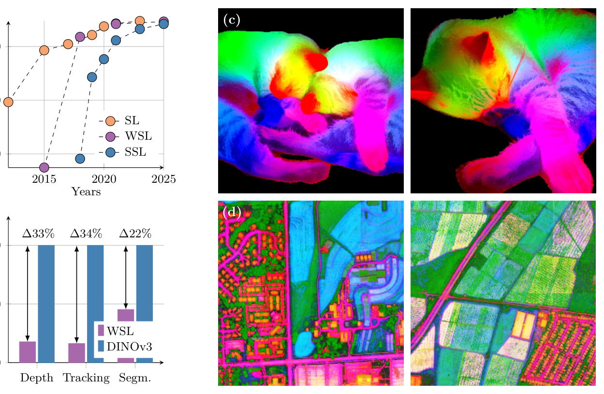

- **中文图注**：左上 (a) 是 2015–2025 年 ImageNet-1k 线性探针准确率的逐年攀升，三条路线分别是监督（SL，橙）、弱监督（WSL，紫）、自监督（SSL，蓝）；左下 (b) 是 DINOv3 相对最强 WSL 模型在 Depth（深度）、Tracking（跟踪）、Segm.（分割）三个稠密任务上的提升，图内标注为 **Δ33%/Δ34%/Δ22%**；右侧 (c)(d) 是同一套 DINOv3 特征在自然、医学与遥感等高分辨率图像上的稠密特征可视化。
- **看这张图要看出什么**：三件事——① **SSL 起步晚，但已追平近年 ImageNet 平台期**，而它独有的承诺是「高质量稠密特征」；② DINOv3 的增量不在整图分类，而在 (b) 那一排**稠密任务**（这正是本书反复强调的 dense 能力）；③ (c)(d) 说明同一套特征跨自然/医学/遥感域都能用。
- **裁切提示**：本图 **(a) 的纵轴刻度数字被左缘裁掉，(a)(b) 两个面板的标记「(a)」「(b)」也不可见**；右半边的 **(c)、(d) 面板标记则完整可读**（裁图目视核对）。**若要引用具体准确率数值，请以论文正文/表格为准，不要照这张图读数**（(b) 的 Δ33%/Δ34%/Δ22% 是图内印刷文字，可引用）。

## 1.5 什么场景该用它（也说什么场景别用）

**适合（官方模型卡直接列出的 Direct Use 场景）**：

- 图像分类：CLS token 上接 k-NN 或逻辑回归；CLS token + patch 均值再加一个线性层。
- 图像检索：用最近邻。
- 语义分割、深度估计：patch token 上接线性层即可。
- 目标检测、视频分割跟踪、视频分类（小 4 层 attentive probe）。
- 3D 关键点 / 几何与语义对应。
- **卫星/遥感**：官方另有整套在卫星数据（SAT-493M）上训练的模型。

**可能不适合**：

- **需要零样本图文检索/开放词表分类，且手里没有任何标注**：纯 DINOv3 主干不做这个（它没有文本塔）。要么用 CLIP/SigLIP 系列，要么用官方的 `dino.txt` 版本。
- **文字/OCR 密集场景**：DINOv3 明显弱于弱监督模型（论文 Tab.25）。
- **算力极度受限、只能跑几 MB 模型**：ViT-S（21M）是最小的 ViT，另有 ConvNeXt-Tiny（29M）等，但如果你要的是「超轻量」，可能需要蒸馏小模型或量化（第 2、8 章）。

**官方性能一句话预告**（全部为**冻结主干**下的结果；来源逐一标注）：

| 指标 | ViT-7B/16 | 对比 | 出处 |
|---|---|---|---|
| ADE20k 语义分割（线性探针） | **55.9 mIoU** | DINOv2-g/14 是 49.5 | 论文 **Tab.3**（正文亦在 §6.1.2 复述「55.9 mIoU」） |
| ImageNet-1k 线性探针（val） | **88.4** | DINOv2-g/14 是 87.3 | 论文 **Tab.7** |
| ObjectNet（OOD） | **79.0** | — | 论文 **Tab.7** |
| ImageNet-C（越低越好） | **19.6** | — | 论文 Tab.7 |
| 检索 Oxford-H / Paris-H / Met(GAP) / AmsterTime（mAP） | 60.7 / 87.1 / 55.4 / 56.5 | — | 论文 **Tab.9** |
| OOD 相对 DINOv2 的增益 | ImageNet-R **+10%**、-Sketch **+6%**、ObjectNet **+13%** | vs DINOv2 | 论文 **§6.2.1**（正文叙述，配 Tab.7） |

> **别引错表号**：论文 **Tab.16 是 `dino.txt`（文本对齐版 ViT-L）**与 CLIP/SigLIP 2/PE 的对比表（列 IN1k/A/R/Obj.），**和上面这些 ADE20k/ImageNet/OOD 数字无关**。上面三张表分别是 Tab.3（分割+深度）、Tab.7（ImageNet 与 OOD）、Tab.9（检索）。

**图 1-2：DINOv3 家族不是只跟 DINOv2 比，而是跟整个赛道比**（论文 Figure 2；图片路径 `sources/figs/fig2_p3.png`）

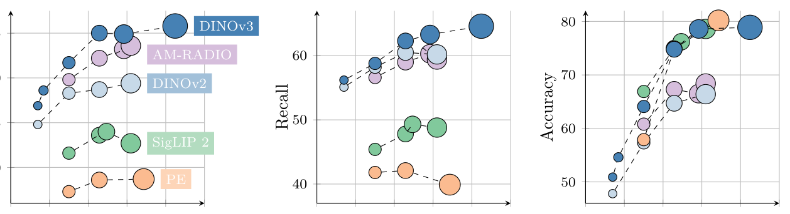

- **中文图注**：三张气泡散点图，把 DINOv3 家族与 DINOv2、SigLIP 2、PE、AM-RADIO 等多基准表现放在一起比较，**气泡越大代表模型越大**；后两图纵轴分别是 Recall 与 Accuracy。论文原文称 DINOv3 在稠密基准上显著领先，**连使用了掩码标注先验的 AM-RADIO 也被超过**（来源：`sources/figs/INDEX.md` Figure 2 图注 / 论文 Fig.2）。
- **看这张图要看出什么**：DINOv3（蓝）在**最左那张稠密基准图**上一路领先，且领先的是**同一家族的各个尺寸**——也就是说「小号的 DINOv3 也强」，这正是第 11.1 节选型表（ViT-S/B 就能用）的底气。
- **裁切提示**：**最左子图的纵轴标题与刻度被左缘裁掉**，图上也没有可读的基准名；**引用时不要凭图猜那是什么基准**（基准名与数值以论文正文/表格为准）。

## 本章小结

- DINOv3 = 一个**自监督、无标注**训练出来的**通用视觉特征提取器**，旗舰 7B 参数。
- 它输出 CLS token（整图）、patch token（每格）、register token（杂物间）。
- 它的**王牌是 dense 特征**：分割/深度/检测/跟踪，冻结主干就很强。
- 与 CLIP 的区别：**没有文本塔，不做零样本**（除非用 `dino.txt` 变体）；与 DINOv2 的区别：**RoPE + 更大 + Gram anchoring**。
- 官方**推荐冻结使用**，微调是最后手段。

---

# 第 2 章 准备工作

> **这一章解决什么**：把环境装好、把模型权重拿到手、搞清楚你的显卡够不够。
> **读完你会得到**：一个能跑通第 3 章的 Python 环境，以及一张「哪个模型吃多少显存」的对照表。

## 2.1 硬件与环境要求

**官方明确给出的要求**（来源：仓库 README「Installation」、`sources/repo/conda.yaml`、`sources/repo/MODEL_CARD.md`）：

| 项目 | 要求 |
|---|---|
| Python | **3.11**（`conda.yaml` 指定） |
| PyTorch（训练/评估代码） | **>= 2.7.1**；官方只保证在指定版本 + **Linux** 环境测试过 |
| PyTorch（仅加载模型） | README 原话：「**PyTorch is the only required dependency for loading the model**」 |
| 操作系统 | **官方只在 Linux 测过**：README「Installation」原文为「the code has only been tested with the specified versions and also **expects a Linux environment**」。资料集里**没有任何** Windows 相关说明（`sources/MANIFEST.md` 全文不含 Windows 字样），所以「Windows 是否可用」属于**官方资料未给出** |
| 模型卡记录的软件环境 | **PyTorch 2.7** |
| 训练脚本最低断言 | `assert torch.__version__ >= (2, 1)` |

> **注意**：如果你只是想「加载模型、提取特征」（不训练），一台装了 PyTorch 的普通机器就够了。
> 但要训练或做 FSDP 多卡，请上 Linux + CUDA。

## 2.2 安装步骤

### 第一步：拿到仓库代码

DINOv3 的官方仓库在 `github.com/facebookresearch/dinov3`。克隆到本地，得到目录（下文记作 `REPO_DIR`）：

```shell
git clone https://github.com/facebookresearch/dinov3.git
# 之后把这个绝对路径填到代码里的 REPO_DIR
# 例如 Linux: /home/you/dinov3    Windows: D:/code/dinov3
```

### 第二步：创建 conda 环境（README 推荐 micromamba）

仓库自带一份 `conda.yaml`（环境名 `dinov3`，Python 3.11），直接用它建环境：

```shell
micromamba env create -f conda.yaml
micromamba activate dinov3
```

`conda.yaml` 里列出的依赖（原文照录，来源 `sources/repo/conda.yaml`）：

```yaml
name: dinov3
channels:
  - defaults
  - conda-forge
dependencies:
  - python=3.11
  - omegaconf
  - pip
  - pip:
    - ftfy            # needed for dino.txt
    - iopath
    - omegaconf
    - pandas
    - regex           # needed for dino.txt
    - scikit-learn
    - scikit-learn-intelex
    - submitit
    - termcolor
    - torch
    - torchvision
    - torchmetrics
```

**这段在干什么**：建一个隔离环境，装好 PyTorch、torchvision，以及训练/评估要用的 `omegaconf`（读 YAML 配置）、`submitit`（SLURM 提交）、`scikit-learn`（k-NN/线性探针）、`ftfy` 和 `regex`（`dino.txt` 文本侧需要）。
**预期结果**：`micromamba activate dinov3` 后 `python -c "import torch; print(torch.__version__)"` 能打印出版本号（>= 2.7.1）。
**常见报错**：`micromamba: command not found` → 你没装 micromamba；可以用 `conda env create -f conda.yaml` 代替，或手动 `pip install` 上面 pip 段里的包。

### 第三步（可选但强烈建议）：装 CUDA 版 PyTorch

README 原文：「Installing PyTorch with CUDA support is **strongly recommended**」。如果你的 GPU 是 NVIDIA，按 [PyTorch 官方安装页](https://pytorch.org/get-started/locally/) 选对应 CUDA 版本重装 `torch`/`torchvision`。

### 第四步：验证

```shell
python -c "import torch; print('torch', torch.__version__, 'cuda', torch.cuda.is_available())"
```

**预期输出**：`torch 2.7.x cuda True`（如果你有可用的 NVIDIA GPU）。
**如果 `cuda False`**：模型仍能加载（在 CPU 上跑），只是会慢很多；见 2.5 节。

## 2.3 申请模型访问权限（**模型是 gated 的**）

> **这是新手最容易卡住的一步，请务必先做。**

DINOv3 的权重**不是公开随便下的**，需要申请：

**官方授权来源（`sources/dinov3_github_readme.md`「Pretrained models」）**：

1. **Meta 官方下载页**：`https://ai.meta.com/resources/models-and-libraries/dinov3-downloads/`
   提交申请、通过后，你会**收到一封邮件，里面是所有可用权重的完整 URL 列表**（既包括 backbone 主干，也包括各种 adapter / head）。
2. **HuggingFace 上的模型是 gated（门控）的**：需要先在模型页面点申请、等批准，才能 `from_pretrained`。官方在 HF 上的合集地址是：
   `https://huggingface.co/collections/facebook/dinov3-68924841bd6b561778e31009`

**拿到 URL 后有两种用**（README 原文）：

- 用 `wget` 把权重**下载到本地**，然后让 `torch.hub.load()` 的 `weights` / `backbone_weights` 参数指向这个本地文件；
- 或者**直接把 URL 传给 `torch.hub.load()`**，让它自己下载。

> ⚠️ **官方明确警告**：**下载权重请用 `wget`，不要用浏览器**（README 原话：`Please use wget instead of a web browser to download the weights.`）。

> ⚠️ 本文档所在的资料集里，`sources/hf_facebook_dinov3-*_config.json` 这些文件**是 401 错误页**（因为模型是 gated，抓取时没权限），**不是真正的配置**，不能引用。你在 HF 页面上正常申请通过后拿到的才是真配置。

**CHMv2（树冠高度）另走一个入口**：`https://ai.meta.com/resources/models-and-libraries/chmv2-downloads/`。

> **⚖️ 合规提醒（现在就记住，别等读完附录）**
> 你从下载页点「I Accept」的那一刻起，就已经接受了 **DINOv3 License**（来源：`sources/dinov3_license.txt`）。有两条**直接落在工程与发表上**，很多人都忽略：
> 1. **再分发必须标注**：如果你把 DINOv3（或其衍生作品）分发/上线给第三方，必须 **(A) 随附本协议副本**，并且 **(B) 在网站/UI/博客/关于页/产品文档上显著标注「Built with DINOv3」**（§1.b.i）。
> 2. **发表研究必须致谢**：如果你把基于 DINOv3 的研究结果投出去发表，**必须在文中致谢使用了 DINO Materials**（§1.b.ii）。
>
> 还有一条**影响能不能用**：不得用于 ITAR / 贸易管制禁止的用途（军事、核、间谍、枪械等），且须遵守出口管制（§1.b.iii–v）。完整条款见本文**附录**。

## 2.4 显存需求对照表

**先说实话**：官方资料里**没有**给出「每个模型需要多少 GB 显存」的官方数字（`sources/MANIFEST.md`、`MODEL_CARD.md`、论文都只给了参数量和 GFLOPs）。
所以下面这张表的**参数量与 GFLOPs 是官方数字**（来源：论文 Fig.16a），而**显存列是按 BF16 权重做的算术推算**，明确标注为【推算】，只代表「光把权重放进显存」的下限，**不含激活、不含注意力随分辨率的开销**。

| 模型 | 参数量（官方，Fig.16a） | GFLOPs@256（官方） | GFLOPs@512（官方） | 权重显存 BF16【推算】 | 权重显存 FP32【推算】 |
|---|---|---|---|---|---|
| ConvNeXt-Tiny | 29M | 5 | 20 | ≈0.06 GB | ≈0.12 GB |
| ConvNeXt-Small | 50M | 11 | 46 | ≈0.10 GB | ≈0.20 GB |
| ConvNeXt-Base | 89M | 20 | 81 | ≈0.18 GB | ≈0.36 GB |
| ConvNeXt-Large | 198M | 38 | 152 | ≈0.40 GB | ≈0.79 GB |
| ViT-S/16 | 21M | 12 | 63 | ≈0.04 GB | ≈0.08 GB |
| ViT-S+/16 | 29M | 16 | 79 | ≈0.06 GB | ≈0.12 GB |
| ViT-B/16 | 86M | 47 | 216 | ≈0.17 GB | ≈0.34 GB |
| ViT-L/16 | 300M | 163 | 721 | ≈0.60 GB | ≈1.20 GB |
| ViT-H+/16 | 840M | 450 | 1903 | ≈1.68 GB | ≈3.36 GB |
| **ViT-7B/16** | **6716M** | **3550** | **14515** | **≈13.4 GB** | **≈26.9 GB** |

> 推算方法：`参数量 × 每参数字节数`。BF16 每个参数 2 字节（6716e6 × 2 ≈ 13.4 GB），FP32 每个参数 4 字节（≈26.9 GB）。
> **这只是权重下限**。实际推理还要加上：中间激活（会随分辨率**平方级**增长——注意 ViT-7B 在 512 时的 GFLOPs 是 256 时的约 4 倍）、注意力矩阵、如果是训练还要加梯度与优化器状态。

**实用经验（非官方数字，仅作方向指引）**：

- ViT-S/S+/B 这类小模型，**单张 8–12 GB 消费卡**做推理和线性探针都非常舒服。
- ViT-L/H+ 推理在 **≥16 GB** 的卡上比较从容；训练线性头也够。
- **ViT-7B 的官方推荐做法**是：要么用 int4 量化（见下），要么多卡 FSDP。
- **训练从头预训练**（而不是只做下游）：官方用 **4 个 H100-80GB 节点（32 GPU）** 才能跑 ViT-L/ImageNet-1k 的快速设置，用 **32 节点（256 GPU）** 跑 ViT-7B。单卡做完整 SSL 训练不现实（见第 8 章）。

## 2.5 CPU / 低显存怎么办

**四个降级方案，按推荐顺序**：

1. **换小模型**。ViT-S/16 只有 21M 参数，CPU 上也能推理（慢，但能跑）。做下游任务优先选 ViT-B/L。
2. **用 int4 量化（HF 官方文档给出的示例，主要面向 7B）**：

```python
# pip install torchao
import torch
from torchao.quantization import Int4WeightOnlyConfig
from transformers import AutoImageProcessor, AutoModel, TorchAoConfig
from transformers.image_utils import load_image

url = "http://images.cocodataset.org/val2017/000000039769.jpg"
image = load_image(url)

processor = AutoImageProcessor.from_pretrained("facebook/dinov3-vitsplus-pretrain-lvd1689m")
quant_type = Int4WeightOnlyConfig(group_size=128)
quantization_config = TorchAoConfig(quant_type=quant_type)

model = AutoModel.from_pretrained(
    "facebook/dinov3-vit7b16-pretrain-lvd1689m",
    device_map="auto",
    quantization_config=quantization_config
)
inputs = processor(images=image, return_tensors="pt").to(model.device)
with torch.inference_mode():
    outputs = model(**inputs)
pooled_output = outputs.pooler_output
print("Pooled output shape:", pooled_output.shape)
```

   **这段在干什么**：用 `torchao` 把 7B 模型的**权重**量化到 int4（`group_size=128`），大幅降低显存占用；`device_map="auto"` 让 HF 自动把各层放到可用的设备上。
   **预期输出**：打印 `Pooled output shape: torch.Size([1, ...])`。
   **注意**：官方文档此处示例里写的是 `facebook/dinov3-vitsplus-pretrain-lvd1689m`（没有 `16`），而 README 清单里是 `dinov3-vits16plus-...`；以 HF 页面实际存在的 ID 为准（官方资料未给出统一说明）。

3. **`torch.autocast` 半精度推理**（官方深度/分割示例就是这么做的）：

```python
with torch.inference_mode():
    with torch.autocast('cuda', dtype=torch.bfloat16):
        out = model(x)
```

4. **只做「冻结特征 + 线性层」**，不训练主干。这是官方推荐用法，显存需求远低于微调。

> 想在 CPU 上跑：把 `.cuda()` / `device_map="auto"` 去掉，模型和输入都留在 CPU，用 `torch.inference_mode()` 即可。速度会慢，但小模型可用。

### 2.4.1 激活显存与 attention 开销：怎么估（官方未给 GB 数，这里给**方法**与**量级**）

上表只算了「权重」。真实推理/训练里，**激活（activations）常常才是大头**，而它**没有官方数字**。下面给一套**可自己动手算的公式**和几个**量级示例**——全部标注为【推算】，假设写在括号里。

**第一步：先算 token 数**（纯算术，第 4.3 节）：

```
N_tok = (H / patch_size) × (W / patch_size) + 1（CLS） + n_register（发布权重 4）
```

**第二步：按「每层两块开销」估**（以 bf16 每元素 2 字节计）：

| 开销 | 每层怎么算 | 直觉 |
|---|---|---|
| **token 激活** | `N_tok × C × 2 字节`（C = embed_dim） | 一个 block 输出/输入的张量 |
| **attention logits** | `heads × N_tok² × 2 字节` | 注意力矩阵，**随 N_tok 平方增长**，是最容易爆的一项 |
| （训练还要加）梯度与优化器状态 | 约 `参数量 × (2+4+4) 字节`（bf16 梯度 + fp32 动量两份） | AdamW 典型开销 |

**第三步：代入几个具体配置**（【推算】，假设：bf16、每层都保留中间激活、不含 FFN 内部膨胀——所以是**下限**）：

| 配置 | N_tok | 每层 token 激活 | 每层 attention | 全部层 token | 全部层 attention |
|---|---|---|---|---|---|
| ViT-B/16 @256（C=768, 12 heads, 12 层） | 261 | ≈0.40 MB | ≈1.6 MB | ≈4.8 MB | ≈20 MB |
| ViT-L/16 @512（C=1024, 16 heads, 24 层） | 1029 | ≈2.1 MB | ≈34 MB | ≈50 MB | ≈0.81 GB |
| **ViT-7B/16 @512**（C=4096, 32 heads, 40 层） | 1029 | ≈8.4 MB | **≈68 MB** | ≈0.34 GB | **≈2.7 GB** |
| ViT-7B/16 @1024 | 4101 | ≈34 MB | **≈1.08 GB** | ≈1.3 GB | **≈43 GB** |

**怎么读这张表**（三条结论，都很实用）：

1. **attention 是「平方项」，分辨率翻倍它就 ×4**。ViT-7B 从 512 到 1024，仅 attention 一项就从 ≈2.7 GB 涨到 ≈43 GB——这就是第 7.3 节说「GFLOPs 随分辨率平方增长」在**显存**上的体现。官方在计算量上的证据是：ViT-7B @256 = **3550** GFLOPs、@512 = **14515** GFLOPs（Fig.16a，约 4×）。
2. **开 activation checkpointing（第 8.4 节）能把这行表大幅压扁**：它只保留 block 边界，反向时重算——上表「全部层」那一列基本变成「每层 × 1～2」。官方配置里就有 `train.checkpointing: true`（选择性）与 `checkpointing_full: true`（全量）。
3. **推理时用 `torch.inference_mode()`**：不建计算图，梯度那一大块直接省掉（第 2.5 节的第 3、4 条）。

**第四步：给一个「够不够」的自检**：

```python
import torch
# 推理时：跑完一次前向，看峰值显存（GB）
peak = torch.cuda.max_memory_allocated() / 2**30
print(f"peak allocated = {peak:.2f} GB")
# 经验：把它和上表的「权重 + 该分辨率的 attention + token 激活」对一下，
# 差得离谱 → 多半是没套 inference_mode，或输入分辨率被某处悄悄放大了。
```

> **诚实边界**：上面所有 GB 数字都是**按公式推的【推算值】**，不是官方数字，也没有算进 FFN 中间层膨胀、CUDA 上下文、碎片、kernel workspace 等；官方资料**只给了参数量与 GFLOPs**。真正定卡容量时，**以你实测的 `max_memory_allocated` 为准**，本表只用来判断「量级」和「瓶颈在哪」。

## 本章小结

- 环境：**Python 3.11 + PyTorch >= 2.7.1 + Linux**；只加载模型的话「PyTorch 是唯一必需依赖」。
- 安装：`micromamba env create -f conda.yaml`。
- **权重是 gated**：去 `ai.meta.com/resources/models-and-libraries/dinov3-downloads/` 申请，邮件收 URL；HF 也是门控；**用 `wget` 下载**。
- 显存：官方**没给** GB 数字，只给了参数量/GFLOPs；BF16 权重下限的【推算】见上表；**激活与 attention 的估算公式与量级见 §2.4.1**。
- 低显存：换小模型 → int4 量化 → bf16 autocast → 只做冻结特征。
- **合规**：点「I Accept」即受 DINOv3 License 约束——**再分发要标注「Built with DINOv3」并附协议，发表研究要致谢**（§2.3、附录）。

---

# 第 3 章 第一个程序：10 分钟跑通

> **这一章解决什么**：给你一段**完整可运行**的代码，从加载模型到提取特征，逐行解释。
> **读完你会得到**：亲手跑出来的一个特征向量，以及知道每个数字形状是怎么来的。
>
> **两条腿走路**：本章的代码分两部分——
> - **§3.2–§3.6：用真权重**（需要 gated 授权，第 2.3 节）；
> - **§3.7：不用授权的最小可复现闭环**（`pretrained=False` 随机初始化，只要装了 PyTorch 就能跑，用来**验证环境、token 形状与整条流程**）。
>
> 所以即使授权还没批下来，你**今天就能把本章跑通一遍**。这也是对「本章所有示例都依赖 gated 权重与占位路径」这一质疑的直接回应。

## 3.1 官方推荐的加载方式

官方资料里有**两条**正路：

- **路线 A（仓库 + torch.hub）**：README 全程用的是
  `torch.hub.load(REPO_DIR, '<模型名>', source='local', weights=<权重路径或URL>)`。
  第一个参数给**本地克隆目录**，`source='local'` 表示不联网拉仓库。
- **路线 B（HuggingFace transformers）**：`AutoModel.from_pretrained('<HF 模型 ID>')`。

下面先讲路线 A（仓库原生），因为它和官方所有示例、所有下游 head 都是一套。

## 3.2 完整可运行代码（仓库路线）

> **前置条件（先看这里，别直接抄）**
> - 本段需要 **① 已克隆的仓库目录**（第 2.2 节）、**② 一份已授权的权重**（第 2.3 节）。
> - 下面代码里出现的大写占位符 **`REPO_DIR` / `CKPT` / `IMG_PATH`** 是**你必须在第 1 步填好的**。后文第 4–7 章的片段会**复用这三个变量**，请把它们留在同一个脚本/notebook 里，否则会 `NameError`。
> - **只要权重的授权还没批下来**，请直接跳到 **§3.7**，用随机初始化先把流程跑通。

```python
import torch
from PIL import Image
from torchvision.transforms import v2

# ============ 1. 填三个路径 ============
REPO_DIR = "<PATH/TO/A/LOCAL/DIRECTORY/WHERE/THE/DINOV3/REPO/WAS/CLONED>"
CKPT     = "<CHECKPOINT/URL/OR/PATH>"   # 你从邮件里拿到的权重 URL，或下载到本地的 .pth 路径
IMG_PATH = "your_image.jpg"             # 任意一张 RGB 图片

# ============ 2. 加载模型 ============
# 官方 README 写法：repo 目录 + 模型名 + source='local' + weights
model = torch.hub.load(REPO_DIR, "dinov3_vitb16", source="local", weights=CKPT)
model.eval()
device = "cuda" if torch.cuda.is_available() else "cpu"
model.to(device)

# ============ 3. 官方 transform（LVD-1689M 权重用 ImageNet 常量）============
def make_transform(resize_size: int = 256):
    to_tensor = v2.ToImage()
    resize = v2.Resize((resize_size, resize_size), antialias=True)
    to_float = v2.ToDtype(torch.float32, scale=True)
    normalize = v2.Normalize(
        mean=(0.485, 0.456, 0.406),
        std=(0.229, 0.224, 0.225),
    )
    return v2.Compose([to_tensor, resize, to_float, normalize])

transform = make_transform(256)

# ============ 4. 读图 + 预处理 ============
img = Image.open(IMG_PATH).convert("RGB")
x = transform(img)[None].to(device)     # [1, 3, 256, 256]
print("输入形状:", x.shape)

# ============ 5. 前向，取各种 token ============
with torch.inference_mode():
    out = model.forward_features(x)     # 返回一个 dict

print("dict 的键:", list(out.keys()))
print("CLS token   :", out["x_norm_clstoken"].shape)
print("register    :", out["x_storage_tokens"].shape)
print("patch tokens:", out["x_norm_patchtokens"].shape)
```

## 3.3 逐行解释

**第 2 步 加载模型**
- `torch.hub.load(REPO_DIR, "dinov3_vitb16", source="local", weights=CKPT)`：从本地仓库目录加载 ViT-B/16 主干，并把 `CKPT`（本地路径或 URL）里的权重灌进去。
- 官方对权重加载的说明（来源：`sources/repo/dinov3_hub_backbones.py`）：内部执行 `load_state_dict(state_dict, strict=True)`，**严格匹配**；`weights` 既可以是内置枚举（`Weights.LVD1689M`）、字符串路径，也可以是 URL。
- `model.eval()`：切到推理模式。**必做**——否则 dropout/BN 行为会不同。
- `model.to(device)`：放到 GPU/CPU。

**第 4 步 预处理**
- `v2.ToImage()` 把 PIL 图转成图像张量；`v2.Resize((256,256), antialias=True)` 缩放到 256×256；`v2.ToDtype(torch.float32, scale=True)` 转 float 并把像素压到 `[0,1]`；`v2.Normalize` 做标准化。
- `[None]` 是给张量加一个 batch 维：`[3,256,256]` → `[1,3,256,256]`。

**第 5 步 前向**
- `model.forward_features(x)` 返回一个 dict（源码：`DinoVisionTransformer.forward_features_list`）。
- `model(x)`（不调 `forward_features`）默认只返回 **CLS token 经 head 后的结果**（主干 head 是 `nn.Identity`，所以就是 CLS 本身），形状 `[B, embed_dim]`。想要全部 token 就用 `forward_features`。

## 3.4 预期输出形状（256×256 输入）

| 输出 | 形状 | 说明 |
|---|---|---|
| `x_norm_clstoken` | `[1, 768]` | 整图特征（ViT-B 的 embed_dim=768） |
| `x_storage_tokens` | `[1, 4, 768]` | 4 个 register token |
| `x_norm_patchtokens` | `[1, 256, 768]` | 256 = (256/16)×(256/16) = 16×16 个 patch |
| `x_prenorm` | `[1, 261, 768]` | final norm 之前的完整序列：1 + 4 + 256 = 261 |
| `masks` | `None` | 训练时 iBOT 掩码用，推理时为 None |

**形状怎么来的**（自己会算，比死记更好）：
- patch 数 = (图高 / patch_size) × (图宽 / patch_size) = (256/16) × (256/16) = 16 × 16 = 256。
- 序列长度 = 1（CLS） + 4（register） + patch 数 = 1 + 4 + 256 = **261**。
- 这些都是**纯算术**，换分辨率照算。

> **官方模型卡给的另一个经典数字**（方便你交叉验证）：**224×224 输入、patch size 16 → 1 + 4 + 196 = 201 tokens**（来源：`sources/repo/MODEL_CARD.md`）。
> ⚠️ HF 文档里的一段示例注释写的是 `[1, 1 + 4 + 256, 384]`，但那段示例里输入是 224×224、patch 16，按算术应该是 201。**以官方模型卡的 201 为准**，HF 注释里的 256 疑似沿用了 DINOv2（patch 14）的旧值。

## 3.5 HF 路线（替换第 2、5 步）

```python
import torch
from transformers import AutoImageProcessor, AutoModel
from transformers.image_utils import load_image

url = "http://images.cocodataset.org/val2017/000000039769.jpg"
image = load_image(url)

pretrained_model_name = "facebook/dinov3-convnext-tiny-pretrain-lvd1689m"
processor = AutoImageProcessor.from_pretrained(pretrained_model_name)
model = AutoModel.from_pretrained(pretrained_model_name, device_map="auto")

inputs = processor(images=image, return_tensors="pt").to(model.device)
with torch.inference_mode():
    outputs = model(**inputs)

pooled_output = outputs.pooler_output      # 即 CLS/Pooler 特征
print("Pooled output shape:", pooled_output.shape)
```

**这段在干什么**：用 HF 的 `AutoImageProcessor` 做预处理（默认 224×224、ImageNet 归一化）、`AutoModel` 加载主干；`outputs.pooler_output` 就是 CLS 特征。
**前提**：`transformers >= 4.56.0`（官方 2025-08-29 起正式支持）。
**预期输出**：打印一个 `torch.Size([1, C])` 的池化特征。

## 3.6 常见报错怎么处理

| 报错 / 现象 | 原因 | 解决 |
|---|---|---|
| `TypeError: ... got multiple values for keyword argument 'img_size'` | 你想用 `torch.hub.load(..., img_size=512)` 改分辨率。入口函数签名是 `dinov3_vitb16(*, pretrained, weights, check_hash, **kwargs)`，你传的 `img_size` 落进 `**kwargs`；而它内部又写死了 `_make_dinov3_vit(img_size=224, ...)`，于是同一个关键字被赋了两次（源码：`repo/dinov3_hub_backbones.py` 的 `_make_dinov3_vit(img_size=224, ...)` 与各公开入口的 `**kwargs`） | **不要传 `img_size`**；DINOv3 用 RoPE，直接喂大图即可（第 7 章）。注意：报的是「**重复赋值**」，不是「不认识这个参数」 |
| `RuntimeError: Error(s) in loading state_dict ... Missing key(s) / Unexpected key(s)` | 权重与模型名不匹配（比如把 SAT 权重给了 LVD 模型结构），或 `untie_global_and_local_cls_norm` 不一致 | 检查模型名 ↔ 权重是否对应；见第 10 章 FAQ 第 6 条 |
| `401 / 403` / 下载失败 | 权重是 gated，你还没拿到授权 URL，或用了浏览器下载 | 先去官方页申请；**用 `wget` 下载** |
| `ImportError: dinov3...` | 没把仓库放进模块搜索路径 | 训练/评估命令前加 `PYTHONPATH=.`（或 `${PWD}`） |
| 输出形状和本文不一样 | 你的图片被 resize 成了别的尺寸 | 打印 `x.shape` 确认 |

## 3.7 不依赖授权的最小可复现闭环（**不需要 gated 权重**）

上面所有示例都要「填 `CKPT`」和「填 `REPO_DIR`」两个占位路径，而 `CKPT` 必须先拿到授权。为了让教程**真的可以今天就验证**，这一节给一条**完全不需要任何授权、随机初始化**的路径：它只能验证「环境 + 代码 + token 形状」，**不能**验证精度（随机权重的特征没有语义）。

### 3.7.1 为什么要 `pretrained=False`

看源码你会发现：每个公开入口函数的第一个关键字参数是 `pretrained: bool = True`，而 `_make_dinov3_vit(...)` 的分支是这样的（`repo/dinov3_hub_backbones.py`）：

```python
if pretrained:
    ...url = _make_dinov3_vit_model_url(...)     # 拼下载 URL，走网络（需要授权）
    state_dict = _safe_load_state_dict_from_url(url, ...)
    model.load_state_dict(state_dict, strict=True)
else:
    model.init_weights()                          # ← 随机初始化，不联网、不需要授权
return model
```

**所以 `pretrained=False` 是官方代码里就有的、合法的「随机初始化」开关**，不是 hack。

### 3.7.2 可运行代码（仓库路线）

```python
import torch
from PIL import Image
from torchvision.transforms import v2        # 一定要这行；v2 是 torchvision 的 transforms API

REPO_DIR = "<你的 dinov3 仓库绝对路径>"

# 唯一改动：pretrained=False（不传 weights，也不联网）
model = torch.hub.load(REPO_DIR, "dinov3_vitb16", source="local", pretrained=False)
model.eval()                                  # 切推理模式
device = "cuda" if torch.cuda.is_available() else "cpu"
model.to(device)

transform = v2.Compose([
    v2.ToImage(),
    v2.Resize((256, 256), antialias=True),
    v2.ToDtype(torch.float32, scale=True),
    v2.Normalize(mean=(0.485, 0.456, 0.406), std=(0.229, 0.224, 0.225)),
])

img = Image.new("RGB", (300, 200), color=(128, 128, 128))   # 造一张假图，省去准备图片
x = transform(img)[None].to(device)                         # [1, 3, 256, 256]

with torch.inference_mode():
    out = model.forward_features(x)

print("keys         :", sorted(out.keys()))
print("CLS          :", out["x_norm_clstoken"].shape)        # [1, 768]
print("register     :", out["x_storage_tokens"].shape)       # [1, 4, 768]
print("patch tokens :", out["x_norm_patchtokens"].shape)     # [1, 256, 768]
print("full seq     :", out["x_prenorm"].shape)              # [1, 261, 768]

assert out["x_norm_clstoken"].shape     == (1, 768)
assert out["x_storage_tokens"].shape    == (1, 4, 768)
assert out["x_norm_patchtokens"].shape  == (1, 256, 768)
assert out["x_prenorm"].shape           == (1, 261, 768)
print("✅ 形状自检通过：环境与代码正确，只差真权重")
```

**预期输出**（ViT-B/16，256×256 输入）：

```
keys         : ['masks', 'x_norm_clstoken', 'x_norm_patchtokens', 'x_prenorm', 'x_storage_tokens']
CLS          : torch.Size([1, 768])
register     : torch.Size([1, 4, 768])
patch tokens : torch.Size([1, 256, 768])
full seq     : torch.Size([1, 261, 768])
✅ 形状自检通过：环境与代码正确，只差真权重
```

**这条路径能替你确认三件事**（都是新手最容易错的地方）：
1. 仓库、`torchvision`、`torch` 版本装对了；
2. `forward_features` 的**键名**和**形状**（第 4 章）确实如教程所述；
3. 你的 transform / 分辨率算法（第 5 章）算出来的 patch 数与实际一致。

### 3.7.3 HF 路线的等价写法（也不需要授权）

```python
import torch
from transformers import DINOv3ViTConfig, DINOv3ViTModel   # transformers >= 4.56.0

# 用 config 直接构造一个随机初始化的 ViT（默认就是个 ViT-S 规格的小模型）
config = DINOv3ViTConfig(image_size=256, patch_size=16)
config.num_register_tokens = 4            # HuggingFace config 默认是 0；这里显式设成 4 对齐发布权重
model = DINOv3ViTModel(config).eval()

x = torch.randn(1, 3, 256, 256)           # 随机输入，形状与训练一致即可
with torch.inference_mode():
    out = model(pixel_values=x)

print("last_hidden_state :", out.last_hidden_state.shape)   # [1, 1+4+256, 384]
print("pooler_output     :", out.pooler_output.shape)       # [1, 384]
```

**预期输出**：`last_hidden_state : torch.Size([1, 261, 384])`、`pooler_output : torch.Size([1, 384])`（384 是 ViT-S 规格的默认 `hidden_size`）。
**说明**：HF 的 `DINOv3ViTConfig` 默认 `num_register_tokens=0`、`hidden_size=384`、`num_hidden_layers=12`（文档）；这里显式把 register 设成 4，是为了让形状和发布权重的行为一致（第 11.4 节的「默认值 vs 权重实际值」警示）。

## 本章小结

- 官方加载方式：`torch.hub.load(REPO_DIR, '<模型名>', source='local', weights=<权重>)`，或 HF `AutoModel.from_pretrained(...)`。
- 完整流程 = **加载模型 → 官方 transform → 加 batch 维 → `forward_features`**。
- `forward_features` 返回 dict：`x_norm_clstoken` / `x_storage_tokens` / `x_norm_patchtokens` / `x_prenorm` / `masks`。
- 形状自己会算：patch 数 = (H/patch)×(W/patch)；序列长 = 1 + 4 + patch 数。
- 别试图用 `img_size=` 改分辨率。
- **没授权也能跑**：`pretrained=False` / `DINOv3ViTConfig` 随机初始化就能验证环境与形状（§3.7）。

---

# 第 4 章 理解输出：CLS / patch / register 到底是什么

> **这一章解决什么**：为什么模型要吐三种 token？它们各有什么用？怎么把 patch token 拼回一张「特征图」？
> **读完你会得到**：能把「一串向量」变成「一张 H×W×C 的特征热力图」，这是做分割/深度的前提。

**本章术语小抄**（只出现这几个，先认识名字）：

| 词 | 一句话解释 |
|---|---|
| token | 「一个向量」。模型把图变成**一串** token，而不是一个数 |
| CLS token | 代表**整张图**的那个 token（classification 的缩写） |
| patch token | 代表**一个 16×16 小格**的 token，一张图有一大堆 |
| register token | 4 个「杂物间」token，吸收干扰，**你不用但必须跳过** |
| embed_dim / C | 每个 token 的**向量长度**（ViT-B 是 768） |
| `x_prenorm` | final norm **之前**的完整序列（含 CLS+register+patch） |
| row-major（行优先） | 一维序列展开成二维网格时的「先横后纵」顺序 |

## 4.1 三种 token 的一次性类比

> 把图片想成一栋楼：
> - **CLS token** = 这栋楼的**总体评价**（一句话概括整张图）→ 做分类、检索。
> - **patch token** = 每个房间的**单独评价**（16×16 像素一格）→ 做分割、深度、检测、匹配。
> - **register token** = 4 个**杂物间**。模型在处理时会产生一些「没处放的中间信息」，寄存器 token 就是给它们一个去处，**避免这些杂讯污染 patch token**。它们对你没用，**但你必须知道要跳过它们**。

**结构示意（文字版，一眼看懂三种 token 在序列里的位置和去处）**——这张图把 §4.2 的逐个解释、§4.3 的拼接顺序、§4.4 的特征图转换合成一张：

```
 输入图片 [3, H, W]
        │  切成 16×16 的小格（共 H/16 × W/16 个 patch）
        ▼
 ┌────────────────────────────────────────────────────────────────────┐
 │  token 序列（长度 = 1 + 4 + N_patch）                                │
 │  ┌──────┬───────────────────┬───────────────────────────────────┐   │
 │  │ CLS  │ register × 4       │ patch × N_patch                   │   │
 │  │ 索引0 │ 索引 1 ~ 4         │ 索引 5 ~ 5+N_patch-1              │   │
 │  └──┬───┴─────────┬─────────┴─────────────────┬─────────────────┘   │
 └─────┼─────────────┼───────────────────────────┼─────────────────────┘
       │             │                           │
       ▼             ▼                           ▼
 整图特征向量    丢弃（杂物间，         每格特征向量
 分类 / 检索     但**占用序列位置**，   分割 / 深度 / 检测 / 匹配
 [B, C]          切 patch 时别忘跳过）   [B, N_patch, C]
                                         └─ reshape+permute ──▶ [B, C, H/16, W/16]
```

> **怎么读这张图**：**中间那 4 个 register 是你唯一要「主动跳过」的东西**——它既不是你要的整图向量，也不是每格向量，但它在序列里占了 1~4 号位。§4.4 的两种写法（`get_intermediate_layers` 或 `x_norm_patchtokens`）都已经替你切好了；只有当你直接用 `x_prenorm`（完整序列）时才必须自己从索引 5 开始切。

## 4.2 逐个说清楚

### CLS token（`x_norm_clstoken`）

- 形状：`[B, embed_dim]`（批次 × 特征维度）。
- 用途：**整图级任务**——图像分类、图像检索、相似度比较。
- 怎么用：直接当「这张图的向量」；比较两张图就比它俩的余弦相似度。
- 官方发布的 ImageNet 分类头就是这么用的（还会拼上 patch 均值，见第 6.1 节）。

### patch token（`x_norm_patchtokens`）

- 形状：`[B, N_patch, embed_dim]`，其中 `N_patch = (H/patch_size) × (W/patch_size)`。
- 用途：**位置级任务**——语义分割、深度估计、目标检测、关键点匹配、视频跟踪。
- 关键点：**它是按行优先（row-major）排列的一维序列**，要自己 reshape 成二维特征图。

### register token（`x_storage_tokens`）

- 形状：`[B, 4, embed_dim]`。官方所有 ViT backbone 都是 **4 个**（源码 `n_storage_tokens=4`；HF 里 `config.num_register_tokens == 4`）。
- 来源：论文沿用了 Darcet et al. (2024) 的 register 思路，用来吸收「高范数 patch 离群点」（high-norm patch outliers）。
- **对你的意义**：
  1. 它们**不是给你用的**，做下游任务时**直接丢掉**。
  2. 但它们**占了序列里的位置**——这是最常见的 bug 来源：切 patch token 时忘了跳过 register。

## 4.3 序列的拼接顺序（必须记牢）

源码 `prepare_tokens_with_masks` 里，序列是这么拼的：

```
[ CLS ] ++ [ register_0, register_1, register_2, register_3 ] ++ [ patch_0, patch_1, ..., patch_N-1 ]
   索引 0                索引 1 ~ 4                                    索引 5 ~ 5+N-1
```

所以：

- `x_norm_clstoken` 就是序列的第 0 个位置。
- register = 序列的第 `1 ~ 1+4` 个位置。
- **patch token 从索引 `1 + n_storage_tokens = 5` 开始。**

## 4.4 把 patch token 变成 H×W 特征图

这是做 dense 任务的第一步。有**两种写法**，都用官方的 `get_intermediate_layers` 或 `forward_features`。

### 写法 A：官方的 `get_intermediate_layers(..., reshape=True)`（推荐）

```python
import torch
from PIL import Image
from torchvision.transforms import v2

model = torch.hub.load(REPO_DIR, "dinov3_vitb16", source="local", weights=CKPT)
model.eval().cuda()

transform = v2.Compose([
    v2.ToImage(),
    v2.Resize((512, 512), antialias=True),
    v2.ToDtype(torch.float32, scale=True),
    v2.Normalize(mean=(0.485, 0.456, 0.406), std=(0.229, 0.224, 0.225)),
])

img = Image.open("your_image.jpg").convert("RGB")
x = transform(img)[None].cuda()                 # [1, 3, 512, 512]

with torch.inference_mode():
    # n=1 取最后一层；reshape=True 直接给特征图 [B, C, H/p, W/p]
    fmap = model.get_intermediate_layers(x, n=1, reshape=True)[0]
print(fmap.shape)   # 512/16 = 32 -> torch.Size([1, 768, 32, 32])
```

**这段在干什么**：`get_intermediate_layers` 是官方接口，`reshape=True` 会把 patch token 自动 reshape 成 `[B, C, H/patch, W/patch]`，并用 `permute` 排成「通道在前」的卷积习惯格式。
**预期输出**：`torch.Size([1, 768, 32, 32])`（512/16=32）。
**说明**：`get_intermediate_layers` 默认 `norm=True`，会对输出做 LayerNorm。

### 写法 B：从 `forward_features` 手动 reshape

```python
with torch.inference_mode():
    out = model.forward_features(x)              # dict
patch = out["x_norm_patchtokens"]                # [B, N, C]
B, N, C = patch.shape
H, W = x.shape[-2], x.shape[-1]
p = model.patch_size                             # 16
fmap = patch.reshape(B, H // p, W // p, C).permute(0, 3, 1, 2).contiguous()
print(fmap.shape)                                # [1, 768, 32, 32]
```

**这段在干什么**：手动做和写法 A 一样的事——把 `[B, N, C]` 拆成 `[B, H/p, W/p, C]`，再 `permute` 成 `[B, C, H/p, W/p]`。
**注意**：这里 `patch` 已经是从 dict 里取出的 `x_norm_patchtokens`，**不含 CLS 和 register**，所以不用再手动跳过；如果你用的是 `x_prenorm`（完整序列），就**必须**从索引 5 开始切。

### HF 路线的写法（官方文档示例）

```python
cls_token = last_hidden_states[:, 0, :]
patch_features_flat = last_hidden_states[:, 1 + model.config.num_register_tokens:, :]
patch_features = patch_features_flat.unflatten(1, (num_patches_height, num_patches_width))
```

**这段在干什么**：HF 的 `last_hidden_state` 是完整序列，所以要自己切：第 0 位是 CLS，第 `1 ~ 1+4` 位是 register（这里用 `1 + model.config.num_register_tokens` 表达），之后才是 patch。

### 形状变化速查（以 512×512、patch 16、ViT-B 为例）

| 步骤 | 形状 |
|---|---|
| 输入图 | `[1, 3, 512, 512]` |
| patch token（一维序列） | `[1, 1024, 768]`（32×32=1024） |
| reshape | `[1, 32, 32, 768]` |
| permute 后（特征图） | `[1, 768, 32, 32]` |

## 4.5 怎么取「中间层」特征

在很多密集任务里，最后一层不一定最好，**中间层往往更锐利**。官方接口 `get_intermediate_layers` 支持两种取法：

- **`n=1`**（int）：取**最后 1 层**。
- **`n=4`**（int）：取**最后 4 层**，返回 4 个张量的元组。
- **`n=[5, 11, 17, 23]`**（list）：取**指定下标的层**（0-based），返回对应数量的张量。

```python
with torch.inference_mode():
    # 取最后 4 层
    feats = model.get_intermediate_layers(x, n=4, reshape=True)
    print(len(feats), feats[0].shape)     # 4, torch.Size([1, 768, 32, 32])
```

**官方下游 head 的层选择（可直接抄，来源：`sources/repo/dinov3_hub_depthers.py`、`dinov3_hub_detectors.py`）**：

| 主干 | 取哪几层（0-based） | 论文写作（1-based） |
|---|---|---|
| ViT-L | `[4, 11, 17, 23]`（深度head）/ `[5, 11, 17, 23]`（CHMv2） | — |
| ViT-7B | `[9, 19, 29, 39]` | `[10, 20, 30, 40]` |

> 论文正文/附录统一写 1-based 的 `[10, 20, 30, 40]`（检测、分割、深度三处都这么写），对应仓库 0-based 的 `[9,19,29,39]`。**两者是同一组层，只是数的起点不同。**

**官方论文对「取哪层」的经验**（来源：论文附录 B.2 / Fig.21）：

- 分类、分割、深度这些任务，性能**随层数平滑上升**。
- **深度估计、跟踪、3D 对应在约第 32 层达到峰值**。
- 中间层性能只比最后一层**略低**，所以「**最后一层是稳妥的默认选择**」。

**图 4-1：到底该取哪一层——DINOv3 7B 各中间层在五个基准上的表现**（论文 Figure 21；图片路径 `sources/figs/fig21_p56.png`）

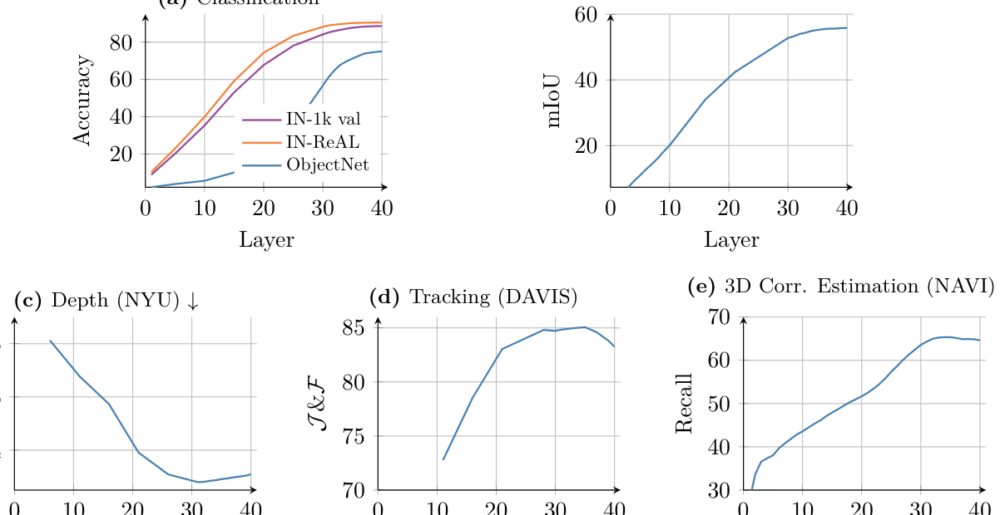

- **中文图注**：五个子图分别按层号（横轴 Layer，0–40）画出 DINOv3 7B 各中间层特征在：(a) 分类（IN-1k val / IN-Real / ObjectNet）、(b) 语义分割（纵轴 mIoU）、(c) 深度估计 NYU（纵轴越低越好）、(d) DAVIS 跟踪（纵轴 J&F）、(e) NAVI 3D 对应估计（纵轴 Recall）上的成绩。论文说明 (a)-(c) 用**线性层**评测，(d)(e) 用**非参数方法**（来源：`sources/figs/INDEX.md` Figure 21 图注 / 论文 Fig.21）。
- **看这张图要看出什么**：**分类、分割、深度这类任务的曲线是「越靠后越高、快到顶部才走平」**，所以「取最后一层」不会错太多；而 **深度、跟踪、3D 对应的峰值出现在中后段（约第 32 层）**——这解释了 §4.5 表格里官方深度/检测 head 为什么要取 `[9,19,29,39]` 这种**中间层组合**而不是单取最后一层。
- **裁切提示**：本图 (a) 的标题「Classification」被上缘裁掉、(c) 的纵轴标题被左缘裁掉、(b) 子图无可见标题；**引用时请按本图注补出各子图含义**，不要照残缺图猜。

## 4.6 附加：输出的原始 dict 里还有什么

`forward_features` 返回的字典（源码 `forward_features_list`）：

| 键 | 含义 | 形状 |
|---|---|---|
| `x_norm_clstoken` | 归一化后的 CLS | `[B, C]` |
| `x_storage_tokens` | 归一化后的 register | `[B, 4, C]` |
| `x_norm_patchtokens` | 归一化后的 patch | `[B, N, C]` |
| `x_prenorm` | final norm **之前**的完整序列 | `[B, 1+4+N, C]` |
| `masks` | iBOT 掩码（推理为 None） | — |

**「norm 之前的特征」**：官方在附录 A.2 提到，7B 模型在**通道维**上存在离群（少数特征维幅度异常大、随深度增大、输出层最大），并建议下游**对最后一层做归一化（如 batch norm）**。所以脚本里如果想要「原始」特征，可以用 `x_prenorm`，但要自己处理归一化。

## 本章小结

- **CLS** = 整图向量（分类/检索）；**patch** = 每格向量（分割/深度/检测）；**register** = 4 个杂物间，**丢掉**但**占位置**。
- 序列顺序：`[CLS] [reg×4] [patch×N]`；**patch 从索引 5 开始**。
- patch → 特征图：用 `get_intermediate_layers(..., reshape=True)`，或手动 `reshape + permute` 成 `[B, C, H/p, W/p]`。
- 取中间层：`n=4` 取最后 4 层，`n=[5,11,17,23]` 取指定层；**最后一层是稳妥默认**。
- 别忘了 `x_prenorm` 是含 CLS+register 的完整序列。

---

# 第 5 章 输入预处理

> **这一章解决什么**：让输入图片「长得正好是模型想要的」，否则精度会莫名下降甚至报错。
> **读完你会得到**：一份官方 transform 模板、两套归一化常量、尺寸规则，以及常见错误的修复方法。

## 5.1 官方 transform（完整代码 + 常量）

DINOv3 有**两套**归一化，分别对应两个训练数据集。**这是本家族最容易出错的地方，两套绝不能混用。**

### LVD-1689M（网页图像权重）——标准 ImageNet 归一化

```python
import torchvision
from torchvision.transforms import v2

def make_transform(resize_size: int = 256):
    to_tensor = v2.ToImage()
    resize = v2.Resize((resize_size, resize_size), antialias=True)
    to_float = v2.ToDtype(torch.float32, scale=True)
    normalize = v2.Normalize(
        mean=(0.485, 0.456, 0.406),
        std=(0.229, 0.224, 0.225),
    )
    return v2.Compose([to_tensor, resize, to_float, normalize])
```

**mean = (0.485, 0.456, 0.406)，std = (0.229, 0.224, 0.225)**，默认 `resize_size=256`。
（来源：仓库 README「Image transforms」）

### SAT-493M（卫星图像权重）——**必须换一套常量**

```python
import torchvision
from torchvision.transforms import v2

def make_transform(resize_size: int = 256):
    to_tensor = v2.ToImage()
    resize = v2.Resize((resize_size, resize_size), antialias=True)
    to_float = v2.ToDtype(torch.float32, scale=True)
    normalize = v2.Normalize(
        mean=(0.430, 0.411, 0.296),
        std=(0.213, 0.156, 0.143),
    )
    return v2.Compose([to_tensor, resize, to_float, normalize])
```

**mean = (0.430, 0.411, 0.296)，std = (0.213, 0.156, 0.143)**。
（来源：仓库 README「Image transforms」）

## 5.2 两套归一化的区别：一句话 + 一张表

**一句话**：模型在训练时「见过的颜色分布」是固定的。**用错归一化，等于让模型看到一种它从没见过的颜色分布，特征质量会掉。**

| 用途 | mean | std | 用在哪 |
|---|---|---|---|
| **LVD-1689M** 权重（网页图，`...-lvd1689m`） | (0.485, 0.456, 0.406) | (0.229, 0.224, 0.225) | 除卫星外的全部模型 |
| **SAT-493M** 权重（卫星图，`...-sat493m`） | (0.430, 0.411, 0.296) | (0.213, 0.156, 0.143) | `...-vitl16-pretrain-sat493m`、`...-vit7b16-pretrain-sat493m`、CHMv2 |

论文侧的说法（§8.1）：卫星模型「使用与网页 7B **完全相同的一套超参，除了按卫星图像调整的 RGB mean/std 归一化**」。

**怎么判断该用哪套**：看你加载的权重名。
- 名字里有 `sat493m`、或来自 CHMv2 → 用 SAT 常量。
- 名字里有 `lvd1689m`、或没特别标注（如官方深度 head、分类 head）→ 用 ImageNet 常量。

## 5.3 transform 三步在干什么

官方 transform 是 `ToImage → Resize → ToDtype(scale) → Normalize`：

| 步骤 | 作用 |
|---|---|
| `v2.ToImage()` | PIL 图 → 图像张量 |
| `v2.Resize((s,s), antialias=True)` | 缩放到 s×s；`antialias=True` 是抗锯齿，官方固定这么写 |
| `v2.ToDtype(torch.float32, scale=True)` | 转 float32，并**把像素值从 [0,255] 压到 [0,1]**（`scale=True` 会除以 255） |
| `v2.Normalize(mean, std)` | 每个通道 `(x - mean) / std` |

> 注意：`Resize((s,s))` 是**强制正方形**，会改变长宽比。官方各示例就是这么用的（backbone 256、深度 1024、分割 896）。

## 5.4 输入尺寸约束（patch size 整除）

**官方原文（`sources/repo/MODEL_CARD.md`）**：

> The models can accept larger images provided the image shapes are multiples of the patch size (16). **If this condition is not verified, the model will crop to the closest smaller multiple of the patch size.**

翻译：**输入边长必须是 patch size（16）的整数倍。如果不然，模型会裁剪到「最近的、更小的」16 的倍数。**

要点：

- **不整除不会报错**，但会偷偷裁掉边缘，并且你算 patch 数时会和实际不符。
- 训练代码里用整数除法算 token 数：`n_tokens = (img_size // patch_size) ** 2`（源码 `dinov3_train_train.py`）。
- `PatchEmbed.forward` 里其实有一段「是否整除」的 assert，但**已经被注释掉了**，实际靠推理/数据管线保证整除。

**自检小函数**：

```python
def assert_multiple_of_patch(w, h, patch_size=16):
    assert w % patch_size == 0 and h % patch_size == 0, \
        f"图像 {w}x{h} 不是 {patch_size} 的整数倍，会被裁剪！"
    return w // patch_size, h // patch_size   # 得到 patch 网格大小
```

## 5.5 官方各示例用的尺寸（参考）

| 场景 | 分辨率 | 来源 |
|---|---|---|
| backbone transform 默认 | **256** | README「Image transforms」 |
| 深度示例 | **1024** | README depther 示例（`img_size = 1024`） |
| 分割示例 | **896** | README segmentor 示例 |
| 评估协议（patch 16 模型） | **512×512**（对齐到 1024 patch tokens） | 论文 Tab.3 / Tab.7 caption |
| 训练主分辨率（ViT-7B 预训练） | **256**（global）、112（local） | 论文 §3.2 |

## 5.6 常见错误与修复

| 症状 | 原因 | 修复 |
|---|---|---|
| 精度明显低于论文/预期 | **用错归一化**（卫星权重套了 ImageNet 常量，或反过来） | 按 5.2 节换常量 |
| patch 数和你算的不一样 | 输入边长不是 16 的倍数，被模型裁掉了 | 预处理时先 pad/resize 到 16 的倍数 |
| 特征图尺寸和预期差一点 | 同上 | 用 `assert_multiple_of_patch` 自检 |
| 颜色/亮度特征怪异 | 忘了 `ToDtype(scale=True)`（像素还在 [0,255]）或忘了 Normalize | 用官方 transform，别自己拼 |
| 长宽比被破坏导致检测框错位 | `Resize((s,s))` 强制正方形 | 检测/密集任务可考虑 pad 到正方形后再 resize；官方示例用的是强制正方形。**完整可运行写法见 §5.7** |

## 5.7 非正方形 / 长宽比敏感任务的实操写法（官方资料未给出，这里给可运行方案）

前面所有 transform 都用 `Resize((s, s))`——它把图**压成正方形**，会改变长宽比。对分类/检索无所谓，但对**检测、分割、匹配、坐标回映**会直接导致框和点错位。

> **诚实标注**：**官方示例与配置统一用「强制正方形 resize」**（backbone 256、深度 1024、分割 896、检索 224 中心裁剪），**官方资料里没有给出保持长宽比的推荐写法**。下面这套是**工程上的标准做法（非官方）**，经过与官方 transform 相同的算子拼装，可直接运行。

### 5.7.1 目标：pad 到 16 的倍数，且不改变长宽比

核心思路只有一句：**不缩放、只补边**——把图像的右/下补到 patch size（16）的整数倍，从而既不破坏长宽比，又满足 §5.4 的「边长须是 16 的倍数」。

```python
import torch
import torch.nn.functional as F
from PIL import Image
from torchvision.transforms import v2

PATCH = 16

def pad_to_multiple(img: Image.Image, patch: int = PATCH, fill: int = 0):
    """不缩放，只把图像补到 patch 的整数倍（右下补，左上也对称补，尽量居中）。"""
    w, h = img.size
    W = (w + patch - 1) // patch * patch      # 向上取整到 patch 的倍数
    H = (h + patch - 1) // patch * patch
    dw, dh = W - w, H - h
    left, top = dw // 2, dh // 2              # 居中补边
    padded = v2.functional.pad(img, [left, top, dw - left, dh - top], fill=fill)
    meta = {"left": left, "top": top, "padded_wh": (W, H), "orig_wh": (w, h)}
    return padded, meta

# 归一化常量照第 5.1 节的官方值；注意：这里【不 Resize】
to_tensor   = v2.ToImage()
to_float    = v2.ToDtype(torch.float32, scale=True)
normalize   = v2.Normalize(mean=(0.485, 0.456, 0.406), std=(0.229, 0.224, 0.225))

img = Image.open("your_image.jpg").convert("RGB")
padded, meta = pad_to_multiple(img)
x = normalize(to_float(to_tensor(padded)))[None].cuda()     # [1, 3, H, W]，H、W 都是 16 的倍数
print("输入:", x.shape)

with torch.inference_mode():
    fmap = model.get_intermediate_layers(x, n=1, reshape=True)[0]   # [1, C, H/16, W/16]
print("特征图:", fmap.shape)
left, top = meta["left"], meta["top"]
h, w = meta["orig_wh"]
# 只取「原图内容」对应的特征网格（丢掉补边产生的格子）：
row0, col0 = top // PATCH, left // PATCH
h_cells = (h + PATCH - 1) // PATCH
w_cells = (w + PATCH - 1) // PATCH
fmap_content = fmap[:, :, row0:row0 + h_cells, col0:col0 + w_cells]   # 与「原始比例」一致
print("内容区:", fmap_content.shape)
```

**预期输出示例**（原图 300×200 → 补到 304×208 → H/16=13、W/16=19；内容区 13×19 格）：

```
输入: torch.Size([1, 3, 208, 304])
特征图: torch.Size([1, 768, 13, 19])
内容区: torch.Size([1, 768, 13, 19])
```

### 5.7.2 坐标回映：把「patch 格子」换算回「原图像素」

做检测/关键点时，你在特征网格上拿到的坐标必须换算回原图，否则框会偏。换算公式（`p = PATCH`，`left/top` 是补边量）：

```
格子 (col, row) 的中心像素坐标：
    x = col * p - left + p / 2      # 列 → 原图 x
    y = row * p - top  + p / 2      # 行 → 原图 y
反方向（原图坐标 → 格子索引）：
    col = (x + left) // p
    row = (y + top)  // p
```

```python
def cell_to_pixel(col, row, meta, patch=PATCH):
    left, top = meta["left"], meta["top"]
    return col * patch - left + patch / 2, row * patch - top + patch / 2

def pixel_to_cell(x, y, meta, patch=PATCH):
    left, top = meta["left"], meta["top"]
    return int((x + left) // patch), int((y + top) // patch)

# 例：第 5 列、第 3 行的格子，中心在原图上的像素位置
cx, cy = cell_to_pixel(5, 3, meta)
print("原图像素中心:", cx, cy)
```

**两个容易踩的点**：① **补边量是 8 的倍数不一定够**——patch 是 16，所以 `left`/`top`/`W`/`H` 都按 16 处理，别用 8；② 若目标检测的框来自非官方代码，**务必和 §6.4.1 的分辨率协议对齐**（COCO 头用 2048，不是 800）。

### 5.7.3 另一条更省事的路线：HF processor 的 `do_pad`

HF 的 `Dinov3ViTImageProcessor` **原生支持 pad**（官方文档参数：`do_pad`、`pad_size`，且明确写着「Padding is done either to the largest size in the batch or to a fixed square size per image」）。所以 HF 路线可以这样用：

```python
from transformers import AutoImageProcessor
from transformers.image_utils import load_image

processor = AutoImageProcessor.from_pretrained("facebook/dinov3-vitb16-pretrain-lvd1689m")
image = load_image("your_image.jpg")

# 让 processor 自己补齐（pad_size 必须 >= 任意一张图的尺寸）
inputs = processor(images=image, return_tensors="pt",
                   do_pad=True, pad_size={"height": 1024, "width": 1024})
print(inputs.pixel_values.shape)      # [1, 3, 1024, 1024]
```

> 注意 HF 的 `do_pad` 是**补到指定尺寸**（不缩放、不改长宽比），语义和 5.7.1 的手写版一致；两者的区别只是「谁来补」。

## 本章小结

- 官方 transform：`ToImage → Resize((s,s), antialias=True) → ToDtype(float32, scale=True) → Normalize`。
- **两套归一化**：LVD = ImageNet 常量；SAT = `mean(0.430,0.411,0.296)/std(0.213,0.156,0.143)`。**别混**。
- 输入边长**必须是 16 的倍数**，否则模型会裁到最近的较小倍数（官方模型卡原文）。
- 官方示例分辨率：backbone 256、深度 1024、分割 896；评估协议 patch16 用 512。
- 判断用哪套常量 → 看权重名里有没有 `sat493m` / `lvd1689m`。
- **长宽比敏感的任务**（检测/分割/匹配）：官方统一用强制正方形 resize；如需保比例，用 §5.7 的「pad 到 16 的倍数 + 坐标回映」写法。

---

# 第 6 章 下游任务实战

> **这一章解决什么**：给你一整套**可复制粘贴**的下游任务代码，每个都告诉你「在干什么、预期效果、坑在哪」。
> **读完你会得到**：k-NN/线性分类、线性分割、Mask2Former、深度、检测、检索、匹配、可视化、ConvNeXt、dino.txt 的可用脚本，以及评估复现命令。

**贯穿全章的一条纪律**：**主干冻结（frozen）**。
官方所有评测都是这样做的——「所有评测里 backbone 保持冻结，只训练轻量 adapter/探针」（论文 §6.1、§6.3），模型卡也推荐冻结优先。所以下面的代码里，**主干都在 `model.eval()` + `torch.inference_mode()` 下跑，只有那个小 head 有梯度**。

> **⚖️ 合规**：把 DINOv3 用进产品并对外分发，要**标注「Built with DINOv3」并随附协议**；把结果拿去发表要**致谢**（§2.3、附录）。别等读完附录才想起。

### 6.0 读这一章前：术语小抄与「公共前提」

**术语小抄**（后面会反复出现，先混个脸熟）：

| 词 | 一句话解释 |
|---|---|
| **k-NN** | 不训练，直接拿最近邻投票分类，用来快速判断「特征好不好用」 |
| **linear probe（线性探针）** | 在冻结特征上只训一层线性层，最强最通用的基线 |
| **attentive probe** | 比线性探针多几层注意力的探针，官方用于视频分类等 |
| **dense 任务** | 需要**逐位置**输出的任务：分割、深度、检测（相对的是「整图一个向量」的 global 任务） |
| **mIoU** | 分割指标，交并比的平均，越大越好 |
| **ARel / δ1** | 深度指标：ARel 是相对误差（越小越好），δ1 是「预测在真值 1.25 倍内」的比例（越大越好） |
| **RMSE** | 深度误差，越小越好 |
| **mAP** | 检测/检索指标，越大越好 |
| **slide inference（滑窗推理）** | 大图切成小块分别预测再拼回来，官方的分割/检测推理模式 |
| **TTA** | 测试时增强（多尺度/多裁剪预测后融合），一般小幅涨点 |

**公共前提（本章所有片段都假定这几行已经执行过）**——这解决了「碎片代码一复制就 `NameError`」的问题：

```python
# ---- 公共前提：本章每一节都从这里开始（把它粘到脚本/notebook 最上面）----
import torch
import torch.nn as nn
import torch.nn.functional as F
from PIL import Image
from torchvision.transforms import v2
from dinov3.hub.backbones import Weights          # ← 用 Weights.SAT493M 等【必须】先导入它

REPO_DIR = "<你的 dinov3 仓库绝对路径>"             # 例：/home/you/dinov3
CKPT     = "<你从邮件/HF 拿到的权重路径或 URL>"       # 例：/data/ckpt/dinov3_vitb16_pretrain_lvd1689m.pth

DEVICE = "cuda" if torch.cuda.is_available() else "cpu"
LVD_MEAN, LVD_STD = (0.485, 0.456, 0.406), (0.229, 0.224, 0.225)   # 网页权重用这套（第 5.2 节）

def load_backbone(hub_name="dinov3_vitb16", weights=CKPT):
    """一行加载 + eval + 上设备；本章各节都用它。"""
    m = torch.hub.load(REPO_DIR, hub_name, source="local", weights=weights)
    return m.eval().to(DEVICE)

model = load_backbone()                            # 默认 ViT-B/16
```

> **关于 `from dinov3.hub.backbones import Weights`**：这是读取 `Weights` 枚举的**唯一官方方式**（README 的 CHMv2 示例就是这么写的）。后面只要出现 `weights=Weights.SAT493M`、`backbone_weights=Weights.SAT493M`，**都必须先有这一行**，否则 `NameError: name 'Weights' is not defined`。
> **本章代码里的「上下文变量」约定**：`loader`（你的 DataLoader）、`num_classes`、`tr_feat/tr_y/te_feat/te_y`（训练/测试特征与标签）、`gallery_paths/query_paths` 等都**由你按自己数据定义**；每节会在「这段在干什么」里点明它期望的形状，方便你对照。

---

## 6.1 图像分类：k-NN 与 linear probe

> **这节解决什么**：判断 DINOv3 特征对你的分类数据好不好用。**k-NN 最快（不用训练），linear probe 更准。**

### 6.1.1 第一步：把数据集特征提出来

```python
import torch
from torch.utils.data import DataLoader, Dataset
from torchvision.transforms import v2
from PIL import Image

model = torch.hub.load(REPO_DIR, "dinov3_vitb16", source="local", weights=CKPT)
model.eval().cuda()

transform = v2.Compose([
    v2.ToImage(),
    v2.Resize((256, 256), antialias=True),
    v2.ToDtype(torch.float32, scale=True),
    v2.Normalize(mean=(0.485, 0.456, 0.406), std=(0.229, 0.224, 0.225)),
])

class MyDataset(Dataset):
    def __init__(self, paths, labels):
        self.paths, self.labels = paths, labels
    def __len__(self):
        return len(self.paths)
    def __getitem__(self, i):
        img = Image.open(self.paths[i]).convert("RGB")
        return transform(img), self.labels[i]

@torch.inference_mode()
def extract_cls_features(model, loader):
    feats, ys = [], []
    for x, y in loader:
        x = x.cuda()
        out = model.forward_features(x)
        f = out["x_norm_clstoken"]        # [B, C]，整图特征
        # 官方发布的分类头还会拼上 patch 均值：
        # f = torch.cat([out["x_norm_clstoken"], out["x_norm_patchtokens"].mean(1)], dim=1)
        feats.append(f.cpu())
        ys.append(y)
    return torch.cat(feats), torch.cat(ys)
```

**这段在干什么**：用 `forward_features` 提 CLS 特征，缓存到内存，后面训练/分类都用它。
**预期结果**：`feats` 形状 `[N, 768]`（N 是你的图片数）。
**注意**：这里**不做数据增强**（增强会污染评估）；官方 k-NN/linear 评估用的是确定性 transform。

### 6.1.2 k-NN 分类（不用训练）

```python
import torch.nn.functional as F

# k、T 的取值：官方 knn.py 源码不在本资料集内，具体默认值【官方资料未给出】。
# 这里 k=20 / T=0.07 沿用 DINOv2 系列的一贯写法，属于【非官方默认】，请自行调参验证。
@torch.inference_mode()
def knn_classify(train_feats, train_labels, test_feats, test_labels, k=20, T=0.07):
    train_feats = F.normalize(train_feats, dim=-1)
    test_feats  = F.normalize(test_feats,  dim=-1)

    # 余弦相似度 = 归一化后的点积
    sim = test_feats @ train_feats.T                       # [N_test, N_train]
    topk_sim, topk_idx = sim.topk(k, dim=1)                # 取最近的 k 个
    topk_labels = train_labels[topk_idx]                   # [N_test, k]

    # 官方 k-NN 协议：相似度做 temperature 加权投票
    weights = (topk_sim / T).softmax(dim=1)
    num_classes = int(train_labels.max().item()) + 1
    votes = torch.zeros(test_feats.size(0), num_classes)
    votes.scatter_add_(1, topk_labels, weights)
    pred = votes.argmax(1)

    acc = (pred == test_labels).float().mean().item()
    return acc

acc = knn_classify(tr_feat, tr_y, te_feat, te_y, k=20)
print(f"k-NN 准确率: {acc:.4f}")
```

**这段在干什么**：把测试集的每个样本，和训练集里最相似的前 k 个比，按相似度加权投票（`T` 越小，投票越偏向最近的那一个）。
**预期效果（有出处的数字）**：官方 README 的「Fast setup」明确给出——用 `vitl_im1k_lin834.yaml` 在 4 节点 32 GPU 上训约 14 小时，得到的 checkpoint **应达到 k-NN 82.0% / linear 83.5%**（ImageNet-1k）。这是全资料集里唯一一个**官方给出的 k-NN 数值**。
**官方出处**：`dinov3/eval/knn.py`（README「Evaluation」节给出调用命令与所需参数，见本文 §6.9）。
**关于 k 与 τ（T）**：论文 **App. D.8** 的检索协议里确实提到要「tune the hyperparameters `k` and `τ`」，但**论文与 README 都没有给出 k-NN 分类用的 k、τ 具体取值**；`knn.py` 源码**不在本资料集内**。因此本节的实现是**忠于「余弦相似度 top-k 加权投票」这一标准做法的写法，不是逐行照抄官方**；k=20/T=0.07 属【非官方默认】，改数据后请重调。
**不要再写「ViT-B 通常也能到 ~80%」这类没有出处的推断**——资料里没有 ViT-B 的 k-NN 数字，只有 ViT-L（82.0）。

### 6.1.3 linear probe（线性探针，含完整训练循环）

**思路**：在冻结特征上加一个线性层，只训练这个线性层。

```python
import torch
import torch.nn as nn

class LinearProbe(nn.Module):
    def __init__(self, in_dim, num_classes):
        super().__init__()
        self.fc = nn.Linear(in_dim, num_classes)
    def forward(self, feat):
        return self.fc(feat)           # feat 是已经提取好的冻结特征

# 归一化特征（官方线性探针会对特征做归一化）
tr_feat = F.normalize(tr_feat, dim=-1)
te_feat = F.normalize(te_feat, dim=-1)

probe = LinearProbe(tr_feat.size(1), num_classes).cuda()
opt = torch.optim.AdamW(probe.parameters(), lr=1e-3, weight_decay=1e-4)
crit = nn.CrossEntropyLoss()

EPOCHS, BS = 100, 256
N = tr_feat.size(0)
for epoch in range(EPOCHS):
    perm = torch.randperm(N)
    probe.train()
    for i in range(0, N, BS):
        idx = perm[i:i+BS]
        xb = tr_feat[idx].cuda()
        yb = tr_y[idx].cuda()
        loss = crit(probe(xb), yb)
        opt.zero_grad(); loss.backward(); opt.step()
    if (epoch + 1) % 20 == 0:
        probe.eval()
        with torch.inference_mode():
            acc = (probe(te_feat.cuda()).argmax(1) == te_y.cuda()).float().mean().item()
        print(f"epoch {epoch+1:3d}  test-acc {acc:.4f}")
```

**这段在干什么**：标准的「冻结特征上训线性层」。**只训练 `probe.fc`**，主干完全没参与。
**预期效果**：通常比同数据的 k-NN 高几个点。官方 ViT-L/ImageNet-1k 线性探针 **83.5%**（README）；ViT-7B 官方线性探针 ImageNet val **88.4**（论文 Tab.7）。
**常见报错**：`RuntimeError: mat1 and mat2 shapes cannot be multiplied` → 特征维度没对上（比如取的是 patch token 而非 CLS）；打印 `tr_feat.shape` 检查。
**官方出处**：`dinov3/eval/linear.py`（README 给出命令）。超参参考论文附录 D.7：SGD momentum 0.9、10 epoch、batch 1024、学习率网格 `{1e-4 … 5}`、weight decay `{0, 1e-5}`。

### 6.1.4 用官方发好的分类头（ViT-7B，ImageNet 1000 类）

官方直接发布了一个 ViT-7B 的 ImageNet 线性分类头，**不用自己训**：

```python
import torch

dinov3_vit7b16_lc = torch.hub.load(
    REPO_DIR, "dinov3_vit7b16_lc", source="local",
    weights=<HEAD/CHECKPOINT/URL/OR/PATH>,
    backbone_weights=<BACKBONE/CHECKPOINT/URL/OR/PATH>,
)
```

**它的内部结构（源码 `dinov3_hub_classifiers.py`）**：

```python
linear_head = nn.Linear(2 * embed_dim, 1000)
def forward(self, x):
    x = self.backbone.forward_features(x)
    cls_token = x["x_norm_clstoken"]
    patch_tokens = x["x_norm_patchtokens"]
    linear_input = torch.cat([cls_token, patch_tokens.mean(dim=1)], dim=1)
    return self.linear_head(linear_input)
```

**这段在干什么**：把 **CLS token** 和 **patch token 的均值**拼起来（维度 2×embed_dim），再过一层线性层输出 1000 类。**你自己训分类头时也可以照抄这个「CLS + patch 均值」的设计**。

> ⚠️ README 里这行示例写的是 `weights=<DEPTHER/CHECKPOINT/...>`，参数名写成了 DEPTHER，**属文档笔误**；实际是**分类头权重**。

### 本节小结

| 方法 | 要训练吗 | 典型 ImageNet-1k 结果 | 何时用 |
|---|---|---|---|
| k-NN | 否 | ~82%（ViT-L） | 想快速评估特征好坏 |
| linear probe | 是（只训一层） | ~83.5%（ViT-L）/ 88.4（ViT-7B） | 有标注、要更高精度 |
| 官方分类头 | 否 | ViT-7B ImageNet 1000 类 | 正好做 ImageNet 分类 |

---

## 6.2 语义分割

> **这节解决什么**：给每个像素贴类别标签。DINOv3 的强项。
> **两条路**：**线性 head**（轻、快）和 **Mask2Former**（重、强）。

### 6.2.1 路线一：线性 head（冻结 patch 特征 + 一层线性）

**思路**：把 patch token 变成 `[B, C, H/p, W/p]` 特征图，用 `1×1 卷积`（等价于逐像素线性分类）输出类别，再上采样回原图。

```python
import torch
import torch.nn as nn
import torch.nn.functional as F
from torchvision.transforms import v2
from torchvision.transforms.functional import resize

model = torch.hub.load(REPO_DIR, "dinov3_vitb16", source="local", weights=CKPT)
model.eval().cuda()

class LinearSegHead(nn.Module):
    def __init__(self, in_dim, num_classes):
        super().__init__()
        self.bn = nn.BatchNorm2d(in_dim)          # 官方线性分割用了 BatchNorm
        self.head = nn.Conv2d(in_dim, num_classes, kernel_size=1)
    def forward(self, fmap):                      # fmap: [B, C, h, w]
        return self.head(self.bn(fmap))

head = LinearSegHead(768, num_classes).cuda()
opt = torch.optim.AdamW(head.parameters(), lr=1e-3, weight_decay=1e-3)

IMG_SIZE = 512
transform = v2.Compose([
    v2.ToImage(),
    v2.Resize((IMG_SIZE, IMG_SIZE), antialias=True),
    v2.ToDtype(torch.float32, scale=True),
    v2.Normalize(mean=(0.485, 0.456, 0.406), std=(0.229, 0.224, 0.225)),
])

for img, mask in loader:                          # mask: [B, H, W] 的类别图
    x = transform(img).cuda()
    with torch.inference_mode():                  # 主干冻结！
        feats = model.get_intermediate_layers(x, n=1, reshape=True)[0]  # [B,C,32,32]
    pred = head(feats)                            # [B, num_classes, 32, 32]
    target = resize(mask[None].float(), (32, 32), interpolation="nearest")[0].long()
    loss = F.cross_entropy(pred, target)
    opt.zero_grad(); loss.backward(); opt.step()
```

**这段在干什么**：主干提 `[B,C,32,32]` 特征图（512/16=32），`1×1` 卷积给每个位置打类，和缩小到 32×32 的标签算交叉熵。
**预期效果**：ADE20k 上官方线性探针 ViT-7B **55.9 mIoU**、ViT-L **54.9**、ViT-B **51.8**（论文 Tab.3 / Tab.14）。
**官方出处与超参**：官方线性分割配置 `dinov3_eval_segmentation_configs_config-ade20k-linear-training.yaml` 关键项 —— `decoder_head.type="linear"`、`backbone_out_layers="LAST"`、`num_classes=150`、`img_size=512`、`eval.mode="slide"`、`crop_size=512`、`stride=341`、`lr=1e-3`、`use_batchnorm=True`、`use_backbone_norm=True`。
**推理时**：官方用**滑窗（slide）**——把大图切小块分别预测再拼起来。README 命令：

```shell
PYTHONPATH=. python -m dinov3.run.submit dinov3/eval/segmentation/run.py \
  model.dino_hub=dinov3_vit7b16 \
  config=dinov3/eval/segmentation/configs/config-ade20k-linear-training.yaml \
  datasets.root=<PATH/TO/DATASET> \
  --output-dir <PATH/TO/OUTPUT/DIR>
```

完成后在输出目录得到 `segmentation_config.yaml`、`model_final.pth`、`results-semantic-segmentation.csv`。

### 6.2.2 路线二：Mask2Former（官方发好的强分割头）

官方发布了一个 ViT-7B + Mask2Former 的解码器（ADE20K 上训练的 150 类）：

```python
segmentor = torch.hub.load(REPO_DIR, 'dinov3_vit7b16_ms', source="local",
                           weights=<SEGMENTOR/CHECKPOINT/URL/OR/PATH>,
                           backbone_weights=<BACKBONE/CHECKPOINT/URL/OR/PATH>)
```

**完整推理示例（官方 README，原文照录）**：

```python
import sys
sys.path.append(REPO_DIR)

from PIL import Image
import torch
from torchvision import transforms
import matplotlib.pyplot as plt
from matplotlib import colormaps
from functools import partial
from torchvision.transforms import v2                     # ⚠️ 官方示例漏了这一行，补上
from dinov3.eval.segmentation.inference import make_inference

def get_img():
    import requests
    url = "http://images.cocodataset.org/val2017/000000039769.jpg"
    image = Image.open(requests.get(url, stream=True).raw).convert("RGB")
    return image

def make_transform(resize_size: int | list[int] = 768):
    to_tensor = v2.ToImage()
    resize = v2.Resize((resize_size, resize_size), antialias=True)
    to_float = v2.ToDtype(torch.float32, scale=True)
    normalize = v2.Normalize(mean=(0.485, 0.456, 0.406), std=(0.229, 0.224, 0.225))
    return v2.Compose([to_tensor, resize, to_float, normalize])

segmentor = torch.hub.load(REPO_DIR, 'dinov3_vit7b16_ms', source="local",
                           weights=<SEGMENTOR/CHECKPOINT/URL/OR/PATH>,
                           backbone_weights=<BACKBONE/CHECKPOINT/URL/OR/PATH>)

img_size = 896
img = get_img()
transform = make_transform(img_size)
with torch.inference_mode():
    with torch.autocast('cuda', dtype=torch.bfloat16):
        batch_img = transform(img)[None]
        pred_vit7b = segmentor(batch_img)                 # 原始预测
        segmentation_map_vit7b = make_inference(          # 得到分割图
            batch_img, segmentor,
            inference_mode="slide", decoder_head_type="m2f",
            rescale_to=(img.size[-1], img.size[-2]),
            n_output_channels=150,
            crop_size=(img_size, img_size),
            stride=(img_size, img_size),
            output_activation=partial(torch.nn.functional.softmax, dim=1),
        ).argmax(dim=1, keepdim=True)
```

**直接复现 62.6/63.0 mIoU 的官方命令行**（README 原文，用发好的 `dinov3_vit7b16_ms` 权重在 ADE20K 上跑完整推理/评测）：

```shell
PYTHONPATH=. python -m dinov3.run.submit dinov3/eval/segmentation/run.py \
config=dinov3/eval/segmentation/configs/config-ade20k-m2f-inference.yaml \
datasets.root=<PATH/TO/DATASET> \
load_from=dinov3_vit7b16_ms \
--output-dir <PATH/TO/OUTPUT/DIR>
```

> 这条命令与上面那段 Python API（`make_inference` 滑窗推理）是**同一个头的两条用法**：CLI 直接加载 `dinov3_vit7b16_ms` 做全量评测、把指标写进 `--output-dir`；Python API 则适合你只想预测**单张图**的场景。注意 §6.9.2 给出的那条是**线性分割训练**命令（`config-ade20k-linear-training.yaml`），文件名不同、指标口径也不同（线性 55.9 vs M2F 62.6/63.0），不要混用。

**这段在干什么**：`segmentor` 前向得到原始 logits，再用官方的 `make_inference` 做滑窗推理并上采样回原图尺寸，最后 `argmax` 得到每像素类别。
**预期效果**：ADE20k 上这套系统（冻结 backbone + Mask2Former）达到 **62.6（simple）/ 63.0（TTA）mIoU**，论文称与 ONE-PEACE（63.0）并列 SOTA（论文 Tab.11）。
**关键配置（源码 `dinov3_hub_segmentors.py`）**：Mask2Former 解码器 `hidden_dim=2048`、`autocast_dtype=torch.bfloat16`。
**⚠️ 官方示例的一处**真**缺漏**（已在本节补好）：
1. 文件头只有 `from torchvision import transforms`，但函数体里用的是 `v2.ToImage()` / `v2.Resize()` / `v2.ToDtype()` / `v2.Normalize()` / `v2.Compose()`，**缺少 `from torchvision.transforms import v2`**——照原文直接抄会 `NameError: name 'v2' is not defined`（上面代码块里已补上这一行）。

**澄清**：示例开头的 `import sys` + `sys.path.append(REPO_DIR)`（README 原文第 483–485 行）是**官方示例本来就写了的**，不是缺漏；因为文件末尾用了 `from dinov3.eval.segmentation.inference import make_inference`，必须先让 Python 找到 `dinov3` 包。**你自己写脚本时同样需要这一句**（或改用 `PYTHONPATH=.`），但不要把它当成「官方的坑」。

### 本节小结

- **线性 head**：patch 特征图 + `1×1` 卷积 + BatchNorm，官方配置里 `img_size=512`、`lr=1e-3`、滑窗推理。ADE20k ~55 mIoU。
- **Mask2Former**：官方现成 `dinov3_vit7b16_ms`，ADE20k **62.6/63.0 mIoU**，推理用 `make_inference` + `inference_mode="slide"`。
- 两者都**冻结主干**；Mask2Former 的 decoder 才是可训练的（论文 Tab.11：decoder 927M 可训练参数）。

---

## 6.3 深度估计：DPT head

> **这节解决什么**：从单张图预测每个像素的相对深度。官方有个「开箱即用」的深度 head。

### 6.3.1 官方深度 head（ViT-7B + DPT，SYNTHMIX 训练）

```python
depther = torch.hub.load(REPO_DIR, 'dinov3_vit7b16_dd', source="local",
                         weights=<DEPTHER/CHECKPOINT/URL/OR/PATH>,
                         backbone_weights=<BACKBONE/CHECKPOINT/URL/OR/PATH>)
```

**完整示例（官方 README，原文照录）**：

```python
from PIL import Image
import torch
from torchvision.transforms import v2
import matplotlib.pyplot as plt
from matplotlib import colormaps

def get_img():
    import requests
    url = "http://images.cocodataset.org/val2017/000000039769.jpg"
    image = Image.open(requests.get(url, stream=True).raw).convert("RGB")
    return image

def make_transform(resize_size: int | list[int] = 768):
    to_tensor = v2.ToImage()
    resize = v2.Resize((resize_size, resize_size), antialias=True)
    to_float = v2.ToDtype(torch.float32, scale=True)
    normalize = v2.Normalize(mean=(0.485, 0.456, 0.406), std=(0.229, 0.224, 0.225))
    return v2.Compose([to_tensor, resize, to_float, normalize])

depther = torch.hub.load(REPO_DIR, 'dinov3_vit7b16_dd', source="local",
                         weights=<DEPTHER/CHECKPOINT/URL/OR/PATH>,
                         backbone_weights=<BACKBONE/CHECKPOINT/URL/OR/PATH>)

img_size = 1024
img = get_img()
transform = make_transform(img_size)
with torch.inference_mode():
    with torch.autocast('cuda', dtype=torch.bfloat16):
        batch_img = transform(img)[None]
        depths = depther(batch_img)                  # [1, 1, H, W] 深度图

plt.subplot(122)
plt.imshow(depths[0, 0].cpu(), cmap=colormaps["Spectral"])
```

**这段在干什么**：`depther` 内部 = 冻结婚 DINOv3 主干 + DPT 解码器。输入归一化图，输出每像素深度。
**预期效果**：论文 Tab.12（DAv2 管线 + 冻结 DINOv3）——NYUv2 ARel **4.3** / δ1 **98.0**；KITTI **7.3** / 96.7；仅在 DIODE 的 ARel 上略逊（论文 §6.3.3）。
**关键配置（源码 `dinov3_hub_depthers.py`）**：
- 取层：ViT-7B → `[9,19,29,39]`；ViT-L → `[4,11,17,23]`。
- DPT `channels=512`，`n_output_channels=256`，`use_backbone_norm=True`，`use_batchnorm=True`，`use_cls_token=False`。
- 深度范围 `_get_depth_range(SYNTHMIX) = (0.001, 100.0)`。
- `autocast_dtype` 默认 `torch.float32`（示例外层用了 bf16 autocast）。
**官方复现命令（NYUv2）**：

```shell
PYTHONPATH=. python -m dinov3.run.submit dinov3/eval/depth/run.py \
  config=dinov3/eval/depth/configs/config-nyu-synthmix-dpt-inference.yaml \
  datasets.root=<PATH/TO/DATASET> \
  load_from=dinov3_vit7b16_dd \
  --output-dir <PATH/TO/OUTPUT/DIR>
```

### 6.3.1b ⚠️ 深度任务有**两套配置**，别混（README 里两条命令的区别）

README「Evaluation」节给了**两条**深度命令，它们**对应两种完全不同的用途**，很多人会拿错：

| | `config-nyu-synthmix-dpt-inference.yaml` | `config-nyu.yaml` |
|---|---|---|
| **用途** | **用官方发布的 DPT 深度头做推理/评测** | **在 NYUv2 上训练一个「线性」深度头** |
| **head 类型** | DPT（解码器，官方已训好） | 线性 head（`dinov3/eval/depth/models/linear_head.py`），**由你训** |
| **关键参数** | `load_from=dinov3_vit7b16_dd`（加载官方权重） | `model.dino_hub=dinov3_vit7b16`（只加载主干，头随机初始化后训练） |
| **命令** | 见上方「官方复现命令」 | 见下方 |
| **跑完得到** | 深度预测 / 指标 | `depth_config.yaml`、`model_final.pth`、`results-depth.csv` |
| **对应论文** | Tab.12（DAv2 管线 + 冻结 DINOv3） | Tab.3（**线性**深度探针，ViT-7B NYUv2 RMSE **0.309**） |

**线性深度（`config-nyu.yaml`）命令**（README 原文）：

```shell
PYTHONPATH=. python -m dinov3.run.submit dinov3/eval/depth/run.py \
    model.dino_hub=dinov3_vit7b16 \
    config=dinov3/eval/depth/configs/config-nyu.yaml \
    datasets.root=<PATH/TO/DATASET> \
    --output-dir <PATH/TO/OUTPUT/DIR>
```

**一句话记住**：**名字里有 `dpt-inference` → 用官方训好的头只做推理；只有 `config-nyu.yaml` → 你要自己训那个线性头。**
（注意：从 README 的段落归属看，`config-nyu.yaml` 那条命令列在「Linear depth estimation on NYUv2 Depth」标题下，两者是并列的两条评测路径。）

### 6.3.2 自己训一个线性深度 head（更轻）

**思路**：和线性分割一样，把 patch 特征图拿来，用 `1×1` 卷积输出 1 通道深度，回归或分类到 bin。

```python
head = nn.Sequential(
    nn.BatchNorm2d(768),
    nn.Conv2d(768, 1, kernel_size=1),
).cuda()
opt = torch.optim.AdamW(head.parameters(), lr=1e-3, weight_decay=1e-3)

for img, depth in loader:                      # depth: [B, H, W]
    x = transform(img).cuda()
    with torch.inference_mode():
        fmap = model.get_intermediate_layers(x, n=1, reshape=True)[0]  # [B,C,32,32]
    pred = head(fmap)                          # [B,1,32,32]
    target = F.interpolate(depth[:, None], (32, 32), mode="nearest")   # 对齐尺寸
    loss = F.l1_loss(pred, target)             # 简单用 L1；官方用 256-bin 分类
    opt.zero_grad(); loss.backward(); opt.step()
```

**预期效果**：论文 Tab.3 里官方线性深度探针 ViT-7B：NYUv2 RMSE **0.309**、KITTI **2.346**（比 DINOv2 好 0.278）。
**官方线性深度协议（论文 App.D.2）**：训练集上训线性分类器、特征经**训练过的 BatchNorm** 归一化、LR 网格 `{1e-4, 3e-4, 1e-3}`、WD 网格 `{1e-4, 1e-3}`。

### 本节小结

- **开箱即用**：`dinov3_vit7b16_dd`（DPT head），官方示例 `img_size=1024`，NYUv2 ARel **4.3**。
- **自己训轻量头**：patch 特征图 → BatchNorm → `1×1` 卷积 → 1 通道；官方线性探针 NYUv2 RMSE **0.309**。
- 取层：ViT-7B `[9,19,29,39]`，ViT-L `[4,11,17,23]`。

---

## 6.4 目标检测：DETR-style

> **这节解决什么**：在图上框出物体。官方发布了一个 Plain-DETR 检测头。

### 6.4.1 官方检测头（ViT-7B + Plain-DETR，COCO 训练）

```python
detector = torch.hub.load(REPO_DIR, 'dinov3_vit7b16_de', source="local",
                          weights=<DETECTOR/CHECKPOINT/URL/OR/PATH>,
                          backbone_weights=<BACKBONE/CHECKPOINT/URL/OR/PATH>)
```

**输入输出（源码 `dinov3_hub_detectors.py`）**：输入是 **list of `(3,H,W)` 归一化 tensor**；返回 list of dict，键为 `"scores"`、`"labels"`、`"boxes"`（**XYXY 格式**）。

```python
import torch
from torchvision.transforms import v2
from PIL import Image

# 这个 head（dinov3_vit7b16_de）是 COCO2017 上训的，官方协议是「短边缩放到 2048」，
# 即 resized so that the shortest side is 2048（论文 App. D.9），【保持长宽比】，不是强行压成正方形。
# 两侧再向上取整到 patch size(16) 的倍数（论文同段：rounded up to the nearest multiple of the patch size）。
# 若要做 TTA，再叠加 1536~2880 的多分辨率（论文 §6.3.1 / App. D.9）。
SIZE = 2048
PATCH = 16

img = Image.open("your_image.jpg").convert("RGB")
w, h = img.size
scale = SIZE / min(w, h)                      # 让【短边】落到 2048，长边按比例放大
new_w = ((round(w * scale) + PATCH - 1) // PATCH) * PATCH   # 向上取整到 16 的倍数
new_h = ((round(h * scale) + PATCH - 1) // PATCH) * PATCH

transform = v2.Compose([
    v2.ToImage(),
    v2.Resize((new_h, new_w), antialias=True),   # 精确到 (H, W)，长宽比与短边 2048 都已满足
    v2.ToDtype(torch.float32, scale=True),
    v2.Normalize(mean=(0.485, 0.456, 0.406), std=(0.229, 0.224, 0.225)),
])

x = transform(img)                            # 注意：不加 batch 维，detector 吃 list

with torch.inference_mode():
    results = detector([x])                    # list of dict
res = results[0]
print(res["boxes"].shape, res["labels"].shape, res["scores"].shape)
```

> **⚠️ 别把「短边 2048」写成 `Resize((2048, 2048))`**：那是一次**强制正方形**缩放，会改变长宽比，与你上面所说的官方协议（短边 2048、保持长宽比）不符，读者照抄会得到**与论文不同的预处理**。正确做法是把目标尺寸算成 `(new_h, new_w)`（短边先落到 2048，再各自向上取整到 16 的倍数），像上面那样传给 `v2.Resize`。

> **⚠️ 分辨率别照抄错来源**：`dinov3_vit7b16_de` 是 **COCO2017** 训练的头，官方评测协议为**分辨率 2048**（训练：Objects365 上 22 epoch @1536 → COCO 上 @2048），可选 TTA 用 **1536→2880 的多分辨率**（论文 §6.3.1、App. D.9）。
> 论文 **Tab.19** 里出现的 **800×** 是**遥感数据集 DIOR** 的评测协议（属地理空间实验，具体数字见 §6.10.5），**不是这个 head 的协议**。把 2048 的 COCO 头按 800 跑，会显著掉点。

**预期效果**：论文 Tab.10——冻结 DINOv3 7B + Plain-DETR，COCO Simple **65.6** / TTA **66.1** mAP；COCO-O mAP **66.4** / ER **36.8**（新 SOTA，仅 100M 可训练参数）。
**关键配置（源码）**：`num_classes=91`（COCO）、`topk=1500`、`dec_layers=6`、`num_queries_one2one=1500`、层选择 `layers_to_use = [m*n_blocks//4 - 1 for m in 1..4]`（ViT-7B 40 层 → `[9,19,29,39]`）。

**检测主干不止 ViT-7B 一种规格（源码 `dinov3_hub_detectors.py`）**：检测器工厂 `_make_dinov3_detector` 里，
`backbone_class = dict(dinov3_vit7b16=dinov3_vit7b16, dinov3_vitl16plus=dinov3_vitl16plus)[backbone_name]`、
`n_windows_sqrt = dict(dinov3_vit7b16=3, dinov3_vitl16plus=2)[backbone_name]`——也就是说**同一套检测头可以挂 ViT-L+（`dinov3_vitl16plus`）主干**，只是窗口数不同（ViT-7B 用 3×3 窗口、ViT-L+ 用 2×2 窗口）。
但要注意：**`hubconf.py` 对外只注册了 `dinov3_vit7b16_de` 这一个检测入口**，源码里**并没有**一个对应的 `dinov3_vitl16plus_de` 包装函数——ViT-L+ 分支只存在于内部工厂 `_make_dinov3_detector(backbone_name="dinov3_vitl16plus", ...)` 里（`backbone_name` 是要显式传的参数）；而且它仍需一份 **与 ViT-L+ 主干配套的检测头权重**，官方权重文件名格式是 `{backbone_name}_{coco2017}_detr_head-<hash>.pth`（7B 的 hash 默认 `b0235ff7`），**本资料集里只见到 7B 这一个 profile**。所以真要用 ViT-L+，得自己确认对应权重是否存在、并直接调底层工厂。

> 论文里检测用的是 **Plain-DETR**（§6.3.1），训练数据先 Objects365 再 COCO；这里发布的 head 是 COCO2017 上的头。

### 6.4.2 自己训一个最小检测头？

官方**没有**发布一个「几行就能自训」的极简检测头脚本；Plain-DETR 本身是个较复杂的系统（窗口切分、多尺度拼接，见论文 App.D.9）。如果你要自训，建议：
- 直接用论文的 **Plain-DETR** 代码（不在本资料集内）；
- 或者退而求其次：用 DINOv3 特征图 + 一个简单检测器（如 FCOS 风格）自己搭——**官方资料未给出该简化方案，需自行验证**。

### 本节小结

- 官方检测头：`dinov3_vit7b16_de`，输入 **list of `(3,H,W)`**，输出 dict（`boxes` 为 XYXY）。
- 成绩：COCO TTA **66.1** mAP、COCO-O **66.4**（论文 Tab.10）。
- 想自己训完整系统 → 用论文的 Plain-DETR（本资料集无源码）。

---

## 6.5 图像检索 / 相似度匹配

> **这节解决什么**：给一张查询图，从图库里找最像的。**最简单，也最能体现 DINOv3 的强。**

### 6.5.1 检索（CLS token 余弦相似度）

**官方协议（论文 App.D.8）**：数据库图像按与 query 的 **CLS token 余弦相似度**排序。

```python
import torch
import torch.nn.functional as F
from torchvision.transforms import v2
from PIL import Image

transform = v2.Compose([
    v2.ToImage(),
    v2.Resize((224, 224), antialias=True),       # 官方检索把长边缩到 224 再中心裁剪
    v2.ToDtype(torch.float32, scale=True),
    v2.Normalize(mean=(0.485, 0.456, 0.406), std=(0.229, 0.224, 0.225)),
])

@torch.inference_mode()
def embed(model, paths):
    feats = []
    for p in paths:
        x = transform(Image.open(p).convert("RGB"))[None].cuda()
        f = model.forward_features(x)["x_norm_clstoken"]
        feats.append(F.normalize(f, dim=-1))
    return torch.cat(feats)                       # [N, C]，已 L2 归一化

gallery = embed(model, gallery_paths)             # 图库特征
query   = embed(model, query_paths)               # 查询特征

sim = query @ gallery.T                           # 余弦相似度（已归一化即点积）
topk_idx = sim.topk(5, dim=1).indices              # 每张 query 的 top-5
```

**这段在干什么**：把所有图编码成归一化 CLS 向量，用点积 = 余弦相似度找最近邻。
**预期效果**：论文 Tab.9——DINOv3 ViT-7B/16：Oxford-H **60.7**、Paris-H **87.1**、Met(GAP) **55.4**、AmsterTime **56.5** mAP。论文称比次强的 DINOv2 高 **+10.8（Met）/ +7.6（AmsterTime）**。

### 6.5.2 相似度匹配 / 关键点对应（patch token）

**思路**：把两张图的 patch token 做交叉相似度，取互相最像的 patch 对作为匹配。

```python
@torch.inference_mode()
def patch_feats(model, img_path, size=1024):
    x = v2.Compose([
        v2.ToImage(),
        v2.Resize((size, size), antialias=True),
        v2.ToDtype(torch.float32, scale=True),
        v2.Normalize(mean=(0.485, 0.456, 0.406), std=(0.229, 0.224, 0.225)),
    ])(Image.open(img_path).convert("RGB"))[None].cuda()
    f = model.forward_features(x)["x_norm_patchtokens"]   # [1, N, C]
    return F.normalize(f[0], dim=-1)                      # [N, C]

fa = patch_feats(model, "img_a.jpg")     # [Na, C]
fb = patch_feats(model, "img_b.jpg")     # [Nb, C]
sim = fa @ fb.T                          # [Na, Nb] patch 间相似度
best = sim.argmax(dim=1)                 # 图 A 每个 patch 在图 B 的最相似 patch
```

**预期效果**：论文 Tab.4——几何对应 NAVI **64.4**（比 DINOv2 +4.3%）、语义对应 SPair **58.7**（比 DINOv2 +2.6%）。
**官方 notebook**：`notebooks/dense_sparse_matching.ipynb`（稠密/稀疏匹配）。

**图 6-1：patch 相似度就是语义相似度**（论文 Figure 3；图片路径 `sources/figs/fig3_p4.png`）

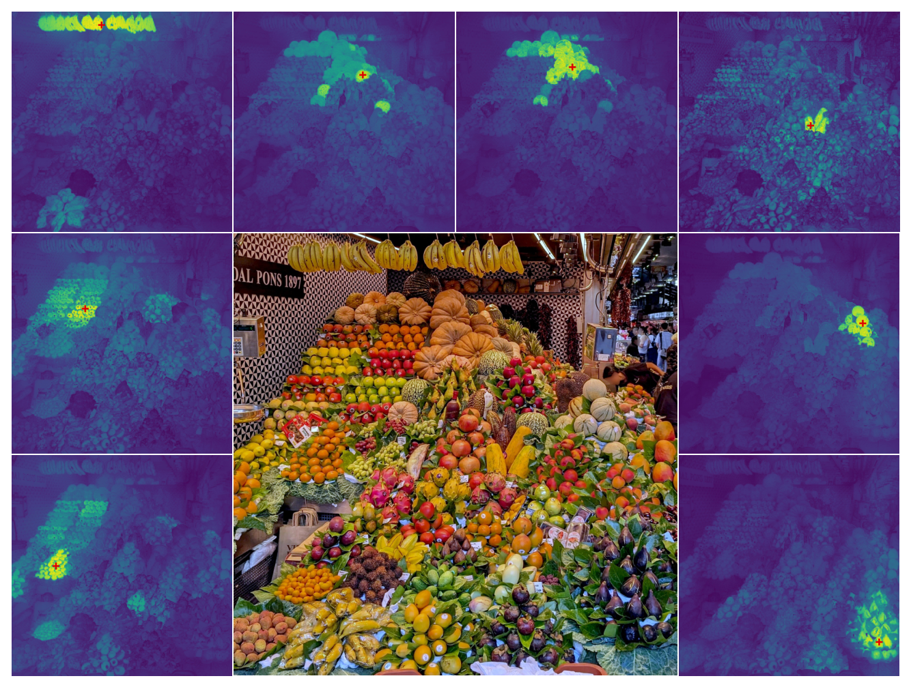

- **中文图注**：中心是原图（一个水果摊），周围 8 张是**余弦相似度热力图**；每张图中心的**红色十字**是被查询的那个 patch，**亮黄区域**是它的特征与哪些 patch 相似。输入分辨率 **4096×4096**（来源：`sources/figs/INDEX.md` Figure 3 图注 / 论文 Fig.3）。
- **看这张图要看出什么**：红色十字所在的 patch（比如一根香蕉、一箱柠檬），热力图的亮区**精确落在同类物体/同类纹理上**——这就是本节 `sim = fa @ fb.T` 那几行代码在视觉上到底在干什么。**高分辨率下这种局部化依然精确**，也是 DINOv3 能做匹配/对应的根因。
- **裁切提示**：本图无坐标轴，四周完整，可直接引用。

### 6.5.3 前景分割与视频跟踪：那三个「只有名字」的 notebook 到底做什么

README「Getting started」列了 5 个入门 notebook + 2 个 CHMv2 notebook（共 7 个）；仓库文件树 `notebooks/` 下**实际有 8 个** `*.ipynb`（多出一个 README 未列的 `dinotxt_inference.ipynb`，见 §12.3）。其中三个在别处常被一句带过，这里把它们**讲清楚：解决什么、输入输出、预期结果、怎么改**。

> **前置声明**：这些 notebook 的**源码不在本资料集内**（资料集只收录了它们的 README 一行描述与仓库文件树里的路径）。因此下面每条的「功能」来自 README 原文描述，「实现骨架」是**忠于同一做法的最小重建（非逐行照抄）**，跑通前请以仓库内 notebook 为准。

#### (1) `foreground_segmentation.ipynb` —— 用 DINOv3 特征训**二值前景分割**

| 项目 | 说明 |
|---|---|
| **解决什么** | 把「前景物体」从背景里抠出来（二类分割：前景/背景），**只需很少标注** |
| **怎么做** | 与第 6.2.1 节的线性分割完全同构：patch 特征图 → `BatchNorm2d` → `1×1` 卷积（输出 2 类）→ 上采样 |
| **输入** | `(N, 3, H, W)` 图像 + `(N, H, W)` 的二值 mask |
| **输出** | 每像素 2 类的 logits，`argmax` 得到前景/背景图 |
| **预期结果** | 训练几十个 epoch 后前景边界干净、物体完整；这也是论文 Fig.13 那类「特征可视化很锐利」的直接体现 |
| **可直接改** | 想接自己的数据 → 只需替换 `Dataset`（把 mask 读成 0/1），其余照抄第 6.2.1 节的训练循环 |

**最小骨架（与 6.2.1 同一套，改 2 类即可）**：

```python
head = nn.Sequential(
    nn.BatchNorm2d(model.embed_dim),          # 官方线性分割用 BatchNorm
    nn.Conv2d(model.embed_dim, 2, kernel_size=1),   # 2 类：前景/背景
).to(DEVICE)
opt = torch.optim.AdamW(head.parameters(), lr=1e-3, weight_decay=1e-3)

for img, mask in loader:                      # mask: [B, H, W]，取值 {0,1}
    x = transform(img).to(DEVICE)             # transform = 官方 512×512 那个
    with torch.inference_mode():              # 主干冻结
        fmap = model.get_intermediate_layers(x, n=1, reshape=True)[0]   # [B, C, 32, 32]
    pred = head(fmap)                         # [B, 2, 32, 32]
    target = F.interpolate(mask[:, None].float(), (32, 32), mode="nearest")[:, 0].long()
    loss = F.cross_entropy(pred, target)
    opt.zero_grad(); loss.backward(); opt.step()
```

**图 6-2：DINOv3 的特征「裸着」就能框出物体（无监督目标发现）**（论文 Figure 14；图片路径 `sources/figs/fig14_p21.png`）

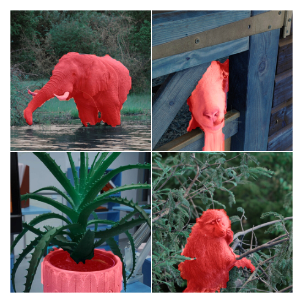

- **中文图注**：4 张自然图像，主物体上覆着**红色/橙色掩码**。论文说明这是把 TokenCut 跑在 DINOv3 输出的 patch 特征上得到的预测掩码，**输入分辨率 1024、无需任何标注、无需后处理**（来源：`sources/figs/INDEX.md` Figure 14 图注 / 论文 Fig.14）。
- **看这张图要看出什么**：前景分割（本节 (1)）之所以「只需很少标注」，是因为 **DINOv3 的 patch 特征本身就已经把物体和背景分开了**——红色叠层就是「特征相似度聚类」的产物。这也解释了为什么二值前景分割只需要一个 `BatchNorm + 1×1 卷积` 的小头。
- **裁切提示**：4 张子图完整、无坐标轴，可直接引用。

#### (2) `segmentation_tracking.ipynb` —— **非参数**视频分割跟踪

| 项目 | 说明 |
|---|---|
| **解决什么** | 给定第一帧的目标 mask，把它**沿视频传播**到后续帧（半监督视频分割 / VOS） |
| **关键点** | **非参数**（non-parametric）：**不训练任何网络**，纯粹靠 DINOv3 的 patch 特征做**跨帧最近邻匹配**，把第一帧的标签「传」下去 |
| **输入** | 视频帧序列 + 第一帧的目标 mask |
| **输出** | 每一帧的分割 mask |
| **预期结果** | 物体形变、轻微遮挡下仍能跟住；这正是论文「冻结特征 + 简单后处理」哲学的例证（模型卡 Direct Use 列了 video segmentation tracking） |
| **为什么值得学** | 它把「patch 特征 = 可匹配的位置描述子」用到极致，和第 6.5.2 的匹配是**同一套原理** |

**最小骨架（跨帧标签传播，非参数；原理与官方一致的重建）**：

```python
@torch.inference_mode()
def frame_feats(model, frame_pil, size=1024):
    """把一帧变成 [N_patch, C] 的 L2 归一化 patch 特征。"""
    x = v2.Compose([
        v2.ToImage(), v2.Resize((size, size), antialias=True),
        v2.ToDtype(torch.float32, scale=True),
        v2.Normalize(mean=LVD_MEAN, std=LVD_STD),
    ])(frame_pil)[None].to(DEVICE)
    f = model.forward_features(x)["x_norm_patchtokens"][0]      # [N, C]
    return F.normalize(f, dim=-1)

f0 = frame_feats(model, frames[0])                # 第一帧特征 [N, C]
mask0 = masks[0]                                  # 第一帧 mask（像素级）

# 把第一帧 mask 下采样到 patch 网格，得到「哪些 patch 属于前景」
g = int(f0.shape[0] ** 0.5)                       # patch 网格边长（size/16）
mask0_small = F.interpolate(mask0[None, None].float(), (g, g), mode="nearest")[0, 0] > 0.5
fg_idx = mask0_small.reshape(-1).nonzero(as_tuple=True)[0]      # 前景 patch 的索引
proto = F.normalize(f0[fg_idx].mean(0, keepdim=True), dim=-1)   # 前景原型

for t in range(1, len(frames)):
    ft = frame_feats(model, frames[t])            # [N, C]
    sim = (ft @ proto.T)[:, 0].reshape(g, g)      # 每个 patch 与前景原型的相似度
    pred_small = sim > sim.median()               # 简单阈值 → 前景/背景
    masks[t] = F.interpolate(pred_small[None, None].float(),
                             mask0.shape[-2:], mode="nearest")[0, 0] > 0.5
```

> **预期输出/现象**：第一帧必然准；后续帧在物体缓慢运动时跟得不错，**快速运动/严重遮挡会掉**——这是非参数方法的固有上限。**这不是官方实现**，官方 notebook 会有更好的后处理（多原型、时间平滑等）；这里给你的是「能跑起来并看懂原理」的最小版本。

**图 6-3：非参数视频跟踪的官方示例——首帧标签「沿特征相似度」逐帧传下去**（论文 Figure 15；图片路径 `sources/figs/fig15_p22.png`）

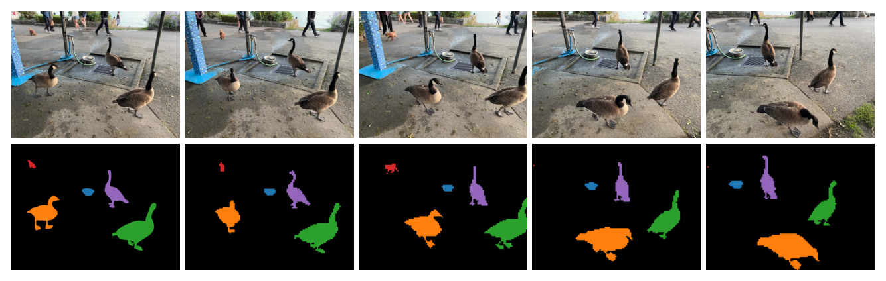

- **中文图注**：上下两行各 5 帧——上行是同一段视频（一群鹅）随时间推移的原图，下行是对应的彩色实例分割掩码。论文说明：给定**首帧的真值实例掩码**，按 DINOv3 特征空间里的 **patch 相似度**把实例标签传播到后续帧；输入分辨率 **2048×1536，即 128×96 个 patch**（来源：`sources/figs/INDEX.md` Figure 15 图注 / 论文 Fig.15）。
- **看这张图要看出什么**：**同一只鸟/物体在多帧里颜色保持不变**——这就是上面那 20 行骨架代码 `sim = (ft @ proto.T)` + 阈值判决想要达到的效果；也说明「不训练任何网络、纯靠特征匹配」在平缓运动下确实够用。
- **裁切提示**：两行图完整对齐、无坐标轴，可直接引用。

**图 6-4：视频任务怎么取「片段」（clip）——训练随机、推理确定**（论文 Figure 22；图片路径 `sources/figs/fig22_p62.png`）

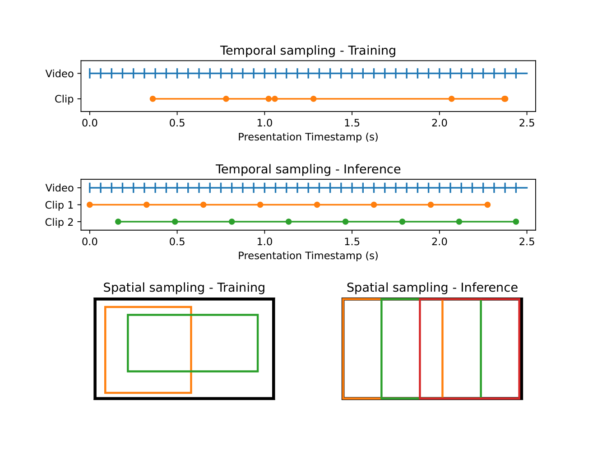

- **中文图注**：4 张示意图——上：时间采样（训练），在整段 video 上随机抽帧组成 clip；中：时间采样（推理），用 Clip 1 / Clip 2 两套**确定性**时间采样；下左：空间采样（训练），两个随机大框裁剪；下右：空间采样（推理），若干确定性竖条裁剪。论文原文：训练时随机取帧并施加**覆盖 ≥40% 面积**的空间裁剪，推理时确定性选多 clip 再平均（来源：`sources/figs/INDEX.md` Figure 22 图注 / 论文 Fig.22）。
- **看这张图要看出什么**：`segmentation_tracking` 那类「逐帧传播」只解决**时间上的一致性**，而**视频分类**（模型卡 Direct Use 里那条「video classification：small 4-layer attentive probe」）还要解决**如何从长视频里取样本**：训练靠随机、推理靠确定+多 clip 平均。看清这两套采样规则，才不会在推理时误用训练期的随机裁剪。
- **裁切提示**：本图标题、坐标轴、色块完整，可直接引用。

#### (3) `dinotxt_segmentation_inference.ipynb` —— dino.txt 的**开放词表分割**

这个 notebook 依赖 dino.txt 模型，完整代码与解释放在 **§6.8**（和零样本分类一起讲），这里只给一句话定位：**它用「文本-视觉对齐」后的 dino.txt，按你给的文字提示（如 "cat"、"road"）直接分割出对应区域**，是纯 DINOv3 主干做不到的（主干没有文本塔）。

### 本节小结

- **检索**：CLS token 余弦相似度，官方把长边缩到 224 再中心裁剪；ViT-7B Oxford-H 60.7。
- **匹配**：patch token 交叉相似度取最优；官方有 `dense_sparse_matching.ipynb`。
- **前景分割**：= 二值版线性分割（§6.5.3(1)），复用 6.2.1 的训练循环即可。
- **视频跟踪**：`segmentation_tracking.ipynb` 是**非参数**跨帧标签传播（§6.5.3(2)），不训网络。
- **开放词表分割**：`dinotxt_segmentation_inference.ipynb` 见 §6.8。

---

## 6.6 特征可视化（PCA 降维到 RGB）

> **这节解决什么**：把高维 patch 特征压成 3 通道 RGB，肉眼看看模型「看到了什么」。**这是最快验证模型是否正常工作的方式。**

**原理**：patch 特征是 C 维（ViT-B 是 768 维）。用主成分分析（PCA）取**前 3 个主成分**，映射到 RGB，就得到一张彩色图——**语义相近的像素颜色相近**（官方论文 Fig.13 就是这么做的）。

```python
import torch
import torch.nn.functional as F
import numpy as np
from PIL import Image
from torchvision.transforms import v2
import matplotlib.pyplot as plt

# 1) 提 patch 特征并 reshape 成 [C, h, w]
x = v2.Compose([
    v2.ToImage(),
    v2.Resize((512, 512), antialias=True),
    v2.ToDtype(torch.float32, scale=True),
    v2.Normalize(mean=(0.485, 0.456, 0.406), std=(0.229, 0.224, 0.225)),
])(Image.open("your_image.jpg").convert("RGB"))[None].cuda()

with torch.inference_mode():
    fmap = model.get_intermediate_layers(x, n=1, reshape=True)[0]   # [1, C, 32, 32]

patch = fmap[0].permute(1, 2, 0).reshape(-1, fmap.shape[1]).cpu().numpy()  # [1024, C]

# 2) PCA 取前 3 主成分
patch = patch - patch.mean(0, keepdims=True)
# 用 SVD 做 PCA（CV 里官方也用 sklearn 的 PCA）
U, S, Vt = np.linalg.svd(patch, full_matrices=False)
rgb = patch @ Vt[:3].T                       # [1024, 3]
# 3) 归一化到 [0,1] 后 reshape 成图
rgb = (rgb - rgb.min(0)) / (rgb.max(0) - rgb.min(0) + 1e-6)
rgb = rgb.reshape(32, 32, 3)

plt.imshow(rgb)
plt.axis("off")
plt.show()
```

**这段在干什么**：把每个 patch 的 768 维向量做 PCA，取前 3 主成分当 RGB，重排成 32×32 的彩色图。
**预期效果**：你会看到**语义区域颜色一致**（天空一块色、物体一块色），边界清晰。
**官方出处**：`notebooks/pca.ipynb`（README「Getting started」列出，标题就是「PCA of patch features」；有 Google Colab 链接）。**该 notebook 源码不在本资料集内**，上面的实现是**忠于「patch 特征 → PCA → RGB」这一官方做法的标准写法**。
**论文参照**：论文 Fig.13 用 PCA 对比了 SigLIP 2、PEspatial、DINOv2（带 registers）、DINOv3 ViT-7B，结论是 **DINOv3 特征更锐利、噪点更少、语义一致性更强**（输入 1280×960，patch 16）。
**常见报错**：`np.linalg.svd` 在大图上可能慢/占内存 → 可以先随机采样一部分 patch 拟合主成分，再投影全部 patch。

**图 6-5：同一张图、四个骨干的 PCA 特征图对比——DINOv3 最干净**（论文 Figure 13；图片路径 `sources/figs/fig13_p18.png`）

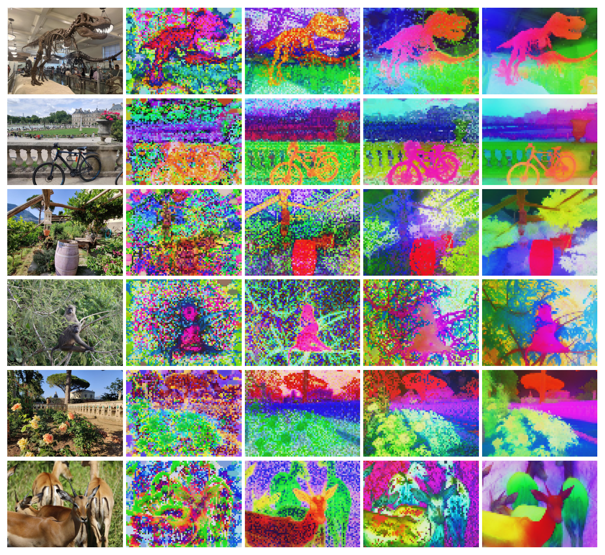

- **中文图注**：6 行 × 5 列。每行最左是原图，右侧 4 列依次是 **SigLIP 2 ViT-g/16、PEspatial ViT-G/14、DINOv2 ViT-g/14（带 register）、DINOv3 ViT-7B/16** 的稠密输出做 PCA 后映射成的 RGB 图；各骨干特征图尺寸统一为 **80×60**（输入分别 1280×960（patch 16）与 1120×840（patch 14））（来源：`sources/figs/INDEX.md` Figure 13 图注 / 论文 Fig.13）。
- **看这张图要看出什么**：**从左到右，物体边界越来越锐利、噪点越来越少**。第 1 列（SigLIP 2）几乎是彩色噪点，到第 4 列（DINOv3）语义区域干净成型——这正是 §6.6 那段 `np.linalg.svd` 代码输出「漂亮图」的**上界参考**：你跑出来的图若比第 4 列还干净是不可能的，若接近第 1 列则要先查归一化/取层是否用错。
- **裁切提示**：本图无坐标轴、行列对齐完整，可直接引用。

---

## 6.7 ConvNeXt 主干：怎么用（此前整篇教程缺的一块）

选型表把 ConvNeXt 列为「卷积偏好 / 部署友好」，但前面所有代码都是 ViT。这一节专门补上：**ConvNeXt 怎么加载、输出是什么、和 ViT 有什么不一样**。

### 6.7.1 加载（仓库路线）

```python
import torch
from dinov3.hub.backbones import Weights        # 若要用 Weights.SAT493M 之类，必须先导入

# 四个规格：dinov3_convnext_tiny / _small / _base / _large
convnext = torch.hub.load(
    REPO_DIR, "dinov3_convnext_base", source="local",
    weights=CKPT,                                # 你拿到的 ConvNeXt-Base 权重路径/URL
)
convnext.eval().to(DEVICE)
```

**为什么不用改别的**：`_make_dinov3_convnext(...)` 的参数是 `depths/dims/drop_path_rate/layer_scale_init_value`，**没有 `patch_size`**——所以**别对它传 `patch_size=` 或 `img_size=`**（会进 `**kwargs` 再被 `ConvNeXt(**model_kwargs)` 接走，行为取决于构造函数；总之官方示例从不这么用）。

### 6.7.2 输出：**和 ViT 同名同形**（这是最容易误解的一点）

```python
x = transform(img)[None].to(DEVICE)           # [1, 3, 256, 256]
with torch.inference_mode():
    out = convnext.forward_features(x)

print(list(out.keys()))                       # 与 ViT 完全相同
print(out["x_norm_clstoken"].shape)           # [1, 1024]      ← 池化得到的「CLS」
print(out["x_storage_tokens"].shape)          # [1, 0, 1024]   ← ConvNeXt 没有 register，是空的
print(out["x_norm_patchtokens"].shape)        # [1, (H/32)*(W/32), 1024]  ← 注意下采样步长
```

**关键差异，逐条说清**：

| 维度 | ViT | ConvNeXt |
|---|---|---|
| **CLS token** | 一个**可学习**的 token，放在序列第 0 位 | **全局平均池化** `x.mean([-2,-1])` 得到，拼在序列前面（源码 `repo/dinov3_models_convnext.py` `forward_features_list`，约 223–245 行） |
| **返回键名** | `x_norm_clstoken` / `x_storage_tokens` / `x_norm_patchtokens` / `x_prenorm` / `masks` | **完全一样**（`x_storage_tokens` 为空，因为 `n_storage_tokens=0`） |
| **patch 网格步长** | `patch_size = 16`（`model.patch_size` 可用） | **不是 16**：ConvNeXt 是卷积金字塔，**总下采样 32**。这个 32 来自 `downsample_layers`——**stem 一层 `Conv2d(kernel_size=4, stride=4)`（÷4）加 3 个 `Conv2d(kernel_size=2, stride=2)` 下采样层（各 ÷2）**，4×2×2×2 = 32；**与 `depths`（每个 stage 里 block 的个数）无关**（源码 `repo/dinov3_models_convnext.py` 第 156–167 行）。「patch」数约是 `(H/32)×(W/32)`，**所以第 4.4 节 `model.patch_size` 那段代码对 ConvNeXt 不适用** |
| **`model.patch_size`** | 存在，等于 16 | **不存在**；请直接用输出张量的形状推网格 |
| **大图** | 靠 RoPE 免插值（第 7 章） | 卷积本身是平移等变的，同样能接受更大输入，但**没有 RoPE 这一说** |

**把 patch token 变成特征图（ConvNeXt 版，别再用 16）**：

```python
with torch.inference_mode():
    out = convnext.forward_features(x)
patch = out["x_norm_patchtokens"]              # [B, N, C]
B, N, C = patch.shape
g = int(N ** 0.5)                              # 假设输入是正方形，反推网格边长
fmap = patch.transpose(1, 2).reshape(B, C, g, g)   # [B, C, g, g]
print(fmap.shape)                              # 256 输入、步长 32 → [1, 1024, 8, 8]
```

> 注意：ConvNeXt 的 `x_norm_patchtokens` 是**对池化前的空间特征**展平得到的，网格步长由网络下采样倍数决定（≈32），**不是 patch_size=16**。若你要的是 `[B, C, H/32, W/32]`，用上面的 `g = int(N**0.5)` 反推即可。

**四个 ConvNeXt 规格的维度与网格**（源码 `convnext_sizes`，`C` = 最后一 stage 维度，也就是特征维度）：

| 规格 | `dims`（4 个 stage 的通道） | 最终 C | 224 输入的网格 `H/32` |
|---|---|---|---|
| tiny | `[96, 192, 384, 768]` | **768** | 7×7 |
| small | `[96, 192, 384, 768]` | **768** | 7×7 |
| base | `[128, 256, 512, 1024]` | **1024** | 7×7 |
| large | `[192, 384, 768, 1536]` | **1536** | 7×7 |

（注意：**Tiny 与 Small 的通道数相同**，区别在第三个 stage 的深度 `depths`，Tiny 是 `[3,3,9,3]`、Small 是 `[3,3,27,3]`；而 base 与 large 的 `depths` 也都是 `[3,3,27,3]`，两者区别只在 `dims`。源码 `convnext_sizes`。）

### 6.7.3 HF 路线的 ConvNeXt（输出形态与 ViT **不同**）

```python
import torch
from transformers import AutoImageProcessor, AutoModel
from transformers.image_utils import load_image

name = "facebook/dinov3-convnext-base-pretrain-lvd1689m"
processor = AutoImageProcessor.from_pretrained(name)
model = AutoModel.from_pretrained(name, device_map="auto")

image = load_image("http://images.cocodataset.org/val2017/000000039769.jpg")
inputs = processor(images=image, return_tensors="pt").to(model.device)
with torch.inference_mode():
    outputs = model(**inputs)

print(type(outputs).__name__)                  # BaseModelOutputWithPoolingAndNoAttention
print(outputs.last_hidden_state.shape)         # [B, C, H', W']  ← 注意：是 4D 特征图，不是序列！
print(outputs.pooler_output.shape)             # [B, C]          ← 空间维池化后的整图向量
```

> **HF 官方文档明确**：`DINOv3ConvNextModel` 的 `last_hidden_state` 形状是 `(batch_size, num_channels, height, width)`，`pooler_output` 是「对空间维做池化后的 hidden state」。**这和 ViT 的 `last_hidden_state = [B, seq, C]` 是两种形态**——写通用代码时务必分支处理。

### 6.7.4 ConvNeXt 值得选吗？看官方评测（HF 模型卡）

ConvNeXt 全部**蒸馏自 ViT-7B**（HF 模型卡原文），因此定位是「用卷积的部署友好性换取部分精度」。

HF 卡里这张表的表头结构是：**`IN-ReaL`、`IN-R`、`Obj.Net` 各拆成 `@256px` / `@512px` 两列，`ADE20k` 与 `NYU↓` 各一列**（原始 HTML 的 `<th colspan="2">` 就是这么分的）。逐格核对后如下（**注意不要把 `IN-ReaL@512` 当成 `IN-R`、也不要把 `Obj.Net@512` 当成 `ADE20k`**）：

| 模型 | 参数量 | IN-ReaL@256 | IN-ReaL@512 | IN-R@256 | IN-R@512 | Obj.Net@256 | Obj.Net@512 | ADE20k | NYU↓ |
|---|---|---|---|---|---|---|---|---|---|
| ConvNeXt-Tiny | 29M | 86.6 | 87.7 | 73.7 | 74.1 | 52.6 | 58.7 | 42.7 | 0.448 |
| ConvNeXt-Small | 50M | 87.9 | 88.7 | 73.7 | 74.1 | 52.6 | 58.7 | 44.8 | 0.432 |
| ConvNeXt-Base | 89M | 88.5 | 89.2 | 77.2 | 78.2 | 56.2 | 61.3 | 46.3 | 0.420 |
| ConvNeXt-Large | 198M | 88.9 | 89.4 | 81.3 | 82.4 | 59.3 | 65.2 | 47.8 | 0.403 |

（来源：`sources/hfcard_facebook_dinov3-convnext-base-pretrain-lvd1689m.html` 的 ConvNeXt 表 `<th colspan>` 结构 + `sources/hf_model_cards.md`「Results for ConvNeXt backbones distilled on web (LVD-1689M)」；参数量来自同卡「Technical Specifications」段。）

> **读表提醒**：`IN-ReaL@512`（如 ConvNeXt-L 的 **89.4**）比 `@256` 只涨一点点，而 `Obj.Net` 从 `@256` 到 `@512` 涨得多（59.3→65.2）；ADE20k 是**单列、不分分辨率**。把 `Obj.Net@512` 误读成 ADE20k，会得到「ConvNeXt-L ADE20k 65.2 竟高于 ViT-7B 的 55.9」这种**明显矛盾**的结果——这正是列串位的信号。

**结论**：需要**纯卷积、无注意力、便于量化/部署到某些推理引擎**时选 ConvNeXt；需要**最好的 dense 特征**时选 ViT。就分割/深度这类 dense 任务而言，ConvNeXt-L 的 ADE20k（**47.8**）仍低于同卡 ViT-L 的 54.9，与其「蒸馏自 ViT-7B、换取部署友好性」的定位一致。

---

## 6.8 `dino.txt`：给 DINOv3 接上文本塔（零样本分类 / 开放词表分割）

第 1 章说过：**纯 DINOv3 主干没有文本塔，天生不做零样本**。官方另外发布了一个 **`dino.txt`** 模型，把 DINOv3 视觉主干与一个文本编码器对齐，从而能做**零样本分类**和**开放词表分割**。这一节把「返回 `(model, tokenizer)`」这句话补成可用的代码。

### 6.8.1 模型、词表与许可（三条官方链接，务必一起处理）

| 资源 | 地址 | 说明 |
|---|---|---|
| **dino.txt 权重** | 走 `https://ai.meta.com/resources/models-and-libraries/dinov3-downloads/` 申请 | 主干是 **ViT-L/16 distilled** |
| **BPE 词表（vocabulary）** | `https://dl.fbaipublicfiles.com/dinov3/thirdparty/bpe_simple_vocab_16e6.txt.gz` | 文本 tokenizer 的词表 |
| **词表许可（vocabulary license）** | `https://dl.fbaipublicfiles.com/dinov2/thirdparty/LICENSE` | **注意：这是 DINOv2 的 thirdparty LICENSE**，与 DINOv3 License 是**两份不同的许可**，用词表时请一并遵守 |

（三条都出自 README「Pretrained heads - Zero-shot tasks with `dino.txt`」表格。）

### 6.8.2 加载：**返回的是 `(model, tokenizer)` 二元组**

源码 `repo/dinov3_hub_dinotxt.py` 的入口签名就是 `Tuple[nn.Module, Any]`，所以**必须解包**：

```python
import torch
from dinov3.hub.backbones import Weights       # 主干权重枚举

# ⚠️ 这个入口返回【两个】对象：模型 + 分词器
dinotxt_model, tokenizer = torch.hub.load(
    REPO_DIR,
    "dinov3_vitl16_dinotxt_tet1280d20h24l",   # tet1280d20h24l = 文本塔：1280 维、20 头、24 层
    source="local",
    weights=<DINOTXT/CHECKPOINT/URL/OR/PATH>,           # dino.txt 的视觉头 + 文本编码器权重
    backbone_weights=<DINOV3_VITL16/CHECKPOINT/URL/OR/PATH>,   # 视觉主干权重
)
dinotxt_model.eval().to(DEVICE)
```

**它的默认词表参数**（源码）：`bpe_path_or_url` 的默认值就是上面那条 `bpe_simple_vocab_16e6.txt.gz`；**离线环境**可以把这个 `.gz` 下载到本地，然后把 URL 换成本地路径传入。

**模型的关键配置（源码 `dinov3_hub_dinotxt.py` 的 `DINOTxtConfig`，认这些数字就够了）**：

| 配置 | 值 | 含义 |
|---|---|---|
| `embed_dim` | 2048 | 视觉/文本投影到的公共嵌入维度 |
| `vision_model_freeze_backbone` | True | **视觉主干冻结**（和全书纪律一致） |
| `vision_model_use_class_token` / `use_patch_tokens` | True / True | 同时用 CLS 与 patch token（patch 用 `mean` 池化） |
| `vision_model_num_head_blocks` | 2 | 视觉侧注意力头块数量 |
| `vision_model_patch_token_layer` | 1 | 取**最后一层**的 patch token |
| `text_model_tokens_pooler_type` | `argmax` | 文本侧用 argmax 池化（搭配 causal 文本塔） |
| `init_logit_scale` | `log(1/0.07)` | 初始 logit scale（≈14.3），CLIP 式温度 |

### 6.8.3 用法 A：零样本分类（文本提示 → 找最像的类别）

**接口边界要说清**：dino.txt 模型类 `DINOTxt` 的 `forward` 签名**不在本资料集内**（`dinov3/eval/text/dinotxt_model.py` 未收录）。下面按**源码里已确认的组件**（`vision_model_*` / `text_model_*` / `init_logit_scale`）+ **CLIP 式接口惯例**写一份**忠于设计的最小重建**，跑通前请对照仓库 notebook。

```python
import torch
from PIL import Image
from torchvision.transforms import v2

# 1) 准备文本提示：每个类别一条 prompt（模板用 CLIP 式「a photo of a {}」）
class_names = ["cat", "dog", "car", "airplane"]
prompts = [f"a photo of a {c}" for c in class_names]

# 2) 文本侧：用返回的 tokenizer 编码 → 过文本塔
#    接口按 CLIP 惯例：tokenizer(texts) -> {input_ids, attention_mask}
text_tokens = tokenizer(prompts)                # 期望返回可送入文本塔的 batch
with torch.inference_mode():
    text_emb = dinotxt_model.encode_text(text_tokens)     # [num_classes, 2048]
    text_emb = text_emb / text_emb.norm(dim=-1, keepdim=True)

# 3) 视觉侧：和图特征对齐（同一套归一化常量）
x = v2.Compose([
    v2.ToImage(), v2.Resize((224, 224), antialias=True),
    v2.ToDtype(torch.float32, scale=True),
    v2.Normalize(mean=(0.485, 0.456, 0.406), std=(0.229, 0.224, 0.225)),
])(Image.open("your_image.jpg").convert("RGB"))[None].to(DEVICE)

with torch.inference_mode():
    img_emb = dinotxt_model.encode_image(x)               # [1, 2048]
    img_emb = img_emb / img_emb.norm(dim=-1, keepdim=True)

# 4) 相似度 → 类别
logit_scale = dinotxt_model.logit_scale.exp()             # 初始 log(1/0.07)
logits = logit_scale * (img_emb @ text_emb.T)             # [1, num_classes]
print({c: round(p, 4) for c, p in zip(class_names, logits.softmax(-1)[0].tolist())})
```

> **预期输出/现象**：打印出每个类别的概率，**猫的图应给 "cat" 最高分**。若所有分数都接近均匀，多半是 **logit scale 没乘**（那一步就是 CLIP 式温度）或**文本/视觉没对齐同一套 prompt 模板**。
> **再次强调**：`encode_text` / `encode_image` / `logit_scale` 这些**方法名是 CLIP 惯例的重建**，不是从资料集里抄来的；官方 notebook `notebooks/dinotxt_inference.ipynb`（仓库文件树中存在）与 `dinotxt_segmentation_inference.ipynb` 里有确切接口。

### 6.8.4 用法 B：开放词表分割（`dinotxt_segmentation_inference.ipynb`）

README 对它的描述是：**「compute the open-vocabulary segmentation results with dino.txt strategy」**——即用 dino.txt 的「视觉 patch 特征 ↔ 文本嵌入」相似度，**按你给的文字类别直接打出分割图**（不需要为这些类别训练任何头）。做法上它与第 6.2 节的分割同构，区别是把「分类头的权重」换成「文本嵌入」：

```
dino.txt 开放词表分割 ≈  patch 特征图（第 4.4 节）
                      × 文本嵌入（每个类别一条 prompt）
                      → 每个 patch 与每个类别的相似度
                      → argmax → 上采样回原图 = 分割图
```

**输入**：一张图 + 一组类别文字（如 `["road", "tree", "sky", "car"]`）；**输出**：同尺寸的类别图。**预期结果**：类别是你**当场用文字指定**的，无需训练。具体预处理尺寸、是否滑窗、相似度归一化方式以官方 notebook 为准（**资料集未收录其源码**）。

### 6.8.5 它到底有多强？看论文 Tab.16

论文 **Tab.16** 对比的就是「文本对齐版 dino.txt」，可见 dino.txt 用 ViT-L 的体量换来了接近弱监督模型的零样本分类：

| 方法 | IN1k | IN-A | IN-R | Obj.Net |
|---|---|---|---|---|
| CLIP | 76.6 | 77.5 | 89.0 | 72.3 |
| SigLIP 2 | 83.1 | 84.3 | 95.7 | 84.4 |
| PE | 83.5 | 89.0 | 95.2 | 84.7 |
| **DINOv3 dino.txt** | **82.3** | 85.4 | 93.0 | 80.5 |

（来源：论文 Tab.16。论文同时提到 dino.txt 在 ADE20K 的 dense alignment 上仍有竞争力。）

**一句话**：**要零样本/开放词表，用 dino.txt；要纯视觉的最强 dense 特征，用 dino.txt 的视觉主干（它本来就是 ViT-L distilled）。**

### 6.8.6 想自己训一份文本对齐？官方给了示例命令

README 有一节 **「Text alignment on DINOv3 using dino.txt」**，说明对齐训练可以照 `dino.txt`（即论文 [DINOv2 Meets Text, arXiv:2412.16334](https://arxiv.org/abs/2412.16334)）的方法自己做。命令原文（`<PATH/...>` 为占位符）：

```shell
PYTHONPATH=${PWD} python -m dinov3.run.submit dinov3/eval/text/train_dinotxt.py \
   --nodes 4 \
  # An example config for text alignment is here: dinov3/eval/text/configs/dinov3_vitl_text.yaml \
  trainer_config_file="<PATH/TO/DINOv3/TEXT/CONFIG>" \
  output-dir=<PATH/TO/OUTPUT/DIR>
```

**怎么读这条命令**：

- `--nodes 4`：**4 个节点、每节点 8 张卡 = 共 32 GPU**（README 原文：``Launches the above trains text alignment on 4 nodes with 8 gpus each (32 gpus in total)``）。
- `trainer_config_file`：训练配置；官方给的示例配置是 **`dinov3/eval/text/configs/dinov3_vitl_text.yaml`**（配置名里的 `vitl` 对应 ViT-L 视觉主干）。
- `output-dir`：输出目录（该目录下的产物文件名 **官方资料未给出**）。

> **⚠️ 两点务必知道**：① README 明确说明，**论文里的文本对齐模型是在私有数据集上训的**；仓库里给的示例配置只是**用 `CocoCaptions` 数据集做演示**，请自行改写/替换 `CocoCaptions` 这份 dataset 类（README 指向的原始数据在 Kaggle 的 `nikhil7280/coco-image-caption`）。② 视觉主干用 ViT-L，与 §6.8.2 加载的 `dinov3_vitl16_dinotxt_tet1280d20h24l` 对应；**文本塔（`tet1280d20h24l` = 1280 维 / 20 头 / 24 层）、BPE 词表、以及 DINOv2 的 thirdparty 词表许可**见 §6.8.1 的三条链接。

---

## 6.9 评估复现命令与**预期指标**（跑完怎么自检）

§6.1 只说「官方有 `knn.py` / `linear.py`」，这里把**命令**和**该跑出什么指标**都列全，方便你判断是否复现成功。以下命令**全部来自 README「Evaluation」节原文**，`<PATH/TO/OUTPUT/DIR>` 指训练时的输出目录（里面有 `config.yaml` 与 `teacher_checkpoint.pth`）。

### 6.9.1 分类三件套（ImageNet-1k）

```shell
# ① 逻辑回归（logistic regression）
PYTHONPATH=${PWD} python -m dinov3.run.submit dinov3/eval/log_regression.py \
  model.config_file=<PATH/TO/OUTPUT/DIR>/config.yaml \
  model.pretrained_weights=<PATH/TO/OUTPUT/DIR>/teacher_checkpoint.pth \
  output_dir=<PATH/TO/OUTPUT/DIR> \
  train.dataset=ImageNet:split=TRAIN:root=<PATH/TO/DATASET>:extra=<PATH/TO/DATASET> \
  eval.test_dataset=ImageNet:split=VAL:root=<PATH/TO/DATASET>:extra=<PATH/TO/DATASET>

# ② k-NN
PYTHONPATH=${PWD} python -m dinov3.run.submit dinov3/eval/knn.py \
  model.config_file=<PATH/TO/OUTPUT/DIR>/config.yaml \
  model.pretrained_weights=<PATH/TO/OUTPUT/DIR>/teacher_checkpoint.pth \
  output_dir=<PATH/TO/OUTPUT/DIR> \
  train.dataset=ImageNet:split=TRAIN:root=<PATH/TO/DATASET>:extra=<PATH/TO/DATASET> \
  eval.test_dataset=ImageNet:split=VAL:root=<PATH/TO/DATASET>:extra=<PATH/TO/DATASET>

# ③ 带数据增强的线性分类（linear）
PYTHONPATH=${PWD} python -m dinov3.run.submit dinov3/eval/linear.py \
  model.config_file=<PATH/TO/OUTPUT/DIR>/config.yaml \
  model.pretrained_weights=<PATH/TO/OUTPUT/DIR>/teacher_checkpoint.pth \
  output_dir=<PATH/TO/OUTPUT/DIR> \
  train.dataset=ImageNet:split=TRAIN:root=<PATH/TO/DATASET>:extra=<PATH/TO/DATASET> \
  train.val_dataset=ImageNet:split=VAL:root=<PATH/TO/DATASET>:extra=<PATH/TO/DATASET>
```

**该跑出什么**（官方唯一给出的 k-NN/linear 数字，README「Fast setup」）：

| 命令 | 应当得到的指标（ViT-L/16 @ ImageNet-1k，4 节点 32 GPU 训 14 小时） |
|---|---|
| `log_regression.py` | README 未给出该命令的指标（**官方资料未给出**）；它与 `linear.py` 是两条并列的线性分类评测路径 |
| `knn.py` | **k-NN 82.0%** |
| `linear.py` | **linear 83.5%** |

> **自检用法**：如果你的 `knn.py` 明显低于 82.0，先回查两件事——**归一化常量是否用错**（第 5.2 节）、**`config.yaml` 是不是对应这次训练**（它对不上会静默用错主干规格）。
> 三个脚本的**源码不在本资料集内**，所以「输出文件的精确文件名/字段」**官方资料未给出**；按 README 的写法，指标会写到 `output_dir` 下的结果文件里。

### 6.9.2 分割（ADE20k）

```shell
PYTHONPATH=. python -m dinov3.run.submit dinov3/eval/segmentation/run.py \
model.dino_hub=dinov3_vit7b16 \
config=dinov3/eval/segmentation/configs/config-ade20k-linear-training.yaml \
datasets.root=<PATH/TO/DATASET> \
--output-dir <PATH/TO/OUTPUT/DIR>
```

**跑完在输出目录得到三个文件**（README 原文）：`segmentation_config.yaml`（本次训练用的配置）、`model_final.pth`（线性头最终权重）、`results-semantic-segmentation.csv`（**最终指标**）。
**该跑出什么**：论文 Tab.3 的**线性**分割 ViT-7B/16 = **55.9 mIoU**（ViT-L 54.9、ViT-B 51.8，见本报告 §6.2.1 的来源标注）。

**想直接复现 M2F 强分割头的 62.6/63.0 mIoU**，改用官方发好的权重做推理（命令原文见 §6.2.2，此处并列，便于对照）：

```shell
PYTHONPATH=. python -m dinov3.run.submit dinov3/eval/segmentation/run.py \
config=dinov3/eval/segmentation/configs/config-ade20k-m2f-inference.yaml \
datasets.root=<PATH/TO/DATASET> \
load_from=dinov3_vit7b16_ms \
--output-dir <PATH/TO/OUTPUT/DIR>
```

> 两条命令的区别：这条用 `config-ade20k-m2f-inference.yaml` + `load_from=dinov3_vit7b16_ms`（直接复现 [62.6/63.0] 的 M2F 推理）；上面那条用 `config-ade20k-linear-training.yaml` + `model.dino_hub=dinov3_vit7b16`（从零训线性头，指标 ~55.9）。别把两者的配置文件混用。

### 6.9.3 深度（NYUv2）——两条命令，见 §6.3.1b

```shell
# DPT 头推理（用官方训好的头）
PYTHONPATH=. python -m dinov3.run.submit dinov3/eval/depth/run.py \
config=dinov3/eval/depth/configs/config-nyu-synthmix-dpt-inference.yaml \
datasets.root=<PATH/TO/DATASET> \
load_from=dinov3_vit7b16_dd \
--output-dir <PATH/TO/OUTPUT/DIR>

# 线性深度（自己训头）
PYTHONPATH=. python -m dinov3.run.submit dinov3/eval/depth/run.py \
    model.dino_hub=dinov3_vit7b16 \
    config=dinov3/eval/depth/configs/config-nyu.yaml \
    datasets.root=<PATH/TO/DATASET> \
    --output-dir <PATH/TO/OUTPUT/DIR>
```

**输出**（README 原文）：线性那条跑完得到 `depth_config.yaml`、`model_final.pth`、`results-depth.csv`。
**该跑出什么**：线性深度 ViT-7B NYUv2 **RMSE 0.309**（Tab.3；比 DINOv2 好 0.278）；DPT 管线（DAv2 + 冻结 DINOv3）NYUv2 **ARel 4.3 / δ1 98.0**（Tab.12）。

### 6.9.4 一句话自检清单

| 你跑的 | 对的指标 | 差太多先查 |
|---|---|---|
| `knn.py` | 82.0 | 归一化常量、config.yaml 是否对应 |
| `linear.py` | 83.5 | 同上 |
| 分割 linear | 55.9 mIoU | 是否冻结主干、`img_size=512`、滑窗推理 |
| 深度 linear | 0.309 RMSE | 特征是否过**训练过的 BatchNorm**（论文 App.D.2） |

---

## 6.10 卫星模型专节：SAT-493M 什么时候用、怎么用、有多强

前面所有示例都默认「网页图像权重（LVD-1689M）」。但 DINOv3 还发布了**两个专门在卫星影像上训练的模型**，它们**不是**换个数据集微调，而是**从零/从头在卫星数据上预训练**的独立权重。做遥感（分类、地物分割、冠层高度）时应优先用它们。

### 6.10.1 两个卫星模型是什么

| 模型 | HF repo id（官方） | 来源 | 参数量 |
|---|---|---|---|
| **ViT-L/16 (SAT-493M)** | `facebook/dinov3-vitl16-pretrain-sat493m` | 从 **7B 教师蒸馏** | 300M（0.3B） |
| **ViT-7B/16 (SAT-493M)** | `facebook/dinov3-vit7b16-pretrain-sat493m` | **从零训练** | 6716M |

（两个 repo id 来源：`sources/hf_model_cards.md`「Model Details」段的 12 模型构成——卫星 2 个 = 1 个 ViT-7B from scratch + 1 个 ViT-L distilled；`sources/hf_dinov3_collection.txt` 第 4 行给出对应 repo id。）

**训练数据原文**（来源：`sources/hf_model_cards.md`「Training Details → Training Data」）：`a dataset of 493 millions of 512x512 images sampled randomly from Maxar RGB ortho-rectified imagery at 0.6 meter resolution`——即 **4.93 亿张 512×512 图像，随机采样自 Maxar RGB 正射校正影像，分辨率 0.6 米**。

### 6.10.2 ⚠️ 必用专属归一化（这是最容易错的一处）

**卫星权重必须换一套 mean/std，绝不能沿用网页版的 ImageNet 常量**（第 5.2 节）：

| 用途 | mean | std |
|---|---|---|
| **SAT-493M**（`...-sat493m`、CHMv2） | **(0.430, 0.411, 0.296)** | **(0.213, 0.156, 0.143)** |
| LVD-1689M（网页，其余全部模型） | (0.485, 0.456, 0.406) | (0.229, 0.224, 0.225) |

> ⚠️ **避坑框**：① **判断该用哪套只看权重名**——名字里有 `sat493m` 或来自 CHMv2 就用 SAT 常量，否则用 ImageNet 常量（第 5.2 节）。② **走 HF 路线时尤其注意**：`AutoImageProcessor` 的默认 `image_mean`/`image_std` 是**网页版常量**，拿 SAT 权重时必须在 `processor(...)` 里**显式传** SAT 的 mean/std（第 7.5.1 节）。用错归一化的症状是「一切流程都对，但指标明显低于预期」。

### 6.10.3 加载（两条路线）

```python
# 路线 A：仓库 + torch.hub（用 Weights 枚举自动拼 SAT 权重 URL）
from dinov3.hub.backbones import Weights          # ⚠️ 必须先导入，否则 NameError
import torch

model = torch.hub.load(REPO_DIR, "dinov3_vitl16", source="local",
                       weights=Weights.SAT493M)   # ViT-L 卫星主干
model.eval().to(DEVICE)
# 归一化记得配 SAT 常量（见 6.10.2）

# 路线 B：HF（注意显式传 SAT 的 mean/std）
from transformers import AutoImageProcessor, AutoModel
name = "facebook/dinov3-vitl16-pretrain-sat493m"
processor = AutoImageProcessor.from_pretrained(name,
    image_mean=[0.430, 0.411, 0.296], image_std=[0.213, 0.156, 0.143])
model = AutoModel.from_pretrained(name, device_map="auto")
```

**这段在干什么**：路线 A 用官方 `Weights.SAT493M` 枚举让 `torch.hub.load` 自动指向卫星权重；路线 B 走 HF，但**必须覆盖 processor 的默认归一化**。
**前提**：路线 A 需要 `REPO_DIR` 与仓库代码；路线 B 需要 `transformers >= 4.56.0` 与 SAT 权重的 HF 访问权（同为 gated，第 2.3 节）。
**输出**：与网页版主干**完全相同的键名与形状**（`x_norm_clstoken` / `x_norm_patchtokens` 等，第 4 章）——换的只是权重与归一化常量，下游代码不用改。

### 6.10.4 在 GEO-Bench 上的成绩（官方模型卡）

**分类（GEO-Bench Classification）**（来源：`sources/hf_model_cards.md`「Results for ViT backbones pretrained (or distilled) on satellite (SAT-493M)」表）：

| 模型 | m-BEnet | m-brick-kiln | m-eurosat | m-forestnet | m-pv4ger | m-so2sat | **mean** |
|---|---|---|---|---|---|---|---|
| DINOv3 ViT-L/16 | 73.0 | 96.5 | 94.1 | 60.6 | 96.0 | 57.4 | **79.6** |
| DINOv3 ViT-7B/16 | 74.0 | 97.2 | 94.8 | 62.3 | 96.1 | 62.1 | **81.1** |

**分割（GEO-Bench Segmentation）**（同来源）：

| 模型 | m-cashew | m-chesapeake | m-NeonTree | m-nz-cattle | m-pv4ger-seg | m-SA-crop | **mean** |
|---|---|---|---|---|---|---|---|
| DINOv3 ViT-L/16 | 94.2 | 75.6 | 61.8 | 83.7 | 95.2 | 36.8 | **74.5** |
| DINOv3 ViT-7B/16 | 94.1 | 76.6 | 62.6 | 83.4 | 95.5 | 37.6 | **75.0** |

> **读表提醒（两个别误读的点）**：① **不是每一项都单调**——m-cashew 在 7B 上反而略降（94.2→94.1），但两个表中位数 mean 仍是 7B 更高（分类 79.6→81.1、分割 74.5→75.0）；② 这是**官方 HF 模型卡**的数字，口径是 GEO-Bench；**论文侧还有一套独立的地理空间实验（Tab.18 的 GEO-Bench、Tab.19 的高分辨率 LoveDA/iSAID/DIOR）**，与这里不同源，见下 §6.10.5。

### 6.10.5 论文侧的高分辨率遥感结果（Tab.19）

HF 模型卡只覆盖 GEO-Bench。论文另用 **Tab.18（GEO-Bench 分类/分割）** 与 **Tab.19（高分辨率分割/检测）** 两张表评遥感，**两张都同时列了 DINOv3 Sat 与 DINOv3 Web**。§6.10.4 的 GEO-Bench 数字取自 HF 卡（只列卫星模型），而下面的 **Tab.19** 是高分辨率口径：覆盖 **LoveDA / iSAID 的 mIoU** 与 **DIOR 的 mAP**，并把网页版与卫星版权重直接对比（来源：`sources/dinov3_paper_clean.txt` 第 3227–3279 行；数值与 `notes/downstream.md` 一致）：

| Method | 主干 | LoveDA mIoU（1024×，UPerNet） | iSAID mIoU（896×，UPerNet） | DIOR mAP（800×，Faster-RCNN） |
|---|---|---|---|---|
| BillionFM（前 SOTA） | ViT-G | 54.4 | — | — |
| SkySense V2（前 SOTA）\* | Swin-G | — | 71.9 | 79.5 |
| Prithvi-v2 | ViT-H | 52.2 | 62.8 | — |
| **DINOv3 Sat** | ViT-L | 54.4 | 62.9 | 72.7 |
| **DINOv3 Sat** | ViT-7B | 55.3 | 64.8 | 76.6 |
| **DINOv3 Web** | ViT-7B | **56.2** | 71.4 | **80.5** |

\* SkySense V2 标注为「modified DINOv2 SSL with supervised pretraining alignment」。

**怎么读这张表（三点）**：

1. **指标口径**：LoveDA / iSAID 报 **mIoU**，用 **UPerNet** 解码器（80k iter、batch 8、1500 步线性 warm-up）；DIOR 报 **mAP**，用 **Faster-RCNN**（12 epochs，论文 App. D.13）。**所有评测都冻结主干**，只训任务头。
2. **哪些任务赢了**：**LoveDA（56.2 对 54.4）和 DIOR（80.5 对 79.5）刷新 SOTA**；但 **iSAID 上前 SOTA（SkySense V2）= 71.9，DINOv3 Web 7B = 71.4 并未超过**。论文正文的说法是「在 15 个 EO 任务中 12 个刷新 SOTA」，与这里一致。
3. **Web 权重 vs 卫星权重**：这三个任务里 **DINOv3 Web（7B）全面高于 DINOv3 Sat（7B）**（56.2>55.3、71.4>64.8、80.5>76.6）——说明遥感任务并非「无脑上卫星权重就一定更好」，7B 网版权重凭更大体量与更强的稠密特征也能领先。**但这不等于「遥感就该一律弃用卫星权重」**：§6.10.4 那张 GEO-Bench 分类/分割表取自 **HF 模型卡，只列了卫星模型**（Sat L 79.6 / Sat 7B 81.1 等），与 Tab.19 是**另一套任务、另一套口径**，不能与本表横比。真要选型，建议**两版权重都在你的目标数据上各跑一次**。

> **和 §6.4.1 的呼应**：§6.4.1 提到「Tab.19 里出现的 800× 是遥感数据集 DIOR 的评测协议」——具体数字就是本表的 DIOR mAP 一列（Web 7B 80.5 / Sat 7B 76.6 / Sat ViT-L 72.7）。它**与 COCO 检测头（短边 2048）是两回事**，不要拿来调 `dinov3_vit7b16_de` 的输入尺寸。

### 6.10.6 适用场景与不适用场景

| | 说明 |
|---|---|
| **适合** | 卫星/航拍影像的**分类**（地物类型）、**语义分割**（GEO-Bench chesapeake 等）、**冠层高度**（配 CHMv2，见 §6.10.7）；也可做遥感特征的检索/聚类 |
| **不适合** | 自然图像（网页图）任务——那类请用 `lvd1689m` 权重；把 SAT 权重套在 COCO/ImageNet 上并不合适 |
| **配套头** | **CHMv2**（冠层高度）：入口 `dinov3_vitl16_chmv2`，主干用 `Weights.SAT493M`，另走 `https://ai.meta.com/resources/models-and-libraries/chmv2-downloads/` 申请入口；HF 页为 `facebook/dinov3-vitl16-chmv2-dpt-head`（详见 §6.10.7） |

**图 6-6：单个 DINOv3 卫星模型就能通吃多类遥感任务**（论文 Figure 18；图片路径 `sources/figs/fig18_p35.png`）


- **中文图注**：5 张并列的航拍/遥感图——最左原图，接着 **PCA DINOv2、PCA DINOv3**（两张特征可视化），第四张是**分割图**，第五张是**冠层高度图**。论文原文：DINOv3 的 PCA 比 DINOv2 更细腻；分割图只用 GEO-Bench 的 chesapeake 标签得到；冠层高度解码器在 Open-Canopy 数据集上用 **4 通道（RGB+红外）**训练、但推理只用 RGB（来源：`sources/figs/INDEX.md` Figure 18 图注 / 论文 Fig.18）。
- **看这张图要看出什么**：**一个 SAT-493M 主干，不换模型就能同时给出「特征可视化 + 地物分割 + 冠层高度」**——这正是本节的结论：遥感场景**优先用卫星权重**，而不是硬拿网页版权重去凑。
- **裁切提示**：本图**底部 5 个列标题被下缘裁掉一部分**（Image / Open Canopy、PCA DINOv2、PCA DINOv3、Segmentation map、Canopy height map——只露出上半截，勉强可辨），图像内容完整；引用时请按本图注补出各列含义。

### 6.10.7 CHMv2 冠层高度：具体配置与 HF 用法

**CHMv2**（Canopy Height Maps v2）是官方基于 **DINOv3 ViT-L/16 卫星主干**的树冠高度（冠层高度）模型。它不是一个裸主干，而是「SAT-493M 主干 + 一个 DPT 解码器」的整套深度回归模型。

**解码器配置（源码 `repo/dinov3_hub_depthers.py` 的 `_get_chmv2_config`）**——把它逐项列出来，便于你判断它与你手头别的深度头有何不同：

| 配置项 | 值 | 含义 |
|---|---|---|
| `type` | `"dpt"` | 解码器是 DPT |
| `min_depth` | `0.001` | 深度下界（**单位官方未标注**），接近 0 表示允许极矮 |
| `max_depth` | `96.0` | 深度上界（**单位官方未标注**；CHMv2 是冠层高度，量纲上通常按米理解，但源码/README 未写明） |
| `backbone_out_layers` | `[5, 11, 17, 23]` | 从主干取的 4 个中间层（ViT-L 24 层 → 均匀取 4 层） |
| `n_output_channels` | `256` | 解码器内部通道 |
| `use_backbone_norm` | `True` | 对主干特征做归一化 |
| `use_batchnorm` | `False` | 不用 BatchNorm |
| `use_cls_token` | `True` | **用 CLS token**（与 §6.3 的 `dinov3_vit7b16_dd` 那条不同，后者 `use_cls_token=False`） |
| `bins_strategy` / `norm_strategy` | `"chmv2_mixlog"` / `"chmv2_mixlog"` | CHMv2 专用的分箱 / 归一化策略（混合对数） |
| `head_kwargs` | `n_hidden_channels=128`、`use_bias=True`、`projection_after_fusion=False` | 回归头的细节 |

**仓库路线（torch.hub，README 原文）**：

```python
import torch
from dinov3.hub.backbones import Weights        # ⚠️ 必须先导入

chmv2_model = torch.hub.load(
    REPO_DIR,
    'dinov3_vitl16_chmv2',
    source="local",
    weights="<CHMV2_MODEL/CHECKPOINT/URL/OR/PATH>",   # CHMv2 头权重（另走 chmv2-downloads 申请）
    backbone_weights=Weights.SAT493M,                 # 或 <DINOV3_VITL_SAT/CHECKPOINT/URL/OR/PATH>
)
```

> README 提示两点：① CHMv2 权重需**另外**在 `https://ai.meta.com/resources/models-and-libraries/chmv2-downloads/` 申请（主干才走 `dinov3-downloads`）；② **务必用 `wget` 下载权重，不要用浏览器**（README 原文 `Please use wget instead of a web browser to download the weights`）。用法示例见仓库 notebook `notebooks/chmv2_inference.ipynb`。

**HF 路线（用 `AutoModelForDepthEstimation`，README 原文）**：CHMv2 也发布在 HF（`facebook/dinov3-vitl16-chmv2-dpt-head`），可直接按深度估计管线调用：

```python
from PIL import Image
import torch
from transformers import AutoModelForDepthEstimation, AutoImageProcessor

processor = AutoImageProcessor.from_pretrained("facebook/dinov3-vitl16-chmv2-dpt-head")
model = AutoModelForDepthEstimation.from_pretrained("facebook/dinov3-vitl16-chmv2-dpt-head")

image = Image.open("image.tif")
inputs = processor(images=image, return_tensors="pt")
with torch.no_grad():
    outputs = model(**inputs)

depth = processor.post_process_depth_estimation(
    outputs, target_sizes=[(image.height, image.width)]
)[0]["predicted_depth"]
```

**预期输出**：`depth` 是每个像素的**冠层高度预测**（数值范围由训练时的 `min_depth/max_depth` 决定，**单位官方未标注**）；`post_process_depth_estimation` 已把预测上采样回原图尺寸，因此 `depth` 的形状对应 `(image.height, image.width)`。

> **别与 §6.3 混淆**：`dinov3_vitl16_chmv2` 与 `dinov3_vit7b16_dd`（NYUv2-Depth 的 DPT 头）是**两个不同的深度头**——前者卫星冠层高度、`use_cls_token=True`、`max_depth=96.0`；后者室内深度、`use_cls_token=False`。取哪个看任务，别按名字里的「dpt」就当成同一个。

### 6.10.8 合规提醒（卫星版无额外条款）

据 `sources/dinov3_license.txt` 与 `sources/hf_model_cards.md`：**SAT-493M 没有独立的额外许可条款**，与其余 DINOv3 模型同受 **DINOv3 License** 约束（HF 卫星模型卡的 `License:` 字段同为 `DINOv3 License`）；Meta 博客明确把「trained on MAXAR imagery 的卫星骨干」也纳入 commercial license 发布。**训练数据来源（Maxar 0.6m 正射影像）是数据来源说明，不是对使用者的额外授权或限制**；SAT 权重须配 SAT 归一化属**工程注意事项，非许可条款**（完整条款见附录）。

### 本章小结（下游任务总表）

| 任务 | 用什么 token | 官方现成资源 | 论文成绩（ViT-7B） |
|---|---|---|---|
| 分类 k-NN | CLS | `dinov3/eval/knn.py` | ViT-L 82.0（README） |
| 分类 linear | CLS（+patch 均值） | `dinov3/eval/linear.py`、`dinov3_vit7b16_lc` | ImageNet val 88.4 |
| 语义分割 | patch | 线性配置 + `dinov3_vit7b16_ms` | ADE20k 线性 55.9；M2F 63.0 |
| 深度估计 | patch | `dinov3_vit7b16_dd` | NYUv2 ARel 4.3 / RMSE 0.309 |
| 目标检测 | patch（多层） | `dinov3_vit7b16_de` | COCO TTA 66.1 |
| 检索 | CLS | 官方协议 | Oxford-H 60.7 |
| 匹配 | patch | `dense_sparse_matching.ipynb` | NAVI 64.4 / SPair 58.7 |
| 可视化 | patch | `pca.ipynb` | — |
| **前景分割** | patch | `foreground_segmentation.ipynb` | 论文 Fig.13 定性 |
| **视频跟踪** | patch（跨帧匹配） | `segmentation_tracking.ipynb` | 非参数，无训练 |
| **卷积部署** | ConvNeXt 池化 CLS/patch | `dinov3_convnext_*`（§6.7） | ConvNeXt-L Obj.Net@512 65.2（其 IN-R@256 为 81.3，**别混**，见 §6.7.4） |
| **零样本分类** | dino.txt 图文嵌入 | `dinov3_vitl16_dinotxt_*`（§6.8） | Tab.16: IN1k 82.3 |
| **开放词表分割** | dino.txt patch↔文本 | `dinotxt_segmentation_inference.ipynb` | Tab.16（dense alignment） |
| **卫星分类/分割** | CLS / patch（SAT 归一化） | `dinov3_vit*_pretrain_sat493m`（§6.10） | GEO-Bench 分类 mean 81.1、分割 mean 75.0（7B）；Tab.19 遥感 LoveDA 55.3 / iSAID 64.8 / DIOR 76.6（Sat 7B） |
| **冠层高度** | patch（+CLS） | `dinov3_vitl16_chmv2`（SAT 主干，§6.10.7） | CHMv2 头（max_depth 96.0）；另走独立下载入口 |

---

# 第 7 章 高分辨率使用

> **这一章解决什么**：让模型吃「比训练时大得多」的图片，并知道从哪个分辨率开始质量会掉。
> **读完你会得到**：能放心用大图，并知道为什么不用做位置编码插值。

## 7.1 怎么改分辨率（答案：什么都不用改）

**核心结论**：DINOv3 用 **RoPE（旋转位置编码，Rotary Positional Embeddings）** 而不是可学习的位置编码。RoPE 在**前向时按当前图像的 H、W 现算**，**没有可学习权重、不需要插值**。

**官方原文（论文 §4.3 的 side note）**：

> our model can **seamlessly process images at varying resolutions without requiring adaptation, thanks to the adoption of Rotary Positional Embeddings (RoPE)** introduced by Su et al. (2024).

翻译：**得益于 RoPE，模型可以无缝处理各种分辨率的图像，不需要任何适配。**

**所以你要做的只是**：预处理时把图 resize 到目标尺寸（记得是 16 的倍数），然后直接喂。

```python
transform = make_transform(512)   # 想用 512 就写 512
x = transform(img)[None].cuda()   # [1, 3, 512, 512]
with torch.inference_mode():
    fmap = model.get_intermediate_layers(x, n=1, reshape=True)[0]  # [1, C, 32, 32]
```

> ⚠️ **不要试图用 `torch.hub.load(..., img_size=512)` 改分辨率**。每个公开入口函数内部都以固定的 `img_size=224` 调用构造器，额外传 `img_size` 会触发 Python 的 `TypeError: ... got multiple values for keyword argument 'img_size'`。**README 和仓库里也没有任何传 `img_size` 的 `torch.hub.load` 用法。** 正确做法就是「预处理改尺寸 + RoPE 自适应」。

**HF 路线**：用 `processor(images=..., size=...)` 或直接在预处理里控制尺寸；`config.image_size` 与 `config.reshape_hidden_states` 控制输出形态。

**图 7-1：分辨率越高，DINOv3 的特征图越清晰且语义不散**（论文 Figure 4；图片路径 `sources/figs/fig4_p7.png`）

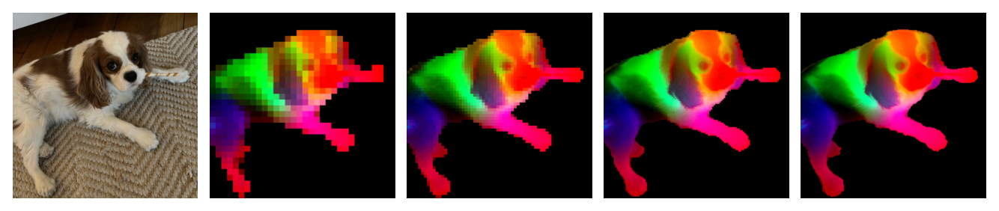

- **中文图注**：最左是原图，右侧 4 张是**同一张图、输入分辨率逐张提高**时，把特征空间前三个 PCA 主成分映射成 RGB 的稠密特征图（论文用背景相减把 PCA 聚焦到主体上）。论文原文：随分辨率提高，DINOv3 给出的特征图越来越清晰、且语义保持有意义（来源：`sources/figs/INDEX.md` Figure 4 图注 / 论文 Fig.4）。
- **看这张图要看出什么**：这正是本章「为什么值得上高分辨率」的一页式证据——**同一套权重、只改输入尺寸**，特征就从粗糙变得锐利。它也是「改分辨率只需改预处理、模型不用动」这条结论的视觉旁证。跑 §6.6 的 PCA 代码时，把输入从 256 换到 1024，你会看到同样的变化。

## 7.2 RoPE 为什么能自动适配（直觉版）

> 想象你给每个 patch 发一个「坐标身份证」。
> - **可学习位置编码**（DINOv2 的做法）：训练时就把「第几行第几列该长什么样」的身份证号码背下来了，号码表是固定长度。图片变大、格子变多，号码不够用 → 必须插值（interpolate）。
> - **RoPE**（DINOv3 的做法）：身份证号码是**当场按坐标算出来的**（用 sin/cos 的公式），而且坐标被**归一化到 [-1, 1]**。图片变大 → 格子变多，但坐标始终铺满 [-1, 1] 这个框 → **永远够用，不用插值**。

**关键技术细节（来自源码 `dinov3_layers_rope_position_encoding.py`）**：

- 坐标是把 patch 网格归一化到 `[-1, 1]`：`coords = 2 * (arange(0.5, N) / N) - 1`（**轴向 axial**：H 和 W 分别归一化，互不耦合）。
- 唯一张量 `periods`（频率表）是**固定 buffer，没有任何可学习参数**。
- 官方所有 checkpoint 都用：`pos_embed_rope_base=100`、`normalize_coords="separate"`、`rescale_coords=2`、`dtype="fp32"`。

**DINOv3 的额外增强「RoPE-box jittering」**（论文 §3.2）：训练时把坐标框 `[-1, 1]` **随机缩放到 `[-s, s]`，`s ∈ [0.5, 2]`**，以提升模型对**分辨率、尺度、长宽比**的鲁棒性。源码对应的就是 `rescale_coords=2`（乘数 log-uniform 落在 `[1/2, 2]`）。

## 7.3 从哪个分辨率开始质量下降

**官方给的证据（论文 Fig.17，PCA 可视化稳定性实验）**：

| 模型 | 测试区间 | 稳定性结论 |
|---|---|---|
| ViT-S+ | 896×512 → 3584×2048 | **保持稳定** |
| ViT-L | 测试到 7168×4096 | 在**最大分辨率 7168×4096 才开始漂移** |
| ViT-H+ | 整个测试范围 | **全程稳定** |

论文正文还说：高分辨率适配后的模型**支持远超最大训练分辨率 768** 的输入，作者**观察到 4k 以上特征图仍然稳定**（「above 4k」，§5.1；注意这是视觉观察，不是量化指标）。

**实用建议（怎么选分辨率）**：

| 目标 | 建议分辨率 | 理由 |
|---|---|---|
| 只要分类 / 检索 | 224–256 | 与训练主分辨率同档，够快 |
| 分割 / 深度 | 512–1024 | 官方示例：分割 896、深度 1024 |
| 需要精细边界 | 1024–2048 | 更高分辨率 → 更细特征，但 GFLOPs 平方级增长 |
| 极大分辨率（>4k） | 谨慎 | ViT-L 在 ~7k 才开始漂移；注意显存 |

**代价提醒**：GFLOPs 随分辨率**平方**增长——ViT-7B 在 256 时是 3550 GFLOPs，到 512 时是 14515（约 4 倍，来源 Fig.16a）。分辨率翻倍，算力和显存开销大致翻两番。

**图 7-2：换分辨率后特征会不会「乱」？——跨模型 × 跨分辨率的稳定性网格**（论文 Figure 17；图片路径 `sources/figs/fig17_p31.png`）

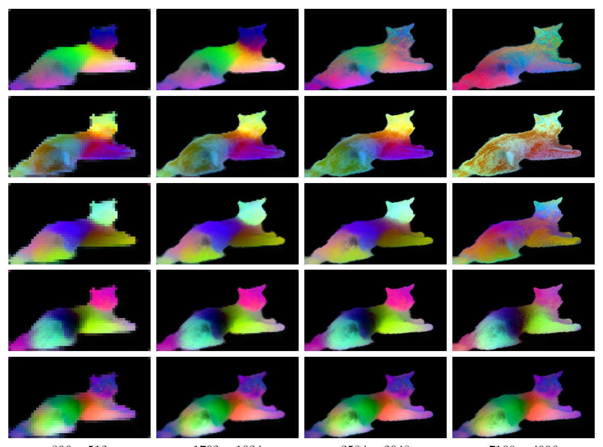

- **中文图注**：5 行 × 4 列，每格是一只猫的 PCA→RGB 特征图。**5 行自上而下是 ViT-S、S+、B、L、H+**，4 列对应不同分辨率。论文原文：对一张 1792×1024 图像（**112×64 个 image token**）做 PCA，取第 5–7 主成分映射为 RGB；**同一行跨分辨率着色保持一致**（来源：`sources/figs/INDEX.md` Figure 17 图注 / 论文 Fig.17）。
- **看这张图要看出什么**：**同一行从左到右，颜色图案基本不变**——这就是「RoPE 换分辨率免插值、特征不漂移」的直接视觉证据（§7.1/§7.2 的结论）。同时能看到**越往下的行（模型越大）特征越锐利**，与 §1.5 的「越大越强」一致。
- **裁切提示**：本图**左缘的行标签（ViT-S/S+/B/L/H+）不可见**（被左缘切掉）；**底部 4 个列标签**（896×512、1792×1024、3584×2048、7168×4096）**被下缘咬掉一部分，仅上半截可辨**（裁图目视核对）。**引用时请按本图注补出行列含义**，不要照残缺图猜。

## 7.4 训练侧的高分辨率适配（了解即可）

官方为 ViT-7B 专门加了一个**高分辨率适配阶段**（论文 §5.1，10k iterations），做法是**成对采样不同尺寸的 crop**：

- global crop 从 **{512, 768}** 抽；local crop 从 **{112, 168, 224, 336}** 抽。
- 配置里的精确值：`global_crops_size: [512,768,768,768,768]`、`local_crops_size: [112,112,168,224,336]`、`gram_teacher_crops_size: [768,1152,1152,1152,1152]`。
- **该阶段必须叠加 Gram anchoring**，论文说「without it, the model performance on dense prediction tasks degrades significantly」（去掉它，dense 任务性能会显著退化）。

> 作为使用者，你**不需要**自己重做这一步——官方发布的权重已经过这个阶段。知道有它，是为了理解「为什么 DINOv3 大图也不崩」。

**图 7-3：高分辨率适配（Post-HR）让各分辨率全面变好**（论文 Figure 11；图片路径 `sources/figs/fig11_p15.png`）

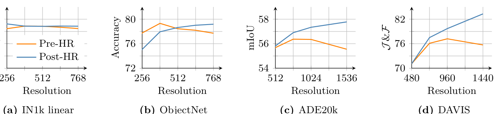

- **中文图注**：四张曲线图，每张都含 **Pre-HR（适配前，橙）** 与 **Post-HR（适配后，蓝）** 两组，横轴均为评测分辨率：(a) ImageNet 线性分类、(b) ObjectNet（OOD）、(c) ADE20k 语义分割、(d) DAVIS 分割跟踪（来源：`sources/figs/INDEX.md` Figure 11 图注 / 论文 Fig.11）。
- **看这张图要看出什么**：**在高分辨率区间（512 及以上），蓝色曲线普遍高于橙色**——这就是 §7.4 那个「高分辨率适配阶段」值不值得做的答案：做了它，模型在大图上的 dense 表现明显更好，而且**分类不掉**。你手上的官方权重已经含这一步，不必重训。

## 7.5 HF 路线的预处理与输出形态（补全 §3.5 没讲清的部分）

§3.5 只用了一行 `processor(images=image, ...)`。HF 这条路线的**默认行为、`config` 里的两个开关、以及输出形状**，都值得单独讲清——因为它们是「为什么我的 token 数和别人不一样」的常见原因。

### 7.5.1 `processor` 的默认预处理（来自 HF 官方文档）

| 参数 | 默认值 | 含义 |
|---|---|---|
| `do_resize` | `True` | 会缩放 |
| `size` | `{"height": 224, "width": 224}` | **默认缩放到 224×224** |
| `default_to_square` | `True` | 当 `size` 给的是**一个 int** 时，默认把它当成**正方形**边长 |
| `resample` | `Resampling.BILINEAR` | 缩放插值方式（双线性） |
| `do_rescale` / `rescale_factor` | `True` / `1/255` | 把 `[0,255]` 压到 `[0,1]`（对应仓库里的 `ToDtype(scale=True)`） |
| `do_normalize` / `image_mean` / `image_std` | `True` / `[0.485,0.456,0.406]` / `[0.229,0.224,0.225]` | 与仓库的 LVD 归一化**一致** |
| `do_pad` / `pad_size` | 未设 / `None` | 需要时**补边**（不缩放），用法见 §5.7.3 |
| `do_center_crop` / `crop_size` | 未设 | 需要时才用 |

> **结论**：**HF 的默认就是「缩放到 224×224 + ImageNet 归一化」**，和仓库路线里 `make_transform(256)` 的区别只是**默认尺寸不同（224 vs 256）**，以及**缩放策略由 `size` 的写法决定**。
> **`size` 默认值的确切出处**：HF 文档在 `DINOv3ViTImageProcessor` 的 `size` 参数条目里写的是 `defaults to {'height' -- 224, 'width': 224}`（`sources/hf_transformers_dinov3.txt` 第 176 行；HTML 原文 `{&apos;height&apos; -- 224, &apos;width&apos;: 224}`，其中的 `--` 是文档排版把 `:` 渲染坏了的产物），即默认就是高 224、宽 224。文档另给 `do_resize=True`、`default_to_square=True`（第 175、177 行）。所以表格里的 224×224 **是文档写明的默认值，不是从示例张量反推的**。
> **怎么控制 resize 策略**：`size=512`（int，配合 `default_to_square=True` → 方形 512）、`size={"height":H,"width":W}`（**精确缩放到 H×W**）、`size={"shortest_edge": 512}`（**短边缩放、保持长宽比**，具体是否被本 processor 支持以实际返回为准）。
> ⚠️ 注意：**卫星权重（SAT-493M）要用另一套 mean/std**（第 5.2 节），HF 的默认是网页版常量；拿 SAT 权重时请显式传 `image_mean` / `image_std`。

### 7.5.2 `config.image_size` 与 `config.reshape_hidden_states`

| 配置项 | 默认（HF config） | 作用 |
|---|---|---|
| `image_size` | `224` | 模型的「名义输入尺寸」。**RoPE 下它不决定你能喂多大**（第 7.1 节），但要和你在预处理里用的尺寸保持一致，否则某些下游/`reshape` 逻辑会对不上 |
| `reshape_hidden_states` | `True` | 作为 **backbone** 使用时，是否把 patch 输出直接 reshape 成特征图（影响 backbone 类输出的是「序列」还是「H×W 图」） |
| `apply_layernorm` | `True` | 作为 backbone 时是否对特征图做 LayerNorm |

### 7.5.3 输出形态对照（**ViT 与 ConvNeXt 是两种形态**）

```python
import torch
from transformers import AutoImageProcessor, AutoModel
from transformers.image_utils import load_image

image = load_image("http://images.cocodataset.org/val2017/000000039769.jpg")   # 480×640

for name in ["facebook/dinov3-vits16-pretrain-lvd1689m",
             "facebook/dinov3-convnext-tiny-pretrain-lvd1689m"]:
    processor = AutoImageProcessor.from_pretrained(name)
    model = AutoModel.from_pretrained(name, device_map="auto")
    inputs = processor(images=image, return_tensors="pt").to(model.device)
    with torch.inference_mode():
        out = model(**inputs)
    print("=" * 60)
    print(name)
    print("  pixel_values      :", tuple(inputs.pixel_values.shape))
    print("  输出类型          :", type(out).__name__)
    print("  last_hidden_state :", tuple(out.last_hidden_state.shape))
    print("  pooler_output     :", tuple(out.pooler_output.shape))
```

**预期输出（对照用）**：

```
facebook/dinov3-vits16-pretrain-lvd1689m
  pixel_values      : (1, 3, 224, 224)          ← 默认缩放到 224
  输出类型          : BaseModelOutputWithPooling
  last_hidden_state : (1, 201, 384)             ← 1 + 4 + 196，序列形态
  pooler_output     : (1, 384)                  ← 整图向量

facebook/dinov3-convnext-tiny-pretrain-lvd1689m
  pixel_values      : (1, 3, 224, 224)
  输出类型          : BaseModelOutputWithPoolingAndNoAttention
  last_hidden_state : (1, 768, 7, 7)            ← [B, C, H', W']，特征图形态！
  pooler_output     : (1, 768)                  ← 空间池化后的整图向量
```

> **C 从哪来**：ConvNeXt 的最后一 stage 维度（源码 `repo/dinov3_models_convnext.py` 的 `convnext_sizes`）——**Tiny 是 768**（`dims=[96,192,384,768]`）、Base 是 1024、Large 是 1536。网格边长 `H' = H/32`（224/32=7），这是 ConvNeXt 的**总下采样倍数**，不是 patch_size=16。

**三条对照结论**：
1. **ViT**：`last_hidden_state` 是**序列** `[B, 1+4+N, C]`，要自己切 CLS/register/patch（第 4.4 节）。
2. **ConvNeXt**：`last_hidden_state` 已经是**4D 特征图** `[B, C, H', W']`（`H'=W'=224/32=7`），`pooler_output` 是池化后的整图向量。**别对它做 `[:, 1+4:, :]` 那种切片**。
3. **改成别的输入尺寸会怎样**：把 `size` 设成 512 → ViT 的 `last_hidden_state` 变成 `[1, 1+4+1024, 384]`；ConvNeXt 变成 `[1, C, 16, 16]`（512/32）。**token 数自己算，别猜**（第 4.4 节）。

> **和 §3.5 的衔接**：§3.5 打印的是 `outputs.pooler_output`——对 ViT 是 CLS，对 ConvNeXt 是空间池化结果，**两者都叫 `pooler_output`，但来源不同**（这一点和第 11.1 节 ConvNeXt 的说明是同一件事）。

### 7.5.4 backbone 类：要做多尺度下游，用它而不是 `AutoModel`

前面用的都是 `AutoModel`（输出「整图的分类式」结果）。HF 文档另外给了两个**backbone 类**，专为「下游要中间的、多尺度的特征」设计：

| 类 | 对应主干 | `forward` 返回 | 关键字段 |
|---|---|---|---|
| **`DINOv3ViTBackbone`** | ViT 系列 | `DINOv3ViTBackboneOutput` | `feature_maps`（每个选中 stage 一个 `[B, C, H', W']` 特征图）、`hidden_states`、`cls_tokens` |
| **`DINOv3ConvNextBackbone`** | ConvNeXt 系列 | `BackboneOutput` | `feature_maps`、`hidden_states` |

（来源：`sources/hf_transformers_dinov3.txt` 的 `DINOv3ViTBackbone` / `DINOv3ConvNextBackbone` 段。）

**要点，逐条**：

- **`feature_maps` 是「一段一段」的特征图**（文档原文：`Feature maps of the stages`），可直接喂给分割 / 检测 / 深度这类需要多尺度特征的下游头——这正是 `AutoModel` 只给「末端序列 / 末端特征图」所缺的。
- **`cls_tokens`**：文档原文「CLS token from each selected feature stage，每个 `[B, hidden_size]`，**仅当 `config.return_class_token=True` 时才有**」——也就是可以**同时**拿到多个 stage 的 CLS。
- **选哪些 stage**：config 签名里给了 `_out_features` / `_out_indices`（值为 `None` 表示用默认），用来指定输出哪几层的 `feature_maps`。
- **两个影响输出形态的开关**（也见 §7.5.2）：`apply_layernorm`（是否对特征图做 LayerNorm）与 `reshape_hidden_states`（是否把 patch 输出 reshape 成特征图）。
- **怎么加载**：文档对这两个类的说明是「Check out the `from_pretrained()` method to load the model weights」，即按 HF 惯例用类方法加载，例如 `DINOv3ViTBackbone.from_pretrained(hub_id)`（`hub_id` 用 §6.10/§6.7 里那些 `facebook/dinov3-*` 的 repo id）。**⚠️ 本节资料未收录文档中是否有 backbone 类的独立调用示例**，示例代码以 HF 文档页为准。

**什么时候用 backbone 类**：① 你要做**多尺度**下游（UPerNet / DPT / Plain-DETR 那类，论文的 LoveDA/iSAID/DIOR 就是用主干的多层特征）；② 你要**自己选层**做探针（对应仓库路线里的 `get_intermediate_layers`，见 §4.5）。只要你只需要一个整图向量，就继续用 `AutoModel` 的 `pooler_output` 即可。

## 本章小结

- **改分辨率 = 只改预处理尺寸**，模型不用动；**绝不传 `img_size=`**。
- RoPE 无学习参数、坐标归一化到 [-1,1]，因此**换分辨率无需插值**（官方论文原话）。
- 稳定性（官方 Fig.17）：ViT-S+ 到 3584×2048 稳；ViT-L 到 ~7k 才漂移；ViT-H+ 全稳。
- 实用：分类 224–256，分割/深度 512–1024，代价随分辨率平方增长。
- **HF 路线**：`processor` 默认缩放到 224×224 + ImageNet 归一化；输出形态 **ViT 是序列、ConvNeXt 是 4D 特征图**（§7.5）。
- **HF 的 backbone 类**（`DINOv3ViTBackbone` / `DINOv3ConvNextBackbone`）给的是**多尺度 `feature_maps` + 各 stage 的 `cls_tokens`**，做 UPerNet/DPT/检测这类下游时用它，而不是 `AutoModel`（§7.5.4）。

---

# 第 8 章 训练与蒸馏

> **这一章解决什么**：看懂官方训练配置、会启动训练、知道多卡怎么配、以及**只有一张卡时到底能做什么**。
> **读完你会得到**：一份配置逐段解读 + 单卡/多卡的现实方案。

## 8.1 先泼一盆冷水：训练的现实门槛

**官方训练规模（来源：README、论文）**：

| 场景 | 规模 | 结果 |
|---|---|---|
| 快速跑通：ViT-L/16 @ ImageNet-1k | **4 个 H100-80GB 节点（32 GPU）**，约 **14 小时** | k-NN 82.0% / linear 83.5% |
| 完整 ViT-7B 预训练 | **32 节点（256 GPU）** | 1M iterations |
| 单模型算力 | H100-SXM5，1,000k steps，**61,440 GPU 小时**，47 MWh，18 tCO2eq | 论文 Tab.20 |

> 结论：**从头预训练 DINOv3（哪怕最小的规格）不是你一张卡能干的事。** 第 8.7 节讲单卡怎么办。

## 8.2 训练配置逐段讲解

以官方**默认 SSL 配置** `dinov3_configs_ssl_default_config.yaml` 为例（这是最完整的模板。该文件 `wc -l` 计数为 **206 行**，其中文末 23 行是**被注释掉的**「常数调度」示例，不生效）。下面按段讲「这段在管什么、为什么这样设」。

### 8.2.0 先建立全局图景：一次训练迭代发生了什么

看字段之前，先把训练循环在脑子里跑一遍。**下面每个配置段，都能在这张图里找到位置**：

```
 一次 iteration
 ─────────────────────────────────────────────────────────────────
 (1) DataLoader 取 1 张图
        │  按 crops 段 切成：2 个 224×224 global + 8 个 96×96 local
        ▼
 (2) teacher（student 的 EMA 副本，无梯度）
        │  只看 2 个 global crop
        ▼
      teacher 输出：每个 global crop 的 CLS 分布 + patch 分布
        │            ↑ 这里的「分布」由 teacher 段 的温度 sharpening 决定
        ▼
 (3) student（有梯度）
        │  global crop 照常前向；local crop 也前向（对齐 teacher 的 global）
        │  iBOT：以 ibot 段的概率，把 global crop 的 patch 挖掉，让 student 去补
        ▼
      student 输出 → 投影头（dino 段 / ibot 段 的头结构）
        ▼
 (4) 算损失（损失段）
        L = L_DINO(CLS) + L_iBOT(patch) + 0.1·L_KoLeo   (+ Gram 阶段再 +w·L_Gram)
        │        ↑ centering=Sinkhorn-Knopp 防塌缩
        ▼
 (5) 反传 + 优化器（optim 段）：AdamW、逐层 LR 衰减、梯度裁剪
        ▼
 (6) 更新 teacher：teacher ← m·teacher + (1−m)·student   （teacher 段的 momentum）
        ▼
 (7) 每 N iter：evaluation 段 跑评测；checkpointing 段 存盘
```

有了这张图，再逐段看字段就只是「填参数」而已。

### 8.2.1 一句话总览：每段各自负责什么

| 配置段 | 一句话职责 | 想改什么时来这里 |
|---|---|---|
| `MODEL` | 基础设施：用哪个训练架构、什么设备、什么精度 | 换 FSDP 策略、换精度 |
| `dino` / `ibot` | **学什么**：两个自监督目标 + 各自的投影头大小 | 换目标、换原型数 |
| `gram` | **修 dense 退化**：Gram anchoring（默认关闭） | Gram 阶段才打开 |
| `train` | 训练循环的开关：batch、进程数、compile、防塌缩算法 | 调吞吐、开编译 |
| `student` | 要训练的主干架构 | 换模型规格 |
| `teacher` | EMA 教师的行为：动量与温度 | 调 teacher「稳不稳」 |
| `optim` | 优化器与调度：LR、WD、裁剪、层衰减 | 调学习率配方 |
| `crops` | 数据增强：多裁剪、翻转、归一化常量 | 改分辨率/增强强度 |
| `evaluation` / `checkpointing` | 什么时候评测、什么时候存盘 | 省磁盘、省时间 |

### 8.2.2 MODEL 段（基础设施）

| 字段 | 值 | 含义 | 为什么这样设 |
|---|---|---|---|
| `META_ARCHITECTURE` | `SSLMetaArch` | 用哪个训练架构（自监督主循环） | 训练入口按这个名字装配整个 SSL 模型 |
| `DEVICE` | `cuda` | 训练设备 | — |
| `DTYPE` | `float32` | 主 dtype | 主计算用 fp32 保稳 |
| `compute_precision.param_dtype` | `bf16` | 参数用 bf16 混合精度 | **省显存、提速**的主要手段 |
| `compute_precision.reduce_dtype` | `fp32` | 梯度规约用 fp32 | 大模型梯度累加用高精度，**保训练稳定** |
| `sharding_strategy` | `SHARD_GRAD_OP` | FSDP 分片策略：只分片梯度与优化器状态 | 参数本身不切，通信更省（第 8.4 节） |

> **一句话**：这一段在回答「这套训练由谁驱动、用什么精度跑」。

### 8.2.3 dino / ibot / 损失段（学习目标：学什么）

**先解释三个名字**，后面看数字才不迷糊：**DINO 目标**管整图（CLS token 级），**iBOT 目标**管局部（patch 级，靠挖洞补全），**KoLeo** 是防止特征挤成一团的辅助正则（第 9 章有直觉解释）。

| 字段 | 值 | 含义 | 为什么这样设 |
|---|---|---|---|
| `dino.loss_weight` | 1.0 | 图像级（CLS）自蒸馏损失权重 | 基线与 iBOT 等权 |
| `dino.head_n_prototypes` | 65536 | DINO 投影头的原型数（ViT-7B 是 262144） | 原型越多，分类粒度越细，但头变大 |
| `dino.head_bottleneck_dim` | 256 | 头瓶颈维（7B 是 512） | 瓶颈压缩，防止头「记住」过多信息 |
| `dino.head_nlayers` | 3 | 头层数 | DINOv2 惯例 |
| `dino.head_hidden_dim` | 2048 | 头隐藏维（7B 是 8192） | 随模型规模放大 |
| `dino.koleo_loss_weight` | 0.1 | KoLeo 正则权重 | 论文 Eq.1 里也是 0.1 |
| `dino.global_ignore_diagonal` | true | 忽略同一张图两个 global crop 的对角项 | 防「自己跟自己比」的平凡解 |
| `ibot.loss_weight` | 1.0 | patch 级（masked image modeling）损失权重 | 与 dino 等权 |
| `ibot.mask_sample_probability` | 0.5 | 50% 概率对 global crop 打码 | 一半样本走掩码路径，一半正常 |
| `ibot.mask_ratio_min_max` | [0.1, 0.5] | mask 比例范围 | 挖掉 10%–50% 的 patch |
| `ibot.separate_head` | true | iBOT 用独立头 | 让 patch 目标有自己的一套原型 |
| `gram.use_loss` | **false** | Gram 损失默认关（Gram 阶段才开） | 只在第 8.5 节的 Gram 阶段打开 |

> **一句话**：这一段在回答「模型靠什么信号学、每个信号多重」。**想复现论文，这里的权重（1.0 / 1.0 / 0.1）不要动。**

### 8.2.4 train 段（训练循环的开关）

| 字段 | 值 | 含义 | 为什么这样设 |
|---|---|---|---|
| `batch_size_per_gpu` | 64 | 每卡 batch | 乘以卡数得到全局 batch |
| `OFFICIAL_EPOCH_LENGTH` | 1250 | 一个「官方 epoch」= 多少 iteration | 用它把「epoch 数」换算成「迭代数」 |
| `num_workers` | 10 | DataLoader 进程数 | 减少数据加载成为瓶颈 |
| `centering` | `sinkhorn_knopp` | 用 Sinkhorn-Knopp 替代 DINO 原 centering | 论文的改动：防塌缩更稳（第 9 章） |
| `compile` | true | 用 torch.compile 加速 | 逐 block 编译 |
| `use_teacher_head` | true | teacher 也用投影头 | teacher 输出的是「分布」，需要头 |

> **一句话**：这一段在回答「跑多快、怎么防塌缩」。

### 8.2.5 student 段（要训练的主干）

| 字段 | 值 | 含义 | 为什么这样设 |
|---|---|---|---|
| `arch` | `vit_large` | 主干规格 | 默认模板配的是 ViT-L |
| `patch_size` | 16 | 块大小 | DINOv3 全部用 16 |
| `drop_path_rate` | 0.3 | stochastic depth 比例（7B 是 0.4） | 大模型更依赖随机深度防过拟合 |
| `layerscale` | 1.0e-05 | LayerScale 初值 | 训练稳定性关键（见下方警示） |
| `ffn_layer` / `ffn_ratio` | `mlp` / 4.0 | FFN 类型与比例（7B 用 swiglu64 / 3） | 小模型用普通 MLP 就够 |
| `qkv_bias` | true | 注意力 QKV 带 bias（7B 是 false） | 7B 关掉以省参数 |
| `norm_layer` | `layernorm` | 归一化层类型（7B 用 layernormbf16） | 7B 在 bf16 下用专用 norm |
| `n_storage_tokens` | 0 | register 数（7B 是 4） | **小模型默认 0；发布权重是 4** |
| `pos_embed_type` | `rope` | 位置编码用 RoPE | 换分辨率免插值（第 7 章） |
| `pos_embed_rope_base` | 100.0 | RoPE 频率基数 | 全部 checkpoint 都是 100 |
| `fp8_enabled` | False | 是否用 FP8（7B 是 true） | 只在支持的硬件上开 |

> **避坑框（三条最容易改错的）**
> 1. `layerscale: 1.0e-05` 是**训练时**的初值；**发布权重里也是 1e-5**，但 **HF `DINOv3ViTConfig` 的默认是 1.0**——以仓库/权重为准（第 11.4 节）。
> 2. `n_storage_tokens: 0` 是**这个模板**的值；**官方发布的对比表里所有模型都是 4**（第 4.3 节）。
> 3. `pos_embed_type: rope` 改回可学习位置编码会破坏「换分辨率免插值」这一整条能力（第 7 章）。

> **一句话**：这一段在回答「训练哪个模型、它长什么样」。

### 8.2.6 teacher 段（EMA 教师）

| 字段 | 值 | 含义 | 为什么这样设 |
|---|---|---|---|
| `momentum_teacher` | 0.992 | EMA 动量（越大 teacher 越「稳」） | 接近 1 使 teacher 变化慢、目标更可靠 |
| `warmup_teacher_temp` / `teacher_temp` | 0.04 / 0.07 | teacher 温度 | 先低温再升温，避免早期太尖锐 |
| `warmup_teacher_temp_epochs` | 30 | 温度 warmup 长度 | 给小模型较长预热 |

> **一句话**：这一段在回答「teacher 有多稳、输出有多尖锐」。

### 8.2.7 optim 段（优化器与调度）

| 字段 | 值 | 含义 | 为什么这样设 |
|---|---|---|---|
| `epochs` | 100 | 训练轮数 | 乘以 `OFFICIAL_EPOCH_LENGTH` 得到总迭代 |
| `optimizer` | `adamw` | 优化器 | 训练入口按名字装配 |
| `weight_decay` / `weight_decay_end` | 0.04 → 0.4 | 权重衰减（warmup 到终点） | 小模型用**余弦式** WD 变化 |
| `lr` / `warmup_epochs` / `min_lr` | 0.001 / 10 / 1e-6 | 学习率、warmup、最小值 | 小模型用**余弦**配方 |
| `clip_grad` | 3.0 | 梯度裁剪（7B 是 30.0） | 大模型容忍更大梯度 |
| `freeze_last_layer_epochs` | 1 | 前 N epoch 冻结最后一层 | 早期保护投影头 |
| `scaling_rule` | `sqrt_wrt_1024` | LR 随 batch/GPU 数的缩放规则 | 换卡数时不用手动重调 LR |
| `layerwise_decay` | 0.9 | 逐层 LR 衰减率（7B 是 0.98） | 越靠底层 LR 越小 |
| `patch_embed_lr_mult` | 0.2 | patch embedding 的 LR 倍率 | patch 嵌入单独降 LR |

> **重点**：**默认模板（小模型）用的是传统的 cosine 配方**（lr 1e-3→1e-6、wd 0.04→0.4）；**论文里的 ViT-7B 反而「去掉调度」全用常数**（第 8.5 节）。两套配方不要混。

### 8.2.8 crops 段（多裁剪数据增强）

| 字段 | 值 | 含义 | 为什么这样设 |
|---|---|---|---|
| `global_crops_scale` | [0.32, 1.0] | global crop 的随机裁剪面积占比 | 大视野看整体 |
| `local_crops_number` | 8 | local crop 数量 | 强制模型关注局部细节 |
| `local_crops_scale` | [0.05, 0.32] | local crop 面积占比 | 小视野看细节 |
| `global_crops_size` / `local_crops_size` | 224 / 96 | 尺寸 | 模板值；7B 用 256/112 |
| `horizontal_flips` | true | 随机水平翻转 | 基础增强 |
| `rgb_mean` / `rgb_std` | ImageNet 值 | 归一化常量 | **和推理时必须是同一套**（第 5 章） |

> 这一段就是「多裁剪」（multi-crop）：**2 个大的 global crop + 8 个小的 local crop**，让模型同时学到「整体」和「局部细节」。论文里 ViT-7B 用的是 **2 个 256×256 + 8 个 112×112**。
> **⚠️ 高分辨率适配阶段另有一套 crop 尺寸**：`global_crops_size: [512,768,768,768,768]`、`local_crops_size: [112,112,168,224,336]`、`gram_teacher_crops_size: [768,1152,1152,1152,1152]`（第 7.4 节）。

### 8.2.9 evaluation / checkpointing 段

| 字段 | 值 | 含义 | 为什么这样设 |
|---|---|---|---|
| `eval_period_iterations` | 12500 | 每多少 iter 评测一次 | 与 README「每 12500 iter 存 teacher 权重用于评测」对应 |
| `checkpointing.period` | 3750 | 每多少 iter 存一次 | 比评测更密，防止白训 |
| `max_to_keep` | 3 | 最多保留几个 checkpoint | 控制磁盘占用 |

> **一句话**：这一段在回答「训练过程中什么时候停下来看看、什么时候存档」。

## 8.3 启动命令（官方 README 原文）

### 快速跑通：ViT-L/16 @ ImageNet-1k（4 节点）

```shell
PYTHONPATH=${PWD} python -m dinov3.run.submit dinov3/train/train.py \
  --nodes 4 \
  --config-file dinov3/configs/train/vitl_im1k_lin834.yaml \
  --output-dir <PATH/TO/OUTPUT/DIR> \
  train.dataset_path=ImageNet22k:root=<PATH/TO/DATASET>:extra=<PATH/TO/DATASET>
```

### ViT-7B 三阶段（32 节点）

```shell
# 阶段 1：Pretraining
PYTHONPATH=${PWD} python -m dinov3.run.submit dinov3/train/train.py \
  --nodes 32 \
  --config-file dinov3/configs/train/dinov3_vit7b16_pretrain.yaml \
  --output-dir <PATH/TO/OUTPUT/DIR> \
  train.dataset_path=<DATASET>:root=<PATH/TO/DATASET>:extra=<PATH/TO/DATASET>

# 阶段 2：Gram anchoring（需要上一阶段的 teacher）
PYTHONPATH=${PWD} python -m dinov3.run.submit dinov3/train/train.py \
  --nodes 32 \
  --config-file dinov3/configs/train/dinov3_vit7b16_gram_anchor.yaml \
  --output-dir <PATH/TO/OUTPUT/DIR> \
  train.dataset_path=<DATASET>:root=<PATH/TO/DATASET>:extra=<PATH/TO/DATASET> \
  gram.ckpt=<PATH/TO/GRAM_TEACHER_FROM_PREVIOUS_STEP>

# 阶段 3：High-resolution adaptation（需要 gram teacher）
PYTHONPATH=${PWD} python -m dinov3.run.submit dinov3/train/train.py \
  --nodes 32 \
  --config-file dinov3/configs/train/dinov3_vit7b16_high_res_adapt.yaml \
  --output-dir <PATH/TO/OUTPUT/DIR> \
  train.dataset_path=<DATASET>:root=<PATH/TO/DATASET>:extra=<PATH/TO/DATASET> \
  gram.ckpt=<PATH/TO/TEACHER_FROM_GRAM> \
  student.resume_from_teacher_chkpt=<PATH/TO/TEACHER_FROM_GRAM>
```

### 多教师蒸馏

```shell
PYTHONPATH=${PWD} python -m dinov3.run.submit dinov3/train/train.py \
  --nodes 1 \
  --config-file dinov3/configs/train/multi_distillation_test.yaml \
  --output-dir <PATH/TO/OUTPUT/DIR> \
  --multi-distillation \
  train.dataset_path=<DATASET>:root=<PATH/TO/DATASET>:extra=<PATH/TO/DATASET>
```

**图 8-1：一个 7B 教师怎么同时蒸馏出多个学生——多学生蒸馏流程**（论文 Figure 12；图片路径 `sources/figs/fig12_p16.png`）

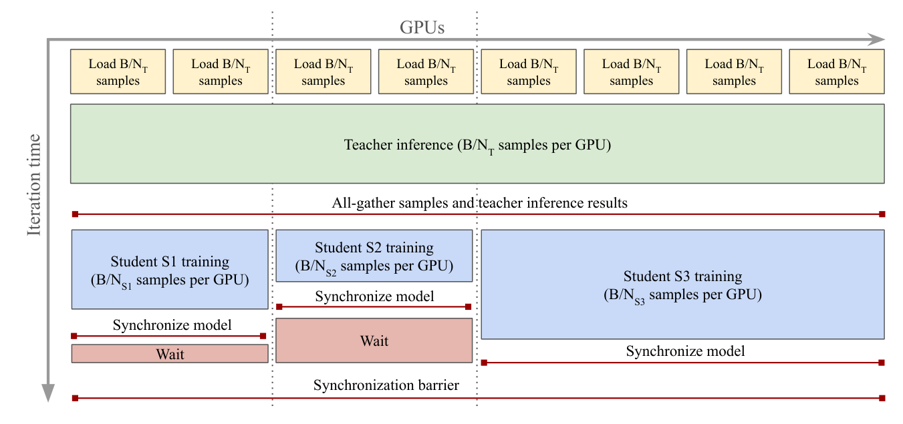

- **中文图注**：横轴是 GPU、纵轴是迭代时间。上方「Load B/N_T samples」与「Teacher inference」**横跨所有 GPU**（教师推理只在全集群上做一次并共享），中间是「All-gather samples and teacher inference results」「Synchronize model」「Synchronization barrier」；下方并行训练学生 **S1/S2/S3**，并有「Wait」区间。论文说明：**调整各学生小组规模，使它们的单步耗时一致**，以减少同步屏障处的空等（来源：`sources/figs/INDEX.md` Figure 12 图注 / 论文 Fig.12）。
- **看这张图要看出什么**：**教师推理是「共享一次」的成本，不是每个学生各跑一遍**——这是「1 个 7B → 9 个学生（5 ViT + 4 ConvNeXt）」在工程上可行的关键。图中那些「Wait」就是在告诉你：多学生并训的瓶颈是**同步**，所以要凑齐各学生的耗时。
- **裁切提示**：箭头、标签完整，可直接引用。

**关于命令行参数（重要）**：

- `--config-file <PATH>`：指定 YAML 配置；`--output-dir <PATH>`：输出目录（默认 `./local_dino`）。
- **末尾的 `PATH.KEY VALUE` 空格对**是**覆盖配置**用的（官方帮助文本：`Modify config options at the end of the command... use space-separated "PATH.KEY VALUE" pairs`）。比如 `train.dataset_path=...`、`gram.ckpt=...`。
- **`--nodes` 不是 `train.py` 的参数**：`train.py` 的 argparse 里**没有** `--nodes`（它只有 `--config-file` / `--no-resume` / `--eval-only` / `--output-dir` / `--seed` / `--multi-distillation` 等）。README 命令里的 `--nodes` 是传给 **`dinov3.run.submit`（submitit 包装器）** 的。该包装器源码**不在本资料集内**，所以「`--nodes` 具体如何被消费」**官方资料未给出**。
- 官方也说明：**不用 `dinov3.run.submit` 时，可以直接用 `python` 或 `torchrun`**。但 `torchrun` 需要的环境变量（`RANK`/`WORLD_SIZE`/`MASTER_ADDR` 等）在本资料集里**没有出现**，实现走 `dinov3.distributed` 模块（源码不在资料集内），因此**具体环境变量清单：官方资料未给出**。

## 8.4 多卡：FSDP 与显存优化

**官方并行方案（来源：`sources/repo/dinov3_fsdp_ac_compile_parallelize.py`、`sources/repo/MODEL_CARD.md`）**：

| 技术 | 做法 |
|---|---|
| **FSDP2** | PyTorch FSDP2（`torch.distributed._composable.fsdp.fully_shard` + `MixedPrecisionPolicy`），分片策略 `SHARD_GRAD_OP` |
| 包装顺序 | ① blocks 上做 activation checkpointing → ② compile blocks → ③ FSDP 分片 |
| 混合精度 | `param_dtype=bf16`，`reduce_dtype=fp32` |
| 逐 block 分片 | Transformer 逐 block `fully_shard`，并设前向/反向 prefetch |
| Activation checkpointing | `train.checkpointing=true`（选择性）或 `checkpointing_full=true`（全量，更省显存更慢） |
| torch.compile | 逐 block `module.compile()`；`cudagraphs=true` 时用 `fullgraph=True` + triton cudagraphs |
| FP8 | `student.fp8_enabled=true` + `fp8_filter: "blocks"`，把 Linear 转 FP8（提速） |
| 混合精度训练栈 | 官方模型卡：「PyTorch FSDP2 (with bf16 and fp8 matrix multiplications)」，软件 PyTorch 2.7 |

**显存优化技巧（从省显存角度排序）**：

1. **开 activation checkpointing**：`train.checkpointing: true`（选择性保存，官方配置默认就有 `checkpointing_full` 选项）。
2. **降 batch / 降分辨率**：注意开销随分辨率平方增长。
3. **用 bf16**：`compute_precision.param_dtype: bf16`。
4. **多卡 FSDP**：把参数/梯度/优化器状态切到多张卡。
5. **FP8**（如果硬件支持）：`fp8_enabled: true`。
6. **`cache_dataset: true`**（7B 配置开了，减少数据加载开销）。

> 训练循环里还有一层保护（源码 `dinov3_train_train.py`）：每步把 loss all-gather，**若连续 >2 次出现 NaN 就抛 `RuntimeError` 中止训练**；每步对所有子模块做 `clip_grad_norm_`（7B = 30.0）。

## 8.5 关键训练超参（ViT-7B 预训练，供对照）

| 项 | 值 | 来源 |
|---|---|---|
| 迭代数 | 1M（`epochs 1000` × `OFFICIAL_EPOCH_LENGTH 1000`） | 配置 |
| 全局 batch | 4096（16/卡 × 256 GPU） | 论文 §3.2 |
| LR | **constant 4.0e-4**（论文 §3.2 / App.C）；配置文件里写的是 `schedules.lr.peaking = 5.0e-05`，经 `optim.scaling_rule: sqrt_wrt_1024` 按 batch 缩放后生效（**缩放的具体倍率官方资料未逐步给出**） | 论文 App.C + 配置 |
| LR warmup | 100 epoch | 配置 |
| Weight decay | 0.04（常数） | 配置 |
| Teacher EMA momentum | **0.994**（阶段 1 预训练配置 `dinov3_vit7b16_pretrain.yaml` 的 `schedules.momentum`）；**0.999**（阶段 2/3 的 Gram / 高分辨率配置，论文 App.C 亦为 0.999）——**按阶段取值，不是互相矛盾** | 配置文件 + 论文 App.C |
| Teacher temp | 0.04 → 0.07 | 配置 |
| Drop path | 0.4 | 配置 |
| Layer-wise LR decay | 0.98 | 配置 |
| 分辨率 | 2×256 global + 8×112 local；序列长 3.7M tokens/batch | 论文 §3.2 |
| 损失 | L_DINO + L_iBOT + 0.1·L_Koleo（+ Gram 阶段） | 论文 Eq.1 |

> **DINOv3 的大模型训练哲学**（论文 §3.2）：**去掉所有参数调度**——LR、weight decay、teacher EMA momentum 全用**常数**，只保留 LR 与 teacher temperature 的线性 warmup。这样「只要指标还在涨就能一直训」，且超参更少更好选。
> 注意：默认 SSL 配置（小模型）仍是传统的 cosine 配方（lr 1e-3→1e-6、wd 0.04→0.4）。

## 8.6 数据准备（ImageNet-1k）

**目录结构**（README 原文）：

```
<ROOT>/test/ILSVRC2012_test_00000001.JPEG
<ROOT>/train/n01440764/n01440764_10026.JPEG
<ROOT>/val/n01440764/ILSVRC2012_val_00000293.JPEG
<ROOT>/labels.txt
```

还要在 `<EXTRA>` 目录生成元数据（`class-ids-TRAIN.npy` 等），一次生成即可：

```python
from dinov3.data.datasets import ImageNet

for split in ImageNet.Split:
    dataset = ImageNet(split=split, root="<ROOT>", extra="<EXTRA>")
    dataset.dump_extra()
```

**ImageNet-22k**：官方说「自行修改 `dinov3/data/datasets/image_net_22k.py` 适配本地结构」。
**所有训练/评估命令都要加 `PYTHONPATH=.`**（README 明确 warning）。

## 8.7 如果你只有一张卡，该怎么玩

**直接回答**：**别想着从头预训练 DINOv3**（官方最小规模都要 4 节点 32 卡）。单卡的正确玩法是：

| 玩法 | 可行性 | 怎么做 |
|---|---|---|
| **用官方权重，冻结特征 + 线性探针** | ★★★★★ 强烈推荐 | 官方推荐用法；单卡甚至 CPU 都能跑（小模型）。见第 6 章 |
| **在小模型上做下游微调** | ★★★★ 可行 | 直接对 ViT-S/B 解冻微调，但官方说微调会放大偏见，作为最后手段 |
| **7B 用 int4 量化推理** | ★★★ 可行（显存够） | HF + torchao，见第 2.5 节 |
| **小规模自监督预训练（改小配置）** | ★★ 不推荐 | 官方配置都是 256 卡级别；单卡改小到 batch=1、分辨率 224 也许能「跑起来」，但**结果无意义**（训练量差几个数量级） |
| **完整复现 ViT-7B** | ✗ 不可能 | 官方 32 节点 / 256 GPU / 61,440 GPU 小时 |

**单卡自监督训练的「最小可玩」思路**（非官方，需自行验证）：用 `dinov3/configs/train/multi_distillation_test.yaml` 这类小配置做参考，把 `batch_size_per_gpu` 调到 1–4、关掉 FSDP、用 `python dinov3/train/train.py --config-file ...` 直接跑。但请注意：**官方资料没有给出单卡训练配方**，这属于自行探索。

## 本章小结

- **从头预训练门槛极高**：官方最小 4 节点 32 GPU（14h）到 32 节点 256 GPU（ViT-7B）。
- 配置分段看：MODEL（基建）→ 损失段 → train → student → teacher → optim → crops → eval/ckpt。
- **命令行末尾 `PATH.KEY VALUE` 是覆盖配置**；`--nodes` 归 submitit 包装器（源码不在资料集内）。
- 多卡：**FSDP2 + bf16 + activation checkpointing + torch.compile (+ FP8)**。
- **单卡正解 = 冻结特征 + 线性探针**（或小模型下游微调 / 7B int4 推理）。

---

# 第 9 章 原理速通（选读）

> **这一章解决什么**：用大白话讲清 DINOv3 的四个核心技术，**不求数学严格，求直觉正确**。
> **读完你会得到**：能跟人解释「它为什么强」，以及看懂论文里的名词。

> ⚠️ 本章为选读。只想用模型的话，跳过也不影响使用。

## 9.1 DINO 自监督目标：teacher-student 互相「猜」

**一句话**：同一张图，喂给两个网络（student 和 teacher），**让 student 去预测 teacher 的输出**，但两边都不要塌缩成一样。

**认知**：这里的「预测」不是预测标签，而是预测 teacher 输出的**概率分布**。
- student 看到图的**一个视角**（比如一个随机裁剪），teacher 看到**另一个视角**（可能被扰动过）。
- 因为两个视角是同一张图，student 应该能「猜出」teacher 的看法——这就是学习信号。
- **为什么要 teacher**？如果 student 自己猜自己，很容易塌缩（所有图输出同一个向量）。teacher 用**动量更新**（EMA，指数滑动平均）——teacher 的权重是 student 权重的滑动平均，比 student 更「慢、更稳」，因此能提供更可靠的目标。

**teacher 权重怎么更新**（源码 `train_ssl_meta_arch.py`）：

```
teacher= m·teacher + (1−m)·student
```

`m` 就是 `momentum_teacher`（预训练配置 0.994，接近 1 → teacher 变化很慢）。

**防止塌缩的三件套（DINO 系列的经典手法）**：
- **centering**：让 teacher 输出在 batch 上「中心化」，避免某几维一直被选择。DINOv3 换成了 **Sinkhorn-Knopp** 算法。
- **sharpening**：用 temperature 让分布变尖锐。
- **KoLeo 正则**（见下）。

## 9.2 teacher-student 与 EMA

**先用一张图把「一次迭代里两个网络各自看什么」画出来**（对照第 8.2.0 节的配置流程）：

```
                    同一张图
                        │
        ┌───────────────┴───────────────┐
        │ 切 crop（多裁剪）               │
        ▼                               ▼
  ┌──────────────┐               ┌──────────────┐
  │   TEACHER    │               │   STUDENT    │
  │  EMA 副本     │               │  被训练       │
  │  无梯度       │               │  有梯度       │
  │  只看 global  │               │  global+local │
  └──────┬───────┘               └──────┬───────┘
         │ 输出「概率分布」               │ 输出「概率分布」
         │ （温度 sharpening）           │ （投影头）
         └──────────► 对齐 ◄────────────┘
                       │
                  L_DINO（整图）+ L_iBOT（挖洞补全）
                       │
                       ▼
                  反传更新 STUDENT
                       │
                       ▼
     teacher ← m·teacher + (1−m)·student     （m = 0.994，越接近 1 越"稳"）
```

- **student**：被训练的模型（有梯度）。
- **teacher**：student 的 EMA 副本（无梯度）。训练初期 teacher 由 student 初始化。
- **为什么 DINOv3 要「去掉调度」**：论文说，用 cosine 调度意味着你得**事先知道训练要多久**（horizon），而大数据集上很难先验判断。所以改成**常数的 LR / WD / momentum**，只留 LR 和 teacher 温度的短暂 warmup。好处是「能一直训下去」。

## 9.3 iBOT：patch 级的掩码建模

**一句话**：把 student 看到的图**挖掉一些 patch**，让 student 从剩下的部分**猜出被挖掉位置的 teacher 输出**。

**类比**：就像做完形填空——遮住句子里几个词，让你根据上下文补出来。逼模型理解**局部结构**，所以 iBOT 是 dense 任务的功臣。

**配置里对应**：`ibot.mask_sample_probability: 0.5`（50% 概率打码）、`mask_ratio_min_max: [0.1, 0.5]`（挖掉 10%–50% 的 patch）。DINOv3 的 iBOT 用**独立的投影头**（`separate_head: true`）。

## 9.4 KoLeo：让特征别挤在一起

**一句话**：给特征加一个「**均匀分布**」的推力，避免所有图片的向量都堆在一个角落（那会让检索变差）。

**类比**：一个班的学生如果全挤在教室一个角落，你分不清谁是谁；KoLeo 就是让大家尽量散开，保持彼此可区分。

**细节（逐条标注出处）**：

- **作用对象是 class token**，而且论文 App.C 明确写的是「**student 看到的第一个 global crop 的 16 个 class token**」（原文：`16 class tokens of the first global crop seen by the [student]`）。**不要再写成「pre-head CLS token」**——「pre-head」这个限定语在论文与源码里都查不到，属无出处的加戏。
- **权重 0.1**：默认 SSL 配置 `dino.koleo_loss_weight: 0.1`（`repo/dinov3_configs_ssl_default_config.yaml`），论文 Eq.1 的损失组合里也是 `0.1·L_Koleo`。
- **分布式实现**：论文 §3.2 说明 KoLeo 用了一个**分布式版本**，把邻居搜索**跨 GPU** 进行（避免只看单卡小批次）。配置里对应 `dino.koleo_loss_distributed`、`koleo_distributed_loss_group_size`、`koleo_topk` 等开关（默认 `koleo_loss_distributed: false`、`koleo_topk: 1`）。
- **只作用于 global crop**，local crop 不参与（论文 §3.2）。

## 9.5 Gram anchoring：DINOv3 的核心创新

**先讲它解决的病**：

> 长训练会让**全局指标一直涨，但 dense 指标反而掉**。论文发现：训练到约 **200k iterations** 后，分割性能开始下降，ViT-7B 甚至跌破早期水平。
> 原因不是「高范数离群点」（register 已经解决了那个），而是 **patch 特征之间的相似度结构被破坏**——本来「红色 patch 附近只有它自己很像」，后来「到处都是一堆无关 patch 和它很像」，局部定位能力丧失。

**图 9-1：退化到底是什么样——分类曲线一直涨，分割曲线先涨后跌**（论文 Figure 5；图片路径 `sources/figs/fig5_p10.png`）

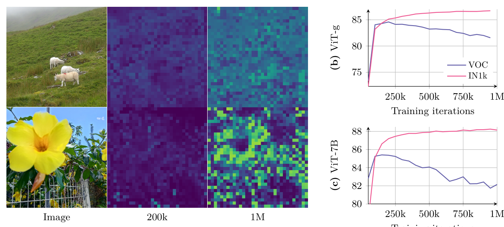

- **中文图注**：左 (a) 是两行（羊群、黄花）原图与在 200k、1M 迭代时的余弦相似度图；右 (b) ViT-g、(c) ViT-7B 两条曲线，横轴训练迭代（到 1M），图例 **VOC（分割，稠密）** 与 **IN1k（分类）**。论文原文：**分类指标 IN1k 持续上升，而稠密指标 VOC 分割先升后降，两条曲线明显背离**，分割峰值出现在相似度尚低时（来源：`sources/figs/INDEX.md` Figure 5 图注 / 论文 Fig.5）。
- **看这张图要看出什么**：**「训练越久越好」对整图分类成立，对稠密任务不成立**——这就是 Gram anchoring 存在的理由。曲线背离（粉线还在爬、蓝线已掉头）就是「长训练的代价」。
- **裁切提示**：(c) 子图底部横轴标题「Training iterations」被下缘轻微裁掉，曲线与图例完整；**逐点数值官方未给出**，只能描述趋势，不要编造读数。

**图 9-2：退化在肉眼上就是「相似度图变噪、扩散」**（论文 Figure 6；图片路径 `sources/figs/fig6_p11.png`）

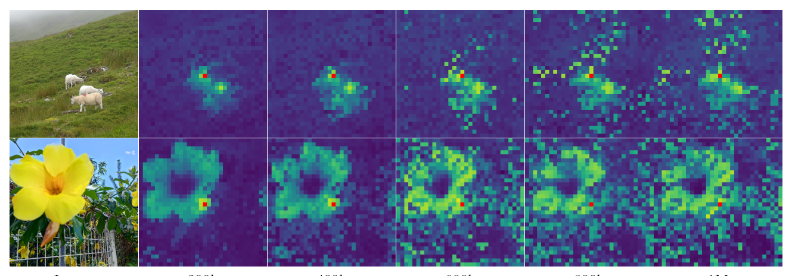

- **中文图注**：两行（羊群、黄花），每行 6 列：最左原图，然后 200k、400k、600k、800k、1M 迭代时的余弦相似度图；**红点**标注被查询的 patch。论文原文：随训练推进，特征越来越不局部化、相似度图越来越噪（来源：`sources/figs/INDEX.md` Figure 6 图注 / 论文 Fig.6）。
- **看这张图要看出什么**：把上面的曲线「落成肉眼看得到的现象」——**200k 时红点附近只有一小团亮，到 1M 时亮区已糊成一片**。这直观解释了为什么分割/匹配会掉：「本来只亮自己，现在到处都是它」。
- **裁切提示**：本图**底部列标题（Image / 200k / 400k / 600k / 800k / 1M）被下缘裁掉**；引用时请按本图注补出列含义。

**Gram anchoring 的做法**：

- **Gram 矩阵** = 「一张图里，所有 patch 特征两两点积构成的矩阵」，它刻画了**patch 之间的相似度结构**。
- 让 student 的 Gram 矩阵去**模仿一个「早期 teacher」的 Gram 矩阵**：

```
L_Gram = || X_S·X_S^T − X_G·X_G^T ||²_F    （两个 Gram 矩阵之差的平方）
```

  其中 `X_S` 是 student 的局部特征，`X_G` 是 Gram teacher 的。

**流程画出来是这样**（对照配置里的 `gram.*` 字段）：

```
   ┌─────────────────────┐
   │  早期 teacher 的权重  │   ← 从第 1,010,000 步附近取出（"dense 属性最好"的那个时间点）
   │  = Gram teacher      │
   └──────────┬──────────┘
              │ 只在 global crop 上算
              ▼
        X_G  →  Gram_G = X_G · X_Gᵀ        （patch 两两相似度结构，冻结不改）
                                            │
                                            │  对齐（只对齐"结构"，不锁定特征本身）
                                            │
        X_S  →  Gram_S = X_S · X_Sᵀ          │
              ▲                             │
              │                             ▼
   ┌──────────┴──────────┐      L_Gram = ‖ Gram_S − Gram_G ‖²_F   （× w=2）
   │ 正在训练的 student    │                    │
   └─────────────────────┘                    ▼
                                    梯度只回传到 student（teacher 冻结）
```

**两个注释帮你读图**：
- 左边的 `X_S` 是**可动的**——只要 Gram 结构对齐，特征可以自由移动，所以训练不会被「锁死」（这就是它和普通蒸馏最大的不同）。
- Gram teacher **每隔 `update_frequency`（1 万步）刷新一次，最多刷新 `max_updates=3` 次**（配置原值见下方表格），刷新的是「锚」的版本，不是每步都换。

- **关键设计：只约束 Gram 矩阵，不约束特征本身**。所以只要「相似度结构」对齐，**特征可以自由移动**——模型不会因此停止学习。

**图 9-3：三条损失随迭代怎么演化——末段阴影就是 Gram（LRef）精修阶段**（论文 Figure 7；图片路径 `sources/figs/fig7_p12.png`）

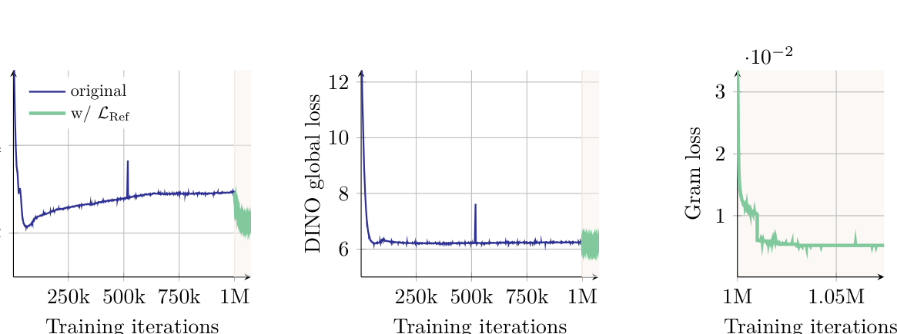

- **中文图注**：三张曲线——左：patch 级 **iBOT 损失**（图例 original vs w/ LRef）；中：**DINO global 损失**；右：**Gram 损失**。横轴训练迭代（到 1M / 1.05M），右侧绿色阴影是启用 Gram 目标的**精修（refinement，LRef）区间**（来源：`sources/figs/INDEX.md` Figure 7 图注 / 论文 Fig.7）。
- **看这张图要看出什么**：右图告诉你 **Gram 损失在精修阶段从 ~3 快速收敛到 ~0.5**——说明这个新目标「真的在降、不是摆设」；而左/中两图说明**接上 Gram 后，原有的 iBOT/DINO 损失并没有被破坏**（曲线照常平稳）。这就是 §9.6 三阶段里「阶段 2 接上 Gram」在损失层面的样子。
- **裁切提示**：**左子图的纵轴标题/刻度被左缘裁掉**；中子图（DINO global loss）与右子图（Gram loss）完整。引用时左图只能描述趋势。

**类比**：
> 想象你教一个画家临摹。传统蒸馏是「你每一笔都必须和他画在同一个位置」；Gram anchoring 是「**你画的整体明暗关系、块面之间的相似程度要和他一致，但具体落笔可以自己发挥**」。后者约束更松，却能精准修好「结构」这个问题。

**几个关键设置（都能在配置里看到）**：

| 设置 | 值 | 含义 |
|---|---|---|
| 作用对象 | **仅 global crops** | 论文：只在 global crop 上算 |
| 启用时机 | **1M iterations 之后**才启动 | 配置 `gram.it_first_update: 1010000`（Gram 阶段配置）；为了效率，论文说晚加也能「修复」已退化的特征 |
| Gram teacher | **取早期 iteration 的 teacher** | 因为早期模型 dense 属性最好 |
| 更新频率 | **每 10k 步**更新，最多 **3 次** | **Gram 阶段配置** `dinov3_configs_train_dinov3_vit7b16_gram_anchor.yaml`：`update_frequency: 10000`、`max_updates: 3`。注意**默认 SSL 配置**里是 `update_frequency: 50000`、`max_updates: null`（不限次），且 `gram.use_loss: false` |
| 损失权重 | `w_Gram = 2` | 论文 App.C |
| 高分辨率版 | `L_HRef`：teacher 先看 2× 分辨率图，再 2× 下采样 | 得平滑特征，ADE20k 再 +2 mIoU |

**效果（论文 Fig.9b，最硬的证据）**：

| 配置 | IN1k Linear | ADE mIoU | NYU RMSE↓ |
|---|---|---|---|
| Baseline（无 Gram） | 88.2 | 50.3 | 0.307 |
| GRAM（×1） | 88.0 | 53.6 | 0.285 |
| GRAM（×2 高分辨率） | 88.0 | **55.7** | **0.281** |
| GRAM（用 1M 的 teacher） | 88.1 | 54.9 | 0.290 |

**读法**：ADE20k 从 50.3 提到 55.7（**+5.4 mIoU**），而 **IN1k 几乎不动**（88.2→88.0）。这正是设计意图——**只修 dense，不牺牲 global**。

**图 9-4：高分辨率 Gram 的定量+定性证据（一张图顶两张）**（论文 Figure 9 + Figure 10 合页；图片路径 `sources/figs/fig10_p14.png`）

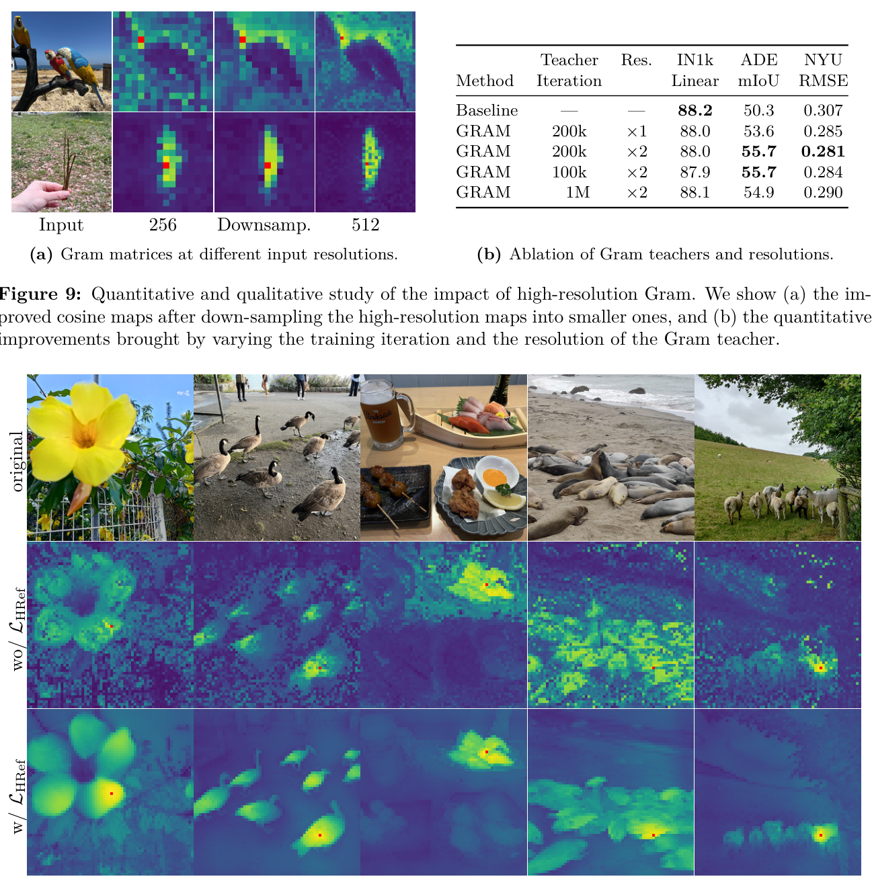

- **中文图注**：上半是 **Figure 9**——(a) 三种输入分辨率（Input / 256 / Downsam. / 512）下的 Gram/余弦图，(b) 一张**消融表**（列：Method / Teacher Iteration / Res. / IN1k Linear / ADE mIoU / NYU RMSE），含 Baseline 88.2 / 50.3 / 0.307、GRAM 200k ×2 达 88.0 / **55.7** / **0.281** 等行；下半是 **Figure 10**——1024×1024 输入下，用精修目标 `L_HRef` **前后**的余弦图对照（来源：`sources/figs/INDEX.md` Figure 9 / Figure 10 图注；表内数字取自该 PNG 的图内印刷文字，与论文 Fig.9b 一致）。
- **看这张图要看出什么**：三件事——① 上半 (b) 那张表就是本节「效果」表格的**原始出处**，可逐格核对；② 用**更高分辨率 teacher**（Res. ×2）能把 ADE mIoU 推到 55.7、NYU RMSE 降到 0.281；③ 下半两行对比里，**`w/ L_HRef` 那一行的余弦图明显更聚焦、更干净**——这就是「高分辨率 Gram（L_HRef）蒸馏进 student」的定性效果。
- **裁切提示**：Figure 9 的表、图注与 Figure 10 的图像内容都在；**Figure 10 自身的中文/英文图注未含**，引用时请按本图注补出。

**代码侧**（想深挖可看）：`repo/dinov3_loss_gram_loss.py`（Gram 损失）、`repo/dinov3_train_ssl_meta_arch.py`（接入主循环）。

## 9.6 一句话串起来（含**三阶段训练**的完整流程）

```
 DINOv3 的预训练 =  DINO（整图 CLS 自蒸馏）
                 +  iBOT（挖 patch 让 student 补全）
                 +  KoLeo（0.1，让特征散开、别挤成一团）
                          │
                          │  训久了：global 指标还在涨，但 dense 开始退化
                          │  （约 200k iter 后分割开始掉，7B 甚至跌破早期水平）
                          ▼
    ┌─────────── 官方 ViT-7B 的【三阶段】 ───────────┐
    │                                                 │
    │  阶段 1  Pretraining                            │  1M iter
    │          DINO + iBOT + KoLeo                    │  2×256 global + 8×112 local
    │          （常数 LR/WD/momentum，去掉调度）        │  全局 batch 4096
    │                    │                            │
    │                    ▼                            │
    │  阶段 2  Gram anchoring                          │  从 1.01M 起
    │          把 patch 相似度结构锚回早期 teacher      │  w_Gram=2
    │          （默认配置里开着 use_loss: false，       │  每 10k 步刷新锚，最多 3 次
    │            这一阶段才把它打开）                   │
    │                    │                            │
    │                    ▼                            │
    │  阶段 3  High-resolution adaptation              │  10k iter
    │          成对采样不同尺寸 crop + 必须叠加 Gram    │  global {512,768}
    │          （去掉 Gram，dense 会显著退化）          │  local {112,168,224,336}
    └────────────────────────┬────────────────────────┘
                             │
                             ▼
                 发布：1 个 ViT-7B  →  蒸馏出
                 5 个 ViT（S/S+/B/L/H+）+ 4 个 ConvNeXt（T/S/B/L）
                 以及卫星版（SAT-493M）
```

**读法**：**前三行是「学什么」，三阶段是「怎么训」，最后一行是「怎么让它变小」。** 第 8.3 节的命令行就是这三阶段一一对应的三条命令。

## 本章小结

- **DINO 目标**：student 猜 teacher（EMA 副本）的输出分布，靠 centering+sharpening+KoLeo 防塌缩。
- **iBOT**：挖 patch 让 student 补全，逼模型懂局部结构。
- **KoLeo**：让特征散开，别挤成一团。
- **Gram anchoring**：核心创新。只约束 patch 相似度结构、不锁死特征；用早期 teacher 当锚；只在 1M 后启动；ADE20k +5.4 mIoU、global 不降。
- DINOv3 用**常数超参**取代 cosine 调度，支持「无限训练」。

---

# 第 10 章 避坑指南与 FAQ

> **这一章解决什么**：把新手最容易踩的坑一次讲完，每个都给「症状 → 原因 → 解决办法」。
> **读完你会得到**：一张排查清单，遇到问题时先来这里对照。

**避坑框索引（把散落全书的关键提醒集中到这里，点进去看细节）**——全书凡标 `> ⚠️` 的引用块都是同一类「避坑框」，下面按主题汇总入口：

| 主题 | 一句话避坑 | 详见 |
|---|---|---|
| 下载 | **用 `wget`，别用浏览器**；`hf_facebook_dinov3-*_config.json` 是 401 错误页，**不可引用** | §2.3、§3.6 |
| 加载 | `torch.hub.load(REPO_DIR, 名, source='local', weights=…)`；**绝不传 `img_size`** | §3.2、§3.6、§7.1 |
| 归一化 | **两套常量别混**（LVD vs SAT）；SAT 权重走 HF 时要**显式传** mean/std | §5.2、§6.10.2、§7.5.1 |
| 形状 | 输入边长**必须是 16 的倍数**；**patch 从索引 5 开始**切 | §4.3、§5.4 |
| 训练配置 | `train.crops.rgb_mean/std` 必须与推理一致；`--nodes` 归 submitit，末尾 `PATH.KEY VALUE` 才是覆盖配置 | §5.2、§8.2.8、§8.3 |
| ConvNeXt | patch 网格步长是 **32（不是 16）**；CLS 是**池化**得到的 | §6.7、§11.1 |
| dino.txt | 返回 `(model, tokenizer)` **必须解包**；**词表许可是另一份** | §6.8.1、§6.8.2 |
| 检测头 | 是 **COCO/2048** 协议，别照遥感 DIOR 的 800 跑（会掉点） | §6.4.1 |
| 合规 | 再分发要标「**Built with DINOv3**」+ 随附协议；发表要致谢 | §2.3、第 6 章开头、附录 A |
| 权限被拒 | HF gated 没批 → 走 Meta 下载页 / CHMv2 入口 / 先用 `pretrained=False` 开发 | FAQ 第 31 条 |

## A. 加载与权重

**1. 权重下载不下来 / 拿到 401、403**
- **症状**：下载权重失败；`from_pretrained` 报权限错误。
- **原因**：**DINOv3 权重是 gated 的**，必须先在 `https://ai.meta.com/resources/models-and-libraries/dinov3-downloads/` 申请并获得授权。
- **解决**：申请通过后，**邮件会发全部权重 URL**；**用 `wget` 下载，不要用浏览器**。

**2. `torch.hub.load` 报找不到仓库 / 联网失败**
- **症状**：hub 试图去 GitHub 拉仓库。
- **原因**：没写 `source='local'`，或 `REPO_DIR` 路径不对。
- **解决**：第一个参数给**本地克隆目录的绝对路径**，并加 `source='local'`（README 全程这么写）。

**3. `TypeError: __init__() got multiple values for keyword argument 'img_size'`**
- **症状**：你想用 `torch.hub.load(..., img_size=512)` 改分辨率。
- **原因**：每个公开入口内部已固定 `img_size=224`。
- **解决**：**不要传 `img_size`**；直接喂更大分辨率的输入图，RoPE 会自适应（第 7 章）。

**4. `RuntimeError: Error(s) in loading state_dict`（Missing/Unexpected keys）**
- **症状**：加载权重时 key 对不上。
- **原因**：模型名与权重不匹配，或结构开关不一致。
- **解决**：核对「模型名 ↔ 权重」；注意下面第 6 条的 norm 开关。

**5. 用错归一化，精度低**
- **症状**：一切都对，但指标明显低于预期。
- **原因**：卫星权重套了 ImageNet 常量（或反过来）。
- **解决**：LVD 用 ImageNet 常量；SAT 用 `mean(0.430,0.411,0.296)/std(0.213,0.156,0.143)`。

**6. `dinov3_vitl16` / `dinov3_vit7b16` 加载报错**
- **症状**：ViT-L 或 ViT-7B 权重加载 `strict=True` 报错。
- **原因**：这两个模型在某些权重下 `untie_global_and_local_cls_norm=True`（ViT-L 的 **SAT** 权重为 True；ViT-7B **始终**为 True），会多出一个 `local_cls_norm`。传错权重/结构就会对不上。
- **解决**：用对应的官方入口（`dinov3_vitl16` 会自动按权重处理）；用 `weights=Weights.SAT493M` 时确认走的是 SAT 分支。

## B. 输入与输出

**7. 切 patch token 忘了跳过 register**
- **症状**：特征图尺寸不对，或分割/深度结果错乱。
- **原因**：序列是 `[CLS][reg×4][patch×N]`，**CLS 在 0，register 在 1–4，patch 从 5 开始**。
- **解决**：要么用 `x_norm_patchtokens`（已切好），要么从 `x_prenorm` 的索引 `1 + n_storage_tokens` 起切（=5）。

**8. 输入尺寸不是 16 的倍数**
- **症状**：patch 数和你算的不一样；边缘信息丢失。
- **原因**：官方模型卡原文——**不整除时模型会裁到最近的、较小的 16 的倍数**。
- **解决**：预处理时先 pad/resize 到 16 的倍数；用第 5.4 节的自检函数。

**9. 输出形状是 `[1, 768]` 还是 `[1, 261, 768]`？搞混了**
- **症状**：不知道自己该用哪个输出。
- **原因**：`model(x)` 默认只返回 **CLS**（`[B, C]`）；`model.forward_features(x)` 返回 dict（含完整序列）。
- **解决**：要整图向量用 `model(x)` 或 `x_norm_clstoken`；要密集特征用 `x_norm_patchtokens` 或 `get_intermediate_layers`。

**10. 照抄 HF 文档注释，token 数对不上（201 vs 256）**
- **症状**：HF 示例注释说 `[1, 1+4+256, 384]`，你算是 201。
- **原因**：HF 注释疑似沿用 DINOv2（patch 14）的旧值。
- **解决**：**以官方模型卡的 201（224×224, patch16）为准**。

**11. 想用 `x_prenorm` 但特征值域奇怪**
- **症状**：直接用 `x_prenorm` 做下游效果差。
- **原因**：`x_prenorm` 是 final norm **之前**的特征；官方附录 A.2 指出 7B 在通道维有离群，建议下游对**最后一层**做归一化（如 batch norm）。
- **解决**：用 `x_norm_*` 系列，或自己对 `x_prenorm` 加归一化。

## C. 分辨率与位置编码

**12. 以为要像 DINOv2 那样 interpolate 位置编码**
- **症状**：你去找 `interpolate_pos_encoding`。
- **原因**：DINOv3 用 **RoPE**，**换分辨率不需要任何插值**（论文 §4.3 原话）。
- **解决**：**不要插值**；直接喂目标分辨率的图。

**13. 大图显存爆了 / 超慢**
- **症状**：喂 1024 或更大时 OOM。
- **原因**：GFLOPs 随分辨率**平方**增长（ViT-7B 256→512 是 3550→14515，约 4×）。
- **解决**：降分辨率、用 bf16 autocast、切片推理（官方分割用滑窗 `inference_mode="slide"`）、换小模型。

## D. 下游任务

**14. 分割/深度结果边界很糊**
- **原因**：16 像素的 patch 粒度较粗（论文自评）。
- **解决**：提高输入分辨率（512→1024）；或用官方的 Mask2Former/ViT-Adapter 系统；或取中间层拼接。

**15. 有用 `dino.txt` 做零样本，但直接拿主干不行**
- **症状**：你用纯 DINOv3 主干做零样本分类，结果很差。
- **原因**：**主干没有文本塔**，天生不做零样本。
- **解决**：用官方 `dinov3_vitl16_dinotxt_tet1280d20h24l`（返回 `(model, tokenizer)`），或改用 CLIP/SigLIP。

**16. OCR / 文字密集任务效果差**
- **原因**：DINOv3 不用图文对，字形关联弱（论文 Tab.25）。
- **解决**：这类任务换弱监督/图文模型；或用 DINOv3 特征 + 足够标注。

**17. 分类头该用 CLS 还是「CLS + patch 均值」？**
- **答案**：官方发布的 ImageNet 分类头用的是 **`concat(CLS, mean(patch))`** 再过一层 `Linear(2*embed_dim, 1000)`。你自己训时两种都试，通常「CLS + patch 均值」略好。

## E. 训练与工程

**18. `ImportError` / 找不到 `dinov3.*` 包**
- **原因**：没把仓库加入模块搜索路径。
- **解决**：命令前加 `PYTHONPATH=.`（或 `PYTHONPATH=${PWD}`）。

**19. `--nodes` 报错说不是合法参数**
- **原因**：`--nodes` 是给 `dinov3.run.submit`（submitit）的，不是 `train.py` 的。
- **解决**：用 `python -m dinov3.run.submit dinov3/train/train.py --nodes N ...` 的形式；或不用 submitit、直接 `python`/`torchrun` 跑（注意：torchrun 的环境变量官方资料未给出）。

**20. README 的分割示例直接抄报 `NameError: name 'v2' is not defined`**
- **原因**：官方示例文件头**缺 `from torchvision.transforms import v2`**。
- **解决**：自己补上这一行（本文第 6.2 节已补）。

**21. README 深度示例参数名是 `weights=<DEPTHER/...>`，看不懂**
- **原因**：官方文档笔误，把分类头示例的参数名复制错了。
- **解决**：按实际语义填——`weights=` 是 head 权重，`backbone_weights=` 是主干权重。

**22. 训练出现 NaN**
- **症状**：loss 变 NaN，训练中止。
- **原因**：混合精度 + 大模型不稳定。
- **解决**：训练脚本会自动检测——**连续 >2 次 NaN 就抛 `RuntimeError` 中止**。可降低 LR、开梯度裁剪（`clip_grad`）、用 bf16（比 fp16 稳）。

**23. 多卡训练不生效 / 单卡显存不够**
- **原因**：官方训练走 FSDP2，需要多卡。
- **解决**：单卡请走「冻结特征 + 线性探针」路线（第 8.7 节）；多卡按官方 submitit 命令。

## F. 版本与环境

**24. `AutoModel` 报没有 DINOv3**
- **原因**：transformers 版本太低。
- **解决**：**`transformers >= 4.56.0`**（2025-08-29 起正式支持）；timm 从 **1.0.20** 起支持。

**25. Windows 上跑不起来**
- **原因**：**官方只在 Linux 测过**，Windows 未经官方验证。
- **解决**：用 WSL2 / Linux；或只做「加载 + 推理」这种轻量用法。

**26. `hf_facebook_dinov3-*_config.json` 打开是权限错误**
- **原因**：抓取时模型还是 gated，返回的是 **401 错误页，不是真配置**。
- **解决**：申请通过后从 HF 正常下载真配置。

**27. `dinov3_vitl16plus` 能加载吗？**
- **事实**：它在 `hubconf.py` 里有导出，源码 `repo/dinov3_hub_backbones.py` 的 `dinov3_vitl16plus()` 会为它设 `hash = "46503df0"`，并在 `pretrained=True` 时通过 `_make_dinov3_vit_model_url(...)` **按该 hash 拼出一个下载 URL**（`Weights.LVD1689M` 分支）。这说明代码层面它是**按「有可下载权重」来写的**。
- **结论（勿过度推断）**：它**不在官方 12 个发布模型清单里**（README 模型表与 MODEL_CARD 都没列），所以**「它是否有公开权重、是否可直接下载」官方资料未给出**。
- **正确写法**：不要写「没有公开权重」（资料未证实）；写「**官方资料未说明其权重是否可获取**」。你在内网/离线环境应把它当「不能加载」处理，除非你确实拿到了对应文件。

## G. 运行环境与资源（补充高频问题）

**28. 在 CPU 上跑下游 head，要注意什么？**
- **能跑，但慢**。去掉 `.cuda()` / `device_map="auto"`，模型与输入都留在 CPU，外面套 `torch.autocast('cpu', dtype=torch.bfloat16)` 或 `torch.inference_mode()` 即可。
- **三个坑**：① 用 `.mean()`/`@` 做相似度检索时，CPU 上没有 cuBLAS 加速，建议**先把特征离线缓存成 `.npy`**（第 6.1.1 节的 `extract_cls_features`），再在 CPU 上算；② **别在 CPU 上跑 ViT-7B**（权重也放不下，见 2.4）；③ 自定义 `deformable attention` 等 Mask2Former 算子需要编译 CUDA 扩展，**CPU 上装不了**——检测/分割 head 的 CPU 复现属于**官方资料未给出**，建议只在小模型主干的「冻结特征 + 线性层」路线上做 CPU 开发。

**29. 显存 OOM 了，怎么按量化步骤排查？**
按「先定位、再降需求」的顺序做，每一步都能给出一个可核对的数字：
1. **看是谁在吃显存**：`print(torch.cuda.max_memory_allocated()/2**30)`（GB）——只在推理时看 `max_memory_allocated` 就够。
2. **排权重上限**：查第 2.4 节的 BF16/FP32 权重表（ViT-7B BF16 ≈ 13.4 GB）。若**权重本身就超卡**，改模型规格或上 int4，别调 batch。
3. **排激活**：把输入边长从 `s` 降到 `s/2`，激活理论上约**降到 1/4**（GFLOPs 与 `N_token` 成正比、`N_token` 与 `s²` 成正比；官方证据：ViT-7B @256 = 3550 → @512 = 14515 GFLOPs，约 4×，Fig.16a）。
4. **排 batch**：batch 线性影响激活；推理直接降到 1。
5. **开省显存开关**：bf16 autocast（第 2.5 节）、训练开 activation checkpointing / FSDP（第 8.4 节）。
6. **兜底**：分割/检测用官方滑窗（`inference_mode="slide"`）把小 crop 逐块跑，避免一次性喂大图。
> 「各模型在多少分辨率下需要多少 GB」**官方资料未给出**——上面是排查流程，不是官方数字。

**30. 多卡用 `torchrun` 怎么起？（报告里的诚实边界）**
- 官方 README 的**所有命令都用 `dinov3.run.submit`**（submitit 包装器，主要面向 SLURM），并说明「不用它也可以直接用 `python` 或 `torchrun`」，但**没有给出 torchrun 需要哪些环境变量**（`RANK` / `WORLD_SIZE` / `MASTER_ADDR` / `MASTER_PORT` / `LOCAL_RANK` 等在本资料集里**没有出现**）。
- **通用替代方案（非官方，标准 PyTorch 做法，需自行验证）**：让 `torchrun` 基于 `--nproc_per_node` / `--nnodes` / `--node_rank` 自行注入上述变量，`train.py` 内部走 `dinov3.distributed`（源码不在资料集内）读取它们：
  ```shell
  PYTHONPATH=. torchrun --nproc_per_node=8 --nnodes=1 --node_rank=0 \
      --master_addr=127.0.0.1 --master_port=29500 \
      dinov3/train/train.py --config-file dinov3/configs/train/<你的配置>.yaml \
      --output-dir <OUT>
  ```
- 若 `train.py` 还依赖 submitit 的 `--nodes`，**该参数不会生效**（第 8.3 节）；此时以 `WORLD_SIZE` 为准。

**31. HuggingFace 的 gated 申请被拒 / 一直没批怎么办？**
- **先确认你走对了入口**：HF 页面上的 `dinov3-*` **是门控仓库**，需要在模型页点「Request access」并由 Meta 审批，批准前 `from_pretrained` 一定 401。
- **替代路径**（都是官方资料里存在的入口，不是野路子）：
  1. **走 Meta 官方下载页** `https://ai.meta.com/resources/models-and-libraries/dinov3-downloads/`，审批通过后**邮件会给全部权重 URL**，用 `wget` 下载后走**仓库路线**（`torch.hub.load(..., weights=<本地路径>)`），完全绕开 HF 门控；
  2. **用 CHMv2 入口**：CHMv2 也以 **DINOv3 ViT-L/16 卫星版**为主干，通过 `https://ai.meta.com/resources/models-and-libraries/chmv2-downloads/` 申请（仍需 ViT-L SAT 权重的访问权）；
  3. **先做不需要权重的开发**：用 `pretrained=False` 的**随机初始化**先把整条管线（预处理、token 形状、下游 head、评估代码）跑通，等权限下来再换真权重（第 3.7 节）。
- **不要**去找第三方镜像/转存——那既违反协议（附录），也拿不到 `_safe_load_state_dict_from_url` 的 hash 校验保护。

## 本章小结

- **最高频三个坑**：① 权重 gated（第 1 条）；② 用错归一化（第 5 条）；③ patch token 忘跳 register（第 7 条）。
- **最容易误解两点**：① DINOv3 **不需要**位置编码插值；② DINOv3 **不做**零样本（除非 `dino.txt`）。
- **官方文档本身有**一**处缺漏 + 一处笔误**：分割示例缺 `from torchvision.transforms import v2`（README 里 `sys.path.append` 是**本来就有的**）；分类头示例的参数名误写成 `DEPTHER`。
- 遇到新问题，先回第 5、6 章对照形状与归一化。

---

# 第 11 章 速查表

> **这一章解决什么**：把最常用的东西集中在一页，方便复制。
> **读完你会得到**：不用翻前文就能查表。

> **⚠️ 阅读提示（避免「只读速查表」的坑）**：本章是**索引**，**不引入任何正文里没有的事实**；表中的每个数字都能在正文找到出处。**第一次读请先读正文**（§2.4 显存、§4.4 形状、§4.5 取层、§5.5 尺寸、§7.3 分辨率都讲过为什么），本章只在你要「抄一个值」时使用。表内已标注对应正文出处。

## 11.1 模型选型表

| 想要什么 | 选哪个 | 参数量 | 说明 |
|---|---|---|---|
| 最省资源、够用 | **ViT-S/16** | 21M | 最小 ViT，CPU 也能跑 |
| 小模型里更优 | **ViT-S+/16** | 29M | 用了 SwiGLU |
| 平衡之选 | **ViT-B/16** | 86M | 单卡友好的推荐起点 |
| 效果好、可上多卡 | **ViT-L/16** | 300M | 官方快速设置用的就是这个 |
| 逼近 7B 的强模型 | **ViT-H+/16** | 840M | 论文称与 7B「on par」 |
| 最强 dense | **ViT-7B/16** | 6716M | 需 int4 或多卡 |
| 卷积偏好 / 部署友好 | **ConvNeXt-T/S/B/L** | 29M–198M | **有 CLS token**（由全局平均池化得到，见下方说明），蒸馏自 7B；用法见 §6.7 |
| 卫星/遥感 | **ViT-L/16 或 ViT-7B/16 (SAT493M)** | 300M / 6716M | 用 SAT 归一化 |
| 冠层高度 | **CHMv2**（`dinov3_vitl16_chmv2`） | — | 独立下载入口 |
| 文本对齐 / 零样本 | **`dinov3_vitl16_dinotxt_*`** | — | 返回 `(model, tokenizer)`；用法见 §6.8 |

**图 11-1：小模型能追平大教师——ViT-H+ 与 7B 的「参数量—性能」对照**（论文 Figure 16b；图片路径 `sources/figs/fig16_p30.png`）


- **中文图注**：浅蓝柱是 **ViT-H+**、深蓝柱是 **ViT-7B**，在多组基准上成对对比；图内可读的成对数值如 **78.6/78.9、80.6/81.1、54.8/55.9**。论文原文：**尽管 ViT-H+ 的参数量不到 7B 教师的 1/10，它的表现却接近 DINOv3 7B**（来源：`sources/figs/INDEX.md` Figure 16 图注 / 论文 Fig.16b）。
- **看这张图要看出什么**：这解释了选型表为什么把 **ViT-H+（840M）** 列为「逼近 7B 的强模型」——**用不到十分之一的体量换来接近旗舰的表现**，是「单卡/单机想用强模型」时最划算的一档（第 2.4 节显存表：H+ 权重 BF16 ≈1.68 GB，7B ≈13.4 GB）。
- **裁切提示**：**本图为论文 Fig.16b 的局部**——Fig.16a 的模型特性表（参数量/GFLOPs）未收录；且**图顶部的柱值（87.x、88.x 等）与坐标轴类目名被裁掉**。**引用时不要凭图猜被裁的基准名**，基准名与其余数字请以论文正文/表格为准。

**⚠️ 关于 ConvNeXt 的 CLS token（此前常见的一处误解）**：ConvNeXt **不是「没有 CLS token」**。
`repo/dinov3_models_convnext.py` 的 `forward_features_list()`（约 223–245 行）在 4 个 stage 之后做**全局平均池化** `x_pool = x.mean([-2, -1])`，把池化结果当作「CLS」拼到 patch 序列前面再归一化，最后返回**和 ViT 完全同名的三个键**：

```python
x_pool = x.mean([-2, -1])                       # (N, C, H, W) -> (N, C)  全局平均池化
x = torch.flatten(x, 2).transpose(1, 2)          # patch token: (N, HW, C)
x_norm = self.norm(torch.cat([x_pool.unsqueeze(1), x], dim=1))
return {
    "x_norm_clstoken":     x_norm[:, 0],                       # ← 池化得到的 CLS
    "x_storage_tokens":    x_norm[:, 1 : self.n_storage_tokens + 1],
    "x_norm_patchtokens":  x_norm[:, self.n_storage_tokens + 1 :],
    "x_prenorm": x, "masks": masks,
}
```

区别只在于：ViT 的 CLS 是**一个可学习的 token**，ConvNeXt 的 CLS 是**空间特征池化**出来的；而 ConvNeXt 走的是 `_make_dinov3_convnext(..., **kwargs)`，**不传 `n_storage_tokens`**（该构造函数默认 0），所以 `x_storage_tokens` 是**空**的 `[N, 0, C]`，patch token 就是全部空间位置。
**对你的影响**：把提特征的代码从 ViT 换成 ConvNeXt 时，**`out["x_norm_clstoken"]` 照样能用**，不需要改键名。HF 侧也一致：`DINOv3ConvNextModel` 的 `pooler_output` 就是「对空间维做池化后的 hidden state」（HF 文档原文）。

## 11.2 官方加载名与权重 hash 速查

**主干（torch.hub 名）**：`dinov3_vits16`、`dinov3_vits16plus`、`dinov3_vitb16`、`dinov3_vitl16`、`dinov3_vith16plus`、`dinov3_vit7b16`、`dinov3_convnext_tiny/small/base/large`。

> **「有函数」≠「有公开权重」**：`hubconf.py` 里还导出了 `dinov3_vitl16plus` 等未列入官方 12 个发布模型的入口。源码会给它们设 hash 并拼出下载 URL（如 `dinov3_vitl16plus` 的 `46503df0`），但**官方是否发布了对应权重，资料未说明**。以 README 模型表 / MODEL_CARD 的 12 个模型为准；其余入口**不要假定一定可下载**（第 10.27 条）。

**Head**：`dinov3_vit7b16_lc`（分类）、`dinov3_vit7b16_dd`（深度）、`dinov3_vitl16_chmv2`（冠层）、`dinov3_vit7b16_de`（检测）、`dinov3_vit7b16_ms`（分割）、`dinov3_vitl16_dinotxt_tet1280d20h24l`（文本）。

**权重 hash（用于识别文件名，来源：`sources/repo/dinov3_hub_backbones.py`）**：

| 模型 | hash（LVD / SAT） |
|---|---|
| vits16 | `08c60483` |
| vits16plus | `4057cbaa` |
| vitb16 | `73cec8be` |
| vitl16 | `8aa4cbdd` / `eadcf0ff`(SAT) |
| vith16plus | `7c1da9a5` |
| vit7b16 | `a955f4ea` / `a6675841`(SAT) |
| convnext tiny/small/base/large | `21b726bb` / `296db49d` / `801f2ba9` / `61fa432d` |

## 11.3 常用代码片段

**加载主干（仓库路线）**
```python
model = torch.hub.load(REPO_DIR, "dinov3_vitb16", source="local", weights=CKPT)
model.eval().to(device)
```

**用 `Weights` 枚举（**必须**先导入，否则 NameError）**
```python
from dinov3.hub.backbones import Weights          # ← 官方唯一的枚举导入方式（README CHMv2 示例）

# 例：卫星主干（自动按 SAT-493M 拼下载 URL；记得配 SAT 归一化，见第 5.2 节）
model = torch.hub.load(REPO_DIR, "dinov3_vitl16", source="local",
                       weights=Weights.SAT493M)
# 例：CHMv2 头（头权重给路径，主干用枚举）
chmv2 = torch.hub.load(REPO_DIR, "dinov3_vitl16_chmv2", source="local",
                       weights="<CHMV2/CKPT/URL/OR/PATH>",
                       backbone_weights=Weights.SAT493M)
```

**加载 ConvNeXt（§6.7）**
```python
convnext = torch.hub.load(REPO_DIR, "dinov3_convnext_base", source="local", weights=CKPT)
convnext.eval().to(device)
out = convnext.forward_features(x)          # 键名与 ViT 相同；CLS 是全局平均池化得到的
```

**dino.txt（返回二元组，必须解包；§6.8）**
```python
dinotxt_model, tokenizer = torch.hub.load(
    REPO_DIR, "dinov3_vitl16_dinotxt_tet1280d20h24l", source="local",
    weights=<DINOTXT/CKPT/URL/OR/PATH>,
    backbone_weights=<VITL16/CKPT/URL/OR/PATH>,
)
```

**加载主干（HF 路线）**
```python
from transformers import AutoImageProcessor, AutoModel
processor = AutoImageProcessor.from_pretrained("facebook/dinov3-vitb16-pretrain-lvd1689m")
model = AutoModel.from_pretrained("facebook/dinov3-vitb16-pretrain-lvd1689m", device_map="auto")
```

**取 CLS 与 patch**
```python
out = model.forward_features(x)
cls   = out["x_norm_clstoken"]        # [B, C]
patch = out["x_norm_patchtokens"]     # [B, N, C]
```

**取特征图**
```python
fmap = model.get_intermediate_layers(x, n=1, reshape=True)[0]   # [B, C, H/p, W/p]
```

**取多层**
```python
feats = model.get_intermediate_layers(x, n=[5, 11, 17, 23], reshape=True)
```

**归一化常量**
```python
# LVD
mean=(0.485, 0.456, 0.406); std=(0.229, 0.224, 0.225)
# SAT
mean=(0.430, 0.411, 0.296); std=(0.213, 0.156, 0.143)
```

## 11.4 关键参数含义速查

> 出处对应：`patch_size`/`n_storage_tokens` → §4.2；`embed_dim`/`depth`/`num_heads` → `repo/dinov3_models___init__.py` 与 HF 模型卡；`pos_embed_rope_*` → §7.2；`layerscale` → §8.2.5；`ffn_layer` → §8.2.5；token 数 → §4.4。

| 参数 | 含义 | 默认/典型值 |
|---|---|---|
| `patch_size` | 每个 patch 的像素边长 | 16（全部 ViT） |
| `n_storage_tokens` / `num_register_tokens` | register token 数量 | 4 |
| `embed_dim` / `hidden_size` | 特征维度 | S:384, B:768, L:1024, H+:1280, 7B:4096 |
| `depth` / `num_hidden_layers` | 层数 | S/B:12, L:24, H+:32, 7B:40 |
| `num_heads` | 注意力头数 | S:6, B:12, L:16, H+:20, 7B:32 |
| `pos_embed_rope_base` / `rope_theta` | RoPE 频率基数 | 100 |
| `pos_embed_rescale` | RoPE-box jitter 缩放范围 | 2.0 |
| `layerscale` / `layerscale_value` | LayerScale 初值 | 发布权重用 **1e-5** |
| `ffn_layer` | FFN 类型 | S/B/L: mlp；S+/H+: swiglu；7B: swiglu64 |
| token 数 @224 (p16) | CLS+reg+patch | 1+4+196 = **201** |
| token 数 @512 (p16) | — | 1+4+1024 = **1029** |

> ⚠️ **HF `DINOv3ViTConfig` 的默认值**（`layerscale_value=1.0`、`num_register_tokens=0`）与**发布权重的实际值**（LayerScale `1e-5`、register `4`）不同。**以仓库/权重为准**；从 HF hub 加载真实模型时，config 里是实际值（4）。

## 11.5 关键数字速查

> 每条都给了表号，方便你回论文核对（这也是本版最在意的一点：**不写没出处的数字**）。

| 数字 | 值 | 来源 |
|---|---|---|
| 旗舰参数量 | 6.7B（6716M） | 论文 Tab.2 / Fig.16a |
| 预训练数据（web） | LVD-1689M = 16.89 亿 | 论文 §3.1 |
| 预训练数据（卫星） | SAT-493M = 4.93 亿 | 论文 §8.1 |
| 原始图片池 | ~170 亿 | 论文 §3.1 |
| 主训练迭代 | 1M | 论文 App.C |
| 全局 batch | 4096 | 论文 §3.2 |
| 训练算力 | 61,440 GPU·h，47 MWh，18 tCO2eq | 论文 Tab.20 |
| ADE20k 线性 | 55.9 mIoU | 论文 Tab.3 |
| ImageNet 线性 | 88.4 | 论文 Tab.7 |
| NYUv2 深度（线性 RMSE） | 0.309 | 论文 Tab.3 |

## 本章小结

- **选型**：小 → ViT-S/B；强 → ViT-L/H+/7B；卷积 → ConvNeXt；卫星 → SAT 版。
- **加载**：`torch.hub.load(REPO_DIR, '<名>', source='local', weights=<权重>)` 或 HF `AutoModel.from_pretrained`。
- **两套归一化**、**patch 从索引 5 开始**、**token 数自己会算**。
- 常用 API：`forward_features`、`get_intermediate_layers`。

---

# 第 12 章 延伸阅读

> **这一章解决什么**：给你一份「要去哪看更多」的正确链接清单。

## 12.1 一手资料

| 名称 | 链接 | 用途 |
|---|---|---|
| **DINOv3 论文**（arXiv:2508.10104） | `https://arxiv.org/abs/2508.10104` | 技术报告全文 |
| **DINOv3 仓库** | `https://github.com/facebookresearch/dinov3` | 参考 PyTorch 实现、训练/评估代码 |
| **官方博客** | `https://ai.meta.com/blog/dinov3-self-supervised-vision-model/` | 通俗介绍、卖点 |
| **官网** | `https://ai.meta.com/dinov3/` | 入口页 |
| **权重下载（申请）** | `https://ai.meta.com/resources/models-and-libraries/dinov3-downloads/` | gated 权重申请 |
| **CHMv2 权重下载（申请）** | `https://ai.meta.com/resources/models-and-libraries/chmv2-downloads/` | 树冠高度模型 |
| **CHMv2 论文** | `https://arxiv.org/abs/2603.06382` | 冠层高度 v2 |
| **许可证** | `https://ai.meta.com/resources/models-and-libraries/dinov3-license/` | DINOv3 License 全文 |

## 12.2 HuggingFace

| 名称 | 链接 |
|---|---|
| HF 模型合集（12 个模型） | `https://huggingface.co/collections/facebook/dinov3-68924841bd6b561778e31009` |
| HF transformers 文档：DINOv3 | `https://huggingface.co/docs/transformers/model_doc/dinov3` |
| CHMv2（HF） | `https://huggingface.co/facebook/dinov3-vitl16-chmv2-dpt-head` |

**HF 模型 ID 清单（12 个）**：

```
facebook/dinov3-vits16-pretrain-lvd1689m
facebook/dinov3-vits16plus-pretrain-lvd1689m
facebook/dinov3-vitb16-pretrain-lvd1689m
facebook/dinov3-vitl16-pretrain-lvd1689m
facebook/dinov3-vith16plus-pretrain-lvd1689m
facebook/dinov3-vit7b16-pretrain-lvd1689m
facebook/dinov3-convnext-tiny-pretrain-lvd1689m
facebook/dinov3-convnext-small-pretrain-lvd1689m
facebook/dinov3-convnext-base-pretrain-lvd1689m
facebook/dinov3-convnext-large-pretrain-lvd1689m
facebook/dinov3-vitl16-pretrain-sat493m
facebook/dinov3-vit7b16-pretrain-sat493m
```

## 12.3 官方 notebook（在仓库 `notebooks/` 下）

| notebook | 内容 |
|---|---|
| `pca.ipynb` | patch 特征 PCA 可视化 |
| `foreground_segmentation.ipynb` | 线性前景分割 |
| `dense_sparse_matching.ipynb` | 稠密/稀疏匹配 |
| `segmentation_tracking.ipynb` | 视频分割跟踪（非参数） |
| `dinotxt_segmentation_inference.ipynb` | dino.txt 开放词表分割（§6.8.4） |
| `dinotxt_inference.ipynb` | dino.txt 基础推理（**README 未列出，见 `repo_tree.json`**；§6.8.3） |
| `chmv2_inference.ipynb` | CHMv2 用法 |
| `chmv2_dataset_exploration.ipynb` | CHMv2 数据下载 |

## 12.4 相关模型（值得一起了解）

| 模型 | 关系 | 大致定位 |
|---|---|---|
| **DINOv2** | DINOv3 的直接前代 | 自监督视觉特征，patch 14，可学习位置编码 |
| **DINOv2 with Registers** | DINOv2 的改进版 | 加了 register token 抑制离群 |
| **SigLIP 2** | 弱监督图文模型 | 全局任务、零样本很强；dense 弱于 DINOv3 |
| **PE / PEcore / PEspatial** | 感知编码器（Perception Encoder） | 弱监督，全局强，dense 弱 |
| **CLIP** | 图文对比开山之作 | 零样本分类/检索 |
| **dino.txt** | 把 DINO 视觉主干与文本对齐的方法 | 让 DINO 能做零样本/开放词表 |
| **VGGT** | 3D 重建模型 | 论文把它的主干换成 DINOv3，三项任务全面超原版（Tab.13） |

## 12.5 本教程用到的本地资料（都在 `sources/` 下）

| 文件 | 内容 |
|---|---|
| `sources/dinov3_paper_clean.txt` | 论文全文（双栏重排，表格完整）——**首选文本源** |
| `sources/dinov3_github_readme.md` | 仓库 README（加载/示例/训练命令） |
| `sources/repo/MODEL_CARD.md` | 官方模型卡（用途、偏见、参数清单、License 链接） |
| `sources/repo/dinov3_hub_backbones.py` | 各模型加载函数 + 架构超参 + 权重 hash |
| `sources/repo/dinov3_models_vision_transformer.py` | ViT 主干实现（forward 输出、中间层、storage tokens） |
| `sources/repo/dinov3_models_convnext.py` | ConvNeXt 主干实现（`forward_features_list` 的池化 CLS，§6.7、§11.1） |
| `sources/repo/dinov3_hub_dinotxt.py` | dino.txt 加载入口与 `DINOTxtConfig`（§6.8） |
| `sources/repo/dinov3_layers_rope_position_encoding.py` | RoPE 实现（分辨率自适应逻辑） |
| `sources/repo/dinov3_hub_classifiers.py` / `_depthers.py` / `_detectors.py` / `_segmentors.py` / `_dinotxt.py` | 各下游 head |
| `sources/repo/dinov3_loss_gram_loss.py` | Gram 损失实现 |
| `sources/repo/dinov3_configs_*.yaml` | 训练配置 |
| `sources/hf_transformers_dinov3.txt` | HF transformers 官方文档 |
| `sources/hf_model_cards.md` | HF 模型卡合并版（架构规格、评测、环境影响） |
| `sources/dinov3_license.txt` | DINOv3 License 全文 |
| `sources/meta_blog.txt` | Meta 官方博客 |

## 12.6 本报告用到的论文插图清单

> 所有图片路径为相对路径 `sources/figs/figN_pP.png`；图号 `N`=论文图号、`P`=PDF 页码。**每条都标注了「质量」**：`good` = 图内信息完整可直接用；`partial` = 有裁切，正文已在图下写明缺口。**凡 partial 的图，正文都补了文字说明，不许照残缺图读数。**

| 报告图号 | 文件 | 论文图 | 用在 | 质量 |
|---|---|---|---|---|
| 图 1-1 | `sources/figs/fig1_p2.png` | Fig.1 | §1.4（SSL 大势与跨任务增益） | partial |
| 图 1-2 | `sources/figs/fig2_p3.png` | Fig.2 | 第 1 章末（模型家族赛道对比） | partial |
| 图 4-1 | `sources/figs/fig21_p56.png` | Fig.21 | §4.5（取哪一层） | partial |
| 图 6-1 | `sources/figs/fig3_p4.png` | Fig.3 | §6.5.2（patch 相似度=语义相似度） | good |
| 图 6-2 | `sources/figs/fig14_p21.png` | Fig.14 | §6.5.3（无监督目标发现） | good |
| 图 6-3 | `sources/figs/fig15_p22.png` | Fig.15 | §6.5.3（视频跟踪标签传播） | good |
| 图 6-4 | `sources/figs/fig22_p62.png` | Fig.22 | §6.5.3（视频片段采样） | good |
| 图 6-5 | `sources/figs/fig13_p18.png` | Fig.13 | §6.6（PCA 跨骨干对比） | good |
| 图 6-6 | `sources/figs/fig18_p35.png` | Fig.18 | §6.10（卫星多任务） | partial |
| 图 7-1 | `sources/figs/fig4_p7.png` | Fig.4 | §7.1（分辨率越高越清晰） | good |
| 图 7-2 | `sources/figs/fig17_p31.png` | Fig.17 | §7.3（跨分辨率稳定性） | partial |
| 图 7-3 | `sources/figs/fig11_p15.png` | Fig.11 | §7.4（Pre/Post-HR 对比） | good |
| 图 8-1 | `sources/figs/fig12_p16.png` | Fig.12 | §8.3（多学生蒸馏流程） | good |
| 图 9-1 | `sources/figs/fig5_p10.png` | Fig.5 | §9.5（分类涨/分割跌的背离） | good |
| 图 9-2 | `sources/figs/fig6_p11.png` | Fig.6 | §9.5（相似度图变噪） | partial |
| 图 9-3 | `sources/figs/fig7_p12.png` | Fig.7 | §9.5（三条损失演化） | partial |
| 图 9-4 | `sources/figs/fig10_p14.png` | Fig.9+Fig.10 | §9.5（高分辨率 Gram 定量+定性） | good |
| 图 11-1 | `sources/figs/fig16_p30.png` | Fig.16b | §11.1（ViT-H+ vs 7B） | partial |

> **说明**：论文插图共 22 张，本报告用了其中 18 张（`fig9_p14.png` 与 `fig10_p14.png` 内容重叠、且前者裁切更重，**已弃用 fig9，统一用 fig10**）。图片由 `dinov3_paper.pdf` 以 200dpi 裁切生成；本报告**未引用** `sources/hf_facebook_dinov3-*_config.json`（HF 401 错误页，非配置）。

## 本章小结

- **一手**：论文 arXiv:2508.10104、GitHub 仓库、官方博客、下载页。
- **生态**：HF 文档 + 12 个模型 ID + timm 支持。
- **notebook**：仓库 `notebooks/` 下有 8 个 `.ipynb`（README 列了 7 个；`dinotxt_inference.ipynb` 见 `repo_tree.json`）。
- **相关模型**：DINOv2（前代）、SigLIP 2 / PE（弱监督对手）、dino.txt（文本对齐）、VGGT（3D）。
- **插图**：本报告共嵌入 **18 张论文插图**（清单见 §12.6），全文关键机制另配**文字版结构示意**（§4.1、§4.3、§8.2.0、§9.2、§9.5、§9.6）。

---

# 第 13 章 术语表（中英对照 + 出处索引）

> **这一章解决什么**：全文术语按「出现顺序」在这里集中解释，附上**第一次出现的章节**，卡住时回查。
> **读法**：不必背；阅读中遇到不认识的词，回来查一行即可。

## 13.1 模型与结构

| 中文 | 英文 / 缩写 | 一句话解释 | 详见 |
|---|---|---|---|
| 视觉基础模型 | vision foundation model | 通用视觉特征提取器，一个主干供多任务用 | §1.1 |
| 主干 | backbone | 把图片变成特征的那个大模型 | §1.2 |
| 自监督学习 | Self-Supervised Learning (SSL) | 不用人工标签，让模型从图片自身找规律 | §1.2 |
| 分类 token | CLS token | 代表整张图的向量 | §4.2 |
| 块 token | patch token | 每个 16×16 小格一个向量 | §4.2 |
| 寄存器 token | register token / storage token | 4 个吸收干扰的「杂物间」token | §4.2 |
| 特征维度 | embed_dim / hidden_size (C) | 每个 token 向量的长度 | §4.4 |
| 深度 | depth / num_hidden_layers | Transformer 层数 | §8.2.5 |
| 注意力头数 | num_heads / num_attention_heads | 多头注意力的头数 | §11.4 |
| 旋转位置编码 | RoPE (Rotary Positional Embedding) | 按坐标现算的位置编码，换分辨率免插值 | §7.1、§7.2 |
| 前馈网络 | FFN (Feed-Forward Network) | Transformer block 里的 MLP；DINOv3 大模型用 SwiGLU | §8.2.5 |
| 层缩放 | LayerScale | 每个 block 输出的小初始缩放，训练稳定性关键 | §8.2.5 |
| 随机深度 | stochastic depth / drop path | 训练时随机跳过某些 block | §8.2.5 |
| 补丁嵌入 | patch embedding | 把 16×16 像素块映射成一个向量的那一步 | §5.4 |
| 激活检查点 | activation checkpointing | 只存 block 边界、反向时重算，用时间换显存 | §8.4、§2.4.1 |
| 数据并行分片 | FSDP / FSDP2 | 把参数/梯度/优化器状态切到多卡 | §8.4 |

## 13.2 训练目标与技巧

| 中文 | 英文 / 缩写 | 一句话解释 | 详见 |
|---|---|---|---|
| 知识蒸馏 | knowledge distillation | 让小模型（student）学大模型的输出 | §9.1 |
| 动量教师 | EMA teacher | student 权重的滑动平均副本，提供稳定的学习目标 | §9.2 |
| 多裁剪 | multi-crop | 2 个 global + 8 个 local 裁剪，兼顾整体与局部 | §8.2.8 |
| 掩码图像建模 | Masked Image Modeling (iBOT) | 挖掉 patch 让模型补全 | §9.3 |
| 图像块级自蒸馏 | iBOT | 上述目标的 DINOv3 实现（独立投影头） | §9.3 |
| 特征均匀化正则 | KoLeo | 推力让特征散开，避免挤成一团 | §9.4 |
| 细胞核归一化 | centering / Sinkhorn-Knopp | 防止某几维一直主导，防塌缩 | §9.1 |
| 温度锐化 | sharpening / temperature (τ) | 让概率分布更尖锐 | §9.1 |
| 原型 | prototypes | 投影头输出的「类别中心」数量 | §8.2.3 |
| Gram 锚定 | Gram anchoring | 只用 patch 相似度结构对齐早期 teacher 的损失 | §9.5 |
| 高分辨率适配 | High-Resolution Adaptation (HRef) | 三阶段训练最后一阶段，多尺寸 crop + Gram | §7.4、§9.6 |
| 常数调度 | constant schedule | LR/WD/momentum 全用常数，支持「一直训」 | §8.5 |

## 13.3 下游任务与评测

| 中文 | 英文 / 缩写 | 一句话解释 | 详见 |
|---|---|---|---|
| 稠密任务 | dense tasks | 需逐位置输出的任务（分割/深度/检测） | §1.1 |
| 最近邻分类 | k-NN | 不训练，按最近邻投票 | §6.1.2 |
| 线性探针 | linear probe | 冻结特征上只训一层线性层 | §6.1.3 |
| 注意力探针 | attentive probe | 比线性探针多几层注意力的探针 | §6.0 |
| 逻辑回归 | logistic regression | 与线性探针并列的另一条线性分类评测 | §6.9.1 |
| 滑窗推理 | slide inference | 大图切块预测再拼接 | §6.2.1 |
| 测试时增强 | TTA (Test-Time Augmentation) | 多尺度/多裁剪预测后融合 | §6.4.1 |
| 交并比均值 | mIoU | 分割主指标，越大越好 | §6.2 |
| 相对误差 / 阈值精度 | ARel / δ1 | 深度指标，前者越小越好、后者越大越好 | §6.3.1 |
| 均方根误差 | RMSE | 深度误差，越小越好 | §6.3.2 |
| 平均精度 | mAP | 检测/检索指标 | §6.4、§6.5 |
| 域外泛化 | OOD (Out-Of-Distribution) | 换数据分布后的表现（如 ObjectNet） | §1.5 |
| 开放词表分割 | open-vocabulary segmentation | 用文字提示直接分割任意类别 | §6.8.4 |
| 非参数方法 | non-parametric | 不训练任何网络、纯靠特征匹配 | §6.5.3 |
| 前景分割 | foreground segmentation | 二值抠图（前景/背景） | §6.5.3 |
| 主成分分析可视化 | PCA visualization | 把 patch 特征压成 RGB 看模型「看到了什么」 | §6.6 |

## 13.4 工程与生态

| 中文 | 英文 / 缩写 | 一句话解释 | 详见 |
|---|---|---|---|
| 门控模型 | gated model | 需要申请授权才能下载权重 | §2.3 |
| 提交包装器 | submitit | 官方的 SLURM 提交包装器 `dinov3.run.submit` | §8.3 |
| 分片 | sharding | 把一个大模型拆到多卡 | §8.4 |
| 混合精度 | bf16 / fp8 | 用低位宽加速、省显存；bf16 用于参数，fp8 用于矩阵乘 | §8.4 |
| 量化 | quantization (int4) | 把权重压到 int4 以省显存 | §2.5 |
| 分段线性词表 | BPE vocabulary | dino.txt 文本 tokenizer 用的词表 | §6.8.1 |
| 文本对齐 | text alignment (dino.txt) | 把视觉主干与文本编码器对齐，获得零样本能力 | §6.8 |

## 13.5 符号约定（公式里出现的字母）

| 符号 | 含义 |
|---|---|
| `B` | batch size（批次大小） |
| `C` / `embed_dim` | 特征维度 |
| `N` / `N_tok` | token 数 |
| `H, W` | 输入图高、宽（像素） |
| `p` / `patch_size` | patch 边长（16） |
| `s` | resize 后的边长 |
| `X_S` / `X_G` | student / Gram-teacher 的局部特征 |
| `m` | EMA 动量（`momentum_teacher`） |
| `τ` / `T` | temperature（温度） |
| `L_DINO`, `L_iBOT`, `L_KoLeo`, `L_Gram` | 四个损失项 |

## 13.6 按章小抄（给非专业读者：每章一句话 + 最该记住的一个数）

> 读长文容易迷路时用这一节：**每章一行**，告诉你这章解决什么、以及离开这章时脑子里该留下什么。数字都可回正文核对。

| 章 | 这章解决什么（一句话） | 离开这章要记住 |
|---|---|---|
| **第 1 章** | DINOv3 是什么、值不值得用 | 「**自监督、无标注、冻结就能用**」；旗舰 **ViT-7B（6716M）**；强项是 **dense 特征**；不做零样本（除非 dino.txt） |
| **第 2 章** | 把环境和权重准备好 | **权重是 gated**（要申请）；**`wget` 下载**；Python 3.11 + PyTorch ≥2.7.1 + Linux；ViT-7B BF16 权重 **≈13.4 GB**【推算】 |
| **第 3 章** | 10 分钟跑通第一个程序 | **`forward_features` 返回 dict**；256 输入 → CLS `[1,768]`、patch `[1,256,768]`；**没授权就用 `pretrained=False` 验证形状**（§3.7） |
| **第 4 章** | CLS/patch/register 是什么、怎么变特征图 | **序列顺序 `[CLS][reg×4][patch×N]`，patch 从索引 5 开始**；用 `get_intermediate_layers(..., reshape=True)` 变 `[B,C,H/16,W/16]` |
| **第 5 章** | 输入怎么预处理 | **两套归一化别混**：LVD=ImageNet 常量；**SAT=(0.430,0.411,0.296)/(0.213,0.156,0.143)**；边长**必须是 16 的倍数**（否则被裁） |
| **第 6 章** | 各下游任务怎么落地（全冻结主干） | **CLS → 分类/检索；patch → 分割/深度/检测/匹配**；ConvNeXt/ dino.txt / 卫星模型各有专节；**官方 k-NN 82.0 / linear 83.5（ViT-L）** |
| **第 7 章** | 怎么用大分辨率 | **改分辨率只改预处理、不传 `img_size`**；RoPE 免插值；开销随分辨率**平方**增长 |
| **第 8 章** | 训练与蒸馏的门槛与配置 | **从头训练不是单卡能做的**（最小 4 节点 32 卡）；单卡正解=**冻结特征+线性探针**；命令行末尾 `PATH.KEY VALUE` 是覆盖配置 |
| **第 9 章** | 原理速通（选读） | **DINO+iBOT+KoLeo** 三个目标；**Gram anchoring 只修 dense、不牺牲 global**（ADE20k 50.3→55.7，IN1k 88.2→88.0） |
| **第 10 章** | 踩坑排查 | 三大高频坑：**权重 gated / 归一化用错 / patch 忘跳 register** |
| **第 11 章** | 速查表 | 选型：小→ViT-S/B，强→L/H+/7B，卷积→ConvNeXt，卫星→SAT 版；API：`forward_features`、`get_intermediate_layers` |
| **第 12 章** | 去哪看更多 | 论文 arXiv:2508.10104；GitHub `facebookresearch/dinov3`；HF 合集 12 个模型；**插图清单见 §12.6** |
| **第 13 章** | 术语表 + 本小抄 | 遇到生词回查 §13.1–13.5；符号约定见 §13.5 |
| **附录 A/B** | 合规要说清的事 | **再分发「随附协议+标 Built with DINOv3」；发表要致谢；禁用军事/核/间谍/武器等领域** |

> ⚠️ **避坑框（本小抄的用法）**：这一节**不引入任何正文没有的新事实**，数字都能在前文找到出处；**第一次读仍请读正文**（尤其第 4、5、6 章讲「为什么」）。把它当「读完一章后对答案」用，而不是当「跳过正文的借口」。

---

# 附录 A：使用前必读：许可证与合规（大白话版）

> **本节只陈述资料文件里写了什么，不构成任何法律意见。** 凡涉及「你的具体场景是否合规」的判断，请在落地前**自行咨询法务**。
> 来源：`sources/dinov3_license.txt`（标题行 `DINOv3 License August 14, 2025`，共 8 节）、`sources/meta_blog.txt`、`sources/repo/MODEL_CARD.md`、`sources/hf_model_cards.md`、`sources/dinov3_paper_clean.txt`。逐条条款原文见**附录 B**。

**先记住一句**：**从你在下载页点「I Accept」的那一刻（或你使用/分发 DINOv3 任何一部分）起，你就已经接受 DINOv3 License 了**（协议原文：`By clicking "I Accept" below or by using or distributing any portion or element of the DINO Materials, you agree to be bound by this Agreement.`）。所以**先搞清义务，再动手**。

## A.1 能不能商用？（这是最常问的一句）

- **许可证正文里没有出现「禁止商用」或「仅限非商业」的字样**；授予的行为里明确包含 `use, reproduce, distribute, copy, create derivative works of, and make modifications`（§1.a）。
- **Meta 官方博客明确把它表述为 commercial license**（原文：`We're releasing the DINOv3 training code and pre-trained backbones under a commercial license...`，`sources/meta_blog.txt`）。
- **但「是否满足你的具体商用场景」需自行咨询法务**——本教程不给结论。（可支撑的事实是：文本未禁止、官方口径称 commercial。）

## A.2 能不能改、能不能再分发？

- **能改**：§1.a 明确授予 `create derivative works of, and make modifications`。
- **能再分发**：**但只能在本协议条款下进行**，且**必须满足 A.3 的义务**（§1.b.i）。
- **一个文本张力要留意**：§5.a 说「你自己做的衍生作品归你」，但 §1.b.i 又说「衍生作品的分发也只能在本协议条款下」。**两者如何叠加适用，需自行咨询法务**（附录 B 有原文）。

## A.3 要附带什么？（再分发与发表的两条硬义务）

**义务一：再分发 DINOv3（或衍生作品）给第三方时，必须做两件事**（§1.b.i）：

1. **(A) 随附本协议副本**（a copy of this Agreement）；
2. **(B) 在相关网站 / 用户界面 / 博客 / about 页面 / 产品文档上显著展示 `"Built with DINOv3"`**。

> 大白话：**你把模型/衍生品交给别人，就要把这段协议一起给出去，并在你的产品页面上挂一个显眼的「Built with DINOv3」。** 这条**同样适用于衍生作品**。

**义务二：把基于 DINOv3 的研究结果投出去发表时，必须在文中致谢（acknowledge）使用**（§1.b.ii）。

> 大白话：**论文里要写一句「我们用了 Meta 的 DINOv3」。** 这是学术场景的强制署名要求。

## A.4 我不能用它做什么？（领域限制——这是它区别于 MIT/Apache 的地方）

据 §1.b.iii–v，你**不得**：

- 把 DINOv3 用于**受 ITAR（国际武器贸易条例）约束**的活动；
- 用于**军事或战争目的**、**核工业或核应用**、**间谍活动**、**枪械或非法武器**的开发或使用；
- 也不得**允许他人**这么用。

并且你的使用须**遵守适用法律（含贸易管制法与隐私/数据保护法）**，且**不得自行或鼓励他人逆向工程、反编译或发现底层组件**。

> 大白话：**这份协议是「带使用领域限制（field-of-use）的商业许可」，不是「随便用的开源许可证」。** 也正因为它限制使用领域、又要求挂「Built with DINOv3」，**它更接近附条件商业许可，而非标准的 OSI 开源协议**——但**是否属于 OSI 开源，本资料未声明，最终定性需自行咨询法务**。

## A.5 出了问题谁负责？（免责、责任、终止、专利）

- **支持与担保（§2、§3）**：按「as is」「with all faults」提供，**无任何明示或默示担保**（含不侵权、可商用性、特定用途适用性），**Meta 无支持义务**；**使用/再分发的适用性由你自行判断并自担风险**。
- **责任（§4）**：任何责任理论下（合同/侵权/过失/产品责任等），**Meta 不对利润损失及任何直接/间接/特殊/后果性/附带/惩罚性损害负责**。
- **专利（§5.b）**：**许可证没有独立、明示的专利授权条款**（不像 Apache-2.0 含明示专利授权）；且**一旦你对 Meta 提起侵权诉讼/主张（含反诉），授予你的全部许可自起诉之日起终止**，还须就你使用/分发引起的第三方索赔**赔偿 Meta 并使其免受损害**。
- **终止（§6）**：你违约时 Meta 可终止；**终止后你须删除并停止使用**。（注：第 6 节引用「第 5、6、9 节存续」，但**本资料里的许可证正文只到 Section 8**，没有 Section 9 的正文——引用时按原文如实标注，勿自行补写。）
- **管辖（§7）**：适用**美国加州法律**，**加州法院排他管辖**。
- **修改（§8）**：**Meta 可单方修改协议**（只要求「精神一致」），修改立即生效，**你继续使用即视为同意**。

## A.6 偏见与风险（官方自己承认的）

来源：`sources/repo/MODEL_CARD.md`「Bias, Risks, and Limitations」与论文 §B.5 / Table 26：

- **地理公平性**：相比 DINOv2/SEERv2 各收入档表现更一致，但**低收入档相对最高收入档仍有明显下降**（论文 Table 26：DINOv3 低收入 69.6 vs 最高收入 90.9）。
- **区域差异**：跨区域优于 DINOv2，但**欧洲与非洲之间仍存在相对差异**（论文 §B.5：非洲 76.7 vs 欧洲 90.7；差距由 DINOv2 的「>17%」缩小到「>14%」）。
- **微调会放大偏见**：官方预期「**微调会加重特征中的偏见**，因为特征会被调向微调标签分布」——这也是官方「冻结特征优先、微调是最后手段」建议的另一层理由。
- **输入尺寸裁剪行为**：图像**不是 patch size（16）整数倍时会被裁到最接近的较小倍数**（MODEL_CARD 原文，见 §5.4）——用在检测/关键点时会造成边缘内容丢失与坐标偏移。

## A.7 SAT-493M 与 dino.txt 词表：两份「另一份许可」要分清

- **SAT-493M 无额外许可条款**：卫星模型与其余 DINOv3 模型同受 DINOv3 License（HF 卫星模型卡 `License:` 字段同为 `DINOv3 License`）；Meta 博客把「trained on MAXAR imagery 的卫星骨干」也纳入 commercial license 发布。**SAT 须用专属归一化是工程事项、不是许可条款**（§6.10.2）。
- **dino.txt 的 BPE 词表是另一份许可**：词表 `bpe_simple_vocab_16e6.txt.gz` 的 `vocabulary license` 指向 **DINOv2 thirdparty LICENSE**，**与 DINOv3 License 不是同一份文本**。用 dino.txt / 开放词表能力时请**分别核对**（§6.8.1）。

## A.8 一句话小结（合规三句话 + 一句提醒）

**再分发要「随附协议 + 标 Built with DINOv3」；研究发表要致谢；遵守出口管制与禁用领域限制。**

> 遇到具体场景（SaaS、开源发布、论文、模型再分发、专利），请回到 `sources/dinov3_license.txt` 逐条核对，并**咨询法务**。**A.3 里的两条义务在正文也各出现了一次**（申请权重处 §2.3、下游落地处第 6 章开头），就是为了让你在动手时就记住，而不是读完附录才想起。

---

# 附录 B：许可证条款逐条速查（原文汇总）

> 来源：`sources/dinov3_license.txt`（DINOv3 License，2025-08-14）。**以下每一条都出自该协议原文。** 白话解释见附录 A。

| 条款 | 内容 |
|---|---|
| **授权范围**（§1.a） | 非独占、全球、**不可转让**、免版税的**有限许可**：可使用、复制、分发、创作衍生作品、修改 DINO Materials |
| **再分发**（§1.b.i） | 分发须 (A) **随附本协议副本**；并 (B) 在网站/UI/博客/关于页/产品文档中**显著标注「Built with DINOv3」** |
| **发表致谢**（§1.b.ii） | 发表基于 DINO Materials 的研究成果**须致谢** |
| **使用限制**（§1.b.iii–v） | 遵守贸易管制与隐私法；**不得**反向工程/反编译；**不得**用于 ITAR 或贸易管制禁止的用途（军事/战争、核、间谍、枪械或非法武器等） |
| **支持**（§2） | 按「as is」提供，Meta 无支持义务 |
| **担保与责任**（§3、§4） | 不作担保；Meta 不承担相关责任 |
| **知识产权**（§5） | 你的衍生作品归你（§5.a）；无独立专利授权；若你对 Meta 起诉侵权，许可自起诉日终止并须赔偿（§5.b） |
| **终止**（§6） | 违约可被终止；终止后须**删除并停用**；第 5、6、9 节存续（本资料正文只到 Section 8） |
| **管辖**（§7） | 加州法律，加州法院专属管辖 |
| **修改**（§8） | Meta 可修订，继续使用即视为接受 |

| 维度 | 条款要点（出处：`dinov3_license.txt`） |
|---|---|
| 可商用 | 文本未禁止商用；博客称 commercial license。**具体场景需自行咨询法务** |
| 可修改 | ✅ 明确授予 `make modifications`（§1.a） |
| 可再分发 | ✅ 但**仅限本协议条款下**，且须随附协议 + 显著展示 `"Built with DINOv3"`（§1.b.i） |
| 学术署名 | ✅ 发表相关研究结果必须致谢（§1.b.ii） |
| 专利 | 无独立专利授权条款；提起侵权主张即**许可自动终止** + 须赔偿 Meta（§5.b） |
| 商标 | 无独立商标条款；唯一品牌义务是展示 `"Built with DINOv3"`（§1.b.i.B） |
| 使用领域限制 | ❌ 禁止军事/战争、核、间谍、枪械或非法武器、ITAR 用途（§1.b.v） |
| 担保/责任 | 全无担保（as is，§3）；不承担任何直接/间接损害（§4） |
| 适用法 | 加州法 + 加州法院排他管辖（§7） |

> **与常见许可证对比（仅据文本，不给法律意见）**：DINOv3 **比 CC-BY-NC 宽松**（文本未禁止商用）；但**比 Apache-2.0/MIT 附加更多义务**——有**领域限制**、**品牌展示义务**、**专利报复性终止**、**随附协议**要求，且**无明示专利授权**。CC-BY-NC 的「NC（仅非商业）」限制在 DINOv3 文本中**未出现**。

---

> **写在最后**：这份教程里的每一段代码都来自或忠实于官方资料（README、HF 文档、仓库源码）。
> 凡是官方资料没有给出的细节（如「7B 需要多少显存」「torchrun 的环境变量」「单卡训练配方」），本文都明确标注为「官方资料未给出」，请勿据此臆断。
>
> **本版（修订版）的四个标注约定**，请对照使用：
> - **无标签** = 直接从官方资料抄来，并注明节号/图号/表号或文件路径；
> - **【推算】** = 按公式算出的估计值（如显存、激活量级），不是官方数字；
> - **【非官方默认】** = 常见惯例值，官方资料未给出该取值（如 k-NN 的 k、τ）；
> - **【重建】** = 官方 notebook/脚本源码不在本资料集内，按其做法重写的最小可运行版本。
>
> **本版修正的主要事实**（上一版有误，现已按一手资料更正）：
> ConvNeXt **有**（池化得到的）CLS token（§6.7、§11.1）；`img_size` 报错是「重复赋值」而非「未知参数」（§3.6）；分割示例**只有**缺 `v2` 导入一处缺漏（§6.2.2）；检测头是 **COCO/2048** 协议而非「800=DIOR」（§6.4.1）；k-NN 的 82.0 是 ViT-L 且**没有** ViT-B 的官方数字（§6.1.2）；KoLeo 作用于**学生第一个 global crop 的 class token**（§9.4）；默认 SSL 配置为 **206 行**（§8.2）；`dinov3_vitl16plus` 的权重可获取性**官方资料未给出**（§10.27）。
>
> **本轮（第二轮）新增**：
> - **全文配图**：嵌入 **18 张论文插图**（相对路径 `sources/figs/…`），每张配中文图注 + 「看这张图要看出什么」+ 裁切提示；清单见 **§12.6**。劣质裁切（`fig9_p14.png`）已弃用。
> - **文字版结构示意**：token 序列总览（**§4.1**）、teacher-student/EMA 流程（**§9.2**）、Gram anchoring 锚定流程（**§9.5**）、三阶段训练全流程（**§9.6**）、一次训练迭代数据流（**§8.2.0**）。
> - **新增 §6.10「卫星模型专节」**：SAT-493M 适用场景、必用归一化、GEO-Bench 分类/分割完整数字。
> - **新增附录 A「使用前必读：许可证与合规（大白话版）」**：能不能商用/再分发/要附带什么/领域限制/偏见风险/SAT 与词表两份许可；附录 B 保留条款原文速查。
> - **新增 §13.6「按章小抄」**：给非专业读者的每章一句话 + 关键数字对答案表。
> - 补齐第一轮缺口（dino.txt 推理与 tokenizer、`Weights` 导入、ConvNeXt 完整示例、视频/跟踪 notebook 输入输出、HF processor 形状对照、knn/linear 复现命令与指标）——均在正文对应节内。
>
> **本轮（第三轮，核验后）修正与补齐**：
> - **修正 §6.7.4 的列串位（最严重）**：HF 模型卡里 ConvNeXt 表的真实列为 `IN-ReaL/{@256,@512}`、`IN-R/{@256,@512}`、`Obj.Net/{@256,@512}`、`ADE20k`、`NYU↓`；旧版把 `60.4` 起的值错配到 `IN-R/Obj.Net/ADE20k`，并因此出现「ConvNeXt-L ADE20k 65.2 高于 ViT-7B 55.9」的矛盾。现已按 `<th colspan>` 结构逐格重排（依据 `sources/hfcard_facebook_dinov3-convnext-base-pretrain-lvd1689m.html`）。
> - **修正 §6 本章小结**「卷积部署」行：`81.3` 是 ConvNeXt-L 的 `IN-R@256`（非 Obj.Net），其真实 Obj.Net 为 59.3(@256)/65.2(@512)。
> - **修正 §1.4 图 1-1 裁切提示**：被裁的是 **(a)(b)** 的面板标记（旧版误写成 (b)(d)），而 (c)(d) 标记完整可见（裁图目视核对）。
> - **修正 §6.4.1 预处理自相矛盾**：官方协议是「短边 2048、保持长宽比」（论文 App. D.9），旧版代码却用 `v2.Resize((2048,2048))` 强制正方形；已改为「短边 2048 + 各自向上取整到 16 的倍数」，并加避坑框。
> - **修正 §6.7.2 归因**：ConvNeXt 总下采样 32 来自 `downsample_layers`（stem `k=4,s=4` + 3 个 `k=2,s=2`），**与 `depths` 无关**；旧版误归因于 `depths=[3,3,27,3]`。并补 base/large 的 `depths` 同为 `[3,3,27,3]`。
> - **补齐 dino.txt 文本对齐训练命令**（§6.8.6，`train_dinotxt.py` + `dinov3_vitl_text.yaml`）。
> - **补齐官方 M2F 分割推理命令**（§6.2.2 / §6.9.2，`config-ade20k-m2f-inference.yaml` + `load_from=dinov3_vit7b16_ms`）。
> - **补齐论文地理空间实验 Tab.19**（§6.10.5：LoveDA/iSAID mIoU、DIOR mAP，DINOv3 Web/Sat 对比）。
> - **补齐检测主干的第二种规格**（§6.4.1：工厂同时支持 `dinov3_vit7b16` 与 `dinov3_vitl16plus`，`n_windows_sqrt` 3/2）。
> - **补齐 CHMv2 解码器配置与 HF 用法**（§6.10.7：`min_depth/max_depth/backbone_out_layers/use_cls_token/bins_strategy` 等 + `AutoModelForDepthEstimation` 示例）。
> - **补齐 HF backbone 类用法**（§7.5.4：`DINOv3ViTBackbone` / `DINOv3ConvNextBackbone` 的 `feature_maps`、`cls_tokens`、`out_indices`、`apply_layernorm`）。
> - **软化两处裁切提示**（§7.3 图 7-2、§6.10 图 6-6）：底部列标签是「被下缘咬掉一部分、仍可辨」，非「完全裁掉」。
>
> 遇到与本文不一致的官方更新，**以官方仓库和 HF 页面为准**。
