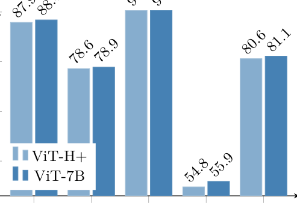
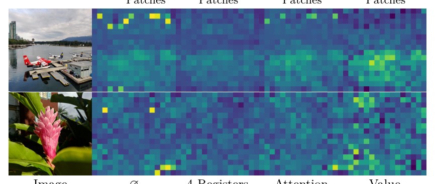
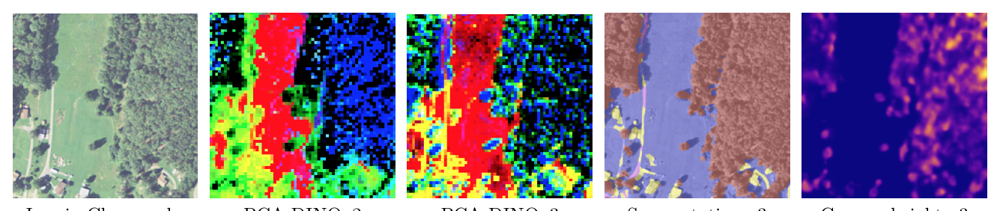

---
category:
  - 深度学习
  - dino
---

# DINOv3 模型参数报告

> **对象**：Meta AI 的 DINOv3 视觉基础模型族（技术报告 arXiv:2508.10104v1，2025-08-13）。
> **目标读者**：希望彻底搞清 DINOv3 每个模型的规模、架构与训练超参的工程师与研究者。
> **数据纪律**：本报告**全部数字均取自本地资料文件**，逐条标注来源；凡资料未给出者一律写「资料未给出」，不做推算或臆造。来源图例见 §12。
> **特别声明**：`sources/hf_facebook_dinov3-*_config.json` 是 HuggingFace gated 模型返回的 **401 错误页**（每份仅 148–156 字节），**不是真实 config，全文任何位置均不引用**。
> **排版风险提示**：`dinov3_paper.txt`（pdftotext -layout 版）的 **Table 20 与 Figure 16 数值列存在错位**；本报告以双栏重排的 `dinov3_paper_clean.txt` 为准，并在关键处用另一版与源码交叉校验。`dinov3_paper_clean.txt` 经 `wc -l` 实测为 **6030 行**（`MANIFEST.md` 里写的 5897 行是旧值，本报告不再沿用）。

### 0. 全文读数约定（单位、有效位、标记）

本节集中声明全文反复出现的三类口径，后文表格不再逐格重复解释，只在需要时用行内短标（全文行内标记一律用上标式方括号，脚注见 §0.3）。

#### 0.1 参数量与 FLOPs 的两套口径

资料里对同一模型存在**两套参数量写法**，本报告两套并列，绝不合并：

| 口径 | 出处 | 写法特征 | 例 |
|---|---|---|---|
| **A 口径（论文 / README）** | 论文 Fig.16a、`dinov3_github_readme.md` 三张模型表、`hf_model_cards.md` 的「Model Architecture」段 | **1–2 位有效数字**，超过 1000 的整数写成带千分位的整数（如 `6,716M`） | `21M`、`86M`、`300M`、`840M`、`6,716M` |
| **B 口径（HF 合集页）** | `hf_dinov3_collection.txt` | **3 位有效数字**的 float 或 1 位小数的 B（如 `0.3B`、`7B`） | `21.6M`、`85.7M`、`0.3B`、`0.8B`、`7B` |

- **换算示例（说明两套口径的偏差来源）**：ViT-S A 口径 `21M`、B 口径 `21.6M`，差 0.6M（约 2.8%）；ConvNeXt-Base A 口径 `89M`、B 口径 `87.6M`，差 1.4M（约 1.6%）。**偏差方向不一致**（有的 A 偏大、有的 A 偏小），说明 A 口径是**四舍五入到 1–2 位有效数字**的结果，而 B 口径更接近精确值。
- **本报告不做二次取整**：凡引用 A 口径就写 A 的原值（`21M`），引用 B 口径就写 B 的原值（`21.6M`），不给第三种写法；需要计算（如显存）时**一律以 A 口径的整数形式代入**，并在式子旁注明所用参数。
- **GFLOPs 只有一套口径**：论文 Fig.16a 的 `Res.256` / `Res.512` 两列，**整数、只给 256×256 与 512×512 两个分辨率**（Fig.16 caption 原文："the GFLOPs estimated on images of size 256 × 256 and 512 × 512"）。论文**没有给其它分辨率的 FLOPs**，本报告不做线性外推，中间分辨率一律写「资料未给出（仅 256/512 两点）」。

#### 0.2 三类行内标记

| 标记 | 含义 | 处理规则 |
|---|---|---|
| 【推导】 | 该数字**不由资料直接给出**，而是由资料中其它已给出量**算术推导**得到 | 必须紧邻给出公式或所用原值；绝不把推导值写成资料原值 |
| 【资料未给出】 | 已在资料中检索但确无该数字 | 不猜测、不补全；若是「上游仓库应有但本地快照未收录」，改写为**【本地快照未收录】**并给出上游路径 |
| ⚠️ | 资料之间存在**冲突**或本报告发现的**易错点** | 一律并列两个来源的值，不擅自取舍 |

#### 0.3 行内说明的集中化

为降低正文视觉噪声，原报告散落在表格单元格里的【推导】【资料未给出】与 ⚠️ 长句，已**集中**到：

- **§12.6**（「资料未给出」总表）、**§12.7**（冲突项总表）——所有「缺」与「冲突」的汇总；
- **§0.1/0.2**（本节的单位与标记规则）；
- 正文只保留**一个短标记**（如 `【推导】`）或**一句指向**（如「推导见 §9.4」）。

#### 0.4 参数量单位口径统一说明（「21M / 21.6M / 0.3B」各自来源）

全文出现过的每一种参数量写法，都可归入下表的三类来源。**写报告、写代码注释、写对外文档时，请按「引用哪一份资料就写该资料的原值」处理，绝不把三种写法互相换算成第三种**（换算演示见 §0.1）：

| 写法 | 归类 | 权威出处（本地资料） | 有效位 / 形态 | 同族写法举例 |
|---|---|---|---|---|
| `21M`、`29M`、`86M`、`300M`、`840M`、`89M`、`198M` | **A 口径** | 论文 Fig.16a；`dinov3_github_readme.md` 三张模型表；`sources/hf_model_cards.md`「Technical Specifications」段 | 1–2 位有效数字的整数 | `50M`、`6716M` |
| `6,716M`（带千分位） | **A 口径（同一来源的另一种排版）** | 论文 Fig.16a；README 三张模型表 | 4 位有效数字、带千分位整数 | 本报告表内为对齐排版写成 `6716M`（去千分位） |
| `21.6M`、`28.7M`、`85.7M`、`27.8M`、`49.5M`、`87.6M` | **B 口径（M 形式）** | `sources/hf_dinov3_collection.txt`（HF 合集页） | 3 位有效数字的 float | — |
| `0.3B`、`0.8B`、`0.2B`、`7B` | **B 口径（B 形式）** | `sources/hf_dinov3_collection.txt`（HF 合集页） | 值以十亿为单位、1 位小数（个别为 1 位有效数字） | `0.3B` = ViT-L，`0.8B` = ViT-H+，`0.2B` = ConvNeXt-L，`7B` = ViT-7B |

**三条统一约定（与 §0.1、§1.2 一致，此处再点名）：**

1. **同一模型两种口径并列，不合并**：例如 ViT-S 写「`21M`（A）/ `21.6M`（B）」，ConvNeXt-Base 写「`89M`（A）/ `87.6M`（B）」。两套的逐模型对照全表在 **§1.2**。
2. **偏差方向不一致**：A 口径把 `21.6M` 舍成 `21M`（向下），却把 `87.6M` 舍成 `89M`（向上），说明 A 口径是**四舍五入到 1–2 位有效数字**的结果，**不是简单截断**；不要用「取 A 的前两位有效数字」去反推。
3. **两个例外**：`ViT-7B` 的 A 口径 `6,716M` 反而比 B 口径 `7B` 更精确；`ViT-L` / `ViT-H+` 的 B 口径写成 `0.3B`/`0.8B`，有效位比 A 口径还少。**「A 更粗、B 更细」不是普适规律**，引用时一律以「该口径的原值」为准。

**计算时用哪个**：本报告凡需代入算式（显存、体积、整 checkpoint 参数量，见 §9.3/§9.4/§9.7）**一律用 A 口径的整数形式**（如 `6716M` 而非 `7B`），并在式子旁注明所用参数；因为 B 口径的 `0.3B`/`0.8B` 本身只有 1 位有效数字，代入会引入不必要的误差。

---

## 目录

0. 全文读数约定（单位、有效位、标记）
1. 速览：一页纸看懂 DINOv3 家族
2. 模型家族全景（含 HF 模型卡规格与官方评测总表）
3. 逐模型明细（12 个 checkpoint）
4. 架构参数深潜（RoPE / RMSNorm / SwiGLU / LayerScale / PatchEmbed / register tokens）
5. 训练超参数表（四套配置逐项对照 + 线性探针 + 卫星 + ConvNeXt 蒸馏）
6. 损失函数参数
7. 数据增强参数表
8. 数据规模参数（LVD-1689M / SAT-493M）
9. 计算资源与开销（含权重显存换算、ConvNeXt 逐 stage 分块、HF 模型卡算力）
10. 下游任务 head 的参数（含各 head 自身参数量与输出维度）
11. 参数速查手册（选型表）
12. 资料出处汇总
13. 合规与许可证参数（DINOv3 License 逐条要点 + 再分发义务）

---

## 1. 速览：一页纸看懂 DINOv3 家族

### 1.1 家族总表（12 个 checkpoint）

| # | 模型 | 参数量 | GFLOPs@256 | GFLOPs@512 | 训练数据 | 来源方式 |
|---|---|---|---|---|---|---|
| 1 | ViT-S/16 | 21M | 12 | 63 | LVD-1689M | 从 ViT-7B 蒸馏 |
| 2 | ViT-S+/16 | 29M | 16 | 79 | LVD-1689M | 从 ViT-7B 蒸馏 |
| 3 | ViT-B/16 | 86M | 47 | 216 | LVD-1689M | 从 ViT-7B 蒸馏 |
| 4 | ViT-L/16 (web) | 300M | 163 | 721 | LVD-1689M | 从 ViT-7B 蒸馏 |
| 5 | ViT-H+/16 | 840M | 450 | 1903 | LVD-1689M | 从 ViT-7B 蒸馏 |
| 6 | ViT-7B/16 (web) | 6,716M | 3550 | 14515 | LVD-1689M | **从零训练**（teacher 本体） |
| 7 | ConvNeXt-Tiny | 29M | 5 | 20 | LVD-1689M | 从 ViT-7B 蒸馏 |
| 8 | ConvNeXt-Small | 50M | 11 | 46 | LVD-1689M | 从 ViT-7B 蒸馏 |
| 9 | ConvNeXt-Base | 89M | 20 | 81 | LVD-1689M | 从 ViT-7B 蒸馏 |
| 10 | ConvNeXt-Large | 198M | 38 | 152 | LVD-1689M | 从 ViT-7B 蒸馏 |
| 11 | ViT-L/16 (satellite) | 300M | 163【推导】 | 721【推导】 | SAT-493M | 从卫星 ViT-7B 蒸馏 |
| 12 | ViT-7B/16 (satellite) | 6,716M | 3550【推导】 | 14515【推导】 | SAT-493M | **从零训练** |

- 来源：参数量与 GFLOPs —— 论文 **Fig.16a**（`dinov3_paper_clean.txt` 第 2681–2694 行；`MANIFEST.md` 第 73–86 行已核实抄录）；家族构成与来源方式 —— `repo/MODEL_CARD.md` 第 7–15 行；训练数据 —— `dinov3_github_readme.md` 三张模型表。
- 【推导】说明：**GFLOPs 只在 Fig.16a 按“架构”给出一次**（ViT-L 与 ViT-7B 各只有一个数值），论文未单独列出卫星版 FLOPs。卫星版是同一架构、同一参数量、同一计算量，故此处沿用同架构数值并标【推导】。
- ConvNeXt **只有 LVD-1689M 版本，没有卫星版**（`README` 三张表中卫星表只有 ViT-L 与 ViT-7B）。
- 注：ViT-7B 在网页与卫星两个数据集上**各有一个 checkpoint**，因此“12 个” = 10 个网页版 + 2 个卫星版。

### 1.2 家族的两套参数量口径（易错点）

资料中存在**两套参数量数值**，本报告在 §2、§3 中并列给出（单位与有效位规则见 §0.1）：

| 模型 | 论文 Fig.16a / README（A 口径） | HF 合集页（B 口径，更精确） |
|---|---|---|
| ViT-S | 21M | 21.6M |
| ViT-S+ | 29M | 28.7M |
| ViT-B | 86M | 85.7M |
| ViT-L | 300M | 0.3B |
| ViT-H+ | 840M | 0.8B |
| ViT-7B | 6716M | 7B |
| ConvNeXt-T | 29M | 27.8M |
| ConvNeXt-S | 50M | 49.5M |
| ConvNeXt-B | 89M | 87.6M |
| ConvNeXt-L | 198M | 0.2B |

- 来源：论文 Fig.16a / README 表 = A 口径（四舍五入到 1–2 位有效数字）；HF 合集页 `hf_dinov3_collection.txt` = B 口径（3 位有效数字）。
- **两套口径的偏差来源**是**取整位数不同**：A 口径把 `21.6M` 写成 `21M`、把 `87.6M` 写成 `89M`（注意后者的舍入方向与前者相反，说明 A 口径并非简单截断）。换算演示见 §0.1。本报告**不把两套口径折算成同一套**，两套都保留原值。
- **两个例外**：`ViT-7B` 的 A 口径 `6716M` 反而比 B 口径 `7B` 更精确（A 给出 4 位有效数字）；`ViT-L` 与 `ViT-H+` 的 B 口径写成 `0.3B`/`0.8B`（有效位比 A 还少）。引用时以「哪个口径的原值」为准，不要假设某口径永远更精确。

### 1.3 家族构成（一句话）

- **web（LVD-1689M）共 10 个**：1 个从零训练的 ViT-7B + 5 个从 ViT-7B 蒸馏的 ViT-S/S+/B/L/H+ + 4 个从 ViT-7B 蒸馏的 ConvNeXt-T/S/B/L。（`repo/MODEL_CARD.md` 第 7–12 行）
- **satellite（SAT-493M）共 2 个**：1 个从零训练的 ViT-7B + 1 个从 ViT-7B 蒸馏的 ViT-L。（`repo/MODEL_CARD.md` 第 13–15 行）
- **只有 ViT-7B 是从零训练，其余全部是蒸馏产物**；蒸馏的 teacher 是**冻结的预训练 ViT-7B**。（`repo/MODEL_CARD.md` 第 118–120 行）

> **配图位置说明（本次修订）**：原报告把论文 **Fig.16(b)（ViT-H+ vs ViT-7B 性能对比）** 的插图放在本节，但本节讲的是「家族构成（10 web + 2 satellite）」，与「ViT-H+/7B 性能对比」无关，且原图注把它称为「参数量—性能对照」而该图**并无参数量坐标**（见下方更正）。本次已把该图**移到 §3.5（ViT-H+）** 并更正图注。

---

## 2. 模型家族全景

### 2.1 ViT 架构超参总表（7 个规格，含未发布的 ViT-L+）

来源：`repo/dinov3_hub_backbones.py`（每个 `dinov3_vit*` 函数的实参，即**线上发布模型的真实构造参数**）+ `repo/dinov3_models_vision_transformer.py`（`DinoVisionTransformer` 类）。

| 模型 | embed_dim | depth | num_heads | head_dim | patch_size | ffn_ratio | ffn_layer | n_storage_tokens | layerscale_init | norm_layer | qkv_bias | mask_k_bias | proj_bias / ffn_bias | drop_path_rate | untie_cls_and_patch_norms | untie_global_and_local_cls_norm |
|---|---|---|---|---|---|---|---|---|---|---|---|---|---|---|---|---|
| ViT-S/16 | 384 | 12 | 6 | 64【推导】 | 16 | 4 | `mlp` | 4 | 1e-5 | `layernormbf16` | True | True | True / True | 0.0 | False | False |
| ViT-S+/16 | 384 | 12 | 6 | 64【推导】 | 16 | **6** | **`swiglu`** | 4 | 1e-5 | `layernormbf16` | True | True | True / True | 0.0 | False | False |
| ViT-B/16 | 768 | 12 | 12 | 64【推导】 | 16 | 4 | `mlp` | 4 | 1e-5 | `layernormbf16` | True | True | True / True | 0.0 | False | False |
| ViT-L/16 (web) | 1024 | 24 | 16 | 64【推导】 | 16 | 4 | `mlp` | 4 | 1e-5 | `layernormbf16` | True | True | True / True | 0.0 | False | False |
| ViT-L/16 (satellite) | 1024 | 24 | 16 | 64【推导】 | 16 | 4 | `mlp` | 4 | 1e-5 | `layernormbf16` | True | True | True / True | 0.0 | False | **True**（SAT 权重时） |
| ViT-H+/16 | 1280 | 32 | 20 | 64【推导】 | 16 | **6.0** | **`swiglu`** | 4 | 1e-5 | `layernormbf16` | True | True | True / True | 0.0 | False | False |
| ViT-7B/16（web & sat） | **4096** | 40 | 32 | **128** | 16 | **3** | **`swiglu64`** | 4 | 1e-5 | `layernormbf16` | **False** | True | True / True | 0.0 | False | **True**（两种权重都 True） |
| **ViT-L+/16**（代码存在，未发布权重） | 1024 | 24 | 16 | 64【推导】 | 16 | **6.0** | `swiglu` | 4 | 1e-5 | `layernormbf16` | True | True | True / True | 0.0 | False | False |

- **所有发布的 ViT 共同点**：`img_size=224`、`patch_size=16`、`in_chans=3`、**4 个 register token（`n_storage_tokens=4`）**、**LayerScale 初值 1e-5**、**RoPE 位置编码**、`drop_path_rate=0.0`、`proj_bias=True`、`ffn_bias=True`、`pos_embed_rope_base=100`、`pos_embed_rope_normalize_coords="separate"`、`pos_embed_rope_rescale_coords=2`、`pos_embed_rope_dtype="fp32"`。（`repo/dinov3_hub_backbones.py`；`repo/dinov3_models_vision_transformer.py`）
- ⚠️ **激活函数不是全体共同点（本报告已更正）**：**只有 `ffn_layer="mlp"` 的分支用 GELU**（`Mlp` 默认 `act_layer=nn.GELU`）；`swiglu` / `swiglu64` 分支是 **SwiGLU，激活固定为 `F.silu`（SiLU/Swish），`act_layer` 参数被接收但完全忽略**（`repo/dinov3_layers_ffn_layers.py` 第 52–77 行 `SwiGLUFFN.forward`：`hidden = F.silu(x1) * x2`）。因此：
  - **GELU 模型** = ViT-S、ViT-B、ViT-L（web + sat）——全部是 `mlp`；
  - **SiLU/SwiGLU 模型** = ViT-S+、ViT-H+、ViT-L+、ViT-7B；
  - 把「GELU 激活」列为「所有发布的 ViT 共同点」**不成立**，也与本报告 §4.4「SwiGLU 固定用 `F.silu`、`act_layer` 未使用」自相矛盾。正确表述是「**按 ffn_layer 分组**」。（`repo/dinov3_hub_backbones.py`；`repo/dinov3_layers_ffn_layers.py`；`hf_model_cards.md` 第 275–280 行「MLP FFN / SwiGLU FFN」分组一致）
- **head_dim**：除 ViT-7B 为 **128** 外，其余全部为 64【推导：embed_dim/num_heads】。论文 **Tab.2** 明确指出 DINOv2 ViT-giant head_dim=64、DINOv3 ViT-7B head_dim=128。
- **SwiGLU 与 MLP 的分布**：`mlp` = ViT-S、ViT-B、ViT-L（含卫星版）；`swiglu` = ViT-S+、ViT-H+、ViT-L+；`swiglu64` = ViT-7B。（`repo/dinov3_hub_backbones.py`；`repo/MODEL_CARD.md` “Technical Specifications” 一致）
- **ffn_ratio**：S/B/L 为 4；S+/H+/L+ 为 6；7B 为 3。
- **qkv_bias**：只有 ViT-7B 是 `False`，其余全为 `True`；这与 7B 更大的 head_dim=128 相配。
- **mask_k_bias=True** 适用于**全部 7 个 ViT 工厂函数**；ConvNeXt 是纯卷积网络，**没有这个参数**（不能拿“12 个模型”来套这个参数）。
- **`untie_global_and_local_cls_norm=True`** 只出现在 **ViT-L(sat)** 与 **ViT-7B（两种权重）**；会给模型额外加一个 `local_cls_norm`，**仅训练时使用，eval 不用**。（`repo/dinov3_models_vision_transformer.py` 第 172–178 行注释）
- ⚠️ **ViT-L+/16（`dinov3_vitl16plus`）在代码中存在，但没有公开权重**：它在 `repo/dinov3_hub_backbones.py`（第 372–408 行）里是一个**完整的 hub 工厂函数**、`repo/hubconf.py` 也导出了它，权重 hash 为 `46503df0`，但 `repo/MODEL_CARD.md` 的 12 个模型清单里**没有它**，`hf_dinov3_collection.txt` 的 HF 合集页里也**没有它**，README 三张模型表同样没有。因此：
  - **参数量**：**资料未给出**（论文 Fig.16a 与 README 表均只列 7 个 ViT 规格中的 6 个，无 L+；本报告不做推算）；
  - **GFLOPs@256 / @512**：**资料未给出**（同上，Fig.16a 无 L+ 行）；
  - **架构超参**：**有**——见 §2.1 表格最后一行（与 ViT-H+ 同族：`swiglu`、`ffn_ratio=6.0`，但 `embed_dim=1024`、`depth=24`、`num_heads=16`，与 ViT-L(web) 同规模）；
  - **它唯一的实际用途**：`repo/dinov3_hub_detectors.py` 第 83–84 行把 `dinov3_vitl16plus` 列为检测 head 可选的 backbone（`n_windows_sqrt=2`），但仓库发布的检测 checkpoint 仍是 ViT-7B 版。**它是「有代码、无权重」的规格，不能与 12 个已发布 checkpoint 混为一谈**（本报告已把它的 hash 行从 §3.13 的 12 模型表中移出，见 §3.14）。

### 2.2 ViT 各规格与代码内 arch 工厂的对照（重要：不要混用）

`repo/dinov3_models_vision_transformer.py` 末尾定义的工厂函数是供**训练配置**用的（`repo/dinov3_models___init__.py` 通过 `vits.__dict__[args.arch]` 调用），与**发布权重**走的两条路径不同——发布权重走 `hub/backbones.py` 里**直接写死**的 `_make_dinov3_vit(...)` 参数。

| 工厂名 arch | embed_dim | depth | num_heads | ffn_ratio（工厂默认） | 备注 |
|---|---|---|---|---|---|
| `vit_small` | 384 | 12 | 6 | 4 | |
| `vit_base` | 768 | 12 | 12 | 4 | |
| `vit_large` | 1024 | 24 | 16 | 4 | 默认训练 arch（`cfg:ssl_default`） |
| `vit_so400m` | 1152 | 27 | 18 | 3.777777778 | |
| `vit_huge2` | 1280 | 32 | 20 | **4** | 注意工厂默认 4，**发布 ViT-H+ 是 6 + swiglu** |
| `vit_giant2` | 1536 | 40 | 24 | 4 | 注释：接近 DINOv2 ViT-giant（即 DINOv2 ViT-g 架构） |
| `vit_7b` | 4096 | 40 | 32 | 3 | 发布 ViT-7B 用 `swiglu64` + qkv_bias False |

来源：`repo/dinov3_models_vision_transformer.py`（模块级函数 `vit_small … vit_7b`）。**写报告时以 §2.1 上表（hub 来源）为准。**

### 2.3 ConvNeXt 架构超参表

来源：`repo/dinov3_models_convnext.py` 第 319–336 行 `convnext_sizes`；`repo/dinov3_hub_backbones.py` 的 `dinov3_convnext_*`。

| 模型 | dims（4 stage） | depths（4 stage） | layer_scale_init_value | drop_path_rate | in_chans |
|---|---|---|---|---|---|
| ConvNeXt-Tiny | [96, 192, 384, 768] | [3, 3, 9, 3] | 1e-6 | 0 | 3 |
| ConvNeXt-Small | [96, 192, 384, 768] | [3, 3, 27, 3] | 1e-6 | 0 | 3 |
| ConvNeXt-Base | [128, 256, 512, 1024] | [3, 3, 27, 3] | 1e-6 | 0 | 3 |
| ConvNeXt-Large | [192, 384, 768, 1536] | [3, 3, 27, 3] | 1e-6 | 0 | 3 |

- ConvNeXt **LayerScale 初值为 1e-6**，与 ViT 的 **1e-5 不同**。（`repo/dinov3_models_convnext.py`；`repo/dinov3_hub_backbones.py`）
- ConvNeXt Block 结构：`depthwise 7×7 conv` → LayerNorm(eps=1e-6) → `pwconv1 (dim→4·dim)` → GELU → `pwconv2 (4·dim→dim)` → LayerScale → 残差。（`repo/dinov3_models_convnext.py` 第 56–69 行）
- ConvNeXt **无 CLS token**，靠卷积 + 全局平均池化当 CLS；**无 register token（`n_storage_tokens=0`）**；`n_blocks=4`（4 个 downsample/stage）。（`repo/dinov3_models_convnext.py`）
- HF 侧 `DINOv3ConvNextConfig` 默认 `image_size=224`、`num_channels=3`、`hidden_act='gelu'`、`layer_norm_eps=1e-6`、`layer_scale_init_value=1e-6`、`drop_path_rate=0.0`、`initializer_range=0.02`；其中 **`hidden_sizes` 与 `depths` 的默认值是 `None`**（即 HF 侧**没有**默认的 4 stage 尺寸，必须由 checkpoint 的 config 显式给出）。（`hf_transformers_dinov3.txt` 第 95–108 行）
- 蒸馏拓扑：ConvNeXt **从 ViT-7B 跨架构蒸馏**——ViT-7B 是带 CLS token 的 transformer，ConvNeXt 是无 CLS 的纯卷积网络，论文称此知识迁移“**并非平凡（non-trivial）**”。（论文 §7.2，`dinov3_paper.txt` 第 1775–1777 行）
- HF 侧 ViT 的默认值见新增的 **§2.5**（原报告只给了 ConvNeXt 的默认值，漏了 ViT 的，本次补齐）。

### 2.4 token 数量表（224×224，patch 16）

| 项目 | 数值 | 来源 |
|---|---|---|
| 224×224 输入、patch 16 → patch token 数 | 14×14 = **196**【推导 224/16=14】 | `repo/MODEL_CARD.md` 第 18 行直接给出 196 |
| 序列长度（224×224） | **1（CLS）+ 4（register）+ 196（patch）= 201 tokens** | `repo/MODEL_CARD.md` 第 18 行原文明确 |
| 对比 DINOv2（patch 14，带 registers） | 16×16=256 patch → **1 + 4 + 256 = 261 tokens** | `repo/MODEL_CARD.md` 第 18 行原文明确 |
| 512×512 输入、patch 16 | 32×32 = **1024** patch token；+5 → **1029** tokens【推导】 | 1024 见论文 **Tab.3 caption**：“to 1024 patch tokens (i.e. 448×448 for patch size 14, 512×512 for patch size 16)” |
| 序列拼接顺序 | `[CLS] ++ [storage tokens] ++ [patch tokens]` | `repo/dinov3_models_vision_transformer.py` `prepare_tokens_with_masks` |
| 输出字典键名 | `x_norm_clstoken`、`x_storage_tokens`、`x_norm_patchtokens`、`x_prenorm`、`masks` | `repo/dinov3_models_vision_transformer.py` 第 252–260 行（ConvNeXt 输出键名完全一致） |

- ⚠️ **HF 文档示例注释存在不一致**：该示例打印 `# [1, 1 + 4 + 256, 384]`，但同一示例中 `patch_size=16`、`pixel_values` 形状 `[1,3,224,224]`，按 224/16=14×14=196 计算应为 `1+4+196=201`。**以 MODEL_CARD 的 201 为准**，HF 注释里的 256 疑似沿用 DINOv2 patch-14 的旧值。（`hf_transformers_dinov3.txt` vs `repo/MODEL_CARD.md`）

### 2.5 HF `DINOv3ViTConfig` 的全部默认值（原报告缺失，本次补齐）

原报告 §2.3 只给了 ConvNeXt 的 HF 默认值，**漏掉了 ViT 的**。以下整段取自 `hf_transformers_dinov3.txt` 第 56 行（`DINOv3ViTConfig` 构造签名默认值），逐项照录：

| 参数 | 默认值 | 参数 | 默认值 |
|---|---|---|---|
| `patch_size` | **16** | `layer_norm_eps` | **1e-05** |
| `hidden_size` | **384** | `rope_theta` | **100.0** |
| `intermediate_size` | **1536** | `image_size` | **224** |
| `num_hidden_layers` | **12** | `num_channels` | **3** |
| `num_attention_heads` | **6** | `query_bias` | **True** |
| `hidden_act` | **`'gelu'`** | `key_bias` | **False** |
| `attention_dropout` | **0.0** | `value_bias` | **True** |
| `initializer_range` | **0.02** | `proj_bias` | **True** |
| `mlp_bias` | **True** | `use_gated_mlp` | **False** |
| `layerscale_value` | **1.0** | `num_register_tokens` | **0** |
| `drop_path_rate` | **0.0** | `pos_embed_shift` | `None` |
| `pos_embed_jitter` | `None` | `pos_embed_rescale` | **2.0** |
| `apply_layernorm` | **True** | `reshape_hidden_states` | **True** |

（`hf_transformers_dinov3.txt` 第 56 行一段；该段同时给出 `attention_dropout`、`initializer_range` 等。）

**三处必须点名的默认值 vs 实际发布权重的差异：**

1. **`num_register_tokens` 默认 `0`，但全部发布 ViT 的实际值是 `4`。** HF 文档自己的示例里 `print("Num register tokens:", model.config.num_register_tokens) # 4`（第 43 行）——即从 `facebook/dinov3-*`加载时 config.json 把它覆盖成 4，而 `DINOv3ViTConfig()` **裸构造**（不带任何 checkpoint）时是 0。**建参数量报告时必须区分「类默认」与「发布 config 实际值」**：本报告的 register 数一律以 `n_storage_tokens=4`（hub/权重侧）为准。
2. **`hidden_act='gelu'` 与 `use_gated_mlp=False` 是「最小模型」默认**：对应 ViT-S（`mlp` + GELU）。⚠️ **S+/H+/L+/7B 的发布 `use_gated_mlp` 值：官方资料未给出**——`DINOv3ViTConfig` 只给出**类默认** `use_gated_mlp=False`（`hf_transformers_dinov3.txt` 第 56 行），而**发布模型的真实 `config.json` 受 HuggingFace gated（401）拦截、无法读取**（见 §12.5/§12.6），HF 文档的示例**只打印过 `num_register_tokens` 的实际值**（第 43 行 `# 4`），**从未打印 `use_gated_mlp`**。若按「HF 用 `use_gated_mlp` 表示 SwiGLU」的语义（同文件第 77 行参数说明 `Whether to use the SwiGLU feedforward neural network`）**【推导】**，则 S+/H+/L+/7B 的发布值应为 `True`，与 §2.1/§2.3 的 `swiglu` 分组一致；**但这是本报告的推理、不是资料原值**，引用发布配置时一律写「官方资料未给出」。（原报告此处直接写成「应为 True」而未标【推导】，本次已改为显式推理。）
3. **`layer_norm_eps=1e-5` 与 hub 的 `layernormbf16`（eps=1e-5）一致**，而 ConvNeXt 侧 `layer_norm_eps=1e-6`（§2.3）；两族不同，勿混用。
4. **`query_bias=True / key_bias=False / value_bias=True` 是 HF 对 qkv 三个投影分别建模的写法**，它把「K 分支 bias 被屏蔽」这一 hub 侧 `mask_k_bias=True` + `LinearKMaskedBias` 的行为**等价表达**为 `key_bias=False`（hub 侧是「有 bias 参数但前向乘 0」）。**两者语义等价、实现不同**，对照见 §4.2。注意：ViT-7B 在 hub 侧是 `qkv_bias=False`（三个投影都无 bias），与 HF 默认的 `key_bias=False`（仅 K 无 bias）**不是同一回事**——不要把 HF 默认误当成 ViT-7B 的配置。

### 2.6 逐模型官方架构规格（HuggingFace 模型卡）

> **本节与 §2.1/§2.3 的区别（务必分清来源）**：§2.1/§2.3 的架构表取自**官方仓库源码**（`repo/dinov3_hub_backbones.py`、`repo/dinov3_models_convnext.py`）；本节的**维度、头数、register 数、FFN 类型、位置编码来自 HuggingFace 官方模型卡**（`sources/hf_model_cards.md`），**层数（depth）HF 卡不给**，由仓库源码与已核查笔记补齐（`repo/dinov3_models___init__.py` → `vits.__dict__[args.arch]` 调用 `repo/dinov3_models_vision_transformer.py` 的工厂函数；`repo/dinov3_hub_backbones.py`；`notes/family.md` §2）。两处若同项数值一致，本节只作引用；若口径不同，在本节行内点名。

#### 2.6.1 ViT 六个规格（HF 卡维度/头数 + repo 层数 = 完整规格）

来源：HF 卡「Technical Specifications → Model Architecture and Objective → Vision Transformer models」段（`sources/hf_model_cards.md` 第 1 张卡第 274–280 行；**四张卡正文逐字节相同**，仅 pipeline/AutoModel 示例里的 repo id 不同）；层数一列来自仓库源码与 `notes/family.md` §2。

| 模型 | 参数量（HF 卡） | patch size | embed dim | attention heads | register tokens | FFN 类型 | 位置编码 | **depth（层数，repo 来源）** | 拼合后的完整规格（embed / depth / heads） |
|---|---|---|---|---|---|---|---|---|---|
| DINOv3 ViT-S | 21M | 16 | 384 | 6 | 4 | **MLP** | RoPE | **12** | 384 / 12 / 6 |
| DINOv3 ViT-S+ | 29M | 16 | 384 | 6 | 4 | **SwiGLU** | RoPE | **12** | 384 / 12 / 6 |
| DINOv3 ViT-B | 86M | 16 | 768 | 12 | 4 | **MLP** | RoPE | **12** | 768 / 12 / 12 |
| DINOv3 ViT-L | 300M | 16 | 1024 | 16 | 4 | **MLP** | RoPE | **24** | 1024 / 24 / 16 |
| DINOv3 ViT-H+ | 840M | 16 | 1280 | 20 | 4 | **SwiGLU** | RoPE | **32** | 1280 / 32 / 20 |
| DINOv3 ViT-7B | 6716M | 16 | 4096 | 32 | 4 | **SwiGLU** | RoPE | **40** | 4096 / 40 / 32 |

**MLP 与 SwiGLU 的分界（HF 卡原文，务必区分）**——HF 卡把六个 ViT 明确分成两组（`sources/hf_model_cards.md` 第 1 张卡第 275–280 行，逐字）：

- **MLP FFN**：ViT-S（21M）、ViT-B（86M）、ViT-L（300M）；
- **SwiGLU FFN**：ViT-S+（29M）、ViT-H+（840M）、ViT-7B（6716M）。

原文举例（第 1 张卡，逐字）：第 275 行 `ViT-S (21M parameters): patch size 16, embedding dimension 384, 4 register tokens, 6 heads, MLP FFN, RoPE`；第 276 行 `ViT-S+ (29M parameters): patch size 16, embedding dimension 384, 4 register tokens, 6 heads, SwiGLU FFN, RoPE`；第 280 行 `ViT-7B (6716M parameters): patch size 16, embedding dimension 4096, 4 register tokens, 32 heads, SwiGLU FFN, RoPE`。

**与源码的交叉核对（两处一致，说明 HF 卡不是另一套规格）**：

- HF 卡的 FFN 分组与 hub 的 `ffn_layer` 分组**完全一致**：`mlp` = ViT-S/B/L，`swiglu`/`swiglu64` = ViT-S+/H+/7B（§2.1；`repo/dinov3_hub_backbones.py`）。**HF 卡只区分「MLP / SwiGLU」，不区分 `swiglu` 与 `swiglu64` 的 `align_to` 对齐档位**——ViT-7B 的 `swiglu64`（hidden 对齐到 64、配合 FP8 的 64 元素 tile，见 §4.4/§4.8）**只有源码给出，HF 卡未给出**。
- HF 卡的 embed dim / heads / register tokens 与 §2.1（hub 来源）**逐项相同**；`register tokens = 4` 与 hub 的 `n_storage_tokens=4`、论文 Tab.2「Registers 4」三处一致。
- HF 卡**只列 6 个 ViT 规格**（S/S+/B/L/H+/7B），**没有 ViT-L+**（`dinov3_vitl16plus`）——与 §2.1/§3.14 的结论一致：ViT-L+ 属「有代码、无权重」，HF 卡亦未收录。

**HF 卡自身的共同点（`sources/hf_model_cards.md` 第 1 张卡第 18–19 行，逐字）**：每个 Transformer 模型输入图像，输出 **class token、patch tokens（及 register tokens）**，patch size **16**；224×224 输入 → **1 class token + 4 register tokens + 196 patch tokens = 201 tokens**（对比 DINOv2 with registers：`1 + 4 + 256 = 261`）。可接受更大图像，条件是尺寸为 patch size（16）的整数倍，否则裁剪到最接近的**较小**的 patch size 倍数。

#### 2.6.2 ConvNeXt 四个规格（HF 卡参数量 + repo 通道/深度）

来源：HF 卡「ConvNeXt models」段（`sources/hf_model_cards.md` 第 1 张卡第 281–285 行，逐字；四卡一致）；通道 `dims` 与深度 `depths` 来自 `repo/dinov3_models_convnext.py` 的 `convnext_sizes`（第 319–336 行）+ §2.3。

| 模型 | 参数量（HF 卡） | dims（4 stage 通道，repo） | depths（4 stage，repo） | patch_size 语义 | attention heads | register tokens |
|---|---|---|---|---|---|---|
| DINOv3 ConvNeXt Tiny | 29M | `[96, 192, 384, 768]` | `[3, 3, 9, 3]` | 无（卷积网络，`patch_size` 仅用于把特征图重采样到 ViT 网格） | **不适用**（纯卷积，无注意力头） | **0**（`n_storage_tokens=0`） |
| DINOv3 ConvNeXt Small | 50M | `[96, 192, 384, 768]` | `[3, 3, 27, 3]` | 同上 | 不适用 | 0 |
| DINOv3 ConvNeXt Base | 89M | `[128, 256, 512, 1024]` | `[3, 3, 27, 3]` | 同上 | 不适用 | 0 |
| DINOv3 ConvNeXt Large | 198M | `[192, 384, 768, 1536]` | `[3, 3, 27, 3]` | 同上 | 不适用 | 0 |

- HF 卡原文（第 1 张卡，逐字）：`ConvNeXt Tiny (29M parameters)` / `ConvNeXt Small (50M parameters)` / `ConvNeXt Base (89M parameters)` / `ConvNeXt Large (198M parameters)`（第 282–285 行）。
- HF 卡**只给 ConvNeXt 的参数量**，**不给 dims / depths / patch size / heads**（`sources/hf_model_cards.md` 该段仅四行，每行一个模型名 + 参数量）——**通道与深度必须回到 `convnext_sizes` 取**（§2.3）。
- **「attention heads / register tokens」对 ConvNeXt 是「不适用」而非「资料未给出」**：ConvNeXt 是纯卷积网络，架构里不存在多头注意力（`repo/dinov3_models_convnext.py` 无任何 attention 模块），也没有 register token（`n_storage_tokens=0`，§2.3）。**不要把 ViT 的 6/12/16/20/32 头去套 ConvNeXt**。
- **两套口径的差异（HF 卡 vs HF 合集页）**：HF 卡的 ConvNeXt 参数量（29M/50M/89M/198M）与论文 Fig.16a/README（A 口径）一致，而 `hf_dinov3_collection.txt`（B 口径）给的是 27.8M/49.5M/87.6M/0.2B——**同一份 HF 生态内就有两套**（模型卡 A 口径 vs 合集页 B 口径），逐模型对照见 §1.2。

### 2.7 官方评测结果总表（HuggingFace 模型卡）

> **来源与口径声明（本节最关键的一点）**：以下三张表**逐字取自 HuggingFace 官方模型卡的「Evaluation → Results」段**（`sources/hf_model_cards.md`，四张卡正文相同，行号以第 1 张卡为准）。
> **与论文表的区别**：**论文 Table 14 / Table 15 / Table 18 与 HF 模型卡表是同一批基准、但不同「表」**——同一指标的数字可能来自论文口径或 HF 卡口径，**本报告分别注明来源，不把两者当同一张表**。就本批数字而言，HF 卡 web ViT 表与论文 Tab.14 的 S/S+/B/L/H+ 行**除一处外**逐格一致（**唯一不同格 = ViT-L 的 SPair：HF 卡 61.3 vs 论文 61.2**，见 §2.7.1）、HF 卡 web ConvNeXt 表与论文 Tab.15 的 DINOv3 行逐格一致、HF 卡卫星 GEO-Bench 表与论文 Tab.18 的对应行一致（**但 HF 卡多了 ViT-7B 行，论文 Tab.14 没有 7B 行**——这是两表最主要的差别）。引用时请写清「HF 模型卡表」还是「论文 Tab.N」。

#### 2.7.1 web（LVD-1689M）ViT 完整评测表（HF 模型卡）

来源：HF 卡「Results for ViT backbones pretrained (or distilled) on web (LVD-1689M)」表（`sources/hf_model_cards.md` 第 1 张卡第 91–163 行，表体第 104–163 行）。列分组（HTML `colspan` 实测）：**Global Tasks** = IN-ReaL / IN-R / Obj.Net / Ox.-H；**Dense Tasks** = ADE20k / NYU↓ / DAVIS / NAVI / SPair。

| Model | IN-ReaL | IN-R | Obj.Net | Ox.-H | ADE20k | NYU↓ | DAVIS | NAVI | SPair |
|---|---|---|---|---|---|---|---|---|---|
| DINOv3 ViT-S/16 | 87.0 | 60.4 | 50.9 | 49.5 | 47.0 | 0.403 | 72.7 | 56.3 | 50.4 |
| DINOv3 ViT-S+/16 | 88.0 | 68.8 | 54.6 | 50.0 | 48.8 | 0.399 | 75.5 | 57.1 | 55.2 |
| DINOv3 ViT-B/16 | 89.3 | 76.7 | 64.1 | 58.5 | 51.8 | 0.373 | 77.2 | 58.8 | 57.2 |
| DINOv3 ViT-L/16 | 90.2 | 88.1 | 74.8 | 63.1 | 54.9 | 0.352 | 79.9 | 62.3 | 61.3 |
| DINOv3 ViT-H+/16 | 90.3 | 90.0 | 78.6 | 64.5 | 54.8 | 0.352 | 79.3 | 63.3 | 56.3 |
| DINOv3 ViT-7B/16 | 90.4 | 91.1 | 91.1 | 72.8 | 55.9 | 0.309 | 79.7 | 64.4 | 58.7 |

- **NYU↓ 是「越低越好」指标**（列名自带 ↓），即 ViT-7B 的 0.309 最优（论文 Tab.14 中 **DINOv2 ViT-L** 的 NYU 为 **0.394**，DINOv3 ViT-L 为 0.352；**DINOv2 ViT-g/14 的 NYU 值论文 Tab.14 与 HF 卡均未给出**，对照见 §11）。**除 NYU↓ 外其余列都是越高越好。** ⚠️ **归属更正（本次修订）**：原报告在 NYU 说明里写「DINOv2 **ViT-g/14** 为 0.394」，**这是错的**——论文 Tab.14 的 `0.394` 属于 **DINOv2（ViT-L）** 行（`dinov3_paper_clean.txt` 第 2765 行 `48.8 0.394 73.4 59.9 57.0`；`dinov3_paper.txt` 第 1684 行整行逐字为 `L  DINOv2 … 48.8  0.394 73.4  59.9  57.0`，行首 Size 标签就是 `L`）。全文仅此一处 `0.394`，快照里检索不到任何 DINOv2 ViT-g/14 的 NYU 值。
- 表前一句原文（第 90 行，逐字）：`The reader is referred to the associated paper for details on the evaluation protocols`——即 **HF 卡只给结果、不给评测协议**，协议要回论文（§10.7）。
- 与论文 Tab.14 的关系：S/S+/B/L/H+ 五行与论文 Tab.14 的 DINOv3 行**除一处外逐格一致**——⚠️ **唯一不同格是 ViT-L 的 SPair**：HF 卡与本仓库 `repo/MODEL_CARD.md` 均为 **61.3**（`hf_model_cards.md` 第 143 行、`repo/MODEL_CARD.md` 第 200 行），论文 Tab.14 为 **61.2**（`dinov3_paper_clean.txt` 第 2766 行 `54.9 0.352 79.9 62.3 61.2`；`dinov3_paper.txt` 第 1685 行）。**其余各格（全局 4 列 + dense 的 ADE20k/NYU/DAVIS/NAVI，以及 S/S+/B/H+ 的全部格）确一致**；故原报告「逐格一致」是过度陈述，本次已改为「除 ViT-L SPair 一处（61.3 vs 61.2）外其余一致」。**ViT-7B 行是 HF 卡独有**（论文 Tab.14 没有 7B，7B 的相应结果在 Tab.3/Fig.16b 等处，见 §12.4）。

#### 2.7.2 web（LVD-1689M）ConvNeXt 完整评测表（HF 模型卡，区分 @256 / @512）

来源：HF 卡「Results for ConvNeXt backbones distilled on web (LVD-1689M)」表（第 1 张卡第 164–214 行，表体第 179–214 行；列结构经 `sources/hfcard_facebook_dinov3-convnext-base-pretrain-lvd1689m.html` 的 HTML `colspan` 实测校正）。

**列结构（务必照此读，否则会把子表头配错列）**：Global Tasks 的 **IN-ReaL、IN-R、Obj.Net 各含 `@256px` 与 `@512px` 两列**（`colspan=2`）；Dense Tasks 的 **ADE20k、NYU↓ 各为单列**（`colspan=1`，**不带 @256/@512 之分**）。故每行 = 6 个分辨率数值 + ADE20k + NYU↓ = 8 个数值。

| Model | IN-ReaL @256px | IN-ReaL @512px | IN-R @256px | IN-R @512px | Obj.Net @256px | Obj.Net @512px | ADE20k | NYU↓ |
|---|---|---|---|---|---|---|---|---|
| DINOv3 ConvNeXt Tiny | 86.6 | 87.7 | 73.7 | 74.1 | 52.6 | 58.7 | 42.7 | 0.448 |
| DINOv3 ConvNeXt Small | 87.9 | 88.7 | 73.7 | 74.1 | 52.6 | 58.7 | 44.8 | 0.432 |
| DINOv3 ConvNeXt Base | 88.5 | 89.2 | 77.2 | 78.2 | 56.2 | 61.3 | 46.3 | 0.420 |
| DINOv3 ConvNeXt Large | 88.9 | 89.4 | 81.3 | 82.4 | 59.3 | 65.2 | 47.8 | 0.403 |

- **映射依据（逐字，HTML `colspan`）**：表头行 `Model`(cs=1)、`IN-ReaL`(cs=2)、`IN-R`(cs=2)、`Obj.Net`(cs=2)、`ADE20k`(cs=1)、`NYU↓`(cs=1)；`Global Tasks`(cs=6)、`Dense Tasks`(cs=2)。子表头行 `(空)`(cs=1)、`@256px`、`@512px`、`@256px`、`@512px`、`@256px`、`@512px`、`(空)`(cs=2)。**若只看 `hf_model_cards.md` 的线性化文本，会把 3 组 `@256px/@512px` 误配到错误列**——此处以 HTML 结构为准。
- **与论文 Tab.15 的关系**：本表四行与论文 **Tab.15 的 DINOv3 行逐格一致**（Tab.15 同时还给了监督 ImageNet-22k 基线行，见 `notes/family.md` §9.4）。论文 Tab.15 caption 明确：**global tasks 在 256 与 512 两档评测，ADE20k 在 512、NYU 在 640**（`notes/family.md` §9.4 引 `dinov3_paper.txt` 第 1742–1745 行）——**这正是本表 ADE20k/NYU↓ 不标分辨率的原因**（它们在固定分辨率评测，global 三列才分 256/512）。
- **与监督基线的对比（论文 Tab.15，供选型参考）**：ConvNeXt-T 的 ADE20k 由监督版 24.8 提到 **42.7（+17.9 mIoU）**，ConvNeXt-L 由 33.3 提到 **47.8（+14.5 mIoU）**（`dinov3_paper.txt` Tab.15 附近正文）。**这两个增量出自论文正文，不是 HF 卡**（HF 卡表不含监督基线行）。

#### 2.7.3 卫星（SAT-493M）GEO-Bench 分类与分割表（HF 模型卡）

来源：HF 卡「Results for ViT backbones pretrained (or distilled) on satellite (SAT-493M)」两表（第 1 张卡第 215–265 行；原始卡中为同一 `<table>` 内的两段，以一行 `(GEO-Bench) Segmentation` 分隔）。**只有 ViT-L 与 ViT-7B 两行**（卫星模型共 2 个：ViT-7B 从零训练 + ViT-L 蒸馏）。

**(GEO-Bench) Classification**（指标 m-* 为各数据集均值，mean 为总均值）：

| Model | m-BEnet | m-brick-kiln | m-eurosat | m-forestnet | m-pv4ger | m-so2sat | mean |
|---|---|---|---|---|---|---|---|
| DINOv3 ViT-L/16 | 73.0 | 96.5 | 94.1 | 60.6 | 96.0 | 57.4 | 79.6 |
| DINOv3 ViT-7B/16 | 74.0 | 97.2 | 94.8 | 62.3 | 96.1 | 62.1 | 81.1 |

**(GEO-Bench) Segmentation**：

| Model | m-cashew | m-chesapeake | m-NeonTree | m-nz-cattle | m-pv4ger-seg | m-SA-crop | mean |
|---|---|---|---|---|---|---|---|
| DINOv3 ViT-L/16 | 94.2 | 75.6 | 61.8 | 83.7 | 95.2 | 36.8 | 74.5 |
| DINOv3 ViT-7B/16 | 94.1 | 76.6 | 62.6 | 83.4 | 95.5 | 37.6 | 75.0 |

- **非单调提示**：`m-cashew` 在 7B 上由 94.2 **略降**到 94.1（分割表其余列基本上升，mean 仍由 74.5 升到 75.0）；分类表则单调上升（79.6 → 81.1）。**不要断言「7B 在每一项上都优于 ViT-L」。**
- **与论文 Tab.18 的关系**：本表两行与论文 Tab.18 的 `DINOv3 Sat` 行一致；论文 Tab.18 **另含 `DINOv3 Web ViT-7B` 行**（分类 mean **81.6**、分割 mean **75.9**，均略高于卫星版；`notes/family.md` §9.7），**HF 卡这两张表不含 Web 行**。论文正文称在 12/15 个分类、分割、3D 任务上取得 SOTA（frozen backbone、RGB-only 输入）。
- **推理协议（论文 App. D.13，非 HF 卡）**：GEO-Bench 分类用线性分类器 2400 iter、batch 32、SGD + cosine、lr 在 1e-5…1 间选优（§10.7）。HF 卡只给结果不给协议。

#### 2.7.4 非 DINOv3 基线对照表（论文 Tab.14 / Tab.15；本次补齐选型对照）

> **为什么补**：原报告只零星引用 PEcore / SigLIP 2 / 监督 ImageNet-22k 基线的个别数字，**未成表**，导致「DINOv3 到底比谁强、强多少」缺完整对照。本节把论文 **Tab.14**（含 PEcore / SigLIP 2 / DINOv2 基线）与 **Tab.15**（含监督 ImageNet-22k 基线）两张表的**非 DINOv3 行**补成表。
> **口径**：数值逐行取自 `dinov3_paper_clean.txt`（双栏重排版，第 2707–2720 行 = Tab.14；第 2843–2904 行 = Tab.15）。**Tab.14 的 DINOv3 五行已与 HF 模型卡（§2.7.1）逐格交叉验证一致**（唯一例外 ViT-L SPair，见 §2.7.1）；**Tab.15 的 DINOv3 四行已与 HF 模型卡（§2.7.2）逐格交叉验证一致**——故可作为可信基准，而**基线行的全局列仅来自本表重排、无第二来源可交叉验证**（`dinov3_paper.txt` layout 版该表全局列存在错位，见文首「排版风险提示」），引用基线全局数值时请以本表出处为准。

**表 A：论文 Tab.14 全表（Size / Model 两个标签列 + 4 全局指标 + 5 稠密指标）**

| Size | Model | IN-ReaL | IN-R | Obj. | Ox.-H | ADE20k | NYU↓ | DAVIS | NAVI | SPair |
|---|---|---|---|---|---|---|---|---|---|---|
| S | DINOv2 | 87.3 | 54.0 | 47.8 | 39.5 | 45.5 | 0.446 | 73.6 | 53.4 | 51.6 |
| S | **DINOv3** | 87.0 | 60.4 | 50.9 | 49.5 | 47.0 | 0.403 | 72.7 | 56.3 | 50.4 |
| S+ | **DINOv3** | 88.0 | 68.8 | 54.6 | 50.0 | 48.8 | 0.399 | 75.5 | 57.1 | 55.2 |
| B | PEcore | 87.5 | 68.4 | 57.9 | 20.2 | 37.4 | 0.641 | 44.5 | 41.8 | 13.7 |
| B | SigLIP 2 | 89.3 | 80.6 | 66.9 | 20.2 | 41.6 | 0.512 | 63.2 | 45.4 | 32.8 |
| B | DINOv2 | 89.0 | 68.4 | 57.3 | 51.0 | 48.4 | 0.416 | 72.9 | 56.9 | 57.1 |
| B | **DINOv3** | 89.3 | 76.7 | 64.1 | 58.5 | 51.8 | 0.373 | 77.2 | 58.8 | 57.2 |
| L | PEcore | 90.1 | 87.7 | 74.9 | 25.6 | 39.7 | 0.650 | 48.2 | 42.1 | 19.2 |
| L | SigLIP 2 | 90.1 | 89.2 | 75.0 | 21.4 | 43.6 | 0.484 | 66.3 | 47.8 | 41.9 |
| L | DINOv2 | 89.7 | 79.1 | 64.7 | 55.7 | 48.8 | **0.394** | 73.4 | 59.9 | 57.0 |
| L | **DINOv3** | 90.2 | 88.1 | 74.8 | 63.1 | 54.9 | 0.352 | 79.9 | 62.3 | 61.2 |
| SO400m | SigLIP 2 | 90.3 | 90.4 | 76.2 | 23.0 | 44.0 | 0.402 | 64.8 | 48.8 | 38.7 |
| H+ | **DINOv3** | 90.3 | 90.0 | 78.6 | 64.5 | 54.8 | 0.352 | 79.3 | 63.3 | 56.3 |

- **读法与要点**：
  - 表中 `L / DINOv2` 行的 **NYU↓ = 0.394**——这正是 §2.7.1 里 `0.394` 的真实归属（**DINOv2 ViT-L，不是 ViT-g/14**）。
  - **DINOv2 基线只覆盖 S / B / L 三档**（论文未给 DINOv2 ViT-g/14 行）；**PEcore / SigLIP 2 覆盖 B / L（未来还有 SO400m SigLIP 2）**。
  - 同为 B 规模：DINOv3 ViT-B 的 ADE20k **51.8** 比 DINOv2 ViT-B **48.4** 高 **+3.4**（与 §3.3 一致）；比 SigLIP 2（41.6）高 **+10.2**、比 PEcore（37.4）高 **+14.4**。
  - 同为 L 规模：DINOv3 ViT-L 的 ADE20k **54.9** 比 DINOv2 ViT-L **48.8** 高 **+6.1**；比 SigLIP 2（43.6）+11.3、比 PEcore（39.7）+15.2。
  - ⚠️ **全局指标（IN-ReaL/IN-R/Obj.）DINOv3 并非每档都第一**：B 档 SigLIP 2 的 IN-ReaL（89.3）与 DINOv3 ViT-B（89.3）持平、Obj.（66.9）高于 DINOv3 的 64.1；L 档 SO400m SigLIP 2 的 IN-R（90.4）高于同档最强 DINOv3（88.1）。**DINOv3 的优势集中在稠密任务（ADE20k/NYU/DAVIS/NAVI/SPair）**——与论文 §7.1 的结论一致。

**表 B：论文 Tab.15（ConvNeXt 蒸馏 vs **监督 ImageNet-22k 预训练**基线；global 指标分 @256/@512）**

| Size | Model | IN-ReAL@256 | IN-ReAL@512 | IN-R@256 | IN-R@512 | Obj.@256 | Obj.@512 | ADE20k | NYU↓ |
|---|---|---|---|---|---|---|---|---|---|
| T | Sup.（ImageNet-22k） | 87.3 | 83.0 | 45.0 | 33.0 | 44.5 | 27.1 | 24.8 | 0.666 |
| T | **DINOv3** | 86.6 | 87.7 | 73.7 | 74.1 | 52.6 | 58.7 | 42.7 | 0.448 |
| S | Sup. | 88.9 | 86.8 | 52.8 | 39.1 | 50.8 | 40.0 | 22.6 | 0.630 |
| S | **DINOv3** | 87.9 | 88.7 | 73.7 | 74.1 | 52.6 | 58.7 | 44.8 | 0.432 |
| B | Sup. | 89.3 | 87.8 | 57.3 | 46.2 | 53.6 | 46.5 | 26.5 | 0.596 |
| B | **DINOv3** | 88.5 | 89.2 | 77.2 | 78.2 | 56.2 | 61.3 | 46.3 | 0.420 |
| L | Sup. | 89.6 | 88.1 | 58.4 | 46.6 | 55.0 | 47.7 | 33.3 | 0.567 |
| L | **DINOv3** | 88.9 | 89.4 | 81.3 | 82.4 | 59.3 | 65.2 | 47.8 | 0.403 |

- **读法与要点（论文正文原话）**：
  - **ADE20k 增益**：ConvNeXt-T 由监督版 24.8 提到 **42.7（+17.9 mIoU）**；ConvNeXt-L 由 33.3 提到 **47.8（+14.5 mIoU）**（`dinov3_paper_clean.txt` 第 2864–2865 行，逐字 `+17.9 mIoU (42.7 versus 24.8)` / `(47.8 versus 33.3)`）。**这两条增量出自论文正文，不是 HF 卡**（HF 卡表不含监督行）。
  - **监督基线的反向趋势**：论文原文 `as we found the supervised models to significantly degrade at resolution 512`、`with the supervised ConvNeXts significantly degrading, whereas our models scale with increased input resolution`（`dinov3_paper.txt` 第 1751、1773 行）。表 B 可直接看出：监督行的 @512 全局指标普遍低于 @256（如 T Sup. 的 IN-R 45.0→33.0、Obj. 44.5→27.1），而 DINOv3 行相反（IN-R 73.7→74.1、Obj. 52.6→58.7）。
  - ⚠️ **在 256 分辨率的 in-distribution 分类上，DINOv3 略落后监督版**：论文原话 `on in-distribution image classification, our models slightly lag behind the supervised ones at resolution 256 (e.g. -0.7 IN-ReAL for CNX-T)`（`dinov3_paper.txt` 第 1771–1772 行）——表中 T 档 DINOv3 的 IN-ReAL@256 = 86.6 vs 监督 87.3，差 **−0.7**，与论文一致。
  - **本表也是 §2.7.2 的来源**：§2.7.2 的 HF 卡 ConvNeXt 表就是本表 4 个 **DINOv3** 行（且已逐格交叉验证一致），HF 卡**不含**监督 Sup. 行。

---

## 3. 逐模型明细（12 个 checkpoint）

> 本节每个模型一小节，含：架构超参表、checkpoint 名称（torch.hub 名 + HF repo id + 权重文件名）、输入预处理、适用场景。
> **去重约定（本次修订）**：**参数量与 GFLOPs 的「权威出处」是 §1.1 家族总表**；§2.1 给架构超参、§3 给各 checkpoint 的**新增信息**（hub 名 / HF id / 权重文件名与 hash / 预处理 / 适用场景）——三处若出现同一数字，一律以 §1.1 为准，其余章节只作 **§1.1 同值引用**，不再独立复述（原报告在 §1.1、§3.x、§11.1 三处重复同一组参数量/GFLOPs，本次已在 §3、§11.1 弱化，避免改一处漏两处）。
> 权重 URL 前缀 `{_DINOV3_BASE_URL}` 的字面值**资料未给出**（见 §3.13），官方唯一入口是 `https://ai.meta.com/resources/models-and-libraries/dinov3-downloads/`（需申请并接受条款，批准后由邮件发送全部权重 URL 列表）。

### 3.1 ViT-S/16（web）

| 项 | 值 |
|---|---|
| 参数量 | 21M（README/Fig.16a） / 21.6M（HF-coll） |
| GFLOPs | 12 @256、63 @512（Fig.16a） |
| embed_dim / depth / heads | 384 / 12 / 6 |
| ffn_layer / ffn_ratio | `mlp` / 4 |
| patch_size / registers | 16 / 4 |
| torch.hub 名 | `dinov3_vits16` |
| HF repo id | `facebook/dinov3-vits16-pretrain-lvd1689m` |
| 权重文件名 | `dinov3_vits16_pretrain_lvd1689m-08c60483.pth`（hash `08c60483`） |
| 预处理（LVD） | mean (0.485, 0.456, 0.406) / std (0.229, 0.224, 0.225)，resize 256 |
| 适用场景 | 边缘/移动端、需极小算力的分类与检索 |

### 3.2 ViT-S+/16（web）

| 项 | 值 |
|---|---|
| 参数量 | 29M / 28.7M（HF-coll） |
| GFLOPs | 16 @256、79 @512 |
| embed_dim / depth / heads | 384 / 12 / 6 |
| ffn_layer / ffn_ratio | **`swiglu`** / **6** |
| patch_size / registers | 16 / 4 |
| torch.hub 名 | `dinov3_vits16plus` |
| HF repo id | `facebook/dinov3-vits16plus-pretrain-lvd1689m` |
| 权重文件名 | `dinov3_vits16plus_pretrain_lvd1689m-4057cbaa.pth`（hash `4057cbaa`） |
| 预处理（LVD） | 同 §3.1 |
| 适用场景 | 算力略高于 ViT-S，但 dense 指标全面提升（ADE20k 47.0→48.8） |
| 论文分辨率稳定性 | ViT-S+ 在 **896×512 到 3584×2048** 之间特征保持稳定（Fig.17） |

### 3.3 ViT-B/16（web）

| 项 | 值 |
|---|---|
| 参数量 | 86M / 85.7M（HF-coll） |
| GFLOPs | 47 @256、216 @512 |
| embed_dim / depth / heads | 768 / 12 / 12 |
| ffn_layer / ffn_ratio | `mlp` / 4 |
| patch_size / registers | 16 / 4 |
| torch.hub 名 | `dinov3_vitb16` |
| HF repo id | `facebook/dinov3-vitb16-pretrain-lvd1689m` |
| 权重文件名 | `dinov3_vitb16_pretrain_lvd1689m-73cec8be.pth`（hash `73cec8be`） |
| 预处理（LVD） | 同 §3.1 |
| 适用场景 | **性价比拐点**：ADE20k 51.8，比同规模 DINOv2 ViT-B（48.4）高 +3.4 mIoU |

### 3.4 ViT-L/16（web）

| 项 | 值 |
|---|---|
| 参数量 | 300M / 0.3B（HF-coll） |
| GFLOPs | 163 @256、721 @512 |
| embed_dim / depth / heads | 1024 / 24 / 16 |
| ffn_layer / ffn_ratio | `mlp` / 4 |
| patch_size / registers | 16 / 4 |
| torch.hub 名 | `dinov3_vitl16` |
| HF repo id | `facebook/dinov3-vitl16-pretrain-lvd1689m` |
| 权重文件名 | `dinov3_vitl16_pretrain_lvd1689m-8aa4cbdd.pth`（hash `8aa4cbdd`） |
| 预处理（LVD） | 同 §3.1 |
| 适用场景 | 单卡高质量 dense 任务；论文 Tab.14 中 ADE20k 54.9；也是 DINOtxt 的主干 |
| 论文分辨率稳定性 | ViT-L 在最大的 **7168×4096** 才开始漂移（Fig.17） |

### 3.5 ViT-H+/16（web）

| 项 | 值 |
|---|---|
| 参数量 | 840M / 0.8B（HF-coll） |
| GFLOPs | 450 @256、1903 @512 |
| embed_dim / depth / heads | 1280 / 32 / 20 |
| ffn_layer / ffn_ratio | **`swiglu`** / **6.0** |
| patch_size / registers | 16 / 4 |
| torch.hub 名 | `dinov3_vith16plus` |
| HF repo id | `facebook/dinov3-vith16plus-pretrain-lvd1689m` |
| 权重文件名 | `dinov3_vith16plus_pretrain_lvd1689m-7c1da9a5.pth`（hash `7c1da9a5`） |
| 预处理（LVD） | 同 §3.1 |
| 适用场景 | **7B 的最佳预算替代**：参数量少近 10×，性能与 8× 大的 ViT-7B “on par”（论文 §7.1） |
| 论文分辨率稳定性 | ViT-H+ 在**整个测试范围（896×512 → 7168×4096）保持稳定**（Fig.17） |

**配图：ViT-H+ 与 ViT-7B 的性能对比（论文 Fig.16b；本次由 §1.3 移入并更正图注）**



> 图注（中文，本次更正）：论文 **Figure 16(b)——ViT-H+ 与 ViT-7B 的性能对比柱状图**。浅蓝 = **ViT-H+（840M，A 口径）**，深蓝 = **ViT-7B（6,716M，A 口径）**；横轴为论文 Fig.16b 的 5 个评测类目（`IN1k / Obj. / ReAL / ADE20k / Citysc.`），纵轴为各项得分。⚠️ **本图只有性能柱、并未画出「参数量」坐标**——原图注把本图称为「参数量—性能对照」属**措辞不准**，本次改为「性能对比」。图内可读的成对数值如 `78.6 / 78.9`、`54.8 / 55.9`、`80.6 / 81.1`（浅蓝/深蓝），另有一对顶部柱值（约 `87.3 / 88.x`）被裁。论文结论：ViT-H+ 的参数量**不到 7B 教师的 1/10**，性能却与之 **on par**。（论文 Fig.16 caption：`dinov3_paper_clean.txt` 第 2696–2699 行（caption）、第 2740–2745 行（(b) 面板类目与柱值）；`dinov3_paper.txt` 第 1654–1661 行；`repo/MODEL_CARD.md` 第 205–208 行给出 ViT-H+ 的 ADE20k = 54.8，可交叉验证柱值配对。）
> **裁切提示（重要）**：本图**只截到 Fig.16(b)**，Fig.16(a) 的「模型特性表」未收录；图顶若干柱值与左侧纵/横轴的类目名被裁。**被裁处的基准名与数值一律不得照图猜测**，需引用时以论文正文/表格为准。

### 3.6 ViT-7B/16（web，旗舰）

| 项 | 值 |
|---|---|
| 参数量 | **6,716M**（= 6.7B） |
| GFLOPs | 3550 @256、14515 @512 |
| embed_dim / depth / heads | **4096** / 40 / 32 |
| head_dim | **128** |
| ffn_layer / ffn_ratio | **`swiglu64`** / **3** |
| ffn hidden dim | 8192（论文 Tab.2） |
| patch_size / registers | 16 / 4 |
| qkv_bias | **False** |
| torch.hub 名 | `dinov3_vit7b16` |
| HF repo id | `facebook/dinov3-vit7b16-pretrain-lvd1689m` |
| 权重文件名 | `dinov3_vit7b16_pretrain_lvd1689m-a955f4ea.pth`（hash `a955f4ea`） |
| 预处理（LVD） | 同 §3.1 |
| 适用场景 | 离线高质量特征提取、SOTA dense/global；**需 int4 量化或大显存** |
| 论文分辨率稳定性 | **资料未给出**（论文 Fig.17 的 caption 只列 "Top-to-bottom: ViT-S, S+, B, L, H+"，**不含 ViT-7B**，故 7B 无 Fig.17 式稳定性曲线；7B 的高分辨率表现另见 Fig.11/Tab.19 等处） |

### 3.7 ConvNeXt-Tiny（web）

| 项 | 值 |
|---|---|
| 参数量 | 29M / 27.8M（HF-coll） |
| GFLOPs | 5 @256、20 @512 |
| dims / depths | [96,192,384,768] / [3,3,9,3] |
| torch.hub 名 | `dinov3_convnext_tiny` |
| HF repo id | `facebook/dinov3-convnext-tiny-pretrain-lvd1689m` |
| 权重文件名 | `dinov3_convnext_tiny_pretrain_lvd1689m-21b726bb.pth`（hash `21b726bb`） |
| 预处理（LVD） | 同 §3.1 |
| 适用场景 | **FLOPs 最低**（@256 仅 5 GFLOPs）；适合针对卷积计算优化的设备、需量化部署 |
| 稠密收益 | ADE20k 42.7 vs 监督 ImageNet-22k 版 24.8（**+17.9 mIoU**） |

### 3.8 ConvNeXt-Small（web）

| 项 | 值 |
|---|---|
| 参数量 | 50M / 49.5M（HF-coll） |
| GFLOPs | 11 @256、46 @512 |
| dims / depths | [96,192,384,768] / [3,3,27,3] |
| torch.hub 名 | `dinov3_convnext_small` |
| HF repo id | `facebook/dinov3-convnext-small-pretrain-lvd1689m` |
| 权重文件名 | `dinov3_convnext_small_pretrain_lvd1689m-296db49d.pth`（hash `296db49d`） |
| 预处理（LVD） | 同 §3.1 |
| 适用场景 | 卷积部署、ADE20k 44.8 |

### 3.9 ConvNeXt-Base（web）

| 项 | 值 |
|---|---|
| 参数量 | 89M / 87.6M（HF-coll） |
| GFLOPs | 20 @256、81 @512 |
| dims / depths | [128,256,512,1024] / [3,3,27,3] |
| torch.hub 名 | `dinov3_convnext_base` |
| HF repo id | `facebook/dinov3-convnext-base-pretrain-lvd1689m` |
| 权重文件名 | `dinov3_convnext_base_pretrain_lvd1689m-801f2ba9.pth`（hash `801f2ba9`） |
| 预处理（LVD） | 同 §3.1 |
| 适用场景 | 卷积部署、ADE20k 46.3 |

### 3.10 ConvNeXt-Large（web）

| 项 | 值 |
|---|---|
| 参数量 | 198M / 0.2B（HF-coll） |
| GFLOPs | 38 @256、152 @512 |
| dims / depths | [192,384,768,1536] / [3,3,27,3] |
| torch.hub 名 | `dinov3_convnext_large` |
| HF repo id | `facebook/dinov3-convnext-large-pretrain-lvd1689m` |
| 权重文件名 | `dinov3_convnext_large_pretrain_lvd1689m-61fa432d.pth`（hash `61fa432d`） |
| 预处理（LVD） | 同 §3.1 |
| 适用场景 | 最强卷积版；ADE20k 47.8、NYU 0.403、IN-R@512 82.4 |

### 3.11 ViT-L/16（satellite）

| 项 | 值 |
|---|---|
| 参数量 | 300M / 0.3B（HF-coll） |
| GFLOPs | 163 @256、721 @512【推导，同架构】 |
| 架构 | 同 §3.4（embed_dim 1024 / depth 24 / heads 16 / mlp），但 **`untie_global_and_local_cls_norm=True`** |
| torch.hub 名 | `dinov3_vitl16` + `weights=Weights.SAT493M` |
| HF repo id | `facebook/dinov3-vitl16-pretrain-sat493m` |
| 权重文件名 | `dinov3_vitl16_pretrain_sat493m-eadcf0ff.pth`（hash `eadcf0ff`） |
| 预处理（SAT） | **mean (0.430, 0.411, 0.296) / std (0.213, 0.156, 0.143)**，resize 256 |
| 适用场景 | 卫星/遥感分割、冠层高度（CHMv2 主干即用它）；GEO-Bench 分类 mean 79.6、分割 mean 74.5 |

### 3.12 ViT-7B/16（satellite）

| 项 | 值 |
|---|---|
| 参数量 | 6,716M |
| GFLOPs | 3550 @256、14515 @512【推导，同架构】 |
| 架构 | 同 §3.6（embed_dim 4096 / depth 40 / heads 32 / swiglu64 / qkv_bias False） |
| torch.hub 名 | `dinov3_vit7b16` + `weights=Weights.SAT493M` |
| HF repo id | `facebook/dinov3-vit7b16-pretrain-sat493m` |
| 权重文件名 | `dinov3_vit7b16_pretrain_sat493m-a6675841.pth`（hash `a6675841`） |
| 预处理（SAT） | mean (0.430, 0.411, 0.296) / std (0.213, 0.156, 0.143) |
| 适用场景 | 遥感 SOTA；卫星训练流程 100k iter 预训练 → 10k iter Gram → 8k step 高分辨率微调 @512 |
| 训练流程 | 见 §5.6 |

### 3.13 权重 URL 与下载入口（重要）

| 项 | 结论 | 来源 |
|---|---|---|
| `_DINOV3_BASE_URL` 的字面值 | **资料未给出**（定义在未下载的 `dinov3/utils/__init__.py`） | `repo/dinov3_hub_backbones.py` 第 12 行 import；`repo_tree.json` |
| 权重文件名构造规则（ViT） | `{_DINOV3_BASE_URL}/dinov3_{arch}/dinov3_{arch}_pretrain_{weights}{_version}{-hash}.pth` | `repo/dinov3_hub_backbones.py` 第 43–58 行 |
| 权重文件名构造规则（ConvNeXt） | `{_DINOV3_BASE_URL}/dinov3_{compact_arch_name}/dinov3_{compact_arch_name}_pretrain_{weights}{-hash}.pth`（**无 version 段**） | 同文件第 145–157 行 |
| 官方唯一入口 | `https://ai.meta.com/resources/models-and-libraries/dinov3-downloads/`（需申请） | `README` 三张模型表的 Download 列 |
| 下载提醒 | **用 `wget`，不要用浏览器** | `README` 第 50 行 |
| 运行时替代方案 | 直接给 `weights=<本地路径或URL>`（`convert_path_or_url_to_url` 把本地路径转成 `file://` URI） | `repo/dinov3_hub_backbones.py` 第 25–28 行 |
| CHMv2 权重入口（另一处） | `https://ai.meta.com/resources/models-and-libraries/chmv2-downloads/` | `README` 第 817 行 |

**12 个已发布 checkpoint 的完整文件名与 hash（严格 12 行，不含任何未发布规格）：**

| # | 模型 | weights | hash | 生成的文件名 |
|---|---|---|---|---|
| 1 | ViT-S/16 | LVD1689M | `08c60483` | `dinov3_vits16_pretrain_lvd1689m-08c60483.pth` |
| 2 | ViT-S+/16 | LVD1689M | `4057cbaa` | `dinov3_vits16plus_pretrain_lvd1689m-4057cbaa.pth` |
| 3 | ViT-B/16 | LVD1689M | `73cec8be` | `dinov3_vitb16_pretrain_lvd1689m-73cec8be.pth` |
| 4 | ViT-L/16 (web) | LVD1689M | `8aa4cbdd` | `dinov3_vitl16_pretrain_lvd1689m-8aa4cbdd.pth` |
| 5 | ViT-L/16 (sat) | SAT493M | `eadcf0ff` | `dinov3_vitl16_pretrain_sat493m-eadcf0ff.pth` |
| 6 | ViT-H+/16 | LVD1689M | `7c1da9a5` | `dinov3_vith16plus_pretrain_lvd1689m-7c1da9a5.pth` |
| 7 | ViT-7B/16 (web) | LVD1689M | `a955f4ea` | `dinov3_vit7b16_pretrain_lvd1689m-a955f4ea.pth` |
| 8 | ViT-7B/16 (sat) | SAT493M | `a6675841` | `dinov3_vit7b16_pretrain_sat493m-a6675841.pth` |
| 9 | ConvNeXt-Tiny | LVD1689M | `21b726bb` | `dinov3_convnext_tiny_pretrain_lvd1689m-21b726bb.pth` |
| 10 | ConvNeXt-Small | LVD1689M | `296db49d` | `dinov3_convnext_small_pretrain_lvd1689m-296db49d.pth` |
| 11 | ConvNeXt-Base | LVD1689M | `801f2ba9` | `dinov3_convnext_base_pretrain_lvd1689m-801f2ba9.pth` |
| 12 | ConvNeXt-Large | LVD1689M | `61fa432d` | `dinov3_convnext_large_pretrain_lvd1689m-61fa432d.pth` |

（hash 全部直接取自 `repo/dinov3_hub_backbones.py` 各 `dinov3_*` 工厂函数的 `kwargs["hash"]`。）

### 3.14 ViT-L+/16：有代码、无权重（原报告误与 12 个 checkpoint 混排）

> **原报告的 §3.13 hash 表把「未发布 ViT-L+（`46503df0`）」与 12 个已发布 checkpoint 放进同一张表，容易让读者误以为它有公开权重。本次修订已把它单独拆出为本节，并在正文/表格加显著未发布标记。**

| 项 | 值 | 来源 |
|---|---|---|
| torch.hub 名 | `dinov3_vitl16plus`（`repo/hubconf.py` 有导出） | `repo/hubconf.py`；`repo/dinov3_hub_backbones.py` 第 372–408 行 |
| 权重 hash（代码中硬编码） | `46503df0` | `repo/dinov3_hub_backbones.py` 第 380 行 |
| 生成的（假设性）文件名 | `dinov3_vitl16plus_pretrain_lvd1689m-46503df0.pth` | 由 §3.13 的 URL 构造规则推得【推导】 |
| **是否已发布** | **否**——不在 `repo/MODEL_CARD.md` 的 12 模型清单、不在 `hf_dinov3_collection.txt`、不在 README 三张表 | `repo/MODEL_CARD.md` 第 7–15 行；`hf_dinov3_collection.txt`；`dinov3_github_readme.md` 第 52–164 行 |
| **参数量** | **资料未给出**（Fig.16a / README 均无 L+ 行；本报告不推算） | `dinov3_paper.txt` 第 1632–1659 行（Fig.16a） |
| **GFLOPs@256 / @512** | **资料未给出**（同上） | 同上 |
| 架构超参 | `embed_dim=1024`、`depth=24`、`num_heads=16`、`ffn_ratio=6.0`、`ffn_layer="swiglu"`、`qkv_bias=True`、`n_storage_tokens=4`、`mask_k_bias=True`、`norm_layer="layernormbf16"`、`layerscale_init=1e-5`、`drop_path_rate=0.0`、RoPE（`base=100`、`separate`、`rescale=2`、`fp32`） | `repo/dinov3_hub_backbones.py` 第 372–408 行 |
| 唯一可见用途 | 检测 head 的可选 backbone（`n_windows_sqrt=2`）；仓库发布的检测 checkpoint 仍是 ViT-7B | `repo/dinov3_hub_detectors.py` 第 83–84 行 |

**结论**：ViT-L+/16 属「**架构在代码里、权重与规模数字都不在资料里**」的规格。要引用它的参数量/GFLOPs，只能等 Meta 发布权重或在论文后续版本补 Fig.16a；本报告一律写「资料未给出」。

---

## 4. 架构参数深潜

> 本节逐模块拆解实现细节，代码块直接摘自官方仓库 `sources/repo/`。所有 `.py` 源文件首行均带 `Copyright (c) Meta Platforms, Inc. and affiliates. … DINOv3 License Agreement.`，不再重复。
>
> **代码块导读与标注约定（本次修订新增）**：
> - 本节**代码块内的一切文本都是官方源码的逐字摘录**（含官方自己的注释），**不含作者改写**；
> - **作者本人的解释一律写在代码块之外**，需要夹在代码中时以 `【作者注】` 前缀明确标出；
> - 每个代码块前都有一句**导读**说明该块解决什么问题、关注哪几个参数，读者可先读导读再决定是否细看代码；
> - **本节侧重「参数与接口」，不是教程**：面向「怎么跑起来」的步骤化教程在配套的《DINOv3 教程报告》里，本节只回答「有哪些参数、默认值是多少、写在哪一行」。

### 4.1 RoPE 位置编码（`dinov3/layers/rope_position_encoding.py`）

文件仅含一个类 `RopePositionEmbedding(nn.Module)`。文件顶部注释明确设计取向：

```
# RoPE positional embedding with no mixing of coordinates (axial) and no learnable weights
# Supports two parametrizations of the rope parameters: either using `base` or `min_period` and `max_period`.
```

即：**轴向（axial）2D RoPE、无坐标混合、无可学习参数**。

**构造签名与全部默认值**（`repo/dinov3_layers_rope_position_encoding.py :: RopePositionEmbedding.__init__`）：

```python
class RopePositionEmbedding(nn.Module):
    def __init__(
        self,
        embed_dim: int,
        *,
        num_heads: int,
        base: float | None = 100.0,
        min_period: float | None = None,
        max_period: float | None = None,
        normalize_coords: Literal["min", "max", "separate"] = "separate",
        shift_coords: float | None = None,
        jitter_coords: float | None = None,
        rescale_coords: float | None = None,
        dtype: torch.dtype | None = None,
        device: torch.device | None = None,
    ):
        super().__init__()
        assert embed_dim % (4 * num_heads) == 0
        both_periods = min_period is not None and max_period is not None
        if (base is None and not both_periods) or (base is not None and both_periods):
            raise ValueError("Either `base` or `min_period`+`max_period` must be provided.")

        D_head = embed_dim // num_heads
        self.base = base
        self.min_period = min_period
        self.max_period = max_period
        self.D_head = D_head
        self.normalize_coords = normalize_coords
        self.shift_coords = shift_coords
        self.jitter_coords = jitter_coords
        self.rescale_coords = rescale_coords

        # Needs persistent=True because we do teacher.load_state_dict(student.state_dict()) to initialize the teacher
        self.dtype = dtype  # Don't rely on self.periods.dtype
        self.register_buffer(
            "periods",
            torch.empty(D_head // 4, device=device, dtype=dtype),
            persistent=True,
        )
        self._init_weights()
```

**RoPE 全部参数一览：**

| 参数 | 默认值 | DINOv3 生产配置取值 | 作用 | 来源 |
|---|---|---|---|---|
| `base` | **100.0** | 100 / 100.0（全部 hub 模型与训练配置） | 频率基数。与 `min_period`+`max_period` **互斥**，必须恰好提供其一 | rope_position_encoding.py；hub；各 yaml |
| `min_period` / `max_period` | None | null（未使用） | 另一种参数化（对数均匀分布周期） | 同上 |
| `normalize_coords` | **`"separate"`** | separate | 坐标归一化方式（见下表） | 同上 |
| `shift_coords` | None（关闭） | null | **加性**平移，`coords += uniform_(-s,+s)`，h/w 两轴各独立采样 | 同上 |
| `jitter_coords` | None（关闭） | null | **乘性**缩放，乘数 = `exp(uniform_(-ln j,+ln j))` ∈ [1/j, j]，h/w 两轴各独立 | 同上 |
| `rescale_coords` | None（关闭） | **2**（ViT-7B 三配置；ViT-L 蒸馏配置） | **乘性**缩放，乘数 = `exp(uniform_(-ln r,+ln r))` ∈ [1/r, r]，**h/w 共享同一个值** | 同上 |
| `dtype` | None | fp32（全部 hub 模型） | RoPE 计算的 dtype，与主干 bf16 解耦 | hub |

**周期表生成 `_init_weights()`：**

```python
    def _init_weights(self):
        device = self.periods.device
        dtype = self.dtype
        if self.base is not None:
            periods = self.base ** (
                2 * torch.arange(self.D_head // 4, device=device, dtype=dtype) / (self.D_head // 2)
            )  # [D//4]
        else:
            base = self.max_period / self.min_period
            exponents = torch.linspace(0, 1, self.D_head // 4, device=device, dtype=dtype)
            periods = base**exponents
            periods = periods / base
            periods = periods * self.max_period
        self.periods.data = periods
```

- **base 分支（默认）**：`periods[i] = base^(2i / (D_head/2))`，`i = 0 … D_head//4 - 1`。
- **维度约束**：`embed_dim % (4 * num_heads) == 0`，即 `D_head = embed_dim // num_heads` 必须是 **4 的倍数**。
- **无任何可学习参数**：唯一张量是 buffer `periods`，形状 `[D_head // 4]`，且**必须 `persistent=True`**（原因见代码注释：teacher 通过 `teacher.load_state_dict(student.state_dict())` 初始化，非持久 buffer 不会进入 state_dict）。

**`forward(H, W)`：坐标归一化、三种扰动、角度与 sin/cos**（`H/W` 为 **patch 网格**高宽，不是像素）：

```python
    def forward(self, *, H: int, W: int) -> tuple[Tensor, Tensor]:
        device = self.periods.device
        dtype = self.dtype
        dd = {"device": device, "dtype": dtype}

        # Prepare coords in range [-1, +1]
        if self.normalize_coords == "max":
            max_HW = max(H, W)
            coords_h = torch.arange(0.5, H, **dd) / max_HW
            coords_w = torch.arange(0.5, W, **dd) / max_HW
        elif self.normalize_coords == "min":
            min_HW = min(H, W)
            coords_h = torch.arange(0.5, H, **dd) / min_HW
            coords_w = torch.arange(0.5, W, **dd) / min_HW
        elif self.normalize_coords == "separate":
            coords_h = torch.arange(0.5, H, **dd) / H
            coords_w = torch.arange(0.5, W, **dd) / W
        else:
            raise ValueError(f"Unknown normalize_coords: {self.normalize_coords}")
        coords = torch.stack(torch.meshgrid(coords_h, coords_w, indexing="ij"), dim=-1)  # [H, W, 2]
        coords = coords.flatten(0, 1)  # [HW, 2]
        coords = 2.0 * coords - 1.0  # Shift range [0, 1] to [-1, +1]

        if self.training and self.shift_coords is not None:
            shift_hw = torch.empty(2, **dd).uniform_(-self.shift_coords, self.shift_coords)
            coords += shift_hw[None, :]

        if self.training and self.jitter_coords is not None:
            jitter_max = np.log(self.jitter_coords)
            jitter_min = -jitter_max
            jitter_hw = torch.empty(2, **dd).uniform_(jitter_min, jitter_max).exp()
            coords *= jitter_hw[None, :]

        if self.training and self.rescale_coords is not None:
            rescale_max = np.log(self.rescale_coords)
            rescale_min = -rescale_max
            rescale_hw = torch.empty(1, **dd).uniform_(rescale_min, rescale_max).exp()
            coords *= rescale_hw

        # Prepare angles and sin/cos
        angles = 2 * math.pi * coords[:, :, None] / self.periods[None, None, :]  # [HW, 2, D//4]
        angles = angles.flatten(1, 2)  # [HW, D//2]
        angles = angles.tile(2)  # [HW, D]
        cos = torch.cos(angles)
        sin = torch.sin(angles)
        return (sin, cos)
```

**坐标归一化方式（三选一）：**

| 取值 | coords_h | coords_w | 含义 |
|---|---|---|---|
| `"max"` | `arange(0.5,H)/max(H,W)` | `arange(0.5,W)/max(H,W)` | 用长边归一，短边坐标范围 <1 |
| `"min"` | `arange(0.5,H)/min(H,W)` | `arange(0.5,W)/min(H,W)` | 用短边归一，长边坐标范围 >1 |
| `"separate"`（**默认**） | `arange(0.5,H)/H` | `arange(0.5,W)/W` | h、w 各自归一，互不耦合 |

- 采样点取 `0.5, 1.5, 2.5, …`（半像素中心），随后统一映射到 `[-1, +1]`：`coords = 2.0 * coords - 1.0`。
- **三个坐标扰动均在 `self.training` 时才生效**；DINOv3 生产配置里 `shift/jitter` 均为 `null`，`rescale_coords=2`。
- **角度与 2D 轴分配**：`angles` 形状 `[HW, 2, D_head//4]` → `flatten(1,2)` → `[HW, D_head//2]`（**h 轴与 w 轴各占 `D_head//4` 个频率槽，顺序为先 h 后 w**）→ `tile(2)` 补齐到 `[HW, D_head]`。与 `rope_rotate_half` 的“后半取负前半”配对方式配合，等价于每一对通道共用同一个角度。
- **分辨率外推**：RoPE 的 sin/cos 在 forward 时**按当前 H、W 即时计算**，`periods` 是与绝对分辨率无关的固定 buffer；源码中**没有插值/裁剪位置编码表的逻辑**（无任何 `interpolate`/`resize` 调用）。默认 `separate` 下 h/w 各自归一到 `[-1,1]`，即使 H≠W 或分辨率远超训练分辨率，坐标范围仍固定为 `[-1,1]`，**天然支持任意分辨率外推**。

**论文侧：自定义 RoPE 变体「RoPE-box」**

论文原文（§3.2）：
> We also employ a custom variant of RoPE: our base implementation assigns coordinates in a normalized [-1, 1] box to each patch, then applies a bias in the multi-head attention operation depending on the relative position of two patches. In order to improve the robustness of the model to resolutions, scales and aspect ratios, we employ **RoPE-box** jittering. The coordinate box [-1, 1] is randomly scaled to [-s, s], where **s ∈ [0.5, 2]**.

- **RoPE-box jittering** ↔ 源码 `rescale_coords`（乘性缩放，乘数 log-uniform 落在 `[1/r, r]`，生产配置 `r=2`）：`r=2` 正对应论文的 `s ∈ [0.5, 2]`。
- 论文称这些改动共同让 DINOv3 学到更细粒度、更鲁棒的特征。

**各配置中的 RoPE 超参：**

| 配置文件 | base | normalize | shift | jitter | rescale | dtype |
|---|---|---|---|---|---|---|
| `dinov3_configs_ssl_default_config.yaml` | 100.0 | separate | null | null | null | bf16 |
| `dinov3_configs_train_dinov3_vit7b16_pretrain.yaml` | 100 | separate | null | null | **2** | fp32 |
| `dinov3_configs_train_dinov3_vit7b16_gram_anchor.yaml` | 100 | separate | null | null | **2** | fp32 |
| `dinov3_configs_train_dinov3_vit7b16_high_res_adapt.yaml` | 100 | separate | null | null | **2** | fp32 |
| `dinov3_configs_train_vitl_im1k_lin834.yaml` | 100.0 | separate | null | null | null | bf16 |
| `dinov3_configs_train_dinov3_vitl16_lvd1689m_distilled.yaml` | 100 | separate | null | null | **2** | bf16 |

（注：蒸馏配置里 `pos_embed_type: ropenew` 且多出两个键 `pos_embed_rope_gamma`、`pos_embed_rope_init_multi_frequencies`；这两个键在本次快照的 `RopePositionEmbedding.__init__` 签名中**并不存在**，实现**资料未给出**。）

### 4.2 注意力（`dinov3/layers/attention.py`）

**RoPE 的施加方式**：

```python
def rope_rotate_half(x: Tensor) -> Tensor:
    # x:   [ x0  x1  x2  x3  x4  x5]
    # out: [-x3 -x4 -x5  x0  x1  x2]
    x1, x2 = x.chunk(2, dim=-1)
    return torch.cat([-x2, x1], dim=-1)


def rope_apply(x: Tensor, sin: Tensor, cos: Tensor) -> Tensor:
    # x:   [..., D], eg [x0,     x1,   x2,   x3,   x4,   x5]
    # sin: [..., D], eg [sin0, sin1, sin2, sin0, sin1, sin2]
    # cos: [..., D], eg [cos0, cos1, cos2, cos0, cos1, cos2]
    return (x * cos) + (rope_rotate_half(x) * sin)
```

- 旋转方式：**GPT-NeoX 式「后半取负前半」**（`chunk` 成两半，`[-x2, x1]`），而非相邻配对。

**RoPE 注入位置与前缀 token 处理（关键实现）**：

```python
    def apply_rope(self, q: Tensor, k: Tensor, rope: Tensor | Tuple[Tensor, Tensor]) -> Tuple[Tensor, Tensor]:
        q_dtype = q.dtype
        k_dtype = k.dtype
        sin, cos = rope
        rope_dtype = sin.dtype
        q = q.to(dtype=rope_dtype)
        k = k.to(dtype=rope_dtype)
        N = q.shape[-2]
        prefix = N - sin.shape[-2]
        assert prefix >= 0
        q_prefix = q[:, :, :prefix, :]
        q = rope_apply(q[:, :, prefix:, :], sin, cos)  # [B, head, hw, D//head]
        q = torch.cat((q_prefix, q), dim=-2)
        k_prefix = k[:, :, :prefix, :]
        k = rope_apply(k[:, :, prefix:, :], sin, cos)
        k = torch.cat((k_prefix, k), dim=-2)
        q = q.to(dtype=q_dtype)
        k = k.to(dtype=k_dtype)
        return q, k
```

- **只对 q、k 施加 RoPE，v 不加**（标准做法）。
- **前缀 token（CLS + register）不旋转**：`prefix = N - sin.shape[-2]`（`sin` 的 token 数 = `H*W` patch 数）。前 `prefix` 个 token 原样保留，只对 patch token 段做旋转，保证 CLS/register 保持与位置无关的表示。
- **RoPE dtype 与 q/k 不同**：先 cast 到 `sin.dtype`（即 `RopePositionEmbedding` 的 `self.dtype`，生产为 fp32），算完再 cast 回原 dtype——这解释了为何 ViT-7B 配置里 `pos_embed_rope_dtype: fp32`。
- **注入点**：在 qkv 投影 → reshape → transpose 之后、SDPA 之前。

**qkv bias 与 SDPA**：

```python
class SelfAttention(nn.Module):
    def __init__(self, dim, num_heads=8, qkv_bias=False, proj_bias=True,
                 attn_drop=0.0, proj_drop=0.0, mask_k_bias=False, device=None) -> None:
        super().__init__()
        self.num_heads = num_heads
        head_dim = dim // num_heads
        self.scale = head_dim**-0.5
        linear_class = LinearKMaskedBias if mask_k_bias else nn.Linear
        self.qkv = linear_class(dim, dim * 3, bias=qkv_bias, device=device)
        self.attn_drop = nn.Dropout(attn_drop)
        self.proj = nn.Linear(dim, dim, bias=proj_bias, device=device)
        self.proj_drop = nn.Dropout(proj_drop)
```

- **`qkv_bias`**：`SelfAttention` 自身默认 `False`；`DinoVisionTransformer` 默认 `True`；**所有 hub 模型里仅 ViT-7B 用 `qkv_bias=False`**，其余全部 `True`。
- **`proj_bias` 默认 True**，所有 hub 模型都是 True。
- `self.scale = head_dim**-0.5` 被计算并保存，但 **`compute_attention` 里并未使用它**——因为用的是 `torch.nn.functional.scaled_dot_product_attention`（SDPA）。
- **使用 SDPA，不带任何 mask、不传 dropout、不使用 `is_causal`**：这意味着 `SelfAttention.attn_drop` **实际未生效**（定义存在但未被调用）。`attn_bias` 参数存在但 `assert attn_bias is None`，即**不支持注意力偏置**。

**`LinearKMaskedBias`（K 分支 bias 屏蔽）**：

```python
class LinearKMaskedBias(nn.Linear):
    def __init__(self, *args, **kwargs):
        super().__init__(*args, **kwargs)
        o = self.out_features
        assert o % 3 == 0
        if self.bias is not None:
            self.register_buffer("bias_mask", torch.full_like(self.bias, fill_value=math.nan))

    def forward(self, input: Tensor) -> Tensor:
        masked_bias = self.bias * self.bias_mask.to(self.bias.dtype) if self.bias is not None else None
        return F.linear(input, self.weight, masked_bias)
```

- 用于 qkv 融合层（`out_features == 3·dim`，`assert o % 3 == 0`）。
- `bias_mask` 初始为 `nan`（占位），在 `init_weights_vit` 中被填充为：**前 1/3（Q）与后 1/3（V）= 1，中间 1/3（K）= 0**（即屏蔽 K 分支的 bias）：

```python
        if hasattr(module, "bias_mask") and module.bias_mask is not None:
            o = module.out_features
            module.bias_mask.fill_(1)
            module.bias_mask[o // 3 : 2 * o // 3].fill_(0)
```

- 开关 `mask_k_bias`：`SelfAttention` 默认 False，但**所有 hub ViT 模型均为 True**。对应论文 “Integrating Biases in the Attention Mechanism”。

### 4.3 Transformer Block（`dinov3/layers/block.py`）

文件顶部有两行全局 torch.compile 配置：

```python
torch._dynamo.config.automatic_dynamic_shapes = False
torch._dynamo.config.accumulated_cache_size_limit = 1024
```

| 项 | 结论 | 来源 |
|---|---|---|
| 结构 | **pre-norm**，两处 norm（norm1 在 attn 前，norm2 在 FFN 前）；残差加在 LayerScale 之后 | `block.py :: SelfAttentionBlock` |
| FFN 隐藏维 | `mlp_hidden_dim = int(dim * ffn_ratio)`（默认 ratio 4.0）；SwiGLU 会再对它做 `2/3` 缩放 | `block.py` |
| act_layer | 默认 `nn.GELU`（固定传 GELU，不随其他参数变化） | `block.py` |
| LayerScale | 可选模块：`init_values` 为 falsy（None/0）时 `ls1/ls2` 退化为 `nn.Identity()` | `block.py` |
| drop path | **不是 `DropPath` 层**；用 per-sample `randperm` + `index_add(alpha=b/k)` 实现 stochastic depth | `block.py :: _forward` |
| nested tensor / xformers | **均未使用**（全快照 0 命中）；改用 list-forward + `cat_keep_shapes`/`uncat_with_shapes` | `block.py`；`ffn_layers.py` |

`_forward` 的 drop-path 实现（训练态对 attn 与 FFN 两支**各自独立**采样一个子集）：

```python
    def _forward(self, x: Tensor, rope=None) -> Tensor:
        b, _, _ = x.shape
        sample_subset_size = max(int(b * (1 - self.sample_drop_ratio)), 1)
        residual_scale_factor = b / sample_subset_size

        if self.training and self.sample_drop_ratio > 0.0:
            indices_1 = (torch.randperm(b, device=x.device))[:sample_subset_size]
            x_subset_1 = x[indices_1]
            rope_subset = self._maybe_index_rope(rope, indices_1)
            residual_1 = self.attn(self.norm1(x_subset_1), rope=rope_subset)
            x_attn = torch.index_add(
                x, dim=0, source=self.ls1(residual_1), index=indices_1, alpha=residual_scale_factor,
            )
            ...
        else:
            x_attn = x + self.ls1(self.attn(self.norm1(x), rope=rope))
            x_ffn = x_attn + self.ls2(self.mlp(self.norm2(x_attn)))
        return x_ffn
```

- 被跳过的样本该分支**完全等于恒等**，并把残余分支按 `b/k` 放大以保持期望。
- **list-forward**：输入既可是单个 `Tensor`，也可是 `List[Tensor]`（DINOv3 多裁剪全局/局部分支会一次送多个 crop 列表），列表操作把各 crop 的 token 拼接成一条做 elementwise/norm 运算，注释称 torch-compile 的 memory planning 可隐藏 concat 开销。
- **RoPE 的 batch 维索引**：`_maybe_index_rope` 当 `sin.ndim == 4`（每个 batch 元素分辨率不同）时按 `indices` 索引，否则直接透传。

### 4.4 FFN 层（`dinov3/layers/ffn_layers.py`）

**默认 `Mlp`**：标准 2 层 MLP，`Linear → act → dropout → Linear → dropout`，`bias` 由 `ffn_bias` 控制，无 hidden 缩放。

**`SwiGLUFFN`（SwiGLU 形式与隐藏维缩放）**：

```python
class SwiGLUFFN(nn.Module, ListForwardMixin):
    def __init__(self, in_features, hidden_features=None, out_features=None,
                 act_layer=None, drop=0.0, bias=True, align_to=8, device=None) -> None:
        super().__init__()
        out_features = out_features or in_features
        hidden_features = hidden_features or in_features
        d = int(hidden_features * 2 / 3)
        swiglu_hidden_features = d + (-d % align_to)
        self.w1 = nn.Linear(in_features, swiglu_hidden_features, bias=bias, device=device)
        self.w2 = nn.Linear(in_features, swiglu_hidden_features, bias=bias, device=device)
        self.w3 = nn.Linear(swiglu_hidden_features, out_features, bias=bias, device=device)

    def forward(self, x: Tensor) -> Tensor:
        x1 = self.w1(x)
        x2 = self.w2(x)
        hidden = F.silu(x1) * x2
        return self.w3(hidden)
```

- **具体形式**：`w3( silu(w1(x)) * w2(x) )`，即门控分支 `w2` 为线性、激活分支 `w1` 过 SiLU。
- **隐藏维缩放**：`hidden = int(hidden_features * 2 / 3)`，再向上对齐到 `align_to` 的倍数：`d + (-d % align_to)`。调用方传入的 `hidden_features = int(dim * ffn_ratio)`。
- `align_to` 默认 8；`vision_transformer.py` 的 `ffn_layer_dict` 通过 `partial` 提供 `swiglu32/64/128` 变体。**ViT-7B 用 `swiglu64`**（对齐 64，配合 FP8 的 64 元素 tile 要求）。
- `drop`、`act_layer` 参数**接收但未使用**（SwiGLU 固定用 `F.silu`，无 dropout 层）。

**FFN/Norm 注册表**（`repo/dinov3_models_vision_transformer.py` 第 19–37 行）：

```python
ffn_layer_dict = {
    "mlp": Mlp,
    "swiglu": SwiGLUFFN,
    "swiglu32": partial(SwiGLUFFN, align_to=32),
    "swiglu64": partial(SwiGLUFFN, align_to=64),
    "swiglu128": partial(SwiGLUFFN, align_to=128),
}

norm_layer_dict = {
    "layernorm": partial(nn.LayerNorm, eps=1e-6),
    "layernormbf16": partial(nn.LayerNorm, eps=1e-5),
    "rmsnorm": RMSNorm,
}

dtype_dict = {"fp32": torch.float32, "fp16": torch.float16, "bf16": torch.bfloat16}
```

- 注意 `layernorm` 用 `eps=1e-6`，`layernormbf16` 用 `eps=1e-5`（**所有 hub 模型用后者**）。

### 4.5 RMSNorm / LayerScale / PatchEmbed / DINOHead

**`RMSNorm`**（`repo/dinov3_layers_rms_norm.py`）：

```python
class RMSNorm(nn.Module):
    def __init__(self, dim: int, eps: float = 1e-5):
        super().__init__()
        self.weight = nn.Parameter(torch.ones(dim))
        self.eps = eps

    def _norm(self, x: Tensor) -> Tensor:
        return x * torch.rsqrt(x.pow(2).mean(-1, keepdim=True) + self.eps)

    def forward(self, x: Tensor) -> Tensor:
        output = self._norm(x.float()).type_as(x)
        return output * self.weight
```

- `eps=1e-5` 默认；**无 bias**；权重初始化为 1；**在 fp32 中计算归一化再 cast 回**。
- 通过 `norm_layer="rmsnorm"` 启用；**所有线上 hub ViT 用的是 `layernormbf16`，不是 rmsnorm**。

**`LayerScale`**（`repo/dinov3_layers_layer_scale.py`）：

```python
class LayerScale(nn.Module):
    def __init__(self, dim: int, init_values: Union[float, Tensor] = 1e-5, inplace: bool = False, device=None):
        super().__init__()
        self.inplace = inplace
        self.gamma = nn.Parameter(torch.empty(dim, device=device))
        self.init_values = init_values

    def reset_parameters(self):
        nn.init.constant_(self.gamma, self.init_values)

    def forward(self, x: Tensor) -> Tensor:
        return x.mul_(self.gamma) if self.inplace else x * self.gamma
```

- **类默认 `init_values=1e-5`**；实例值由 block 传入的 `layerscale_init` 决定。
- 主 ViT 里 `layerscale_init` 的 `DinoVisionTransformer` 默认是 `None`（→ 退化为 Identity），但 **hub 模型全部设为 `1.0e-5`**；**ConvNeXt 的 LayerScale 初值不同：`1e-6`**。
- `gamma` 形状 `[dim]`，`inplace` 默认 False。

**`PatchEmbed`**（`repo/dinov3_layers_patch_embed.py`）：

```python
class PatchEmbed(nn.Module):
    def __init__(self, img_size=224, patch_size=16, in_chans=3, embed_dim=768,
                 norm_layer=None, flatten_embedding=True) -> None:
        super().__init__()
        image_HW = make_2tuple(img_size)
        patch_HW = make_2tuple(patch_size)
        patch_grid_size = (image_HW[0] // patch_HW[0], image_HW[1] // patch_HW[1])
        self.patches_resolution = patch_grid_size
        self.num_patches = patch_grid_size[0] * patch_grid_size[1]
        self.proj = nn.Conv2d(in_chans, embed_dim, kernel_size=patch_HW, stride=patch_HW)
        self.norm = norm_layer(embed_dim) if norm_layer else nn.Identity()

    def forward(self, x: Tensor) -> Tensor:
        _, _, H, W = x.shape
        x = self.proj(x)
        H, W = x.size(2), x.size(3)
        x = x.flatten(2).transpose(1, 2)  # B HW C
        x = self.norm(x)
        if not self.flatten_embedding:
            x = x.reshape(-1, H, W, self.embed_dim)  # B H W C
        return x
```

- 用 `nn.Conv2d(in_chans, embed_dim, kernel=patch, stride=patch)`，**无 padding**。
- `flatten_embedding` 默认 True（→ `[B, HW, C]`）；`DinoVisionTransformer` 传 **False**（→ `[B, H, W, C]`）。
- `num_patches = (img_size/patch)^2`；默认 224/16 → **196**。
- 输入尺寸断言被注释掉（`# assert H % patch_H == 0 …`），即允许任意尺寸（patch 网格向下取整）。
- 初始化：`k = 1/(in_chans · patch_H²)`，权重与 bias 均匀分布 `[-√k, √k]`。

**`DINOHead`**（`repo/dinov3_layers_dino_head.py`）：

```python
class DINOHead(nn.Module):
    def __init__(self, in_dim, out_dim, use_bn=False, nlayers=3, hidden_dim=2048, bottleneck_dim=256, mlp_bias=True):
        super().__init__()
        nlayers = max(nlayers, 1)
        self.mlp = _build_mlp(nlayers, in_dim, bottleneck_dim, hidden_dim=hidden_dim, use_bn=use_bn, bias=mlp_bias)
        self.last_layer = nn.Linear(bottleneck_dim, out_dim, bias=False)

    def forward(self, x, no_last_layer=False, only_last_layer=False):
        if not only_last_layer:
            x = self.mlp(x)
            eps = 1e-6 if x.dtype == torch.float16 else 1e-12
            x = nn.functional.normalize(x, dim=-1, p=2, eps=eps)
        if not no_last_layer:
            x = self.last_layer(x)
        return x
```

- 默认 `nlayers=3, hidden_dim=2048, bottleneck_dim=256, use_bn=False`。
- `last_layer`：`Linear(bottleneck_dim, out_dim, bias=False)`（原型层，无 bias）。
- forward 中做了 **L2 归一化**（`eps=1e-6` fp16 / `1e-12` 其余），并支持 `no_last_layer` / `only_last_layer` 分段调用（**多学生蒸馏时用于 teacher 侧省算力**）。

**head 超参对照（默认配置 vs ViT-7B）：**

| head | 默认 SSL 配置 | ViT-7B（pretrain / gram / high-res） | 论文 Tab.2（ViT-7B） |
|---|---|---|---|
| DINO prototypes | 65536 | **262144**（=256k） | 256k |
| DINO bottleneck dim | 256 | **512** | 512 |
| DINO hidden dim | 2048 | **8192** | 8192 |
| iBOT prototypes | 65536 | **98304**（=96k） | 96k |
| iBOT bottleneck dim | 256 | **384** | 384 |
| iBOT hidden dim | 2048 | **4096** ⚠️ | **8192** ⚠️ |
| head nlayers | 3 | 3 | — |
| head_norm_last_layer | false | false | — |

⚠️ **配置-论文差异**：iBOT head hidden dim，config 为 **4096**，论文 Tab.2 ViT-7B 列为 **8192**。两处数值不一致，报告两者，不擅自取舍。（`repo/dinov3_configs_train_dinov3_vit7b16_pretrain.yaml` 第 37 行 vs `dinov3_paper_clean.txt` 第 826 行）

### 4.6 storage / register tokens 的构造与数量

**构造与拼接**（`repo/dinov3_models_vision_transformer.py :: prepare_tokens_with_masks`）：

```python
    def prepare_tokens_with_masks(self, x: Tensor, masks=None) -> Tuple[Tensor, Tuple[int]]:
        x = self.patch_embed(x)
        B, H, W, _ = x.shape
        x = x.flatten(1, 2)

        if masks is not None:
            x = torch.where(masks.unsqueeze(-1), self.mask_token.to(x.dtype).unsqueeze(0), x)
            cls_token = self.cls_token
        else:
            cls_token = self.cls_token + 0 * self.mask_token
        if self.n_storage_tokens > 0:
            storage_tokens = self.storage_tokens
        else:
            storage_tokens = torch.empty(1, 0, cls_token.shape[-1], dtype=cls_token.dtype, device=cls_token.device)

        x = torch.cat(
            [cls_token.expand(B, -1, -1), storage_tokens.expand(B, -1, -1), x],
            dim=1,
        )
        return x, (H, W)
```

| 项 | 参数 | 来源 |
|---|---|---|
| CLS token | `nn.Parameter(torch.empty(1, 1, embed_dim))`；用 `normal_(std=0.02)` 初始化；无 mask 时写成 `cls_token + 0 * mask_token`（加零技巧，对齐 dtype/形状） | vision_transformer.py |
| storage/register tokens | `nn.Parameter(torch.empty(1, n_storage_tokens, embed_dim))`，仅在 `n_storage_tokens > 0` 时创建；用 `normal_(std=0.02)` 初始化 | 同上 |
| mask token | `nn.Parameter(torch.empty(1, embed_dim))`；`init_weights` 里置零 | 同上 |
| **数量** | **所有发布模型均为 4 个**（`n_storage_tokens=4`） | hub；`repo/MODEL_CARD.md`；论文 Tab.2「Registers 4」 |
| 拼接顺序 | `[CLS] ++ [storage tokens] ++ [patch tokens]` | `prepare_tokens_with_masks` |
| 论文动机 | **4 个** register token 派生于 Darcet et al. (2024)，能显著改善 dense feature maps；论文 App.A.1 原文：“…conclusions, we use **4 registers** and **do not ablate further**” | 论文 §3.2、App.A.1（`dinov3_paper_clean.txt` 第 4684 行） |

**论文 App.A.1 / Fig.20b 的消融（7B、150k 迭代；Outlier Strategy → IN1k Linear / ADE20k mIoU）：**

| Outlier Strategy | IN1k (Linear) | ADE20k mIoU |
|---|---|---|
| ∅（无处理） | 86.4 | 53.2 |
| **4 Registers** | **86.6** | **53.0** |
| Attention Bias | 86.5 | 52.7 |
| Value Gating | 86.3 | 52.2 |

**结论（本报告已更正）**：论文**采纳的是「4 Registers」，不是 attention bias**。原文（`dinov3_paper.txt` 第 2976–2979 行；`dinov3_paper_clean.txt` 第 4761–4762 行）：

> "…the best performance is achieved with the incorporation of the **register tokens**, which is why we adopt this strategy for all experiments reported in the paper."

- Fig.20b 里 **4 Registers（86.6 / 53.0）与 Attention Bias（86.5 / 52.7）是四个互斥候选中的两个**，论文选中 4 Registers（IN1k 与 ADE20k 都略优于 Attention Bias）。
- ⚠️ **原报告此前的表述「所有实验统一采用 attention bias 策略 + 4 个 register token」是错误的，且自相矛盾**：它把两个**互斥候选项**并列为同时采用，而紧接着引用的原句恰恰说的是采纳 registers。本次修订改为：**论文所有实验统一采用「4 registers」这一 outlier 策略**；`attention bias` 只是被比较、未被采纳的候选。
- ⚠️ **不要把它与 §3.2 的「attention bias」混淆**：论文 §3.2 说的 “applies **a bias in the multi-head attention** operation depending on the relative position of two patches”（`dinov3_paper_clean.txt` 第 878–879 行）指的是 **RoPE 的「相对位置偏置」**（即把 RoPE 写成相对位置偏置的形式，见 §4.1 的 RoPE-box），**与 App.A.1 里用于压制 outlier 的 learnable attention bias（Eq.5 的 `k′`、`v′`）完全是两件事**。原报告在 §3.2 与 §4.6 之间产生了术语串台，本次修订已明确区分：
  - **§3.2 的 attention bias** = RoPE 的相对位置偏置（位置编码机制）；
  - **App.A.1 的 attention bias** = 加在注意力 logits/输出上的可学习偏置项（outlier 抑制策略，未被采纳）。
- **实现侧的印证**：hub `SelfAttention` 里 `attn_bias` 参数存在但被 `assert attn_bias is None` 禁用（§4.2），说明**发布模型确实没有用 App.A.1 的 learnable attention bias**，与「采纳 registers」一致。

**配图：四种 outlier 处理策略的定性对比（论文 Fig.20a）**



> 图注（中文）：论文 Figure 20(a)——**高范数 patch 离群值（high-norm patch outliers）处理策略的可视化对比**。两行（湖泊上的飞机、花卉）各含原图 + 4 列特征/相似度图，四列对应四种策略：**∅（无处理）、4 Registers、Attention Bias、Value Gating**。可见加 4 个 register token 后 patch 的离群高范数被显著抑制（对应 §4.6 的定量消融：4 Registers 在 IN1k 上 86.6，优于 Attention Bias 的 86.5）。论文最终**采纳 4 Registers**（App.A.1 原文「we adopt this strategy for all experiments reported in the paper」），**不是 attention bias**。
> **裁切提示**：本图**底部四列的列标签（∅ / 4 Registers / Attention Bias / Value Gating）被下缘裁掉**，图内图像内容完整。列名依论文 Fig.20a 图注补出，引用时不要凭图猜列序。

### 4.7 norm 的 untie 逻辑与输出接口

**norm 的 untie 逻辑**（`forward_features_list` 内）：

- `untie_cls_and_patch_norms=True` → CLS+register 用 `self.cls_norm`，patch 用 `self.norm`；
- `untie_global_and_local_cls_norm=True` 且 `training` 且 `idx == 1`（**约定列表第 2 项为 local crops**）→ local CLS+register 用 `self.local_cls_norm`，**该 norm 只在训练用**（注释：`# This norm is never used during eval.`）；
- 否则统一 `self.norm`。

**`get_intermediate_layers` 接口**：

```python
    def get_intermediate_layers(self, x, *, n=1, reshape=False,
                                return_class_token=False, return_extra_tokens=False, norm=True):
```

- `n`：**int** → 取“最后 n 层”输出；**Sequence**（如 `[5,11]`）→ 取指定索引层。
- `norm=True`（默认）：对每层输出施加 `self.norm`（若 untie 则 CLS/register 段用 `cls_norm`、patch 段用 `norm` 再拼回）。
- `reshape=True`：patch token 重塑为 `[B, C, H/patch, W/patch]` 的 2D 特征图。
- `return_class_token` / `return_extra_tokens`：控制是否把 **CLS**（`out[:,0]`）/ **storage tokens**（`out[:, 1:n_storage_tokens+1]`，跳过 CLS）一并返回。

### 4.8 FP8 训练支持（`dinov3/layers/fp8_linear.py`）

| 项 | 结论 | 来源 |
|---|---|---|
| 开关 | `student.fp8_enabled`（bool）+ `student.fp8_filter`（正则字符串） | yaml；`models/__init__.py :: init_fp8` |
| 转换范围 | `fp8_filter: "blocks"` → **只转换 transformer block 内的 Linear**（匹配模块路径名）；teacher 与 student 都会被转换 | fp8_linear.py；vision_transformer 配置 |
| 数据类型 | `torch.float8_e4m3fn`，**逐行（per-row，`amax(dim=-1)`）动态缩放** | fp8_linear.py |
| 缩放 | `amax / 448`（`float8_e4m3fn` 最大正值），`clamp(min=EPS=1e-12)` 防除零 | 同上 |
| 矩阵乘 | 调 `torch._scaled_mm` 时**故意传单位 scale**（避开慢的 CUTLASS kernel），缩放**在矩阵乘后手动乘回**；`out_dtype=bfloat16`、`use_fast_accum=False` | 同上 |
| 维度约束 | 每个被替换 Linear 的 `in_features`、`out_features` **必须是 64 的倍数**，否则抛 `RuntimeError("fp8 requires all dimensions to be multiples of 64 (consider using ffn_layer=swiglu64 or higher)")` —— 这解释了 ViT-7B 为何用 `swiglu64` | 同上 |
| 启用时附带设置 | `torch._inductor.config.triton.multi_kernel = 1` | `models/__init__.py :: init_fp8` |

各配置取值：`ssl_default` → `fp8_enabled: false, fp8_filter: "blocks"`；ViT-7B 的 `pretrain`、`gram_anchor`、`high_res_adapt` 三个配置的 student 段**均为 `fp8_enabled: true, fp8_filter: blocks`**。

---

## 5. 训练超参数表（四套配置逐项对照）

### 5.1 四套训练配置逐项对照

> **重构说明（本次修订）**：原报告把这四套配置塞进**一张 30+ 行 × 4 列的超宽表**，多个单元格里是整句说明（如「0 / 5.0e-5 / 5.0e-5（constant）」），既淹没了参数信息又难核验。本次**拆成 5 张小表**，按 **并行规模 → 模型结构 → 优化 → 数据/增强 → 正则与损失** 分组，并补上原报告缺失的 `world size`、`OFFICIAL_EPOCH_LENGTH`、`checkpointing.period/keep_every` 等取值（空缺处一律给实数，不再填 `—`；真正不适用的写「不适用」，本地快照没有的写「快照未收录」）。

四套配置分别对应 DINOv3 三阶段训练 + 蒸馏：

| 代号 | 阶段 | 配置文件（`sources/repo/` 下） | 论文对应 |
|---|---|---|---|
| ① | 预训练 | `dinov3_configs_train_dinov3_vit7b16_pretrain.yaml` | §3.2 / App.C |
| ② | Gram anchoring | `dinov3_configs_train_dinov3_vit7b16_gram_anchor.yaml` | §4.2–§4.3 / App.C |
| ③ | 高分辨率适配 | `dinov3_configs_train_dinov3_vit7b16_high_res_adapt.yaml` | §5.1 / App.C |
| ④ | 蒸馏（ViT-L 多学生） | `dinov3_configs_train_dinov3_vitl16_lvd1689m_distilled.yaml` | §5.2 |

#### 5.1.1 并行规模与全局 batch（原报告缺失 world size，本次补齐）

| 项 | ① 预训练 | ② Gram anchoring | ③ 高分辨率适配 | ④ 蒸馏（ViT-L 多学生） |
|---|---|---|---|---|
| META_ARCHITECTURE | SSLMetaArch | SSLMetaArch | SSLMetaArch | **MultiDistillationMetaArch** |
| `batch_size_per_gpu` | 16 | 16 | **8** | 3 |
| world size / GPU 数 | **256（32 节点）** | **256（32 节点）** | **256（32 节点）** | **296 ranks**【推导：由 `multidistillation.students[*].ranks_range` 0–48 / 48–96 / 96–176 / 176–296 汇总】 |
| 全局 batch | **4096**（=16 × 256，论文 §3.2、README 训练段） | 4096（=16 × 256，`batch_size_per_gpu` 与预训练相同 → 同 world size 即同全局 batch） | **2048**【推导：=8 × 256】 | **1920**（`multidistillation.global_batch_size`） |
| world size 来源 | `dinov3_github_readme.md` 第 668 行「32 nodes (256 GPUs)」 | 同预备行第 682 行「--nodes 32」 | 同预备行第 694 行「--nodes 32」 | `dinov3_configs_train_dinov3_vitl16_lvd1689m_distilled.yaml` 第 151–174 行 |
| 核验结论 | ✅ 4096 = 16 × 256 对得上 | ✅ 同预训练 | ✅ 2048 = 8 × 256（原报告此列全局 batch 是 `—`，本次补为推导值） | ⚠️ 1920 是 `global_batch_size` 原值，**与 3 × 296 = 888 不等**，说明蒸馏的全局 batch 由 `multidistillation.global_batch_size` 直接指定、不走 `bs_per_gpu × world`；两者的关系**资料未给出** |

（说明：② Gram anchoring 的 `batch_size_per_gpu=16`，与①相同；论文/README 未单独声明它换了 world size，故沿用 256；③ 高分辨率适配 `batch_size_per_gpu=8`，README 明写仍为 32 节点 256 GPU，故全局 batch = 2048 属【推导】。）

#### 5.1.2 模型结构（student）

| 项 | ① 预训练 | ② Gram anchoring | ③ 高分辨率适配 | ④ 蒸馏（ViT-L 多学生） |
|---|---|---|---|---|
| `student.arch` | `vit_7b` | `vit_7b` | `vit_7b` | `vit_large` |
| patch_size | 16 | 16 | 16 | 16 |
| embed_dim / depth / heads | 4096 / 40 / 32 | 同① | 同① | 1024 / 24 / 16 |
| ffn_layer / ffn_ratio | `swiglu64` / 3 | `swiglu64` / 3 | `swiglu64` / 3 | `mlp` / 4.0 |
| qkv_bias / proj_bias / ffn_bias | false / true / true | 同① | 同① | true / true / true |
| norm_layer | `layernormbf16` | 同① | 同① | `layernormbf16` |
| layerscale | 1.0e-05 | 同① | 同① | 1.0e-05 |
| drop_path_rate | **0.4** | 0.4 | 0.4 | **0.0** |
| `patch_drop` | 0.0 | 0.0 | 0.0 | 0.0 |
| `block_chunks` | 不快照该键（默认） | 不快照该键 | 不快照该键 | **0** |
| `n_storage_tokens` | 4 | 4 | 4 | 4 |
| `untie_cls_and_patch_norms` | false | false | false | false |
| `untie_global_and_local_cls_norm` | **true** | true | true | **false** |
| `mask_k_bias` | true | true | true | true |
| `resume_from_teacher_chkpt` | `''` | `''` | `<PATH/TO/TEACHER_FROM_GRAM>` | `<PATH/TO/HRFT/TEACHER>` |
| 三个 head 的 prototypes/dims | DINO 256k / 512 / 8192；iBOT 96k / 384 / **4096** | 同① | 同① | DINO 262144 / 512 / 8192；iBOT 98304 / 384 / 4096 |
| `fp8_enabled` / `fp8_filter` | **true / blocks** | true / blocks | true / blocks | **false / blocks** |
| `pos_embed_type` | `rope` | `rope` | `rope` | **`ropenew`**（多出 `pos_embed_rope_gamma` / `pos_embed_rope_init_multi_frequencies` 两键，见 §4.1 脚注） |
| `pos_embed_rope_base` / `normalize` / `rescale` / `dtype` | 100 / separate / 2 / fp32 | 100 / separate / 2 / fp32 | 100 / separate / 2 / fp32 | 100 / separate / 2 / **bf16** |
| `sin_cos_embeddings` / `fourier_embeddings` | 蒸馏列独有：均为 false（+ `fourier_encoding_dim=64`、`multiple_pos_embeddings=false`、`cls_pos_embedding=false`、`reg_pos_embedding=false`、`pos_embed_grid_size=48`） | — | — | 见左 |
| `interpolate_offset` / `interpolate_antialias` | 蒸馏列独有：0.0 / true | — | — | 见左 |

来源：四份 yaml 的 `student:` 段（① 第 61–90 行；② 第 90–119 行；③ 第 89–118 行；④ 第 91–139 行）。**注意 ④ 是唯一 `arch=vit_large`、唯一 `fp8_enabled=false`、唯一 `pos_embed_type=ropenew` 的配置**——原报告 §5.1 未把这些结构差异单列，本次补入。

#### 5.1.3 优化与调度

| 项 | ① 预训练 | ② Gram anchoring | ③ 高分辨率适配 | ④ 蒸馏 |
|---|---|---|---|---|
| optimizer | adamw | adamw | adamw | adamw |
| `epochs` | 1000 | **1200** | **30** | **20** |
| `OFFICIAL_EPOCH_LENGTH` | **1000** | **1000** | **1000** | **1250**（原报告此格为 `—`，本次补齐；④ 第 77 行） |
| 等价迭代数【推导】 | 1000 × 1000 = **1M iter** | 1200 × 1000 = **1.2M iter** | 30 × 1000 = **30k iter** | 20 × 1250 = **25k iter** |
| LR start / peak / end | 0 / 5.0e-5 / 5.0e-5 | 0 / 3.0e-5 / 3.0e-5 | 0 / 0 / 1.25e-5 | 0 / 0 / 5.0e-5 |
| `cosine_epochs` | 无（constant） | 无（constant） | **10**（= 10 × 1000 = **10k iter**） | **10**（= 10 × 1250 = **12,500 iter**，见 §5.4） |
| LR `warmup_epochs` | 100（= 100k iter） | 100（= 100k iter） | 0 | 0 |
| `freeze_last_layer_epochs` | 5 | 5 | 0 | 0 |
| `scaling_rule` | `sqrt_wrt_1024`（×8，见 §5.2） | `sqrt_wrt_1024` | `sqrt_wrt_1024` | `sqrt_wrt_1024` |
| WD start / peak / end | 0.04 / 0.04 / 0.04 | 0.04 / 0.04 / 0.04 | 0.04 / 0.04 / 0.04 | 0.04 / 0.04 / **0.2** |
| momentum start / peak / end | 0.994 / 0.994 / 0.994 | **0.999 / 0.999 / 0.999** | 0.999 / 0.999 / 0.999 | 0.994 / 0.994 / **1.0** |
| teacher_temp start / peak / end | 0.04 / 0.07 / 0.07 | 0.04 / 0.07 / 0.07 | 0.07 / 0.07 / 0.07 | 0.04 / 0.07 / 0.07 |
| teacher_temp `warmup_epochs` | 100 | 100 | 0 | 0 |
| `clip_grad` | **30.0** | 30.0 | 30.0 | **3.0** |
| `layerwise_decay` | **0.98** | 0.98 | 0.98 | **0.99** |
| `patch_embed_lr_mult` | 0.2 | 0.2 | 0.2 | **0.2**（原报告此格为 `—`，本次补齐；④ 第 190 行） |
| `adamw_beta1` / `beta2` | 0.9 / **0.99** | 0.9 / 0.99 | 0.9 / 0.99 | 0.9 / **0.999** |
| `min_lr` | （不快照该键） | （不快照） | （不快照） | 1.0e-06 |
| `schedule_trunc_extra` | null | null | null | 0.0 |
| `dino_head_wd_multiplier` / `multi_tensor_optim` | 1.0 / true | 1.0 / true | 1.0 / true | 1.0 / true |

来源：四份 yaml 的 `optim:` 与 `schedules:` 段（① 第 107–125、151–172 行；② 第 136–154、182–203 行；③ 第 135–153、202–224 行；④ 第 178–196、225–247 行）。

#### 5.1.4 数据与增强

| 项 | ① 预训练 | ② Gram anchoring | ③ 高分辨率适配 | ④ 蒸馏 |
|---|---|---|---|---|
| global crops size | **256** | **256** | **[512, 768, 768, 768, 768]** | 256 |
| local crops size | **112** | **112** | **[112, 112, 168, 224, 336]** | 112 |
| `local_crops_number` | 8 | 8 | 8 | 8 |
| `gram_teacher_crops_size` | **不快照该键**（ssl_default 默认 `null`） | **512** | **[768, 1152, 1152, 1152, 1152]** | **256** |
| `global_local_crop_pairs_ratios` | 1.0（ssl_default 默认） | 1.0 | **[0.3, 0.3, 0.3, 0.05, 0.05]** | 1.0 |
| `horizontal_flips` | **false** | **false** | **false** | **false**（原报告此格为 `—`，本次补齐；④ 第 211 行） |
| `rgb_mean` / `rgb_std` | ImageNet (0.485,0.456,0.406)/(0.229,0.224,0.225) | 同① | 同① | 同① |
| `share_color_jitter` | false | false | false | false |
| `localcrops_subset_of_globalcrops` | false | false | false | false |
| `gram_teacher_no_distortions` | 不快照该键 | **true** | **true** | **false** |
| `teacher_to_student_resolution_scale` | 不快照该键 | — | — | — |
| `cell_augmentation` / type | false / hpa | false / hpa | false / hpa | false / hpa |

来源：四份 yaml 的 `crops:` 段（① 第 126–146 行；② 第 155–177 行；③ 第 154–197 行；④ 第 197–220 行）。**四份配置 `horizontal_flips` 全部为 `false`**（原报告 ④ 列空缺）。

#### 5.1.5 正则 / 损失与 checkpointing

| 项 | ① 预训练 | ② Gram anchoring | ③ 高分辨率适配 | ④ 蒸馏 |
|---|---|---|---|---|
| `gram` 段在本文件里的键 | **只有 `use_loss` 与 `compute_stats` 两个键**（第 38–40 行） | 完整 `gram:` 段 | 完整 `gram:` 段 | 完整 `gram:` 段（`use_loss=false`） |
| `gram.use_loss` | **false** | **true** | true | false |
| `gram.loss_weight_schedule` | 不快照（ssl_default `loss_weight=1.0` 恒定） | start 0 / peak 0 / **end 2.0** / warmup 1000 / cosine 1 | **常数 1.5** | **快照该键 = `null`**（第 69 行，即不启用） |
| `gram.rep_update` | 不快照该键（ssl_default 默认 **true**） | true | **false** | **快照该键 = `true`**（第 58 行） |
| `gram.update_frequency` | 不快照（ssl_default 默认 **50000**） | **10000** | 10000 | **快照该键 = `50000`**（第 59 行） |
| `gram.it_first_update` | 不快照（ssl_default 默认 **0**） | **1010000** | 1010000 | **快照该键 = `0`**（第 60 行） |
| `gram.max_updates` | 不快照（ssl_default 默认 **null**） | **3** | 3 | **快照该键 = `null`**（第 61 行） |
| `gram.img_level` | 不快照（ssl_default 默认 **false**） | **true** | true | **快照该键 = `false`**（第 63 行） |
| `reweight_dino_local_loss` | 不快照该键（ssl_default 默认 **false**） | **true**（`local_loss_weight_schedule` 1 → 1 → 0.5，warmup 1000，cosine 1） | true（常数 0.5） | **快照该键 = `false`**（第 25 行；`local_loss_weight_schedule` 1→1→1，见同文件第 26–30 行） |
| `koleo_loss_distributed` | 不快照（ssl_default 默认 **false**） | false | **true**（`group_size=16`） | **false** |
| `centering` | `sinkhorn_knopp` | `sinkhorn_knopp` | `sinkhorn_knopp` | `sinkhorn_knopp` |
| `checkpointing` / `checkpointing_full` | true / **false** | true / **true** | true / true | true / true |
| `checkpointing.period` | **1000** | **1000**（原报告此格为 `—`，本次补齐；② 第 179 行） | **250** | **3750**（原报告此格为 `—`，本次补齐；④ 第 222 行） |
| `checkpointing.keep_every` | **50000** | **50000**（本次补齐；② 第 181 行） | **50000** | **99999999999999999**（本次补齐；④ 第 224 行） |
| `checkpointing.max_to_keep` | 3 | 3 | 3 | 3 |
| `saveckp_freq` / `seed` / `num_workers` | 20 / 0 / 10 | 20 / 0 / 10 | 20 / 0 / 2 | 20 / 0 / **2** |
| `cache_dataset` | true | true | true | true |
| `sharding_strategy` | SHARD_GRAD_OP | 同 | 同 | 同 |
| `param_dtype` / `reduce_dtype` | bf16 / fp32 | 同 | 同 | 同 |
| `compile` / `cudagraphs` | true / false | true / false | true / false | true / false |
| `use_teacher_head` / `learn_from_teacher_tokens` | true / false | true / false | true / false | true / false |

**关键更正（本报告已修正）**：⚠️ **① 预训练配置文件的 `gram:` 段只有 `use_loss: false` 与 `compute_stats: false` 两个键**（`dinov3_configs_train_dinov3_vit7b16_pretrain.yaml` 第 38–40 行）。原报告 §5.1 把 `gram.rep_update=true`、`update_frequency=50000`、`it_first_update=0`、`max_updates=null`、`img_level=false` 当作**① 预训练文件的取值**列出，**这是错的**——那些值来自默认配置 `dinov3_configs_ssl_default_config.yaml` 的 `gram:` 段（第 45–63 行），并非 pretrain 文件的内容。本次已在表中把 ① 列明确区分为「不快照该键（继承 ssl_default 默认 X）」与「本文件取值」。

**⚠️ ④ 蒸馏列的归属更正（本次修订，原报告此处自相矛盾）**：原报告把 **④ 蒸馏列**的 `gram.rep_update / gram.update_frequency / gram.it_first_update / gram.max_updates / gram.img_level` 标为「**不快照**（继承 ssl_default）」，**这与一手文件矛盾**——`dinov3_configs_train_dinov3_vitl16_lvd1689m_distilled.yaml` **第 51–69 行含完整 `gram:` 段**，逐键为 `use_loss: false`、`compute_stats: false`、`loss_weight: 1.0`、`ema_teacher: false`、`ckpt: null`、`it_load_ema_teacher: -1`、**`rep_update: true`、`update_frequency: 50000`、`it_first_update: 0`、`max_updates: null`、`normalized: true`、`img_level: false`、`remove_neg: false`、`remove_only_teacher_neg: false`、`tokens_used: all`、`loss_weight_schedule: null`**；同文件 **第 25 行**还有 `reweight_dino_local_loss: false`（第 26–30 行 `local_loss_weight_schedule` 为 1/1/1）。也就是说，**这些键④列是「快照本文件」的，不是「继承 ssl_default」**——其数值恰好等于 ssl_default 的默认值（故数字未抄错），但**归属说明写错了**，且与原报告 §5.1.5 上一行自己写的「④ 完整 `gram:` 段（`use_loss=false`）」**自相矛盾**。本次已把 ④ 列这 7 行改为「快照该键 = 具体值」，与「完整 `gram:` 段」的表述对齐；并注意 **④ 的 `local_loss_weight_schedule` 是 1→1→1**（不衰减），与 ②/③ 列的「1→1→0.5」/「常数 0.5」不同。

**来源汇总**：以上 5 张表各行分别取自四份 yaml；论文侧对应 §3.2（预训练）、§4.2–§4.3（Gram anchoring）、§5.1（高分辨率适配）、§5.2（蒸馏）、App.C（精确超参）。

### 5.2 学习率缩放细节（工程实现）

文件：`repo/dinov3_train_train.py`

| 项 | 内容 | 行 |
|---|---|---|
| 调度器版本选择 | 若 config 有 `schedules:` → v2（`build_schedulers_v2`），否则旧版 `CosineScheduler` | 102–105 |
| v2 LR 缩放 | `linear_wrt_256`：`lr × bs·world/256`；**`sqrt_wrt_1024`：`lr × 4·sqrt(bs·world/1024)`** | 163–171 |
| constant 行为 | 当无 `cosine_epochs` 键时，`cosine_iterations=None` → 在 warmup 后保持 peak/end | 184–186 |
| last-layer LR | 复制 LR 曲线，前 `freeze_last_layer_epochs` 置 0 | 188–189 |
| 梯度裁剪 | `torch.nn.utils.clip_grad_norm_(..., max_norm=cfg.optim.clip_grad)` | 488–492 |
| NaN 处理 | 每步 all-gather `total_loss`，**连续 NaN 超过 2 次且非多学生蒸馏时抛 `RuntimeError("Too many consecutive nans detected in loss, aborting...")`** | 500–529 |

**ViT-7B 预训练的实际 LR 计算**：
`scaling_rule = sqrt_wrt_1024`，`lr *= 4·sqrt(bs_per_gpu · world / 1024)`。
代入 `bs_per_gpu=16`、`world=256`：`4·sqrt(16·256/1024) = 4·sqrt(4) = 4·2 = ×8`。
故 peak/end = `5.0e-5 × 8 = 4.0e-4`。
论文 App.C 的表述印证：“constant learning rate of **0.0004**”（clean 第 5190 行）。

**Gram anchoring 阶段**：`peak=end=3.0e-5`，缩放 ×8 → **2.4e-4**。

### 5.3 论文给出的全局训练设定（§3.2）

- 总 batch size = **4096 张图像**，**跨 256 张 GPU** 划分。（§3.2）
- multi-crop：**每图 2 个 global crops + 8 个 local crops**；global/local 边长 **256 / 112** 像素。（§3.2；App.C）
- 配合 patch size 16，**总序列长度约 3.7M tokens / batch**，与 DINOv2 有效序列长度一致。（§3.2）
- 优化：**去掉所有参数调度**（LR、weight decay、teacher EMA momentum 均为常数），仅在起步阶段用**线性 warmup**（学习率与 teacher temperature 各一），优化器 **AdamW**。（§3.2）
- 论文 App.C 的 ViT-7B 精确超参：**1M iterations**；**bfloat16 + 8-bit 浮点矩阵乘**；常学习率 **0.0004**；warmup **100k iterations**；weight decay **0.04**；逐层学习率衰减因子 **0.98**；stochastic depth（layer dropout）**0.4**；teacher **EMA 0.999**。

### 5.4 ⚠️ 配置与论文的冲突项（并列报告，不擅自取舍）

| 项 | 配置值 | 论文值 | 说明 |
|---|---|---|---|
| 预训练 teacher EMA momentum | **0.994**（pretrain config 第 168–172 行） | **0.999**（App.C） | 两处不一致；gram_anchor / high_res 两配置为 0.999 |
| iBOT head hidden dim | **4096**（pretrain config 第 37 行） | **8192**（Tab.2） | 冲突 |
| 高分辨率适配步数 | `epochs: 30`（×`OFFICIAL_EPOCH_LENGTH=1000` = **30k iter**） | **10k iterations**（§5.1） | 冲突；但 LR `cosine_epochs: 10` = 10×1000 = **10k iter** 与论文一致 |
| 蒸馏 LR cooldown 步数 | `cosine_epochs: 10`（×`OFFICIAL_EPOCH_LENGTH=1250` = **12,500 iter**） | **250k iterations**（§5.2） | ⚠️ **冲突（本报告已更正步数换算）** |

**⚠️ 关于蒸馏 `cosine_epochs` 的步数换算（本次修订的更正）**：原报告写「`cosine_epochs: 10`（=10k）」，**算错了**。蒸馏配置 `dinov3_configs_train_dinov3_vitl16_lvd1689m_distilled.yaml` 第 77 行的 `OFFICIAL_EPOCH_LENGTH` 是 **1250**（不是预训练那份的 1000），因此：

```
10 epoch × 1250 iter/epoch = 12,500 iter   ← 蒸馏配置（④）
10 epoch × 1000 iter/epoch = 10,000 iter   ← 高分辨率适配配置（③），这才是「10k」
```

- 蒸馏配置的 epoch 换算：`epochs: 20` × 1250 = **25k iter**；`cosine_epochs: 10` × 1250 = **12,500 iter**。
- 论文 §5.2 描述的蒸馏是「train the models for 1M iterations then perform **250k iterations** of learning-rate cooldown following a cosine schedule」（`dinov3_paper_clean.txt` 第 1409 行；`dinov3_paper.txt` 第 840–841 行）。
- 两者差距：12,500 vs 250,000，**相差 20×**。配置里的 `cosine_epochs=10` 只是「按本文件 epoch 粒度写的一个 cooldown 时长」，与论文正文的 250k 不是同一口径，**应并列报告**（本报告不擅自取舍）。
- **口径提示**：`OFFICIAL_EPOCH_LENGTH` 是「一个名义 epoch 折算多少 iteration」的工程常量，**不随数据集实际大小变化**；同一份报告里 ③ 用 1000、④ 用 1250、im1k 配置用 1250、ssl_default 用 1250，**换算时必须逐文件取其自身的 `OFFICIAL_EPOCH_LENGTH`**，不能统一按 1000 算——这正是原报告出错的地方。

### 5.5 线性探针 / 下游评测配置（补充）

**ImageNet-1k 线性探针**（`dinov3_configs_train_vitl_im1k_lin834.yaml`）：

| 参数 | 值 |
|---|---|
| 文件头注释 | 总 batch 2048（64/卡，4 节点），0.57 s/iter，结果 82.2 im1k-knn / 83.3 im1k-linear |
| student.arch | vit_large, patch 16, drop_path 0.3, mlp ffn, n_storage_tokens 0, layernorm |
| optim.lr / weight_decay / end | 0.001 / 0.04 / 0.4 |
| warmup_epochs / min_lr / clip_grad | 10 / 1.0e-06 / 3.0 |
| layerwise_decay / betas | 0.9 / 0.9,0.999 |
| crops | 2×224 global + 8×96 local；global [0.32,1.0]；local [0.05,0.32]；horizontal_flips true |

**ADE20k 线性分割**（`dinov3_eval_segmentation_configs_config-ade20k-linear-training.yaml`）：

| 参数 | 值 |
|---|---|
| bs / n_gpus / model_dtype | 2 / 8 / FLOAT32 |
| scheduler | WarmupOneCycleLR，total_iter 40000，warmup_iters 1500，warmup_ratio 1e-6，final_div_factor inf，pct_start 0，anneal cos |
| optimizer | lr 1e-3，beta1 0.9，beta2 0.999，weight_decay 1e-3，gradient_clip inf |
| train loss | diceloss_weight 0.0 / celoss_weight 1.0 |
| decoder_head | **linear**，backbone_out_layers LAST，use_cls_token False，use_batchnorm True，use_backbone_norm True，num_classes 150 |
| transforms.train | img_size 512；random_img_size_ratio_range [0.5,2.0]；crop [512,512]；flip_prob 0.5 |
| eval | mode slide，crop_size 512，stride **341**，eval_interval 5000，use_tta False |

### 5.6 卫星模型训练流程（§8.1）

| 阶段 | 规模 | 来源 |
|---|---|---|
| ① 初始预训练 | **100k iterations**（global crops 256×256） | 论文 §8.1 |
| ② Gram 正则 | **10k iterations** | 论文 §8.1 |
| ③ 高分辨率微调 | **8k steps @ resolution 512** | 论文 §8.1 |
| 超参 | **与 web 版 DINOv3 7B 完全相同**，仅改两处：① RGB mean/std（适配卫星图）② **训练长度** | 论文 §8.1 |
| 蒸馏 | 同 web 做法，把卫星 7B 蒸馏为更易用的 **ViT-Large** | 论文 §8.1 |

### 5.7 ConvNeXt 蒸馏配置（原报告完全空白，本次新增）

> **为什么必须新增**：原报告 §12.3 把 `dinov3_configs_train_distillation_convnext_convnext_tiny_p16.yaml` 与 `..._large_p16.yaml` 列为引用来源，**但正文从未给出其中任何数值**——一整类（4 个 ConvNeXt checkpoint）的蒸馏超参在报告里是空白。本节补齐，并说明「本地为何只有 tiny/large 两份」。

**上游仓库共 4 份 ConvNeXt 蒸馏配置**，本地快照只收录了 tiny 与 large：

| 上游路径（`repo_tree.json`） | 本地快照是否收录 | 说明 |
|---|---|---|
| `dinov3/configs/train/distillation_convnext/convnext_tiny_p16.yaml` | ✅ 收录为 `dinov3_configs_train_distillation_convnext_convnext_tiny_p16.yaml` | 本表逐项照录 |
| `dinov3/configs/train/distillation_convnext/convnext_large_p16.yaml` | ✅ 收录为 `dinov3_configs_train_distillation_convnext_convnext_large_p16.yaml` | 本表逐项照录 |
| `dinov3/configs/train/distillation_convnext/convnext_small_p16.yaml` | ❌ **本地快照未收录** | 上游存在，内容**本地未给出** |
| `dinov3/configs/train/distillation_convnext/convnext_base_p16.yaml` | ❌ **本地快照未收录** | 上游存在，内容**本地未给出** |
| `dinov3/configs/train/distillation_convnext/multi_distillation_convnext_test.yaml` | ❌ **本地快照未收录** | 上游存在 |

（来源：`repo_tree.json` 的 `dinov3/configs/train/distillation_convnext/` 目录；本地快照 `sources/repo/` 实测只有 tiny/large 两份。）

**tiny 与 large 两份配置的逐项取值**（两份**结构完全同构**，只有 LR peak 一处不同）：

| 项 | ConvNeXt-Tiny 蒸馏 | ConvNeXt-Large 蒸馏 | 两文件行号 |
|---|---|---|---|
| `student.arch` | **`convnext_tiny`** | **`convnext_large`** | 第 14 行 |
| `student.patch_size` | 16 | 16 | 第 15 行 |
| `student.drop_path_rate` | 0.0 | 0.0 | 第 16 行 |
| `student.block_chunks` | **4** | **4** | 第 17 行 |
| `optim.epochs` | **500** | **500** | 第 19 行 |
| `optim.clip_grad` | **3.0** | **3.0** | 第 20 行 |
| `optim.layerwise_decay` | **1.0** | **1.0** | 第 21 行 |
| LR start / peak / end | **1e-6 / 2e-4 / 1e-6** | **1e-6 / 1e-4 / 1e-6** | 第 24–26 行 |
| LR `warmup_epochs` | **80** | **80** | 第 27 行 |
| LR `freeze_last_layer_epochs` | **1** | **1** | 第 28 行 |
| WD start / peak / end | **0.04 / 0.2 / 0.2** | **0.04 / 0.2 / 0.2** | 第 30–32 行 |
| WD `warmup_epochs` | **500** | **500** | 第 33 行 |
| teacher_temp start / peak / end | **0.04 / 0.07 / 0.07** | 同 | 第 35–37 行 |
| teacher_temp `warmup_epochs` | **120** | **120** | 第 38 行 |
| momentum start / peak / end | **0.994 / 1.0 / 1.0** | 同 | 第 40–42 行 |
| momentum `warmup_epochs` | **500** | **500** | 第 43 行 |
| `ibot.loss_weight` | 1.0 | 1.0 | 第 2 行 |
| `ibot.mask_sample_probability` | 0.5 | 0.5 | 第 3 行 |
| `ibot.mask_ratio_min_max` | [0.1, 0.5] | [0.1, 0.5] | 第 4–6 行 |
| `ibot.separate_head` | true | true | 第 9 行 |
| `ibot.head_norm_last_layer` | false | false | 第 10 行 |
| `ibot.head_nlayers` | 3 | 3 | 第 11 行 |
| `ibot.head_hidden_dim` | **2048** | **2048** | 第 12 行 |

**要点（本报告核实后的结论）：**

1. **唯一实质差异是 LR peak**：Tiny 用 **2e-4**，Large 用 **1e-4**（其余完全相同）。这符合「大模型配更小 LR」的常规，但论文正文/App.C **未单独讨论 ConvNeXt 蒸馏的这两套 LR**——论文只在 §7.2 报结果（Tab.15），训练超参**只在配置文件中给出**。
2. **两份配置都是「子配置」（partial config）**：它们**没有** `MODEL:`、`compute_precision:`、`train:`、`crops:`、`teacher:`、`distillation:`、`multidistillation:`、`checkpointing:` 等段落——这些键**从默认配置 `dinov3_configs_ssl_default_config.yaml` 继承**。因此下列键在本文件里**未给出**、应回到 ssl_default 找默认值：
   - `train.OFFICIAL_EPOCH_LENGTH`（ssl_default 为 1250）→ ConvNeXt 蒸馏的 epoch↔iter 换算 **若按 ssl_default 的 1250 计**，500 epoch = **625k iter**【推导，且注意：ConvNeXt 蒸馏**本地无独立 `OFFICIAL_EPOCH_LENGTH`，用 ssl_default 值属推导**】；
   - `train.batch_size_per_gpu`（ssl_default 为 64）、`global_batch_size`、**world size / GPU 数** → **资料未给出**（ConvNeXt 蒸馏的并行规模在配置里完全缺失，不像 ViT-7B 三阶段能从 README 的 `--nodes 32` 得到）；
   - `crops.*`（global 224 / local 96 / `horizontal_flips=true` 等 ssl_default 默认）→ ConvNeXt 蒸馏**是否沿用这些 crop 设置，本文件未给出**；
   - `dino.*` 的 prototypes/bottleneck（ssl_default 为 65536 / 256 / 2048）→ **本文件未给出**（只覆盖了 `ibot.head_hidden_dim=2048`）。
3. **epochs=500 的量级**：这是**全部配置里最长的训练**（ViT-7B 预训练 1000 epoch@1000 = 1M iter；ConvNeXt 蒸馏 500 epoch 但 `OFFICIAL_EPOCH_LENGTH` 继承 1250，故名义上更短）。论文 §7.2 只说 ConvNeXt 是蒸馏自 7B teacher 并在 256/512 分辨率评测，**未给步数**。
4. **`block_chunks=4` 的含义**：把 ConvNeXt 的 4 个 stage 切成 4 个 chunk 供 activation checkpointing/compile 分块——与 ViT 侧 `block_chunks` 同义（ViT-L 蒸馏配置里为 `0`）。**这是 ConvNeXt 蒸馏配置里唯一与「模型结构」相关的可调项**（`arch` 之外）。
5. **4 个 ConvNeXt checkpoint 的蒸馏参数在资料中「三缺二」**：T（tiny）、L（large）有完整配置；**S（small）、B（base）的上游配置本地未收录**，因此**无法从本地资料给出它们的 LR/epochs 等**——只能按「同构、仅 LR peak 可能不同」的推断，**本报告不做该推断**，一律写「本地快照未收录」。

**核实说明**：本节数值全部逐行取自 `sources/repo/dinov3_configs_train_distillation_convnext_convnext_tiny_p16.yaml`（44 行）与 `..._large_p16.yaml`（44 行）；「上游共 4 份 + 本地只有 2 份」取自 `repo_tree.json` 与 `sources/repo/` 实测。

### 5.8 多学生蒸馏测试配置（本地已收录但原报告完全漏掉，本次补录）

> **为什么必须补**：`sources/repo/dinov3_configs_train_multidist_tests_vitb_p16.yaml` 是**本地快照里已存在**的一份训练配置，但原报告 §12.3 配置清单与 §5 蒸馏章节**均未提及**——属「本地有资料却被漏掉」，违反「资料齐全」要求。本节补录。

**文件全文（仅 7 行，逐字，`sources/repo/dinov3_configs_train_multidist_tests_vitb_p16.yaml`）：**

```yaml
# this corresponds to the default config
train:
  dataset_path: ImageNet:split=TRAIN
  checkpointing: true
student:
  drop_path_rate: 0.1
  arch: vit_base
```

| 项 | 值 | 说明 |
|---|---|---|
| 文件用途 | 多学生蒸馏的**测试用例**（文件名 `multidist_tests`，上游同目录还有 `__init__.py`） | `repo_tree.json` 的 `dinov3/configs/train/multidist_tests/` |
| `student.arch` | **`vit_base`** | 即 ViT-B 架构（§2.2 `vit_base` = 768 / 12 / 12；注意这是**训练工厂名**，非发布权重名） |
| `student.drop_path_rate` | **0.1** | 与 ViT-7B 三阶段配置的 0.4（§5.1.2）不同，属「测试用小配置」 |
| `train.dataset_path` | `ImageNet:split=TRAIN` | 用于跑通多学生蒸馏流程的轻量数据集 |
| `train.checkpointing` | **`true`** | activation checkpointing 开启 |
| 其余键 | **不快照**（继承默认配置 `dinov3_configs_ssl_default_config.yaml`） | 该文件是**子配置（partial config）**，只覆盖上述 4 个键 |
| 上游同目录的姊妹文件 | `multidist_tests/vits_p16.yaml`（ViT-S 版）——**本地快照未收录** | 引用时写「本地快照未收录」 |

- **它不是任何一个已发布 checkpoint 的训练配置**：该文件面向 `MultiDistillationMetaArch` 的**流程测试**（对照 §5.1 的 ④ 才是真正产出 ViT-S/S+/B/L 的 `vitl16_lvd1689m_distilled.yaml`）。引用时**不要**把它与 §5.1 的 ④ 混为一谈，也不要用它的 `vit_base`/`drop_path 0.1` 去描述发布 ViT-B 权重的蒸馏超参。
- **来源**：`sources/repo/dinov3_configs_train_multidist_tests_vitb_p16.yaml`（全文 7 行）；`repo_tree.json` 的 `dinov3/configs/train/multidist_tests/` 目录。

---

## 6. 损失函数参数

### 6.1 损失组合公式

| 阶段 | 公式 | 来源 |
|---|---|---|
| 预训练 L_Pre | **L_Pre = L_DINO + L_iBOT + 0.1·L_Koleo** | 论文 §3.2 **Eq.(1)**（`dinov3_paper_clean.txt` 第 **873** 行 `LPre LDINO LiBOT` 与第 **921–922** 行 `+ 0.1 (1)` / `∗LDKoleo.`；`dinov3_paper.txt` 第 509–511 行） |
| Gram 精调 L_Ref | **L_Ref = w_D·L_DINO + L_iBOT + w_DK·L_Koleo + w_Gram·L_Gram** | 论文 **Eq.(3)**（`dinov3_paper_clean.txt` 第 1121–1123 行；`dinov3_paper.txt` 第 1075、1123 行） |
| 高分辨率版 | L_HRef（同上形式，Gram 目标替换为高分辨率 Gram） | 论文 §4.3、§5.1 |
| 代码总损失 | `loss = w_dino·(dino_local_scale·local_weight·L_dino_local + dino_global_scale·L_dino_global) + w_koleo·n_global·L_koleo + w_ibot·L_ibot + w_gram·L_gram` | `repo/dinov3_train_ssl_meta_arch.py` 第 607–665 行 |

⚠️ **行号更正（本次修订）**：原报告把 Eq.(1) 的来源写成「clean 第 878 行」，**错了**。`dinov3_paper_clean.txt` 的 878 行是 **RoPE 相关正文**（"…applies a bias in / the multi-head attention operation depending on the …"，即 §3.2 的 RoPE-box 段落），**不是 Eq.(1)**。Eq.(1) 的公式行实际落在 **873 行**（`LPre LDINO LiBOT`）、**921–922 行**（`+ 0.1 (1)` / `∗LDKoleo.`）——双栏重排把一条公式拆到了不同页列，两个位置都是 Eq.(1) 的组成部分。引用时应写「§3.2 Eq.(1)（clean 873 与 921–922 行）」。

### 6.2 各损失项参数表

| 损失 | 权重（config） | temperature | Sinkhorn 迭代 | centering momentum | 来源 |
|---|---|---|---|---|---|
| **DINO CLS-token** | `dino.loss_weight = 1.0` | **student_temp = 0.1**（默认）；**teacher_temp 0.04→0.07**（schedule） | **n_iterations = 3**（默认） | **0.9**（默认 `center_momentum`；Sinkhorn 模式下不作为 centering 使用） | `dinov3_loss_dino_clstoken_loss.py` 第 16–30、43 行；`train_ssl_meta_arch.py` 第 82 行；config 第 11、163–167 行 |
| **iBOT patch** | `ibot.loss_weight = 1.0` | **student_temp = 0.1**（默认）；teacher_temp 同上 | **n_iterations = 3** | **0.9**（默认） | `dinov3_loss_ibot_patch_loss.py` 第 30、62–66 行；`train_ssl_meta_arch.py` 第 126 行 |
| **KoLeo** | `dino.koleo_loss_weight = 0.1` | 无 temperature；`eps=1e-8`；pairwise L2 | — | — | config 第 18 行；`dinov3_loss_koleo_loss.py` 第 14–43 行 |
| **Gram** | `gram.loss_weight = 1.0`（anchor 阶段调度到 **2.0**；high-res 恒 1.5） | 无（MSE） | — | — | config；`dinov3_loss_gram_loss.py` 第 11–84 行 |

（注：DINO 损失类构造签名实测为 `DINOLoss(out_dim, student_temp=0.1, center_momentum=0.9)`；Sinkhorn 函数签名 `sinkhorn_knopp_teacher(teacher_output, teacher_temp, n_iterations=3)`；iBOT 同构 `iBOTPatchLoss(patch_out_dim, student_temp=0.1, center_momentum=0.9)`。）

### 6.3 公式与实现逐项

**① DINO CLS loss（image-level 自蒸馏）**

- 机制：学生输出经 `student_temp` 锐化、teacher 输出经 **Sinkhorn-Knopp** 归一化（替换 DINO 原 centering），交叉熵损失。
- **centering 方式 = `sinkhorn_knopp`**（DINO 与 iBOT 均用）。config 键 `train.centering: sinkhorn_knopp`。
- `global_ignore_diagonal: true`：忽略同一 crop 自身的 pair。
- 归一化：global/local 分别按 pair 数加权（`dino_global_scale`、`dino_local_scale`）。

**② iBOT patch loss（masked image modeling）**

| 项 | 值 | 来源 |
|---|---|---|
| `mask_sample_probability` | **0.5**（50% 概率对 global crops 打码） | config |
| `mask_ratio_min_max` | **[0.1, 0.5]** | config |
| `separate_head` | true（dino 与 ibot 各自独立 head） | config |
| `mask_random_circular_shift` | false | config |
| mask 生成器 | `MaskingGenerator(input_size=(H/16, W/16), max_num_patches=0.5·(N/16)²)` | `train_train.py` 第 277–280 行 |
| 损失作用对象 | 学生看到的 global crop patch tokens 被随机 mask，损失作用于“masked student tokens vs 对应可见 teacher tokens” | 论文 App.C |

**③ KoLeo（均匀性正则）**

- 作用于学生 **global crops 的 pre-head CLS token**；scale = `n_global_crops`（= 2）。
- `koleo_topk = 1`；`koleo_loss_distributed` 默认 **false**（预训练）；**高分辨率适配配置为 true, group_size 16**。
- 论文侧：“distributed implementation of KoLeo”，作用于 **16 样本小批次**，只用在第一个 global crop 的 16 个 class token 上（§3.2、App.C）。
- ⚠️ `koleo_loss_distributed` 默认 false 与论文是否正式用分布式版 → **对应关系资料未给出**。

**④ Gram loss（核心创新）**

- 定义：`L_Gram = || X_S·X_Sᵀ − X_G·X_Gᵀ ||²_F`（Eq.2）——两个 Gram 矩阵之差的 **Frobenius 范数平方**（等价 MSE）。`X_S` 为 student 的 L2 归一化局部特征矩阵（P×d），`X_G` 为 Gram teacher 的对应矩阵。
- 交叉验证：`repo/dinov3_loss_gram_loss.py` 直接用 `torch.nn.MSELoss()` 作用于两个归一化后的相似度矩阵，与 Eq.2 一致。
- 代码参数（`GramLoss`）：`apply_norm=True`（对特征做 L2 归一化）、`img_level=True`（在单图内算 Gram）、`remove_neg` / `remove_only_teacher_neg`（把负值置 0；互斥，有 assert）；损失函数 `torch.nn.MSELoss()`（`reduction='mean'`）。
- **官方 7B 配置**：`tokens_used: all`、`img_level: true`、`normalized: true`、`remove_neg: false`、`remove_only_teacher_neg: false`、`global_teacher_resize_method: bicubic`、`global_teacher_resize_antialias: false`。
- **只作用于 global crops**；**从 1M iterations 之后启用**（`it_first_update: 1010000`）；Gram teacher 每 10k 步更新、最多 3 次；`w_Gram = 2`。
- Gram teacher 的选取：**取早期迭代的 teacher 网络**（dense 性质更好）。论文 Fig.9b 显示用 100k 或 200k 的 teacher 差异不大，用 **1M 的 teacher 反而有害**。
- **增强版 L_HRef**：先把图像以 **2× 正常分辨率**输入 Gram teacher，再用 **2× 双三次下采样**得到平滑特征图与学生同尺寸；论文称在 L_Ref 之上再带来约 **+2 mIoU** 的 ADE20k 增益（Fig.9b 的 ×2 vs ×1 恰好是 55.7 − 53.6 = +2.1 mIoU）。

**损失权重与配置文件字段对照表：**

| 配置字段 | 默认 SSL | ViT-7B pretrain | gram_anchor | high_res_adapt | 对应论文 |
|---|---|---|---|---|---|
| `dino.loss_weight` | 1.0 | 1.0 | 1.0 | — | w_D |
| `dino.koleo_loss_weight` | 0.1 | 0.1 | 0.1 | — | w_DK（0.1） |
| `ibot.loss_weight` | 1.0 | 1.0 | 1.0 | — | 1（L_iBOT 无额外权重） |
| `gram.use_loss` | false | false | **true** | true | — |
| `gram.loss_weight` / schedule | 1.0 | — | 0→2.0 | 恒 1.5 | w_Gram=2 |
| `gram.normalized` | true | — | true | true | apply_norm |
| `gram.img_level` | false | — | true | true | 图级 Gram |
| `train.centering` | sinkhorn_knopp | sinkhorn_knopp | sinkhorn_knopp | sinkhorn_knopp | §3.2 |
| `dino.global_ignore_diagonal` | true | true | true | true | — |

---

## 7. 数据增强参数表

文件：`repo/dinov3_data_augmentations.py`（`class DataAugmentationDINO`）。

### 7.1 增强逐项参数

| 增强 | 具体数值 | 代码行 |
|---|---|---|
| RandomResizedCrop（global） | size = `max(global_crops_size, gram_teacher_crops_size)`，**scale = global_crops_scale**，插值 **BICUBIC** | 71–80 |
| RandomResizedCrop（local） | size = `local_crops_size`，**scale = local_crops_scale**，BICUBIC | 110–119 |
| RandomHorizontalFlip | **p = 0.5 if horizontal_flips else 0.0** | 78, 117 |
| ColorJitter | **brightness 0.4, contrast 0.4, saturation 0.2, hue 0.1**，包在 `RandomApply(p=0.8)` 内 | 122–127 |
| RandomGrayscale | **p = 0.2** | 128 |
| GaussianBlur（global crop #1） | **p = 1.0** | 132 |
| GaussianBlur（global crop #2） | **p = 0.1** | 135 |
| RandomSolarize（global crop #2） | **threshold = 128, p = 0.2** | 137 |
| GaussianBlur（local crops） | **p = 0.5** | 141 |
| 归一化 | `make_normalize_transform(mean, std)`，默认 ImageNet mean/std | 13, 144–150 |
| `share_color_jitter` | false 时：global1 = [color_jitter, blur1]，global2 = [color_jitter, blur2+solarize]，local = [color_jitter, blur] | 157–164 |
| teacher 无色彩抖动 | 可选 `teacher_no_color_jitter`：teacher global crops 只做 normalize | 185–191 |
| gram teacher crops | 尺寸独立（可上采样到 512/768/1152）；`gram_teacher_no_distortions=true` 时在畸变前 resize（保持 GaussianBlur 尺寸一致） | 66–108, 193–201 |

### 7.2 各配置的 crop 尺寸与尺度（逐项对照）

| 配置 | global_crops_size | local_crops_size | local_crops_number | global_crops_scale | local_crops_scale | horizontal_flips | gram_teacher_crops_size |
|---|---|---|---|---|---|---|---|
| `ssl_default_config` | 224 | 96 | 8 | [0.32, 1.0] | [0.05, 0.32] | **true** | null |
| ViT-7B `pretrain` | **256** | **112** | 8 | [0.32, 1.0] | [0.05, 0.32] | **false** | （无该键） |
| ViT-7B `gram_anchor` | 256 | 112 | 8 | [0.32, 1.0] | [0.05, 0.32] | **false** | **512** |
| ViT-7B `high_res_adapt` | **[512,768,768,768,768]** | **[112,112,168,224,336]** | 8 | [0.32, 1.0] | [0.05, 0.32] | **false** | **[768,1152,1152,1152,1152]** |
| ViT-L `im1k_lin834` | 224 | 96 | 8 | [0.32, 1.0] | [0.05, 0.32] | **true** | 不快照该键（默认 null） |
| ViT-L `distilled` | 256 | 112 | 8 | [0.32, 1.0] | [0.05, 0.32] | **false** | 256 |

⚠️ **表格标记语义统一（本次修订）**：本表及全文已**取消用 `—` 表示缺失**，改为三种明确写法——「**不适用**」（该参数在此模型上不存在）、「**不快照该键（默认 X）**」（本文件未写、继承默认配置的默认值 X）、「**资料未给出 / 本地快照未收录**」（资料中确实检索不到）。原报告 §7.2 的蒸馏行把 `horizontal_flips` 填 `—`，**而蒸馏配置第 211 行其实是 `false`**，本次已改；这类「有数据却填 `—`」的空缺在全文中已逐处消除（对照 §5.1 的 5 张表）。

- ⚠️ **ViT-7B 三份 config 都设 `horizontal_flips: false`** → 翻转概率为 0；默认 SSL 与 im1k config 为 true。
- 归一化常量（三个 ViT-7B 配置完全一致）：`rgb_mean = [0.485, 0.456, 0.406]`、`rgb_std = [0.229, 0.224, 0.225]`（ImageNet 统计量）。
- 高分辨率阶段的 (global, local, gram-teacher) 组合与概率（论文 App.C）：
  - `(512, 112, 768) p=0.3`、`(768, 112, 1152) p=0.3`、`(768, 168, 1152) p=0.3`、`(768, 224, 1152) p=0.05`、`(768, 336, 1152) p=0.05`。

### 7.3 输入归一化与推荐分辨率（务必区分 LVD vs SAT）

| 用途 | mean | std | 默认 resize | 来源 |
|---|---|---|---|---|
| **LVD-1689M** 权重（网页图像） | **(0.485, 0.456, 0.406)** | **(0.229, 0.224, 0.225)** | `make_transform(resize_size=256)` → `v2.Resize((256,256), antialias=True)` | README 第 252–267 行 |
| **SAT-493M** 权重（卫星影像） | **(0.430, 0.411, 0.296)** | **(0.213, 0.156, 0.143)** | 同样 `resize_size=256` | README 第 270–286 行 |

- transform 三步：`v2.ToImage()` → `v2.Resize((s,s), antialias=True)` → `v2.ToDtype(torch.float32, scale=True)` → `v2.Normalize(mean, std)`。
- 论文侧表述：“satellite 用同一套超参，**除 RGB mean 和 std 归一化按卫星图像调整**外”。（§8.1）
- **模型输入默认尺寸**：`_make_dinov3_vit` / `DinoVisionTransformer` 默认 `img_size=224`；HF `DINOv3ViTImageProcessor` 默认 `size={'height':224,'width':224}`、`default_to_square=True`、`resample=BILINEAR`、`rescale_factor=1/255`。
- 下游示例用的输入尺寸（README 示例，非模型约束）：depther `img_size = 1024`；segmentor `img_size = 896`（`crop_size=(896,896)`、`stride=(896,896)`、`n_output_channels=150`）。

---

## 8. 数据规模参数

### 8.1 LVD-1689M（web）

| 事项 | 内容 | 来源 |
|---|---|---|
| 原始池 | 从 Instagram 公开帖子采集，约 **17 billion（170 亿）** 张；带账号级内容审核 | 论文 §3.1（clean 第 686–688 行） |
| 策展方法 | 层级聚类，用 **DINOv2 作为图像 embedding**；**5 层聚类**，最高层规模分别为 **200M / 8M / 800k / 100k / 25k** | 论文 §3.1（clean 第 688–690 行） |
| 平衡采样 | 采用 Vo et al. 的 **balanced sampling** 算法 | 论文 §3.1（clean 第 691–692 行） |
| 产出 | **1,689 million（16.89 亿）** 张，命名 LVD-1689M | 论文 §3.1；`repo/MODEL_CARD.md` 第 102 行 |
| 第二部分（检索） | retrieval-based 策展（与 DINOv2 / Oquab et al. 2024 同法）：从选定 seed 数据集检索相似图 | 论文 §3.1（clean 第 693–696 行） |
| 第三部分（原始公开集） | 直接用 **ImageNet1k、ImageNet22k、Mapillary Street-level Sequences** | 论文 §3.1（clean 第 696–699 行） |
| 数据混合 | 异质 batch 混合所有成分；**ImageNet-1k 的同质 batch 占训练 10%** | 论文 §3.1（clean 第 745–755 行） |
| 消融设置 | 用**更短的 200k 迭代** schedule（正式训练是 1M 迭代） | 论文 §3.1 |

**数据策展消融（论文 Tab.1，200k 短 schedule）：**

| Dataset | IN1k k-NN | IN1k Linear | ObjectNet | iNaturalist 2021 | Paris Retrieval |
|---|---|---|---|---|---|
| Raw | 80.1 | 84.8 | 70.3 | 70.1 | 63.3 |
| Clustering | 79.4 | 85.4 | 72.3 | 81.3 | 85.2 |
| Retrieval | 84.0 | 86.7 | 70.7 | 86.0 | 82.7 |
| **LVD-1689M（ours）** | **84.6** | **87.2** | **72.8** | **87.0** | **85.9** |

结论：**没有任何单一 curation 技术在所有 benchmark 上最好**；完整 pipeline“取两者之长”。

### 8.2 SAT-493M（卫星）

| 事项 | 内容 | 来源 |
|---|---|---|
| 规模 | **493 million（4.93 亿）** 张 512×512 图像 | 论文 §8.1；`repo/MODEL_CARD.md` 第 105 行 |
| 来源 | 从 **Maxar RGB ortho-rectified imagery（正射校正影像）** 随机采样 | 论文 §8.1；`repo/MODEL_CARD.md` 第 105 行 |
| 分辨率 | **0.6 meter** resolution | 论文 §8.1 |
| 超参 | 与 web DINOv3 7B 完全相同，仅改：① RGB mean/std ② 训练长度 | 论文 §8.1 |
| 训练流程 | 100k iter 初始预训练（global crops 256×256）→ 10k iter Gram 正则 → 8k steps 高分辨率微调 @ res 512 | 论文 §8.1 |
| 蒸馏 | 同 web 做法，把卫星 7B 蒸馏为更易用的 **ViT-Large** | 论文 §8.1 |
| 去重 | **资料未给出**（论文未描述 SAT-493M 的去重流程） | — |

### 8.3 数据集构成的“未给出”项

| 项 | 状态 |
|---|---|
| LVD-1689M 具体去重算法与去重比例 | **资料未给出** |
| 层级 k-means 每层裁剪多少图（17B → 1.689B 的保留率） | **资料未给出** |
| 数据规模本身的 scaling 曲线 | **资料未给出** |
| SAT-493M 的数据平衡策略 | **资料未给出**（仅说明“随机采样”） |
| 原始 170 亿图片池 | **不公开**（Instagram 私有池），LVD-1689M 第 1、2 段社区无法复现 |

---

## 9. 计算资源与开销

### 9.1 训练算力表（论文 Tab.20，三模型同一口径）

| Model | Arch. | GPU type | Power (W) | Steps | GPU hours | PUE | Total power (MWh) | Emission (tCO2eq) |
|---|---|---|---|---|---|---|---|---|
| MetaCLIP | ViT-G | A100-40GB | 400W | 390k | 368,640 | 1.1 | 160 | 62 |
| DINOv2 | ViT-g | A100-40GB | 400W | 625k | 22,016 | 1.1 | 9.7 | 3.7 |
| **DINOv3** | **ViT-7B** | **H100-SXM5** | **700W** | **1,000k** | **61,440** | **1.1** | **47** | **18** |

- 计算假定：PUE **1.1**、碳强度 **0.385 kg CO2eq/kWh**；GPU TDP 取 400W（A100）/ 700W（H100）。（论文 §9，clean 第 3217–3246 行）
- **物理量自洽校验**：256 GPU × 0.7 kW × (61,440/256 h) × 1.1 ≈ **47.3 MWh** ✓，×0.385 ≈ **18.2 tCO2eq** ✓；同理 22,016 h 对应 9.7 MWh ✓。
- ⚠️ 排版校验：`dinov3_paper.txt`（layout 版）第 2033–2035 行把 MWh/tCO2eq 列整体错位（DINOv2 行显示 160/62，DINOv3 行显示 9.7/3.7）。**以 `dinov3_paper_clean.txt` 为准**。

### 9.2 项目级与参照量

| 项 | 数值 | 来源 |
|---|---|---|
| **整个项目**（含全部实验） | 约 **9M GPU·h**，总排放约 **2600 tCO2eq** | 论文 §9（clean 第 3251–3253 行） |
| 估算边界 | **只计 GPU 用电，不含冷却、制造与报废** | 论文（clean 第 3293–3295 行） |
| ViT-7B 单模型能耗参照 | 47 MWh ≈ **240,000 km 平均电动车行驶** | 论文（clean 第 3249–3250 行） |
| 航班参照 | 巴黎—纽约往返航班约 **560 tCO2eq**；整个项目排放约为这两城一天全部航班排放的一半 | 论文（clean 第 3254–3258 行） |
| 硬件 | Nvidia **H100** | `repo/MODEL_CARD.md` 第 408 行 |
| 碳排（模型卡口径） | ViT-7B 训练 **61,440 GPU 小时**、**18 t CO2eq** | `repo/MODEL_CARD.md` 第 379–382 行 |
| 云/地区 | Private infrastructure，**USA** | `repo/MODEL_CARD.md` 第 380–381 行 |
| 训练框架 | **PyTorch FSDP2** + bf16 + **fp8 矩阵乘** | `repo/MODEL_CARD.md` 第 116 行；`hf_model_cards.md` |
| 软件版本 | **PyTorch 2.7** | `repo/MODEL_CARD.md` 第 412 行 |

（注：论文 App.C 的措辞是 “a fully-sharded data-parallel setup in Pytorch”，**“FSDP2” 这一具体说法出自 MODEL_CARD**，引用时请注意口径。）

### 9.3 推理 FLOPs 与显存/权重体积估算

**推理 FLOPs（论文 Fig.16a，仅 256×256 与 512×512 两点）：** 见 §1.1 总表（同一份数据）。

⚠️ **关于其它分辨率（本次修订新增说明）**：论文 Fig.16 caption 明确 FLOPs 只在 **256×256 与 512×512** 两个分辨率上估计（`dinov3_paper.txt` 第 1659–1660 行；`dinov3_paper_clean.txt` 第 2689–2690 行）。**论文没有给 224 / 384 / 1024 / 其它分辨率的 FLOPs**，也没有给「如何从 256/512 两点估算中间分辨率」的公式。因此：

- **中间分辨率（如 224、384、768、1024）的 GFLOPs：资料未给出**（本报告不做线性/平方外推）。
- 若要自行估算，注意 **ViT 的 FLOPs 对 patch token 数是近似线性**（注意力项随 token 数超线性），**ConvNeXt 的 FLOPs 与像素数近似线性**，两者标度不同——**该标度差异及其公式资料未给出**，不应混用同一条外推曲线。
- **ConvNeXt 各 stage 的参数量 / FLOPs 拆分：资料未给出**（论文只给整模型的 4 个总数：T/S/B/L 的 29/50/89/198M 与 5/11/20/38（@256）GFLOPs，无逐 stage 分解；`repo/dinov3_models_convnext.py` 只给 `dims`/`depths`，不给参数量）。

**权重体积估算（原报告只算了 ViT-7B，本次补齐全部 10 个规格）：**

| 模型 | 参数量（A 口径） | bf16 纯权重【推导】 | fp32 纯权重【推导】 |
|---|---|---|---|
| CNX-Tiny | 29M | ≈ 0.058 GB | ≈ 0.116 GB |
| CNX-Small | 50M | ≈ 0.10 GB | ≈ 0.20 GB |
| CNX-Base | 89M | ≈ 0.178 GB | ≈ 0.356 GB |
| CNX-Large | 198M | ≈ 0.396 GB | ≈ 0.792 GB |
| ViT-S | 21M | ≈ 0.042 GB | ≈ 0.084 GB |
| ViT-S+ | 29M | ≈ 0.058 GB | ≈ 0.116 GB |
| ViT-B | 86M | ≈ 0.172 GB | ≈ 0.344 GB |
| ViT-L | 300M | ≈ 0.60 GB | ≈ 1.20 GB |
| ViT-H+ | 840M | ≈ 1.68 GB | ≈ 3.36 GB |
| ViT-7B | 6716M | ≈ 13.43 GB | ≈ 26.86 GB |

- **推导公式**：`体积(GB) = 参数量(M) × 每参数字节数 / 1000`；bf16 每参数 2 字节、fp32 每参数 4 字节。故 `ViT-7B bf16 = 6716 × 2 / 1000 = 13.432 GB`（原报告的 13.4 / 26.9 GB 即此式，本次统一到 2 位小数）。
- **这只是「纯权重」**，不含优化器状态、梯度、激活、buffer（如 RoPE 的 `periods`）；**实际 checkpoint 文件大小与运行显存：资料未给出**（`.pth` 文件体积官方未列，本报告不猜测）。
- 卫星版 ViT-L / ViT-7B 与 web 版**同参数量**，故体积相同，不重复列。
- ⚠️ **ViT-L+/16 的权重体积无法给**（参数量本身「资料未给出」，见 §3.14）。
- **官方「7B 需要多少 GB 显存」：资料未给出**；**激活、注意力随分辨率增长的开销：资料未给出**。

**官方给出的省资源手段：**

| 手段 | 说明 | 来源 |
|---|---|---|
| bf16 推理 | 深度/分割示例在推理时用 `torch.autocast('cuda', dtype=torch.bfloat16)` | README depther / segmentor 示例 |
| int4 量化 | HF 官方文档给出 torchao `Int4WeightOnlyConfig(group_size=128)` 示例，明确针对 7B | `hf_transformers_dinov3.txt` |
| device_map | HF 加载推荐 `device_map="auto"` | README / HF 文档 |
| 训练省显存 | activation checkpointing（`checkpointing` / `checkpointing_full`）、FSDP2 `SHARD_GRAD_OP`、bf16 + fp32 reduce | 各配置 |
| 训练加速 | `fp8_enabled: true`（把 Linear 转 fp8，`fp8_filter: "blocks"`） | `fp8_linear.py` |

**并行工程实现（`repo/dinov3_fsdp_ac_compile_parallelize.py`）：**

| 项 | 做法 | 行 |
|---|---|---|
| 包装顺序 | ① blocks 上做 activation checkpointing → ② compile blocks → ③ FSDP blocks + 整模型 | 134–138 |
| FSDP API | PyTorch **FSDP2**：`torch.distributed._composable.fsdp.fully_shard` + `MixedPrecisionPolicy` | 13, 188–206 |
| 分片策略 | `SHARD_GRAD_OP` | config |
| 混合精度 | `param_dtype=bf16`，`reduce_dtype=fp32` | 183–191 |
| FSDP 粒度 | Transformer 逐 block `fully_shard`，并设前向/反向 prefetch；整模型再封装一次 | 110–123 |
| reshard_after_forward | 训练模型 true；inference-only 模型（EMA/gram/蒸馏 teacher）额外在 forward 后立即 reshard | 106, 122, 206, 212–220 |
| AC 策略 | `checkpointing_full=true` → 全量；否则选择性保存 `aten.mm`、`aten._scaled_mm`(FP8)、flash/efficient attention、`reduce_scatter_tensor`；`preserve_rng_state=True` | 25–47 |
| torch.compile | 逐 block `module.compile()`；`cudagraphs=true` 时对 block 用 `fullgraph=True, dynamic=False, {"triton.cudagraphs": True}` | 65–86 |

### 9.4 整 checkpoint（backbone + head）参数量与权重体积（原报告缺失，本次新增）

原报告只在 §10 给了下游 head 的「**可训练参数**」总量（检测 100M、分割 927M），**既没有 backbone+head 的整 checkpoint 参数量，也没有任何 head 自身的参数量**。本节补齐「能算的算、不能算的写未给出」。

**4 类可拼出整 checkpoint 的 head（backbone 来自 §1.1）：**

| 下游系统 | backbone | head 自身参数量 | backbone 参数量 | **整 checkpoint（backbone+head）** | head 参数量来源 |
|---|---|---|---|---|---|
| 分类（`dinov3_vit7b16_lc`） | ViT-7B | **≈ 8.19M**【推导】 | 6716M | **≈ 6724.2M**（≈ 6.72B）【推导】 | `repo/dinov3_hub_classifiers.py`：`nn.Linear(2*embed_dim, 1000)` = `Linear(8192, 1000)` → 8192×1000 + 1000 = **8,193,000** |
| 检测（`dinov3_vit7b16_de`） | ViT-7B（冻结） | **100M**（论文原值） | 6716M | **≈ 6816M**（≈ 6.82B）【推导】 | 论文 Tab.10「仅 100M 可训练参数」 |
| 分割（`dinov3_vit7b16_ms`） | ViT-7B（冻结） | **927M**（论文原值） | 6716M | **≈ 7643M**（≈ 7.64B）【推导】 | 论文 Tab.11「可训练参数仅 927M」 |
| 深度（`dinov3_vit7b16_dd`） | ViT-7B（冻结） | **资料未给出** | 6716M | **资料未给出** | 论文/仓库均未给 DPT head 参数量 |
| 冠层高度 CHMv2（`dinov3_vitl16_chmv2`） | ViT-L (SAT) | **资料未给出** | 300M | **资料未给出** | `depthers` 只给结构超参（见 §10.3），不给参数量 |
| 文本对齐（`dinov3_vitl16_dinotxt_…`） | ViT-L（冻结） | **资料未给出**（文本编码器+2 层视觉 head） | 300M | **资料未给出** | 论文未给文本编码器参数量 |

**说明与口径：**

- **分类 head 的 8.19M 是本报告按 `Linear(8192,1000)` 权重+偏置算出的**：`8192×1000 = 8,192,000` 权重 + `1000` 偏置 = `8,193,000`。**这是笔算，属【推导】**；论文/仓库未直接给出该数字。注意输入的 8192 = `2 × embed_dim = 2 × 4096`，即 `concat(CLS[4096], mean(patch)[4096])`（见 §10.2）。
- **「head 自身参数量」与「可训练参数量」在检测/分割上是同一个数**：因为论文明确 **backbone 全程冻结**（论文 §6.3.1 Object Detection 原文 "which allows us to **keep the DINOv3 backbone completely frozen** during training and inference"：`dinov3_paper_clean.txt` 第 2344 行、`dinov3_paper.txt` 第 1416 行），可训练参数就是 head+adapter 的参数。故检测 100M、分割 927M 直接当作 head 规模使用，再与冻结 backbone 相加得整 checkpoint。
- ⚠️ **引注更正（本次修订）**：原报告把上面这句「keep the backbone completely frozen」标注为 `repo/dinov3_hub_detectors.py` **第 1373 行的代码注释**，**这是错的（引注造假/错位）**——`sources/repo/dinov3_hub_detectors.py` 经 `wc -l` 实测**只有 132 行**，根本不存在第 1373 行；且该文件全文 `grep` 不到 `frozen` / `trainable` / `keep the backbone` 任何字样。**这句话只出自论文**（出处见上），**不是代码注释**。事实（backbone 冻结）成立，但出处必须写论文、不能张冠李戴到代码文件上——这也违反了本报告「任何数字/引注都逐条给出处」的铁律，故本次改为论文行号。
- **整 checkpoint 参数量 = backbone（冻结）+ head（可训练）**，是**两者之和的算术**，均标【推导】。卫星 ViT-L 分类 head 不存在（分类头只提供 ViT-7B 版，`dinov3_hub_classifiers.py` 第 80–83 行 `raise AssertionError` 拒绝非 7B backbone）。
- **权重文件大小 / 磁盘占用：资料未给出**（官方未列 `.pth` 体积）。可按 §9.3 的公式 `字节 = 参数量 × 每参数字节` 自行估算，例如分割整 checkpoint bf16 ≈ 7643M × 2 = **15.29 GB**【推导】。
- **两个 head 的「输入/输出维度」补齐见 §10.8**（如检测的 4×4096=16384、窗口化 96×144×32768、分类头输入 8192、CHMv2 的 `n_hidden_channels=128` 等）。

### 9.5 HF 模型卡口径的计算资源与环境影响（逐项照录）

> **本节用途**：把 HuggingFace 官方模型卡「Environmental Impact」与「Technical Specifications → Compute Infrastructure」两段**逐项照录**，作为 §9.1/§9.2 的可核验补充（§9.1 是论文 Tab.20 的口径，§9.2 已散落列出部分项，本节把它们集中成一张表并补上 HF 卡独有字段）。来源：`sources/hf_model_cards.md` 第 1 张卡第 266–271 行（环境影响）与第 286–290 行（算力），四卡一致。

| 项 | 值 | HF 卡行号 |
|---|---|---|
| Hardware Type（环境影响段） | **Nvidia H100** | 第 267 行 |
| Hours used | **61,440 hours for ViT-7B model training** | 第 268 行 |
| Cloud Provider | **Private infrastructure** | 第 269 行 |
| Compute Region | **USA** | 第 270 行 |
| Carbon Emitted | **18t CO2eq** | 第 271 行 |
| Hardware（算力段） | **Nvidia H100 GPUs** | 第 288 行 |
| Software | **PyTorch 2.7** | 第 290 行 |

**训练 regime（HF 卡「Training Procedure」段，第 1 张卡第 79–87 行，逐字）**：

- **PyTorch FSDP2 (with bf16 and fp8 matrix multiplications)** —— 即并行框架 = **FSDP2**；数值精度 = **bf16 + fp8 矩阵乘**。与 §9.3 的并行实现（`repo/dinov3_fsdp_ac_compile_parallelize.py`：`torch.distributed._composable.fsdp.fully_shard` + `MixedPrecisionPolicy`、`param_dtype=bf16`/`reduce_dtype=fp32`）互为印证——**HF 卡的「FSDP2」正是仓库那套 `fully_shard` API**。
- **Distillation（逐字）**：`Distillation follows the standard DINOv3 pretraining procedure, except the teacher is a frozen pretrained ViT-7B.` —— 教师 = **冻结的预训练 ViT-7B**，与 §1.3/§5 一致。
- **四个训练目标（逐字）**：① `DINO self-distillation loss with multi-crop`；② `iBOT masked-image modeling loss`；③ `KoLeo regularization on [CLS] tokens`；④ `Gram anchoring` —— 与 §6 的损失组合（§6.1 的 L_Pre / L_Ref）逐项对应。

**口径提示（务必注意）**：

1. **`61,440 hours` 明示「仅针对 ViT-7B 训练」**（原文前缀 `for ViT-7B model training`），**不是 12 个 checkpoint 的合计**，也不是 Gram/高分辨率/蒸馏各阶段的合计。11 个小模型（5 个 ViT 蒸馏 + 4 个 ConvNeXt 蒸馏 + 卫星版）的独立训练时长 **HF 卡与 MODEL_CARD 均未给出**。
2. **HF 卡与论文 Tab.20 的数字一致**：Tab.20（§9.1）给 DINOv3 ViT-7B 的 **61,440 GPU hours / 18 tCO2eq**，与 HF 卡的 `61,440 hours` / `18t CO2eq` **同值**——两处互为交叉验证（一处论文口径、一处模型卡口径）。
3. **HF 卡也不给 GPU 卡数 / 集群规模 / 能耗（kWh）**：环境影响段与算力段都只点了 **H100**，**GPU 卡数、节点数、kWh 均为官方资料未给出**；论文侧可由 §9.1 的物理量自洽校验反推「256 GPU」（§9.1），但**HF 卡本身未给**。
4. **`PyTorch 2.7` 两处一致**：HF 卡第 290 行与 `repo/MODEL_CARD.md` 第 412 行同为 **PyTorch 2.7**。

### 9.6 ConvNeXt 各 stage 的通道数与计算量分块（补齐第一轮遗留）

> **第一轮遗留**：「缺 ConvNeXt 各 stage 的参数量/FLOPs 拆分」。本次给出**逐 stage 的通道与深度（直接来自源码）**与**逐 stage 的相对计算量占比（本报告推导）**；**绝对逐-stage GFLOPs 与逐-stage 参数量仍为「资料未给出」**（源码只给 `dims`/`depths`，论文只给整模型 4 个总数）。

#### 9.6.1 逐 stage 通道 / 深度（源码直接给出）

来源：`repo/dinov3_models_convnext.py` 第 319–336 行 `convnext_sizes`；结构见同文件第 156–179 行（`downsample_layers` + `stages`）。**stem 与 3 个 downsample 层**（逐字）：

- **stem** = `nn.Conv2d(in_chans, dims[0], kernel_size=4, stride=4)` + `LayerNorm(dims[0], eps=1e-6, channels_first)`（第 157–160 行）→ **输入分辨率降为 1/4**；
- **3 个中间下采样层** = `LayerNorm(dims[i], eps=1e-6, channels_first)` + `nn.Conv2d(dims[i], dims[i+1], kernel_size=2, stride=2)`（第 163–166 行）→ **各降为 1/2**；
- **4 个 stage** = 每个 stage 是 `depths[i]` 个 `Block`（第 169–179 行）；`Block` = `depthwise 7×7 conv` → `LayerNorm(eps=1e-6)` → `pwconv1(dim→4·dim)` → `GELU` → `pwconv2(4·dim→dim)` → `LayerScale`（第 56–69 行）。

| 模型 | stem 通道 | stage1 通道/深度 | stage2 通道/深度 | stage3 通道/深度 | stage4 通道/深度 | 分辨率（相对输入 R） |
|---|---|---|---|---|---|---|
| ConvNeXt-Tiny | 96 | 96 / 3 | 192 / 3 | 384 / **9** | 768 / 3 | R/4、R/8、R/16、R/32 |
| ConvNeXt-Small | 96 | 96 / 3 | 192 / 3 | 384 / **27** | 768 / 3 | 同上 |
| ConvNeXt-Base | 128 | 128 / 3 | 256 / 3 | 512 / **27** | 1024 / 3 | 同上 |
| ConvNeXt-Large | 192 | 192 / 3 | 384 / 3 | 768 / **27** | 1536 / 3 | 同上 |

- 注意 `input_pad_size = 4`（第 197 行，注释 `first convolution with kernel_size = 4, stride = 4`）——**这与 ViT 的 patch 16 是两回事**：ConvNeXt 的「伪 patch size」参数只用于把特征图重采样到 ViT 网格（第 135 行注释：`Pseudo patch size. Used to resize feature maps to those of a ViT with a given patch size`），**不改变卷积网络本身的分辨率下采样倍率（总下采样 4×2×2×2 = 32）**。
- **T/S 用同一组通道 `[96,192,384,768]`，差别只在 stage3 的深度（9 vs 27）**；**B/L 各自加宽**。**四个模型的 stage3 都是最深的 stage**（9 或 27 个 block，其余 stage 都是 3 个）。

#### 9.6.2 逐 stage 计算量占比【推导】

**推导方法（本报告给出公式，源码不给逐-stage 数值）**：设输入边长 R，stage *i*（i=1..4）的分辨率为 `S_i = R / 2^(i+1)`、通道 `C_i = dims[i-1]`、深度 `d_i = depths[i-1]`。按 ConvNeXt 的乘加（MAC）计数，仅计卷积/线性层（忽略 LayerNorm、GELU、偏置）：

```
stem        MACs = (R/4)² · C₁ · in_chans · 4²
downsampleᵢ MACs = Sᵢ₊₁² · Cᵢ₊₁ · Cᵢ · 2²           (i = 1..3)
stageᵢ      MACs = dᵢ · Sᵢ² · (49·Cᵢ + 8·Cᵢ²)        (dwconv 7² = 49；pwconv1+pwconv2 = 4C² + 4C²)
```

代入四个模型的 `dims`/`depths` 后，**各 stage 占总计算的百分比**（**因空间分辨率在分子分母中同阶，以下占比与输入分辨率 R 无关**，对 256×256 与 512×512 同样适用）：

| 模型 | stem | 3 个 downsample 合计 | stage1 | stage2 | **stage3** | stage4 | 合计校验 |
|---|---|---|---|---|---|---|---|
| ConvNeXt-Tiny | 0.3% | 3.9%（各 1.3%） | 16.6% | 16.1% | **47.5%** | 15.7% | 100% |
| ConvNeXt-Small | 0.2% | 2.0%（各 0.7%） | 8.5% | 8.2% | **73.0%** | 8.1% | 100% |
| ConvNeXt-Base | 0.1% | 2.0%（各 0.7%） | 8.4% | 8.2% | **73.1%** | 8.1% | 100% |
| ConvNeXt-Large | 0.1% | 2.0%（各 0.7%） | 8.3% | 8.2% | **73.3%** | 8.1% | 100% |

- **T/S/B/L 四个模型的计算量都被 stage3 主导**（Tiny 47.5%，其余约 73%），原因是 stage3 的 block 数最多（9 或 27）。**这与 ViT 族「计算量大体随深度均匀分摊到各 block」的分布很不一样**——ConvNeXt 想做计算量裁剪时，**优先砍 stage3** 收益最大。
- **【推导】口径声明**：上述百分比是**本报告用源码的 `dims`/`depths` + ConvNeXt 标准结构算出的相对占比**，**不是官方给出的数值**；官方**逐-stage 的参数量或 GFLOPs**：**资料未给出**（`repo/dinov3_models_convnext.py` 只给 `dims`/`depths`；论文 Fig.16a 只给整模型的 5/11/20/38（@256）与 20/46/81/152（@512）GFLOPs）。
- **不给绝对 GFLOPs 的原因**：论文 Fig.16a 的 caption 只说「GFLOPs estimated on images of size 256×256 and 512×512」，**未声明计数约定是「MACs」还是「2×MACs（FLOPs）」**（两者相差 2×）。为避免与论文口径混淆，本报告**只给与约定无关的占比，不给逐-stage 或整模型的绝对 GFLOPs 数值**。

### 9.7 checkpoint 权重的显存占用换算（方法 + 各模型结果）

> **第一轮遗留**：「checkpoint 权重的显存占用换算（给出计算方法与各模型结果）」。§9.3 已给全部 10 个规格的 bf16/fp32 纯权重；§9.4 给了整 checkpoint（backbone+head）。本节把**换算方法**单列，并把精度档扩展到 **fp32 / bf16·fp16 / int8 / int4**，同时并列 **A/B 两套参数量口径**。

**换算方法（本报告公式）**：

```
纯权重显存/磁盘 ≈ 参数量 × 每参数字节数
每参数字节：fp32 = 4；bf16 / fp16 = 2；int8 = 1；int4 = 0.5
GB（十进制）= 参数量(M) × 每参数字节数 / 1000
例：ViT-7B fp32 = 6716 × 4 / 1000 = 26.864 GB；bf16 = 6716 × 2 / 1000 = 13.432 GB
```

**各模型结果（表内数值均为【推导】，按上式以 A 口径整数代入；B 口径列仅供对照，不代入计算）**：

| 模型 | 参数量 A | 参数量 B | fp32（GB） | bf16/fp16（GB） | int8（GB） | int4（GB） |
|---|---|---|---|---|---|---|
| ViT-S | 21M | 21.6M | 0.084 | 0.042 | 0.021 | 0.011 |
| ViT-S+ | 29M | 28.7M | 0.116 | 0.058 | 0.029 | 0.015 |
| ViT-B | 86M | 85.7M | 0.344 | 0.172 | 0.086 | 0.043 |
| ViT-L | 300M | 0.3B | 1.20 | 0.60 | 0.30 | 0.15 |
| ViT-H+ | 840M | 0.8B | 3.36 | 1.68 | 0.84 | 0.42 |
| **ViT-7B** | **6716M** | 7B | **26.864** | **13.432** | **6.716** | **3.358** |
| ConvNeXt-Tiny | 29M | 27.8M | 0.116 | 0.058 | 0.029 | 0.015 |
| ConvNeXt-Small | 50M | 49.5M | 0.20 | 0.10 | 0.05 | 0.025 |
| ConvNeXt-Base | 89M | 87.6M | 0.356 | 0.178 | 0.089 | 0.045 |
| ConvNeXt-Large | 198M | 0.2B | 0.792 | 0.396 | 0.198 | 0.099 |

- **卫星版 ViT-L / ViT-7B 与 web 版同参数量，故换算结果相同**（不重复列）。
- **HF 仓库实际存的是 fp32**：单卡快照显示四个模型的 `Tensor type` 均为 **`F32`**（`sources/hfcard_facebook_dinov3-*.txt` 第 3 行标签区）→ HF 下载的权重约等于上表 **fp32 列**；用 `torch.autocast('cuda', dtype=torch.bfloat16)` 或 `int4` 量化（§9.3 的省资源手段）后才能降到 bf16/int4 列的量级。
- **这不是官方给出的「显存需求」**：官方**未给**任何「7B 需要多少 GB 显存」的数字（§12.6）。上表只是**纯权重**的下界；**实际运行显存还要加激活、KV/注意力中间量、CUDA 上下文等**，而**优化器状态**（AdamW 通常每个参数再存 2 个 fp32 动量，容量可粗估为 fp32 权重的 2 倍）、梯度与激活的开销官方均未给出。
- **【推导】口径**：所有数值由「参数量 × 每参数字节 / 1000」算出，**与 §9.3、§9.4 用同一条公式**（§9.3 给 bf16/fp32 两列，§9.4 给整 checkpoint）。本节新增的是 **int8/int4 两档**与 **B 口径对照列**。

---

## 10. 下游任务 head 的参数

### 10.1 head 总表（`repo/dinov3_hub_*.py`）

| 任务 | torch.hub 名 | head 权重文件（含 hash） | backbone 默认 | 关键超参 / 层选择 | 来源 |
|---|---|---|---|---|---|
| 分类（线性头，1000 类） | `dinov3_vit7b16_lc` | `dinov3_vit7b16_imagenet1k_linear_head-90d8ed92.pth` | ViT-7B (LVD) | `Linear(2*embed_dim, 1000)`，输入 `concat(CLS, mean(patch))` | classifiers 第 41–43 行 |
| 深度（DPT） | `dinov3_vit7b16_dd` | `dinov3_vit7b16_synthmix_dpt_head-02040be1.pth` | ViT-7B (LVD) | DPT；层 7B=`[9,19,29,39]`（0-based）≡论文 [10,20,30,40]；n_out=256 | depthers 第 119–121 行 |
| 冠层高度（DPT，chmv2_mixlog） | `dinov3_vitl16_chmv2` | `chmv2/dinov3_vitl16_chmv2_dpt_head-3703d643.pth` | **ViT-L (SAT493M)** | 层 `[5,11,17,23]`；use_cls_token=True；depth range (0.001, 96.0) | depthers 第 172–197 行 |
| 检测（DETR） | `dinov3_vit7b16_de` | `dinov3_vit7b16_coco2017_detr_head-b0235ff7.pth` | ViT-7B (LVD) | Plain-DETR；层 7B=`[9,19,29,39]`；num_classes=91；1500×2 queries；6 dec layers | detectors 第 100–103 行 |
| 分割（Mask2Former） | `dinov3_vit7b16_ms` | `dinov3_vit7b16_ade20k_m2f_head-bf307cb1.pth` | ViT-7B (LVD) | Mask2Former；hidden_dim=2048；论文层 [10,20,30,40]（1-based） | segmentors 第 55–57 行 |
| 文本对齐（dino.txt） | `dinov3_vitl16_dinotxt_tet1280d20h24l` | `dinov3_vitl16/dinov3_vitl16_dinotxt_vision_head_and_text_encoder-a442d8f5.pth` | ViT-L (LVD) | 文本编码器 1280d/20h/24l；patch token 取最后层 | dinotxt 第 72 行 |

- 所有 head 都需另外用 `backbone_weights=` 指定主干权重。
- ⚠️ head 的 URL host 同样取自 `_DINOV3_BASE_URL`（**确切值资料未给出**）；官方仍要求走 `https://ai.meta.com/resources/models-and-libraries/dinov3-downloads/` 申请。

### 10.2 分类 head（`dinov3_hub_classifiers.py`）

内部结构：`linear_head = nn.Linear(2 * embed_dim, 1000)`，输入是 `cat([cls_token, patch_tokens.mean(dim=1)])`（CLS + patch 均值拼接）：

```python
def forward(self, x):
    x = self.backbone.forward_features(x)
    cls_token = x["x_norm_clstoken"]
    patch_tokens = x["x_norm_patchtokens"]
    linear_input = torch.cat([cls_token, patch_tokens.mean(dim=1)], dim=1)
    return self.linear_head(linear_input)
```

### 10.3 深度 head（DPT / linear）

**DPT 头配置：**

| 项 | `dinov3_vit7b16_dd`（SYNTHMIX） | `dinov3_vitl16_chmv2`（CHMv2） |
|---|---|---|
| 取层（0-based） | ViT-L → `[4, 11, 17, 23]`；**ViT-7B → `[9, 19, 29, 39]`** | `[5, 11, 17, 23]` |
| n_output_channels | 256 | **256** |
| use_backbone_norm / use_batchnorm | True / True | True / **False** |
| use_cls_token | False | **True** |
| depth range | (0.001, 100.0) | (0.001, 96.0) |
| bins_strategy / norm_strategy | 不快照（默认） | **chmv2_mixlog / chmv2_mixlog** |
| DPT `channels`（head_kwargs） | **512**（`post_process_channels`：ViT-7B=`[2048,2048,2048,2048]`、ViT-L=`[1024,1024,1024,1024]`） | **不使用 `channels`**；改用 CHMv2 专属 `head_kwargs`：**`n_hidden_channels=128`、`use_bias=True`、`projection_after_fusion=False`** |
| autocast_dtype | torch.float32（默认） | torch.float32（默认） |
| 权重 URL | `{_DINOV3_BASE_URL}/{backbone}/{backbone}_synthmix_dpt_head-{hash}.pth`（hash 默认 `02040be1`） | `{_DINOV3_BASE_URL}/chmv2/dinov3_vitl16_chmv2_dpt_head-3703d643.pth` |

**来源**：`repo/dinov3_hub_depthers.py` —— 通用 DPT 配置 `_DPT_HEAD_CONFIG_DICT` / `_get_depther_config`（第 33–91 行）与 CHMv2 专属 `_get_chmv2_config`（第 149–169 行）。**原报告把 CHMv2 的 `n_hidden_channels=128`、`use_bias=True`、`projection_after_fusion=False` 完全漏掉，只写了「DPT channels —」**，本次补齐（这三项只出现在 CHMv2 的 `head_kwargs` 里，是它与通用 DPT 头最实质的结构差异）。

**论文 DAv2 管线协议（§6.3.3、App. D.11）：**

| 项 | 值 |
|---|---|
| 架构 | 沿用 DAv2，backbone **冻结** |
| 层选择 | 论文写作 **layers [10,20,30,40]**（1-based）= 代码 `[9,19,29,39]`（0-based） |
| 训练分辨率 | 提高到 **1024×768**（App. D.11 写作 768×1024） |
| 深度离散化 | 覆盖 **[0.001, 100] m** 的 **256 个均匀 bin** |
| base lr / 调度 | **1e-3** / **PolyLR, power 3.5** / **12k 步线性 warmup** |
| dropout | 0.05 |
| 合成训练集 | IRS、TartanAir、BlendedMVS、Hypersim、VKITTI2 |

**⚠️ 层索引口径**：论文正文/附录统一写 **1-based 的 layers [10,20,30,40]**（检测 App. D.9、分割 App. D.10、深度 App. D.11 三处均如此），对应仓库 **0-based 的 `[9,19,29,39]`**。公式 `[m * n_blocks // 4 - 1 for m in 1..4]` **仅出现在 `dinov3_hub_detectors.py` 第 92–94 行**；`dinov3_hub_depthers.py` 的 `_get_out_layers()` 是**逐 backbone 硬编码层表**。ViT-L 在 depthers 中为 `[4,11,17,23]`，CHMv2 配置为 `[5,11,17,23]`——**两者不完全相同，属于不同 head 的配置**。

### 10.4 检测 head（Plain-DETR）

| 项 | 值 | 来源 |
|---|---|---|
| 类型 | Plain-DETR；**不把 transformer encoder 融进 backbone**，保持独立模块，使 backbone 全程冻结 | §6.3.1、App. D.9 |
| num_classes | **91**（COCO） | detectors |
| num_queries_one2one / one2many | **1500 / 1500** | detectors |
| dec_layers / hidden_dim / nheads | 6 / 768 / 8 | detectors |
| n_windows_sqrt | 7B = **3**，ViT-L+ = 2 | detectors |
| proposal_tgt_strides | `[0.5, 1, 2, 4] * patch` | detectors |
| 层选择 | 默认 `[m*n_blocks//4 - 1 for m in 1..4]`（0-based）→ 7B(40 blocks)=`[9,19,29,39]` | detectors 第 92–94 行 |
| encoder / decoder | 6 层 768 维自注意力 / 6 层 768 维交叉注意力（1500 one-to-one + 1500 one-to-many queries） | App. D.9 |
| **损失权重（本次修订更正）** | AdamW、WD 0.05；分类损失 **Focal Loss weight = 2**；**L1 box loss weight = 1**；`GIoU weight = 2`（前两阶段用的默认值）；**仅第三阶段（COCO 12 epoch + IA-BCE）把 `GIoU weight` 提到 4** | App. D.9（`dinov3_paper.txt` 第 3590–3608 行；`dinov3_paper_clean.txt` 第 5786–5799 行） |
| 三段 LR | 5e-5（22 epoch@1536，batch 32，分布 32 GPU）→ 2.5e-5（Objects365@2048）→ 2.5e-5→2.5e-6（COCO 12 epoch@2048，2000 iter warmup） | App. D.9 |
| TTA 分辨率 | [1536, 1728, 1920, 2112, 2304, 2496, 2688, 2880]，SoftNMS 融合 | App. D.9 |
| 输出 | dict 列表，键 `scores` / `labels` / `boxes`（XYXY） | detectors 第 23–37 行 |
| 结果 | COCO Simple 65.6 / TTA 66.1；COCO-O mAP 66.4 / ER 36.8（**仅 100M 可训练参数**） | Tab.10 |

#### 10.4.1 检测损失权重逐字核对（原报告两处错误，本次更正）

原报告 §10.4 写「Focal loss weight 2、**L1 box loss weight 2**、IA-BCE + GIoU、**GIoU weight 4**」，两处都需更正。论文 App. D.9 原文（`dinov3_paper.txt` 第 3591–3594 行；`dinov3_paper_clean.txt` 第 5786–5788 行）逐字为：

> "Following DETR, we use the **Focal Loss** (Lin et al., 2018) as classification loss, with a **weight of 2**, **L1 loss as bounding box loss with a weight of 1**, complemented by the **GIoU** (Rezatofighi et al., 2019) loss with a **weight of 2**."

| 损失项 | 正确权重 | 适用阶段 | 原报告写法 | 更正 |
|---|---|---|---|---|
| Focal Loss（分类） | **2** | 全训练 | 2 | ✅ 本来正确 |
| L1 loss（box） | **1** | 全训练 | ~~2~~ | ❌ **应为 1** |
| GIoU（前两阶段） | **2** | 第一、二阶段（Objects365） | （被合并） | ⚠️ 原报告未单列 |
| GIoU（第三阶段） | **4** | **仅第三阶段**（COCO 12 epoch + IA-BCE） | 4（当成唯一取值） | ❌ **不完整/易误导** |

- **GIoU weight 的正确表述**：论文在总述里给的是 **2**（前两阶段沿用）；随后在第三阶段说明中写：「In this part we use the IA-BCE classification loss (Cai et al., 2024) instead of the simple Focal Loss from DETR. … **The GIoU loss weight is set to 4 in this part** to encourage better box alignment.」（`dinov3_paper.txt` 第 3604–3608 行；`dinov3_paper_clean.txt` 第 5747、5799 行）。
- **准确结论**：**Focal 2 / L1 1 / GIoU 2（阶段 1–2）→ GIoU 4（阶段 3，与 IA-BCE 同启）**。把 GIoU=4 当作「整个训练的唯一取值」会漏掉「前两阶段是 2」这一事实。
- 对照组：分类损失在**第三阶段从 Focal 换成 IA-BCE**（`IA-BCE + GIoU`），这也解释了两处权重变动是**同一次阶段切换**引起的，不是两个独立设定。

### 10.5 分割 head（Mask2Former）

| 项 | 值 | 来源 |
|---|---|---|
| 解码器 | Mask2Former（`build_segmentation_decoder(decoder_type="m2f", hidden_dim=2048)`），`autocast_dtype=torch.bfloat16` | segmentors |
| backbone 支持 | `dinov3_vit7b16` 与 `dinov3_vitl16` | segmentors |
| 论文协议 | ViT-Adapter + Mask2Former；移除 injector、decoder 维度从 1024 提到 **2048**（适配 7B 的 4096 维输出）；从 4 个中间层 **layers [10,20,30,40]**（1-based）取特征；训练分辨率 896 | App. D.10 |
| 训练序列 | 先在 COCO-Stuff 预训练 80k iter，再 Hypersim 10k，最后 ADE20k 20k | App. D.10 |
| LR | COCO-Stuff 1.5e-5（6k warmup）、Hypersim 2.5e-5（1.5k warmup）、ADE20k 3e-5（1.5k warmup）、Cityscapes 1.5e-5、VOC2012 1e-5；全部 batch 16、AdamW | App. D.10 |
| 推理 | 单尺度滑窗（ADE20k stride **596**，crop 896×896）；TTA 缩放 [0.9,0.95,1.0,1.05,1.1]（每样本共 10 个预测）| App. D.10 |
| 结果 | ADE20k Simple **62.6** / TTA **63.0**（与 ONE-PEACE 63.0 持平）；可训练参数仅 **927M** | Tab.11 |

### 10.6 DINOtxt 文本编码器（结构与层选择）

| 项 | 值 | 来源 |
|---|---|---|
| 配方 | Jose et al. (2025) 的 dino.txt 路线（LiT 范式），**冻结视觉主干** | 论文 §5.3 |
| 视觉 head | 在冻结主干上加 **2 层 transformer**（`vision_model_num_head_blocks=2`） | `repo/dinov3_hub_dinotxt.py` |
| 关键增强 | 把 **mean-pooled patch embeddings 与输出 CLS token 拼接**后再与文本嵌入匹配，从而同时对齐 global 与 local 特征 | 论文 §5.3 |
| pooler 类型 | `vision_model_patch_tokens_pooler_type="mean"` | dinotxt |
| use_class_token / use_patch_tokens | True / True | dinotxt |
| patch token 层 | `vision_model_patch_token_layer = 1`（最后一层） | dinotxt |
| **文本编码器** | `TextTransformer(context_length=77, vocab_size=49408, dim=1280, num_heads=20, num_layers=24, is_causal=True)` | dinotxt 第 33–67 行 |
| BPE 词表 | `https://dl.fbaipublicfiles.com/dinov3/thirdparty/bpe_simple_vocab_16e6.txt.gz` | dinotxt 第 26 行；README 第 559 行 |
| 主干 / 权重 | ViT-L（预训练权重记为 `LVTD2300M`）；hash `a442d8f5` | dinotxt |
| 文本编码器架构拆解（1280d/20h/24l） | 由 hub 模型名 `…tet1280d20h24l` 字面拆解，**论文未给架构表** | 命名 |
| 结果 | Tab.16：IN1k 82.3、A 85.4、R 93.0、Obj. 80.5、I→T 63.7、T→I 45.6、ADE20k **24.7**、Cityscapes **36.9** | Tab.16 |

**⚠️ 未给出项**：文本对齐（§5.3）的**文本编码器 LR / warmup 资料未给出**。（App.C 的 0.0004 + 100k warmup 是指 ViT-7B 主自监督预训练，**与文本对齐无关**，勿张冠李戴。）

### 10.7 下游评测的线性探针协议（App.D）

| 任务 | 协议 | 来源 |
|---|---|---|
| 语义分割线性探针（ADE20k / VOC12 / Cityscapes） | 冻结 backbone；线性分类器加在 patch 输出（layer norm 后）的冻结特征上，特征经**训练过的 BatchNorm** 归一化；**在训练集上训练**，用 AdamW 做超参扫描：**LR ∈ {1e-4, 3e-4, 1e-3}，WD ∈ {1e-4, 1e-3}** | 论文 App.D.1（`dinov3_paper.txt` 第 3285–3289 行） |
| 深度线性探针（NYUv2 / KITTI） | 同法；**LR ∈ {1e-4, 3e-4, 1e-3}，WD ∈ {1e-4, 1e-3}** | 论文 App.D.2（`dinov3_paper.txt` 第 3298–3302 行） |
| 分类线性探针 | 在 ImageNet-train 上训练，用 val 选超参；分辨率统一 **1024 patch token**（patch14→448×448，patch16→512×512）；SGD momentum 0.9，10 epoch，batch 1024，LR 网格 {1e-4…5}，WD {0, 1e-5}，Inception-crop | 论文 App.D.7 |
| 分割评测分辨率（Tab.24） | COCO-Stuff **1280**，Cityscapes **1280**，VOC2012 **1024**；backbone 冻结 | App.C / Tab.24 |
| GEO-Bench 分类 | 线性分类器 **2400 iter**、batch 32、SGD + cosine，**lr 在 1e-5…1 间选优** | App. D.13 |
| LoveDA / iSAID | **UPerNet** 解码器，**80k iter**，batch 8，线性 warm-up **1500 iter** | App. D.13 |
| DIOR 检测 | **Faster R-CNN** 训 **12 epoch** | App. D.13 |
| 冠层高度 | **DPT 头**，lr 在验证集上四值网格 **[3e-5, 1e-4, 3e-4, 1e-3]** 选最优 | App. D.13 |

### 10.8 各 head 自身的参数量与特征/输出维度（原报告缺失，本次新增）

原报告只给了「可训练参数」总量（检测 100M、分割 927M），**没给任何 head 自身的参数量，也没给特征拼接维度、输出维度**。本节把「能从资料直接读到的维度」逐项列出，把「资料没给的参数量」明确标注。

#### 10.8.1 分类 head

| 项 | 值 | 来源 |
|---|---|---|
| 结构 | `nn.Linear(2 * embed_dim, 1000)` = **`Linear(8192, 1000)`** | `repo/dinov3_hub_classifiers.py` 第 34、85–91 行 |
| 输入维度 | **8192** = `concat(CLS[4096], mean(patch tokens)[4096])` | 同上第 59–67 行 |
| 输出维度 | **1000**（ImageNet-1k） | 同上第 34 行 |
| head 参数量【推导】 | **8,193,000（≈ 8.19M）** = 8192×1000 + 1000 | 由上式笔算 |
| 可训练范围 | **仅支持 ViT-7B backbone**（其它 backbone 直接 `raise AssertionError`） | 同上第 80–83 行 |

#### 10.8.2 检测 head（Plain-DETR）—— 输入特征维度已由论文给出

| 项 | 值 | 来源 |
|---|---|---|
| 取层 | 4 个中间层 `[10, 20, 30, 40]`（1-based） | App. D.9 |
| 每层特征维 | 7B 每层输出 **4096** | Tab.2（embed dim 4096） |
| **4 层通道拼接后维度** | **4 × 4096 = 16384** | App. D.9 原文 "giving a feature dimension of **4·4096 = 16384**" |
| 窗口化（windowing） | 分 **3×3 = 9** 个不重叠窗口，窗口尺寸 **512×768**；每窗口过 backbone 得 **32×48** patch token（dim 16384），9 个窗口拼成 **(3·32)×(3·48) = 96×144** | App. D.9 |
| 全局视图 | 整图 resize 到 **512×768** → **32×48** patch map（dim 16384），双线性上采样到 96×144 | App. D.9 |
| **拼接后特征图** | **96×144 × (2·16384) = 96×144×32768**，展平为 **96·144 = 13,824 个 token** 送入 encoder | App. D.9 原文 "a 96×144 feature map of dimension **2·16384 = 32768** … flattened as a sequence of 96∗144 tokens" |
| encoder | **6 层自注意力**，embedding dim **768** | App. D.9 |
| decoder | **6 层交叉注意力**，embedding dim **768**；1500 one-to-one + 1500 one-to-many queries | App. D.9 |
| head 可训练参数量 | **100M**（论文原值；backbone 冻结，故即 head+adapter 规模） | Tab.10 |
| head 输出 | 每图 dict：`scores` / `labels` / `boxes`（XYXY）；**num_classes=91** | `repo/dinov3_hub_detectors.py` 第 23–37 行；第 76 行 |

（**为什么 feature dim 是 16384 而非 16384/层次**：论文说 " For each patch, we concatenate intermediate features **channel-wise** … giving a feature dimension of 4·4096 = 16384"，即**沿通道维拼接 4 层**，不是取平均。空 token 数 96·144=13,824 是**舞台 2 的高分辨率输入示例**，随输入分辨率变化。）

#### 10.8.3 分割 head（Mask2Former）

| 项 | 值 | 来源 |
|---|---|---|
| decoder 类型 / hidden_dim | Mask2Former（`decoder_type="m2f"`）/ **hidden_dim = 2048** | `repo/dinov3_hub_segmentors.py` 第 42–48 行 |
| 取层 | 4 个中间层 `layers [10,20,30,40]`（1-based） | App. D.10 |
| decoder 维度变化 | 论文说 decoder 维度从 **1024 提到 2048**（为适配 7B 的 4096 维输出） | App. D.10 |
| head 可训练参数量 | **927M**（论文原值；backbone 冻结） | Tab.11 |
| 输出 | ADE20k **150 类**（推理示例 `n_output_channels=150`） | README segmentor 示例（§7.3） |
| 推理 crop / stride | crop **896×896**，ADE20k stride **596**；TTA 缩放 [0.9,0.95,1.0,1.05,1.1] | App. D.10 |

#### 10.8.4 深度 / 冠层高度 head（DPT）

| 项 | `dinov3_vit7b16_dd` | `dinov3_vitl16_chmv2` | 来源 |
|---|---|---|---|
| head `channels` / `n_hidden_channels` | `channels=512` | `n_hidden_channels=128` | depthers（见 §10.3） |
| `post_process_channels` | `[2048, 2048, 2048, 2048]`（7B）/`[1024,…]`（ViT-L） | 不快照（用 CHMv2 head_kwargs） | depthers 第 52–56 行 |
| `n_output_channels` | 256 | 256 | depthers |
| 输出维度（bins） | **256 个均匀 bin**（深度 [0.001, 100] m） | **256 bin**（`chmv2_mixlog` 离散化，[0.001, 96.0] m） | App. D.11；depthers 第 149–169 行 |
| head 自身参数量 | **资料未给出** | **资料未给出** | 论文/仓库均未给 |

#### 10.8.5 DINOtxt 文本对齐 head

| 项 | 值 | 来源 |
|---|---|---|
| 视觉 head | 冻结主干上加 **2 层 transformer**（`vision_model_num_head_blocks=2`，`drop_path=0.3`，`use_linear_projection=False`） | `repo/dinov3_hub_dinotxt.py` 第 39–41 行 |
| 视觉 embedding dim | **2048**（`DINOTxtConfig.embed_dim=2048`） | 同上第 34 行 |
| patch token 层 / pooler | `vision_model_patch_token_layer=1`（最后一层）/ `"mean"` | 同上第 42–43 行 |
| 文本编码器 | `TextTransformer(context_length=77, vocab_size=49408, dim=1280, num_heads=20, num_layers=24, ffn_ratio=4, is_causal=True, ls_init_value=None, dropout_prob=0.0)` | 同上第 56–66 行 |
| 文本 pooler / 投影 | `text_model_tokens_pooler_type="argmax"`、`text_model_use_linear_projection=True`、`text_model_num_head_blocks=0` | 同上第 45–50 行 |
| logit scale | `init_logit_scale = ln(1/0.07)`，`freeze_logit_scale=False` | 同上第 51–53 行 |
| head + 文本编码器参数量 | **资料未给出**（论文无该数字） | — |

（**注意 8192 ≠ 这里的 2048**：分类头用的是 **ViT-7B** 的 `2×4096=8192`；DINOtxt 的 `embed_dim=2048` 是**它自己视觉 head 的内部维度**，两者不可混。）

---

## 11. 参数速查手册（选型表）

### 11.1 按显存预算 / 任务类型选型

> **参数量 / GFLOPs 以 §1.1 为准**；本表只写「选谁、为什么」，括号里的数字是便于阅读的**同值引用**，若与 §1.1 不符，以 §1.1 为准（原报告三处重复，本次收敛到一处权威 + 本节复述）。

| 需求 | 首选 | 备选 / 说明 |
|---|---|---|
| 极小算力、边缘设备 | **ConvNeXt-Tiny**（29M，@256 仅 5 GFLOPs） | ViT-S/16（21M，12 GFLOPs）——参数更少但 FLOPs 更高 |
| 需卷积部署 / 量化友好 | ConvNeXt 全系（T/S/B/L） | 论文称卷积网络量化是被充分研究的领域，transformer 往往不适合量化（§7.2） |
| 单卡 24GB，分类+检索 | **ViT-B/16**（86M，47/216 GFLOPs） | ViT-S+/16（29M）作为更省的选项 |
| 单卡 24–48GB，高质量 dense | **ViT-L/16**（300M，163/721 GFLOPs） | ADE20k 54.9，比 DINOv2 ViT-L 高 6+ mIoU |
| 追求最强但只有 ~1–2 卡 | **ViT-H+/16**（840M，450/1903 GFLOPs） | 性能与 8× 大的 ViT-7B “on par”，参数量少近 10× |
| 离线批处理，SOTA 特征 | **ViT-7B/16**（6,716M，3550/14515 GFLOPs） | 需 int4 量化或大显存；官方 HF 给出 torchao int4 示例 |
| 卫星/遥感（分类、分割、冠层高度） | **ViT-L/16 (SAT493M)** | 6.7B 卫星版更强（GEO-Bench 分类 mean 81.1 vs 79.6），但成本高 |
| 零样本分类 + 开放词表分割 | **dino.txt**（ViT-L 主干 + 文本编码器） | ADE20k 24.7、Cityscapes 36.9（同规模最优 dense 对齐） |
| 检测 | `dinov3_vit7b16_de`（Plain-DETR，可训练 100M） | COCO TTA 66.1 |
| 分割 | `dinov3_vit7b16_ms`（Mask2Former，可训练 927M） | ADE20k TTA 63.0 |
| 深度 / 单目相对深度 | `dinov3_vit7b16_dd`（DPT） | NYUv2 ARel 4.3、δ1 98.0 |

### 11.2 按“是否需要卫星域”选型

| 场景 | 用哪套权重 | 归一化（必须严格区分） |
|---|---|---|
| 自然图像（互联网图） | LVD-1689M 权重 | mean (0.485, 0.456, 0.406) / std (0.229, 0.224, 0.225) |
| 卫星 / 遥感 / 航拍 | **SAT-493M 权重** | **mean (0.430, 0.411, 0.296) / std (0.213, 0.156, 0.143)** |
| 混用（用 SAT 权重套 ImageNet 常量） | ✗ 错误做法 | README 明确并列给出两套 transform 就是为了避免此错 |

**配图：单个卫星 DINOv3 模型的遥感多任务表现（论文 Fig.18）**



> 图注（中文）：论文 Figure 18——**一个冻结的卫星 DINOv3 主干同时支撑多类遥感任务**。五张并列（左→右）：原图、DINOv2 的 PCA 特征、DINOv3 的 PCA 特征、分割图、冠层高度图。可见 **DINOv3 的 PCA 特征比 DINOv2 更细腻**；分割图只用 GEO-Bench 的 **chesapeake** 标签（线性头）得到；冠层高度模型的解码器在 **Open-Canopy** 数据集上用 **4 通道（RGB + InfraRed）** 训练、但**推理只用 RGB**（`INDEX.md` Figure 18 图注；`dinov3_paper_clean.txt` 第 3161–3166 行）。
> **裁切提示**：本图**底部 5 个列标题（Image / PCA DINOv2 / PCA DINOv3 / Segmentation map / Canopy height map）被下缘裁掉**，图像内容完整；列名按论文 Fig.18 图注用文字补出。与卫星选型配套的 GEO-Bench 定量结果见 **§2.7.3**（分类 mean 79.6/81.1、分割 mean 74.5/75.0）。

### 11.3 按分辨率需求选型

| 需求 | 建议 | 依据 |
|---|---|---|
| 224–512 | 全系皆可 | 训练主分辨率 256（patch 16） |
| 512–896 | ViT-L / ViT-H+ / ViT-7B | 高分辨率适配阶段 global ∈ {512, 768} |
| >4k | **ViT-H+（896×512 → 7168×4096 全范围稳定）**、**ViT-L（最大 7168×4096 才开始漂移）** | **论文 Fig.17** |
| 任意分辨率免插值 | **任何 ViT**（RoPE 自适应） | 论文 §4.3；**不要做位置编码插值** |
| ViT-7B 的分辨率稳定性 | **资料未给出**（**图注依据不成立**） | ⚠️ **引证更正（本次修订）**：原报告把 ViT-7B 也列入「>4k…依据 Fig.17」，**属超出资料的引证**——**论文 Fig.17 caption 明列 "Top-to-bottom: ViT-S, S+, B, L, H+"，只测了 S/S+/B/L/H+ 五个模型，不含 ViT-7B**（`dinov3_paper_clean.txt` 第 2788–2789 行；`dinov3_paper.txt` 第 1722–1723 行）。故 7B 无 Fig.17 式稳定性曲线；其高分辨率表现另有 Fig.11/Tab.19 等（见 §3.6），但**不能据 Fig.17 断言 7B 的 >4k 稳定性**。 |

### 11.4 输入尺寸整除约束

- 所有 ViT backbone `patch_size=16`，**输入边长必须是 16 的整数倍**；不满足时官方说明会“crop 到最近的较小倍数”。（`repo/MODEL_CARD.md` 第 20 行）
- ConvNeXt 是卷积网络，**无 patch 整除约束**（论文未给出 ConvNeXt 的分辨率窗口限制 → **资料未给出**）。

---

## 12. 资料出处汇总

### 12.1 本报告引用的全部文件

| 简称 | 绝对路径 |
|---|---|
| 论文（首选文本源） | `D:/Workspace/research/dino-v3/sources/dinov3_paper_clean.txt`（双栏重排，**6030 行**（`wc -l` 实测），表格完整） |
| 论文（备选，layout 版） | `D:/Workspace/research/dino-v3/sources/dinov3_paper.txt`（Figure 16 / Table 20 存在错位） |
| 论文 PDF | `D:/Workspace/research/dino-v3/sources/dinov3_paper.pdf` |
| 资料索引 | `D:/Workspace/research/dino-v3/sources/MANIFEST.md` |
| 仓库 README | `D:/Workspace/research/dino-v3/sources/dinov3_github_readme.md` |
| 官方模型卡 | `D:/Workspace/research/dino-v3/sources/repo/MODEL_CARD.md` |
| HF 模型卡合并版 | `D:/Workspace/research/dino-v3/sources/hf_model_cards.md` |
| HF 合集页 | `D:/Workspace/research/dino-v3/sources/hf_dinov3_collection.txt` |
| HF transformers 文档 | `D:/Workspace/research/dino-v3/sources/hf_transformers_dinov3.txt` |
| Meta 官方博客 | `D:/Workspace/research/dino-v3/sources/meta_blog.txt` |
| DINOv3 License 全文 | `D:/Workspace/research/dino-v3/sources/dinov3_license.txt` |
| 仓库文件树 | `D:/Workspace/research/dino-v3/sources/repo_tree.json` |
| 依赖清单 | `D:/Workspace/research/dino-v3/sources/repo/conda.yaml` |
| 论文插图高清渲染 | `D:/Workspace/research/dino-v3/sources/figs/*.png` |

### 12.2 本报告引用的全部仓库源码文件

| 文件（`sources/repo/` 下） | 用于 |
|---|---|
| `hubconf.py` | torch.hub 导出名 |
| `dinov3_hub_backbones.py` | 各模型架构超参、权重 hash、URL 构造规则 |
| `dinov3_hub_classifiers.py` | 分类 head |
| `dinov3_hub_depthers.py` | 深度 / CHMv2 head |
| `dinov3_hub_detectors.py` | 检测 head |
| `dinov3_hub_segmentors.py` | 分割 head |
| `dinov3_hub_dinotxt.py` | DINOtxt 文本对齐 |
| `dinov3_models_vision_transformer.py` | ViT 主干（`DinoVisionTransformer`、register tokens、get_intermediate_layers、init_weights） |
| `dinov3_models_convnext.py` | ConvNeXt 主干、`convnext_sizes` |
| `dinov3_models___init__.py` | `build_model` / `init_fp8` |
| `dinov3_layers_rope_position_encoding.py` | RoPE 全实现 |
| `dinov3_layers_attention.py` | 注意力、`LinearKMaskedBias`、RoPE 注入 |
| `dinov3_layers_block.py` | Transformer block、drop-path、list-forward |
| `dinov3_layers_ffn_layers.py` | `Mlp` / `SwiGLUFFN` |
| `dinov3_layers_rms_norm.py` | RMSNorm |
| `dinov3_layers_layer_scale.py` | LayerScale |
| `dinov3_layers_patch_embed.py` | PatchEmbed |
| `dinov3_layers_dino_head.py` | DINOHead |
| `dinov3_layers_fp8_linear.py` | FP8 线性层 |
| `dinov3_loss_dino_clstoken_loss.py` | DINO CLS loss |
| `dinov3_loss_ibot_patch_loss.py` | iBOT patch loss |
| `dinov3_loss_koleo_loss.py` | KoLeo |
| `dinov3_loss_gram_loss.py` | Gram anchoring loss |
| `dinov3_train_ssl_meta_arch.py` | 训练主循环、损失组合、EMA、多裁剪 |
| `dinov3_train_multidist_meta_arch.py` | 多教师/多学生蒸馏 |
| `dinov3_train_train.py` | 训练入口、优化器、调度器、NaN 处理 |
| `dinov3_fsdp_ac_compile_parallelize.py` | FSDP / AC / torch.compile / FP8 并行化 |
| `dinov3_data_augmentations.py` | 数据增强参数 |

### 12.3 本报告引用的全部训练配置 YAML

| 配置（`sources/repo/` 下） | 用于 |
|---|---|
| `dinov3_configs_ssl_default_config.yaml` | 默认 SSL 超参 |
| `dinov3_configs_train_dinov3_vit7b16_pretrain.yaml` | ViT-7B 预训练 |
| `dinov3_configs_train_dinov3_vit7b16_gram_anchor.yaml` | Gram anchoring 阶段 |
| `dinov3_configs_train_dinov3_vit7b16_high_res_adapt.yaml` | 高分辨率适配 |
| `dinov3_configs_train_dinov3_vitl16_lvd1689m_distilled.yaml` | ViT-L 多学生蒸馏 |
| `dinov3_configs_train_distillation_convnext_convnext_tiny_p16.yaml` | ConvNeXt-Tiny 蒸馏（**本次修订新增逐项取值，见 §5.7**） |
| `dinov3_configs_train_distillation_convnext_convnext_large_p16.yaml` | ConvNeXt-Large 蒸馏（**本次修订新增逐项取值，见 §5.7**） |
| `dinov3_configs_train_multidist_tests_vitb_p16.yaml` | **多学生蒸馏测试配置（viT-B，本次修订新增收录，见 §5.8）** |
| `dinov3_configs_train_vitl_im1k_lin834.yaml` | ImageNet-1k 线性/微调 |
| `dinov3_eval_segmentation_configs_config-ade20k-linear-training.yaml` | ADE20k 线性分割 |

**上游存在但本地快照未收录的配置**（引用时需说明，见 §5.7 / §5.8 / §12.6）：`configs/train/distillation_convnext/convnext_small_p16.yaml`、`configs/train/distillation_convnext/convnext_base_p16.yaml`、`configs/train/distillation_convnext/multi_distillation_convnext_test.yaml`、`configs/train/multi_distillation_test.yaml`、`configs/train/multidist_tests/vits_p16.yaml`、`eval/text/configs/dinov3_vitl_text.yaml`、`eval/text/configs/text_backbone.yaml`、`eval/depth/configs/config-nyu.yaml`（来源：`repo_tree.json`；**注**：`multidist_tests/vitb_p16.yaml` 已在本地收录，见上表）。

（**订正**：原报告此处把 `multi_distillation_test.yaml` 的上游路径写成 `main/multi_distillation_test.yaml`，`repo_tree.json` 实测其路径为 `dinov3/configs/train/multi_distillation_test.yaml`，本次已更正；并补入原本漏列的上游 `multidist_tests/vits_p16.yaml`。）

### 12.4 本报告引用的全部论文表号 / 图号 / 节号

**图**：Fig.1（相对提升）、Fig.3（4096×4096 可视化）、Fig.4（>4k 特征）、Fig.5（长训练退化）、Fig.6（patch 相似度退化）、Fig.7（损失曲线）、Fig.8（Gram 即时效果）、Fig.9a/9b（Gram 高分辨率与 Gram teacher 消融）、Fig.11（高分辨率适配效果）、Fig.12（多学生蒸馏）、Fig.13（dense PCA 对照）、Fig.14（无监督物体发现）、**Fig.16a（家族参数量/GFLOPs）**、**Fig.16b（ViT-H+ vs ViT-7B）**、Fig.17（分辨率稳定性）、Fig.18（遥感定性）、Fig.20a/20b（outlier 策略消融）、Fig.21（per-layer 分析）。

**表**：**Tab.1（数据策展消融）**、**Tab.2（DINOv2 ViT-g vs DINOv3 ViT-7B 教师架构对比）**、Tab.3（分割/深度线性探针）、Tab.4（3D 对应）、Tab.5（DAVIS 视频分割跟踪）、Tab.6（UCF101 视频分类）、Tab.7（ImageNet 线性探针）、Tab.8（细粒度分类）、Tab.9（图像检索）、Tab.10（COCO 检测）、Tab.11（分割系统）、Tab.12（相对深度）、Tab.13（VGGT 3D）、**Tab.14（ViT 家族横向对比）**、**Tab.15（ConvNeXt 蒸馏 vs 监督）**、**Tab.16（dino.txt 文本对齐）**、**Tab.17（卫星冠层高度）**、Tab.18（GEO-Bench 分类/分割）、Tab.19（高分辨率遥感）、**Tab.20（碳足迹）**、Tab.22（Fine-S 明细）、Tab.23（检索全指标）、Tab.24（分割系统多数据集）、Tab.25（OCR 分类）、Tab.26（地理公平性）、Tab.28（SatLidar 子集）。

**节**：§1（Introduction / 三个 aim / 四条贡献）、§2（Related Work）、§3.1（数据构建）、§3.2（大规模自监督训练与更新后的架构）、§4.1（长训练下 patch 一致性退化）、§4.2（Gram anchoring 目标）、§4.3（高分辨率 Gram / RoPE 分辨率自适应）、§5.1（高分辨率适配）、§5.2（高效单教师多学生蒸馏）、§5.3（文本对齐 dino.txt）、§6.1（稠密任务）、§6.2（全局任务）、§6.3（复杂系统）、§7.1（家族对比）、§7.2（ConvNeXt 蒸馏）、§8.1（卫星预训练）、§8.2（冠层高度）、§8.3（GEO-Bench）、§9（环境影响）；附录 **A.1（High-Norm Patch Outliers）**、**A.2（Feature Dimension Outliers）**、App.B.2（per-layer）、App.B.4（OCR）、**App.C（Implementation Details）**、**App.D.1/2/3/4/5/6/7/8/9/10/11/12/13（各任务评测协议）**。

### 12.5 明确排除、不可引用的资料

| 文件 | 原因 |
|---|---|
| `sources/hf_facebook_dinov3-*_config.json` | **HuggingFace gated 模型返回的 401 错误页**（每份仅 148–156 字节），不是真实 config；本报告全文未从中引用任何数值 |

### 12.6 本报告标注为「资料未给出」的项（汇总）

| 项 | 状态 |
|---|---|
| `_DINOV3_BASE_URL` 的字面值 | 资料未给出 |
| 卫星版 ViT-L / ViT-7B 的独立 GFLOPs | 论文只按架构列一次，未分别列（本报告标【推导】） |
| ConvNeXt 的分辨率上界 / 整除约束 | 资料未给出 |
| HF `do_pad` 的默认值 | 资料未给出 |
| `pos_embed_rope_gamma` / `pos_embed_rope_init_multi_frequencies` 的实现 | 资料未给出（键存在但类签名中无对应实现） |
| SAT-493M 的去重流程 | 资料未给出 |
| LVD-1689M 去重算法与去重比例 | 资料未给出 |
| 每个 ViT-7B 训练阶段的确切天数 | 资料未给出（仅给 GPU hours 与 MWh） |
| 7B 推理显存需求（官方数字） | 资料未给出（仅可由参数量算术推算，已标【推导】） |
| HF 卡口径的 GPU 卡数 / 节点数 / 能耗（kWh） | 资料未给出（HF 卡只点 H100；GPU 数仅可由论文侧 §9.1 自洽校验反推 256） |
| ConvNeXt 逐 stage 的**绝对** GFLOPs | 资料未给出（源码只给 `dims`/`depths`；本报告只给与计数约定无关的占比，见 §9.6） |
| LICENSE.md 本体 / OSI 认证 / Section 9 正文 / SAT 额外条款 | 官方资料未给出（详见 §13.6） |
| `hf_facebook_dinov3-*_config.json` 的真实内容 | 不可引用（HF gated 401 错误页，见 §12.5） |
| **HF 已发布模型的「发布 config」真实值**（S+/H+/L+/7B 的 `use_gated_mlp`、各发布模型的 `hidden_act`、`num_register_tokens`、`layerscale_value`、`pos_embed_*` 等） | **官方资料未给出**（发布 `config.json` 受 HF gated 401 拦截无法读取；HF 文档只给**类默认**，示例只打印过 `num_register_tokens` 的实际值 `# 4`，见 §2.5） |
| **`multidist_tests/vits_p16.yaml`（ViT-S 多学生蒸馏测试配置）内容** | **本地快照未收录**（上游 `repo_tree.json` 有该文件，本地 `sources/repo/` 只有 `multidist_tests_vitb_p16.yaml`，见 §5.8） |
| 文本对齐（§5.3）文本编码器 LR / warmup | 资料未给出 |
| Gram anchoring 的 loss-weight sweep 消融表 | 资料未给出（只有 w_Gram = 2 单一取值） |
| Gram anchoring 的 `remove_neg` / `tokens_used` 消融 | 资料未给出 |
| constant LR 的「constant vs cosine」对照实验表 | 资料未给出 |
| loss spikes 的出现时刻 / 幅度 / 处理 | 资料未给出（论文未讨论；代码仅有 NaN 中止逻辑） |
| Fig.11 各曲线的逐点数值 | 资料未给出（只有方向性结论） |
| HF 模型卡参数量与论文/README 的舍入差异原因 | 资料未给出 |
| `_DINOV3_BASE_URL` 与 head 权重 URL 的确切 host | 资料未给出 |
| KoLeo `koleo_loss_distributed` 与论文“分布式实现”的对应 | 资料未给出明确对应 |
| **ViT-L+/16 的参数量** | **资料未给出**（论文/README/HF 均无 L+ 行，见 §3.14） |
| **ViT-L+/16 的 GFLOPs@256/@512** | **资料未给出**（同上） |
| **ConvNeXt-Small / Base 蒸馏配置的数值** | **本地快照未收录**（上游 `repo_tree.json` 有 `convnext_small_p16.yaml`、`convnext_base_p16.yaml`，`sources/repo/` 只有 tiny/large，见 §5.7） |
| **ConvNeXt 蒸馏的 `OFFICIAL_EPOCH_LENGTH` / batch / world size / GPU 数** | **资料未给出**（两份 ConvNeXt 配置是子配置，这些键继承 ssl_default 但继承关系未显式声明；并行规模完全缺失，见 §5.7） |
| **ConvNeXt 各 stage 的参数量 / FLOPs 拆分** | **资料未给出**（只有整模型 4 个总数，见 §9.3） |
| **224 / 384 / 768 / 1024 等分辨率的 GFLOPs** | **资料未给出**（论文只有 256/512 两点，见 §9.3） |
| **各权重文件（`.pth`）的实际磁盘大小** | **资料未给出**（官方未列；仅可按 §9.3 公式推导） |
| **DPT / CHMv2 / DINOtxt head 的自身参数量** | **资料未给出**（检测 100M、分割 927M 除外；见 §10.8） |
| **分类 head 输入维度的另一写法** | 论文未单列；`2×4096=8192` 由代码读出【推导，见 §10.8.1】 |
| **蒸馏 `global_batch_size=1920` 与 `3×296` 的关系** | **资料未给出**（两数不等，关系未声明，见 §5.1.1） |
| **DFN / MetaCLIP 等对照模型的第三方权重体积** | 不适用（不在本报告范围） |
| 论文页数 | **67 页**（`dinov3_paper_clean.txt` 含 `===== PAGE 1` … `===== PAGE 67`，共 67 个） |
| 论文文本行数 | `dinov3_paper_clean.txt` = **6030 行**（`wc -l` 实测）。⚠️ `MANIFEST.md` 第 10 行写的「5897 行」是**旧值/笔误**，本报告一律用实测的 6030 |
| `dinov3_paper.pdf` 文件大小 | **15,823,906 字节**（`stat`/`wc -c` 实测；≈ 15.82 MB 十进制 / 15,453 KiB / ≈ 15.09 MiB）。⚠️ **原报告 §12.6 曾写「14,591 KB」是错的**——`MANIFEST.md` 第 9 行的「14 页」与文件大小无关，而 14,591 KB 也不是本文 pdf 的真实体积；本报告以实测字节数为准 |

### 12.7 本报告并列报告、不做取舍的冲突项

| 项 | 冲突双方 |
|---|---|
| 预训练 teacher EMA momentum | config **0.994** vs 论文 App.C **0.999** |
| iBOT head hidden dim | config **4096** vs 论文 Tab.2 **8192** |
| 高分辨率适配步数 | config `epochs: 30`（30k iter）vs 论文 **10k iterations** |
| 蒸馏 LR cooldown 步数 | 论文 **250k iter** vs config `cosine_epochs: 10` = **12,500 iter**（不是 10k；见 §5.4） |
| 参数量两套口径 | 论文 Fig.16a / README vs HF 合集页（如 CNX-T 29M vs 27.8M） |
| 检测 Objects365@2048 的 epoch 数 | 正文 **1 epoch** vs App.D.9 **4 epochs** |
| VOC07 提升幅度 | 正文 “5.9 CorLoc” vs Fig.14 表格 **+5.0** |
| **「所有实验用的 outlier 策略」** | 原报告写「attention bias」 vs 论文 App.A.1/Fig.20b 原文「register tokens」（本次已更正为 registers，见 §4.6） |
| **`OFFICIAL_EPOCH_LENGTH` 同名不同值** | 蒸馏配置 **1250** vs ViT-7B 三阶段配置 **1000**（同名键、不同量纲，换算时必须逐文件取，见 §5.4） |
| **`koleo_loss_distributed` 的默认值** | ssl_default 默认 **false** vs 论文 §3.2「分布式 KoLeo，作用于 16 样本小批次」（对应关系未声明） |
| **ViT-L 的 SPair（web 评测）** | **HF 卡 + `repo/MODEL_CARD.md` = 61.3** vs **论文 Tab.14 = 61.2**（HF 卡 web ViT 表与论文 Tab.14 唯一的逐格差异，见 §2.7.1） |
| **NYU↓ 里 `0.394` 的归属** | 论文 Tab.14 归属 **DINOv2 ViT-L**（行首 Size 标签 `L`）vs 原报告误写 **ViT-g/14**（本次已更正，见 §2.7.1） |

---

## 13. 合规与许可证参数

> **本节来源与免责**：全部条款逐字取自 **DINOv3 License 全文** `sources/dinov3_license.txt`（标题行第 2–3 行：`DINOv3 License August 14, 2025`；共 Section 1–8），并按 `notes/license.md` 的核对逐条给出处；模型卡/README/HF 卡的 License 字段与 Meta 博客口径另注。**本节只陈述资料里写了什么，不构成法律意见**；凡涉及「是否合规/能否商用」的判断，一律标注「**需自行咨询法务**」。查不到的写「官方资料未给出」，绝不臆造。`sources/hf_facebook_dinov3-*_config.json`（HF 401 错误页）全程不引用。

### 13.1 许可证身份与授权范围

| 项 | 内容 | 出处 |
|---|---|---|
| 名称/版本 | `DINOv3 License August 14, 2025` | `sources/dinov3_license.txt` 第 2–3 行 |
| 官网地址 | `https://ai.meta.com/resources/models-and-libraries/dinov3-license/` | HF 卡 / README |
| 仓库声明 | `DINOv3 code and model weights are released under the DINOv3 License.` | `sources/dinov3_github_readme.md` 第 864 行 |
| 模型卡字段 | `License: [DINOv3 License]` | `sources/repo/MODEL_CARD.md` 第 26 行 |
| HF 各模型字段 | 四张 HF 卡均为 `License: DINOv3 License` | `sources/hf_model_cards.md` 第 23、323、623、923 行 |
| **官方商用口径** | `We're releasing the DINOv3 training code and pre-trained backbones under a commercial license...`（并含一个在 MAXAR 影像上训练的卫星骨干） | `sources/meta_blog.txt` 第 3 行 |
| 生效方式 | 点击 `I Accept`，**或使用/分发 DINO Materials 的任何部分**，即视为同意本协议 | `dinov3_license.txt` 第 3 行末 |
| **DINO Materials 定义** | 文档 **+ 模型/软件/算法**（含机器学习模型代码、**训练好的模型权重**、推理/训练/微调代码等）——**代码和权重都在许可范围内** | `dinov3_license.txt` 第 3 行（定义表） |
| 许可主体（Meta） | EEA/瑞士内为 **Meta Platforms Ireland Limited**；其余地区为 **Meta Platforms, Inc.** | 同上 |

**授权范围（Section 1.a，逐字原文）**：授予**非独占（non-exclusive）、全球（worldwide）、不可转让（non-transferable）、免版税（royalty-free）的有限许可**，允许 `use`（使用）、`reproduce`（复制）、`distribute`（分发）、`copy`（拷贝）、`create derivative works of`（创作衍生作品）、`make modifications`（修改）。

- **不可转让（non-transferable）与可再分发的区别（易混点）**：**你不能再把「这份许可本身」转授给第三方**（non-transferable）；但**可以把 DINO Materials（或你的衍生作品）分发给第三方**，条件是**只能在本协议条款下进行**（Section 1.b.i，见 §13.2）。

### 13.2 允许什么 / 限制什么 / 再分发要求（核心义务）

**A. 明确允许**（Section 1.a）：

| 行为 | 结论 | 依据 |
|---|---|---|
| 使用 / 复制 / 分发 | ✅ 允许（受 1.b 条件约束） | 1.a 明确授予 `use, reproduce, distribute` |
| **修改 / 创作衍生作品** | ✅ 明确允许 | 1.a 明确授予 `create derivative works of, and make modifications` |
| **商用** | **许可证正文未出现「禁止商用」或「仅限非商业」字样**；Meta 博客明确表述为 `commercial license` | 1.a + `meta_blog.txt` 第 3 行。**具体场景是否满足，需自行咨询法务** |

**B. 再分发要求（Section 1.b.i）★ 最关键的合规义务**——再分发 DINO Materials **或其任何衍生作品**时，**必须**：

| # | 要求 | 逐字要点 |
|---|---|---|
| 1 | **只能在本协议条款下分发** | `you may only do so under the terms of this Agreement`（第三方同样受 DINOv3 License 约束） |
| 2 | **(A) 随附本协议副本** | `You shall (A) provide a copy of this Agreement with any such DINO Materials` |
| 3 | **(B) 显著展示 `"Built with DINOv3"`** | `(B) prominently display "Built with DINOv3" on a related website, user interface, blogpost, about page, or product documentation` |

**C. 学术/出版义务（Section 1.b.ii）**：`If you submit for publication the results of research you perform on, using, or otherwise in connection with DINO Materials, you must acknowledge the use of DINO Materials in your publication.` —— **发表相关研究结果时，必须在出版物中致谢（acknowledge）对 DINO Materials 的使用。**

**D. 使用限制（Section 1.b.iii–v）**：

| # | 限制 | 逐字要点 |
|---|---|---|
| 合规法律 | 使用须符合适用法律，含**贸易管制法**与**隐私/数据保护法** | 1.b.iii |
| **禁止逆向工程** | `will not involve or encourage others to reverse engineer, decompile or discover the underlying components` | 1.b.iv |
| **使用领域（field-of-use）限制** | 不得是贸易管制对象；**不得**用于 ITAR 相关活动、**军事或战争目的**、**核工业或核应用**、**间谍活动**、**枪械或非法武器的开发或使用**，也不得允许他人如此使用 | 1.b.v |

**E. 支持与责任**：使用自担风险，Meta **无义务提供任何支持**（Section 2，支持亦按 `as is`、`with all faults`、无担保）；**全无明示/默示担保**（Section 3）；**Meta 不承担利润损失及任何直接/间接/特殊/后果性/附带/惩罚性损害**（Section 4）。

**F. 知识产权与专利（Section 5）★**：

- **5.a 衍生作品归属**：Meta 拥有 DINO Materials 及**由 Meta 制作**的衍生品；但**你自己做出的衍生作品与修改，在你与 Meta 之间归你所有**。⚠️ 文本张力：5.a 说「你的衍生作品归你」，1.b.i 说「衍生作品的分发只可依本协议条款」——**两者如何叠加适用，需自行咨询法务**。
- **5.b 提起专利/知识产权诉讼即终止许可 + 赔偿 Meta**：一旦你对 Meta 或任何实体提起主张「DINO Materials / 输出 / 结果侵权」的诉讼或其他程序（**含反诉、交叉请求**），**授予你的全部许可自起诉之日起终止**；你还须就因你使用或分发 DINO Materials 引起的**任何第三方索赔对 Meta 作出赔偿并使其免受损害**。
- **无独立专利授权条款**：许可证全文**没有**独立的、明示的专利许可授予（对比 Apache-2.0 含明确专利授权）；**无独立商标许可条款**；唯一品牌义务是 1.b.i.B 的 `"Built with DINOv3"`。**这两点是否影响你的风险敞口，需自行咨询法务。**

**G. 期限、终止、管辖、修改**：

- **Section 6（期限与终止）**：自接受或访问时生效，直至终止；**Meta 可因你违反任何条款而终止**；终止后你须**删除并停止使用** DINO Materials；Section 5、6、9 在终止后继续有效。⚠️ 正文只到 **Section 8**，但本节引用 **"Section 9"** 存续——`sources/dinov3_license.txt` **无 Section 9 正文**（**本资料未给出**，引用时按原文如实标注，勿自行补写）。
- **Section 7（适用法律与管辖）**：适用**美国加州法律**（排除冲突法原则、不适用 CISG）；**加州法院拥有排他管辖**。
- **Section 8（修改）**：**Meta 可单方修改协议**（仅要求「精神一致」，细节可不同），**修改立即生效**；**你继续使用即视为同意**。

### 13.3 关键条款速查表

| 维度 | 条款要点（出处：`dinov3_license.txt`） |
|---|---|
| 可商用 | 文本未禁止商用；博客称 commercial license（`meta_blog.txt` 第 3 行）。**具体场景需自行咨询法务** |
| 可修改 | ✅ 明确授予 `make modifications`（1.a） |
| 可再分发 | ✅ 但**仅限本协议条款下**，且须**随附协议** + **显著展示 `"Built with DINOv3"`**（1.b.i） |
| 学术署名 | ✅ 发表相关研究结果**必须致谢**（1.b.ii） |
| 专利 | 无独立专利授权条款；提起侵权主张即**许可自动终止** + 须赔偿 Meta（5.b） |
| 商标 | 无独立商标条款；唯一品牌义务是展示 `"Built with DINOv3"`（1.b.i.B） |
| 使用领域限制 | ❌ 禁止军事/战争、核、间谍、枪械或非法武器、ITAR 用途（1.b.v） |
| 终止 | 违约可被 Meta 终止；终止后须删除并停用；5/6/9 存续（Section 6） |
| 担保 | 全无担保（as is），Section 3 |
| 责任 | 不承担任何直接/间接损害，Section 4 |
| 适用法 | **加州法 + 加州法院排他管辖**，Section 7 |
| 单方修改 | Meta 可修改，继续使用即同意，Section 8 |

### 13.4 与常见开源许可证的对比（仅条款文本层面，不构成合规结论）

| 维度 | **DINOv3 License**（本资料，权威） | Apache-2.0（通用常识，非本资料） | MIT（通用常识） | CC-BY-NC（通用常识） |
|---|---|---|---|---|
| 商用 | 文本未禁止；博客称 commercial | 允许 | 允许 | **禁止**（NC） |
| 修改 | ✅ 允许（1.a） | 允许 | 允许 | 允许（NC 限制用途） |
| 再分发 | ✅ 但**仅限本协议条款下**（1.b.i） | 允许（须留声明/NOTICE） | 允许（须留版权声明） | 允许（NC 限制） |
| 署名/归属 | **强制**：`"Built with DINOv3"` + 随附协议 + 研究成果致谢 | 保留版权与许可文本、NOTICE | 保留版权与许可文本 | 署名（BY） |
| 专利 | 无独立专利授权；专利主张即终止（5.b） | **含明示专利授权** + 报复性终止 | 无明示专利条款 | 无专利条款 |
| 领域限制 | **有**：禁军事/核/间谍/武器等（1.b.v） | 无 | 无 | 仅限非商业用途 |
| 终止 | 违约可终止；专利主张自动终止 | 违约终止（有补救期） | 无自动终止 | NC 违约即越权 |

**可支撑的结论（仅据文本）**：DINOv3 **比 CC-BY-NC 宽松**（文本未禁止商用）；但**比 Apache-2.0/MIT 附加更多义务**——有**领域限制**（1.b.v）、**品牌展示义务**（1.b.i.B）、**专利报复性终止**（5.b）、**随附协议**要求（1.b.i.A）。**是否属于 OSI 认可的开源协议：官方资料未声明**（`dinov3_license.txt` 全文未出现 `open source`/`OSI` 等字样；`notes/license.md` §2.1）。**以上均为条款层面的比较，不构成合规结论；企业落地前需自行咨询法务。**

### 13.5 SAT-493M 模型的额外许可注意事项

**结论：在所提供的资料中，SAT-493M 模型没有独立的、额外的许可条款；它与其余 DINOv3 模型同受 DINOv3 License 约束。**

- HF 卫星模型卡 License 字段（`..._vit7b16-pretrain-sat493m` 与 `..._vitl16-pretrain-sat493m`）均为 `License: DINOv3 License`；`repo/MODEL_CARD.md` 第 26 行的同一 License 字段覆盖全部 12 个模型（含卫星）。
- Meta 博客（`meta_blog.txt` 第 3 行）明确把含 MAXAR 数据的卫星骨干纳入 commercial license 发布：`...including a satellite backbone trained on MAXAR imagery.`
- **与 SAT 相关但「不属于许可条款」的两点（工程提示）**：① SAT-493M 训练数据来源 = `493 millions of 512x512 images sampled randomly from Maxar RGB ortho-rectified imagery at 0.6 meter resolution`（`repo/MODEL_CARD.md` 第 105 行）——**这是数据来源说明，不是对使用者的额外授权或限制**；② SAT 权重须用**专用归一化**（mean `(0.430, 0.411, 0.296)` / std `(0.213, 0.156, 0.143)`，§7.3），否则结果不正确。
- **词表许可 ≠ DINOv3 License（若用 dino.txt 必看）**：README 第 560 行给出 dino.txt 所用 BPE 词表 `bpe_simple_vocab_16e6.txt.gz` 及其 **`vocabulary license`** 链接（指向 **DINOv2 thirdparty LICENSE**）。**该词表许可与 DINOv3 License 不是同一份文本**——使用 dino.txt / 开放词表能力时，务必**分别核对词表许可**。
- 官方资料**未给出**任何「SAT 权重不得再分发 / 不得商用 / 需额外署名」之类的附加条款。

### 13.6 本节标注为「官方资料未给出」的项

| 项 | 状态 |
|---|---|
| `LICENSE.md` 本体（仓库文件树有该路径，但**文件未下载**） | **本地快照未收录**（本报告以官网 `dinov3_license.txt` 全文为准） |
| OSI 认证状态（是否 OSI 认可的开源协议） | **官方资料未给出** |
| 独立的专利授权条款 / 商标许可条款 | **官方资料未给出**（正文无独立条款） |
| Section 9 正文（第 6 节引用其存续，但文本只到 Section 8） | **本资料未给出** |
| SAT-493M 额外许可条款 | **官方资料未给出**（与其余模型同为 DINOv3 License） |
| 可商用性的法律定性 | 文本未禁止商用、博客称 commercial license，但**是否满足具体场景需自行咨询法务** |

---

*报告完 — 全部事实均可回溯至 §12 所列资料文件；合规条款另见 §13 所列 `sources/dinov3_license.txt` 等。本次（第二轮）增补：§0.4 参数量口径统一说明、§2.6 HF 模型卡逐模型架构规格、§2.7 HF 模型卡官方评测总表、§9.5 HF 卡算力与环境、§9.6 ConvNeXt 逐 stage 分块、§9.7 权重显存换算方法、§13 合规与许可证，并插入 fig16/fig20/fig18 三张官方插图。*

*（第三轮修订）本次更正了核验者指出的 6 处**事实错误**与 1 处**配图问题**，并补齐缺失内容：改正 §9.4 对 `dinov3_hub_detectors.py` 第 1373 行的**假引注**（该文件仅 132 行，该句实出自论文 §6.3.1）；改正 §5.1.5 表 ④ 列把「快照本文件的 gram 键」误标为「继承 ssl_default」的**归属错误**；改正 §2.7.1 把 `0.394` 误归属为 DINOv2 **ViT-g/14**（实为 **ViT-L**）；把「HF 卡 web ViT 表与论文 Tab.14 逐格一致」改为「**除 ViT-L SPair（61.3 vs 61.2）一处外一致**」；把 §2.5 的 `use_gated_mlp=True` 由**无出处断言**改为显式**【推导】+ 官方资料未给出**；从 §11.3 与 §3.6 移除对 **ViT-7B 的 Fig.17 引证**（Fig.17 只测 S/S+/B/L/H+）。配图方面：把 **fig16(b)** 从 §1.3 移到 §3.5 并更正「参数量—性能对照」的不准措辞（该图无参数量坐标）。补齐：新增 **§2.7.4**（论文 Tab.14 含 PEcore/SigLIP 2/DINOv2 基线与 Tab.15 含监督 ImageNet-22k 基线的完整对照表）、**§5.8**（本地已收录却被漏掉的 `multidist_tests_vitb_p16.yaml`）。仅做文件核查、未改动的：fig20/fig18（图文相符）。*
